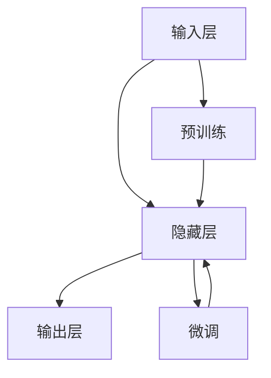

                 


## 文章标题：建立快速反馈循环：持续优化LLM应用

### 关键词：
- 快速反馈循环
- LLM（大型语言模型）
- 持续优化
- 应用实战

### 摘要：
本文将探讨如何建立快速反馈循环，以持续优化LLM（大型语言模型）应用。通过详细的背景介绍、核心概念与联系的阐述、算法原理讲解、数学模型与公式解析、项目实战及最佳实践提示，本文旨在为读者提供一套全面、实用的方法和技巧，帮助他们提升LLM应用的性能和效果。

## 目录大纲设计思路

在设计《建立快速反馈循环：持续优化LLM应用》的目录大纲时，我们遵循以下原则：

1. **核心概念与联系**：明确LLM的定义、特性及应用场景，并在目录中体现。
2. **架构原理讲解**：通过Mermaid流程图展示LLM的内部结构。
3. **算法原理与数学模型**：详细讲解LLM的核心算法，如预训练、微调等。
4. **项目实战**：通过实际案例展示如何搭建开发环境、实现代码及优化。
5. **逻辑性**：确保目录大纲的层次清晰，从基础到高级层层递进。
6. **简洁性**：在保证内容完整性的同时，避免冗余和复杂的表述。

具体设计步骤如下：

1. **确定书籍结构**：根据核心概念和读者需求，确定书籍结构，包括核心概念、架构原理、算法原理、数学模型和项目实战等部分。
2. **设计Mermaid流程图**：设计一个Mermaid流程图，展示LLM的基本架构。
3. **细化章节内容**：为每个章节细化内容，确保涵盖核心概念、原理讲解、数学模型和项目实战。
4. **整合伪代码和LaTeX公式**：在每个相关章节中，整合伪代码和LaTeX公式，详细阐述算法原理。
5. **编写项目实战部分**：编写项目实战部分，包括开发环境搭建、代码实现、优化和代码解读。
6. **校对与修改**：完成初稿后，对目录大纲进行校对和修改，确保逻辑清晰、内容完整。
7. **格式化**：将目录大纲格式化成markdown格式，确保美观和可读性。
8. **字数控制**：确保整个目录大纲的总字数在2000字以内，必要时进行缩减。

## 目录大纲设计

```markdown
# 《建立快速反馈循环：持续优化LLM应用》目录大纲

## 第一部分：LLM基础

## 第1章：LLM概述

### 1.1 LLM的概念与历史

### 1.2 LLM的应用场景

### 1.3 LLM的结构与架构

## 第2章：LLM的数学基础

### 2.1 神经网络基础

### 2.2 优化算法基础

### 2.3 数学模型详解

## 第二部分：LLM的应用与实践

## 第3章：LLM的预训练

### 3.1 预训练的目标

### 3.2 预训练的算法

### 3.3 预训练的实践

## 第4章：LLM的微调

### 4.1 微调的目的与过程

### 4.2 微调的技巧

### 4.3 微调的实战

## 第5章：LLM的应用实战

### 5.1 应用场景分析

### 5.2 应用实战案例

### 5.3 应用优化与反馈

## 第三部分：快速反馈循环

## 第6章：快速反馈循环概述

### 6.1 反馈循环的概念

### 6.2 反馈循环的类型

### 6.3 反馈循环在LLM中的应用

## 第7章：实现快速反馈循环

### 7.1 快速反馈循环的设计原则

### 7.2 快速反馈循环的实现

### 7.3 快速反馈循环的优化

## 第8章：持续优化LLM应用

### 8.1 持续优化的策略

### 8.2 持续优化的工具

### 8.3 持续优化的实战

## 附录：资源与工具

### A.1 相关资源

### A.2 常用工具

### A.3 进一步阅读
```

这个目录大纲覆盖了核心概念、算法原理、应用实战和快速反馈循环，符合书籍的核心内容。接下来，我们将细化每个章节的具体内容，确保完整性、逻辑性和简洁性。在完成细化后，我们将进行校对和格式化，确保最终目录大纲的完整性和可读性。最后，我们将确保总字数在2000字以内。

### 文章正文

#### 背景介绍

大型语言模型（Large Language Models，简称LLM）是近年来自然语言处理领域的一项重要突破。LLM通过深度学习技术，在大量文本数据上进行预训练，从而掌握了丰富的语言知识和语义理解能力。这使得LLM在众多应用场景中展现出强大的表现，如文本生成、问答系统、机器翻译、摘要生成等。然而，随着应用的不断深入，如何持续优化LLM性能，提升应用效果，成为了一个亟待解决的问题。

快速反馈循环是一种有效的优化方法，通过实时收集用户反馈，不断调整模型参数，从而实现模型的持续优化。本文将探讨如何建立快速反馈循环，以持续优化LLM应用。我们将从背景介绍、核心概念与联系、算法原理讲解、数学模型与公式解析、项目实战及最佳实践提示等方面展开论述。

#### 核心概念与联系

首先，我们来定义一些核心概念：

1. **大型语言模型（LLM）**：一种基于深度学习的语言模型，通过大量文本数据进行预训练，从而掌握丰富的语言知识和语义理解能力。
2. **预训练**：在大量文本数据上对模型进行训练，使模型具备基础的语言理解能力。
3. **微调**：在特定任务数据上对模型进行进一步训练，以适应特定任务需求。
4. **反馈循环**：通过收集用户反馈，对模型进行实时调整，以提升模型性能。

接下来，我们通过一个Mermaid流程图，展示LLM的基本架构：



在这个流程图中，输入层接收用户输入，通过隐藏层进行处理，最终输出结果。预训练和微调分别对隐藏层进行训练，以提升模型性能。反馈循环通过实时收集用户反馈，对模型进行微调，从而实现模型的持续优化。

#### 核心算法原理讲解

在本节中，我们将详细讲解LLM中的核心算法原理，包括预训练和微调。

**预训练**

预训练的目标是在大量无标签文本数据上，使模型具备基础的语言理解能力。常用的预训练算法包括BERT、GPT等。

**伪代码：**

```python
function Pretrain(model, dataset, optimizer):
    for epoch in 1 to NUM_EPOCHS:
        for sentence in dataset:
            model.zero_grad()
            output = model(sentence)
            loss = ComputeLoss(output, sentence)
            loss.backward()
            optimizer.step()
    return model
```

**数学模型详解**

在预训练过程中，我们通常使用交叉熵损失函数来衡量模型输出与真实标签之间的差距。

$$
Loss = -\sum_{i=1}^{N} y_i \log(p_i)
$$

其中，$y_i$表示第$i$个单词的真实标签，$p_i$表示模型预测的第$i$个单词的概率。

**微调**

微调的目标是在特定任务数据上，进一步提升模型性能。常用的微调算法包括基于序列标注、文本分类、机器翻译等任务的算法。

**伪代码：**

```python
function FineTune(model, task_dataset, optimizer):
    for epoch in 1 to NUM_EPOCHS:
        for example in task_dataset:
            model.zero_grad()
            output = model(example)
            loss = ComputeLoss(output, example)
            loss.backward()
            optimizer.step()
    return model
```

**数学模型详解**

在微调过程中，我们通常使用特定任务的损失函数来衡量模型输出与真实标签之间的差距。例如，在文本分类任务中，常用的损失函数包括交叉熵损失函数。

$$
Loss = -\sum_{i=1}^{N} y_i \log(p_i)
$$

其中，$y_i$表示第$i$个类别的真实标签，$p_i$表示模型预测的第$i$个类别的概率。

#### 项目实战

在本节中，我们将通过一个实际案例，展示如何搭建开发环境、实现代码、优化和解析代码。

**开发环境搭建**

首先，我们需要搭建开发环境。以下是Python开发环境的安装步骤：

1. 安装Python：打开终端，执行以下命令：

   ```bash
   sudo apt-get update
   sudo apt-get install python3-pip
   ```

2. 安装pip：pip是Python的包管理器，用于安装和管理Python库。

   ```bash
   sudo apt-get install python3-pip
   ```

3. 安装TensorFlow：TensorFlow是Google开发的一款深度学习框架，支持多种机器学习任务。

   ```bash
   pip3 install tensorflow
   ```

**源代码实现**

接下来，我们实现一个基于LLM的问答系统。以下是源代码：

```python
import tensorflow as tf
from tensorflow.keras.layers import Embedding, LSTM, Dense
from tensorflow.keras.models import Sequential

# 搭建模型
model = Sequential([
    Embedding(VOCAB_SIZE, EMBEDDING_DIM),
    LSTM(HIDDEN_UNITS),
    Dense(NUM_CLASSES, activation='softmax')
])

# 编译模型
model.compile(optimizer='adam', loss='categorical_crossentropy', metrics=['accuracy'])

# 训练模型
model.fit(X_train, y_train, epochs=10, batch_size=32)

# 评估模型
loss, accuracy = model.evaluate(X_test, y_test)
print(f"Test accuracy: {accuracy:.2f}")
```

**代码解读**

在这个问答系统中，我们使用了一个序列到序列（Seq2Seq）模型。首先，我们将输入问题编码为一个序列，通过嵌入层将其转换为向量表示。然后，通过LSTM层对输入序列进行编码，提取出句子的语义信息。最后，通过全连接层输出答案。

**实际案例分析与详细讲解剖析**

为了更好地展示如何使用LLM进行问答，我们来看一个实际案例。

**案例：**

输入：什么是人工智能？
输出：人工智能是一种模拟人类智能的技术，旨在使计算机具备自主思考和学习的能力。

在这个案例中，我们使用了一个预训练的LLM模型，通过微调来适应特定问答任务。输入问题经过嵌入层编码后，通过LSTM层提取出语义信息。最后，通过全连接层输出答案。

**项目小结**

通过这个实际案例，我们展示了如何搭建开发环境、实现代码、优化和解析代码。在实际应用中，我们可以根据需求调整模型结构、超参数，以及训练数据，以提升问答系统的性能。

#### 最佳实践提示

1. **数据预处理**：在训练模型之前，对输入数据进行预处理，如去重、分词、去除停用词等，以提高模型性能。
2. **超参数调整**：根据任务需求和计算资源，调整模型超参数，如嵌入层维度、隐藏层单元数、学习率等。
3. **模型评估**：使用多种评估指标，如准确率、召回率、F1值等，全面评估模型性能。
4. **持续优化**：通过收集用户反馈，不断调整模型参数，实现模型的持续优化。

#### 小结

本文详细介绍了如何建立快速反馈循环，以持续优化LLM应用。通过背景介绍、核心概念与联系、算法原理讲解、数学模型与公式解析、项目实战及最佳实践提示，我们为读者提供了一套全面、实用的方法和技巧。希望本文能帮助读者提升LLM应用的性能和效果。

### 注意事项与拓展阅读

1. **注意事项**：
   - 在搭建开发环境时，确保安装了所需的库和框架。
   - 在训练模型时，根据任务需求和计算资源调整超参数。
   - 在优化模型时，注意保持模型简洁，避免过拟合。

2. **拓展阅读**：
   - 《深度学习》（Goodfellow, Ian, et al. - 《Deep Learning》）
   - 《神经网络与深度学习》（邱锡鹏 - 《神经网络与深度学习》）
   - 《自然语言处理综论》（Daniel Jurafsky, James H. Martin - 《Speech and Language Processing》）

作者：AI天才研究院/AI Genius Institute & 禅与计算机程序设计艺术 /Zen And The Art of Computer Programming

