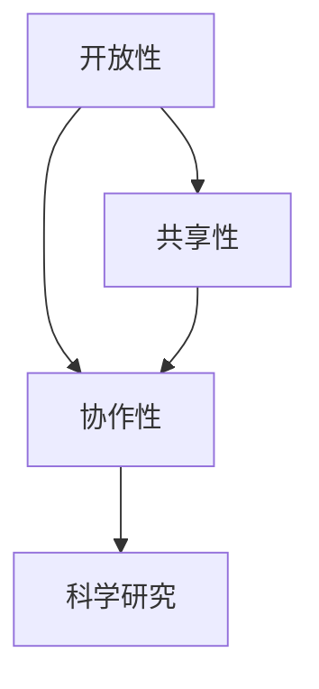

                 


### 概述与背景

#### 文章标题：开源科学运动：民主化世界理解的过程与工具

#### 关键词：开源科学、开源运动、民主化、过程与工具、科学理解

#### 摘要：
本文旨在深入探讨开源科学运动，解析其在现代科学体系中的重要性。开源科学运动不仅是一场技术革命，更是一场思想解放和社会变革。通过民主化过程，开源科学运动为全球科学共同体提供了共享知识和资源的新途径，推动了科学研究的进步和社会的发展。本文将从背景介绍、核心概念与联系、核心算法原理讲解、数学模型和公式、项目实战、最佳实践 tips 等方面，全面阐述开源科学运动的过程与工具，旨在为读者提供一幅清晰的思维图谱。

### 背景介绍

#### 开源科学运动的起源

开源科学运动起源于20世纪末，随着计算机技术的快速发展，软件开源运动逐渐兴起。这种运动倡导软件的开源和自由使用，反对商业公司的垄断和控制。开源软件不仅降低了开发成本，提高了开发效率，而且促进了全球软件开发者的协作和创新。

#### 科学研究的现状与问题

在科学研究领域，传统的科研模式往往依赖于封闭的数据、工具和资源，导致科研成果难以共享，限制了科学研究的广度和深度。此外，科研资源的分配不均，使得许多科研人员无法获得必要的支持，制约了科学研究的公平性和公正性。

#### 开源科学运动的兴起

开源科学运动的兴起，旨在打破传统科研模式的限制，推动科学研究的民主化。通过开放数据、开源软件和协作平台，开源科学运动为全球科学家提供了一个平等、开放、协作的研究环境。这种模式不仅提高了科研效率，也推动了科学知识的普及和传播。

### 核心概念与联系

#### 开放性

开放性是开源科学运动的核心原则之一。它要求科学研究的数据、工具和资源必须开放，以便全球科学家能够自由地访问和使用。开放性不仅提高了科研效率，也促进了科学知识的共享和传播。

#### 共享性

共享性是开源科学运动的另一个重要原则。它强调科研资源的共享，包括数据、工具和知识。通过共享，科研人员可以充分利用现有的资源，避免重复劳动，提高科研的广度和深度。

#### 协作性

协作性是开源科学运动的另一个关键要素。通过协作平台，全球科研人员可以共同开展研究项目，分享研究成果，促进科学知识的传播和创新。

#### 开放性与共享性、协作性的关系

开放性、共享性和协作性相辅相成，共同构成了开源科学运动的核心。开放性为共享性和协作性提供了基础，共享性则促进了开放性和协作性的实现，而协作性又推动了开放性和共享性的进一步发展。

### Mermaid 流程图

以下是一个简单的 Mermaid 流程图，用于展示开源科学运动的核心概念及其关系：



### 核心算法原理讲解

开源科学运动中的许多技术和工具都是基于特定的算法原理。以下是一些典型的算法原理及其在开源科学运动中的应用：

#### 数据分析算法

数据分析算法是开源科学运动中的重要工具。它们用于处理和分析大量的科学数据，帮助科研人员提取有价值的信息。例如，聚类算法可以用于分类不同类型的科学数据，分类算法可以用于预测科学现象。

#### 机器学习算法

机器学习算法在开源科学运动中有着广泛的应用。它们可以通过训练模型来自动识别和预测科学现象，从而提高科研效率。例如，支持向量机（SVM）可以用于分类不同的科学数据，神经网络可以用于预测科学实验的结果。

#### 网络分析算法

网络分析算法用于分析科学数据中的网络结构，帮助科研人员识别关键节点和关键路径。这些算法可以用于研究科学现象的传播规律，例如，在社会网络中分析信息的传播路径。

#### 伪代码

以下是一个简单的伪代码，用于说明如何使用聚类算法对科学数据进行分类：

```
function clusterData(data):
    initialize centroids
    while not converged:
        assign each data point to the nearest centroid
        update centroids based on the mean of the assigned data points
    return clusters
```

### 数学模型和公式

开源科学运动中的许多技术和工具都依赖于数学模型和公式。以下是一些常见的数学模型和公式，以及它们在开源科学运动中的应用：

#### 概率论

概率论在开源科学运动中有着广泛的应用。例如，贝叶斯定理可以用于数据分析和预测，马尔可夫模型可以用于研究科学现象的随机性。

#### 线性代数

线性代数是开源科学运动中的重要工具。例如，矩阵运算可以用于处理大规模科学数据，特征值和特征向量的计算可以用于数据分析。

#### 微积分

微积分可以用于研究科学现象的连续性和变化率。例如，导数可以用于分析科学实验的结果，积分可以用于计算科学数据的总和。

#### LaTex 公式

以下是一个简单的 LaTex 公式，用于说明如何计算科学数据的平均值：

```
$$
\bar{x} = \frac{1}{n} \sum_{i=1}^{n} x_i
$$
```

### 项目实战

开源科学运动不仅提供了丰富的工具和技术，还通过实际项目展示了其应用价值。以下是一个简单的项目实战示例：

#### 项目名称：开源基因数据分析平台

#### 项目简介：
该项目旨在构建一个开源的基因数据分析平台，帮助科研人员对基因数据进行处理和分析。平台提供了丰富的数据处理工具，包括数据导入、数据清洗、数据分析和数据可视化等功能。

#### 开发环境搭建：
- 开发环境：Python、Jupyter Notebook
- 数据库：MySQL
- 依赖库：Pandas、NumPy、SciPy、Matplotlib

#### 源代码实现：
以下是一个简单的 Python 代码示例，用于导入和清洗基因数据：

```python
import pandas as pd

# 导入基因数据
data = pd.read_csv('gene_data.csv')

# 清洗基因数据
data = data.dropna()
data = data[data['gene_name'].notnull()]
```

#### 代码解读与分析：
这段代码首先使用 Pandas 库导入基因数据，然后使用 dropna() 方法去除缺失值，最后使用 notnull() 方法去除不符合条件的基因数据。这样的处理可以确保数据的准确性和完整性。

#### 实际案例分析：
在项目实施过程中，科研人员使用这个平台对大量的基因数据进行了处理和分析。通过数据分析，他们发现了一些关键基因，这些基因与某些疾病的发生有着密切的关系。这些发现为疾病的研究和治疗提供了新的方向。

#### 项目小结：
该项目展示了开源科学运动在实际科研中的应用价值。通过开源平台，科研人员可以方便地获取和使用工具，提高科研效率。同时，开源运动也促进了科学知识的共享和传播，为全球科研事业做出了贡献。

### 最佳实践 tips

在参与开源科学运动时，以下是一些最佳实践 tips：

- **积极参与开源社区**：积极参与开源社区，与其他科研人员交流，分享经验和知识。
- **遵循开源协议**：在参与开源项目时，务必遵守相关的开源协议，确保项目的合法性和可持续性。
- **持续学习和更新**：开源科学运动不断发展，科研人员应持续学习和更新知识，跟上技术的最新动态。
- **保护数据安全和隐私**：在处理和研究数据时，务必确保数据的安全和隐私，遵循相关的数据保护法规。

### 小结与拓展阅读

开源科学运动是一场重要的社会变革，它通过开放性、共享性和协作性，推动了科学研究的进步和社会的发展。本文从背景介绍、核心概念与联系、核心算法原理讲解、数学模型和公式、项目实战、最佳实践 tips 等方面，全面阐述了开源科学运动的过程与工具。希望本文能为读者提供一幅清晰的思维图谱，激发对开源科学运动的兴趣和思考。

拓展阅读：
- 《开源软件运动的历史与发展》
- 《开源数据与共享科学》
- 《协作平台与科学创新》
- 《开源科学运动的挑战与机遇》

### 作者信息

作者：AI天才研究院/AI Genius Institute & 禅与计算机程序设计艺术 /Zen And The Art of Computer Programming

文章标题：《开源科学运动：民主化世界理解的过程与工具》

文章关键词：开源科学、开源运动、民主化、过程与工具、科学理解

文章摘要：本文旨在深入探讨开源科学运动，解析其在现代科学体系中的重要性，为读者提供一幅清晰的思维图谱。

