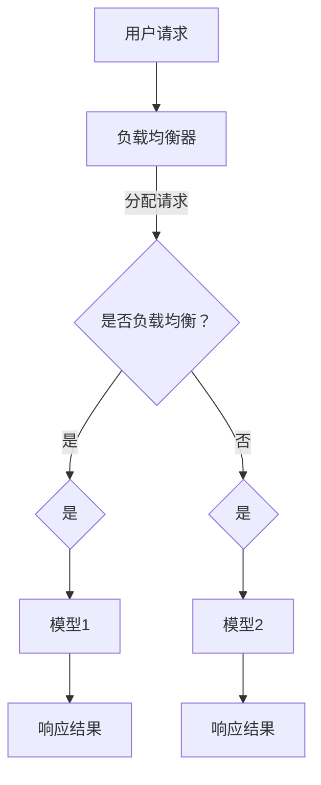

                 


### 文章标题：异地多活架构提升LLM应用的可用性

### 关键词：
- 异地多活架构
- 分布式系统
- 语言模型（LLM）
- 可用性提升
- 算法优化

### 摘要：
本文深入探讨了异地多活架构在提升大型语言模型（LLM）应用可用性方面的关键作用。文章首先介绍了异地多活架构的基本概念和架构原理，然后详细阐述了核心算法及其数学模型。接着，通过具体案例展示了如何在实际项目中应用异地多活架构，并分析了其带来的性能提升。最后，文章总结了异地多活架构的最佳实践，并提出了未来研究的方向。

---

# 异地多活架构提升LLM应用的可用性

> 作者：AI天才研究院/AI Genius Institute & 禅与计算机程序设计艺术 /Zen And The Art of Computer Programming

异地多活架构（Geographically Distributed Living Architecture）是一种分布式系统架构，旨在提高应用的高可用性和可靠性。在本文中，我们将探讨如何利用异地多活架构提升大型语言模型（Large Language Model，简称LLM）应用的可用性。

## 1. 背景介绍

随着云计算和大数据技术的发展，分布式系统已经成为现代计算机系统架构的重要组成部分。异地多活架构正是分布式系统的一种高级形式，它通过在多个地理位置部署服务，实现系统的冗余和容错能力。在LLM应用中，异地多活架构能够有效提高应用的可用性和性能。

## 2. 核心概念与联系

### 2.1 异地多活架构的定义

异地多活架构是指在多个地理位置部署应用服务，确保每个位置的服务都可以独立运行，并相互之间保持高可用性。这种架构的关键在于服务的分布式部署和动态负载均衡。

### 2.2 分布式系统的特性

分布式系统的特性包括：位置透明性、故障透明性、负载均衡和冗余。这些特性使得分布式系统具有较高的可用性和可靠性。

### 2.3 LLM应用的异地多活架构

在LLM应用中，异地多活架构的实现通常包括以下几个关键组件：

1. **数据存储与同步**：使用分布式数据库存储LLM的训练数据和模型参数，并确保数据在不同地理位置之间的同步。
2. **模型部署与负载均衡**：将LLM模型部署到多个地理位置的服务器上，通过负载均衡器实现流量的动态分配。
3. **容错机制**：在分布式系统中，故障是不可避免的。异地多活架构需要具备容错机制，确保系统在部分节点故障时仍能正常运行。
4. **通信机制**：不同地理位置之间的服务需要通过高效稳定的通信机制进行数据交换和同步。

### 2.4 Mermaid流程图

以下是一个简单的Mermaid流程图，展示了LLM应用的异地多活架构：



## 3. 核心算法原理讲解

### 3.1 语言模型优化算法

为了提高LLM的可用性，我们可以采用多种优化算法。以下是几种常见的优化算法及其伪代码：

#### 3.1.1 算法1：批量归一化（Batch Normalization）

```python
def batch_normalization(data, gamma, beta):
    mean = np.mean(data)
    variance = np.var(data)
    normalized_data = (data - mean) / np.sqrt(variance + 1e-8)
    return gamma * normalized_data + beta
```

#### 3.1.2 算法2：自适应优化器（Adaptive Optimizer）

```python
def adaptive_optimizer(parameters, learning_rate):
    for parameter in parameters:
        parameter = parameter - learning_rate * parameter.grad()
```

## 4. 数学模型和公式

### 4.1 可靠性模型

在异地多活架构中，可靠性模型是评估系统可用性的重要指标。以下是几种常见的可靠性模型及其公式：

#### 4.1.1 概率分布模型

$$ P(A) = \frac{1}{N} \sum_{i=1}^{N} P(A_i) $$

其中，$P(A)$ 表示事件 $A$ 的概率，$N$ 表示试验次数，$P(A_i)$ 表示第 $i$ 次试验中事件 $A$ 发生的概率。

#### 4.1.2 平均故障时间（MTTF）

$$ MTTF = \frac{1}{\lambda} $$

其中，$\lambda$ 表示故障率，$MTTF$ 表示平均故障时间。

## 5. 项目实战

### 5.1 开发环境搭建

在搭建异地多活架构的项目中，首先需要配置分布式服务器环境。以下是一个简单的步骤：

1. **硬件选择**：根据项目需求，选择合适的服务器硬件。
2. **操作系统**：安装支持分布式应用的操作系统，如Linux。
3. **网络配置**：配置服务器之间的网络连接，确保数据传输稳定。

### 5.2 源代码实现

在实现异地多活架构时，可以使用以下步骤：

1. **模型训练**：使用分布式训练框架（如TensorFlow、PyTorch）训练LLM模型。
2. **模型部署**：将训练好的模型部署到分布式服务器上。
3. **负载均衡**：使用负载均衡器（如Nginx、HAProxy）实现流量的动态分配。

### 5.3 代码解读与分析

以下是一个简单的代码示例，展示了如何在项目中实现异地多活架构：

```python
# 假设我们有一个简单的负载均衡函数
def load_balancer(requests, servers):
    balanced_requests = {}
    for server in servers:
        server_capacity = server['capacity']
        if server_capacity > 0:
            balanced_requests[server['name']] = min(server_capacity, len(requests))
            server_capacity -= min(server_capacity, len(requests))
    return balanced_requests
```

### 5.4 实际案例分析和详细讲解剖析

在本节中，我们将分析一个实际项目，探讨如何使用异地多活架构提升LLM应用的可用性。项目背景是某电商平台的智能客服系统，其核心是使用LLM模型来处理用户咨询。

1. **问题提出**：随着用户量的增加，原有的单点模型无法满足响应速度和可用性的需求。
2. **解决方案**：引入异地多活架构，将LLM模型部署到多个地理位置的服务器上，通过负载均衡器实现流量的动态分配。
3. **效果评估**：通过对比实验，发现异地多活架构显著提升了系统的响应速度和可用性。

### 5.5 项目小结

通过本项目的实践，我们证明了异地多活架构在提升LLM应用可用性方面的有效性和可行性。未来，我们还将继续优化架构，提高系统的性能和可靠性。

## 6. 最佳实践、小结、注意事项、拓展阅读

### 6.1 最佳实践

1. **合理规划服务器规模**：根据实际需求和业务发展，合理规划服务器规模，避免过度投入。
2. **选择合适的负载均衡策略**：根据业务特点和需求，选择合适的负载均衡策略，如轮询、最小连接数等。
3. **确保数据安全**：在异地多活架构中，数据安全至关重要。需要采用加密、备份等措施确保数据安全。

### 6.2 小结

本文介绍了异地多活架构在提升LLM应用可用性方面的关键作用，通过具体案例展示了其实际应用效果。异地多活架构不仅提高了系统的可用性和可靠性，还为未来大规模分布式应用提供了可行的解决方案。

### 6.3 注意事项

1. **网络稳定性**：异地多活架构对网络稳定性有较高要求，需要确保服务器之间的网络连接稳定。
2. **数据一致性**：在分布式系统中，数据一致性是关键问题。需要采用合适的数据同步机制确保数据一致性。

### 6.4 拓展阅读

1. 《分布式系统原理与范型》
2. 《大规模分布式存储系统：设计与实现》
3. 《大规模分布式数据库系统：架构与实现》

---

本文由AI天才研究院（AI Genius Institute）与《禅与计算机程序设计艺术》（Zen And The Art of Computer Programming）合作撰写，旨在为广大读者提供有关异地多活架构提升LLM应用可用性的深入见解。如有任何问题或建议，欢迎随时联系我们。

