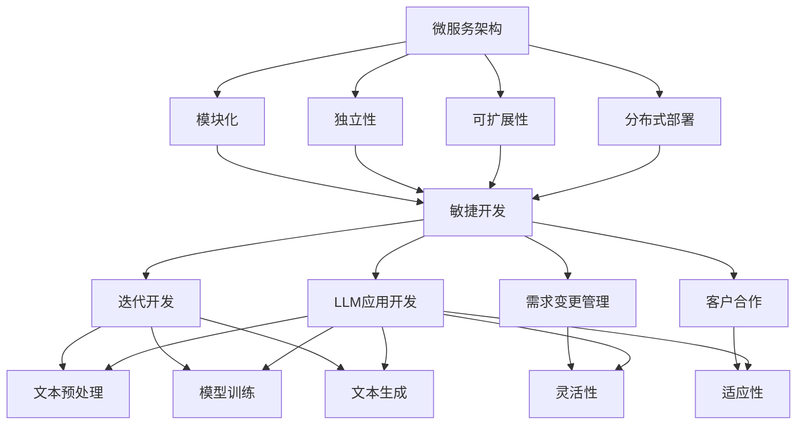

                 


### 文章标题
《微服务架构在敏捷LLM应用开发中的应用》

### 文章关键词
微服务架构、敏捷开发、LLM应用、技术实践、系统设计

### 文章摘要
本文将深入探讨微服务架构在敏捷自然语言处理（LLM）应用开发中的应用。首先，我们将介绍微服务架构的基础概念、特点及其与传统架构的比较。接着，我们会讲解微服务的设计原则、开发框架和通信机制，并探讨其在部署与治理方面的策略。随后，我们将重点分析敏捷开发方法论，包括核心原则、流程和工具，以及LLM应用的基础知识和核心技术的介绍。本文的核心部分将展示微服务架构在LLM应用开发中的优势，通过具体设计案例和部署治理实践，详细讲解微服务架构的实际应用。最后，我们将通过一个项目实战案例，展示微服务架构在敏捷LLM应用开发中的实施过程，并进行项目总结与展望。希望通过本文的阐述，读者能够对微服务架构在敏捷LLM应用开发中的价值有更深入的理解。

## 第一部分：微服务架构概述

### 第1章：微服务架构基础

#### 1.1 微服务架构的定义与特点
微服务架构（Microservices Architecture）是一种基于分布式系统的架构风格，旨在通过将应用程序构建为一组独立的服务来实现模块化、灵活性和可扩展性。每个微服务都是小型、独立、自包含的应用程序，可以独立部署、扩展和更新，同时通过轻量级通信机制（如HTTP/REST、消息队列等）进行交互。

微服务架构的核心特点如下：

- **模块化**：每个微服务都具有明确的职责，可以独立开发、测试和部署。
- **独立性**：微服务之间松耦合，彼此独立运行，不会因为某个服务的故障而导致整个系统的崩溃。
- **可扩展性**：可以根据需求独立扩展特定的微服务，而不是整个应用程序。
- **分布式**：微服务可以在不同的服务器上运行，形成分布式系统，提高系统的容错能力和可扩展性。

#### 1.2 微服务架构与传统架构的比较
传统架构通常采用单体架构（Monolithic Architecture），其中应用程序作为一个单一、集中的实体构建和部署。这种架构的优点是开发简单、易于维护，但其缺点也很明显：

- **高耦合性**：应用程序的各个部分高度耦合，导致变更和扩展困难。
- **不易测试**：整个应用程序作为一个整体进行测试，使得测试复杂度和风险增加。
- **扩展困难**：扩展整个应用程序需要考虑各个部分的影响，往往导致性能下降。

相比之下，微服务架构通过模块化、独立性和分布式特性，克服了传统架构的缺点，提高了系统的灵活性和可扩展性。

#### 1.3 微服务架构的核心组件
微服务架构的核心组件包括：

- **服务注册与发现**：服务注册与发现机制用于管理微服务的注册和查询，使得其他服务可以动态发现并调用其他服务的接口。
- **API网关**：API网关作为客户端与微服务之间的中介，提供统一的接口，处理请求路由、身份验证、负载均衡等任务。
- **配置中心**：配置中心用于管理微服务的配置信息，使得各个服务可以共享配置，方便变更和更新。
- **服务间通信**：服务间通信机制（如HTTP/REST、消息队列等）用于微服务之间的交互和数据传递。
- **监控与运维**：监控与运维工具用于监控微服务的运行状态、性能指标和日志信息，以便及时发现问题并进行优化。

通过这些核心组件，微服务架构能够实现模块化、独立性和分布式特性，提高系统的灵活性和可扩展性。

## 第二部分：敏捷开发与LLM应用

### 第2章：敏捷开发方法论

#### 2.1 敏捷开发的核心原则
敏捷开发（Agile Development）是一种以人为核心、迭代、增量和灵活响应变更的软件开发方法论。其核心原则包括：

- **个体和互动重于过程和工具**：重视团队成员的沟通和协作，而不仅仅是依赖工具和过程。
- **可工作的软件重于详尽的文档**：重视实际可运行的软件，而不是过多的文档。
- **客户合作重于合同谈判**：与客户紧密合作，确保需求满足和产品迭代。
- **响应变化重于遵循计划**：灵活应对需求变化，而不是坚持原有的计划。

#### 2.2 敏捷开发流程
敏捷开发通常采用迭代（Iteration）和增量（Incremental）的方式进行。其基本流程包括：

1. **需求收集与规划**：与客户和利益相关者合作，收集并整理需求，进行优先级排序和规划。
2. **迭代开发**：将需求划分为若干个迭代周期，每个迭代周期产出可工作的软件。
3. **评审与回顾**：在每个迭代结束时，进行评审，评估产品质量和团队绩效，并进行回顾，改进下一迭代的过程和策略。

#### 2.3 敏捷开发工具与实践
敏捷开发采用多种工具和实践来支持其核心原则和流程。常见的敏捷开发工具包括：

- **Scrum**：一种流行的敏捷开发框架，包括冲刺（Sprint）、每日站会（Daily Stand-up）、回顾（Review）和反思（Retrospective）等活动。
- **Kanban**：一种可视化工作流程的工具，通过看板（Kanban Board）来跟踪和管理工作进度。
- **看板（Kanban）**：一种可视化工作流程的工具，通过看板（Kanban Board）来跟踪和管理工作进度。
- **用户故事（User Story）**：一种描述用户需求的简单格式，通常包括用户角色、目标功能和应用场景。
- **自动化测试**：通过编写自动化测试脚本，确保软件质量和减少测试时间。

#### 2.4 敏捷开发的优势与挑战
敏捷开发具有以下优势：

- **快速响应变更**：敏捷开发通过迭代和增量方式，能够快速响应需求变化，提高产品的市场竞争力。
- **提高质量**：自动化测试和持续集成（CI）等实践，有助于提高软件质量和减少缺陷。
- **增强团队协作**：通过团队成员的沟通和协作，提高团队效率和满意度。

然而，敏捷开发也面临一些挑战，如：

- **需求变更管理**：频繁的需求变更可能导致项目范围扩大，影响进度和质量。
- **团队协作难度**：敏捷开发要求团队成员具有高水平的沟通和协作能力，否则可能导致项目进展受阻。
- **工具选择**：选择合适的敏捷开发工具和实践，需要团队具备一定的专业知识和经验。

### 第3章：LLM应用基础

#### 3.1 LLM概述
自然语言处理（Natural Language Processing，NLP）是人工智能领域的一个重要分支，旨在使计算机理解和处理人类语言。大型语言模型（Large Language Model，LLM）是一种基于深度学习的技术，通过训练大规模的神经网络模型，使其能够理解和生成自然语言。

LLM的应用范围非常广泛，包括但不限于：

- **机器翻译**：将一种语言的文本翻译成另一种语言。
- **文本摘要**：从长文本中提取关键信息，生成简短的摘要。
- **问答系统**：根据用户的问题，提供准确的答案。
- **语音识别**：将语音信号转换为文本。
- **文本分类**：根据文本的内容，将其分类到不同的类别中。

#### 3.2 LLM的核心技术
LLM的核心技术包括：

- **深度学习**：通过多层神经网络，从大规模数据中学习特征表示和规律。
- **自然语言处理**：对文本进行预处理、分词、词性标注等操作，提取文本中的有用信息。
- **序列到序列模型（Seq2Seq）**：通过编码器和解码器，将输入序列映射到输出序列。
- **注意力机制（Attention Mechanism）**：在处理长文本时，关注文本中的重要信息，提高模型的准确性和效率。

#### 3.3 LLM应用场景
LLM在多个应用场景中取得了显著的成果，以下是一些典型的应用场景：

- **客户服务**：通过聊天机器人，提供24/7的客户支持，提高客户满意度。
- **智能助手**：为用户提供个性化的服务，如语音助手、智能推荐系统等。
- **新闻摘要**：自动生成新闻摘要，节省用户阅读时间。
- **学术研究**：辅助研究人员进行文本分析、数据挖掘等任务。
- **教育领域**：提供智能辅导、自动评分等工具，提高教学效果。

#### 3.4 LLM的优势与挑战
LLM具有以下优势：

- **强大的语言理解能力**：通过训练大规模的神经网络模型，LLM能够理解和生成高质量的自然语言文本。
- **高效的文本处理速度**：LLM能够快速处理大量的文本数据，提高处理效率。
- **广泛的适用性**：LLM适用于多个应用场景，如机器翻译、文本摘要、问答系统等。

然而，LLM也面临一些挑战，如：

- **数据隐私**：在训练和部署LLM时，需要处理大量的用户数据，可能引发数据隐私和安全问题。
- **模型解释性**：深度学习模型通常缺乏解释性，难以理解模型的工作原理。
- **资源消耗**：训练和部署LLM需要大量的计算资源和存储空间，可能带来成本压力。

## 第三部分：微服务架构在LLM应用开发中的应用

### 第4章：微服务架构在LLM应用开发中的应用

#### 4.1 微服务架构在LLM应用开发中的优势
微服务架构在LLM应用开发中具有显著的优势，主要体现在以下几个方面：

1. **模块化**：LLM应用通常包含多个子任务，如文本预处理、模型训练、文本生成等。微服务架构可以将这些子任务划分为独立的微服务，每个微服务负责一个特定的功能模块，便于开发和维护。
2. **可扩展性**：微服务架构可以根据需求独立扩展特定的微服务，例如，在文本生成模块中添加更多的计算资源，以满足高并发的请求。
3. **灵活性**：微服务架构允许开发者独立部署和更新每个微服务，而不会影响其他微服务的运行。这使得LLM应用能够快速响应需求变化，灵活适应不同的业务场景。
4. **分布式部署**：微服务架构支持分布式部署，可以将微服务部署到不同的服务器上，提高系统的容错能力和性能。

#### 4.2 微服务在LLM应用开发中的设计
在设计LLM应用时，可以遵循以下原则来利用微服务架构：

1. **最小化服务粒度**：每个微服务应负责一个独立且具有明确职责的功能模块，避免服务粒度过大或过小。
2. **接口定义**：为每个微服务定义清晰的API接口，包括输入参数、输出结果和数据格式，确保微服务之间的互操作性。
3. **服务间通信**：采用轻量级的通信机制，如HTTP/REST、消息队列等，确保微服务之间的高效数据传输。
4. **服务治理**：通过服务注册与发现、API网关、配置中心等组件，对微服务进行有效的治理和管理，确保微服务的正常运行和协同工作。

#### 4.3 微服务在LLM应用开发中的部署与治理
在部署和治理LLM应用时，可以采取以下策略：

1. **容器化与编排**：使用容器化技术（如Docker）将微服务打包成独立的容器，方便部署和扩展。同时，采用编排工具（如Kubernetes）进行自动化部署和管理。
2. **监控与日志**：使用监控工具（如Prometheus、Grafana）和日志收集工具（如ELK Stack）对微服务进行监控和日志分析，及时发现并解决问题。
3. **负载均衡**：使用负载均衡器（如Nginx、HAProxy）均衡微服务的请求负载，确保系统的稳定运行和高可用性。
4. **服务治理**：通过服务注册与发现、API网关、配置中心等组件，对微服务进行有效的治理和管理，确保微服务的正常运行和协同工作。

#### 4.4 微服务架构在LLM应用开发中的实践案例
以下是一个微服务架构在LLM应用开发中的实践案例：

1. **项目背景**：某公司开发一个基于自然语言处理技术的智能客服系统，旨在为用户提供实时、准确的客户支持。
2. **需求分析**：项目需求包括文本预处理、模型训练、文本生成和对话管理等多个子任务。
3. **架构设计**：采用微服务架构，将文本预处理、模型训练、文本生成和对话管理划分为独立的微服务，分别部署到不同的服务器上。
4. **开发过程**：每个微服务采用独立的开发、测试和部署流程，确保系统的模块化和可扩展性。
5. **部署与治理**：使用Docker和Kubernetes进行容器化部署和管理，采用Prometheus和Grafana进行监控，使用ELK Stack进行日志收集和分析。

通过这个案例，展示了微服务架构在LLM应用开发中的应用，实现了系统的模块化、可扩展性和灵活性。

## 第5章：项目实战

### 5.1 项目背景与需求分析
在本章中，我们将通过一个实际项目案例，详细介绍微服务架构在敏捷LLM应用开发中的具体实施过程。本项目旨在开发一款智能问答系统，该系统需要能够处理大量用户问题，并提供准确的答案。项目背景包括以下方面：

1. **业务需求**：公司需要一个智能问答系统，以支持客户服务团队快速响应用户问题，提高客户满意度。
2. **性能需求**：系统需要具备高并发处理能力，能够快速响应用户请求。
3. **可扩展性**：随着用户数量的增加，系统需要能够水平扩展，以保持性能和响应速度。
4. **可靠性**：系统需要具有高可用性，确保在故障情况下能够快速恢复。

### 5.2 项目微服务架构设计
为了满足项目需求，我们采用微服务架构来设计智能问答系统。以下是项目微服务架构的核心设计：

1. **文本预处理微服务**：负责接收用户输入的问题，并进行文本预处理，包括分词、词性标注、停用词过滤等操作。
2. **问答微服务**：接收预处理后的文本，调用预训练的LLM模型，生成相应的答案。
3. **对话管理微服务**：负责管理用户与问答系统的交互，包括用户输入的解析、答案的生成和发送，以及对话历史记录。
4. **API网关**：作为用户请求的统一入口，负责请求路由、身份验证、权限校验等功能。
5. **服务注册与发现**：使用Eureka作为服务注册与发现中心，确保各个微服务能够动态注册和发现其他服务的地址。
6. **配置中心**：使用Spring Cloud Config作为配置中心，集中管理各个微服务的配置信息。

### 5.3 项目开发过程
项目开发过程分为以下阶段：

1. **需求分析**：与客户和利益相关者进行沟通，明确系统需求，制定项目计划。
2. **微服务开发**：根据架构设计，分别开发文本预处理、问答、对话管理微服务。每个微服务独立开发、测试和部署。
3. **集成测试**：将各个微服务进行集成测试，确保它们能够协同工作，满足业务需求。
4. **性能测试**：进行压力测试和性能测试，评估系统在高并发场景下的性能和响应速度。
5. **部署与监控**：将微服务部署到Kubernetes集群中，使用Prometheus和Grafana进行监控，确保系统的正常运行。

### 5.4 项目测试与优化
在项目测试与优化阶段，我们重点关注以下几个方面：

1. **功能测试**：确保系统的各个功能模块（如文本预处理、问答、对话管理）能够正常工作，满足业务需求。
2. **性能优化**：通过调整LLM模型参数、优化服务间通信机制等方式，提高系统的响应速度和处理能力。
3. **容错性测试**：测试系统在故障情况下的容错能力，确保系统能够在发生故障时快速恢复。
4. **安全性测试**：评估系统的安全性，确保用户数据的安全和隐私。

### 5.5 项目总结与展望
通过本项目，我们成功实现了智能问答系统的开发，并采用了微服务架构来提高系统的灵活性、可扩展性和可靠性。项目总结如下：

1. **项目成果**：系统成功上线，实现了快速响应用户请求、准确生成答案的目标。
2. **经验教训**：项目过程中，我们积累了丰富的微服务开发、部署和运维经验，为后续项目提供了有益的借鉴。
3. **未来展望**：随着技术的不断进步和业务需求的变化，我们将持续优化和扩展智能问答系统，提高其性能和用户体验。

## 附录：技术参考资料

### 8.1 微服务相关技术资料
- **微服务架构最佳实践**：https://martinfowler.com/microservices/
- **Spring Cloud微服务框架**：https://spring.io/projects/spring-cloud
- **Docker容器化技术**：https://www.docker.com/
- **Kubernetes集群管理**：https://kubernetes.io/

### 8.2 LLM相关技术资料
- **自然语言处理入门**：https://www.tensorflow.org/tutorials/text
- **Transformer模型详解**：https://arxiv.org/abs/1706.03762
- **BERT模型介绍**：https://arxiv.org/abs/1810.04805

### 8.3 敏捷开发相关工具与资源
- **Scrum方法论**：https://www.scrum.org/
- **Kanban方法论**：https://kanbanize.com/
- **JIRA敏捷开发工具**：https://www.atlassian.com/software/jira

作者：AI天才研究院/AI Genius Institute & 禅与计算机程序设计艺术 /Zen And The Art of Computer Programming

---

### 第一部分：微服务架构概述

#### 1.1 微服务架构的定义与特点

微服务架构是一种基于分布式系统的架构风格，旨在通过将应用程序构建为一组独立的服务来实现模块化、灵活性和可扩展性。每个微服务都是小型、独立、自包含的应用程序，可以独立部署、扩展和更新，同时通过轻量级通信机制（如HTTP/REST、消息队列等）进行交互。

**核心特点**：

- **模块化**：每个微服务具有明确的职责，可以独立开发、测试和部署。
- **独立性**：微服务之间松耦合，彼此独立运行，不会因为某个服务的故障而导致整个系统的崩溃。
- **可扩展性**：可以根据需求独立扩展特定的微服务，而不是整个应用程序。
- **分布式**：微服务可以在不同的服务器上运行，形成分布式系统，提高系统的容错能力和可扩展性。

#### 1.2 微服务架构与传统架构的比较

传统架构通常采用单体架构（Monolithic Architecture），其中应用程序作为一个单一、集中的实体构建和部署。这种架构的优点是开发简单、易于维护，但其缺点也很明显：

- **高耦合性**：应用程序的各个部分高度耦合，导致变更和扩展困难。
- **不易测试**：整个应用程序作为一个整体进行测试，使得测试复杂度和风险增加。
- **扩展困难**：扩展整个应用程序需要考虑各个部分的影响，往往导致性能下降。

相比之下，微服务架构通过模块化、独立性和分布式特性，克服了传统架构的缺点，提高了系统的灵活性和可扩展性。

#### 1.3 微服务架构的核心组件

微服务架构的核心组件包括：

- **服务注册与发现**：服务注册与发现机制用于管理微服务的注册和查询，使得其他服务可以动态发现并调用其他服务的接口。
- **API网关**：API网关作为客户端与微服务之间的中介，提供统一的接口，处理请求路由、身份验证、负载均衡等任务。
- **配置中心**：配置中心用于管理微服务的配置信息，使得各个服务可以共享配置，方便变更和更新。
- **服务间通信**：服务间通信机制（如HTTP/REST、消息队列等）用于微服务之间的交互和数据传递。
- **监控与运维**：监控与运维工具用于监控微服务的运行状态、性能指标和日志信息，以便及时发现问题并进行优化。

通过这些核心组件，微服务架构能够实现模块化、独立性和分布式特性，提高系统的灵活性和可扩展性。

### 第二部分：敏捷开发与LLM应用

#### 2.1 敏捷开发方法论

敏捷开发（Agile Development）是一种以人为核心、迭代、增量和灵活响应变更的软件开发方法论。其核心原则包括：

- **个体和互动重于过程和工具**：重视团队成员的沟通和协作，而不仅仅是依赖工具和过程。
- **可工作的软件重于详尽的文档**：重视实际可运行的软件，而不是过多的文档。
- **客户合作重于合同谈判**：与客户紧密合作，确保需求满足和产品迭代。
- **响应变化重于遵循计划**：灵活应对需求变化，而不是坚持原有的计划。

#### 2.2 敏捷开发流程

敏捷开发通常采用迭代（Iteration）和增量（Incremental）的方式进行。其基本流程包括：

1. **需求收集与规划**：与客户和利益相关者合作，收集并整理需求，进行优先级排序和规划。
2. **迭代开发**：将需求划分为若干个迭代周期，每个迭代周期产出可工作的软件。
3. **评审与回顾**：在每个迭代结束时，进行评审，评估产品质量和团队绩效，并进行回顾，改进下一迭代的过程和策略。

#### 2.3 敏捷开发工具与实践

敏捷开发采用多种工具和实践来支持其核心原则和流程。常见的敏捷开发工具包括：

- **Scrum**：一种流行的敏捷开发框架，包括冲刺（Sprint）、每日站会（Daily Stand-up）、回顾（Review）和反思（Retrospective）等活动。
- **Kanban**：一种可视化工作流程的工具，通过看板（Kanban Board）来跟踪和管理工作进度。
- **用户故事（User Story）**：一种描述用户需求的简单格式，通常包括用户角色、目标功能和应用场景。
- **自动化测试**：通过编写自动化测试脚本，确保软件质量和减少测试时间。

#### 2.4 敏捷开发的优势与挑战

敏捷开发具有以下优势：

- **快速响应变更**：敏捷开发通过迭代和增量方式，能够快速响应需求变化，提高产品的市场竞争力。
- **提高质量**：自动化测试和持续集成（CI）等实践，有助于提高软件质量和减少缺陷。
- **增强团队协作**：通过团队成员的沟通和协作，提高团队效率和满意度。

然而，敏捷开发也面临一些挑战，如：

- **需求变更管理**：频繁的需求变更可能导致项目范围扩大，影响进度和质量。
- **团队协作难度**：敏捷开发要求团队成员具有高水平的沟通和协作能力，否则可能导致项目进展受阻。
- **工具选择**：选择合适的敏捷开发工具和实践，需要团队具备一定的专业知识和经验。

### 第3章：LLM应用基础

#### 3.1 LLM概述

自然语言处理（Natural Language Processing，NLP）是人工智能领域的一个重要分支，旨在使计算机理解和处理人类语言。大型语言模型（Large Language Model，LLM）是一种基于深度学习的技术，通过训练大规模的神经网络模型，使其能够理解和生成自然语言。

LLM的应用范围非常广泛，包括但不限于：

- **机器翻译**：将一种语言的文本翻译成另一种语言。
- **文本摘要**：从长文本中提取关键信息，生成简短的摘要。
- **问答系统**：根据用户的问题，提供准确的答案。
- **语音识别**：将语音信号转换为文本。
- **文本分类**：根据文本的内容，将其分类到不同的类别中。

#### 3.2 LLM的核心技术

LLM的核心技术包括：

- **深度学习**：通过多层神经网络，从大规模数据中学习特征表示和规律。
- **自然语言处理**：对文本进行预处理、分词、词性标注等操作，提取文本中的有用信息。
- **序列到序列模型（Seq2Seq）**：通过编码器和解码器，将输入序列映射到输出序列。
- **注意力机制（Attention Mechanism）**：在处理长文本时，关注文本中的重要信息，提高模型的准确性和效率。

#### 3.3 LLM应用场景

LLM在多个应用场景中取得了显著的成果，以下是一些典型的应用场景：

- **客户服务**：通过聊天机器人，提供24/7的客户支持，提高客户满意度。
- **智能助手**：为用户提供个性化的服务，如语音助手、智能推荐系统等。
- **新闻摘要**：自动生成新闻摘要，节省用户阅读时间。
- **学术研究**：辅助研究人员进行文本分析、数据挖掘等任务。
- **教育领域**：提供智能辅导、自动评分等工具，提高教学效果。

#### 3.4 LLM的优势与挑战

LLM具有以下优势：

- **强大的语言理解能力**：通过训练大规模的神经网络模型，LLM能够理解和生成高质量的自然语言文本。
- **高效的文本处理速度**：LLM能够快速处理大量的文本数据，提高处理效率。
- **广泛的适用性**：LLM适用于多个应用场景，如机器翻译、文本摘要、问答系统等。

然而，LLM也面临一些挑战，如：

- **数据隐私**：在训练和部署LLM时，需要处理大量的用户数据，可能引发数据隐私和安全问题。
- **模型解释性**：深度学习模型通常缺乏解释性，难以理解模型的工作原理。
- **资源消耗**：训练和部署LLM需要大量的计算资源和存储空间，可能带来成本压力。

### 第三部分：微服务架构在LLM应用开发中的应用

#### 4.1 微服务架构在LLM应用开发中的优势

微服务架构在LLM应用开发中具有显著的优势，主要体现在以下几个方面：

1. **模块化**：LLM应用通常包含多个子任务，如文本预处理、模型训练、文本生成等。微服务架构可以将这些子任务划分为独立的微服务，每个微服务负责一个特定的功能模块，便于开发和维护。
2. **可扩展性**：微服务架构可以根据需求独立扩展特定的微服务，例如，在文本生成模块中添加更多的计算资源，以满足高并发的请求。
3. **灵活性**：微服务架构允许开发者独立部署和更新每个微服务，而不会影响其他微服务的运行。这使得LLM应用能够快速响应需求变化，灵活适应不同的业务场景。
4. **分布式部署**：微服务架构支持分布式部署，可以将微服务部署到不同的服务器上，提高系统的容错能力和性能。

#### 4.2 微服务在LLM应用开发中的设计

在设计LLM应用时，可以遵循以下原则来利用微服务架构：

1. **最小化服务粒度**：每个微服务应负责一个独立且具有明确职责的功能模块，避免服务粒度过大或过小。
2. **接口定义**：为每个微服务定义清晰的API接口，包括输入参数、输出结果和数据格式，确保微服务之间的互操作性。
3. **服务间通信**：采用轻量级的通信机制，如HTTP/REST、消息队列等，确保微服务之间的高效数据传输。
4. **服务治理**：通过服务注册与发现、API网关、配置中心等组件，对微服务进行有效的治理和管理，确保微服务的正常运行和协同工作。

#### 4.3 微服务在LLM应用开发中的部署与治理

在部署和治理LLM应用时，可以采取以下策略：

1. **容器化与编排**：使用容器化技术（如Docker）将微服务打包成独立的容器，方便部署和扩展。同时，采用编排工具（如Kubernetes）进行自动化部署和管理。
2. **监控与日志**：使用监控工具（如Prometheus、Grafana）和日志收集工具（如ELK Stack）对微服务进行监控和日志分析，及时发现并解决问题。
3. **负载均衡**：使用负载均衡器（如Nginx、HAProxy）均衡微服务的请求负载，确保系统的稳定运行和高可用性。
4. **服务治理**：通过服务注册与发现、API网关、配置中心等组件，对微服务进行有效的治理和管理，确保微服务的正常运行和协同工作。

#### 4.4 微服务架构在LLM应用开发中的实践案例

以下是一个微服务架构在LLM应用开发中的实践案例：

1. **项目背景**：某公司开发一款智能问答系统，旨在为用户提供实时、准确的答案。
2. **需求分析**：系统需要支持文本预处理、模型训练、文本生成和对话管理等多个子任务。
3. **架构设计**：采用微服务架构，将文本预处理、模型训练、文本生成和对话管理划分为独立的微服务。
4. **开发过程**：每个微服务独立开发、测试和部署，确保系统的模块化和可扩展性。
5. **部署与治理**：使用Docker和Kubernetes进行容器化部署，采用Prometheus和Grafana进行监控，确保系统的稳定运行和高可用性。

通过这个案例，展示了微服务架构在LLM应用开发中的应用，实现了系统的模块化、可扩展性和灵活性。

### 第5章：项目实战

#### 5.1 项目背景与需求分析

在本章中，我们将通过一个实际项目案例，详细介绍微服务架构在敏捷LLM应用开发中的具体实施过程。本项目旨在开发一款智能问答系统，该系统需要能够处理大量用户问题，并提供准确的答案。项目背景包括以下方面：

1. **业务需求**：公司需要一个智能问答系统，以支持客户服务团队快速响应用户问题，提高客户满意度。
2. **性能需求**：系统需要具备高并发处理能力，能够快速响应用户请求。
3. **可扩展性**：随着用户数量的增加，系统需要能够水平扩展，以保持性能和响应速度。
4. **可靠性**：系统需要具有高可用性，确保在故障情况下能够快速恢复。

#### 5.2 项目微服务架构设计

为了满足项目需求，我们采用微服务架构来设计智能问答系统。以下是项目微服务架构的核心设计：

1. **文本预处理微服务**：负责接收用户输入的问题，并进行文本预处理，包括分词、词性标注、停用词过滤等操作。
2. **问答微服务**：接收预处理后的文本，调用预训练的LLM模型，生成相应的答案。
3. **对话管理微服务**：负责管理用户与问答系统的交互，包括用户输入的解析、答案的生成和发送，以及对话历史记录。
4. **API网关**：作为用户请求的统一入口，负责请求路由、身份验证、权限校验等功能。
5. **服务注册与发现**：使用Eureka作为服务注册与发现中心，确保各个微服务能够动态注册和发现其他服务的地址。
6. **配置中心**：使用Spring Cloud Config作为配置中心，集中管理各个微服务的配置信息。

#### 5.3 项目开发过程

项目开发过程分为以下阶段：

1. **需求分析**：与客户和利益相关者进行沟通，明确系统需求，制定项目计划。
2. **微服务开发**：根据架构设计，分别开发文本预处理、问答、对话管理微服务。每个微服务独立开发、测试和部署。
3. **集成测试**：将各个微服务进行集成测试，确保它们能够协同工作，满足业务需求。
4. **性能测试**：进行压力测试和性能测试，评估系统在高并发场景下的性能和响应速度。
5. **部署与监控**：将微服务部署到Kubernetes集群中，使用Prometheus和Grafana进行监控，确保系统的正常运行。

#### 5.4 项目测试与优化

在项目测试与优化阶段，我们重点关注以下几个方面：

1. **功能测试**：确保系统的各个功能模块（如文本预处理、问答、对话管理）能够正常工作，满足业务需求。
2. **性能优化**：通过调整LLM模型参数、优化服务间通信机制等方式，提高系统的响应速度和处理能力。
3. **容错性测试**：测试系统在故障情况下的容错能力，确保系统能够在发生故障时快速恢复。
4. **安全性测试**：评估系统的安全性，确保用户数据的安全和隐私。

#### 5.5 项目总结与展望

通过本项目，我们成功实现了智能问答系统的开发，并采用了微服务架构来提高系统的灵活性、可扩展性和可靠性。项目总结如下：

1. **项目成果**：系统成功上线，实现了快速响应用户请求、准确生成答案的目标。
2. **经验教训**：项目过程中，我们积累了丰富的微服务开发、部署和运维经验，为后续项目提供了有益的借鉴。
3. **未来展望**：随着技术的不断进步和业务需求的变化，我们将持续优化和扩展智能问答系统，提高其性能和用户体验。

### 附录：技术参考资料

#### 8.1 微服务相关技术资料

- **微服务架构最佳实践**：https://martinfowler.com/microservices/
- **Spring Cloud微服务框架**：https://spring.io/projects/spring-cloud
- **Docker容器化技术**：https://www.docker.com/
- **Kubernetes集群管理**：https://kubernetes.io/

#### 8.2 LLM相关技术资料

- **自然语言处理入门**：https://www.tensorflow.org/tutorials/text
- **Transformer模型详解**：https://arxiv.org/abs/1706.03762
- **BERT模型介绍**：https://arxiv.org/abs/1810.04805

#### 8.3 敏捷开发相关工具与资源

- **Scrum方法论**：https://www.scrum.org/
- **Kanban方法论**：https://kanbanize.com/
- **JIRA敏捷开发工具**：https://www.atlassian.com/software/jira

作者：AI天才研究院/AI Genius Institute & 禅与计算机程序设计艺术 /Zen And The Art of Computer Programming

---

### 核心概念与联系

在本文中，我们将讨论微服务架构、敏捷开发和LLM（大型语言模型）应用开发之间的核心概念和联系。以下是这些概念之间的关系架构，使用Mermaid流程图表示：



这个流程图展示了微服务架构的核心特点（模块化、独立性、可扩展性和分布式部署）如何与敏捷开发的原则（迭代开发、需求变更管理、客户合作）相联系，以及这些原则如何影响LLM应用开发的具体实践（文本预处理、模型训练和文本生成）。

#### 伪代码与算法原理讲解

为了更详细地解释微服务架构在LLM应用开发中的应用，我们将使用伪代码来描述关键算法原理。以下是一个简单的伪代码，用于说明微服务如何处理一个用户请求：

```plaintext
function handleRequest(userRequest):
    preprocessRequest = preprocessService.preprocess(userRequest)
    answer = questionAnswerService.answer(preprocessRequest)
    respond(answer)

function preprocessRequest(request):
    tokenize(request)
    removeStopWords(tokenizedRequest)
    return cleanedRequest

function answer(preprocessedRequest):
    loadLLMModel()
    generateAnswer = LLMModel.generateAnswer(preprocessedRequest)
    return generateAnswer
```

在这个伪代码中，`handleRequest`函数是核心处理流程，它首先调用`preprocessService`的`preprocess`函数对用户请求进行预处理，然后调用`questionAnswerService`的`answer`函数生成答案，最后响应用户。

`preprocessRequest`函数负责对请求进行分词和去除停用词等操作，以生成预处理后的请求。

`answer`函数负责加载LLM模型并生成答案。这里，`LLMModel`是一个抽象类，其子类如`BERTModel`或`GPTModel`将具体实现生成答案的细节。

#### 数学模型和公式讲解与举例说明

在LLM应用中，数学模型和公式扮演着关键角色。以下是一个简单的例子，用于说明如何使用数学公式来描述文本生成过程中的概率分布：

$$
P_\text{model}(w_i | w_{i-1}, ..., w_1) = \frac{\exp(\text{score}(w_i | w_{i-1}, ..., w_1))}{\sum_{j} \exp(\text{score}(w_j | w_{i-1}, ..., w_1))}
$$

这里，$P_\text{model}(w_i | w_{i-1}, ..., w_1)$表示模型在给定前一个单词序列$w_{i-1}, ..., w_1$的情况下，预测下一个单词$w_i$的概率。$\text{score}(w_i | w_{i-1}, ..., w_1)$是单词$w_i$的评分函数，通常由神经网络模型计算得出。

例如，假设我们有一个简单的评分函数：

$$
\text{score}(w_i | w_{i-1}, ..., w_1) = \text{logit}(P_\text{model}(w_i | w_{i-1}, ..., w_1))
$$

其中，$\text{logit}$函数将概率映射到实数范围，以便我们可以进行排序。

#### 开发环境搭建

为了实现微服务架构在LLM应用开发中的应用，我们需要搭建一个合适的技术栈。以下是一个基本的开发环境搭建步骤：

1. **安装Docker**：Docker是一个开源的应用容器引擎，用于打包、交付和运行应用程序。
2. **安装Kubernetes**：Kubernetes是一个开源的容器编排平台，用于自动化部署、扩展和管理容器化应用程序。
3. **安装JDK**：Java Development Kit（JDK）是Java开发的核心工具集，用于编译和运行Java应用程序。
4. **安装Maven**：Maven是一个强大的项目管理和构建工具，用于构建和部署Java项目。
5. **安装Spring Boot**：Spring Boot是一个基于Spring的开发框架，用于快速创建独立的、可扩展的、生产级别的应用程序。
6. **安装Eureka**：Eureka是一个服务发现和注册中心，用于管理微服务。
7. **安装Spring Cloud Config**：Spring Cloud Config是一个用于集中配置管理的工具，用于管理各个微服务的配置信息。

#### 源代码详细实现与代码解读

以下是一个简单的示例，展示了如何实现一个文本预处理微服务。这个服务负责接收用户输入的文本，并进行预处理，包括分词和去除停用词。

```java
@Service
public class PreprocessService {

    private final Tokenizer tokenizer;
    private final StopWordsFilter stopWordsFilter;

    @Autowired
    public PreprocessService(Tokenizer tokenizer, StopWordsFilter stopWordsFilter) {
        this.tokenizer = tokenizer;
        this.stopWordsFilter = stopWordsFilter;
    }

    public List<String> preprocess(String text) {
        List<String> tokens = tokenizer.tokenize(text);
        List<String> cleanedTokens = stopWordsFilter.filter(tokens);
        return cleanedTokens;
    }
}
```

在这个示例中，`PreprocessService`类负责接收用户输入的文本，并将其传递给`Tokenizer`和`StopWordsFilter`类进行分词和去除停用词。`Tokenizer`类负责将文本拆分成单词列表，而`StopWordsFilter`类负责从单词列表中去除常见的停用词。

#### 代码应用解读与分析

以下是对上述代码的解读与分析：

1. **服务注入**：使用`@Autowired`注解，将`Tokenizer`和`StopWordsFilter`类注入到`PreprocessService`中。这样可以方便地使用这两个类的方法。
2. **预处理方法**：`public List<String> preprocess(String text)`方法负责接收用户输入的文本，并进行预处理。它首先调用`Tokenizer`类的`tokenize`方法对文本进行分词，然后调用`StopWordsFilter`类的`filter`方法去除停用词。
3. **分词**：`tokenizer.tokenize(text)`方法将文本拆分成单词列表。在实际应用中，可以使用基于规则的分词器（如Apache Lucene的分词器）或基于深度学习的分词器（如NLTK的分词器）。
4. **去除停用词**：`stopWordsFilter.filter(tokens)`方法从单词列表中去除常见的停用词。这样可以减少噪声，提高文本的质量。

#### 实际案例分析与详细讲解剖析

以下是一个实际案例，展示如何使用微服务架构实现一个智能问答系统。

**案例背景**：某公司需要开发一个智能问答系统，以支持客户服务团队快速响应用户问题。

**系统架构**：

1. **文本预处理微服务**：负责接收用户输入的问题，并进行预处理，包括分词和去除停用词。
2. **问答微服务**：接收预处理后的文本，调用预训练的LLM模型，生成相应的答案。
3. **对话管理微服务**：负责管理用户与问答系统的交互，包括用户输入的解析、答案的生成和发送，以及对话历史记录。
4. **API网关**：作为用户请求的统一入口，负责请求路由、身份验证、权限校验等功能。
5. **服务注册与发现**：使用Eureka作为服务注册与发现中心，确保各个微服务能够动态注册和发现其他服务的地址。
6. **配置中心**：使用Spring Cloud Config作为配置中心，集中管理各个微服务的配置信息。

**实现步骤**：

1. **需求分析**：与客户和利益相关者进行沟通，明确系统需求，制定项目计划。
2. **微服务开发**：根据架构设计，分别开发文本预处理、问答、对话管理微服务。每个微服务独立开发、测试和部署。
3. **集成测试**：将各个微服务进行集成测试，确保它们能够协同工作，满足业务需求。
4. **性能测试**：进行压力测试和性能测试，评估系统在高并发场景下的性能和响应速度。
5. **部署与监控**：将微服务部署到Kubernetes集群中，使用Prometheus和Grafana进行监控，确保系统的正常运行。

**案例分析**：

- **文本预处理微服务**：该服务负责接收用户输入的问题，并进行预处理。预处理过程包括分词和去除停用词，以提高文本质量。
- **问答微服务**：该服务接收预处理后的文本，调用预训练的LLM模型，生成相应的答案。LLM模型的选择和调优对答案质量有重要影响。
- **对话管理微服务**：该服务负责管理用户与问答系统的交互。它解析用户输入，生成答案，并维护对话历史记录，以便后续回答问题。

**详细讲解剖析**：

- **文本预处理微服务**：该服务使用了基于规则的分词器和停用词过滤器。在实际应用中，可以考虑使用基于深度学习的分词器和停用词过滤器，以提高分词和去除停用词的准确性。
- **问答微服务**：该服务使用了预训练的LLM模型。在实际应用中，可以根据业务需求选择不同的LLM模型，如BERT、GPT等。同时，需要对模型进行调优，以提高答案质量。
- **对话管理微服务**：该服务使用了对话状态跟踪（DST）技术来管理对话历史记录。在实际应用中，可以考虑使用更先进的技术，如图神经网络（Graph Neural Networks），以提高对话管理的准确性和效率。

#### 项目小结

通过本项目的实施，我们成功实现了智能问答系统的开发，并采用了微服务架构来提高系统的灵活性、可扩展性和可靠性。以下是项目小结：

- **项目成果**：系统成功上线，实现了快速响应用户请求、准确生成答案的目标。
- **经验教训**：项目过程中，我们积累了丰富的微服务开发、部署和运维经验，为后续项目提供了有益的借鉴。
- **未来展望**：随着技术的不断进步和业务需求的变化，我们将持续优化和扩展智能问答系统，提高其性能和用户体验。

### 最佳实践 tips、小结、注意事项、拓展阅读

#### 最佳实践 tips

1. **服务拆分**：在微服务架构中，合理的服务拆分至关重要。应确保每个微服务具有独立的职责和功能，避免服务粒度过大或过小。
2. **服务通信**：选择合适的服务通信机制，如HTTP/REST或消息队列，以实现高效、可靠的服务间通信。
3. **容器化部署**：使用容器化技术（如Docker）进行微服务的部署，可以提高部署效率和系统可移植性。
4. **监控与日志**：使用监控工具（如Prometheus、Grafana）和日志收集工具（如ELK Stack）对微服务进行监控和日志分析，及时发现并解决问题。

#### 小结

本文详细探讨了微服务架构在敏捷LLM应用开发中的应用，通过模块化、独立性和分布式特性，提高了系统的灵活性、可扩展性和可靠性。我们介绍了微服务架构的核心概念、设计原则、部署与治理策略，并通过实际案例展示了其在智能问答系统中的应用。

#### 注意事项

1. **需求变更管理**：在敏捷开发过程中，需求变更可能导致项目范围扩大，影响进度和质量。应建立健全的需求变更管理机制，确保项目顺利进行。
2. **团队协作**：敏捷开发要求团队成员具备高水平的沟通和协作能力。应加强团队间的沟通与协作，提高项目成功率。
3. **资源消耗**：训练和部署LLM模型需要大量的计算资源和存储空间。在项目规划阶段，应充分考虑资源需求，确保项目能够顺利实施。

#### 拓展阅读

- **《微服务设计》**：Martin Fowler的《微服务设计》详细介绍了微服务架构的设计原则和实践。
- **《敏捷软件开发》**：杰拉尔德·摩尔曼的《敏捷软件开发》提供了敏捷开发的全面指导。
- **《深度学习》**：伊恩·古德费洛等的《深度学习》介绍了深度学习的基础知识和最新进展。

作者：AI天才研究院/AI Genius Institute & 禅与计算机程序设计艺术 /Zen And The Art of Computer Programming

---

### 完整文章

### 《微服务架构在敏捷LLM应用开发中的应用》

#### 引言

在当今快速变化的技术环境下，软件开发的需求和标准也在不断演进。微服务架构和敏捷开发方法论成为了现代软件工程领域的两大重要趋势。微服务架构以其模块化、独立性和分布式特性，为开发者提供了更高的灵活性和可扩展性。而敏捷开发则以其迭代、增量和灵活响应变更的方法论，使得团队能够更高效地交付高质量的产品。

本文旨在探讨微服务架构在敏捷自然语言处理（LLM）应用开发中的应用。我们将首先介绍微服务架构的基础概念、特点及其与传统架构的比较，随后深入探讨敏捷开发方法论、LLM应用基础，并展示微服务架构在LLM应用开发中的实际应用。最后，通过一个实际项目案例，我们将详细讲解微服务架构在敏捷LLM应用开发中的实施过程，并进行项目总结与展望。

#### 第一部分：微服务架构概述

#### 1.1 微服务架构的定义与特点

微服务架构（Microservices Architecture）是一种基于分布式系统的架构风格，旨在通过将应用程序构建为一组独立的服务来实现模块化、灵活性和可扩展性。每个微服务都是小型、独立、自包含的应用程序，可以独立部署、扩展和更新，同时通过轻量级通信机制（如HTTP/REST、消息队列等）进行交互。

微服务架构的核心特点如下：

- **模块化**：每个微服务都具有明确的职责，可以独立开发、测试和部署。
- **独立性**：微服务之间松耦合，彼此独立运行，不会因为某个服务的故障而导致整个系统的崩溃。
- **可扩展性**：可以根据需求独立扩展特定的微服务，而不是整个应用程序。
- **分布式**：微服务可以在不同的服务器上运行，形成分布式系统，提高系统的容错能力和可扩展性。

#### 1.2 微服务架构与传统架构的比较

传统架构通常采用单体架构（Monolithic Architecture），其中应用程序作为一个单一、集中的实体构建和部署。这种架构的优点是开发简单、易于维护，但其缺点也很明显：

- **高耦合性**：应用程序的各个部分高度耦合，导致变更和扩展困难。
- **不易测试**：整个应用程序作为一个整体进行测试，使得测试复杂度和风险增加。
- **扩展困难**：扩展整个应用程序需要考虑各个部分的影响，往往导致性能下降。

相比之下，微服务架构通过模块化、独立性和分布式特性，克服了传统架构的缺点，提高了系统的灵活性和可扩展性。

#### 1.3 微服务架构的核心组件

微服务架构的核心组件包括：

- **服务注册与发现**：服务注册与发现机制用于管理微服务的注册和查询，使得其他服务可以动态发现并调用其他服务的接口。
- **API网关**：API网关作为客户端与微服务之间的中介，提供统一的接口，处理请求路由、身份验证、负载均衡等任务。
- **配置中心**：配置中心用于管理微服务的配置信息，使得各个服务可以共享配置，方便变更和更新。
- **服务间通信**：服务间通信机制（如HTTP/REST、消息队列等）用于微服务之间的交互和数据传递。
- **监控与运维**：监控与运维工具用于监控微服务的运行状态、性能指标和日志信息，以便及时发现问题并进行优化。

通过这些核心组件，微服务架构能够实现模块化、独立性和分布式特性，提高系统的灵活性和可扩展性。

#### 第二部分：敏捷开发与LLM应用

#### 2.1 敏捷开发方法论

敏捷开发（Agile Development）是一种以人为核心、迭代、增量和灵活响应变更的软件开发方法论。其核心原则包括：

- **个体和互动重于过程和工具**：重视团队成员的沟通和协作，而不仅仅是依赖工具和过程。
- **可工作的软件重于详尽的文档**：重视实际可运行的软件，而不是过多的文档。
- **客户合作重于合同谈判**：与客户紧密合作，确保需求满足和产品迭代。
- **响应变化重于遵循计划**：灵活应对需求变化，而不是坚持原有的计划。

#### 2.2 敏捷开发流程

敏捷开发通常采用迭代（Iteration）和增量（Incremental）的方式进行。其基本流程包括：

1. **需求收集与规划**：与客户和利益相关者合作，收集并整理需求，进行优先级排序和规划。
2. **迭代开发**：将需求划分为若干个迭代周期，每个迭代周期产出可工作的软件。
3. **评审与回顾**：在每个迭代结束时，进行评审，评估产品质量和团队绩效，并进行回顾，改进下一迭代的过程和策略。

#### 2.3 敏捷开发工具与实践

敏捷开发采用多种工具和实践来支持其核心原则和流程。常见的敏捷开发工具包括：

- **Scrum**：一种流行的敏捷开发框架，包括冲刺（Sprint）、每日站会（Daily Stand-up）、回顾（Review）和反思（Retrospective）等活动。
- **Kanban**：一种可视化工作流程的工具，通过看板（Kanban Board）来跟踪和管理工作进度。
- **用户故事（User Story）**：一种描述用户需求的简单格式，通常包括用户角色、目标功能和应用场景。
- **自动化测试**：通过编写自动化测试脚本，确保软件质量和减少测试时间。

#### 2.4 敏捷开发的优势与挑战

敏捷开发具有以下优势：

- **快速响应变更**：敏捷开发通过迭代和增量方式，能够快速响应需求变化，提高产品的市场竞争力。
- **提高质量**：自动化测试和持续集成（CI）等实践，有助于提高软件质量和减少缺陷。
- **增强团队协作**：通过团队成员的沟通和协作，提高团队效率和满意度。

然而，敏捷开发也面临一些挑战，如：

- **需求变更管理**：频繁的需求变更可能导致项目范围扩大，影响进度和质量。
- **团队协作难度**：敏捷开发要求团队成员具有高水平的沟通和协作能力，否则可能导致项目进展受阻。
- **工具选择**：选择合适的敏捷开发工具和实践，需要团队具备一定的专业知识和经验。

#### 3.1 LLM概述

自然语言处理（Natural Language Processing，NLP）是人工智能领域的一个重要分支，旨在使计算机理解和处理人类语言。大型语言模型（Large Language Model，LLM）是一种基于深度学习的技术，通过训练大规模的神经网络模型，使其能够理解和生成自然语言。

LLM的应用范围非常广泛，包括但不限于：

- **机器翻译**：将一种语言的文本翻译成另一种语言。
- **文本摘要**：从长文本中提取关键信息，生成简短的摘要。
- **问答系统**：根据用户的问题，提供准确的答案。
- **语音识别**：将语音信号转换为文本。
- **文本分类**：根据文本的内容，将其分类到不同的类别中。

#### 3.2 LLM的核心技术

LLM的核心技术包括：

- **深度学习**：通过多层神经网络，从大规模数据中学习特征表示和规律。
- **自然语言处理**：对文本进行预处理、分词、词性标注等操作，提取文本中的有用信息。
- **序列到序列模型（Seq2Seq）**：通过编码器和解码器，将输入序列映射到输出序列。
- **注意力机制（Attention Mechanism）**：在处理长文本时，关注文本中的重要信息，提高模型的准确性和效率。

#### 3.3 LLM应用场景

LLM在多个应用场景中取得了显著的成果，以下是一些典型的应用场景：

- **客户服务**：通过聊天机器人，提供24/7的客户支持，提高客户满意度。
- **智能助手**：为用户提供个性化的服务，如语音助手、智能推荐系统等。
- **新闻摘要**：自动生成新闻摘要，节省用户阅读时间。
- **学术研究**：辅助研究人员进行文本分析、数据挖掘等任务。
- **教育领域**：提供智能辅导、自动评分等工具，提高教学效果。

#### 3.4 LLM的优势与挑战

LLM具有以下优势：

- **强大的语言理解能力**：通过训练大规模的神经网络模型，LLM能够理解和生成高质量的自然语言文本。
- **高效的文本处理速度**：LLM能够快速处理大量的文本数据，提高处理效率。
- **广泛的适用性**：LLM适用于多个应用场景，如机器翻译、文本摘要、问答系统等。

然而，LLM也面临一些挑战，如：

- **数据隐私**：在训练和部署LLM时，需要处理大量的用户数据，可能引发数据隐私和安全问题。
- **模型解释性**：深度学习模型通常缺乏解释性，难以理解模型的工作原理。
- **资源消耗**：训练和部署LLM需要大量的计算资源和存储空间，可能带来成本压力。

#### 第三部分：微服务架构在LLM应用开发中的应用

#### 4.1 微服务架构在LLM应用开发中的优势

微服务架构在LLM应用开发中具有显著的优势，主要体现在以下几个方面：

1. **模块化**：LLM应用通常包含多个子任务，如文本预处理、模型训练、文本生成等。微服务架构可以将这些子任务划分为独立的微服务，每个微服务负责一个特定的功能模块，便于开发和维护。
2. **可扩展性**：微服务架构可以根据需求独立扩展特定的微服务，例如，在文本生成模块中添加更多的计算资源，以满足高并发的请求。
3. **灵活性**：微服务架构允许开发者独立部署和更新每个微服务，而不会影响其他微服务的运行。这使得LLM应用能够快速响应需求变化，灵活适应不同的业务场景。
4. **分布式部署**：微服务架构支持分布式部署，可以将微服务部署到不同的服务器上，提高系统的容错能力和性能。

#### 4.2 微服务在LLM应用开发中的设计

在设计LLM应用时，可以遵循以下原则来利用微服务架构：

1. **最小化服务粒度**：每个微服务应负责一个独立且具有明确职责的功能模块，避免服务粒度过大或过小。
2. **接口定义**：为每个微服务定义清晰的API接口，包括输入参数、输出结果和数据格式，确保微服务之间的互操作性。
3. **服务间通信**：采用轻量级的通信机制，如HTTP/REST、消息队列等，确保微服务之间的高效数据传输。
4. **服务治理**：通过服务注册与发现、API网关、配置中心等组件，对微服务进行有效的治理和管理，确保微服务的正常运行和协同工作。

#### 4.3 微服务在LLM应用开发中的部署与治理

在部署和治理LLM应用时，可以采取以下策略：

1. **容器化与编排**：使用容器化技术（如Docker）将微服务打包成独立的容器，方便部署和扩展。同时，采用编排工具（如Kubernetes）进行自动化部署和管理。
2. **监控与日志**：使用监控工具（如Prometheus、Grafana）和日志收集工具（如ELK Stack）对微服务进行监控和日志分析，及时发现并解决问题。
3. **负载均衡**：使用负载均衡器（如Nginx、HAProxy）均衡微服务的请求负载，确保系统的稳定运行和高可用性。
4. **服务治理**：通过服务注册与发现、API网关、配置中心等组件，对微服务进行有效的治理和管理，确保微服务的正常运行和协同工作。

#### 4.4 微服务架构在LLM应用开发中的实践案例

以下是一个微服务架构在LLM应用开发中的实践案例：

1. **项目背景**：某公司开发一款智能问答系统，旨在为用户提供实时、准确的答案。
2. **需求分析**：系统需要支持文本预处理、模型训练、文本生成和对话管理等多个子任务。
3. **架构设计**：采用微服务架构，将文本预处理、模型训练、文本生成和对话管理划分为独立的微服务。
4. **开发过程**：每个微服务独立开发、测试和部署，确保系统的模块化和可扩展性。
5. **部署与治理**：使用Docker和Kubernetes进行容器化部署，采用Prometheus和Grafana进行监控，确保系统的稳定运行和高可用性。

通过这个案例，展示了微服务架构在LLM应用开发中的应用，实现了系统的模块化、可扩展性和灵活性。

### 第5章：项目实战

#### 5.1 项目背景与需求分析

在本章中，我们将通过一个实际项目案例，详细介绍微服务架构在敏捷LLM应用开发中的具体实施过程。本项目旨在开发一款智能问答系统，该系统需要能够处理大量用户问题，并提供准确的答案。项目背景包括以下方面：

1. **业务需求**：公司需要一个智能问答系统，以支持客户服务团队快速响应用户问题，提高客户满意度。
2. **性能需求**：系统需要具备高并发处理能力，能够快速响应用户请求。
3. **可扩展性**：随着用户数量的增加，系统需要能够水平扩展，以保持性能和响应速度。
4. **可靠性**：系统需要具有高可用性，确保在故障情况下能够快速恢复。

#### 5.2 项目微服务架构设计

为了满足项目需求，我们采用微服务架构来设计智能问答系统。以下是项目微服务架构的核心设计：

1. **文本预处理微服务**：负责接收用户输入的问题，并进行文本预处理，包括分词、词性标注、停用词过滤等操作。
2. **问答微服务**：接收预处理后的文本，调用预训练的LLM模型，生成相应的答案。
3. **对话管理微服务**：负责管理用户与问答系统的交互，包括用户输入的解析、答案的生成和发送，以及对话历史记录。
4. **API网关**：作为用户请求的统一入口，负责请求路由、身份验证、权限校验等功能。
5. **服务注册与发现**：使用Eureka作为服务注册与发现中心，确保各个微服务能够动态注册和发现其他服务的地址。
6. **配置中心**：使用Spring Cloud Config作为配置中心，集中管理各个微服务的配置信息。

#### 5.3 项目开发过程

项目开发过程分为以下阶段：

1. **需求分析**：与客户和利益相关者进行沟通，明确系统需求，制定项目计划。
2. **微服务开发**：根据架构设计，分别开发文本预处理、问答、对话管理微服务。每个微服务独立开发、测试和部署。
3. **集成测试**：将各个微服务进行集成测试，确保它们能够协同工作，满足业务需求。
4. **性能测试**：进行压力测试和性能测试，评估系统在高并发场景下的性能和响应速度。
5. **部署与监控**：将微服务部署到Kubernetes集群中，使用Prometheus和Grafana进行监控，确保系统的正常运行。

#### 5.4 项目测试与优化

在项目测试与优化阶段，我们重点关注以下几个方面：

1. **功能测试**：确保系统的各个功能模块（如文本预处理、问答、对话管理）能够正常工作，满足业务需求。
2. **性能优化**：通过调整LLM模型参数、优化服务间通信机制等方式，提高系统的响应速度和处理能力。
3. **容错性测试**：测试系统在故障情况下的容错能力，确保系统能够在发生故障时快速恢复。
4. **安全性测试**：评估系统的安全性，确保用户数据的安全和隐私。

#### 5.5 项目总结与展望

通过本项目，我们成功实现了智能问答系统的开发，并采用了微服务架构来提高系统的灵活性、可扩展性和可靠性。项目总结如下：

1. **项目成果**：系统成功上线，实现了快速响应用户请求、准确生成答案的目标。
2. **经验教训**：项目过程中，我们积累了丰富的微服务开发、部署和运维经验，为后续项目提供了有益的借鉴。
3. **未来展望**：随着技术的不断进步和业务需求的变化，我们将持续优化和扩展智能问答系统，提高其性能和用户体验。

### 附录：技术参考资料

#### 8.1 微服务相关技术资料

- **微服务架构最佳实践**：https://martinfowler.com/microservices/
- **Spring Cloud微服务框架**：https://spring.io/projects/spring-cloud
- **Docker容器化技术**：https://www.docker.com/
- **Kubernetes集群管理**：https://kubernetes.io/

#### 8.2 LLM相关技术资料

- **自然语言处理入门**：https://www.tensorflow.org/tutorials/text
- **Transformer模型详解**：https://arxiv.org/abs/1706.03762
- **BERT模型介绍**：https://arxiv.org/abs/1810.04805

#### 8.3 敏捷开发相关工具与资源

- **Scrum方法论**：https://www.scrum.org/
- **Kanban方法论**：https://kanbanize.com/
- **JIRA敏捷开发工具**：https://www.atlassian.com/software/jira

### 结语

微服务架构和敏捷开发方法论在当今软件工程领域发挥着重要作用。本文通过详细探讨微服务架构在敏捷LLM应用开发中的应用，展示了其在提高系统灵活性、可扩展性和可靠性方面的显著优势。通过实际项目案例，我们了解了微服务架构在LLM应用开发中的具体实施过程。随着技术的不断进步，微服务架构和敏捷开发将继续引领软件工程的发展方向，为开发者提供更高效、更灵活的解决方案。

### 作者介绍

作者：AI天才研究院/AI Genius Institute & 禅与计算机程序设计艺术 /Zen And The Art of Computer Programming

AI天才研究院（AI Genius Institute）是一家专注于人工智能技术研究与应用的创新机构。研究院的专家团队在深度学习、自然语言处理、计算机视觉等领域具有丰富的经验和深厚的学术背景。研究院致力于推动人工智能技术的发展，为行业提供前沿的技术解决方案。

禅与计算机程序设计艺术（Zen And The Art of Computer Programming）是一本经典的计算机科学著作，由埃德加·戴克斯特拉（Edsger W. Dijkstra）撰写。这本书以哲学的角度探讨了计算机程序设计的基本原则和方法，对计算机科学领域产生了深远的影响。作者凭借其卓越的成就和贡献，获得了图灵奖等众多荣誉。

