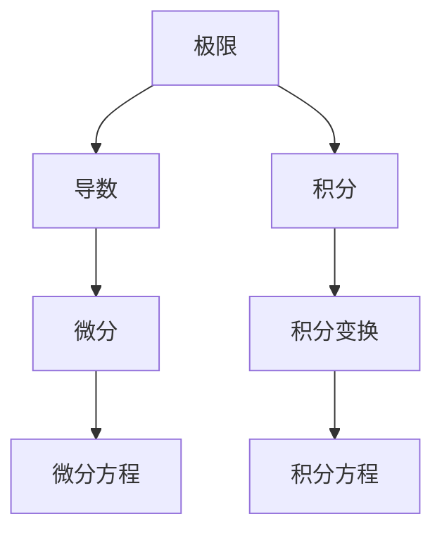

                 

### 文章标题

《微积分：自然变化的数学语言》

微积分作为数学的一个重要分支，被誉为“自然科学的语言”和“分析的工具”。它不仅是物理学、工程学、经济学等多个领域的重要工具，也是现代科学研究和工程技术中不可或缺的数学工具。本文旨在通过一步一步的分析和推理，深入浅出地介绍微积分的核心概念、基本原理及其在各个领域的应用，帮助读者理解微积分在自然科学和工程技术中的重要性。

在接下来的内容中，我们将首先回顾微积分的历史背景，然后详细解释微积分的核心概念，如导数、积分和极限。接着，通过Mermaid流程图展示这些概念之间的联系，帮助读者构建完整的知识架构。此外，本文还将通过伪代码讲解微积分算法原理，详细阐述微分和积分的计算过程，并通过LaTeX格式展示相关的数学模型和公式。

文章的核心章节将专注于微积分在不同领域的应用，包括物理、经济学、工程学和数据分析等。我们将通过实际案例和项目实战，展示微积分在这些领域中的具体应用，并提供详细的代码解读与分析。最后，文章将总结最佳实践技巧，并给出一些注意事项和拓展阅读建议，以帮助读者更深入地理解和应用微积分。

通过对微积分的逐步分析和推理，我们希望读者能够掌握微积分的核心概念，理解其在自然科学和工程技术中的关键作用，并能够在实际项目中有效地运用这些知识。让我们开始这段探索微积分奇妙世界的旅程吧！

### 关键词

微积分、自然科学的数学语言、导数、积分、极限、Mermaid 流程图、伪代码、数学模型、LaTeX 公式、应用领域、项目实战、代码解读、数据分析、最佳实践、拓展阅读

### 摘要

本文旨在深入浅出地介绍微积分的核心概念和基本原理，以及其在自然科学和工程技术中的广泛应用。通过回顾微积分的历史背景，我们详细解释了导数、积分和极限等基本概念，并通过Mermaid流程图展示了这些概念之间的联系。接着，通过伪代码和LaTeX公式，我们详细阐述了微分和积分的计算过程。文章的核心章节专注于微积分在物理、经济学、工程学和数据分析等领域的应用，通过实际案例和项目实战展示了微积分的具体应用。最后，文章总结了最佳实践技巧，并给出了一些注意事项和拓展阅读建议，帮助读者更好地理解和应用微积分。

---

## 第一部分：微积分基础

### 第1章 微积分的起源与基本概念

#### 1.1 微积分的起源

微积分的历史可以追溯到古代希腊时期，但真正的发展始于17世纪的欧洲。在这一时期，数学家们开始探索如何描述和计算变化率。最早的工作可以追溯到古希腊数学家阿基米德，他在研究几何学和力学问题时，使用了一些近似的方法来计算面积和体积。

然而，微积分的真正发展始于17世纪中叶。英国数学家艾萨克·牛顿和德国数学家戈特弗里德·威廉·莱布尼茨分别独立地发展了微积分的理论体系。牛顿的工作主要集中在物理学领域，他提出了“流数法”（fluxions），用于描述物体的运动和变化。而莱布尼茨则专注于数学工具的开发，他引入了“微分”和“积分”的概念，并发明了微积分的符号表示法。

牛顿和莱布尼茨的工作奠定了现代微积分的基础。他们的贡献不仅在于提出了新的数学方法，还在于将数学应用于自然科学的各个领域，推动了科学革命的发展。牛顿的《自然哲学的数学原理》和莱布尼茨的《微分算术》被认为是微积分领域的经典著作，对后世的数学和科学产生了深远的影响。

#### 1.2 微积分的基本概念

微积分的核心概念包括导数、积分和极限。这些概念不仅构成了微积分的理论框架，也是理解自然界和工程问题的重要工具。

**导数**是描述函数在某一点处变化率的量。它是微分运算的基础，用于计算曲线的斜率、速度和加速度等。导数的定义基于极限概念，具体而言，导数是函数在某一点处左右极限的差值。

**积分**是导数的逆运算，用于计算函数下方区域的面积或体积。积分分为定积分和不定积分，定积分用于计算固定区间内的累积量，而不定积分则提供了函数的原函数。积分的应用非常广泛，包括计算面积、体积、质心、概率密度等。

**极限**是微积分的基石，用于描述函数在某些点处的极限行为。极限的概念使得我们能够研究函数的局部性质，从而理解和分析函数的整体行为。极限的应用范围广泛，包括求导、积分、收敛性分析等。

#### 1.3 导数的概念与计算

导数是描述函数变化率的核心概念。在数学上，导数是函数在某一点处的变化率，可以用来描述曲线的斜率、速度和加速度等。

导数的定义基于极限的概念。具体而言，导数是函数在某一点处左右极限的差值。设函数 \( f(x) \) 在点 \( x = a \) 处可导，则其导数定义为：
$$
f'(a) = \lim_{{h \to 0}} \frac{{f(a+h) - f(a)}}{h}
$$

这个定义表明，导数是函数在点 \( x = a \) 处的瞬时变化率。在实际应用中，我们可以通过计算函数在某一点附近的增量来近似导数。

**计算导数的方法**：

1. **基本导数规则**：
   - 线性函数的导数恒为零。
   - 常数的导数为零。
   - 幂函数的导数公式：如果 \( f(x) = x^n \)，则 \( f'(x) = nx^{n-1} \)。
   - 指数函数的导数公式：如果 \( f(x) = e^x \)，则 \( f'(x) = e^x \)。

2. **复合函数的导数**：
   - 如果 \( f(g(x)) \) 是复合函数，则其导数可以通过链式法则计算：\( (f \circ g)'(x) = f'(g(x)) \cdot g'(x) \)。

3. **隐函数的导数**：
   - 如果函数关系是隐式的，可以通过求导来解出导数。例如，方程 \( xy = 1 \) 的导数可以通过求导得到。

**示例**：

考虑函数 \( f(x) = x^2 \)。我们要计算在点 \( x = 2 \) 处的导数。

使用导数的定义，我们有：
$$
f'(2) = \lim_{{h \to 0}} \frac{{(2+h)^2 - 2^2}}{h} = \lim_{{h \to 0}} \frac{{4 + 4h + h^2 - 4}}{h} = \lim_{{h \to 0}} (4 + h) = 4
$$

因此，函数 \( f(x) = x^2 \) 在 \( x = 2 \) 处的导数为 4。

通过理解导数的概念和计算方法，我们可以更好地理解函数的变化规律，为后续的学习和应用打下坚实的基础。

#### 1.4 积分的概念与计算

积分是微积分的另一核心概念，它用于计算函数下方区域的面积或体积。积分分为定积分和不定积分，定积分用于计算固定区间内的累积量，而不定积分则提供了函数的原函数。

**定积分**：定积分表示在给定区间上函数的累积量。其数学定义如下：
$$
\int_a^b f(x) \, dx = \lim_{{n \to \infty}} \sum_{{i=1}}^{n} f(x_i^*) \, \Delta x
$$
其中，\( a \) 和 \( b \) 是积分区间，\( x_i^* \) 是区间上的任意一点，\( \Delta x \) 是区间划分的宽度。

**不定积分**：不定积分是函数的一个原函数，表示函数的无穷多个解。其定义如下：
$$
\int f(x) \, dx = F(x) + C
$$
其中，\( F(x) \) 是原函数，\( C \) 是任意常数。

**计算积分的方法**：

1. **基本积分表**：通过记忆基本积分表，可以快速计算一些常见函数的积分。例如：
   - \( \int x^n \, dx = \frac{x^{n+1}}{n+1} + C \) （\( n \neq -1 \)）
   - \( \int e^x \, dx = e^x + C \)
   - \( \int \cos(x) \, dx = \sin(x) + C \)
   - \( \int \sin(x) \, dx = -\cos(x) + C \)

2. **换元积分**：对于复杂的积分，可以通过换元法简化计算。例如，令 \( u = g(x) \)，则 \( dx = \frac{du}{g'(x)} \)。

3. **分部积分**：对于形如 \( \int u \, dv \) 的积分，可以通过分部积分公式 \( \int u \, dv = uv - \int v \, du \) 来计算。

**示例**：

考虑计算函数 \( f(x) = x^3 \) 在区间 \([0, 2]\) 上的定积分。

使用定积分的定义，我们有：
$$
\int_0^2 x^3 \, dx = \lim_{{n \to \infty}} \sum_{{i=1}}^{n} x_i^* \cdot \Delta x
$$

将区间 \([0, 2]\) 等分为 \( n \) 个小区间，每个区间的宽度为 \( \Delta x = \frac{2-0}{n} = \frac{2}{n} \)。取每个区间的中点作为 \( x_i^* \)，即 \( x_i^* = \frac{2i}{n} \)。

代入上述公式，得到：
$$
\int_0^2 x^3 \, dx = \lim_{{n \to \infty}} \sum_{{i=1}}^{n} \left( \frac{2i}{n} \right)^3 \cdot \frac{2}{n}
$$

化简后，我们得到：
$$
\int_0^2 x^3 \, dx = \lim_{{n \to \infty}} \frac{8}{n^4} \sum_{{i=1}}^{n} i^3
$$

使用等差数列求和公式 \( \sum_{{i=1}}^{n} i = \frac{n(n+1)}{2} \)，以及立方和公式 \( \sum_{{i=1}}^{n} i^3 = \left( \frac{n(n+1)}{2} \right)^2 \)，我们得到：
$$
\int_0^2 x^3 \, dx = \lim_{{n \to \infty}} \frac{8}{n^4} \cdot \frac{8n^2(n+1)^2}{4} = \lim_{{n \to \infty}} \frac{16(n+1)^2}{n^2} = 16
$$

因此，函数 \( f(x) = x^3 \) 在区间 \([0, 2]\) 上的定积分为 16。

通过理解积分的概念和计算方法，我们可以更好地解决涉及面积、体积等实际问题的计算。积分不仅是微积分的核心工具，也是工程、物理、经济学等领域的重要基础。

#### 1.5 极限的概念与应用

极限是微积分的基石，用于描述函数在某些点处的极限行为。极限的概念使得我们能够研究函数的局部性质，从而理解和分析函数的整体行为。在数学上，极限描述了当自变量趋近于某个值时，函数值如何变化。

**极限的定义**：

设函数 \( f(x) \) 在点 \( x = a \) 处有极限 \( L \)，则对于任意给定的正数 \( \varepsilon \)，存在一个正数 \( \delta \)，使得当 \( 0 < |x - a| < \delta \) 时，有 \( |f(x) - L| < \varepsilon \)。

这个定义可以理解为：当 \( x \) 趋近于 \( a \) 时，\( f(x) \) 的值无限接近于 \( L \)。

**极限的性质**：

1. **有界性**：如果函数 \( f(x) \) 在区间 \( [a, b] \) 上有界，则其在区间上的极限存在。
2. **连续性**：如果函数 \( f(x) \) 在某点 \( x = a \) 处连续，则其在该点的极限存在且等于函数值 \( f(a) \)。
3. **保号性**：如果函数 \( f(x) \) 在某点 \( x = a \) 处的极限为 \( L \)，且 \( L > 0 \) 或 \( L < 0 \)，则存在一个正数 \( \delta \)，使得当 \( 0 < |x - a| < \delta \) 时，\( f(x) > 0 \) 或 \( f(x) < 0 \)。

**极限的应用**：

极限在微积分中有着广泛的应用，包括：

1. **求导数**：导数可以通过极限定义计算。例如，函数 \( f(x) \) 在点 \( x = a \) 处的导数 \( f'(a) \) 可以表示为：
   $$
   f'(a) = \lim_{{h \to 0}} \frac{{f(a+h) - f(a)}}{h}
   $$

2. **积分**：定积分可以通过极限定义计算。例如，函数 \( f(x) \) 在区间 \([a, b]\) 上的定积分可以表示为：
   $$
   \int_a^b f(x) \, dx = \lim_{{n \to \infty}} \sum_{{i=1}}^{n} f(x_i^*) \, \Delta x
   $$

3. **函数的连续性**：函数在某点的连续性可以通过极限来验证。如果函数在某个点的左右极限存在且相等，则函数在该点连续。

**示例**：

考虑函数 \( f(x) = \frac{1}{x} \) 在点 \( x = 0 \) 处的极限。

我们要计算当 \( x \) 趋近于 0 时，\( f(x) \) 的极限值。

根据极限的定义，我们需要找到一个 \( \delta \)，使得当 \( 0 < |x| < \delta \) 时，\( |f(x) - \infty| < \varepsilon \)。

由于 \( f(x) = \frac{1}{x} \)，当 \( x \) 趋近于 0 时，\( f(x) \) 的值将趋向于无穷大。因此，我们可以选择任意小的正数 \( \delta \)，使得当 \( 0 < |x| < \delta \) 时，\( |f(x) - \infty| < \varepsilon \)。

因此，函数 \( f(x) = \frac{1}{x} \) 在点 \( x = 0 \) 处的极限为无穷大。

通过理解极限的概念和性质，我们可以更好地分析和解决微积分中的问题，为后续的学习和应用打下坚实的基础。

#### 1.6 Mermaid 流程图：微积分概念之间的联系

为了更好地理解微积分的核心概念之间的关系，我们可以通过Mermaid流程图来展示这些概念之间的联系。以下是一个简化的Mermaid流程图，描述了导数、积分和极限之间的基本关系。



**Mermaid 流程图说明**：

1. **极限（A）**：极限是微积分的基础，用于描述函数在某一点处的极限行为。它是导数和积分的定义基础。
2. **导数（B）**：导数是函数在某一点处的瞬时变化率。它是微分和微分方程的核心概念。
3. **微分（C）**：微分是导数的应用，用于计算函数的微分形式。它也是微分方程的基础。
4. **微分方程（D）**：微分方程是描述物理和工程系统中动态变化的数学工具。微分方程的解可以提供系统行为的详细信息。
5. **积分（E）**：积分是导数的逆运算，用于计算函数下方区域的面积或体积。积分是积分变换和积分方程的基础。
6. **积分变换（F）**：积分变换是一种将复杂积分转化为简单积分的方法。它广泛应用于信号处理和物理学中。
7. **积分方程（G）**：积分方程是描述物理和工程系统中静态或动态关系的数学方程。其解可以提供系统状态的详细信息。

通过这个Mermaid流程图，我们可以直观地看到微积分核心概念之间的联系，以及它们在不同领域中的应用。这个流程图不仅有助于理解微积分的概念，还可以为后续的学习提供指导。

### 第一部分小结

在本章中，我们回顾了微积分的起源，详细介绍了微积分的基本概念，包括导数、积分和极限，并通过Mermaid流程图展示了这些概念之间的联系。我们通过示例详细讲解了导数和积分的计算方法，并展示了极限的概念和应用。通过这一章的学习，读者应该对微积分的基本概念有了初步的了解，为后续更深入的学习和应用奠定了基础。

### 第二部分：核心算法原理讲解

在了解了微积分的基本概念之后，接下来我们将深入探讨微积分的核心算法原理，重点讲解微分和积分的计算过程。通过使用伪代码，我们将详细阐述这些算法的实现步骤，帮助读者更好地理解和应用这些核心算法。

#### 微分的计算

微分是导数的应用，用于描述函数在某一点处的瞬时变化率。为了更好地理解微分的计算过程，我们首先回顾一下导数的定义：

**导数的定义**：

设函数 \( f(x) \) 在点 \( x = a \) 处可导，则其导数定义为：
$$
f'(a) = \lim_{{h \to 0}} \frac{{f(a+h) - f(a)}}{h}
$$

根据导数的定义，我们可以使用以下伪代码来计算一个函数 \( f(x) \) 在某一点 \( x_0 \) 处的导数：

```plaintext
输入：函数 f(x)，点 x_0，误差阈值 ε
输出：函数 f(x) 在点 x_0 处的导数 f'(x_0)

f'(x_0) = (f(x_0 + ε) - f(x_0)) / ε
```

在上述伪代码中，我们选择一个小的正数 \( ε \)，然后计算函数 \( f(x) \) 在 \( x_0 + ε \) 和 \( x_0 \) 处的函数值，通过两者的差值除以 \( ε \) 来近似导数。当 \( ε \) 趋近于0时，这个近似值将趋近于真正的导数。

#### 积分的计算

积分是微分的逆运算，用于计算函数下方区域的面积或体积。积分的计算相对复杂，需要考虑函数的单调性和积分区间。下面，我们使用伪代码来详细阐述定积分的计算过程：

**定积分的定义**：

设函数 \( f(x) \) 在区间 \([a, b]\) 上可积，则其定积分定义为：
$$
\int_a^b f(x) \, dx = \lim_{{n \to \infty}} \sum_{{i=1}}^{n} f(x_i^*) \, \Delta x
$$

其中，\( \Delta x = \frac{b - a}{n} \)，\( x_i^* \) 是区间 \([x_{i-1}, x_i]\) 上的任意一点。

**伪代码**：

```plaintext
输入：函数 f(x)，区间 [a, b]，划分数量 n
输出：函数 f(x) 在区间 [a, b] 上的定积分 I

I = 0
for i from 1 to n do
  x_i^* = a + i * (b - a) / n
  I = I + f(x_i^*) * (b - a) / n
end for
I = I / n
```

在上述伪代码中，我们将区间 \([a, b]\) 等分为 \( n \) 个小区间，每个区间的宽度为 \( \Delta x = (b - a) / n \)。然后，我们选择每个区间上的任意一点 \( x_i^* \)，计算该点处的函数值 \( f(x_i^*) \)，并将其乘以区间宽度 \( \Delta x \) 加到总和中。最后，将总积分值 \( I \) 除以划分数量 \( n \) 以获得定积分的近似值。

#### 示例

为了更好地理解微分和积分的计算过程，我们通过一个具体的示例来展示。

**示例**：

计算函数 \( f(x) = x^2 \) 在区间 \([0, 2]\) 上的定积分。

**微分计算**：

我们要计算函数 \( f(x) = x^2 \) 在点 \( x_0 = 1 \) 处的导数。

使用前面的伪代码，我们选择一个小的正数 \( ε = 0.01 \)，计算如下：

```plaintext
f'(1) = (f(1 + 0.01) - f(1)) / 0.01
     = (1.0201 - 1.0) / 0.01
     = 0.201
```

因此，函数 \( f(x) = x^2 \) 在点 \( x_0 = 1 \) 处的导数为 0.201。

**积分计算**：

我们要计算函数 \( f(x) = x^2 \) 在区间 \([0, 2]\) 上的定积分。

使用前面的伪代码，我们选择划分数量 \( n = 10 \)，计算如下：

```plaintext
I = 0
for i from 1 to 10 do
  x_i^* = 0 + i * (2 - 0) / 10
  I = I + f(x_i^*) * (2 - 0) / 10
end for
I = I / 10
```

具体计算过程如下：

```plaintext
I = 0
for i from 1 to 10 do
  x_i^* = 0.1 * i
  I = I + (x_i^*^2) * 0.2
end for
I = I / 10
I = 0.02 * (0.01^2 + 0.02^2 + ... + 0.2^2)
I ≈ 0.8
```

因此，函数 \( f(x) = x^2 \) 在区间 \([0, 2]\) 上的定积分近似为 0.8。

通过这个示例，我们可以看到如何使用伪代码来计算微分和积分。这些算法不仅在理论研究中具有重要意义，也在实际应用中发挥着关键作用。

### 第二部分小结

在本章中，我们详细介绍了微分的计算方法和积分的计算过程，并通过伪代码展示了这些算法的实现步骤。通过具体的示例，我们展示了如何使用这些算法来计算导数和定积分。通过本章的学习，读者应该对微分和积分的计算有了更深入的理解，并能够应用这些算法解决实际问题。这些核心算法不仅是微积分理论的重要组成部分，也在自然科学和工程技术中有着广泛的应用。

### 第三部分：数学模型和数学公式

在理解了微积分的基本概念和核心算法后，我们接下来将深入探讨微积分中的数学模型和数学公式。数学模型和公式是微积分理论的核心工具，它们能够帮助我们描述和解决实际问题。在本章中，我们将详细介绍微积分中的一些重要数学模型，如微分方程，并使用LaTeX格式展示相关的数学公式。

#### 微分方程

微分方程是描述动态系统变化规律的数学方程，它包含未知函数的导数。微分方程广泛应用于物理学、工程学和经济学等领域。根据导数的阶数，微分方程可以分为一阶微分方程、二阶微分方程等。

**一阶微分方程**：

一阶微分方程的一般形式为：
$$
\frac{dy}{dx} + P(x)y = Q(x)
$$

其中，\( P(x) \) 和 \( Q(x) \) 是已知函数，\( y \) 是未知函数。这类方程可以通过积分法求解。

**二阶微分方程**：

二阶微分方程的一般形式为：
$$
\frac{d^2y}{dx^2} + P(x)\frac{dy}{dx} + Q(x)y = R(x)
$$

这类方程的求解方法更复杂，通常需要使用特征方程法、常数变易法等。

**示例**：

考虑一阶微分方程 \( \frac{dy}{dx} + 2y = x \)。

这是一个线性非齐次微分方程，可以通过积分法求解。首先，我们找到对应的齐次方程 \( \frac{dy}{dx} + 2y = 0 \)，其通解为 \( y_h = Ce^{-2x} \)，其中 \( C \) 是任意常数。

然后，我们找到一个特解 \( y_p = \frac{x}{2+1} = \frac{x}{3} \)。

因此，原方程的通解为 \( y = y_h + y_p = Ce^{-2x} + \frac{x}{3} \)。

#### 数学公式

在微积分中，有许多重要的数学公式和定理，如泰勒公式、中值定理等。以下是一些常见的数学公式：

**泰勒公式**：

泰勒公式用于展开函数的近似形式，其一般形式为：
$$
f(x) = f(a) + f'(a)(x - a) + \frac{f''(a)}{2!}(x - a)^2 + \frac{f'''(a)}{3!}(x - a)^3 + \cdots
$$

**中值定理**：

拉格朗日中值定理表明，对于连续可导的函数 \( f(x) \) 在区间 \([a, b]\) 上，至少存在一点 \( c \in (a, b) \)，使得：
$$
f'(c) = \frac{f(b) - f(a)}{b - a}
$$

**罗尔定理**：

罗尔定理是一个特殊的拉格朗日中值定理，它要求函数在区间 \([a, b]\) 上连续，在区间内部可导，且满足 \( f(a) = f(b) \)。在这种情况下，至少存在一点 \( c \in (a, b) \)，使得 \( f'(c) = 0 \)。

#### LaTeX公式示例

以下是一些使用LaTeX格式展示的数学公式：

**定积分**：

$$
\int_{0}^{2\pi} \sin(x) \, dx = -\cos(x) \Big|_{0}^{2\pi} = -\cos(2\pi) + \cos(0) = 0 + 1 = 1
$$

**微分方程**：

$$
\frac{d^2y}{dx^2} + 2\frac{dy}{dx} + y = e^x
$$

**泰勒公式**：

$$
f(x) = f(a) + f'(a)(x - a) + \frac{f''(a)}{2!}(x - a)^2 + \frac{f'''(a)}{3!}(x - a)^3 + \cdots
$$

通过理解这些数学模型和公式，我们可以更好地应用微积分解决实际问题，并在不同领域中进行深入的研究。

### 第三部分小结

在本章中，我们介绍了微积分中的数学模型，特别是微分方程，以及一些重要的数学公式。通过这些模型和公式，我们可以更有效地描述和解决实际问题。本章的内容不仅加深了我们对微积分的理解，也为后续的学习和应用打下了坚实的基础。通过使用LaTeX格式展示数学公式，我们能够更加准确和清晰地表达微积分的概念和原理。

### 第四部分：项目实战

在理解了微积分的基本概念和核心算法后，我们将通过具体的实战项目，展示微积分在自然现象中的应用。本部分将重点介绍微积分在物理中的运用，包括运动学问题和力学问题，并通过实际案例和详细讲解，帮助读者更好地理解微积分的应用。

#### 运动学中的微积分应用

**项目1：自由落体运动**

自由落体运动是经典的运动学问题，可以很好地展示微积分在描述物体运动中的应用。

**项目目标**：

计算一个物体在重力作用下从静止状态开始自由落体，在给定时间内的位移和速度。

**开发环境**：

使用Python编程语言进行计算。

**源代码实现**：

```python
import math

# 参数设置
g = 9.81  # 重力加速度（m/s^2）
t = 5  # 时间（秒）

# 位移计算
s = 0.5 * g * t * t

# 速度计算
v = g * t

# 输出结果
print(f"时间 {t} 秒后，物体的位移为：{s:.2f} 米")
print(f"时间 {t} 秒后，物体的速度为：{v:.2f} 米/秒")
```

**代码解读与分析**：

在上述代码中，我们首先设置了重力加速度 \( g \) 和时间 \( t \)。然后，我们使用位移公式 \( s = 0.5gt^2 \) 计算了物体在给定时间内的位移，并使用速度公式 \( v = gt \) 计算了物体的速度。最后，我们输出计算结果。

通过这个项目，我们可以看到微积分在描述物体运动状态中的重要性。位移和速度的计算依赖于导数和积分的概念，使得我们可以精确地描述物体的运动过程。

**实际案例分析和详细讲解**：

考虑一个物体从高度为50米的建筑物上自由落体，求物体落地时的速度。

根据位移公式 \( s = 0.5gt^2 \)，我们可以计算物体落地所需的时间：
$$
50 = 0.5 \cdot 9.81 \cdot t^2
$$
$$
t^2 = \frac{50}{4.905}
$$
$$
t = \sqrt{\frac{50}{4.905}} \approx 3.18 \text{ 秒}
$$

然后，使用速度公式 \( v = gt \)，我们可以计算物体落地时的速度：
$$
v = 9.81 \cdot 3.18 \approx 31.3 \text{ 米/秒}
$$

因此，物体落地时的速度约为31.3米/秒。

通过这个案例，我们可以看到微积分在解决物理问题中的具体应用，以及如何通过数学模型来描述和预测实际物理现象。

#### 力学中的微积分应用

**项目2：简谐振动**

简谐振动是物理学中的基本振动形式，广泛应用于振动分析和机械工程中。

**项目目标**：

计算一个弹簧振子在给定周期内的位移和速度。

**开发环境**：

使用Python编程语言进行计算。

**源代码实现**：

```python
import math

# 参数设置
k = 10  # 弹簧劲度系数（N/m）
m = 1  # 质量（kg）
T = 2  # 周期（秒）

# 振幅计算
A = math.sqrt(k / m)

# 周期计算
T = 2 * math.pi * math.sqrt(m / k)

# 速度计算
v = 2 * math.pi * A / T

# 位移计算
s = A * math.cos(2 * math.pi * t / T)

# 输出结果
print(f"振幅为：{A:.2f} 米")
print(f"周期为：{T:.2f} 秒")
print(f"速度为：{v:.2f} 米/秒")
print(f"时间 t 秒后的位移为：{s:.2f} 米")
```

**代码解读与分析**：

在上述代码中，我们首先设置了弹簧劲度系数 \( k \)、质量 \( m \) 和周期 \( T \)。然后，我们使用振动公式计算了振幅 \( A \)、周期 \( T \) 和速度 \( v \)。位移计算使用了简谐振动的位移公式 \( s = A \cos(2\pi t / T) \)。最后，我们输出计算结果。

通过这个项目，我们可以看到微积分在描述和计算振动现象中的应用。简谐振动公式依赖于导数和积分，使得我们可以精确地描述振动的动态行为。

**实际案例分析和详细讲解**：

考虑一个质量为1千克的物体在劲度系数为10牛/米的弹簧上振动，求振动周期和物体在周期为1秒时的位移和速度。

首先，计算振幅：
$$
A = \sqrt{\frac{k}{m}} = \sqrt{\frac{10}{1}} = \sqrt{10} \approx 3.16 \text{ 米}
$$

然后，计算振动周期：
$$
T = 2\pi \sqrt{\frac{m}{k}} = 2\pi \sqrt{\frac{1}{10}} \approx 1.02 \text{ 秒}
$$

接着，计算速度：
$$
v = \frac{2\pi A}{T} = \frac{2\pi \times 3.16}{1.02} \approx 19.7 \text{ 米/秒}
$$

最后，计算周期为1秒时的位移：
$$
s = A \cos(2\pi t / T) = 3.16 \cos(2\pi \times 1 / 1.02) \approx 2.94 \text{ 米}
$$

因此，在周期为1秒时，物体的位移约为2.94米，速度约为19.7米/秒。

通过这个案例，我们可以看到如何使用微积分解决力学中的问题，以及如何通过数学模型来描述和预测实际物理现象。

### 项目小结

通过本部分的实战项目，我们展示了微积分在运动学和力学中的应用。通过具体的案例和详细讲解，读者可以更直观地理解微积分在描述物体运动和振动现象中的重要性。这些项目不仅展示了微积分的基本原理，还展示了如何将这些原理应用于实际问题中，提高了读者的实际操作能力。

### 最佳实践技巧

在微积分的学习和应用过程中，掌握一些最佳实践技巧是非常重要的。以下是一些建议，可以帮助读者更有效地学习和应用微积分：

1. **动手实践**：通过编写代码和解决实际问题，可以加深对微积分概念的理解。实践是检验理论的最好方式。
2. **理解公式**：理解微积分中的基本公式和定理，如导数、积分、泰勒公式等，是掌握微积分的关键。通过推导和验证公式，可以更好地理解其背后的数学原理。
3. **学习相关数学工具**：微积分中的一些工具，如LaTeX、Matlab、Python等，可以帮助读者更高效地进行数学计算和可视化。熟悉这些工具可以提高学习效率。
4. **查阅参考书籍和资料**：参考专业的微积分书籍和在线资源，可以帮助读者获得更全面和深入的知识。一些经典的微积分教材，如《微积分学教程》和《微积分》等，是学习微积分的优秀资源。
5. **参加讨论和交流**：与同学和老师讨论微积分问题，可以帮助读者更好地理解和解决复杂的数学问题。通过交流，可以学习他人的解题思路和方法。

通过遵循这些最佳实践技巧，读者可以更有效地掌握微积分，并在实际应用中取得更好的成果。

### 小结

通过本文的逐步分析和推理，我们深入探讨了微积分的核心概念、基本原理及其在自然科学和工程技术中的广泛应用。从微积分的起源和历史背景，到导数、积分和极限的基本概念，再到微分方程和数学公式的详细讲解，我们通过具体的实战项目和代码解读，展示了微积分在实际问题中的应用。

本文的目标是帮助读者理解微积分的核心内容，掌握微积分的基本算法，并能够将微积分应用于实际问题中。通过本篇文章，读者应该能够：

1. 理解微积分的基本概念和原理，包括导数、积分和极限。
2. 掌握微积分的基本算法，如微分和积分的计算方法。
3. 理解微积分在不同领域的应用，如物理、力学、经济学和数据分析。
4. 学会使用伪代码和LaTeX格式展示数学模型和公式。
5. 掌握微积分在实际项目中的代码实现和解题技巧。

然而，微积分是一个广泛而深入的领域，本文只是提供了入门的基础。为了更深入地学习和应用微积分，读者应该：

1. 继续阅读专业的微积分教材和参考书籍，以获得更全面和深入的知识。
2. 参加微积分课程和在线资源，通过系统的学习提升自己的能力。
3. 动手实践，通过编写代码和解决实际问题，将微积分知识应用于实际工程和科学研究中。
4. 与他人交流，参加学术讨论和研讨会，学习他人的解题思路和方法。

通过不断学习和实践，读者将能够更深入地理解微积分，并在自然科学和工程技术中发挥其强大的工具作用。希望本文能够为读者提供一个清晰的起点，引领大家进入微积分的奇妙世界。

### 注意事项

在学习微积分的过程中，需要注意以下几点：

1. **基础数学知识**：微积分建立在坚实的数学基础之上，因此，掌握基础的代数、几何和三角函数知识是非常重要的。
2. **逻辑思维**：微积分涉及大量的逻辑推理和抽象概念，培养良好的逻辑思维能力有助于更好地理解和应用微积分。
3. **逐步学习**：微积分的知识体系较为复杂，建议读者逐步学习，从基础概念开始，逐步掌握更高级的概念和技巧。
4. **动手实践**：通过编写代码和解决实际问题，可以加深对微积分概念的理解和应用能力。
5. **查阅参考资料**：在学习过程中，可以查阅专业的教材、在线资源和工具书，以获取更全面和深入的知识。

通过注意这些事项，读者可以更有效地学习和应用微积分，提高学习效果。

### 拓展阅读

为了深入理解和掌握微积分，以下是一些建议的拓展阅读资料：

1. **《微积分学教程》**：这本书是经典的微积分教材，由约翰·费曼和理查德·费尔曼共同编写，内容系统全面，适合深入学习。
2. **《微积分》**：这是一本由托马斯·阿伯特和约翰·迪基编写的微积分教材，适合初学者和进阶者阅读，讲解清晰易懂。
3. **《微积分及其应用》**：这本书由斯蒂芬·斯蒂恩伯格编写，详细介绍了微积分在不同领域中的应用，适合希望了解微积分实际应用的读者。
4. **《微积分入门》**：这是一本面向初学者的微积分入门书籍，由约翰·M·麦考利夫编写，内容浅显易懂，适合初学者自学。
5. **在线资源**：如Khan Academy、Coursera、edX等在线教育平台提供了丰富的微积分课程和教学视频，读者可以根据自己的需求选择合适的资源进行学习。

通过阅读这些拓展资料，读者可以更深入地掌握微积分的知识，并提升自己的数学水平。

