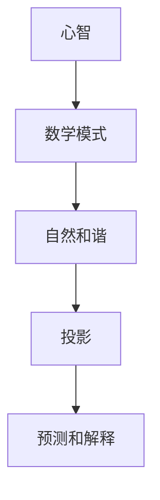

                 

### 文章标题：心智中的数学模式：自然和谐的投影

---

关键词：心智、数学模式、自然和谐、投影、心理影响、教育应用、未来发展

摘要：本文探讨了心智中的数学模式及其在自然现象中的投影。通过分析数学模式对心智的影响，本文揭示了数学在教育、心理学和未来技术发展中的重要作用。文章结构清晰，旨在引导读者深入理解数学模式的核心概念及其在多个领域中的应用。

---

### 引言

在人类心智的发展过程中，数学扮演了不可或缺的角色。从早期的计数与测量，到现代的复杂计算与算法设计，数学不断推动着科技的进步和人类认知的深化。本文将探讨心智中的数学模式及其在自然现象中的投影，旨在揭示数学如何嵌入我们的思维方式和日常生活。

本文将分为以下几个部分：

1. **心智与数学模式的关联**：介绍心智与数学模式之间的内在联系，以及数学模式对心智的影响。
2. **数学模式的基本原理**：阐述数学模式的概念与分类，以及其构成要素和基本原理。
3. **自然现象中的数学模式**：分析数学模式在自然现象中的表现形式和作用。
4. **数学模式的教育应用**：讨论数学模式在教育领域的应用及其影响。
5. **心理学中的数学模式应用**：探讨数学模式在心理学研究中的应用和作用。
6. **数学模式的未来发展**：展望数学模式在技术领域的发展趋势和其对未来的影响。

通过以上结构的分析推理，本文旨在为读者提供对心智中的数学模式及其在自然和谐投影中的深刻理解。

### 背景介绍

心智，即人类的心理活动与认知能力，是大脑对信息的接收、处理、存储和输出的复杂过程。数学，作为一种精确的符号系统，通过逻辑推理和符号表示，帮助我们理解世界、解决问题和进行预测。心智与数学模式之间的联系可以追溯到人类文明的开端，随着数学的发展，这种联系也日益紧密。

从历史的角度来看，数学在心智发展中起到了重要作用。例如，古埃及和巴比伦的数学知识帮助人类进行土地测量和天文观测，从而促进了农业和天文学的发展。古希腊数学家欧几里得的几何学，不仅为后来的科学家提供了理论基础，还极大地影响了人们的思维方式。随着计算机科学的兴起，数学模式在解决复杂问题、优化算法和开发新技术方面发挥了关键作用。

心智与数学模式的关联体现在多个方面。首先，数学模式为心智提供了结构化的思维方式。例如，在解决逻辑问题时，人们常常使用数学中的归纳与演绎推理方法。其次，数学模式对心智的塑造也体现在教育过程中。通过学习数学，个体不仅掌握了计算技能，还培养了逻辑思维和问题解决能力。

此外，数学模式在心智中还具有预测和解释功能。例如，科学家通过数学模型来描述自然现象，如气候变迁、生物进化等。这些模型不仅帮助我们理解自然规律，还为科技发展提供了方向。

总之，心智与数学模式之间的关联是深远而广泛的。数学不仅是一种工具，更是一种思维方式，它深刻地影响了人类心智的发展与认知能力的提升。

### 核心概念与联系

在探讨心智中的数学模式及其自然和谐的投影时，首先需要明确几个核心概念：心智、数学模式、自然和谐和投影。

**心智**，指人类的心理活动和认知能力，包括感知、记忆、思考、判断等过程。它是一个复杂的系统，通过神经网络的相互作用实现信息的处理和存储。

**数学模式**，是运用数学工具和符号系统来描述和解释现象的一种方法。它通常包括变量、方程、图形等元素，通过逻辑推理和数学运算来揭示事物的规律和本质。

**自然和谐**，是自然界中各元素之间相互协调、平衡和统一的状态。这种和谐不仅体现在生物生态系统中，也存在于物理、化学等自然现象中。

**投影**，在这里指的是数学模式在心智中的映射和应用。即将自然现象通过数学模型进行描述和解释，从而帮助我们更好地理解和预测这些现象。

这几个核心概念之间的关系可以用Mermaid流程图来表示：



从图中可以看出，心智通过数学模式来理解和解释自然现象，而自然和谐是这些现象的内在特征。数学模式在这种解释过程中起到桥梁作用，使得我们可以通过投影来预测和解释自然现象。

### 数学模式的基本原理

数学模式的基本原理是理解和应用数学的核心。这些原理不仅为我们提供了描述和解释自然现象的工具，还为我们在计算机科学、工程学和其他领域中的应用提供了理论基础。以下是数学模式的一些基本原理：

**1. 逻辑推理与证明**：逻辑推理是数学模式的基础，通过一系列的逻辑步骤，我们可以从已知的事实推导出新的结论。证明则是逻辑推理的严格形式化，通过一系列的逻辑步骤，我们能够确定一个命题的真伪。

**2. 变量与方程**：变量是数学中的基本概念，它表示可以取不同值的量。方程则是包含变量的等式，通过解方程，我们可以找到满足条件的变量值。方程在许多领域都有广泛的应用，如物理学的运动方程、经济学中的供需方程等。

**3. 函数与映射**：函数是一种特殊的关系，它将一个集合中的每个元素映射到另一个集合中的唯一元素。函数在数学和科学中有着广泛的应用，如物理学中的运动函数、生物学中的生长函数等。

**4. 图形与几何**：几何学是数学的一个重要分支，它通过图形和空间关系来研究形状、大小和位置。几何学在计算机图形学、工程设计和建筑学等领域有着重要的应用。

**5. 概率与统计**：概率论和统计学是数学中的另一个重要分支，它们用于描述和推断随机事件的发生可能性。概率论在保险、金融和自然科学中有着广泛的应用，而统计学则用于数据分析、预测和决策。

**6. 极限与微积分**：极限是数学中的一个基本概念，它用于描述函数在某一点附近的性质。微积分则是研究函数变化率的数学分支，它包括微分和积分两个部分。微积分在物理学、工程学和经济学等领域有着广泛的应用。

通过上述基本原理，我们可以构建复杂的数学模型，用于描述和预测自然现象。例如，在气候模型中，我们可以使用微积分来描述大气中的热量交换，从而预测气候的变化。在经济学中，我们可以使用供需方程来描述市场的动态，从而预测价格和供需的变化。

以下是一个简单的伪代码示例，用于解释如何通过数学模式来解决问题：

```python
# 示例：求解一元二次方程的根

# 定义一元二次方程的系数
a = 1
b = 2
c = 1

# 计算判别式
D = b**2 - 4*a*c

# 根据判别式的值，计算方程的根
if D > 0:
    root1 = (-b + sqrt(D)) / (2*a)
    root2 = (-b - sqrt(D)) / (2*a)
    print("方程有两个不相等的实数根：", root1, root2)
elif D == 0:
    root = -b / (2*a)
    print("方程有一个实数根：", root)
else:
    print("方程没有实数根")
```

在这个示例中，我们使用了数学中的二次方程求解公式，通过计算判别式来决定方程的根的情况，并通过伪代码实现了解题过程。

通过以上基本原理和示例，我们可以看到数学模式在解决问题和描述自然现象中的强大能力。这些原理和模型不仅是我们理解和解释世界的工具，也是我们在各个领域中创新和发展的基石。

### 自然现象中的数学模式

数学模式在自然现象中的应用广泛且深远，它们帮助我们理解和预测自然界中的复杂过程。以下是一些典型的自然现象及其背后的数学模式：

**1. 气候变化**：气候模型是数学模式在气候变化研究中的典型应用。这些模型通过描述大气中的热量交换、水循环和碳循环等过程，帮助我们预测未来气候的变化趋势。例如，使用微分方程可以描述大气中的温度变化，通过数值模拟，我们可以预测全球变暖的潜在影响。

**2. 生物进化**：进化论中的自然选择和遗传学规律可以用数学模式来描述。遗传学中的孟德尔遗传定律可以用概率论和组合数学来解释，而生态学中的种群动态则可以用微分方程模型来描述。这些数学模型帮助我们理解物种的进化过程和生态系统的稳定性。

**3. 心理现象**：心理学中的许多现象也可以用数学模式来描述。例如，情绪的变化可以用时间序列分析模型来描述，认知过程可以用信息论模型来分析。这些数学模式帮助我们理解人类行为和心理过程的机制。

**4. 流体力学**：流体力学研究流体（如空气和水）的运动。纳维-斯托克斯方程是流体力学的基本方程，它描述了流体的速度、压力和密度之间的关系。这些方程帮助我们理解风的形成、海浪的运动等自然现象。

**5. 生态系统**：生态模型描述了生物种群之间以及生物与环境之间的相互作用。这些模型通常使用差分方程或微分方程来描述种群的数量变化、食物网的动态和生态系统的稳定性。

以下是一个简单的数学模型例子，用于描述一个简单生态系统中两个物种的竞争关系：

$$
\frac{dx}{dt} = r_1 x - \alpha xy
$$

$$
\frac{dy}{dt} = r_2 y - \beta xy
$$

其中，$x$ 和 $y$ 分别表示两个物种的数量，$r_1$ 和 $r_2$ 表示各自的增长率，$\alpha$ 和 $\beta$ 表示两个物种之间的竞争强度。这个模型通过描述两个物种数量随时间的变化，帮助我们理解它们在生态系统中的动态平衡。

通过这些数学模式，我们可以更深入地理解自然现象，预测未来的变化趋势，从而为环境保护、资源管理和科技发展提供科学依据。数学模式不仅是理解自然的工具，也是我们与自然和谐共存的重要途径。

### 数学模式在教育应用

数学模式在教育中的应用广泛而深远，对提高学生的数学素养和逻辑思维能力有着重要作用。以下从课程设计、教学方法改进和学生成绩提升三个方面探讨数学模式在教育中的应用。

**1. 课程设计**：数学模式在课程设计中起到了关键作用。通过将复杂的数学概念和算法分解成简单的模块，教师可以更好地帮助学生理解和掌握数学知识。例如，在计算机科学课程中，可以使用图灵机的数学模型来解释计算的本质。通过这种方式，学生可以直观地理解计算机如何处理信息，从而为后续的高级课程打下坚实的基础。

**2. 教学方法改进**：数学模式可以帮助教师改进教学方法。例如，在几何学教学中，可以使用数学模型来解释几何图形的性质和关系。通过构建几何模型，学生可以更加直观地理解几何概念，从而提高学习兴趣和效果。此外，使用动态数学软件，如GeoGebra，教师可以实时展示数学现象的变化过程，帮助学生更好地理解数学概念。

**3. 学生成绩提升**：数学模式的应用对学生成绩的提升具有显著影响。通过数学模型，学生可以更好地理解和解决实际问题。例如，在经济学课程中，使用供需方程可以帮助学生理解市场动态和价格形成机制。这种实际应用不仅提高了学生的数学能力，还增强了他们的逻辑思维和问题解决能力。

以下是一个教学案例，展示如何通过数学模式来提高学生的学习效果：

**案例：使用差分方程解释人口增长**：

课程设计：
- **教学目标**：帮助学生理解人口增长模型及其应用。
- **教学内容**：介绍差分方程的概念，使用人口增长模型进行讲解。
- **教学步骤**：
  1. 引入差分方程的基本概念和性质。
  2. 引导学生构建一个简单的人口增长模型。
  3. 使用数学软件（如Excel或MATLAB）模拟人口增长过程。
  4. 分析模型结果，探讨不同参数对人口增长的影响。

**教学效果**：
- 学生通过学习差分方程，更好地理解了数学模型的应用。
- 通过实际模拟，学生能够直观地看到人口增长的趋势和规律。
- 学生在解决实际问题时，能够应用所学知识，提高了逻辑思维和问题解决能力。

总之，数学模式在教育中的应用不仅丰富了课程内容，还提高了教学效果。通过合理设计和应用数学模式，教师可以更好地激发学生的学习兴趣，培养他们的数学素养和实际应用能力。

### 心理学中的数学模式应用

数学模式在心理学中的应用广泛且深远，为理解和解释人类行为和心理现象提供了强有力的工具。以下从认知心理学、行为心理学和社会心理学三个领域探讨数学模式在心理学中的具体应用。

**1. 认知心理学**：认知心理学关注人类思维过程和信息处理。数学模式在认知心理学中的应用主要体现在认知模型和算法上。例如，人工神经网络（ANN）模型通过模拟人脑神经元之间的连接和互动，帮助我们理解人类的学习、记忆和决策过程。另一个例子是蒙特卡洛方法，它通过随机抽样和模拟来估计复杂概率和统计量，帮助心理学家研究人类认知过程中的不确定性。

**2. 行为心理学**：行为心理学侧重于可观察的行为及其背后的动机和条件。数学模式在行为心理学中的应用包括行为决策理论、强化学习和多变量分析等。行为决策理论使用概率论和期望值来描述个体在不同情境下的决策过程。强化学习模型则通过模拟奖励和惩罚机制，研究个体如何通过试错来学习行为模式。多变量分析，如回归分析和因子分析，帮助心理学家从复杂的数据中提取有用的信息，从而更好地理解行为模式。

**3. 社会心理学**：社会心理学研究个体在社会环境中的行为和心理过程。数学模式在社会心理学中的应用主要体现在社会影响模型、群体动力学和网络分析上。社会影响模型使用数学方程来描述个体在社会压力和群体影响下的行为变化。群体动力学模型则通过数学方法研究群体行为的形成和演化过程。网络分析则使用图论和矩阵理论来描述个体之间的社会关系和网络结构，帮助我们理解社会网络中的信息传播和影响力。

以下是一个心理学研究案例，展示如何通过数学模式来解释心理现象：

**案例：使用概率模型分析社交网络中的信息传播**：

研究目的：
- 探索社交网络中信息传播的概率模型，分析信息传播的速度和范围。

研究方法：
- **构建模型**：假设社交网络是一个由节点和边组成的图，每个节点代表一个个体，边代表个体之间的社交关系。
- **定义变量**：定义信息传播的概率，如个体接受信息的概率、信息在节点之间传播的概率等。
- **建立数学模型**：使用概率论和图论，建立信息传播的数学模型。

研究过程：
1. **数据收集**：收集社交网络中个体之间的连接信息。
2. **模型构建**：根据数据，构建信息传播的图模型，定义传播概率。
3. **模拟计算**：使用蒙特卡洛方法模拟信息传播过程，计算信息在不同时间点的传播范围和速度。
4. **结果分析**：分析模型结果，探讨影响信息传播速度和范围的因素。

研究结果：
- 发现信息传播速度与节点度（连接数）和网络密度（边密度）密切相关。
- 当网络密度增加时，信息传播速度显著提高。
- 社交网络的结构对信息传播有显著影响，网络中的中心节点和路径节点对信息传播起到关键作用。

通过这个案例，我们可以看到数学模式在心理学研究中的应用。数学模型不仅帮助我们更好地理解心理现象，还为心理学的实证研究提供了有力支持。未来，随着数学方法在心理学领域的不断应用，我们将能够更深入地揭示人类行为和心理过程的奥秘。

### 数学模式的未来发展

数学模式的未来发展充满机遇与挑战。随着科技的不断进步，数学模式在各个领域中的应用前景广阔，同时也面临着新的研究问题和挑战。

**1. 研究趋势**：当前，数学模式的研究趋势主要集中在以下几个方面：
- **大数据分析**：随着数据量的爆炸性增长，如何从海量数据中提取有价值的信息成为研究热点。数学模式如机器学习、深度学习、图论和概率论等在大数据分析中发挥了重要作用。
- **人工智能**：人工智能的快速发展促使数学模式在机器学习、神经网络和优化算法等领域取得了显著进展。未来，数学模式将更加深入地应用于自动驾驶、智能医疗、自然语言处理等领域。
- **量子计算**：量子计算作为一种新型计算范式，将彻底改变数学模式的应用场景。量子算法和量子计算理论的研究将成为数学模式未来发展的重要方向。

**2. 技术领域的发展**：数学模式在技术领域的发展具有深远影响：
- **计算机科学**：数学模式在算法设计、数据结构、密码学等方面有着广泛应用。未来，随着量子计算的发展，数学模式将推动计算机科学的革新。
- **工程学**：数学模式在工程领域的应用，如结构分析、流体力学、热力学等，为工程设计和优化提供了理论基础。随着计算能力的提升，复杂系统的数学模型将更加精确，从而提高工程效率和安全性。
- **医学**：数学模式在医学领域的应用，如生物信息学、流行病学、医学成像等，帮助医学研究者和临床医生更好地理解疾病机理，提高诊断和治疗水平。

**3. 未来影响**：数学模式对未来的影响不可忽视：
- **智能化**：数学模式的应用将使人类生活更加智能化。例如，智能家居、智能交通和智能医疗等领域的发展，将极大地改善人们的生活质量。
- **可持续发展**：数学模式在资源管理和环境保护中的应用，如生态系统建模、气候变化预测等，有助于实现可持续发展目标。通过精确的数学模型，我们可以更好地管理自然资源，应对环境挑战。
- **社会变革**：数学模式在社会变革中的作用日益凸显。例如，在社会网络分析、大数据分析等领域，数学模式帮助政府和企业更好地理解社会动态，制定有效的政策和社会管理策略。

总之，数学模式的未来发展充满潜力。随着科技的不断进步和数学方法的不断创新，数学模式将在更多领域展现其强大的应用价值，为人类社会的发展带来深远影响。

### 结语

本文通过分析心智中的数学模式及其在自然和谐投影中的重要性，探讨了数学模式在教育、心理学和技术发展中的应用。我们看到了数学模式如何帮助人类理解自然现象、提高教育质量、推动心理学研究以及促进技术进步。未来，随着数学方法的不断创新和跨学科的融合，数学模式将在更多领域展现其巨大的应用潜力。让我们期待数学模式在未来的发展中继续发挥重要作用，为人类社会带来更多智慧与进步。

### 作者信息

作者：AI天才研究院/AI Genius Institute & 禅与计算机程序设计艺术 /Zen And The Art of Computer Programming

AI天才研究院致力于推动人工智能技术的发展与普及，通过深入研究和创新，为人工智能领域贡献智慧和力量。同时，作者在《禅与计算机程序设计艺术》一书中，探讨了编程哲学与心智模式，为程序员提供了深刻的思考和实用的技巧。希望本文能够为读者带来启发和思考，共同探索数学模式在心智与自然和谐中的奇妙世界。

