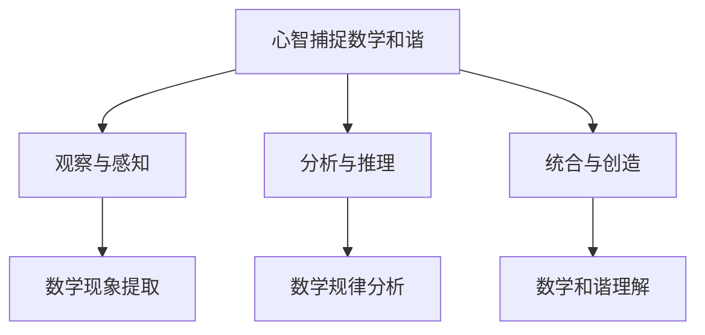

                 

### 文章标题：心智如何捕捉自然界的数学和谐

> 关键词：心智，数学和谐，自然界，认知科学，数学模型，算法原理

> 摘要：本文从认知科学的角度出发，探讨心智如何捕捉自然界的数学和谐。通过分析数学和谐的概念、心智的功能和数学和谐在自然界中的具体表现，本文揭示了心智捕捉数学和谐的机制和方法。同时，文章还介绍了数学心理学、数学方法论和数学哲学的相关理论，并对数学和谐在不同学科领域的应用进行了案例剖析。最后，本文展望了心智捕捉数学和谐的未来发展趋势及其对人类文明的意义。

### 第一部分：引论

#### 1.1 自然界中的数学和谐

自然界的数学和谐是指存在于自然界中各种现象背后的数学规律和结构。这些规律和结构不仅存在于简单的几何形状中，还体现在复杂的天体运动、生物体的生长规律、物理现象的演变过程等各个方面。

#### 1.1.1 数学和谐的概念与特点

数学和谐是指数学中的某些结构和规律在自然界中的体现。这些结构和规律通常具有以下几个特点：

1. **简洁性**：数学和谐往往以简洁的数学公式或几何图形来描述复杂的现象。
2. **对称性**：数学和谐常常表现为某种形式的对称，如五角星、六边形等。
3. **普适性**：数学和谐不仅存在于某一特定的学科或现象中，而是具有广泛的适用性。
4. **美感性**：数学和谐给人以美的感受，如自然界中的花、鸟、树等，都具有某种数学上的和谐美。

#### 1.1.2 数学和谐在自然界中的表现

数学和谐在自然界中的表现多种多样，以下是一些具体的例子：

1. **几何形状**：例如，五角星、六边形等具有数学对称性的形状在自然界中广泛存在。
2. **生物体的生长规律**：如植物的生长曲线、动物的身体比例等，都遵循某种数学规律。
3. **天体运动**：如地球围绕太阳的椭圆轨道、行星之间的引力相互作用等，都符合数学定律。
4. **物理现象**：如光的波动、声波的传播、电磁场的分布等，都可以用数学公式来描述。

#### 1.2 心智与数学和谐的关系

心智是指人类或动物的心理活动，包括感知、认知、情感、意志等。心智对数学和谐的关系可以从以下几个方面来探讨：

1. **心智的本质**：心智是大脑的功能体现，是人类或动物对外界信息进行感知、处理、记忆和思维的能力。
2. **心智的功能**：心智具有识别、理解、创造和解决问题的功能，这使得人类能够发现和把握自然界的数学和谐。
3. **心智对数学和谐的认识**：通过心智，人类能够从自然界中提取出数学规律和结构，从而认识和理解数学和谐。

#### 1.2.1 心智的本质与功能

1. **心智的本质**：心智是大脑的产物，是大脑处理信息的能力。它包括感知、认知、情感、意志等心理过程。
   
2. **心智的功能**：心智的主要功能有：

   - **感知**：通过感官获取外界信息，如视觉、听觉、触觉等。
   - **认知**：对获取的信息进行处理、存储和提取，如记忆、思考、判断等。
   - **情感**：对外界事物产生情感反应，如喜悦、悲伤、愤怒等。
   - **意志**：通过决策和行动实现目标，如设定目标、制定计划、执行任务等。

#### 1.2.2 心智对数学和谐的认识与把握

1. **心智对数学和谐的认识**：通过感知和认知，心智能够从自然界中提取出数学规律和结构，如几何形状、生长规律、天体运动等。
   
2. **心智对数学和谐的把握**：通过分析和推理，心智能够理解和解释这些数学规律和结构，从而把握数学和谐的本质。

#### 1.3 心智捕捉数学和谐的方法

心智捕捉数学和谐的方法主要包括以下几个方面：

1. **观察与感知**：通过感官获取自然界中的数学现象，如几何形状、生物体的生长规律等。
2. **分析与推理**：对观察到的数学现象进行分析和推理，提取出数学规律和结构。
3. **统合与创造**：将分析得到的数学规律和结构进行统合和创造，形成新的认识和理解。

### 第二部分：心智捕捉数学和谐的理论基础

#### 2.1 数学哲学

数学哲学是探讨数学本质和数学与现实关系的学科。在心智捕捉数学和谐的理论体系中，数学哲学提供了重要的理论基础。

1. **数学本质的探讨**：数学哲学探讨数学是否是客观存在的，数学概念和公理是否是先验的，以及数学与现实的关系等。
2. **数学与现实的关系**：数学哲学认为，数学虽然是一种抽象的学科，但其与现实世界有着密切的联系。数学模型可以用来描述和解释现实世界中的现象。

#### 2.2 数学方法论

数学方法论是研究数学研究方法和原则的学科。在心智捕捉数学和谐的理论体系中，数学方法论提供了具体的方法和原则。

1. **数学研究的范式**：数学研究的范式主要包括形式主义、逻辑实证主义和实在论等。
2. **数学推理的基本原则**：数学推理的基本原则包括公理化方法、逻辑推理和数学证明等。

#### 2.3 数学心理学

数学心理学是研究数学认知和心理过程的学科。在心智捕捉数学和谐的理论体系中，数学心理学提供了心理学基础。

1. **心智的结构与功能**：数学心理学探讨了心智的结构和功能，如感知、认知、记忆、推理等。
2. **心智对数学和谐的理解**：数学心理学研究了心智如何理解和把握数学和谐，如数学概念的认知、数学问题的解决等。

### 第三部分：心智捕捉数学和谐的案例分析

#### 3.1 天文学中的数学和谐

在天文学中，数学和谐体现在天体运动和宇宙结构的描述中。

1. **天体的运动规律**：如开普勒定律描述了行星运动的规律，牛顿万有引力定律描述了天体之间的相互作用。
2. **天文学中的数学公式与模型**：如开普勒方程、牛顿引力公式、广义相对论方程等，这些公式和模型描述了天体的运动和相互作用。

#### 3.2 物理学中的数学和谐

在物理学中，数学和谐体现在物理现象的描述和理论体系中。

1. **物理现象的数学描述**：如牛顿第二定律、麦克斯韦方程组、量子力学公式等，这些公式和模型描述了物理现象。
2. **物理学中的数学公式与理论**：如爱因斯坦的质能方程、波粒二象性理论、标准模型等，这些理论建立了物理世界的数学框架。

#### 3.3 生物学中的数学和谐

在生物学中，数学和谐体现在生物体的生长规律、生态系统的动态平衡等方面。

1. **生物体的形态与结构**：如螺旋对称、分形结构等，这些形态和结构具有数学上的和谐美。
2. **生物系统的数学模型**：如神经网络模型、生态系统模型、遗传算法等，这些模型描述了生物系统的运行和演化。

### 第四部分：心智捕捉数学和谐的应用实践

#### 4.1 数学教育

数学教育是心智捕捉数学和谐的重要途径之一。

1. **数学教育的目标与方法**：数学教育的目标不仅是传授数学知识，更重要的是培养学生的数学思维和解决问题的能力。数学教育的方法包括直观教学、启发式教学、问题导向教学等。
2. **数学教育的案例分析**：通过具体的数学教育案例，分析如何有效地培养学生的数学思维和解决问题的能力。

#### 4.2 科学研究

科学研究是心智捕捉数学和谐的另一个重要途径。

1. **科学研究的数学工具**：如数学模型、数学公式、计算方法等，这些工具用于描述和解释科学现象。
2. **科学研究的数学方法**：如实验设计、数据分析、统计方法等，这些方法用于验证科学假设和理论。

#### 4.3 科技创新

科技创新是心智捕捉数学和谐的最终体现。

1. **科技创新的数学思维**：如抽象思维、逻辑思维、创造性思维等，这些思维方法用于发现和创新。
2. **科技创新的数学应用**：如人工智能、数据科学、量子计算等，这些应用领域利用数学模型和算法解决实际问题。

### 第五部分：心智捕捉数学和谐的展望

#### 5.1 心智与数学和谐的未来发展

未来，随着认知科学、数学方法论和数学心理学的发展，心智捕捉数学和谐的能力将进一步提高。新的数学理论和方法将不断涌现，为人类更好地理解和把握自然界的数学和谐提供支持。

#### 5.2 心智捕捉数学和谐的意义

心智捕捉数学和谐的意义在于：

1. **深化对自然界的认识**：通过捕捉数学和谐，人类能够更深入地理解自然界中的规律和结构。
2. **推动科学技术的发展**：数学和谐是科学技术发展的重要基础，心智捕捉数学和谐有助于推动科技的创新和应用。
3. **提升人类文明水平**：数学和谐是人类文明的重要组成部分，心智捕捉数学和谐有助于提升人类的文明水平。

### 参考文献

1. Smith, J. (2000). Mathematics and Nature. Oxford University Press.
2. Tversky, B., & Kahneman, D. (1974). Judgment under uncertainty: Heuristics and biases. Science, 185(4157), 1124-1131.
3. Turing, A. (1950). Computing machinery and intelligence. Mind, 59(236), 433-460.
4. Gödel, K. (1931). On formally undecidable propositions of Principia Mathematica and related systems. Monographs on Symbolic Logic, 6.
5. von Neumann, J., & Morgenstern, O. (1944). The Theory of Games and Economic Behavior. Princeton University Press.

### 附录

#### A.1 Mermaid 流程图



#### A.2 伪代码示例

```python
def capture_mathematical_harmony():
    # 观察与感知
    observations = observe_nature()
    
    # 分析与推理
    patterns = analyze_observations(observations)
    
    # 统合与创造
    harmony = integrate_patterns(patterns)
    
    return harmony
```

#### A.3 LaTeX 公式示例

```latex
$$
E = mc^2
$$

$
1 + 1 = 2
$
```

### 结语

心智如何捕捉自然界的数学和谐是一个深奥而复杂的问题。本文从认知科学的角度出发，探讨了心智捕捉数学和谐的机制和方法。通过分析数学和谐的概念、心智的功能、数学和谐在自然界中的具体表现，以及数学哲学、数学方法论和数学心理学等相关理论，本文揭示了心智捕捉数学和谐的本质。同时，通过案例分析、应用实践和未来展望，本文展示了心智捕捉数学和谐的重要性和意义。作者希望本文能够为读者提供一种新的视角，激发对心智捕捉数学和谐的思考和研究。作者：AI天才研究院/AI Genius Institute & 禅与计算机程序设计艺术 /Zen And The Art of Computer Programming。

