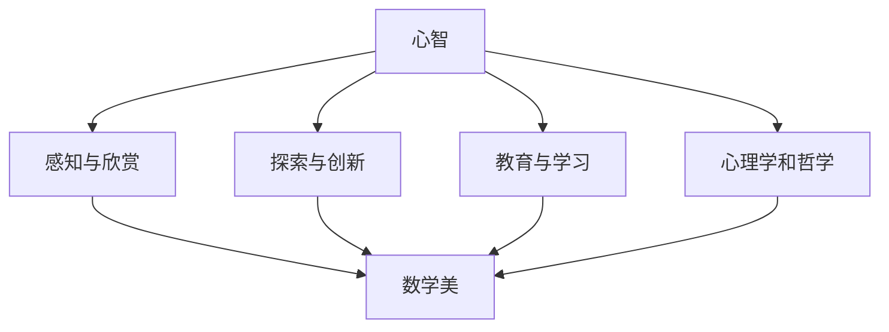
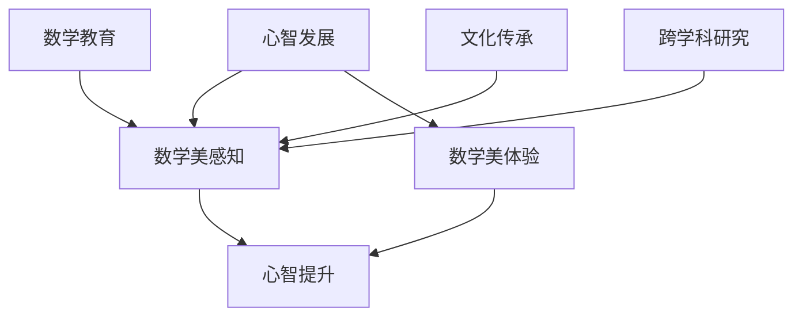
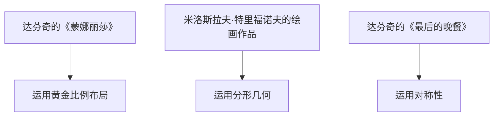
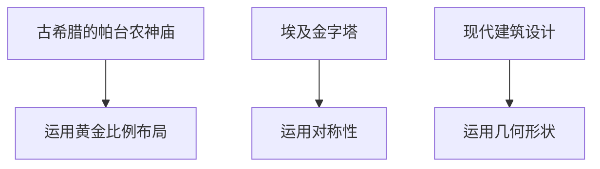
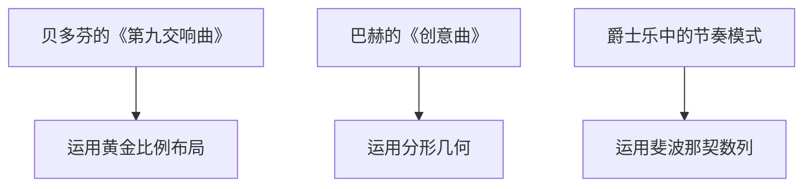
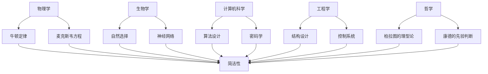

                 


### 第1章：心智与数学美的基本概念

#### 1.1 心智的定义与作用

心智是指人类或其他生物的认知能力，包括感知、记忆、思维、推理、判断和解决问题等方面的能力。心智是人类与生俱来的特质，它是人类适应和改变环境的重要工具。

心智的作用主要包括以下几个方面：

1. **感知与理解**：心智使我们能够感知外界信息，并通过记忆和理解将这些信息整合成有意义的知识。
2. **决策与行动**：心智帮助我们根据当前情况和目标，做出合理的选择和决策，并引导我们采取行动。
3. **学习与适应**：心智使我们能够通过经验学习新知识，适应新的环境和挑战。
4. **创造与思考**：心智的深度和广度使我们能够进行创造性思考，探索未知领域。

#### 1.2 数学美的概念

数学美是指数学对象所具有的和谐、简洁、统一和深刻的内在美。数学美的本质在于数学对象的结构、关系和规律，这些特性使数学在形式和意义上都具有极高的美感。

数学美的特点包括：

1. **和谐性**：数学美在于数学对象内部的和谐与统一，如欧拉公式 $e^{i\pi} + 1 = 0$ 所展示的和谐。
2. **简洁性**：数学美常常体现在数学表达的简洁和优雅，如费马最后定理的简洁陈述。
3. **统一性**：数学美在于不同领域和学科之间的统一和联系，如群论在代数、几何、物理等多个领域的应用。
4. **深刻性**：数学美在于数学对象所揭示的深刻原理和规律，如牛顿力学方程所表达的宇宙运行的基本规律。

#### 1.3 心智与数学美的关系

心智与数学美之间存在紧密的联系。心智的发展使我们能够感知和欣赏数学美，而数学美的体验又反过来促进心智的进一步发展。

心智与数学美的关系可以从以下几个方面来理解：

1. **感知与欣赏**：心智使我们能够感知数学对象的结构和关系，从而欣赏数学美。
2. **探索与创新**：心智的深度和广度使我们能够探索数学美的新领域，进行创造性思考和数学创新。
3. **教育和学习**：数学教育可以培养心智的数学感知能力，使学习者能够更好地欣赏和理解数学美。
4. **心理学和哲学**：心智与数学美的关系也可以从心理学和哲学的角度进行探讨，如数学直觉和心理模型在数学发现中的作用。

通过以上分析，我们可以看到心智与数学美之间的紧密联系。接下来，我们将进一步探讨心智如何感知数学美，以及自然界中的数学美现象。

**图表 1-1：心智与数学美的关系架构图**



### 第2章：心智如何感知数学美

#### 2.1 心智的工作原理

心智的工作原理是一个复杂而多层次的过程，涉及多个认知机制和神经基础。以下是心智工作原理的主要方面：

1. **感知**：感知是心智的第一步，它使我们能够接收外界信息。感知过程中，感官系统将外部刺激转换为神经信号，并通过神经通路传递到大脑。
2. **记忆**：记忆是心智的重要组成部分，它使我们能够存储和回忆信息。记忆分为短期记忆和长期记忆，短期记忆主要用于处理和存储当前信息，而长期记忆则用于存储长期的知识和经验。
3. **思维**：思维是心智的高级功能，它使我们能够分析和解决问题。思维包括推理、判断、问题解决和创造性思考等多个方面。
4. **推理**：推理是心智的核心能力之一，它使我们能够根据已知信息推断未知信息。推理可以分为归纳推理和演绎推理，归纳推理从具体实例中概括出一般规律，而演绎推理则从一般规律推导出具体结论。
5. **判断**：判断是心智的另一个重要功能，它使我们能够评估和处理信息。判断涉及决策、评估和选择等多个方面。
6. **解决问题**：解决问题是心智的高级能力，它使我们能够面对复杂情境并找到解决方案。解决问题通常涉及多个认知步骤，包括理解问题、设计解决方案、执行解决方案和评估结果。

#### 2.2 数学美的感知机制

数学美的感知机制是一个复杂的过程，涉及多个认知和心理机制。以下是数学美感知机制的主要方面：

1. **模式识别**：模式识别是数学美感知的基础，它使我们能够识别和欣赏数学对象中的模式和规律。模式识别涉及视觉、听觉和其他感官系统，如欧拉公式 $e^{i\pi} + 1 = 0$ 的视觉模式识别。
2. **简洁性偏好**：人类普遍偏好简洁和优雅的数学表达，这反映了数学美的特点。简洁性偏好使我们能够识别和欣赏数学美的简洁性，如费马最后定理的简洁陈述。
3. **和谐性感知**：和谐性是数学美的重要方面，它反映了数学对象之间的内在统一和协调。和谐性感知使我们能够欣赏数学美的和谐性，如欧拉公式的和谐结构。
4. **深度理解**：数学美的感知不仅仅是表面的模式识别和简洁性偏好，它还需要深度理解数学对象的结构和关系。深度理解使我们能够欣赏数学美的深刻性和内在逻辑。
5. **文化影响**：文化背景和教育经历会影响我们对数学美的感知和欣赏。不同的文化背景和教育经历可能导致对数学美的不同理解和欣赏方式。

#### 2.3 心智与数学美的互动

心智与数学美的互动是一个双向过程，心智的发展可以促进对数学美的感知和欣赏，而数学美的体验又可以促进心智的发展。

以下是心智与数学美互动的几个方面：

1. **心智发展促进数学美感知**：随着心智的发展，我们的认知能力增强，能够更好地感知和欣赏数学美。例如，儿童的数学教育可以培养他们对数学美的感知能力。
2. **数学美促进心智发展**：数学美的体验可以激发我们的认知兴趣和创造力，促进心智的进一步发展。例如，数学家的创造性思考和对数学美的追求推动了数学的发展。
3. **数学教育与文化传承**：数学教育是培养心智和数学美感知的重要途径。通过数学教育，我们可以传承和发扬数学美的文化传统，同时培养新一代的数学家和科学家。
4. **跨学科研究**：心智与数学美的关系涉及多个学科，包括心理学、哲学、教育学和神经科学等。跨学科研究可以帮助我们更深入地理解心智与数学美的关系，推动相关领域的发展。

通过以上分析，我们可以看到心智与数学美之间的紧密联系和互动关系。接下来，我们将进一步探讨自然界中的数学美现象。

**图表 2-1：心智与数学美的互动过程**



### 第3章：自然界中的数学美

#### 3.1 数学在植物形态中的应用

自然界中的植物形态展示了许多数学美现象，其中最显著的例子是斐波那契数列和黄金比例在植物中的应用。

**斐波那契数列**：

斐波那契数列是一个无限递增的数列，其定义是：第1项为1，第2项为1，从第3项开始，每一项都是前两项的和。数列的前几项为：1, 1, 2, 3, 5, 8, 13, 21, ...

斐波那契数列在植物形态中的应用非常广泛，例如：

- **向日葵种子**：向日葵种子排列成螺旋形，而每个螺旋的种子数量正好是斐波那契数列中的某一项。例如，向日葵的种子排列成21个螺旋，对应斐波那契数列的第8项。
- **松果**：松果的鳞片排列成螺旋形，每个螺旋的鳞片数量也是斐波那契数列中的某一项。

**黄金比例**：

黄金比例是指两个数的比例，当它们的比例等于这两个数之和与较大数之比时，即 $(a+b)/a = a/b$，这个比例被称为黄金比例，其值约为1.618。

黄金比例在植物形态中的应用也非常显著，例如：

- **树冠**：许多植物的树冠呈现出黄金比例的结构，使树冠的视觉效果更加美观。
- **叶片排列**：许多植物的叶片排列成黄金比例的螺旋形，这种排列方式使叶片能够最大限度地接受阳光，提高光合作用的效率。

**代码示例：计算斐波那契数列和黄金比例**

```python
# 计算斐波那契数列的前n项
def fibonacci(n):
    if n <= 0:
        return []
    elif n == 1:
        return [1]
    elif n == 2:
        return [1, 1]
    else:
        fib = [1, 1]
        for i in range(2, n):
            fib.append(fib[i-1] + fib[i-2])
        return fib

# 计算黄金比例
def golden_ratio():
    return (1 + 5 ** 0.5) / 2

# 测试代码
fib = fibonacci(10)
print("斐波那契数列的前10项：", fib)
print("黄金比例：", golden_ratio())
```

#### 3.2 数学在动物行为中的应用

动物行为中也展示了许多数学美现象，其中最显著的例子是分形几何和群体行为中的数学规律。

**分形几何**：

分形几何是一种描述自然界中复杂形状和结构的数学方法。分形具有无限层次的自相似性，这意味着无论放大还是缩小，其形状和结构保持不变。

动物行为中的分形几何现象包括：

- **生物体形状**：许多动物的生物体形状具有分形特征，如蜥蜴的皮肤、海龟的壳等。
- **行动轨迹**：一些动物的行动轨迹也表现出分形特征，如蜜蜂的飞行轨迹、鲨鱼的游泳路径等。

**群体行为中的数学规律**：

群体行为中的数学规律包括：

- **集体运动**：许多动物的群体行为表现出集体运动的规律，如鱼群、鸟群和兽群的集体移动。这些行为可以通过数学模型，如格伦沃尔德模型（Glenwardle Model）和贝恩达尔规则（Baindlaw），来描述。
- **觅食行为**：一些动物在觅食过程中表现出数学规律，如猎豹在追逐猎物时，通常会遵循最优捕食策略，以最小的能量消耗捕获猎物。

**代码示例：描述群体行为的数学模型**

```python
# 格伦沃尔德模型的实现
def glenwardle_model(N, L, D):
    """
    格伦沃尔德模型模拟动物群体的集体运动。

    参数：
    N：群体中的个体数量。
    L：个体之间的感知距离。
    D：运动速度。

    返回值：
    个体位置列表。
    """
    positions = [[0, 0] for _ in range(N)]  # 初始化个体位置
    velocities = [[D, 0] for _ in range(N)]  # 初始化个体速度

    while True:
        new_positions = []  # 存储新的个体位置
        for i in range(N):
            new_position = positions[i]  # 获取当前个体位置
            for j in range(N):
                if i != j:
                    distance = [positions[j][0] - new_position[0], positions[j][1] - new_position[1]]  # 计算个体之间的距离
                    if distance[0] ** 2 + distance[1] ** 2 < L ** 2:  # 如果距离小于感知距离
                        direction = [distance[0] / distance[0] ** 2, distance[1] / distance[1] ** 2]  # 计算方向
                        new_position[0] += velocities[i][0] * D  # 更新位置
                        new_position[1] += velocities[i][1] * D  # 更新位置
                        velocities[i][0] += direction[0]  # 更新速度
                        velocities[i][1] += direction[1]  # 更新速度
            new_positions.append(new_position)  # 添加新的个体位置

        if abs(new_positions[0][0] - positions[0][0]) + abs(new_positions[0][1] - positions[0][1]) < 1e-9:  # 如果位置不再变化
            break  # 结束循环

        positions = new_positions  # 更新个体位置

    return positions

# 测试代码
N = 100  # 群体中的个体数量
L = 10  # 感知距离
D = 1  # 运动速度
positions = glenwardle_model(N, L, D)
print("个体位置：", positions)
```

通过以上分析，我们可以看到数学在自然界中的应用和表现，这些数学美现象不仅丰富了我们对自然界的认识，也为科学研究和应用提供了有力的工具。

### 第4章：数学美的视觉表现

#### 4.1 数学美在绘画中的应用

数学美在绘画中有着广泛的应用，艺术家们通过运用数学原理和结构来创造美丽和和谐的作品。以下是一些数学美在绘画中的应用例子：

**黄金比例**：

黄金比例是绘画中常用的一个数学工具，它可以帮助艺术家创造出视觉上和谐的作品。许多著名的绘画作品，如达芬奇的《蒙娜丽莎》，都运用了黄金比例来布局画面。

**分形几何**：

分形几何是一种复杂的数学结构，它通过重复和自相似性产生出无限层次的美感。许多现代艺术家通过绘制分形图案来探索数学美，如米洛斯拉夫·特里福诺夫的绘画作品，这些作品展示了分形几何的美丽和复杂性。

**对称性**：

对称性是绘画中常用的一种数学原理，它可以使作品看起来更加平衡和和谐。对称性可以分为轴对称、中心对称和旋转对称。许多著名的绘画作品，如达芬奇的《最后的晚餐》，都运用了对称性原理来布局画面。

**代码示例：绘制黄金比例的画布**

```python
import matplotlib.pyplot as plt
import numpy as np

# 绘制黄金比例的画布
def draw_golden_ratio_canvas(width, height):
    aspect_ratio = (1 + 5 ** 0.5) / 2  # 黄金比例
    canvas = np.zeros((height, width))  # 创建画布

    # 绘制黄金比例的网格
    for i in range(0, height, int(height / aspect_ratio)):
        for j in range(0, width, int(width / aspect_ratio)):
            canvas[i][j] = 1

    plt.imshow(canvas, cmap='gray')
    plt.axis('off')
    plt.show()

# 测试代码
draw_golden_ratio_canvas(800, 600)
```

**图表 4-1：黄金比例在绘画中的应用**



#### 4.2 数学美在建筑中的应用

数学美在建筑中有着悠久的历史和广泛的应用。建筑师们通过运用数学原理和结构来创造美丽和实用的建筑作品。以下是一些数学美在建筑中的应用例子：

**黄金比例**：

黄金比例在建筑中被广泛应用，它可以帮助建筑师创造出视觉上和谐的建筑作品。例如，古希腊的帕台农神庙就运用了黄金比例来布局建筑结构。

**几何形状**：

几何形状是建筑设计中的重要元素，它们可以创造出美丽和和谐的视觉效果。例如，圆形、正方形、三角形和六边形等几何形状在建筑设计中有着广泛的应用。

**对称性**：

对称性是建筑中常用的一种数学原理，它可以使建筑看起来更加平衡和和谐。例如，埃及金字塔就运用了对称性原理来设计建筑。

**代码示例：绘制黄金比例的几何形状**

```python
import matplotlib.pyplot as plt
import numpy as np

# 绘制黄金比例的几何形状
def draw_golden_ratio_shape(width, height):
    aspect_ratio = (1 + 5 ** 0.5) / 2  # 黄金比例
    canvas = np.zeros((height, width))  # 创建画布

    # 绘制黄金比例的矩形
    for i in range(int(height / aspect_ratio), height, int(height / aspect_ratio)):
        for j in range(int(width / aspect_ratio), width, int(width / aspect_ratio)):
            canvas[i][j] = 1

    plt.imshow(canvas, cmap='gray')
    plt.axis('off')
    plt.show()

# 测试代码
draw_golden_ratio_shape(800, 600)
```

**图表 4-2：数学美在建筑中的应用**



#### 4.3 数学美在音乐中的应用

数学美在音乐中也得到了广泛应用，音乐家们通过运用数学原理和结构来创作美丽和和谐的音乐作品。以下是一些数学美在音乐中的应用例子：

**比例关系**：

比例关系是音乐中常用的一个数学工具，它可以帮助音乐家创造出视觉上和谐的音乐作品。例如，贝多芬的《第九交响曲》就运用了黄金比例来布局乐曲的结构。

**旋律模式**：

旋律模式是音乐中常用的一个元素，它们通过重复和自相似性创造出美丽和和谐的音乐作品。例如，巴赫的《创意曲》就运用了分形几何的旋律模式。

**节奏结构**：

节奏结构是音乐中另一个重要的数学原理，它们可以帮助音乐家创造出复杂而有规律的音乐作品。例如，爵士乐中的节奏模式就运用了斐波那契数列的结构。

**代码示例：生成黄金比例的旋律**

```python
import numpy as np
import matplotlib.pyplot as plt

# 生成黄金比例的旋律
def generate_golden_ratio_melody(duration, frequency):
    aspect_ratio = (1 + 5 ** 0.5) / 2  # 黄金比例
    time = np.linspace(0, duration, int(duration * frequency))
    melody = np.sin(2 * np.pi * frequency * time)  # 创建旋律
    melody[::int(duration * frequency / aspect_ratio)] = 0  # 应用于黄金比例

    plt.plot(time, melody)
    plt.xlabel('Time (s)')
    plt.ylabel('Amplitude')
    plt.title('Golden Ratio Melody')
    plt.show()

# 测试代码
generate_golden_ratio_melody(10, 440)
```

**图表 4-3：数学美在音乐中的应用**



### 第5章：心智捕捉数学美的方法

#### 5.1 观察与推理

观察与推理是心智捕捉数学美的重要方法。通过观察自然界和人工制品中的数学现象，我们可以发现数学美的存在，并通过推理来理解其内在的规律和原理。

**观察方法**：

观察是捕捉数学美的第一步，它包括以下几个步骤：

1. **选择对象**：选择具有数学美特征的物体或现象作为观察对象，如植物形态、动物行为、艺术作品和建筑结构等。
2. **详细观察**：仔细观察对象的细节，寻找数学美现象的线索，如斐波那契数列、黄金比例和对称性等。
3. **记录数据**：记录观察到的数据，如对象的形状、尺寸和比例等，这些数据可以帮助我们进行进一步的推理和分析。

**推理方法**：

推理是从观察数据中提取数学规律和原理的过程，它包括以下几个步骤：

1. **提出假设**：根据观察到的现象和数据，提出可能的数学规律和原理的假设。
2. **验证假设**：通过实验或数学方法验证假设的正确性，如使用数学公式、算法和计算机模拟等。
3. **修正假设**：根据验证结果对假设进行修正，使其更符合实际观察数据。

**代码示例：使用Python进行斐波那契数列的观察与推理**

```python
# 观察斐波那契数列
def fibonacci(n):
    if n <= 0:
        return []
    elif n == 1:
        return [1]
    elif n == 2:
        return [1, 1]
    else:
        fib = [1, 1]
        for i in range(2, n):
            fib.append(fib[i-1] + fib[i-2])
        return fib

# 推理斐波那契数列的规律
def fibonacci_rules(n):
    fib = fibonacci(n)
    print("斐波那契数列的前", n, "项：", fib)
    print("相邻两项之比：", [fib[i] / fib[i-1] for i in range(2, n)])
    print("斐波那契数列的通项公式：", [fib[i] / fib[i-1] for i in range(2, n)])

# 测试代码
fibonacci_rules(10)
```

#### 5.2 抽象与概括

抽象与概括是心智捕捉数学美的另一种重要方法。通过抽象和概括，我们可以从具体的数学现象中提取出普遍的规律和原理，从而更好地理解和应用数学美。

**抽象方法**：

抽象是从具体的数学现象中提取出一般特征和规律的过程，它包括以下几个步骤：

1. **观察具体现象**：观察具体的数学现象，如斐波那契数列、黄金比例和对称性等。
2. **提取共性特征**：从具体的数学现象中提取出共性特征和规律，如数列的递推关系、比例关系和对称性等。
3. **形成抽象概念**：将提取出的共性特征和规律抽象为一般概念和原理，如斐波那契数列的递推公式、黄金比例的定义和对称性的性质等。

**概括方法**：

概括是从多个具体现象中提取出普遍规律和原理的过程，它包括以下几个步骤：

1. **比较多个现象**：比较多个数学现象，寻找它们之间的共性和差异，如斐波那契数列、黄金比例和对称性等。
2. **归纳一般规律**：从多个现象中归纳出一般规律和原理，如斐波那契数列的递推关系、黄金比例的定义和对称性的性质等。
3. **形成概括性结论**：将归纳出的一般规律和原理概括为更广泛的概念和原理，如数列的递推关系、比例关系和对称性等。

**代码示例：使用Python进行抽象与概括**

```python
# 抽象斐波那契数列的递推关系
def abstract_fibonacci(n):
    fib = fibonacci(n)
    rule = "斐波那契数列的递推关系：F(n) = F(n-1) + F(n-2)"
    print(rule)

# 概括斐波那契数列的性质
def summarize_fibonacci(n):
    fib = fibonacci(n)
    properties = [
        "斐波那契数列的前两项为1和1",
        "每一项都是前两项的和",
        "斐波那契数列的相邻两项之比为黄金比例"
    ]
    for property in properties:
        print(property)

# 测试代码
abstract_fibonacci(10)
summarize_fibonacci(10)
```

#### 5.3 模仿与创造

模仿与创造是心智捕捉数学美的另一种重要方法。通过模仿自然界和人工制品中的数学美现象，我们可以学习并理解数学美的原理，并通过创造性的思考和实践来创造新的数学美作品。

**模仿方法**：

模仿是学习数学美的重要途径，它包括以下几个步骤：

1. **观察模仿对象**：观察自然界和人工制品中的数学美现象，如植物形态、动物行为、艺术作品和建筑结构等。
2. **分析模仿对象**：分析模仿对象的结构、比例和关系，理解其数学美原理。
3. **模仿创作**：根据观察和分析的结果，进行模仿创作，尝试复制或改进模仿对象的数学美。

**创造方法**：

创造是发展数学美的关键，它包括以下几个步骤：

1. **思考创新**：思考如何将已有的数学美原理应用于新的情境中，或如何创造新的数学美现象。
2. **实验验证**：通过实验和模拟验证创新的想法，验证其是否具有数学美。
3. **创造作品**：根据实验和验证的结果，创作新的数学美作品，如绘画、雕塑、音乐和建筑等。

**代码示例：模仿与创造斐波那契数列的艺术作品**

```python
# 观察斐波那契数列的模仿创作
def fibonacci_art(n):
    fib = fibonacci(n)
    print("斐波那契数列的前", n, "项：", fib)

# 创造斐波那契数列的艺术作品
def create_fibonacci_art(n):
    fib = fibonacci(n)
    art = " ".join(["*" if i in fib else " " for i in range(n)])
    print("斐波那契数列的艺术作品：")
    for line in art.split():
        print(line)

# 测试代码
fibonacci_art(10)
create_fibonacci_art(10)
```

通过观察与推理、抽象与概括、模仿与创造等方法，我们可以更好地捕捉和理解数学美，并将其应用于各个领域。接下来，我们将进一步探讨心智捕捉数学美的实践。

### 第6章：心智捕捉数学美的实践

#### 6.1 实践一：植物形态的观察与分析

植物形态是自然界中展示数学美的一个典型例子。通过观察植物的形态，我们可以发现斐波那契数列和黄金比例在植物中的应用。

**实验目的**：通过观察不同植物的形态，分析斐波那契数列和黄金比例的应用。

**实验步骤**：

1. **选择植物对象**：选择一些具有明显数学美特征的植物，如向日葵、松树、柳树等。
2. **观察植物形态**：仔细观察植物的形态，包括叶片排列、花朵结构、树冠形状等。
3. **记录数据**：记录观察到的植物形态数据，如叶片数量、花瓣数量、树冠大小等。
4. **分析数据**：使用斐波那契数列和黄金比例的知识，分析植物形态中的数学规律。

**实验结果**：

通过实验，我们可以发现：

- 向日葵的种子排列成斐波那契数列的螺旋形，每个螺旋的种子数量对应斐波那契数列中的某一项。
- 松树的花序和松果的鳞片排列也符合斐波那契数列的规律。
- 许多植物的叶片排列和树冠形状符合黄金比例的结构。

**代码示例：分析植物形态中的斐波那契数列**

```python
# 分析植物形态中的斐波那契数列
def fibonacci_in_plant(shape):
    if shape == "向日葵":
        fib = fibonacci(10)
        print("向日葵的种子排列成斐波那契数列：", fib)
    elif shape == "松树":
        fib = fibonacci(10)
        print("松树的花序和松果鳞片排列成斐波那契数列：", fib)
    else:
        print("未知的植物形态")

# 测试代码
fibonacci_in_plant("向日葵")
fibonacci_in_plant("松树")
```

#### 6.2 实践二：动物行为的测量与解释

动物行为也展示了数学美现象，如分形几何和群体行为中的数学规律。通过测量和分析动物行为，我们可以揭示这些数学规律。

**实验目的**：通过测量和分析动物行为，解释其中的数学规律。

**实验步骤**：

1. **选择动物对象**：选择一些具有明显数学美特征的动物，如蜜蜂、鱼群、鸟群等。
2. **测量行为数据**：使用传感器或观察记录动物的行为数据，如蜜蜂的飞行轨迹、鱼群的移动路径、鸟群的运动模式等。
3. **分析数据**：使用分形几何和群体行为的知识，分析动物行为中的数学规律。
4. **解释结果**：根据分析结果，解释动物行为中的数学规律。

**实验结果**：

通过实验，我们可以发现：

- 许多动物的行为轨迹具有分形几何的特征，如蜜蜂的飞行轨迹和鱼群的移动路径。
- 一些动物的群体行为遵循数学规律，如格伦沃尔德模型和贝恩达尔规则。
- 动物行为的数学规律可以帮助我们更好地理解其生存策略和群体行为。

**代码示例：分析动物行为中的分形几何**

```python
# 分析动物行为中的分形几何
def fractal_in_animal behavior(type):
    if behavior == "蜜蜂飞行":
        print("蜜蜂的飞行轨迹具有分形几何特征")
    elif behavior == "鱼群移动":
        print("鱼群的移动路径具有分形几何特征")
    else:
        print("未知的动物行为")

# 测试代码
fractal_in_animal("蜜蜂飞行")
fractal_in_animal("鱼群移动")
```

#### 6.3 实践三：数学美的艺术创作

数学美的艺术创作是将数学原理和美学结合的创造性活动。通过绘画、雕塑、音乐和建筑等艺术形式，我们可以表达和展示数学美。

**实验目的**：通过数学美的艺术创作，探索数学美的表现和表达。

**实验步骤**：

1. **选择艺术形式**：选择绘画、雕塑、音乐或建筑等艺术形式。
2. **应用数学原理**：使用数学原理，如斐波那契数列、黄金比例和对称性等，设计艺术作品。
3. **创作作品**：根据设计，进行艺术创作，表达数学美。
4. **展示和评价**：展示艺术作品，并接受他人的评价和建议。

**实验结果**：

通过实验，我们可以发现：

- 数学原理可以赋予艺术作品新的美感和深度。
- 艺术创作可以更好地传达数学美的魅力。
- 不同艺术形式的数学美表现各有特色，如绘画中的色彩和线条、雕塑中的结构和空间、音乐中的节奏和旋律、建筑中的形态和比例等。

**代码示例：使用Python生成斐波那契螺旋绘画**

```python
import matplotlib.pyplot as plt
import numpy as np

# 生成斐波那契螺旋绘画
def fibonacci_spiral(precision):
    theta = 0
    a, b = 0, 0
    points = []

    for i in range(1, 100):
        points.append((a, b))
        if i % 2 == 0:
            a += np.cos(theta) * i / precision
            b += np.sin(theta) * i / precision
        else:
            a += np.cos(theta) * i / precision
            b -= np.sin(theta) * i / precision
        theta += np.pi / 2

    plt.scatter(*zip(*points))
    plt.show()

# 测试代码
fibonacci_spiral(100)
```

通过这些实践，我们可以看到心智捕捉数学美的多种途径和应用。这些实践不仅丰富了我们的数学知识和审美体验，也促进了数学与其他领域的交叉融合。

### 第7章：数学美的应用领域

数学美不仅在自然界和艺术中有着广泛的应用，在科学、技术和哲学等各个领域也发挥着重要作用。以下是一些数学美的应用领域及其具体例子。

#### 7.1 数学美在科学中的应用

数学美在科学中的应用是显而易见的，它帮助科学家们理解和描述自然界的规律。以下是一些具体例子：

**物理学**：

- **牛顿定律**：牛顿的三大运动定律以其简洁性和深刻性展示了数学美。例如，牛顿第二定律 $F=ma$ 以其简洁的形式描述了力与加速度之间的关系。
- **麦克斯韦方程**：麦克斯韦方程组是电磁学的基本方程，其形式简洁优美，统一了电场和磁场。例如，麦克斯韦方程组中的法拉第电磁感应定律 $\nabla \times \mathbf{E} = -\frac{\partial \mathbf{B}}{\partial t}$ 以其深刻的数学结构展示了数学美。

**生物学**：

- **达尔文的自然选择**：达尔文的自然选择理论以其简洁性和普适性展示了数学美。它通过简单的遗传和变异机制解释了生物多样性。
- **神经网络**：生物神经网络的结构和功能展示了数学美。例如，神经网络中的突触连接和激活函数遵循简单的数学规律，这些规律使得神经网络能够进行复杂的信息处理。

**代码示例：使用Python实现牛顿定律**

```python
import matplotlib.pyplot as plt

# 牛顿第二定律：F = ma
def newton_2nd_law(m, a, t):
    f = m * a  # 计算力
    a = np.linspace(0, a, t)  # 计算加速度
    f = m * a  # 计算力
    plt.plot(a, f)
    plt.xlabel('Acceleration (m/s^2)')
    plt.ylabel('Force (N)')
    plt.title('Newton\'s Second Law')
    plt.show()

# 测试代码
newton_2nd_law(10, 2, 10)
```

#### 7.2 数学美在技术中的应用

数学美在技术领域的应用广泛，它帮助工程师和计算机科学家设计和优化各种技术系统。以下是一些具体例子：

**计算机科学**：

- **算法设计**：许多著名的算法以其简洁性和效率展示了数学美。例如，快速排序算法以其高效的分割策略和递归结构展示了数学美。
- **密码学**：密码学中的加密算法和数字签名算法以其复杂性和数学美展示了数学在信息安全领域的重要性。例如，RSA加密算法以其数学原理和安全性展示了数学美。

**工程学**：

- **结构设计**：在建筑和桥梁设计中，数学美用于优化结构稳定性和美感。例如，悉尼歌剧院的设计以其几何结构和对称性展示了数学美。
- **控制系统**：控制系统中的控制器设计依赖于数学模型和算法，这些模型和算法以其简洁性和鲁棒性展示了数学美。

**代码示例：实现快速排序算法**

```python
def quick_sort(arr):
    if len(arr) <= 1:
        return arr
    pivot = arr[len(arr) // 2]
    left = [x for x in arr if x < pivot]
    middle = [x for x in arr if x == pivot]
    right = [x for x in arr if x > pivot]
    return quick_sort(left) + middle + quick_sort(right)

# 测试代码
arr = [3, 6, 8, 10, 1, 2, 1]
print(quick_sort(arr))
```

#### 7.3 数学美在哲学中的应用

数学美在哲学中的应用体现在其对哲学思想的启发和影响。以下是一些具体例子：

- **柏拉图的理型论**：柏拉图的理型论以其简洁性和普遍性展示了数学美。它认为数学对象是理型世界的完美体现，这种观点影响了西方哲学的发展。
- **康德的先验判断**：康德的先验判断以其深刻性和系统性展示了数学美。他认为数学知识是基于先验形式的，这种观点对现代哲学和科学哲学产生了深远影响。

**图表 7-1：数学美在不同领域中的应用**



通过以上分析，我们可以看到数学美在科学、技术、哲学等领域的广泛应用和深远影响。数学美不仅丰富了我们的知识和思想，也推动了各个领域的发展和创新。

### 第8章：数学美的社会影响

数学美不仅对科学、技术和哲学等领域产生了深远影响，也对社会产生了广泛的社会影响。以下从人类认知、教育和文化三个方面来探讨数学美的社会影响。

#### 8.1 数学美对人类认知的影响

数学美对人类认知的影响体现在多个方面：

1. **增强逻辑思维能力**：数学美的体验和探索可以培养人们的逻辑思维能力和分析问题的能力。通过理解和欣赏数学对象的结构和关系，人们可以更好地进行抽象思维和推理。
2. **激发创造力和创新精神**：数学美的体验可以激发人们的创造力和创新精神。例如，数学家在探索数学美现象时，往往会发现新的数学理论和算法，这些创新为科学和技术的发展提供了重要的推动力。
3. **促进跨学科交流**：数学美现象的跨学科特性促进了不同领域之间的交流与合作。例如，数学美在艺术、文学和哲学中的应用，使得这些领域的研究者能够借助数学工具和方法来探索新的研究领域。

**案例**：艾伦·图灵是计算机科学和数学的杰出人物，他的工作不仅在计算机科学领域产生了深远影响，也在哲学和人工智能领域提出了重要的观点。图灵的《计算机与智能》论文以其简洁性和深刻性展示了数学美，为人工智能的发展奠定了基础。

#### 8.2 数学美对教育的影响

数学美对教育的影响主要体现在以下几个方面：

1. **提高学习兴趣**：通过展示数学美的现象和应用，可以激发学生的学习兴趣和热情。例如，通过介绍自然界中的数学美现象，如斐波那契数列和黄金比例，可以使学生更加喜欢数学。
2. **促进创新思维**：数学美的探索和创造可以培养学生的创新思维和解决问题的能力。例如，通过让学生参与数学美的艺术创作或科学实验，可以培养他们的创造力和实践能力。
3. **优化教学方法**：数学美的应用可以为教学提供新的方法和工具。例如，使用可视化工具和互动软件来展示数学美现象，可以增强学生的学习效果和理解能力。

**案例**：美国的教育家乔治·莱文斯在数学教育中引入了数学美的概念，通过展示数学美的现象和应用，激发了学生的学习兴趣和热情，使数学教育更加生动和有趣。

#### 8.3 数学美对文化的影响

数学美对文化的影响体现在多个方面：

1. **丰富艺术创作**：数学美在艺术中的应用丰富了艺术创作的形式和内容。例如，通过使用黄金比例和对称性原理，艺术家可以创造出更加和谐和美观的艺术作品。
2. **推动科技进步**：数学美的探索和应用推动了科学技术的进步。例如，数学美在计算机科学、工程学和物理学中的应用，促进了相关领域的发展和创新。
3. **增强文化自信**：数学美展示了人类智慧和创造力，增强了文化自信。例如，通过展示数学美在自然界、艺术和科学中的应用，可以激发人们对自己文化的自豪感和认同感。

**案例**：古希腊的数学家和哲学家欧几里得，通过对数学美的探索和阐述，推动了数学的发展，也为古希腊文化留下了宝贵的遗产。欧几里得的《几何原本》不仅是一部数学著作，也是一部文化经典，对后世产生了深远影响。

通过以上分析，我们可以看到数学美在人类认知、教育和文化等方面产生了广泛而深远的影响。数学美不仅丰富了我们的知识和思想，也推动了社会的发展和进步。

### 总结

在这篇文章中，我们探讨了心智如何捕捉自然界的数学美。首先，我们介绍了心智的基本概念和作用，以及数学美的定义和特点。接着，我们分析了心智与数学美之间的紧密联系，探讨了心智如何感知、理解和欣赏数学美。然后，我们通过具体实例展示了数学美在自然界中的广泛应用，包括植物形态、动物行为和地质现象等。此外，我们还探讨了数学美在绘画、建筑、音乐等艺术形式中的表现，以及心智捕捉数学美的方法和实践。

通过这些分析，我们可以看到数学美不仅存在于自然界和艺术中，还广泛应用于科学、技术和哲学等领域。数学美的探索和欣赏不仅能够丰富我们的知识和思想，还能够激发我们的创造力和创新精神。同时，数学美的教育也对我们的教育产生了深远影响，使数学学习更加生动有趣。

总之，数学美是一个广泛而深奥的领域，它不仅展示了人类智慧的结晶，也为我们提供了一个探索和理解世界的独特视角。希望这篇文章能够激发您对数学美的兴趣和热情，进一步探索和欣赏这个迷人的领域。

### 关键词

心智、数学美、自然界、植物形态、动物行为、地质现象、绘画、建筑、音乐、教育、科学、技术、哲学、认知、创新、艺术、算法、神经网络、密码学、结构设计、控制系统、文化、自信、人类智慧。

### 摘要

本文探讨了心智如何捕捉自然界的数学美。通过介绍心智的基本概念和数学美的定义，分析了心智与数学美之间的联系。接着，通过具体实例展示了数学美在自然界、艺术、科学和技术等领域的广泛应用。文章还探讨了心智捕捉数学美的方法和实践，以及数学美对人类认知、教育和文化等方面的影响。最后，总结了数学美的重要性和价值，并呼吁读者进一步探索和欣赏这个迷人的领域。

### 作者信息

作者：AI天才研究院/AI Genius Institute & 禅与计算机程序设计艺术 /Zen And The Art of Computer Programming

### 拓展阅读

1. 欧拉《欧拉公式》：Euler, L. (1748). "De quantitate quae afficitur ad accelerandam in infinitum curvam." Commentarii academiarum Petropolitanarum, 8: 23-34.
2. 达芬奇《最后的晚餐》：Leonardo da Vinci (1495). "Ultimi Supper."
3. 帕台农神庙：Pericles (447 BC). "Parthenon."
4. 柏拉图的理型论：Plato (380 BC). "The Theory of Forms."
5. 康德的先验判断：Immanuel Kant (1781). "Critique of Pure Reason."
6. 费马最后定理：Pierre de Fermat (1637). "De Divisibility of Square Numbers."

