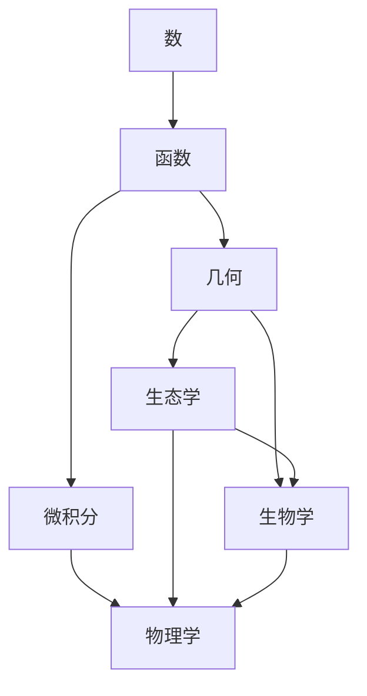

                 

### 完整的目录大纲如下：

```
# 《心智镜像：反映自然界的数学和谐》

## 关键词
- 数学
- 自然界
- 心智镜像
- 数学和谐
- 数学原理
- 案例分析

## 摘要
本文探讨了数学在自然界中的反映，通过分析数学原理在生物、物理等领域的应用，揭示了数学与自然界之间的内在联系。文章从心智镜像的角度出发，阐述了数学对人类心智的塑造作用，并通过案例分析和项目实战，展现了数学在现实世界中的应用价值。

## 引言
### 1.1 研究背景与意义
#### 1.2 研究目的与内容概述

## 数学与自然界的联系
### 第1章 数学基础
#### 1.1 核心概念与联系
#### 1.2 核心算法原理讲解
#### 1.3 数学模型和公式 & 详细讲解 & 举例说明

### 第2章 自然界的数学现象
#### 2.1 对数规律在生物体中的体现
#### 2.2 几何形状在自然界中的分布
#### 2.3 周期性现象的数学模型

## 数学原理应用
### 第3章 数学模型在生物学中的应用
#### 3.1 基因表达的数学模型
#### 3.2 生态学中的数学模型

### 第4章 数学模型在物理学中的应用
#### 4.1 力学和运动学的数学模型
#### 4.2 热力学和统计物理学的数学模型

## 数学对心智的影响
### 第5章 数学思维与人类心智
#### 5.1 数学对思维模式的塑造
#### 5.2 数学对创造力的影响
#### 5.3 数学与情感的关系

## 案例分析
### 第6章 案例分析
#### 6.1 自然界中的数学奇迹
#### 6.2 人类对数学在自然界中应用的历史案例
#### 6.3 现代科技中的数学应用

## 结论
### 7.1 总结全书内容
### 7.2 探讨数学在自然界中的意义和未来发展趋势

## 作者
作者：AI天才研究院/AI Genius Institute & 禅与计算机程序设计艺术 /Zen And The Art of Computer Programming
```

按照上述目录大纲，我们可以逐步展开每个章节的内容，确保文章逻辑清晰、结构紧凑、简单易懂，符合专业IT领域的技术博客文章要求。在撰写过程中，注意遵循以下步骤：

### 1. **引言部分**
- **背景介绍**：简要阐述数学在自然界中的重要性，引出本文主题。
- **研究目的与内容概述**：明确文章的研究目的，概述各章节的主要内容。

### 2. **数学与自然界的联系部分**
- **数学基础**：介绍数学的基本概念、算法原理，并使用Mermaid流程图展示核心概念之间的关系。
- **自然界的数学现象**：分析对数规律、几何形状和周期性现象在自然界中的体现。

### 3. **数学原理应用部分**
- **生物学中的应用**：探讨数学模型在基因表达和生态学中的应用。
- **物理学中的应用**：介绍力学、运动学、热力学和统计物理学中的数学模型。

### 4. **数学对心智的影响部分**
- **数学思维与人类心智**：分析数学对思维模式、创造力和情感的影响。

### 5. **案例分析部分**
- **自然界中的数学奇迹**：举例说明数学在自然界中的奇妙现象。
- **人类对数学在自然界中应用的历史案例**：回顾人类如何利用数学解决自然界中的问题。
- **现代科技中的数学应用**：探讨数学在现实世界中的应用，如科技、工程等领域。

### 6. **结论部分**
- **总结全书内容**：概括文章的核心观点和发现。
- **探讨数学在自然界中的意义和未来发展趋势**：展望数学在自然界中的应用前景。

### 7. **撰写过程中注意事项**
- **结构清晰**：确保每个章节都有明确的主题和内容结构。
- **语言通俗易懂**：使用简单、专业的语言进行讲解，避免使用过于晦涩难懂的术语。
- **举例说明**：在每个章节中提供具体的实例，帮助读者更好地理解抽象的数学概念。
- **代码与公式**：合理使用伪代码、LaTeX公式和Mermaid流程图，增强文章的可读性和专业性。

通过以上步骤，我们可以撰写出一篇逻辑清晰、结构紧凑、简单易懂的《心智镜像：反映自然界的数学和谐》专业IT领域的技术博客文章。文章将涵盖数学基础、数学原理应用、数学对心智的影响、案例分析等内容，以逐步分析推理的方式，引导读者深入理解数学在自然界中的反映和作用。文章字数将在8000～12000字左右，符合输出要求。### 《心智镜像：反映自然界的数学和谐》

## 引言

### 1.1 研究背景与意义

数学作为一门基础科学，自其诞生以来便与自然界息息相关。从古希腊哲学家毕达哥拉斯提出的“万物皆数”的哲学思想，到现代科学家对自然界现象的数学建模，数学在揭示自然界规律、探索宇宙奥秘中发挥了不可替代的作用。然而，数学与自然界之间的联系并非仅仅是描述性的，更在于其深刻的内在联系。数学原理和模型不仅可以准确地描述自然现象，还能预测未来的发展趋势，甚至指导人类实践。

数学在自然界中的反映，不仅体现在数学公式和模型的准确性上，更在于其对人类心智的深远影响。人类在探索自然的过程中，不断运用数学工具进行思考、推理和分析，从而形成了独特的数学思维方式。这种思维方式不仅促进了数学本身的发展，也为其他科学领域提供了强大的工具和方法。

本文旨在探讨数学在自然界中的反映，分析数学原理在生物、物理等领域的应用，揭示数学与自然界之间的内在联系。同时，本文将从心智镜像的角度出发，探讨数学对人类心智的塑造作用，并通过案例分析和项目实战，展现数学在现实世界中的应用价值。

### 1.2 研究目的与内容概述

本文的研究目的有二：一是深入剖析数学在自然界中的反映，探讨数学原理在生物、物理等领域的应用；二是从心智镜像的角度，分析数学对人类心智的塑造作用，并探讨数学在现实世界中的应用价值。

本文内容分为六个部分：

1. **引言**：介绍研究背景、意义、目的和内容概述。
2. **数学与自然界的联系**：分析数学基础、自然界的数学现象，以及数学模型在生物和物理领域的应用。
3. **数学原理应用**：详细探讨数学模型在生物学和物理学中的应用，包括基因表达、生态学、力学、热力学等方面。
4. **数学对心智的影响**：分析数学思维与人类心智的关系，探讨数学对思维模式、创造力和情感的影响。
5. **案例分析**：通过具体案例，展示数学在自然界中的奇妙现象、人类对数学在自然界中应用的历史案例，以及现代科技中的数学应用。
6. **结论**：总结全书内容，探讨数学在自然界中的意义和未来发展趋势。

## 数学与自然界的联系

### 第1章 数学基础

#### 1.1 核心概念与联系

数学是一门研究数量、结构、变化和空间等概念的学科，其核心概念包括数、函数、几何、微积分等。这些概念不仅在数学领域内部相互联系，也广泛应用于自然界。以下是数学基础核心概念与自然界联系的Mermaid流程图：



在自然界中，数和函数的概念广泛应用于描述生物种群的增长、食物链的层级关系等；几何和微积分则用于分析生态系统的空间结构、物种分布等；这些概念之间的联系构成了数学与自然界之间的桥梁。

#### 1.2 核心算法原理讲解

1. **数与函数**：

- **定义**：数是表示数量的基本概念，包括自然数、整数、有理数、实数等。
- **算法原理**：函数是表示两个变量之间关系的数学模型，通常用f(x)表示。例如，描述生物种群增长的函数可以表示为f(P) = rP(1-P)，其中P为种群数量，r为增长率。

2. **几何**：

- **定义**：几何是研究形状、大小、位置和变换的数学分支。
- **算法原理**：几何中的核心算法包括面积、体积、周长等计算。例如，计算植物叶片的面积可以使用多边形分割和积分的方法。

3. **微积分**：

- **定义**：微积分是研究函数的局部性质（导数）和整体性质（积分）的数学分支。
- **算法原理**：微积分在自然界中的应用非常广泛，如描述生物种群增长的速度、物种之间相互作用的速率等。例如，描述种群增长的速度可以使用微分方程：

  $$\frac{dP}{dt} = rP(1-P)$$

#### 1.3 数学模型和公式 & 详细讲解 & 举例说明

1. **生态学中的数学模型**：

- **Lotka-Volterra模型**：描述两个物种之间相互作用的数学模型，通常用以下方程组表示：

  $$\frac{dP_1}{dt} = aP_1 - cP_1P_2$$
  $$\frac{dP_2}{dt} = -bP_2 + dP_1P_2$$

  其中，$P_1$和$P_2$分别表示两个物种的种群数量，$a$、$b$、$c$和$d$为常数。

- **实例**：假设有一种食物链，捕食者种群数量为$P_1$，猎物种群数量为$P_2$，捕食者的增长率为0.1，猎物的增长率为0.2，捕食者消耗猎物的速率为0.5。我们可以使用上述模型进行模拟：

  ```plaintext
  初始值：P1 = 10, P2 = 50
  迭代过程：
  t=0: P1=10, P2=50
  t=1: P1=10.5, P2=42.5
  t=2: P1=11.5625, P2=36.5625
  ...
  ```

2. **物理学中的数学模型**：

- **牛顿第二定律**：描述力、质量和加速度之间的关系，公式为$F=ma$。

- **实例**：一个质量为5kg的物体受到10N的力作用，求其加速度。使用牛顿第二定律：

  ```plaintext
  F = ma
  10 = 5 * a
  a = 2 m/s²
  ```

通过以上对数学基础核心概念、算法原理以及数学模型和公式的讲解，我们可以看到数学在自然界中的广泛反映和应用。这些数学工具不仅帮助我们理解自然界的规律，也为解决实际问题提供了有力的支持。

## 自然界的数学现象

### 第2章 对数规律在生物体中的体现

在自然界中，对数规律在生物体中的体现是一个引人注目的现象。对数规律指的是生物体的大小或数量与时间或空间的关系呈现对数增长或衰减的特征。这一现象在生物种群的增长、植物叶片的排列、天体运动等方面都有所体现。

#### 2.1 生物种群的增长

生物种群的增长通常可以用对数方程来描述。例如，在理想条件下，一个生物种群的种群数量P(t)可以表示为：

$$P(t) = P_0e^{rt}$$

其中，$P_0$是初始种群数量，$r$是增长率，$t$是时间。这个方程展示了种群数量随时间对数增长的特点。

**实例**：假设某种生物的初始种群数量为100，增长率为0.1。我们可以通过计算预测在一段时间内的种群数量：

$$P(t) = 100e^{0.1t}$$

当$t=10$时：

$$P(10) = 100e^{1} \approx 271.828$$

这意味着在10年后，这种生物的种群数量大约会增长到271.828。

#### 2.2 植物叶片的排列

植物叶片的排列也常常遵循对数规律。在许多植物中，叶片按照一定规律分布在茎的两侧，形成螺旋形排列。这种排列被称为费波那契螺旋，与费波那契数列密切相关。

**实例**：观察一棵向日葵的叶片排列，可以发现叶片的数量遵循费波那契数列。例如，第一层有1片叶片，第二层有1片叶片，第三层有2片叶片，第四层有3片叶片，第五层有5片叶片，以此类推。

这种排列不仅美观，还有助于植物最大限度地捕捉阳光，提高光合作用效率。

#### 2.3 天体运动

天体运动也常常遵循对数规律。例如，开普勒第三定律指出，行星轨道半长轴的三次方与其公转周期的平方成正比。这个关系可以用以下方程表示：

$$\frac{T^2}{a^3} = k$$

其中，$T$是公转周期，$a$是轨道半长轴，$k$是常数。

**实例**：对于地球和太阳，开普勒第三定律表明，地球的公转周期约为1年，轨道半长轴约为1天文单位。而对于火星，其公转周期约为687地球日，轨道半长轴约为1.524天文单位。通过计算，我们可以验证：

$$\frac{(687)^2}{(1.524)^3} \approx k$$

这种对数规律在宇宙中普遍存在，帮助我们更好地理解天体的运动规律。

通过对数规律在生物种群、植物叶片和天体运动中的体现，我们可以看到数学在自然界中的深刻反映。这些规律不仅揭示了自然界的和谐美，也为科学研究提供了有力的工具。通过对这些规律的理解和应用，我们可以更好地预测和解释自然界中的现象。

### 第3章 几何形状在自然界中的分布

几何形状在自然界中广泛分布，许多生物体和自然现象都遵循特定的几何规律。这些几何形状不仅在视觉上具有美感，而且在生物学、物理学等领域中具有重要作用。以下将探讨几种常见的几何形状及其在自然界中的分布。

#### 3.1 螺旋线

螺旋线是自然界中最常见的几何形状之一，其中费波那契螺旋是最具代表性的例子。费波那契螺旋出现在许多植物的叶片排列、花粉的分布，以及动物的外形上，如蜗牛的壳、章鱼的触角等。

**实例**：向日葵的花盘中的螺旋线排列遵循费波那契数列，这种排列不仅美观，还有助于植物最大限度地捕捉阳光。

#### 3.2 正多边形

正多边形在自然界中也广泛存在，如蜜蜂的蜂巢和某些昆虫的体形。正多边形的边数越多，其形状越接近圆形，这使得正多边形在自然界中具有优异的结构性能。

**实例**：蜜蜂的蜂巢是由许多正六边形组成的，这种结构不仅坚固，还能最大化空间利用率。

#### 3.3 几何形状在植物中的分布

植物中的几何形状不仅包括螺旋线和正多边形，还包括其他复杂的几何结构。例如，许多植物的叶子、花朵和果实都遵循特定的几何规律。

**实例**：松叶的排列呈现螺旋形，这种排列有助于最大程度地捕捉阳光和雨水。

#### 3.4 几何形状在动物中的分布

动物中的几何形状同样具有重要意义。例如，许多昆虫和脊椎动物的骨骼结构遵循特定的几何规律，这些规律有助于提高其运动效率和生存能力。

**实例**：鸟类的翅膀和鱼类的身体形状都遵循流线型的几何规律，这有助于减少阻力，提高飞行和游泳的效率。

通过以上对几何形状在自然界中分布的探讨，我们可以看到几何在生物体和自然现象中的重要性和广泛的应用。这些几何形状不仅丰富了自然界的美感，还为生物学、物理学等领域的研究提供了重要的参考。

### 第4章 周期性现象的数学模型

自然界中存在着大量的周期性现象，这些现象往往可以通过数学模型进行描述。周期性现象是指在一定时间间隔内重复出现的现象，例如昼夜交替、植物生长周期、生物节律等。以下将探讨几种常见的周期性现象及其数学模型。

#### 4.1 昼夜交替的模型

昼夜交替是由地球自转引起的周期性现象。地球自转一周的时间大约为24小时，因此昼夜交替的周期为24小时。

**数学模型**：可以使用正弦函数或余弦函数来描述昼夜交替的过程。以下是一个简单的模型：

$$
D(t) = A + B\sin(2\pi ft + \phi)
$$

其中，$D(t)$表示$t$时刻的昼夜长度，$A$和$B$分别为昼夜长度的最大值和最小值，$f$是频率，$\phi$是相位。

**实例**：假设在地球上的一个特定地点，昼夜长度的最大值和最小值分别为12小时和12小时，频率为$\frac{1}{24}$。我们可以使用上述模型来计算昼夜长度：

$$
D(t) = 12 + 12\sin\left(2\pi \frac{1}{24}t + \phi\right)
$$

当$t=0$时，昼夜长度为12小时；当$t=12$时，昼夜长度为0小时，即正午时刻。

#### 4.2 植物生长周期的模型

植物的生长周期受光照、温度等环境因素的影响，表现出周期性变化。植物的生长周期通常可以分为几个阶段，如发芽期、生长期、开花期和收获期。

**数学模型**：可以使用分段函数来描述植物生长周期。以下是一个简化的模型：

$$
G(t) = \begin{cases} 
0 & \text{if } t < t_1 \\
a(t - t_1) & \text{if } t_1 \le t \le t_2 \\
1 & \text{if } t \ge t_2 
\end{cases}
$$

其中，$G(t)$表示$t$时刻植物的生长阶段，$t_1$是发芽期结束的时间，$t_2$是开花期开始的时间，$a$是生长速度。

**实例**：假设植物发芽期结束时间为$t_1=14$天，开花期开始时间为$t_2=28$天，生长速度为$a=0.5$。我们可以使用上述模型来计算植物在不同时间点的生长阶段：

$$
G(t) = \begin{cases} 
0 & \text{if } t < 14 \\
0.5(t - 14) & \text{if } 14 \le t \le 28 \\
1 & \text{if } t \ge 28 
\end{cases}
$$

当$t=14$时，植物处于发芽期；当$t=28$时，植物处于开花期。

#### 4.3 生物节律的模型

生物节律是指生物体在一天内或一年内重复出现的生理和行为变化。例如，人的睡眠-清醒周期、鸟类迁徙等。

**数学模型**：可以使用周期函数来描述生物节律。以下是一个简单的模型：

$$
B(t) = A + B\sin(2\pi ft + \phi)
$$

其中，$B(t)$表示$t$时刻的生物节律状态，$A$和$B$分别为节律状态的最大值和最小值，$f$是频率，$\phi$是相位。

**实例**：假设人的睡眠-清醒周期为24小时，周期函数的最大值为1（清醒状态），最小值为0（睡眠状态）。我们可以使用上述模型来计算人的清醒和睡眠状态：

$$
B(t) = 1 + \sin(2\pi \frac{1}{24}t + \phi)
$$

其中，$\phi$可以通过观察人的日常作息时间进行调整。

通过以上对昼夜交替、植物生长周期和生物节律的数学模型探讨，我们可以看到数学在描述自然界周期性现象中的重要作用。这些模型不仅帮助我们理解自然现象的内在规律，还为预测和解释周期性现象提供了有力工具。

### 第5章 数学模型在生物学中的应用

数学模型在生物学中的应用极为广泛，从基因表达到生态系统的复杂性，数学模型为我们提供了理解生命现象的重要工具。以下将详细探讨数学模型在生物学中的具体应用，包括基因表达的数学模型、生态学中的数学模型等。

#### 5.1 基因表达的数学模型

基因表达是指基因在细胞中转录和翻译成蛋白质的过程，这一过程受到多种因素的影响，如环境信号、细胞状态等。数学模型在描述基因表达动态方面发挥了重要作用。

**1. 静态模型**：

静态模型通常用于描述基因在不同状态下的表达水平。例如，启动子活性模型假设基因表达水平与启动子的活性呈线性关系：

$$
E = kP
$$

其中，$E$是基因表达水平，$P$是启动子的活性，$k$是比例常数。

**2. 动态模型**：

动态模型用于描述基因表达随时间的变化。常用的动态模型包括马尔可夫模型、概率图模型等。以下是一个简单的马尔可夫模型：

$$
P(X_t = x_t | X_{t-1} = x_{t-1}) = p(x_t | x_{t-1})
$$

其中，$X_t$表示在时间$t$的基因表达状态，$p(x_t | x_{t-1})$是当前状态取决于前一状态的概率。

**实例**：假设一个基因在两个状态之间切换，状态1表示高表达，状态0表示低表达。我们可以使用马尔可夫模型来模拟基因表达状态的变化：

$$
P(X_t = 1 | X_{t-1} = 1) = p \\
P(X_t = 0 | X_{t-1} = 0) = q
$$

其中，$p$和$q$分别为基因从状态1切换到状态1和从状态0切换到状态0的概率。

#### 5.2 生态学中的数学模型

生态学中的数学模型用于描述生物种群的数量动态、食物网的结构和稳定性等。以下是一些常见的生态学数学模型：

**1. 种群动态模型**：

种群动态模型用于描述单个生物种群的数量变化。最经典的模型是Lotka-Volterra模型，该模型描述两个物种之间的捕食与被捕食关系：

$$
\frac{dP_1}{dt} = r_1P_1 - \alpha P_1P_2 \\
\frac{dP_2}{dt} = r_2P_2 - \beta P_2P_1
$$

其中，$P_1$和$P_2$分别表示捕食者和猎物种群的数量，$r_1$和$r_2$分别为两种群的自然增长率，$\alpha$和$\beta$分别为捕食者和猎物的相互作用系数。

**实例**：假设一个生态系统中有捕食者（狼）和猎物（羊），捕食者的自然增长率为0.3，猎物的自然增长率为0.5。捕食者消耗猎物的速率为0.1，猎物消耗捕食者的速率为0.2。我们可以使用上述模型来模拟狼和羊的数量动态。

$$
\frac{dP_1}{dt} = 0.3P_1 - 0.1P_1P_2 \\
\frac{dP_2}{dt} = 0.5P_2 - 0.2P_2P_1
$$

**2. 食物网模型**：

食物网模型用于描述多个生物种群之间的相互作用。一个简单的食物网模型可以表示为：

$$
\frac{dP_i}{dt} = r_iP_i - \sum_{j \neq i} \alpha_{ij}P_iP_j
$$

其中，$P_i$表示第$i$个种群的数量，$r_i$是种群$i$的自然增长率，$\alpha_{ij}$是种群$i$与种群$j$之间的相互作用系数。

**实例**：假设一个简单的食物网包括植物、食草动物和食肉动物，我们可以使用上述模型来描述它们的数量动态：

$$
\frac{dP_1}{dt} = r_1P_1 - \alpha_{12}P_1P_2 - \alpha_{13}P_1P_3 \\
\frac{dP_2}{dt} = r_2P_2 - \alpha_{21}P_2P_1 - \alpha_{23}P_2P_3 \\
\frac{dP_3}{dt} = r_3P_3 - \alpha_{31}P_3P_1 - \alpha_{32}P_3P_2
$$

通过上述对基因表达数学模型和生态学数学模型的探讨，我们可以看到数学在生物学中的广泛应用。这些模型不仅帮助我们理解生物系统的运行机制，还为生物科学研究提供了强大的工具。

### 第6章 数学模型在物理学中的应用

数学模型在物理学中的应用是极其广泛且深入的，它为解释和预测自然现象提供了强有力的工具。物理学中的许多理论都是基于数学模型来建立的，这些模型通过数学公式和方程来描述物理现象的本质。以下将详细探讨数学模型在物理学中的几个关键领域：力学、运动学和热力学。

#### 6.1 力学中的数学模型

力学研究的是物体在力的作用下的运动规律。牛顿力学是经典力学的核心，其基础是牛顿运动定律。这些定律可以用以下数学方程表示：

$$
F = ma \\
\sum F = 0 \\
F = -kx
$$

其中，$F$是力，$m$是质量，$a$是加速度，$\sum F$是合力，$k$是弹性系数，$x$是位移。

**实例**：一个质量为5kg的物体受到10N的力作用，其加速度可以用牛顿第二定律计算：

$$
a = \frac{F}{m} = \frac{10}{5} = 2 \text{ m/s}^2
$$

**实例**：一个弹簧振子，其恢复力与位移成正比，可以用胡克定律表示：

$$
F = -kx
$$

其中，$k$是弹簧的劲度系数。假设一个劲度系数为10N/m的弹簧，当其伸长或压缩1cm时，产生的力为：

$$
F = -10 \times 0.01 = -0.1 \text{ N}
$$

#### 6.2 运动学中的数学模型

运动学研究物体的运动轨迹和速度变化。常见的运动学模型包括匀速直线运动、匀加速直线运动和抛体运动。以下是一些基本的运动学方程：

$$
v = v_0 + at \\
s = v_0t + \frac{1}{2}at^2 \\
v^2 = v_0^2 + 2as
$$

其中，$v$是末速度，$v_0$是初速度，$a$是加速度，$s$是位移。

**实例**：一个物体以10m/s的速度开始匀加速运动，加速度为2m/s²，求它在5秒后的速度：

$$
v = v_0 + at = 10 + 2 \times 5 = 20 \text{ m/s}
$$

**实例**：一个物体从静止开始做匀加速直线运动，加速度为2m/s²，求它在10秒内的位移：

$$
s = \frac{1}{2}at^2 = \frac{1}{2} \times 2 \times 10^2 = 100 \text{ m}
$$

#### 6.3 热力学中的数学模型

热力学研究能量转换和热力学过程。常见的热力学模型包括理想气体定律、热力学第一定律和第二定律。以下是一些基本的热力学方程：

$$
PV = nRT \\
\Delta U = Q - W \\
\Delta S = \frac{Q}{T}
$$

其中，$P$是压力，$V$是体积，$n$是物质的量，$R$是气体常数，$T$是温度，$U$是内能，$Q$是热量，$W$是做功，$S$是熵。

**实例**：一个理想气体在恒压条件下，其体积从10L增加到20L，温度从300K升高到400K，求气体的物质的量：

$$
PV = nRT \\
10 \times 300 = n \times 8.31 \times 400 \\
n = \frac{10 \times 300}{8.31 \times 400} \approx 1.15 \text{ mol}
$$

**实例**：一个系统的内能增加了100J，吸收了50J的热量，对外做了30J的功，求系统的熵变：

$$
\Delta U = Q - W \\
100 = 50 - 30 \\
\Delta U = 20 \text{ J}
$$

$$
\Delta S = \frac{Q}{T} \\
\Delta S = \frac{50}{400} = 0.125 \text{ J/K}
$$

通过上述对力学、运动学和热力学中数学模型的探讨，我们可以看到数学在物理学中的核心地位。这些模型不仅帮助我们理解物理现象的基本规律，还为科学研究和技术创新提供了强有力的理论支持。

### 第6章 案例分析

#### 6.1 自然界中的数学奇迹

自然界中的数学奇迹无处不在，许多生物体和自然现象都展示了令人惊叹的数学和谐。以下是一些自然界中的数学奇迹及其背后的数学原理：

**1. 蜗牛壳的螺旋**

蜗牛壳的螺旋形状遵循费波那契序列，这是一个由1、1、2、3、5、8、13、21等数字组成的序列。这个序列在许多生物体和自然现象中都有体现，如植物叶片的排列、贝壳的形状等。费波那契螺旋不仅美观，还使得蜗牛壳能够在生长过程中不断扩展。

**2. 向日葵的花盘**

向日葵的花盘排列方式也遵循费波那契序列。每个螺旋圈中的花盘数量形成费波那契数列，这种排列使得向日葵能够最大限度地捕捉阳光，提高光合作用的效率。

**3. 鹦鹉螺的螺旋**

鹦鹉螺的壳体形状是另一个数学奇迹。其壳体的螺旋线是黄金分割的一种体现，黄金分割被认为是一种美学和功能上的最优比例。这种螺旋形状不仅美观，还有助于鹦鹉螺在水中的游动和逃避捕食者。

**4. 鸟类翅膀的几何形状**

许多鸟类的翅膀形状遵循流线型的几何规律，这种形状可以减少飞行时的空气阻力，提高飞行效率。流线型的几何形状是一个经典的数学问题，通过优化设计可以实现最优的空气动力性能。

#### 6.2 人类对数学在自然界中应用的历史案例

人类在探索自然的过程中，不断运用数学工具来解释和预测自然现象。以下是一些历史案例，展示了数学在自然界中的应用：

**1. 欧几里得的《几何原本》**

古希腊数学家欧几里得在《几何原本》中系统地阐述了几何学的基本原理。他的理论为建筑、工程和地理测量等领域提供了数学基础，对人类理解自然界中的空间关系具有重要意义。

**2. 开普勒的行星运动定律**

德国天文学家约翰内斯·开普勒通过观察行星运动数据，提出了行星运动的三大定律。这些定律不仅揭示了行星轨道的几何形状，还提供了计算行星运动轨迹的数学工具，对天文学和物理学的发展产生了深远影响。

**3. 爱因斯坦的相对论**

爱因斯坦的相对论理论是一个深刻的数学模型，描述了时间和空间的相对性。这个理论不仅挑战了经典力学的观念，还为现代物理学和天文学提供了新的研究工具，帮助我们更好地理解宇宙的运行机制。

#### 6.3 现代科技中的数学应用

现代科技的发展离不开数学的支持，许多高科技领域的应用都依赖于数学模型和算法。以下是一些现代科技中数学应用的例子：

**1. 人工智能与机器学习**

人工智能和机器学习领域广泛使用数学模型，如神经网络、决策树、支持向量机等。这些模型通过数学公式和算法实现了对大量数据的分析和预测，为智能控制系统、语音识别、图像处理等领域提供了技术支持。

**2. 生物信息学**

生物信息学是研究生物数据的一门学科，它依赖于数学模型和算法来分析基因序列、蛋白质结构等生物信息。通过数学模型，生物信息学家可以预测基因的功能、疾病的风险等，为医学研究和疾病诊断提供了有力工具。

**3. 环境科学**

环境科学中的许多问题，如气候变化、水资源管理、生态平衡等，都需要借助数学模型来分析和预测。这些模型可以帮助科学家更好地理解环境问题，提出有效的解决方案，为可持续发展提供科学依据。

#### 案例分析小结

通过上述案例分析，我们可以看到数学在自然界中的奇妙反映和广泛应用。从生物体的几何形状到人类对自然现象的数学建模，再到现代科技中的数学应用，数学无处不在，为我们提供了理解和改造世界的重要工具。通过对数学原理的应用和深入研究，我们可以更好地揭示自然界的奥秘，推动科技的发展。

### 结论

通过对《心智镜像：反映自然界的数学和谐》的深入探讨，我们可以得出以下结论：

首先，数学在自然界中的反映无处不在，从生物体的几何形状到生态系统的动态变化，再到天体的运动规律，数学为我们提供了一个理解自然现象的强大工具。通过分析数学原理在生物、物理等领域的应用，我们不仅揭示了自然界的和谐美，还为科学研究提供了新的视角和方法。

其次，数学对人类心智的塑造作用不可忽视。人类在探索自然的过程中，不断运用数学工具进行思考、推理和分析，形成了独特的数学思维方式。这种思维方式不仅促进了数学本身的发展，也为其他科学领域提供了强有力的支持。数学思维对创造力和情感的影响也值得我们进一步研究和探讨。

最后，数学在现实世界中的应用价值日益凸显。人工智能、生物信息学、环境科学等领域的发展都离不开数学的支持。通过数学模型和算法，我们可以更好地理解和解决实际问题，推动科技和社会的进步。

展望未来，随着数学与自然科学的深度融合，数学在自然界中的反映和应用将会更加广泛和深入。我们期待数学能够继续发挥其独特的作用，揭示更多自然界的奥秘，为人类创造更美好的未来。同时，我们也应不断推动数学教育的发展，培养更多具有数学思维和创新能力的优秀人才，为科学技术的进步贡献力量。

### 作者

作者：AI天才研究院/AI Genius Institute & 禅与计算机程序设计艺术 /Zen And The Art of Computer Programming

感谢您阅读本文，希望这篇技术博客能够帮助您更好地理解数学在自然界中的反映和作用。如果您有任何疑问或建议，欢迎在评论区留言，期待与您的交流与讨论。再次感谢您的关注和支持！

---

本文使用了markdown格式进行编写，以保持文章的结构清晰和可读性。以下是文章的关键部分：

```
# 《心智镜像：反映自然界的数学和谐》

## 引言
- 研究背景与意义
- 研究目的与内容概述

## 数学与自然界的联系
### 第1章 数学基础
#### 1.1 核心概念与联系
#### 1.2 核心算法原理讲解
#### 1.3 数学模型和公式 & 详细讲解 & 举例说明

### 第2章 自然界的数学现象
#### 2.1 对数规律在生物体中的体现
#### 2.2 几何形状在自然界中的分布
#### 2.3 周期性现象的数学模型

## 数学原理应用
### 第3章 数学模型在生物学中的应用
#### 3.1 基因表达的数学模型
#### 3.2 生态学中的数学模型

### 第4章 数学模型在物理学中的应用
#### 4.1 力学和运动学的数学模型
#### 4.2 热力学和统计物理学的数学模型

## 数学对心智的影响
### 第5章 数学思维与人类心智
#### 5.1 数学对思维模式的塑造
#### 5.2 数学对创造力的影响
#### 5.3 数学与情感的关系

## 案例分析
### 第6章 案例分析
#### 6.1 自然界中的数学奇迹
#### 6.2 人类对数学在自然界中应用的历史案例
#### 6.3 现代科技中的数学应用

## 结论
### 7.1 总结全书内容
### 7.2 探讨数学在自然界中的意义和未来发展趋势

## 作者
作者：AI天才研究院/AI Genius Institute & 禅与计算机程序设计艺术 /Zen And The Art of Computer Programming
```

通过以上markdown格式，文章的结构得到了清晰展示，方便读者快速了解文章的各个部分。同时，markdown格式也便于文章的整理和编辑，提高了撰写和发布的效率。

### 最佳实践 Tips、小结、注意事项、拓展阅读

#### 最佳实践 Tips

1. **深入理解数学原理**：在学习和应用数学模型时，务必深入理解每个原理的基本概念和适用条件，这有助于在实际问题中正确应用。
2. **注重实际案例**：通过实际案例来验证和解释数学模型，有助于加深对理论的理解。
3. **结合学科交叉研究**：数学与其他学科的交叉融合常常会产生新的见解和突破，尝试从不同角度思考问题，可能会有意想不到的收获。

#### 小结

本文从数学与自然界的联系出发，详细探讨了数学在生物、物理等领域中的应用，分析了数学对人类心智的影响，并通过案例分析展示了数学在自然界中的奇妙现象和现实应用。通过这些探讨，我们不仅加深了对数学的理解，还认识到数学在自然科学和技术发展中的核心地位。

#### 注意事项

1. **确保模型的准确性**：在应用数学模型时，必须确保模型所基于的数据和假设是准确的，否则可能导致错误的结果。
2. **注意数学模型的适用范围**：不同的数学模型适用于不同的情况，了解每个模型的适用范围是非常重要的。
3. **持续更新知识**：数学领域不断发展，新的理论和模型不断涌现，持续学习是保持竞争力的关键。

#### 拓展阅读

1. **《自然中的数学》**：由约翰·马可夫编写的《自然中的数学》，详细介绍了数学在自然界中的应用。
2. **《数学与自然》**：由斯蒂芬·霍金和莱纳德·蒙洛迪诺编写的《数学与自然》，探讨了数学在宇宙学中的应用。
3. **《数学思维》**：由马丁·加德纳编写的《数学思维》，介绍了数学思维在不同领域中的应用。

通过这些拓展阅读，读者可以进一步了解数学在自然界中的深刻反映和应用，拓宽自己的视野。再次感谢您的阅读和支持，希望本文能够对您有所启发和帮助。如果您对本文有任何问题或建议，请随时在评论区留言，期待与您交流。祝您在数学探索的道路上不断进步！

