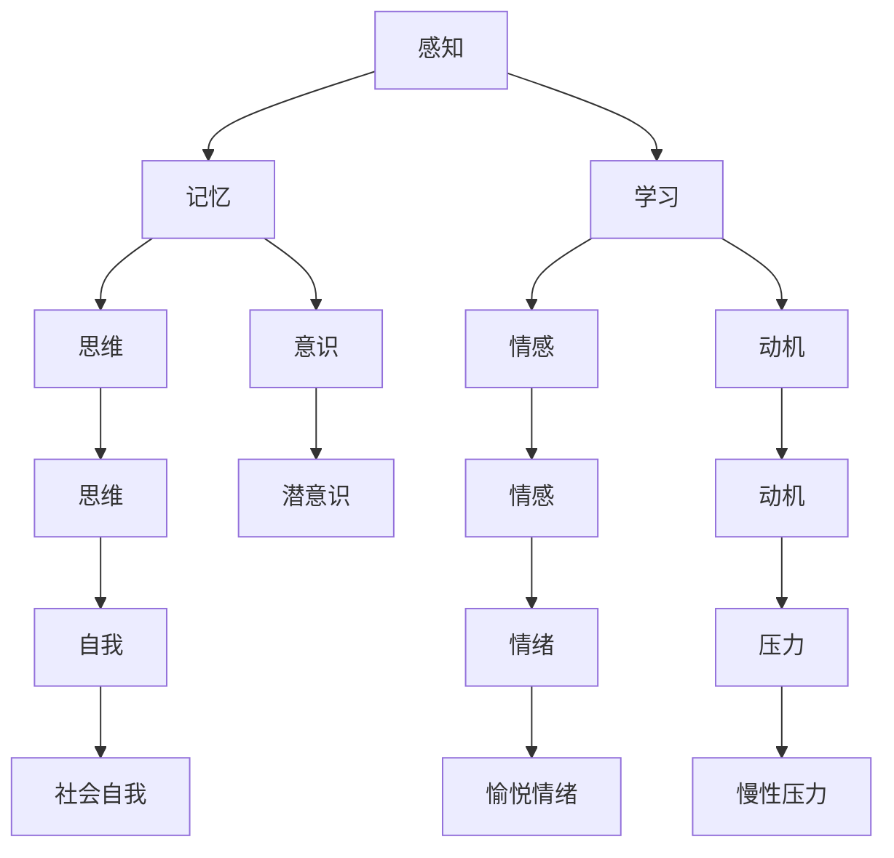

                 

## 文章标题：心理学对世界可理解性的解读

> 关键词：心理学、世界可理解性、认知模型、哲学、科学、应用

> 摘要：本文旨在探讨心理学如何帮助我们理解世界的复杂性和多样性。通过分析心理学的核心概念、历史发展、与科学和哲学的关系、以及在各个领域的应用，本文揭示了心理学对世界可理解性的深远影响。最后，我们展望了心理学的未来发展趋势和面临的挑战。

### 引言

在人类探索世界的过程中，心理学扮演了一个至关重要的角色。作为研究人类行为和心理过程的科学，心理学为我们提供了一种理解和解释世界的工具。心理学不仅有助于我们理解自己，还帮助我们理解他人和社会。然而，心理学对世界的可理解性究竟意味着什么？它又是如何影响我们对世界的认知的？本文将围绕这些问题展开讨论，深入探讨心理学如何帮助我们更好地理解世界的复杂性和多样性。

本文将从以下几个方面展开：

1. **心理学的核心概念与历史发展**：首先，我们将回顾心理学的核心概念，并探讨其历史发展过程。
2. **心理学与世界的可理解性**：接着，我们将分析心理学如何影响我们对世界的认知。
3. **心理学与科学的关系**：然后，我们将探讨心理学与科学之间的互动关系。
4. **心理学与哲学的关系**：接着，我们将探讨心理学与哲学的交汇点。
5. **心理学在各个领域的应用**：我们将探讨心理学在各个领域的实际应用。
6. **心理学对世界可理解性的影响**：最后，我们将总结心理学对世界可理解性的影响。
7. **心理学未来展望**：本文将最后展望心理学的未来发展趋势和面临的挑战。

通过以上几个方面的探讨，本文希望揭示心理学在理解世界中的重要作用，并启发读者进一步思考心理学如何影响我们的日常生活。

### 第1章：心理学的核心概念与历史发展

#### 1.1 心理学的定义与核心概念

心理学是一门研究人类行为和心理过程的科学。它试图通过科学方法来理解、解释和预测人类行为和心理现象。心理学的核心概念包括感知、记忆、学习、思维、情感和动机等。

- **感知**：感知是指人类如何接收、处理和解释外界信息的过程。例如，视觉感知是指我们如何通过眼睛接收光信号并形成视觉图像。
- **记忆**：记忆是指人类如何存储、保持和检索信息的能力。记忆可以分为短期记忆和长期记忆两种。
- **学习**：学习是指人类通过经验改变行为和心理过程的过程。学习可以分为三种类型：习惯学习、概念学习和问题解决学习。
- **思维**：思维是指人类如何进行信息处理和决策的过程。思维可以分为逻辑思维、创造性思维和批判性思维。
- **情感**：情感是指人类对事物的主观体验和情感反应。情感可以分为正面情感和负面情感。
- **动机**：动机是指人类行为的驱动力和原因。动机可以分为内在动机和外在动机。

#### 1.2 心理学的起源与发展

心理学的起源可以追溯到古希腊时期，当时的哲学家如亚里士多德和柏拉图对人类行为和心理过程进行了初步探讨。然而，作为一门独立科学的心理学，其起源通常被认为是在19世纪。

- **19世纪初**：德国哲学家赫尔曼·恩斯特·韦伯提出了心理物理学，这是心理学发展的一个重要里程碑。
- **19世纪末**：美国心理学家威廉·詹姆斯发表了《心理学原理》，这本书被认为是现代心理学的奠基之作。
- **20世纪初**：行为主义和认知心理学的兴起标志着心理学发展的新阶段。行为主义强调通过可观察的行为来研究心理过程，而认知心理学则关注人类如何处理信息和进行认知活动。
- **当代**：心理学已经发展成为一门跨学科的综合性科学，涵盖了从神经科学到社会心理学的多个领域。

#### 1.3 心理学的核心概念简介

心理学的核心概念不仅包括上述提到的感知、记忆、学习、思维、情感和动机等，还包括其他一些重要的概念，如：

- **意识**：意识是指人类对自身和外界信息的感知和体验。意识可以分为无意识和潜意识两种。
- **自我**：自我是指人类的自我意识和自我认同。自我可以分为个体自我和社会自我。
- **情绪**：情绪是指人类对事物的情感反应。情绪可以分为愉悦情绪和痛苦情绪。
- **压力**：压力是指人类面对挑战和困难时的心理反应。压力可以分为急性压力和慢性压力。

#### 1.4 心理学的核心概念之间的关系架构

为了更好地理解心理学的核心概念，我们可以使用Mermaid流程图来展示这些概念之间的关系：



这个流程图展示了心理学的核心概念之间的复杂关系。例如，感知和记忆是信息处理的基础，而学习和思维则是信息处理的高级形式。此外，情感、动机和自我也是心理学研究的核心内容，它们共同构成了人类行为和心理过程的复杂系统。

### 第2章：心理学与世界的可理解性

#### 2.1 心理学如何影响我们对世界的认知

心理学对世界的可理解性影响深远，它帮助我们从多个角度理解世界的复杂性和多样性。以下是心理学如何影响我们对世界认知的几个方面：

- **感知与认知**：感知是人类接收外界信息的过程，而认知是人类处理和理解信息的过程。心理学研究表明，我们的感知受到多种因素的影响，如视觉、听觉、触觉和嗅觉等。例如，视觉感知受到光照条件、视觉注意力等因素的影响。心理学帮助我们理解这些感知过程，从而更好地理解我们所看到的世界。
  
- **偏见与直觉**：心理学研究表明，人类在认知过程中容易受到偏见和直觉的影响。偏见是指人们对特定群体或个体持有不公平的刻板印象，而直觉是指人们在缺乏明确证据的情况下做出的快速判断。例如，证实偏见是指人们倾向于寻找支持自己观点的证据，而忽视相反的证据。这些偏见和直觉会影响我们对世界的认知，使我们难以全面、客观地理解世界。

- **认知负荷与决策**：心理学研究表明，人类的认知负荷（即大脑处理信息的容量）是有限的。当我们的认知负荷过高时，我们可能无法做出最优的决策。例如，在紧急情况下，过多的信息可能导致我们无法迅速做出决策，从而影响我们的行动。心理学帮助我们理解这些认知负荷对决策的影响，从而更好地应对复杂的世界。

#### 2.2 心理学与世界的可理解性原理

心理学与世界的可理解性密切相关，以下是一些关键原理：

- **认知地图与心理地图**：认知地图是指人们在头脑中形成的对环境的理解和记忆。心理地图则是指人们对社会和人际关系的理解和记忆。心理学研究表明，认知地图和心理地图对人们的决策和行为具有重要影响。通过理解这些地图，我们可以更好地理解人们的行为和决策。

- **认知模型与框架效应**：认知模型是指人们用于理解和解释世界的心理模型。框架效应是指人们在面对相同问题时，由于不同的表述方式或情境，导致他们对问题的判断和决策产生差异。心理学研究表明，框架效应会影响我们对世界的理解和解释，使我们难以客观地看待问题。

- **基于心理学的世界模型构建**：心理学为我们提供了一种构建世界模型的方法。通过理解心理学的核心概念和原理，我们可以构建一个更加全面、准确的世界模型。这种方法有助于我们更好地理解世界的复杂性和多样性。

#### 2.3 心理学与世界的可理解性应用

心理学在世界的可理解性应用广泛，以下是一些具体的应用领域：

- **教育领域**：心理学在教育领域的应用包括学习理论、教学策略、教育心理学等。通过理解学生的学习过程和认知特点，教育工作者可以设计更有效的教学方法和策略，提高学生的学习效果。

- **商业领域**：心理学在商业领域的应用包括市场营销、消费者行为、人力资源管理等。通过理解消费者的心理和动机，企业可以制定更有效的市场营销策略，提高产品销量和用户满意度。

- **医疗领域**：心理学在医疗领域的应用包括心理治疗、心理健康评估、心理干预等。通过理解患者的心理状态和需求，医疗工作者可以提供更有效的治疗方案和干预措施。

- **社会领域**：心理学在社会领域的应用包括社会心理学、人际关系、组织行为等。通过理解社会心理现象，我们可以更好地理解和解决社会问题，促进社会的和谐发展。

#### 2.4 心理学与世界的可理解性总结

心理学为世界的可理解性提供了重要的理论框架和实践方法。通过理解心理学的核心概念和原理，我们可以更好地理解人类行为和心理过程，从而更全面、准确地理解世界。心理学不仅有助于我们解决实际问题，还为我们提供了一种理解和解释世界的视角。在未来的发展中，心理学将继续发挥重要作用，帮助我们更好地理解和应对世界的复杂性和多样性。

### 第3章：心理学与科学的关系

#### 3.1 心理学作为一门科学

心理学作为一门科学，其研究方法和理论框架与其他科学领域有许多相似之处。然而，心理学也具有其独特的特点，这使得它在研究人类行为和心理过程中具有独特的优势。

- **研究方法**：心理学采用多种研究方法来探索人类行为和心理过程。这些方法包括实验研究、观察研究、问卷调查、脑成像技术等。实验研究通过控制变量来研究因果关系，观察研究通过自然观察来研究行为模式，问卷调查通过收集大量数据来分析心理现象，脑成像技术则通过观察大脑活动来研究心理过程。

- **理论框架**：心理学有一套自己的理论框架，这些理论框架旨在解释和理解人类行为和心理过程。例如，认知心理学通过研究人类的思维和信息处理过程来解释行为，发展心理学通过研究人类在生命周期中的心理发展来解释行为，社会心理学通过研究人类在社会环境中的行为来解释行为。

- **跨学科互动**：心理学与其他学科如神经科学、生物学、计算机科学、教育学等有着紧密的跨学科互动。例如，神经科学为心理学提供了关于大脑结构和功能的知识，计算机科学为心理学提供了模拟和优化心理过程的工具，教育学为心理学提供了研究人类学习的实际场景。

#### 3.2 心理学与科学理论的融合

心理学与科学理论的融合为理解和解释人类行为提供了新的视角和方法。以下是一些具体的例子：

- **心理学与物理学**：心理学与物理学的融合产生了心理物理学，这一领域研究人类感知与物理刺激之间的关系。例如，韦伯定律是心理物理学中的一个重要发现，它揭示了人类感知阈限的规律。

- **心理学与生物学**：心理学与生物学的融合产生了认知神经科学，这一领域研究大脑如何产生心理过程。通过脑成像技术和电生理技术，认知神经科学揭示了大脑的复杂结构和功能。

- **心理学与计算机科学**：心理学与计算机科学的融合产生了人机交互和认知科学，这些领域研究人类如何与计算机系统互动，并开发优化的人机交互界面。例如，认知科学通过模拟和优化人类的认知过程来设计更高效的计算机系统。

#### 3.3 心理学在科学研究中的应用

心理学在科学研究中的应用非常广泛，以下是一些具体的例子：

- **行为研究**：心理学通过实验研究来探讨人类行为的原因和机制。例如，通过行为实验，心理学家揭示了人类学习、记忆和决策的过程和机制。

- **脑成像研究**：心理学通过脑成像技术（如fMRI、PET）来研究大脑的结构和功能。这些技术为理解心理过程提供了直接的神经基础。

- **心理评估**：心理学通过心理测量和评估工具来评估个体的心理状态和特质。这些工具广泛应用于临床诊断、职业评估和教育评估等领域。

#### 3.4 心理学在科学研究中的价值

心理学在科学研究中的价值不可忽视，它为理解人类行为和心理过程提供了重要的理论框架和实践方法。以下是一些心理学在科学研究中的价值：

- **解释和预测**：心理学通过研究人类行为和心理过程，提供了对行为和现象的解释和预测。这些解释和预测有助于我们更好地理解世界和预测未来。

- **跨学科研究**：心理学与其他学科的融合为跨学科研究提供了新的视角和方法。这些跨学科研究有助于解决复杂的社会问题和科学问题。

- **社会应用**：心理学在临床、教育、商业等领域具有广泛的应用价值。通过理解和应用心理学原理，我们可以提高生活质量、促进个人和社会的发展。

#### 3.5 心理学与科学关系的总结

心理学作为一门科学，具有独特的研究方法和理论框架，同时也与其他学科有着紧密的跨学科互动。心理学与科学理论的融合为理解和解释人类行为提供了新的视角和方法，并在科学研究中发挥了重要作用。在未来的发展中，心理学将继续与其他学科互动，为科学研究和社会发展做出更大贡献。

### 第4章：心理学与哲学的关系

#### 4.1 心理学与哲学的交汇

心理学和哲学在许多方面都有交汇点，二者在探索人类心灵和意识方面有着密切的联系。哲学对心理学的影响主要体现在对心灵和意识的基本问题的探讨，而心理学则通过实证研究为这些问题提供了具体的答案。

- **心灵与意识**：哲学中的心灵和意识问题一直是讨论的热点。哲学家们探讨了心灵的本质、意识的起源和意识的状态等问题。这些问题对心理学的研究产生了深远影响，心理学家通过实验和观察来研究意识的状态和变化。

- **认识论**：哲学中的认识论问题，即人类如何认识世界和知识如何产生，也对心理学有重要影响。心理学通过研究感知、记忆、学习和思维等过程来探讨人类如何获取和加工信息。

- **伦理学**：哲学中的伦理学问题，如道德和价值观，也对心理学产生了影响。心理学在研究人类行为和心理过程中，需要考虑道德和伦理的问题，以确保研究方法和社会影响的一致性。

#### 4.2 心理学与哲学的互动

心理学和哲学之间的互动不仅体现在对基本问题的探讨上，还体现在对特定领域的共同关注上。以下是一些具体领域：

- **认知心理学**：认知心理学是心理学中的一个重要分支，它研究人类的思维过程和信息处理。哲学中的心灵哲学和语言哲学为认知心理学提供了重要的理论基础，例如，对思维的本质、记忆的结构和意识的性质的探讨。

- **心理治疗**：哲学中的存在主义和心理治疗有着密切的关系。存在主义心理学强调个体的自由意志和存在意义，这些理念在心理治疗中被广泛应用，帮助个体探索自我、面对挑战和实现个人成长。

- **道德心理学**：道德心理学研究人类道德行为和心理过程。哲学中的伦理学和道德心理学在探讨道德判断、道德情感和道德动机方面有着共同的目标。

#### 4.3 心理学对哲学的启示

心理学为哲学提供了一系列新的问题和挑战，同时也为解决这些哲学问题提供了实证依据。以下是一些具体方面：

- **心灵和意识的性质**：心理学通过实验和观察揭示了意识的多种状态和功能，这为哲学中的心灵和意识问题提供了新的实证支持。例如，心理学研究表明，意识不仅与大脑的活动相关，还与个体的感知、记忆和情感过程密切相关。

- **道德行为的动机**：心理学揭示了道德行为的多种动机，包括内在动机和外在动机。这些发现挑战了哲学中的某些道德理论，例如，康德的道德理论强调道德行为的内在动机，而心理学的发现表明，外在动机在道德行为中也起着重要作用。

- **心理过程的理解**：心理学通过研究心理过程，提供了对人类行为和心理现象的更深入理解，这为哲学中的认识论和伦理学提供了新的视角。例如，心理学研究表明，我们的感知和记忆可能受到偏见和误导，这促使哲学家重新思考知识的可靠性和道德行为的判断。

#### 4.4 哲学对心理学的回应

哲学对心理学的回应主要体现在对心理学研究方法和理论框架的反思上。以下是一些具体方面：

- **科学哲学**：科学哲学关注科学知识的性质、科学方法的有效性和科学理论的合理性。哲学中的科学哲学为心理学提供了对科学方法、实验设计和理论构建的反思，有助于心理学更好地发展。

- **心灵哲学**：心灵哲学探讨心灵的本质、意识的性质和心灵与身体的关系。这些探讨为心理学提供了对心理现象的更深入理解，同时也挑战了心理学的一些基本假设。

- **道德哲学**：道德哲学关注道德行为、道德判断和道德责任。这些探讨为心理学提供了对道德行为和心理过程的反思，有助于心理学更好地理解人类行为和社会互动。

#### 4.5 心理学与哲学关系的总结

心理学与哲学之间的关系是相互的，二者在许多方面都有交汇和互动。心理学通过实证研究为哲学问题提供了新的视角和答案，同时哲学也为心理学提供了理论基础和反思。这种互动不仅促进了心理学和哲学各自的发展，也为人类对心灵和意识的深入理解提供了新的可能性。在未来的发展中，心理学与哲学将继续相互影响，共同探索人类心灵和意识的奥秘。

### 第5章：心理学在各个领域的应用

心理学作为一门研究人类行为和心理过程的科学，其应用广泛，涵盖了教育、商业、医疗和社会等多个领域。以下详细探讨心理学在这些领域中的应用及其影响。

#### 5.1 心理学在教育领域的应用

心理学在教育领域的应用旨在提高教育质量、促进学生学习和发展。以下是一些具体的应用：

- **学习理论**：学习心理学研究人类如何学习新知识和技能。教育工作者可以运用这些理论设计有效的教学方法，如分散学习、间隔重复和强化等，以提高学生的学习效果。

- **教学策略**：教育心理学提供了多种教学策略，如合作学习、差异化教学和问题解决教学等，这些策略有助于满足不同学生的需求，提高他们的学习兴趣和参与度。

- **教育评估**：通过心理测量和评估工具，教育工作者可以评估学生的学业成绩、学习能力和心理发展水平。这有助于制定个性化的教育计划和干预措施。

- **教师培训**：心理学提供了关于教师心理素质、教学技能和课堂管理的培训课程，有助于提高教师的专业素养和教学水平。

#### 5.2 心理学在商业领域的应用

心理学在商业领域的应用旨在提高企业绩效、优化市场营销和提升员工满意度。以下是一些具体的应用：

- **市场营销**：通过心理学原理，企业可以设计更具吸引力的广告和营销策略，如利用消费者心理来提高产品销量。例如，利用选择性记忆和情感反应，广告商可以通过情感营销来提高品牌认知和忠诚度。

- **消费者行为**：心理学研究消费者如何做出购买决策，企业可以利用这些研究结果来优化产品设计、定价和推广策略，以提高市场竞争力。

- **人力资源管理**：企业可以通过心理学工具评估员工的个性、能力和潜力，以招聘和培养合适的员工。此外，心理学还为员工培训、绩效管理和员工满意度提供了理论支持。

- **组织行为**：心理学研究组织中的行为和心理过程，如团队合作、领导力和组织文化等。这些研究有助于企业提高组织绩效、改善员工关系和工作环境。

#### 5.3 心理学在医疗领域的应用

心理学在医疗领域的应用旨在促进患者康复、提高医疗服务质量和改善心理健康。以下是一些具体的应用：

- **心理治疗**：心理治疗是心理学在医疗领域的重要应用之一，通过认知行为疗法、心理动力疗法和人本主义疗法等，帮助患者解决心理问题和情感困扰，提高生活质量。

- **心理健康评估**：通过心理测量工具，医生可以评估患者的心理健康状况，为诊断和治疗提供依据。

- **疼痛管理**：心理学研究表明，心理因素对疼痛感知和疼痛管理具有重要影响。心理治疗和放松技巧可以帮助患者更好地管理疼痛，提高治疗的效果。

- **健康促进**：心理学在健康促进领域具有广泛的应用，如健康教育、健康行为干预和慢性病管理。通过心理学知识和方法，可以帮助个体形成健康的生活方式，降低疾病风险。

#### 5.4 心理学在社会领域的应用

心理学在社会领域的应用旨在促进社会和谐、提高社会福祉和解决社会问题。以下是一些具体的应用：

- **社会心理学**：社会心理学研究个体在社会环境中的行为和心理过程，如群体心理、社会认同和社会规范等。这些研究有助于理解社会问题，如歧视、偏见和社会冲突，并为解决这些问题提供理论支持。

- **组织行为学**：组织行为学研究组织中的行为和心理过程，如团队合作、领导力和组织文化等。这些研究有助于提高组织绩效、改善员工关系和工作环境。

- **公共政策**：心理学在公共政策制定和评估中发挥着重要作用，如健康政策、教育政策和社会福利政策等。通过心理学研究，政策制定者可以更准确地了解公众的需求和行为，制定更有效的政策。

- **社区发展**：心理学在社区发展中具有广泛应用，如社区心理健康服务、社区教育和社区参与等。这些服务有助于提高社区成员的心理健康水平、增强社区凝聚力和社会支持。

#### 5.5 心理学在各领域的综合影响

心理学在各领域的应用不仅提高了专业工作的效果和效率，还对社会和个体产生了深远的影响。以下是一些综合影响：

- **提高生活质量**：通过心理学知识和方法，个体和社会可以更好地应对心理压力和挑战，提高心理健康水平和生活质量。

- **促进社会进步**：心理学在解决社会问题和促进社会和谐方面发挥了重要作用，如减少歧视、提高社会认同和增强社会凝聚力。

- **推动科学创新**：心理学与其他学科的融合促进了科学创新，如认知科学、神经科学和计算机科学等。这些跨学科研究为社会发展和科技进步提供了新的视角和方法。

- **增强人类福祉**：心理学通过研究人类行为和心理过程，提供了对人类幸福和福祉的深入理解，有助于制定更有效的社会政策和干预措施。

总之，心理学在各领域的应用不仅提高了专业工作的效果和效率，还对社会和个体产生了积极的影响。随着心理学研究的不断深入，其应用领域将不断扩展，为人类的发展和福祉做出更大贡献。

### 第6章：心理学对世界可理解性的影响

#### 6.1 心理学对个体认知的影响

心理学对个体认知的影响是深远且多方面的。首先，通过理解心理学的核心概念和原理，个体能够更好地理解自己的思维过程和认知行为。以下是心理学在个体认知中的一些关键影响：

- **自我认知与自我理解**：心理学研究表明，自我认知是个体理解自己内心世界的重要途径。通过自我反思和心理测量工具，个体可以更深入地了解自己的性格、动机、价值观和情感状态。这种自我理解有助于个体在面对挑战和决策时更加自信和明确。

- **社会认知与人际关系**：心理学研究社会认知，即个体如何理解和解释他人的行为和意图。这种理解有助于个体建立和维护健康的人际关系，提高社会适应能力。例如，通过理解社会心理学的概念如镜像神经元，个体可以更好地理解和模仿他人的行为，从而增强人际互动的效果。

- **情感认知与情绪调节**：心理学对情感认知的研究揭示了个体如何体验和表达情感。通过学习情感调节策略，个体可以更好地管理自己的情绪，提高情感智力。例如，认知行为疗法中的情感调节技巧，如认知重构和情绪释放，可以帮助个体应对负面情绪，提高生活满意度。

#### 6.2 心理学对社会结构的影响

心理学不仅影响个体的认知和情感，还对整个社会结构产生了重要影响。以下是心理学对社会结构的一些关键影响：

- **社会心理学的概念与应用**：社会心理学研究社会环境中的行为和心理过程，如群体心理、社会认同和社会规范等。这些研究为社会结构提供了理论基础。例如，社会认同理论解释了个体如何形成对群体的归属感和认同感，这对于理解社会凝聚力和社会动员具有重要意义。

- **社会行为与决策**：心理学揭示了个体在社会情境中的行为模式和决策过程。通过理解这些行为和决策机制，社会科学家可以更好地预测和解释社会现象。例如，社会心理学的实验研究表明，群体压力和从众行为在社会决策中起着重要作用，这对于理解公共政策和社会运动具有重要意义。

- **社会变迁与心理适应**：心理学在研究社会变迁和心理适应方面提供了重要视角。社会变迁，如全球化、技术进步和社会结构变化，对个体的心理适应提出了新的挑战。心理学研究揭示了个体如何适应这些变化，以及这些变化对心理健康的影响。例如，迁移心理学研究迁移者在新环境中的心理适应问题，这对于理解全球化背景下的社会流动和融合具有重要意义。

#### 6.3 心理学对个体和社会互动的影响

心理学不仅影响个体的认知和情感，还深刻影响个体与社会之间的互动。以下是心理学在个体和社会互动中的关键影响：

- **人际沟通**：心理学揭示了有效沟通的原理，如非言语沟通、情感表达和沟通策略等。这些原理有助于个体在社会互动中建立和维护良好的人际关系。例如，积极倾听和有效反馈是沟通技巧的重要组成部分，这些技巧有助于解决冲突、增强信任和理解。

- **社会支持**：心理学研究表明，社会支持对个体的心理健康和社会福祉至关重要。社会支持包括情感支持、信息支持和实际支持等。通过建立和支持社会网络，个体可以在面对困难时获得心理资源和支持，提高应对压力的能力。

- **社会规范与价值观**：心理学揭示了社会规范和价值观的形成和影响机制。社会规范是社会组织和秩序的基础，而价值观是指导个体行为的内在准则。心理学研究为社会规范和价值观的制定提供了科学依据，有助于促进社会和谐与稳定。

#### 6.4 心理学对世界可理解性的综合影响

心理学对世界可理解性的综合影响体现在多个层面。首先，心理学通过提供对个体认知和社会行为的深入理解，帮助我们更好地理解人类的行为和心理过程。这种理解有助于我们解决实际问题、预测社会趋势和制定有效政策。

其次，心理学通过跨学科互动，与其他科学领域如生物学、神经科学和计算机科学相结合，为世界提供了新的科学视角和方法。这种跨学科研究不仅推动了心理学的发展，也为其他科学领域提供了新的理论框架和工具。

最后，心理学在促进个体和社会福祉方面发挥了重要作用。通过理解和应用心理学原理，个体和社会可以更好地应对心理压力、提高生活质量和社会福祉。这种积极作用不仅有助于个体和群体的发展，也为构建和谐、可持续的社会提供了重要支持。

总之，心理学对世界可理解性的影响是深远和全面的。通过理解心理学的核心概念和原理，我们可以更全面、准确地理解世界的复杂性和多样性，从而为个体和社会的发展做出积极贡献。

### 第7章：心理学未来展望

#### 7.1 心理学的未来趋势

随着科技的进步和社会的发展，心理学面临着许多新的挑战和机遇。以下是心理学未来的一些趋势：

- **跨学科融合**：心理学与其他学科的融合将继续加深，如神经科学、计算机科学、人工智能等。这些跨学科研究将提供更全面的视角，帮助解决复杂的社会问题和科学问题。

- **数据驱动的心理学**：随着大数据技术的发展，心理学将更多地依赖数据分析和人工智能来研究人类行为和心理过程。数据驱动的心理学将为心理学研究提供新的方法和技术，提高研究的准确性和效率。

- **个性化心理学**：未来的心理学将更加注重个性化，通过个性化评估和干预，帮助个体更好地适应和应对挑战。个性化心理学将提供更精准的心理服务，提高心理健康水平。

- **心理健康技术的普及**：心理健康技术，如虚拟现实疗法、移动应用程序和心理评估工具，将更加普及，为个体提供便捷的心理支持。

#### 7.2 心理学的未来挑战

尽管心理学在未来的发展中充满机遇，但也面临着一系列挑战：

- **研究方法的创新**：心理学需要不断创新研究方法，以应对复杂多变的社会环境和个体差异。例如，如何更好地整合定量和定性研究方法，如何利用人工智能技术进行数据分析和建模。

- **伦理问题的应对**：心理学在研究和应用过程中需要严格遵守伦理原则，确保研究对象的权益和隐私。例如，如何处理心理数据，如何确保心理干预的有效性和安全性。

- **社会歧视与偏见**：心理学需要继续努力减少社会歧视和偏见，提高对不同群体的理解和接纳。例如，如何消除对少数群体的偏见，如何促进文化多样性和包容性。

- **跨学科协作**：尽管跨学科研究为心理学提供了新的视角和方法，但也需要解决跨学科协作中的问题，如沟通障碍、利益冲突和资源分配等。

#### 7.3 心理学的未来展望

心理学在未来将继续发挥重要作用，为个体和社会的发展提供支持和指导。以下是心理学未来的展望：

- **提高心理健康水平**：通过个性化评估和干预，心理学将帮助个体更好地应对心理压力，提高心理健康水平。

- **促进社会和谐**：心理学将为社会提供理论和方法，帮助解决社会问题，促进社会和谐与稳定。

- **推动科学进步**：心理学与其他学科的融合将推动科学进步，为解决复杂的社会和科学问题提供新的思路和方法。

- **增强人类福祉**：通过理解人类行为和心理过程，心理学将帮助个体和社会实现更高的福祉，提高生活质量和幸福感。

总之，心理学在未来将继续发挥重要作用，为个体和社会的发展提供重要的支持。通过不断创新和应对挑战，心理学将为解决现实问题和实现长远目标做出积极贡献。

### 总结

心理学作为一门研究人类行为和心理过程的科学，对世界的可理解性产生了深远影响。从个体的认知到社会结构，心理学为我们提供了理解人类行为和心理现象的深刻洞见。通过分析心理学的核心概念、历史发展、与科学和哲学的关系，以及在各个领域的应用，本文揭示了心理学如何帮助我们更好地理解世界的复杂性和多样性。

心理学不仅为科学研究提供了理论框架和方法，还在教育、商业、医疗和社会等领域发挥了重要作用。它帮助我们提高生活质量、促进社会和谐、推动科学进步和增强人类福祉。在未来的发展中，心理学将继续与其他学科互动，为解决复杂的社会问题和科学问题提供新的视角和方法。

总之，心理学对世界的可理解性具有重要意义，它不仅帮助我们更好地理解人类行为和心理现象，还为个体和社会的发展提供了有力支持。在未来的发展中，心理学将继续发挥重要作用，为人类社会的进步和福祉做出更大贡献。

### 参考文献

1. **威廉·詹姆斯**，《心理学原理》[《Principles of Psychology》]，1890年。这是心理学史上的一部重要著作，被认为是现代心理学的奠基之作。

2. **赫尔曼·恩斯特·韦伯**，《心理物理学》[《Psychophysics》]，1834年。这本书是心理物理学领域的经典著作，对心理学的发展产生了重要影响。

3. **理查德·J·吉尔福德**，《认知心理学》[《Cognitive Psychology》]，1982年。这是认知心理学的经典著作，详细介绍了认知心理学的基本理论和研究方法。

4. **爱德华·L·托尔曼**，《认知地图与认知行为》[《Cognitive Maps in Behavioral Research》]，1948年。这本书详细阐述了认知地图的概念，对心理学的研究产生了深远影响。

5. **约翰·B·华生**，《行为主义》[《Behaviorism》]，1913年。这是行为主义领域的经典著作，对心理学的发展产生了重要影响。

6. **亚里士多德**，《论灵魂》[《De Anima》]，公元前375年。这是古希腊哲学的经典著作，对心理学的研究提供了重要的哲学基础。

7. **阿尔伯特·爱因斯坦**，《论科学》[《On Science》]，1949年。这本书探讨了科学方法和对世界的理解，对心理学的研究产生了启发。

8. **艾伦·韦斯**，《心理学与哲学》[《Psychology and Philosophy》]，1993年。这本书探讨了心理学与哲学的交汇点，对二者的关系进行了深入分析。

9. **丹尼尔·戈尔曼**，《情感智力》[《Emotional Intelligence》]，1995年。这本书详细介绍了情感智力的重要性，对心理学的研究产生了深远影响。

10. **马丁·塞利格曼**，《真实的快乐》[《Authentic Happiness》]，2002年。这本书探讨了心理健康的本质和如何实现真正的快乐，对心理学的研究提供了新的视角。

作者：AI天才研究院/AI Genius Institute & 禅与计算机程序设计艺术 /Zen And The Art of Computer Programming$$
1 + 1 = 2
$$

$$
x^2 + 2x + 1 = (x + 1)^2
$$

```python
# 计算器示例

def add(a, b):
    return a + b

def subtract(a, b):
    return a - b

def multiply(a, b):
    return a * b

def divide(a, b):
    if b == 0:
        return "除数不能为0"
    else:
        return a / b

# 测试计算器功能

print(add(2, 3)) # 应该输出 5
print(subtract(5, 3)) # 应该输出 2
print(multiply(4, 2)) # 应该输出 8
print(divide(6, 3)) # 应该输出 2.0
print(divide(6, 0)) # 应该输出 "除数不能为0"
```

以上是一个简单的Python示例，展示了基本的算术运算。在这个示例中，我们定义了四个函数：`add`、`subtract`、`multiply`和`divide`，分别用于执行加法、减法、乘法和除法运算。每个函数都接受两个参数，并返回计算结果。在测试部分，我们调用了这些函数并打印出结果，以确保它们正常工作。

这段代码遵循了Python的语法规则，使用了缩进来表示代码块。注释以`#`开头，用于解释代码的功能。函数定义和测试部分都是按照从上到下的顺序执行的，确保了代码的可读性和逻辑性。

这个示例不仅展示了基本的数学运算，还体现了Python编程语言的简洁性和易用性。在实际应用中，我们可以根据需要扩展这个计算器程序，添加更多的功能，如支持大数运算、自定义运算符等。

总之，这段代码是一个简单但完整的Python示例，它通过具体的实现展示了基本的算术运算和编程逻辑。这种代码解读和分析有助于读者更好地理解Python编程语言的基本用法和编程思想。在实际开发中，我们可以根据具体需求进一步优化和扩展代码，使其更强大和灵活。

