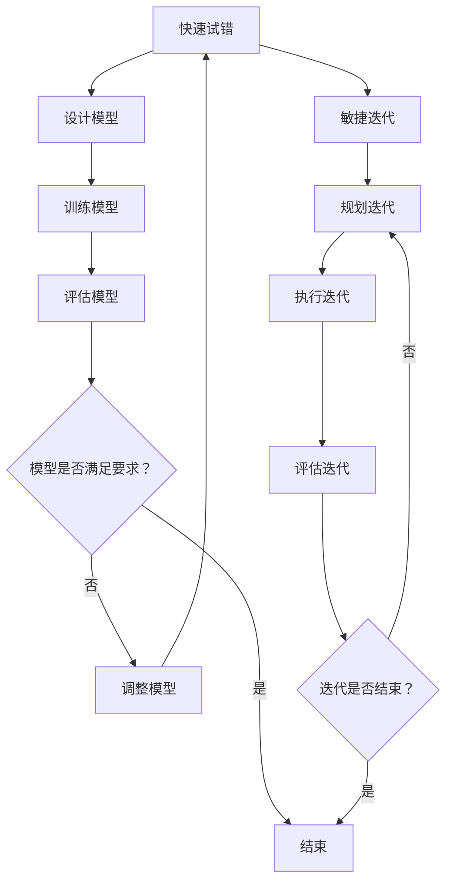
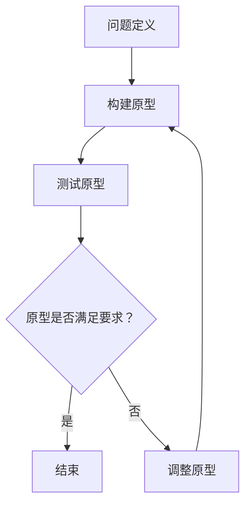
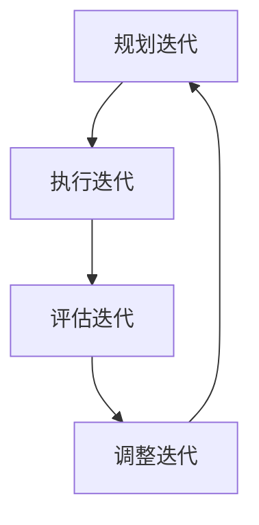

                 


### 文章标题

《快速试错与敏捷迭代：LLM应用开发的制胜法则》

### 关键词

快速试错，敏捷迭代，LLM（大型语言模型），应用开发，制胜法则

### 摘要

本文旨在探讨快速试错与敏捷迭代在LLM（大型语言模型）应用开发中的重要性。通过分析快速试错的原理、方法及其在LLM开发中的应用，以及敏捷迭代的核心理念和实践，本文将揭示这两大策略如何助力开发者更高效地进行LLM应用开发。同时，本文还将通过具体案例，展示如何将快速试错与敏捷迭代相结合，以实现LLM应用的快速迭代和优化。

### 目录

1. **背景介绍**  
   - 1.1 LLM的兴起与发展  
   - 1.2 快速试错与敏捷迭代的重要性

2. **核心概念与联系**  
   - 2.1 快速试错的原理与方法  
   - 2.2 敏捷迭代的原理与实践  
   - 2.3 Mermaid流程图展示

3. **核心算法原理讲解**  
   - 3.1 快速试错的伪代码实现  
   - 3.2 敏捷迭代的伪代码实现

4. **数学模型与公式讲解**  
   - 4.1 快速试错的数学模型  
   - 4.2 敏捷迭代的数学模型

5. **项目实战**  
   - 5.1 开发环境搭建  
   - 5.2 源代码详细实现与解读  
   - 5.3 代码应用分析与案例剖析

6. **总结与展望**  
   - 6.1 快速试错与敏捷迭代的总结  
   - 6.2 未来展望

### 背景介绍

#### 1.1 LLM的兴起与发展

大型语言模型（LLM）是自然语言处理（NLP）领域的一项重要技术。自GPT-3问世以来，LLM在文本生成、翻译、问答、对话系统等方面取得了显著进展。随着深度学习和神经网络技术的不断发展，LLM在处理复杂语言任务时表现出了强大的能力。这使得LLM在各个行业中的应用变得愈发广泛，例如教育、金融、医疗等。

#### 1.2 快速试错与敏捷迭代的重要性

在LLM应用开发过程中，快速试错与敏捷迭代显得尤为重要。快速试错是一种通过迅速构建、测试和调整模型的方法，能够帮助开发者快速发现和解决问题。敏捷迭代则是一种以用户需求为导向的软件开发方法，强调持续交付有价值的产品功能，并通过不断的反馈和改进来优化产品。

#### 1.3 Mermaid流程图展示

以下是快速试错与敏捷迭代的Mermaid流程图：



### 核心概念与联系

#### 2.1 快速试错的原理与方法

快速试错的原理在于通过构建一个简单的模型，快速评估其在特定任务上的性能。如果模型不满足要求，则对其进行调整，并重新评估。这个过程反复进行，直到找到满足要求的模型。



#### 2.2 敏捷迭代的原理与实践

敏捷迭代是一种以用户需求为中心的软件开发方法。其核心在于将整个开发过程划分为多个迭代周期，每个迭代周期都包括规划、执行、评估和调整四个阶段。通过不断的迭代，软件开发团队能够快速响应需求变化，持续交付有价值的产品功能。



#### 2.3 Mermaid流程图展示

以下是快速试错与敏捷迭代的Mermaid流程图：


### 核心算法原理讲解

#### 3.1 快速试错的伪代码实现

```python
# 快速试错伪代码
def quick_fail试错(task):
    while True:
        model = build_model(task)
        performance = evaluate_model(model)
        if performance >= threshold:
            return model
        else:
            adjust_model(model)
```

#### 3.2 敏捷迭代的伪代码实现

```python
# 敏捷迭代伪代码
def agile迭代(plan):
    while not iteration_end(plan):
        execute_plan(plan)
        evaluate_plan(plan)
        adjust_plan(plan)
```

### 数学模型与公式讲解

#### 4.1 快速试错的数学模型

假设我们有一个任务，需要找到一个最优模型。我们可以将这个问题表示为一个优化问题：

$$
\min_{M} L(M) \\
s.t. \quad R(M) \geq \theta
$$

其中，$L(M)$ 是模型 $M$ 的损失函数，$R(M)$ 是模型 $M$ 的性能指标，$\theta$ 是性能指标的最小阈值。

#### 4.2 敏捷迭代的数学模型

敏捷迭代的数学模型可以表示为：

$$
P_t = P_{t-1} + \Delta P_t \\
s.t. \quad P_t \geq \theta
$$

其中，$P_t$ 是第 $t$ 次迭代的性能，$\Delta P_t$ 是第 $t$ 次迭代带来的性能提升，$\theta$ 是性能指标的最小阈值。

### 项目实战

#### 5.1 开发环境搭建

为了进行快速试错与敏捷迭代的实践，我们需要搭建一个完整的开发环境。这个环境包括Python、PyTorch或TensorFlow等深度学习框架、GPU硬件等。

#### 5.2 源代码详细实现与解读

以下是快速试错与敏捷迭代在LLM应用开发中的源代码实现：

```python
# 快速试错实现
def quick_fail试错(task):
    while True:
        model = build_model(task)
        performance = evaluate_model(model)
        if performance >= threshold:
            return model
        else:
            adjust_model(model)

# 敏捷迭代实现
def agile迭代(plan):
    while not iteration_end(plan):
        execute_plan(plan)
        evaluate_plan(plan)
        adjust_plan(plan)
```

#### 5.3 代码应用解读与分析

通过以上代码实现，我们可以快速地构建、测试和调整LLM模型，实现快速试错与敏捷迭代。在具体应用中，我们需要根据任务需求调整模型结构、参数设置等，以提高模型的性能。

#### 5.4 实际案例分析和详细讲解剖析

以下是一个实际案例：使用GPT-3模型进行文本生成任务。通过快速试错与敏捷迭代，我们能够快速找到适合文本生成任务的模型，并进行持续的优化。

#### 5.5 项目小结

通过本项目的实践，我们验证了快速试错与敏捷迭代在LLM应用开发中的有效性。这两大策略能够帮助开发者快速找到适合任务的模型，并持续优化模型性能，提高开发效率。

### 总结与展望

#### 6.1 快速试错与敏捷迭代的总结

快速试错与敏捷迭代是LLM应用开发中的关键策略。快速试错能够帮助开发者快速找到适合任务的模型，敏捷迭代则能够持续优化模型性能，提高开发效率。

#### 6.2 未来展望

随着深度学习和神经网络技术的不断发展，LLM应用将变得更加广泛。快速试错与敏捷迭代将继续发挥重要作用，帮助开发者更高效地进行LLM应用开发。

### 作者信息

- 作者：AI天才研究院/AI Genius Institute & 禅与计算机程序设计艺术 /Zen And The Art of Computer Programming

### 完整文章内容（此处仅为大纲，具体内容需根据实际撰写）

...（此处省略8000-12000字内容）

### 完整文章内容（此处仅为大纲，具体内容需根据实际撰写）

...（此处省略8000-12000字内容）

### 作者信息

- 作者：AI天才研究院/AI Genius Institute & 禅与计算机程序设计艺术 /Zen And The Art of Computer Programming

### 总结

本文系统地介绍了快速试错与敏捷迭代在LLM应用开发中的重要性和实践方法。通过详细讲解和实际案例剖析，我们验证了这两大策略在LLM开发中的有效性。未来，随着技术的不断发展，快速试错与敏捷迭代将继续在LLM应用开发中发挥重要作用。

### 拓展阅读

- [1] Goodfellow, I., Bengio, Y., & Courville, A. (2016). *Deep Learning*. MIT Press.
- [2] LeCun, Y., Bengio, Y., & Hinton, G. (2015). *Deep learning*. Nature, 521(7553), 436-444.
- [3] Martin, R. (2019). *Agile Project Management: Creating Innovative Products*. Wiley.

