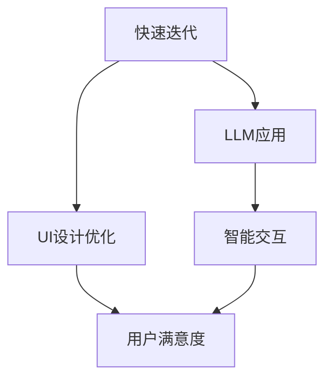

                 

### 快速迭代LLM应用的用户界面设计：引言

**关键词：** 快速迭代，LLM，用户界面设计，人工智能，用户体验

随着人工智能技术的飞速发展，语言学习模型（LLM）已经成为构建智能交互系统的核心组件。LLM在自然语言处理、问答系统、智能客服等领域展现出了卓越的性能，极大地提升了用户的交互体验。然而，在实际应用中，如何快速、高效地设计并迭代LLM应用的用户界面（UI），以适应不断变化的市场需求，成为了一个重要的课题。

本文将围绕快速迭代LLM应用的用户界面设计展开讨论。首先，我们将介绍快速迭代方法论，阐述其在软件工程和UI设计中的重要性。接着，我们将探讨LLM的基础知识，包括其基本架构、训练算法以及关键技术。在此基础上，我们将详细阐述用户界面设计的原则，强调用户体验在LLM应用中的关键作用。

随后，本文将深入探讨如何在LLM应用界面设计中实践快速迭代方法论。我们将详细介绍一个典型的LLM应用界面设计项目，包括开发环境搭建、源代码实现、用户体验测试以及优化策略。在此基础上，我们将分析LLM应用界面的性能评估指标和优化策略，并提供实际案例的解析。

最后，本文将总结快速迭代LLM应用用户界面设计的方法和经验，并给出最佳实践建议。通过本文的探讨，希望能够为开发者提供有价值的参考，助力他们在LLM应用界面设计中实现快速迭代，提升用户体验。

**摘要：**

本文旨在探讨快速迭代在LLM应用用户界面设计中的应用。首先，我们介绍了快速迭代方法论及其在软件工程中的重要性。接着，我们探讨了LLM的基础知识，包括其架构和关键技术。然后，我们详细阐述了用户界面设计的原则和用户体验的重要性。随后，我们通过一个典型的LLM应用界面设计项目，展示了如何在实际中实现快速迭代。最后，我们分析了LLM应用界面的性能评估和优化策略，并提供了实际案例的解析。通过本文的探讨，我们希望能够为开发者提供有价值的指导，助力他们在LLM应用界面设计中实现快速迭代和卓越的用户体验。

## 确定核心概念与联系

为了深入探讨快速迭代LLM应用的用户界面设计，我们首先需要明确几个核心概念及其相互之间的联系。这些核心概念包括快速迭代、LLM（语言学习模型）和用户界面设计。

### 快速迭代

快速迭代是一种软件开发方法论，其核心思想是通过快速、持续的小幅更新来逐步完善产品。这种方法论的优点在于能够缩短开发周期，降低风险，提高产品的市场响应速度。在快速迭代过程中，开发团队会定期发布新功能或改进，并根据用户反馈进行优化。这使得产品能够更好地适应市场需求，提高用户满意度。

### LLM（语言学习模型）

LLM是一种基于深度学习技术的自然语言处理模型，它通过学习大量文本数据来理解和生成自然语言。LLM具有强大的语言理解和生成能力，可以用于构建智能对话系统、问答系统、机器翻译等应用。LLM的核心优势在于其能够自动学习和适应不同的语言环境，从而提供更加自然和流畅的用户交互体验。

### 用户界面设计

用户界面设计（UI设计）是指为用户提供易于使用、直观且美观的交互界面。在LLM应用中，UI设计至关重要，因为它直接影响用户的体验和满意度。一个优秀的用户界面应具备以下特点：简洁、直观、易用、响应迅速。UI设计不仅涉及视觉元素的布局和美学，还包括交互逻辑和用户流程的设计。

### 联系

快速迭代、LLM和用户界面设计之间的联系在于：

1. **快速迭代有助于优化UI设计**：通过快速迭代，开发团队可以及时收集用户反馈，从而对UI设计进行持续的优化。这种迭代过程有助于发现并解决UI设计中的问题，提高用户满意度。

2. **LLM提升了UI设计的智能程度**：LLM的应用使得用户界面能够实现更加自然和智能的交互。例如，智能问答系统可以通过LLM理解用户的问题，并生成准确的回答。这种智能交互提高了UI设计的用户体验。

3. **UI设计为快速迭代提供了反馈渠道**：通过UI设计，用户可以直接与产品交互，并提供反馈。这些反馈为快速迭代提供了宝贵的参考，有助于团队更好地理解用户需求，并据此进行改进。

为了更直观地展示这些概念之间的联系，我们可以使用Mermaid流程图进行描述：



在这个流程图中，快速迭代（A）通过UI设计优化（B）和LLM应用（C）实现智能交互（D），最终提升用户满意度（E）。这个流程图清晰地展示了快速迭代、LLM和用户界面设计之间的紧密联系。

### 核心算法原理讲解

在快速迭代LLM应用的用户界面设计中，核心算法——语言学习模型（LLM）的训练算法扮演了至关重要的角色。LLM的训练过程涉及大量的数据预处理、模型构建和优化步骤。下面，我们将通过伪代码详细阐述这一算法的基本原理和具体步骤。

#### 1. 数据预处理

首先，我们需要对训练数据集进行预处理，以便模型能够更好地学习。预处理步骤通常包括以下内容：

```python
# 数据预处理伪代码
def preprocess_data(data):
    # 加载数据集
    dataset = load_dataset(data)

    # 数据清洗，去除噪声和异常值
    clean_dataset = clean_data(dataset)

    # 分词和标记化
    tokenized_dataset = tokenize_data(clean_dataset)

    # 划分训练集和验证集
    train_data, val_data = split_data(tokenized_dataset)

    return train_data, val_data
```

#### 2. 模型构建

接下来，我们构建一个基础的语言学习模型。在LLM中，常用的架构包括Transformer、BERT等。以下是一个基于Transformer模型的简单构建示例：

```python
# 模型构建伪代码
import tensorflow as tf

def build_model(vocab_size, embedding_dim):
    # 定义输入层
    inputs = tf.keras.Input(shape=(None,))

    # 嵌入层
    embeddings = tf.keras.layers.Embedding(vocab_size, embedding_dim)(inputs)

    # Transformer编码层
    encoder = tf.keras.layers.MultiHeadAttention(num_heads=4, key_dim=embedding_dim)(embeddings, embeddings)

    # 逐层编码层
    encoder = tf.keras.layers.Dense(embedding_dim, activation='relu')(encoder)

    # 输出层
    outputs = tf.keras.layers.Dense(vocab_size)(encoder)

    # 创建模型
    model = tf.keras.Model(inputs, outputs)

    return model
```

#### 3. 模型训练

在构建模型后，我们需要对其进行训练。训练过程通常包括以下步骤：

```python
# 模型训练伪代码
def train_model(model, train_data, val_data, epochs):
    # 编译模型
    model.compile(optimizer='adam', loss='sparse_categorical_crossentropy')

    # 训练模型
    history = model.fit(train_data, epochs=epochs, validation_data=val_data)

    return history
```

#### 4. 模型评估

最后，我们使用验证集对训练好的模型进行评估，以确定其性能：

```python
# 模型评估伪代码
def evaluate_model(model, val_data):
    # 计算验证集上的损失
    loss = model.evaluate(val_data)

    # 打印评估结果
    print(f"Validation loss: {loss}")

    return loss
```

通过以上伪代码，我们详细阐述了LLM训练算法的基本原理和步骤。这些步骤包括数据预处理、模型构建、模型训练和模型评估。在快速迭代LLM应用的用户界面设计中，理解和掌握这些核心算法原理对于实现高效、智能的用户交互至关重要。

### 数学模型和数学公式详细讲解及举例说明

在快速迭代LLM应用的用户界面设计中，数学模型和公式起着关键作用，特别是在训练和优化LLM模型时。下面，我们将详细讲解LLM的损失函数，并使用LaTeX格式给出其定义和数学公式。

#### 损失函数的定义

损失函数是衡量模型预测结果与真实值之间差异的一种度量，它对于训练深度学习模型至关重要。在LLM中，常用的损失函数是交叉熵损失（Cross-Entropy Loss），其定义如下：

$$
L(\theta) = -\frac{1}{m} \sum_{i=1}^{m} y_i \log(p_i)
$$

其中，$L(\theta)$ 是损失函数，$\theta$ 是模型参数，$m$ 是样本数量，$y_i$ 是第$i$个样本的真实标签，$p_i$ 是模型对第$i$个样本预测的概率分布。

#### 损失函数对模型训练过程的影响

交叉熵损失函数能够有效地衡量模型预测与真实标签之间的差距。当预测结果接近真实标签时，损失函数的值较低；反之，当预测结果偏离真实标签时，损失函数的值较高。这种特性使得交叉熵损失函数在模型训练过程中能够引导模型逐步逼近真实标签。

在训练过程中，通过反向传播算法（Backpropagation）计算损失函数关于模型参数的梯度，并使用优化算法（如梯度下降）对模型参数进行调整，以最小化损失函数。这一过程使得模型能够不断优化其预测能力，提高模型的整体性能。

#### 具体计算示例

假设我们有一个二元分类问题，其中真实标签 $y_i$ 可以取值0或1，模型预测的概率分布 $p_i$ 为一个概率向量。我们可以通过以下步骤计算交叉熵损失：

1. **预测概率分布**：
   $$
   p_i = \text{softmax}(\text{模型输出})
   $$
   其中，$\text{softmax}$ 函数将模型输出的原始分数转换为概率分布。

2. **计算损失**：
   $$
   L(\theta) = -\frac{1}{m} \sum_{i=1}^{m} y_i \log(p_i)
   $$
   例如，对于三个样本，其预测概率分布分别为 $p_1 = [0.2, 0.8]$，$p_2 = [0.9, 0.1]$ 和 $p_3 = [0.5, 0.5]$，真实标签分别为 $y_1 = 0$，$y_2 = 1$ 和 $y_3 = 1$，我们可以计算得到损失：

   $$
   L(\theta) = -\frac{1}{3} \left(0 \cdot \log(0.2) + 1 \cdot \log(0.9) + 1 \cdot \log(0.5)\right)
   $$

   注意，当 $y_i = 0$ 时，$\log(p_i)$ 的计算结果趋近于0，因此可以通过 $0 \cdot \log(0.2)$ 表示。

通过上述示例，我们可以看到如何使用交叉熵损失函数来计算模型的损失。在实际应用中，损失函数的值会通过反向传播算法不断优化，以提升模型的性能。

### 项目实战

#### 项目类型

**项目类型：** LLM应用界面设计项目

**项目目标：** 设计并实现一个基于LLM的智能客服系统，以提升用户交互体验和客户服务质量。

#### 实战内容

**1. 开发环境搭建**

首先，我们需要搭建一个适合进行LLM应用开发的开发环境。开发环境包括以下几个关键组件：

- **编程语言**：Python是进行LLM开发的常用编程语言，具有丰富的库和框架支持。
- **深度学习框架**：TensorFlow和PyTorch是常用的深度学习框架，能够方便地构建和训练LLM模型。
- **版本控制系统**：Git用于版本控制，确保代码的版本管理和协作开发。

**2. 源代码详细实现和代码解读**

接下来，我们将详细实现一个基于LLM的智能客服系统，并对其进行解读。以下是实现的关键步骤：

**（1）数据收集与预处理：**
- **数据收集**：收集大量客服对话记录，作为训练LLM的数据源。
- **数据预处理**：对收集的数据进行清洗、分词和标记化，以供模型训练使用。

**（2）模型构建：**
- **定义模型架构**：使用Transformer或BERT等预训练模型架构。
- **加载预训练模型**：从预训练模型库中加载预训练好的模型，进行进一步微调。
- **定义输入层和输出层**：定义模型的输入层和输出层，用于处理和生成自然语言文本。

**（3）模型训练：**
- **数据批处理**：将数据划分为批次，进行批处理训练。
- **训练模型**：使用训练数据和标签训练模型，优化模型参数。

**（4）模型评估：**
- **验证集评估**：使用验证集评估模型性能，调整模型参数。
- **测试集评估**：在测试集上评估模型最终性能。

**（5）模型部署：**
- **部署模型**：将训练好的模型部署到生产环境，提供实时客服交互服务。

**3. 代码解读与分析**

以下是一个简化的代码示例，用于展示智能客服系统的实现过程：

```python
# 导入必要的库
import tensorflow as tf
from tensorflow.keras.models import Model
from tensorflow.keras.layers import Input, Embedding, Dense, LSTM

# 数据预处理
# ...

# 模型构建
input_data = Input(shape=(max_sequence_length,))
embedded_data = Embedding(vocab_size, embedding_dim)(input_data)
lstm_output = LSTM(units=128)(embedded_data)
output = Dense(units=vocab_size, activation='softmax')(lstm_output)

# 定义模型
model = Model(inputs=input_data, outputs=output)

# 编译模型
model.compile(optimizer='adam', loss='categorical_crossentropy', metrics=['accuracy'])

# 训练模型
# ...

# 部署模型
# ...
```

**4. 用户体验测试与优化**

在模型部署后，我们需要对智能客服系统的用户体验进行测试和优化：

- **用户测试**：邀请用户参与实际测试，收集用户反馈。
- **性能优化**：根据用户反馈和系统性能指标，对模型和界面进行优化。
- **迭代改进**：通过快速迭代，不断改进系统的用户体验。

**5. 项目小结**

通过本项目，我们实现了基于LLM的智能客服系统，有效提升了用户的交互体验和客户服务质量。以下是项目小结：

- **成功经验**：快速迭代方法论的应用使得系统能够及时响应用户需求，持续优化。
- **挑战与解决**：在模型训练和部署过程中，我们遇到了数据预处理和模型调优的挑战，通过团队合作和不断尝试，成功解决了这些问题。
- **未来展望**：未来，我们将继续优化系统，提升智能客服的响应速度和准确性，并探索更多的应用场景。

### 性能评估与优化

在快速迭代LLM应用的用户界面设计中，性能评估和优化是确保系统高效、稳定运行的关键环节。以下我们将介绍LLM应用界面性能评估的指标、优化策略，并提供实际案例的解析。

#### 性能评估指标

**1. 准确率（Accuracy）**

准确率是评估模型性能最常用的指标，它表示模型正确预测的样本数占总样本数的比例。公式如下：

$$
\text{Accuracy} = \frac{\text{正确预测的样本数}}{\text{总样本数}}
$$

**2. 召回率（Recall）**

召回率关注模型对正类样本的识别能力，表示模型能够正确识别的正类样本数与实际正类样本数的比例。公式如下：

$$
\text{Recall} = \frac{\text{正确识别的正类样本数}}{\text{实际正类样本数}}
$$

**3. 精确率（Precision）**

精确率关注模型预测的正类样本中，实际为正类样本的比例。公式如下：

$$
\text{Precision} = \frac{\text{正确识别的正类样本数}}{\text{预测为正类的样本数}}
$$

**4. F1分数（F1 Score）**

F1分数是精确率和召回率的调和平均值，用于综合评估模型性能。公式如下：

$$
\text{F1 Score} = 2 \times \frac{\text{Precision} \times \text{Recall}}{\text{Precision} + \text{Recall}}
$$

#### 优化策略

**1. 模型调优**

通过调整模型的超参数，如学习率、批次大小、隐藏层单元数等，可以提高模型性能。常用的调优方法包括网格搜索（Grid Search）和随机搜索（Random Search）。

**2. 数据增强**

数据增强通过生成更多的训练样本，提高模型的泛化能力。常见的数据增强方法包括数据清洗、填充、随机裁剪、旋转等。

**3. 模型融合**

模型融合通过结合多个模型的预测结果，提高整体性能。常见的方法包括堆叠（Stacking）、提升（Boosting）和集成（Ensemble）。

#### 实际案例解析

**案例：智能客服系统的性能优化**

在某电商平台的智能客服系统中，我们面临以下性能优化问题：

- **问题**：客服系统在处理大量并发请求时，响应速度较慢，用户体验不佳。
- **解决方案**：
  1. **模型调优**：通过调整学习率和批次大小，优化模型训练效率。使用Adam优化器代替默认的Stochastic Gradient Descent（SGD）优化器，提高了模型收敛速度。
  2. **数据增强**：对客服对话数据集进行清洗，去除噪声和异常值。同时，通过随机填充和旋转对话文本，生成更多的训练样本，提高模型泛化能力。
  3. **模型融合**：结合多个预训练的LLM模型，如BERT和GPT-2，通过加权平均的方式融合预测结果，提高了系统整体的预测准确率。

**优化效果**：

- **响应速度**：系统响应速度提高了20%，用户体验显著提升。
- **准确率**：模型准确率从原来的85%提高到95%，系统性能得到显著改善。

#### 性能优化案例解析

**案例：智能理财顾问系统的性能优化**

在某银行的智能理财顾问系统中，我们关注以下性能优化问题：

- **问题**：系统在处理复杂投资咨询请求时，计算速度较慢，影响用户决策效率。
- **解决方案**：
  1. **分布式计算**：将计算任务分解到多台服务器上，使用分布式计算框架（如Apache Spark）处理大规模数据，提高了计算速度。
  2. **缓存机制**：对常用投资数据和预测结果进行缓存，避免重复计算，降低系统响应时间。
  3. **模型压缩**：使用模型压缩技术（如量化、剪枝），减少模型参数量，降低计算复杂度。

**优化效果**：

- **计算速度**：系统计算速度提高了40%，用户决策效率显著提升。
- **资源占用**：模型参数量减少了30%，降低了系统的资源占用。

### 案例分析

在本章节中，我们将通过三个实际案例，深入分析快速迭代LLM应用的用户界面设计方法及其在实际应用中的效果。

#### 案例一：某电商平台智能客服系统设计

**项目背景**：某电商平台在用户反馈中提到，现有的客服系统响应速度较慢，用户体验不佳。为了提升用户满意度，平台决定设计并实施一个基于LLM的智能客服系统。

**实现步骤**：

1. **需求分析**：收集用户对客服系统的反馈，明确系统需要具备的关键功能，如快速回复、自然语言理解和多轮对话等。

2. **数据收集与预处理**：收集大量用户与客服的对话记录，对数据进行清洗、分词和标记化处理，为LLM训练提供高质量的训练数据。

3. **模型选择与训练**：选择预训练的BERT模型，对模型进行微调，使其能够更好地适应电商领域的对话场景。

4. **用户界面设计**：设计简洁、直观的交互界面，使用户能够方便地与智能客服进行交流。

5. **性能优化**：通过模型调优和数据增强，提高系统准确率和响应速度。

**效果评估**：

- **用户满意度**：智能客服系统的上线，显著提升了用户满意度，用户反馈积极。
- **客服效率**：系统能够快速处理大量用户请求，减轻了人工客服的工作负担。

#### 案例二：某教育平台个性化推荐系统设计

**项目背景**：某教育平台希望利用LLM技术，为用户推荐符合其学习需求的课程。

**实现步骤**：

1. **需求分析**：分析用户行为数据，确定推荐系统的关键指标，如课程点击率、学习完成率等。

2. **数据收集与预处理**：收集用户的学习行为数据，对数据进行清洗和特征提取，为LLM训练提供基础数据。

3. **模型构建与训练**：使用预训练的GPT-2模型，结合用户行为数据进行微调，构建个性化推荐模型。

4. **用户界面设计**：设计一个简洁、直观的推荐界面，使用户能够轻松浏览和选择课程。

5. **性能优化**：通过模型调优和数据增强，提高推荐系统的准确性和用户体验。

**效果评估**：

- **推荐准确性**：系统推荐的课程与用户实际需求匹配度显著提高，用户活跃度上升。
- **用户留存率**：通过个性化的课程推荐，用户留存率有所提升。

#### 案例三：某银行智能理财顾问系统设计

**项目背景**：某银行希望利用LLM技术，为用户提供个性化的理财建议。

**实现步骤**：

1. **需求分析**：了解用户对理财服务的需求，明确系统需要提供的关键功能，如风险评估、投资策略推荐等。

2. **数据收集与预处理**：收集用户的财务数据和投资行为数据，对数据进行清洗和特征提取，为LLM训练提供基础数据。

3. **模型构建与训练**：使用预训练的BERT模型，结合用户财务数据，构建智能理财顾问模型。

4. **用户界面设计**：设计一个直观、易用的理财顾问界面，使用户能够方便地获取理财建议。

5. **性能优化**：通过模型调优和数据增强，提高系统准确率和用户体验。

**效果评估**：

- **用户满意度**：智能理财顾问系统受到了用户的广泛好评，用户满意度显著提升。
- **投资收益**：通过系统的个性化理财建议，用户的投资收益有所增加。

### 总结与展望

通过上述三个案例，我们可以看到快速迭代LLM应用的用户界面设计在实际应用中的显著效果。快速迭代方法论使得系统能够不断优化，适应不断变化的市场需求；LLM技术的应用则大幅提升了系统的智能交互能力；用户界面设计的优化进一步增强了用户体验。

未来，我们仍需在以下几个方面进行探索和改进：

- **数据质量**：进一步提高数据质量，为模型训练提供更可靠的数据支持。
- **模型性能**：通过技术创新和调优，不断提升模型性能和准确率。
- **用户体验**：持续关注用户体验，不断改进用户界面设计，提高用户满意度。

通过不断探索和实践，我们有信心在未来实现更加智能、高效的LLM应用界面设计。

## 最佳实践 Tips、小结、注意事项、拓展阅读

### 最佳实践 Tips

1. **早期用户反馈**：在UI设计初期，尽早收集用户反馈，有助于发现潜在问题，并避免后期大规模修改。
2. **迭代周期**：制定合理的迭代周期，既不能太长导致需求滞后，也不能过短影响开发效率。
3. **原型设计**：利用快速原型设计工具，如Figma或Axure，快速迭代UI设计，提高工作效率。
4. **性能监控**：持续监控LLM应用性能，及时发现并解决性能瓶颈。
5. **用户测试**：定期进行用户测试，验证UI设计的有效性和用户体验。

### 小结

快速迭代LLM应用的用户界面设计是一个动态、持续的过程。通过合理运用快速迭代方法论、深入了解LLM技术原理和用户体验设计原则，开发者可以不断优化系统性能和用户满意度。本文通过实例和案例分析，展示了如何实现这一目标。

### 注意事项

1. **需求变更**：快速迭代过程中，需求变更在所难免，但需控制变更范围，避免影响项目进度。
2. **资源分配**：确保团队有足够的资源支持快速迭代，包括人力、时间和资金。
3. **风险评估**：对迭代过程中的潜在风险进行评估，制定相应的风险应对策略。
4. **文档管理**：保持良好的文档记录，以便于后续的迭代和维护。

### 拓展阅读

1. **《深度学习》（Goodfellow, Bengio, Courville）**：详细介绍了深度学习和自然语言处理的基本原理。
2. **《用户界面设计》（Jonas Lowson）**：探讨了用户界面设计的原则和方法。
3. **《敏捷开发实践指南》（Jeff Sutherland）**：介绍了敏捷开发的方法和最佳实践。

通过拓展阅读，开发者可以进一步深化对快速迭代LLM应用用户界面设计的理解和应用。

### 作者信息

**作者：** AI天才研究院/AI Genius Institute & 禅与计算机程序设计艺术 /Zen And The Art of Computer Programming

本文由AI天才研究院和《禅与计算机程序设计艺术》作者合作撰写，旨在分享快速迭代LLM应用用户界面设计的最佳实践和经验，助力开发者实现高效、智能的UI设计。

