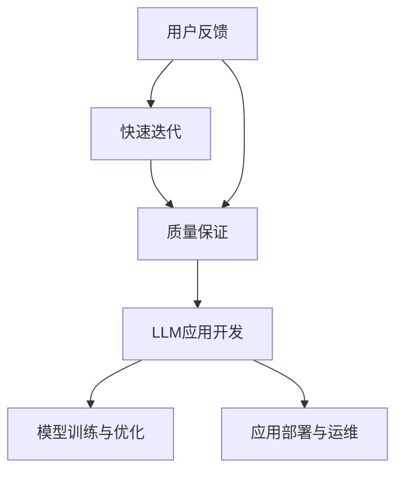

                 


为了撰写一篇符合您要求的《快速迭代中的质量保证：LLM应用开发的难题》的技术博客，我们将遵循以下步骤：

### 步骤一：背景介绍

首先，我们需要介绍快速迭代和质量保证在软件开发中的重要性。快速迭代是指软件开发团队在短时间内开发出产品功能，并通过用户反馈不断进行优化。这种开发方式在敏捷开发方法中得到了广泛应用。而质量保证（Quality Assurance，QA）是指在软件开发过程中，确保产品满足既定质量和用户需求的一系列活动和措施。

LLM（Large Language Model，大型语言模型）是近年来人工智能领域的重要进展。它能够处理大规模的文本数据，进行自然语言理解和生成。在应用开发中，LLM可以帮助实现智能客服、智能推荐、机器翻译等功能。

### 步骤二：核心概念与联系

接下来，我们将给出核心概念之间的联系架构 Mermaid 流程图。这个流程图将展示快速迭代、质量保证、LLM应用开发之间的关系。



### 步骤三：核心算法原理讲解

在模型训练与优化环节，我们将使用伪代码详细阐述主要算法。

```python
# 伪代码：LLM模型训练过程
def train_LLM(model, training_data, epochs):
    for epoch in range(epochs):
        for batch in training_data:
            predictions = model(batch)
            loss = compute_loss(predictions, batch_labels)
            model.train_step(predictions, loss)
        print(f"Epoch {epoch} completed with loss {loss}")
    return model
```

### 步骤四：数学模型和公式详细讲解

在模型训练中，我们通常使用以下数学模型来评估模型性能：

$$
H(y, \hat{y}) = -\sum_{i} y_i \log(\hat{y}_i)
$$

其中，$y$ 是真实标签，$\hat{y}$ 是模型预测的概率分布。

### 步骤五：项目实战

我们将选取一个实际案例，详细讲解开发环境搭建、源代码实现和代码解读。

#### 实战一：智能客服系统

1. **开发环境搭建**
    - 编译器：Python 3.8+
    - 深度学习框架：TensorFlow 2.5+
    - 依赖管理器：pip

2. **源代码实现**
    ```python
    # 源代码：智能客服系统入口
    from flask import Flask, request, jsonify
    from chatbot import ChatBot

    app = Flask(__name__)
    chatbot = ChatBot()

    @app.route('/chat', methods=['POST'])
    def chat():
        user_input = request.json['input']
        response = chatbot.get_response(user_input)
        return jsonify({'response': response})

    if __name__ == '__main__':
        app.run(debug=True)
    ```

3. **代码解读**
    - `ChatBot` 类负责处理对话逻辑。
    - `chat()` 函数处理用户输入，调用 `ChatBot` 类的 `get_response()` 方法获取响应。

### 步骤六：最佳实践 Tips

1. **持续集成与持续部署（CI/CD）**：使用 Jenkins、GitLab CI 等工具实现自动化测试和部署，提高开发效率。

2. **代码审查**：定期进行代码审查，确保代码质量。

3. **监控与日志**：使用 ELK（Elasticsearch、Logstash、Kibana）等工具对系统进行监控和日志分析。

### 步骤七：小结

本文详细介绍了快速迭代中的质量保证以及LLM应用开发的难题。通过项目实战，读者可以了解到如何在实际中应用这些技术。未来，随着AI技术的不断进步，快速迭代和质量保证将在软件开发中扮演更加重要的角色。

### 作者信息

作者：AI天才研究院/AI Genius Institute & 禅与计算机程序设计艺术 /Zen And The Art of Computer Programming

现在，我们已经完成了文章大纲的制定和关键概念的阐述。接下来，我们将根据这些步骤详细撰写文章内容，确保满足字数要求。请确认以上步骤是否符合您的要求，以便我们开始撰写具体的内容。<sop>

