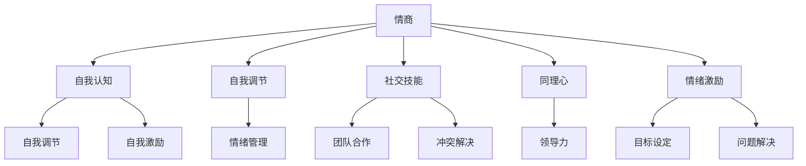

                 

### 引言

#### 1.1 情商领导力的定义与重要性

情商领导力是一种综合了情商与领导力的能力，它不仅要求领导者具备情感智能，即能够理解和管理自身及他人的情感，还包括了出色的领导能力，如决策、沟通、团队合作和冲突管理等。情商领导力强调领导者通过情感智慧来激发团队潜力，实现团队目标，从而提升团队凝聚力和整体绩效。

在当今快速变化和高度竞争的商业环境中，情商领导力显得尤为重要。研究表明，情商高的领导者能够更好地应对压力，更有效地处理人际关系，更快速地做出明智决策。因此，具备高情商的领导者往往能够在复杂多变的环境中取得成功。

本文将探讨情商领导力的核心概念、实践方法、提升策略以及其在提升团队凝聚力方面的作用。我们希望通过本文的阐述，帮助读者深入理解情商领导力的重要性，掌握提升情商领导力的具体方法，从而在职业发展中取得更大的成功。

#### 1.2 为什么需要情商领导力

在现代社会中，团队的成功往往取决于领导者的情商水平。以下是几个为什么需要情商领导力的关键原因：

1. **提升团队凝聚力**：情商高的领导者能够建立信任，促进团队成员之间的良好关系，从而增强团队凝聚力。这种凝聚力是团队高效协作的基础。

2. **激发团队成员潜力**：情商领导力可以帮助领导者识别和激发团队成员的潜力，鼓励他们不断成长和进步。这样，团队成员不仅能够更好地完成当前任务，还能为未来的挑战做好准备。

3. **应对复杂挑战**：情商高的领导者能够更好地理解和管理自身及他人的情绪，从而更有效地应对复杂和突发的情况。这种能力在危机管理和战略决策中尤为重要。

4. **提高决策质量**：情商领导力使得领导者能够更全面地考虑问题，更有效地收集和分析信息，从而做出更明智的决策。这种决策能力对于企业的长期发展至关重要。

5. **建立企业文化**：情商领导力可以帮助领导者塑造积极向上的企业文化，使员工感受到企业的关怀和尊重，从而提高员工满意度和忠诚度。

总之，情商领导力不仅是领导者的个人能力，更是团队和组织成功的关键因素。通过提升情商领导力，领导者可以更好地激发团队潜力，应对挑战，实现组织目标。

#### 情商领导力理论

#### 2.1 情商的定义与维度

情商（Emotional Intelligence，简称EQ）是一个描述个体情感智能水平的重要概念。它是心理学家丹尼尔·戈尔曼（Daniel Goleman）在1995年提出的一个概念，用以描述个体在识别、理解、管理自身及他人情感，以及利用这些情感促进思考、解决问题和激励自己及他人的能力。

情商通常被分为五个核心维度，每个维度都反映了个体在情感智能方面的不同能力：

1. **自我认知**：这是情商的基础，指的是个体对自己情感状态的认识和了解。高自我认知能力的人能够清楚地识别自己的情绪，理解这些情绪背后的原因，并能根据自己的情感状态来调整行为。

   **核心概念联系：**
   
   - 自我认知能力与自我调节、自我激励之间存在密切联系。自我调节依赖于自我认知，而自我激励则是在自我认知的基础上进一步发挥自身潜力。

2. **自我调节**：指的是个体在认识到自己的情感状态后，如何调节这些情感，以适应不同情境。高自我调节能力的人能够控制自己的情绪，避免因情绪波动而影响决策和行为。

   **核心概念联系：**
   
   - 自我调节不仅与自我认知相关，还与情绪管理密切相关。情绪管理是通过自我调节来控制情绪的过程。

3. **社交技能**：这是情商的一个重要维度，指的是个体在社交环境中如何与他人沟通、建立和维持良好关系的能力。高社交技能的人能够有效地倾听他人，表达自己的想法和情感，并处理人际关系中的冲突。

   **核心概念联系：**
   
   - 社交技能与团队合作密切相关。团队合作需要有效的沟通和协调，而这些都需要出色的社交技能。

4. **同理心**：同理心是指个体能够理解和感受他人情感的能力。高同理心的人能够站在他人的角度思考问题，从而更好地理解和满足他人的需求。

   **核心概念联系：**
   
   - 同理心与领导力有直接关系。领导者需要具备同理心，以便更好地理解团队成员的需求，激励他们并建立信任。

5. **情绪激励**：这是情商的最后一个维度，指的是个体如何利用情感来激励自己，设定目标，并实现目标。高情绪激励能力的人能够将负面情绪转化为动力，以实现更高的成就。

   **核心概念联系：**
   
   - 情绪激励与自我激励密切相关。自我激励是个体在情绪激励的基础上，通过设定目标并努力实现这些目标的过程。

#### 情商与领导力的关系

情商与领导力之间存在紧密的联系。事实上，情商被认为是领导力的关键组成部分。以下是一些关于情商与领导力关系的核心概念：

1. **情感智慧是领导力的基石**：情商高的领导者能够更好地管理自己的情绪，理解他人的情感，并有效地激励团队。这种情感智慧使得领导者能够建立信任，促进团队合作，并在压力下做出明智的决策。

2. **情商影响领导风格**：不同的情商维度与不同的领导风格相关。例如，高自我认知的领导者可能更倾向于民主型领导风格，而高同理心的领导者则可能更倾向于参与型领导风格。

3. **情商提高决策质量**：情商领导力使得领导者能够更全面地考虑问题，更有效地收集和分析信息，从而做出更明智的决策。这种能力对于企业的长期发展至关重要。

4. **情商促进团队凝聚力**：情商高的领导者能够建立积极向上的团队文化，增强团队成员之间的信任和合作，从而提升团队凝聚力。

**Mermaid 流程图**

通过上述关系架构图，我们可以清晰地看到情商各个维度与领导力之间的关联。这种情感智能不仅提升了领导者的个人素质，还为他们如何有效地领导团队提供了深刻的洞见。

### 情商领导力的核心原理

#### 2.2.1 情商领导力模型

情商领导力的模型是理解情商如何影响领导力的关键。该模型通常包括以下核心组成部分：

1. **情感自我管理**：这是情商领导力模型的基础，指的是领导者如何识别和调节自己的情绪，以保持冷静和理性。有效的情感自我管理有助于领导者更好地应对压力和挑战，从而做出更明智的决策。

2. **情感认知**：情感认知是指领导者如何理解和分析他人及自己的情感。高情感认知能力的领导者能够更好地理解团队成员的需求和动机，从而更有效地激励和指导他们。

3. **社交技能**：社交技能是指领导者如何与他人沟通、建立和维持良好关系的能力。高社交技能的领导者能够建立信任，促进团队合作，并有效地解决团队冲突。

4. **同理心**：同理心是指领导者如何站在他人的角度思考问题，理解和感受他人的情感。同理心的领导者能够更好地理解团队成员的感受，从而更有效地激励和指导他们。

5. **自我激励**：自我激励是指领导者如何利用情感来设定目标并努力实现这些目标。自我激励的领导者能够将负面情绪转化为动力，以实现更高的成就。

**核心原理联系：**

- **情感自我管理与决策**：情感自我管理能力强的领导者能够更好地控制情绪，从而在决策过程中保持冷静和理性，避免情绪对决策的负面影响。

- **情感认知与团队合作**：情感认知能力使领导者能够更好地理解团队成员的需求和动机，从而建立更紧密的团队合作关系，提高团队绩效。

- **社交技能与冲突解决**：社交技能使领导者能够有效地处理团队冲突，通过沟通和协商解决分歧，从而维护团队和谐。

- **同理心与领导激励**：同理心使领导者能够更好地激励团队成员，通过理解和满足他们的需求，提高团队士气和忠诚度。

- **自我激励与目标实现**：自我激励能力使领导者能够设定明确的目标，并持续努力实现这些目标，即使面对困难和挑战也不轻易放弃。

通过上述核心原理的相互作用，情商领导力模型能够帮助领导者更有效地管理团队，实现组织目标。

#### 2.2.2 情商领导力的优势

情商领导力在许多方面都展现出显著的优势，使其成为领导者成功的关键因素。以下是情商领导力的一些主要优势：

1. **提高决策质量**：情商高的领导者能够更全面地考虑问题，更有效地收集和分析信息，从而做出更明智的决策。他们在面对复杂和不确定的情况时，能够更冷静和理性地分析问题，减少情绪对决策的干扰。

2. **增强团队凝聚力**：情商领导力有助于建立信任和积极的团队文化。通过有效的情感管理和社会技能，领导者能够促进团队成员之间的良好关系，从而增强团队的凝聚力和合作精神。

3. **提升员工满意度**：情商高的领导者能够更好地理解员工的需求和动机，提供个性化的激励和反馈。这种关怀和支持提高了员工的满意度和忠诚度，降低了员工流失率。

4. **促进创新和灵活性**：情商领导力鼓励领导者鼓励创新思维和开放的文化。领导者能够通过同理心和理解团队成员的情感需求，激发创新和创造力，从而推动组织的持续发展和进步。

5. **提高领导力效能**：情商领导力使得领导者能够在压力下保持冷静，有效管理团队，并快速适应变化。这种能力不仅提升了领导者的个人效能，还促进了整个团队和组织的高效运作。

6. **培养接班人**：情商领导力有助于培养具有高情商的接班人。通过有效的领导实践和情感管理，领导者能够传授情感智慧，帮助下一代领导者成功。

总之，情商领导力通过多种方式提升了领导者的效能和组织绩效，是现代领导者不可或缺的能力。

### 情商领导力的实践

#### 3.1 情商领导力的案例解析

为了更深入地理解情商领导力在实践中的应用，我们可以通过分析一些成功的情商领导力案例，来探讨如何在实际工作中运用这一能力。

**案例一：谷歌的创始人谢尔盖·布林（Sergey Brin）和拉里·佩奇（Larry Page）**

谷歌的创始人布林和佩奇以其高情商和卓越的领导力而闻名。他们不仅在技术上有着非凡的成就，更在管理团队和培养文化方面表现出色。以下是几个关键点：

1. **信任与透明**：布林和佩奇坚信透明和信任是团队成功的关键。他们鼓励员工自由表达意见，并建立了开放的文化，使得团队成员之间能够坦诚沟通，减少误解和冲突。

2. **激励与认可**：他们非常注重员工的个人成长和职业发展。通过定期的反馈和认可，他们激励员工持续创新，追求卓越。

3. **同理心**：布林和佩奇能够在团队中建立起深厚的同理心，他们能够理解员工的需求和情感，从而更好地激励和指导他们。

**案例二：苹果公司的创始人史蒂夫·乔布斯（Steve Jobs）**

乔布斯是一位备受争议但无疑具有极高情商的领导者。尽管他有时表现得非常苛刻，但他通过独特的领导风格和强大的情感智慧，带领苹果公司取得了巨大的成功。以下是几个关键点：

1. **愿景与激情**：乔布斯拥有清晰的愿景和强烈的激情，他能够将自己的愿景和激情传递给团队成员，激励他们为之努力。

2. **冲突管理**：乔布斯擅长处理冲突，他能够通过直接的沟通和果断的决策，迅速解决团队中的问题，保持团队的稳定和高效。

3. **产品导向**：乔布斯对产品的极致追求使他能够在产品设计和开发过程中，保持对细节的高度关注，从而打造出令用户惊艳的产品。

**案例三：微软的萨提亚·纳德拉（Satya Nadella）**

萨提亚·纳德拉在担任微软CEO期间，通过高情商领导力推动了公司的转型和成长。以下是几个关键点：

1. **文化变革**：纳德拉注重团队合作和开放沟通，他通过改变公司的文化，使微软成为一个更包容、更有创新精神的公司。

2. **领导力的传承**：纳德拉通过有效的领导力和培养接班人计划，确保了领导团队的持续发展和进步。

3. **全球化视野**：纳德拉具备全球视野，他能够理解不同文化背景下的需求和挑战，从而更好地推动全球化战略。

通过上述案例，我们可以看到情商领导力在实际工作中的多种应用。无论是通过信任和透明建立文化，还是通过愿景和激情激励团队，抑或是通过文化变革推动企业转型，情商领导力都是成功的关键因素。领导者通过提升自身的情商能力，不仅能够提升个人领导力，还能够为整个团队和组织带来显著的益处。

#### 3.2 情商领导力的实战技巧

在实际工作中，情商领导力可以通过以下实战技巧得到有效应用，帮助领导者提升团队表现和实现组织目标：

1. **建立信任**：信任是团队成功的关键。领导者可以通过以下方式建立信任：

   - **透明沟通**：保持信息的透明，及时与团队成员分享重要信息，减少误解和猜疑。
   - **一致性**：言行一致，保持决策和行动的一致性，增强团队成员对领导者的信任。
   - **认可与赞赏**：对团队成员的成就给予认可和赞赏，增强他们的自信心和对团队的信任。

2. **激发团队动力**：激发团队动力是提升团队表现的重要一环。领导者可以通过以下方式实现：

   - **设定明确目标**：为团队成员设定清晰、具体的目标，确保每个人都了解自己的职责和期望。
   - **鼓励创新**：鼓励团队成员提出新想法和解决方案，营造一个创新和实验的环境。
   - **提供资源和支持**：确保团队成员拥有完成任务所需的资源和支持，减轻他们的负担。

3. **管理冲突**：冲突是团队工作中不可避免的一部分。领导者可以通过以下方式管理冲突：

   - **倾听与理解**：耐心倾听团队成员的观点和感受，理解他们的立场和需求。
   - **中立调解**：在冲突中保持中立，避免偏袒任何一方，寻求公正的解决方案。
   - **建设性对话**：引导团队成员进行建设性的对话，鼓励他们找到共同点和解决方案。

4. **提供反馈**：及时、具体的反馈是团队成员成长和改进的重要推动力。领导者可以通过以下方式提供反馈：

   - **正面反馈**：表扬团队成员的优点和努力，增强他们的自信和积极性。
   - **具体反馈**：提供具体的反馈，指出具体的行为和改进的方向。
   - **持续反馈**：定期与团队成员进行反馈，确保他们能够及时了解自己的表现和进步。

5. **建立团队文化**：团队文化是团队长期稳定和发展的基础。领导者可以通过以下方式建立积极向上的团队文化：

   - **价值观共识**：与团队成员共同确立团队的价值观，确保每个人都认同并遵守这些价值观。
   - **共同目标**：设定共同的目标，让团队成员感受到自己的工作对团队和组织的价值。
   - **团队活动**：定期组织团队活动，增强团队成员之间的互动和凝聚力。

通过上述实战技巧，领导者可以在实际工作中有效地运用情商领导力，提升团队凝聚力和整体绩效。这些技巧不仅有助于提高团队成员的工作满意度和忠诚度，还能够推动团队的持续发展和进步。

### 提升情商领导力的方法

#### 4.1 自我认知与自我调节

提升情商领导力首先需要从自我认知和自我调节开始。自我认知是情商的基础，它涉及到个体对自己情感状态的理解和认识。以下是一些提高自我认知和自我调节的技巧：

1. **反思**：定期进行自我反思，思考自己的情感反应和行为背后的原因。通过反思，个体能够更好地理解自己的情绪，从而进行有效的自我调节。

2. **情绪日记**：记录每天的情感状态，包括触发情感的事件、情感的反应以及情感变化的过程。情绪日记有助于个体识别常见的情感触发点，从而更好地管理自己的情绪。

3. **正念练习**：正念是一种通过专注当下、接受当下情感和感受来提升自我认知的技巧。通过冥想和呼吸练习，个体能够更好地关注当下的情绪，减少情绪的波动。

4. **情绪管理课程**：参加情绪管理课程或工作坊，学习专业的情绪管理技巧。这些课程通常包括认知行为疗法、压力管理、情感调节等内容，有助于提升个体的情绪管理能力。

#### 4.2 情绪管理

情绪管理是情商领导力的重要组成部分，它涉及到如何识别、表达和调节情绪。以下是一些情绪管理的技巧：

1. **情绪识别**：学会识别自己的情绪，包括正面和负面情绪。通过情绪识别，个体能够更好地理解自己的情感状态，从而进行有效的情绪调节。

2. **情绪表达**：学会以健康的方式表达自己的情绪，避免压抑或过度表达。健康的情绪表达包括直接、诚实和尊重地与他人沟通自己的情感。

3. **情绪调节**：学会在情绪波动时进行自我调节，保持冷静和理性。情绪调节技巧包括深呼吸、放松练习、认知重构等。

4. **情绪智力训练**：通过训练提高情绪智力，包括情绪识别、情绪表达、情绪调节和情绪利用等。这些训练可以通过专业的培训课程、在线资源和书籍来实现。

#### 4.3 沟通技巧

有效的沟通是情商领导力的关键组成部分，它关系到领导者如何与他人建立良好的关系。以下是一些提升沟通技巧的方法：

1. **倾听**：学会倾听他人的意见和感受，避免打断或过度反应。倾听是一种重要的沟通技巧，它能够建立信任和增进理解。

2. **明确表达**：学会清晰、明确地表达自己的想法和感受，避免含糊或模棱两可的表述。明确表达有助于减少误解和冲突。

3. **非语言沟通**：注意自己的肢体语言、面部表情和语调，确保它们与言语表达一致。非语言沟通对沟通效果有重要影响。

4. **反馈**：学会给予和接受反馈，通过正面和建设性的反馈促进个人和团队的发展。有效的反馈应具体、客观和有建设性。

5. **跨文化沟通**：了解和尊重不同文化背景下的沟通习惯和差异，避免文化冲突。跨文化沟通技巧有助于提升跨团队合作的效果。

通过上述方法，领导者可以逐步提升自我认知和情绪管理能力，同时增强沟通技巧，从而在个人和团队层面上提升情商领导力。这些能力的提升不仅有助于领导者在工作中取得成功，还能为团队和组织带来长期的益处。

### 团队凝聚力

#### 5.1 团队凝聚力的定义与重要性

团队凝聚力是指团队成员之间相互吸引、愿意合作并共同为团队目标努力的程度。它包括团队成员的归属感、信任感、合作精神以及对团队的认同感。团队凝聚力不仅仅是团队成员之间相互联系的简单叠加，它还涉及到团队成员在情感、行为和心理上的紧密联系。

**团队凝聚力的重要性**：

1. **提升工作效率**：高凝聚力的团队能够在面对任务时更高效地协作，因为成员之间相互信任，愿意分享信息和资源，共同解决问题。

2. **增强创新动力**：团队凝聚力能够促进成员之间的知识共享和经验交流，从而激发创新思维。在一个凝聚力的团队中，成员更愿意尝试新想法，接受变革，推动团队发展。

3. **提高员工满意度**：当团队成员感受到自己是团队不可或缺的一部分时，他们会感到更加满意和有成就感。这种满足感不仅提升了员工的忠诚度，还减少了员工流失率。

4. **降低冲突**：高凝聚力的团队能够更好地处理内部冲突，通过沟通和协作找到解决方案。这有助于保持团队和谐，避免因冲突而导致的低效和士气下降。

5. **提升团队绩效**：团队凝聚力是团队绩效的重要驱动因素。当团队成员紧密合作，相互支持时，团队的整体绩效和产出都会显著提高。

#### 5.2 提升团队凝聚力的策略

要提升团队凝聚力，领导者可以采取以下策略：

1. **共同目标的设定**：明确团队的目标和愿景，确保所有成员都了解并认同这些目标。共同的目标能够激发团队成员的归属感和合作意愿。

2. **增强团队互动**：定期组织团队活动和团建活动，促进成员之间的交流和互动。这些活动不仅能够增进了解，还能建立信任和友谊。

3. **解决团队冲突**：领导者应积极面对和解决团队内部的冲突，通过建设性的对话和协商找到解决方案。解决冲突有助于保持团队的稳定和高效。

4. **认可与赞赏**：对团队成员的成就和努力给予认可和赞赏，增强他们的自信心和团队归属感。积极的反馈能够激励成员更积极地参与团队工作。

5. **建立团队文化**：塑造积极向上的团队文化，鼓励团队成员相互支持、尊重和信任。团队文化是提升凝聚力的关键因素。

通过上述策略，领导者可以有效地提升团队凝聚力，促进团队协作和整体绩效的提升。这些策略不仅有助于团队在短期内取得成功，还能为团队的长期发展奠定坚实基础。

### 情商领导力的挑战与应对

#### 6.1 情商领导力的挑战

尽管情商领导力在提升团队凝聚力和组织绩效方面具有显著优势，但在实际应用过程中，领导者仍会面临一系列挑战。以下是一些常见的问题及其背后的原因：

1. **文化障碍**：在一些组织内部，传统领导风格和文化可能会阻碍情商领导力的应用。例如，等级森严的组织结构可能导致下级对上级的情感表达产生顾虑，从而影响沟通和信任的建立。

2. **个人情感管理问题**：领导者自身可能在情感管理方面存在困难，如情绪波动、压力过大或自我调节能力不足，这些都会影响其领导力和团队的凝聚力。

3. **时间与资源限制**：在快节奏和高压力的工作环境中，领导者可能没有足够的时间和资源去培养和提升自己的情商领导力，特别是在面对紧急任务和短期目标时。

4. **认知偏差**：领导者可能存在认知偏差，如自我中心和过度自信，这些偏差会影响他们对团队成员情感的识别和理解，从而影响领导效果。

5. **培训不足**：一些组织可能缺乏针对情商领导力的培训和发展计划，导致领导者缺乏必要的知识和技能，难以在实际工作中有效应用情商领导力。

#### 6.2 应对策略

为了克服这些挑战，领导者可以采取以下应对策略：

1. **文化建设**：通过宣传和培训，逐步改变组织文化，鼓励开放、信任和包容的沟通氛围。领导者应率先示范，通过自身行为树立榜样。

2. **情感自我管理**：领导者应注重自身情感管理，通过反思、冥想和压力管理技巧来调节情绪，保持冷静和理性。

3. **时间管理**：领导者应学会合理安排时间和优先级，确保有足够的时间和资源去培养情商领导力。例如，定期安排时间进行团队建设活动和情感沟通。

4. **认知训练**：领导者可以通过阅读、培训和研讨会来提升自己的认知能力，减少认知偏差，更好地理解和识别团队成员的情感需求。

5. **专业发展**：组织应提供针对情商领导力的培训和指导，帮助领导者掌握相关知识和技能，从而在实际工作中更有效地应用情商领导力。

通过上述策略，领导者可以克服情商领导力应用中的挑战，提升个人领导力和团队凝聚力，为组织的长期成功奠定基础。

### 总结

#### 7.1 全书要点回顾

本文围绕情商领导力这一主题，系统地阐述了情商领导力的定义、重要性、核心原理、实践方法、提升策略以及其在团队凝聚力方面的作用。以下是全书的主要要点回顾：

1. **情商领导力的定义与重要性**：情商领导力是结合情商与领导力的能力，它有助于提升团队凝聚力和整体绩效。

2. **情商的五个维度**：自我认知、自我调节、社交技能、同理心和情绪激励，每个维度都是提升情商领导力的重要组成部分。

3. **情商与领导力的关系**：情商是领导力的基石，它通过影响决策质量、增强团队凝聚力、提升员工满意度和促进创新等方式，显著提升领导力效能。

4. **情商领导力的实践**：通过建立信任、激发团队动力、管理冲突和提供反馈等实战技巧，领导者可以在实际工作中有效应用情商领导力。

5. **提升情商领导力的方法**：自我认知与自我调节、情绪管理和沟通技巧是提升情商领导力的关键，领导者应通过反思、正念练习、情绪管理课程和专业培训等方式来提升这些能力。

6. **团队凝聚力**：团队凝聚力对团队工作效率、创新动力和员工满意度具有重要影响，领导者应通过共同目标、增强团队互动、解决冲突和建立团队文化来提升团队凝聚力。

7. **情商领导力的挑战与应对**：领导者在实际应用情商领导力过程中可能面临文化障碍、个人情感管理问题、时间与资源限制、认知偏差和培训不足等挑战，但通过文化建设、情感自我管理、时间管理、认知训练和专业发展等策略，可以有效地应对这些挑战。

#### 7.2 未来研究方向与建议

尽管本文对情商领导力进行了全面探讨，但仍有许多研究方向值得进一步探索：

1. **实证研究**：未来可以开展更多的实证研究，以验证情商领导力对团队绩效和组织成功的具体影响，为实践提供更有力的支持。

2. **跨文化研究**：研究情商领导力在不同文化背景下的应用效果，探索文化差异对情商领导力实践的影响。

3. **长期影响研究**：探讨情商领导力在长期实践中的效果，包括对领导者个人成长、团队稳定性和组织发展的持续影响。

4. **技术工具开发**：开发基于人工智能和大数据分析的情商领导力评估工具，帮助领导者更准确地了解和管理自身的情商水平。

5. **领导力培训**：设计更系统和有针对性的情商领导力培训课程，帮助领导者系统地提升情商领导力。

通过这些未来研究方向，我们希望能够进一步深化对情商领导力的理解，为领导者提供更有效的实践指南，推动组织和社会的持续发展。

### 作者信息

作者：AI天才研究院/AI Genius Institute & 禅与计算机程序设计艺术 /Zen And The Art of Computer Programming

本文由AI天才研究院撰写，旨在通过深入探讨情商领导力，帮助领导者提升团队凝聚力和整体绩效。同时，本文结合禅与计算机程序设计艺术的智慧，提供了一种独特的视角，帮助读者在实践中更好地理解和应用情商领导力。希望本文能够为您的领导力提升之路带来启发和帮助。感谢您的阅读。

