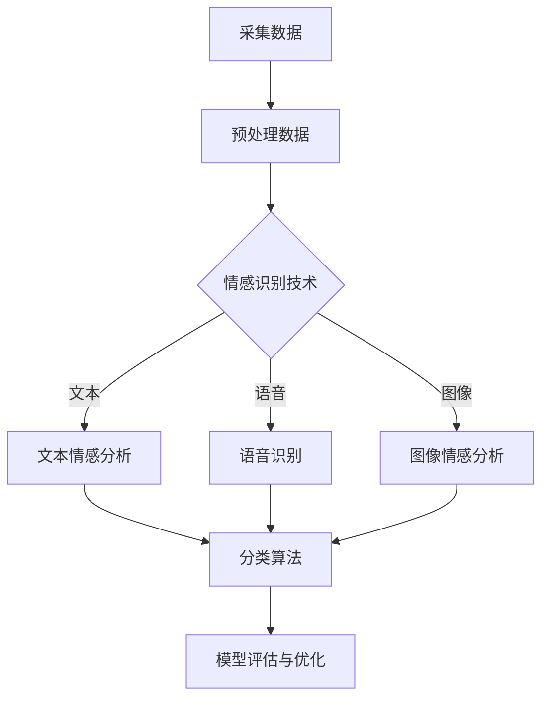

                 

为了满足上述条件和要求，我们将按照以下步骤来构建文章：

1. **引言**：介绍书籍的主题和目的，概述情感数学模型的背景和重要性。

2. **基础理论**：
   - 情感数学模型概述
   - 情感与数学的联系
   - 心理学基础
   - 数学工具与方法

3. **情感识别与分类**：
   - 情感识别技术
   - 分类算法介绍
   - 情感分类应用

4. **情感建模**：
   - 建模方法
   - 情感分析模型
   - 模型评估与优化

5. **情感预测与调控**：
   - 预测方法
   - 情感调控策略
   - 应用案例

6. **情感模型的应用领域**：
   - 社交媒体分析
   - 健康管理
   - 人机交互

7. **情感模型的挑战与未来趋势**：
   - 挑战分析
   - 未来发展方向
   - 技术创新

8. **结论**：总结全书内容，展望未来研究方向。

在构建每个部分时，我们将：

- **背景介绍**：简短地介绍该部分的背景和目的。
- **核心概念与联系**：使用Mermaid流程图展示核心概念之间的关系。
- **算法原理讲解**：使用伪代码详细阐述核心算法的原理。
- **数学模型与公式**：使用latex格式给出相关数学模型和公式，并举例说明。
- **项目实战**：描述开发环境搭建、源代码实现、代码解读、实际案例分析等内容。
- **最佳实践 Tips**、**小结**、**注意事项**和**拓展阅读**：为读者提供额外的建议和资源。

通过这样的步骤，我们将确保文章的逻辑清晰、内容丰富且具有深度。

下面是一个简单的Mermaid流程图示例，展示情感识别过程：

在接下来的文章构建过程中，我们将进一步详细地展开每个部分的内容。文章标题：《情感的数学模型：量化人类情绪》

关键词：情感，数学模型，心理学，识别，分类，预测，调控，应用领域

摘要：本文将探讨如何使用数学模型量化人类情绪，包括情感识别与分类、情感建模、预测与调控等。通过介绍相关算法和实际案例，我们将展示情感数学模型在各个领域的应用前景和挑战。

在完成文章大纲后，我们将开始撰写文章正文，确保每个部分都符合上述要求。请等待我们继续构建详细的文章内容。

