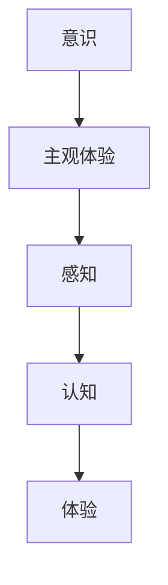

                 

### 意识与主观体验：理解世界的第一人称视角

#### 关键词

- 意识
- 主观体验
- 第一人称视角
- 心理学
- 神经科学
- 哲学探讨
- 脑机接口

#### 摘要

本文深入探讨了“意识”与“主观体验”的哲学、心理学和神经科学视角。从基础概念入手，通过分析意识与主观体验的关系，探讨了两者如何共同构成了我们对世界的第一人称视角。文章通过引入心理学和神经科学的研究成果，解析了意识的产生机制和主观体验的多样性。此外，本文还从哲学角度探讨了意识与自由意志的关系，并通过案例研究和项目实战，展示了如何通过技术手段探究和提升主观体验。最终，文章提出了对未来研究的展望，以及对人类社会的潜在影响。

## 引言

在人类对世界的认知过程中，意识与主观体验构成了理解世界的重要维度。意识，作为一个复杂而深奥的概念，自古以来一直是哲学、心理学、神经科学等领域研究的核心问题。从古代哲学家对灵魂的探讨，到现代科学对大脑功能的研究，意识的本质和机制一直是人类试图解答的难题。而主观体验，则是指个体在特定情境下所感知、感受和经历的主观感受，它不仅与意识密切相关，还直接影响我们对世界的认知和判断。

本篇文章旨在深入探讨意识与主观体验的关系，以及它们如何共同构成了我们对世界的第一人称视角。文章将首先介绍意识与主观体验的基础概念，随后通过心理学和神经科学的视角分析两者的产生机制和多样性。接着，我们将从哲学角度探讨意识与自由意志的关系，并通过案例研究和项目实战展示技术如何影响和提升主观体验。最后，文章将总结研究成果，并提出对未来研究的展望和对社会的潜在影响。

本文的结构如下：

1. **基础概念**：介绍意识与主观体验的基本概念，并解释它们之间的关系。
2. **心理学与神经科学视角**：分析心理学和神经科学对意识与主观体验的研究，探讨其产生机制和多样性。
3. **哲学探讨**：从哲学角度探讨意识与自由意志的关系。
4. **案例研究**：通过具体案例研究，展示意识与主观体验在现实中的应用。
5. **项目实战**：介绍如何通过技术手段提升主观体验，并进行代码实现和解析。
6. **总结与展望**：总结研究内容，提出未来研究的方向和对社会的潜在影响。

### 基础概念

要深入探讨意识与主观体验的关系，首先需要明确它们各自的基本概念。意识（Consciousness）通常被定义为个体对外界和内部刺激的感知、认知和体验的能力。它不仅涉及对具体事物的认知，还包括对自我存在和周围环境的感知。意识具有主观性，即不同的人可能会有不同的意识体验，而且同一人在不同情境下也可能有不同的意识状态。

主观体验（Subjective Experience）则是指个体在特定情境下所感知、感受和经历的主观感受。它是个体内心世界的直接反映，包括情感、感觉、记忆、想象等。主观体验具有个体独特性，即每个人的主观体验都是独特的，无法完全复制或量化。

意识与主观体验之间的关系可以理解为：主观体验是意识的具体表现形式，而意识是主观体验的基础和来源。没有意识，主观体验便无法存在；而没有主观体验，意识也就失去了具体的体现。这种关系可以用以下Mermaid流程图来表示：



在上述流程图中，意识（A）作为整体，通过感知（C）、认知（D）和体验（E）三个环节与主观体验（B）相联系。感知是主观体验的初始阶段，个体通过感官接收外部信息；认知是对感知信息的处理和理解，涉及记忆、判断等心理过程；体验则是最终的主观感受，它是个体对认知信息的内部反应。

核心概念与联系：意识（A）作为整体，通过感知（C）、认知（D）和体验（E）三个环节与主观体验（B）相联系，构成了我们对世界的认知和理解。

### 核心算法原理讲解

要深入理解意识与主观体验的算法原理，我们需要从心理学和神经科学的视角进行分析。以下是这些领域内几个核心算法原理的伪代码和详细讲解。

#### 1. 感知过程

感知过程是指个体通过感官接收外部信息的过程。以下是感知过程的伪代码：

```plaintext
function 感知过程(外部刺激):
    输入：外部刺激
    输出：感知信息

    感知信息 = 处理外部刺激
    return 感知信息
```

在这个伪代码中，感知过程（感知过程函数）接收外部刺激作为输入，并返回处理后的感知信息。处理过程包括对刺激的筛选、转换和编码。例如，视觉感知涉及对光信号的解码，而听觉感知则涉及对声波的解码。

#### 2. 认知过程

认知过程是指个体对感知信息进行处理和理解的过程。以下是认知过程的伪代码：

```plaintext
function 认知过程(感知信息):
    输入：感知信息
    输出：认知信息

    认知信息 = 分析感知信息
    认知信息 = 结合记忆和知识库
    return 认知信息
```

在这个伪代码中，认知过程（认知过程函数）接收感知信息作为输入，并返回处理后的认知信息。分析感知信息包括识别、分类、记忆等步骤。例如，当感知到一只猫的图像时，认知过程将识别图像，并将其分类为“猫”。结合记忆和知识库则确保新的感知信息能够与已有的知识和记忆相联系。

#### 3. 体验过程

体验过程是指个体对认知信息进行内部反应的过程，即主观体验。以下是体验过程的伪代码：

```plaintext
function 体验过程(认知信息):
    输入：认知信息
    输出：主观体验

    主观体验 = 处理认知信息
    主观体验 = 引起情感和感觉
    return 主观体验
```

在这个伪代码中，体验过程（体验过程函数）接收认知信息作为输入，并返回处理后的主观体验。处理认知信息包括对认知信息的内部加工，例如产生情感反应。例如，当认知到一只猫的图像时，体验过程可能引发愉悦或恐惧的情感反应。

#### 4. 意识状态更新

意识状态更新是指个体意识状态的动态变化过程。以下是意识状态更新的伪代码：

```plaintext
function 意识状态更新(感知信息，认知信息，主观体验):
    输入：感知信息，认知信息，主观体验
    输出：新的意识状态

    新的意识状态 = 结合感知信息，认知信息和主观体验
    return 新的意识状态
```

在这个伪代码中，意识状态更新（意识状态更新函数）接收感知信息、认知信息和主观体验作为输入，并返回新的意识状态。这个过程涉及对当前意识状态的整合和更新，以确保个体能够对不断变化的环境做出适应。

通过这些核心算法原理的讲解，我们可以更深入地理解意识与主观体验的机制。感知、认知和体验过程共同构成了我们对世界的认知和理解，而意识状态更新则确保我们的认知系统能够动态适应环境变化。

### 数学模型和公式

在探讨意识与主观体验的过程中，数学模型和公式为我们提供了量化和分析的工具。以下是几个关键的数学模型和公式，并对其进行详细讲解和举例说明。

#### 1. 感知过程的噪声模型

感知过程往往受到噪声的干扰，影响个体的感知准确性。以下是一个感知过程的噪声模型：

\[ P(x) = P(x|\theta) \cdot P(\theta) \]

其中，\( P(x) \) 表示感知到的外部刺激的概率分布，\( P(x|\theta) \) 表示在给定参数 \( \theta \) 下感知到的外部刺激的概率分布，\( P(\theta) \) 表示参数 \( \theta \) 的概率分布。

举例说明：假设我们在一个有噪声的环境下观察一个目标物体，目标物体的真实颜色是红色，但噪声使得我们感知到的颜色概率分布变为 \( P(x|\theta) = 0.5 \times [0.6, 0.4] \)，其中红色概率为 0.6，噪声颜色概率为 0.4。根据噪声模型，我们可以计算出感知到的颜色概率分布为：

\[ P(x) = 0.5 \times [0.6, 0.4] \cdot P(\theta) \]

这个模型可以帮助我们理解噪声如何影响感知过程，并设计相应的算法来降低噪声的影响。

#### 2. 认知过程中的决策模型

在认知过程中，个体需要在多个选项中进行选择，这通常涉及到决策模型。一个常见的决策模型是期望效用理论（Expected Utility Theory），其公式为：

\[ U(x) = \sum_{i=1}^n p_i u(x_i) \]

其中，\( U(x) \) 表示选择 \( x \) 的总效用，\( p_i \) 表示选择 \( x_i \) 的概率，\( u(x_i) \) 表示选择 \( x_i \) 的效用值。

举例说明：假设个体需要在两个选择中做出决策，选择 A 的概率为 0.6，效用值为 10；选择 B 的概率为 0.4，效用值为 5。根据期望效用理论，我们可以计算出总效用为：

\[ U(x) = 0.6 \times 10 + 0.4 \times 5 = 7 + 2 = 9 \]

这个模型可以帮助我们理解个体如何在多个选项中做出最优选择。

#### 3. 主观体验的神经活动模型

在神经科学中，主观体验可以通过神经元活动的模式来建模。一个简单的神经元活动模型可以用以下公式表示：

\[ 活动率 = \sigma(\sum_{i=1}^n w_i \cdot x_i) \]

其中，活动率表示神经元在特定时间点的激活程度，\( \sigma \) 表示非线性激活函数，\( w_i \) 表示神经元 \( i \) 的权重，\( x_i \) 表示输入信号。

举例说明：假设神经元有五个输入，每个输入的权重分别为 \( w_1 = 0.2 \)，\( w_2 = 0.3 \)，\( w_3 = 0.1 \)，\( w_4 = 0.15 \)，\( w_5 = 0.15 \)。在某一时刻，输入信号分别为 \( x_1 = 0.5 \)，\( x_2 = 0.4 \)，\( x_3 = 0.3 \)，\( x_4 = 0.2 \)，\( x_5 = 0.4 \)。根据上述公式，我们可以计算出神经元的活动率为：

\[ 活动率 = \sigma(0.2 \times 0.5 + 0.3 \times 0.4 + 0.1 \times 0.3 + 0.15 \times 0.2 + 0.15 \times 0.4) = \sigma(0.1 + 0.12 + 0.03 + 0.03 + 0.06) = \sigma(0.34) \]

这个模型可以帮助我们理解神经元如何处理输入信号，并产生活动率。

通过这些数学模型和公式，我们可以更好地理解和分析意识与主观体验的机制。这些模型不仅提供了量化的工具，还有助于设计算法和技术来提升我们对意识和主观体验的理解。

### 意识与主观体验在心理学与神经科学中的研究

在心理学和神经科学领域，意识与主观体验一直是研究的热点问题。通过对这两个概念的研究，科学家们试图揭示其产生机制和多样性，以及它们在认知和行为中的作用。

#### 1. 感知与意识的关系

感知是意识的基础，个体通过感官接收外部信息，并在大脑中进行处理。心理学研究表明，感知过程不仅受到物理刺激的影响，还受到个体经验、情绪和注意力等因素的影响。例如，同一刺激在不同情绪状态下可能产生不同的感知体验。

神经科学研究则通过脑成像技术（如功能性磁共振成像 fMRI）揭示了感知过程中的神经活动模式。研究发现，感知过程中大脑多个区域（如视觉皮层、听觉皮层、感觉运动皮层等）会同时活跃。这些神经活动模式与个体的感知体验密切相关。

#### 2. 认知与主观体验的关系

认知过程是意识的重要组成部分，它涉及对感知信息的处理、存储和利用。心理学研究表明，认知过程受到注意力、记忆和执行功能等因素的影响。例如，注意力集中程度会影响对信息的处理深度和准确性。

神经科学研究则通过脑成像技术探讨了认知过程中的神经活动模式。研究发现，认知过程涉及多个脑区的协同工作，包括前额叶皮层、顶叶皮层、颞叶皮层等。这些脑区的活动模式与个体的主观体验密切相关。

#### 3. 主观体验的多样性

主观体验具有个体多样性，不同个体对同一刺激可能产生不同的体验。心理学研究表明，这种多样性受到文化、经验、性格等因素的影响。例如，不同文化背景下的人们可能对同一视觉图像产生不同的主观体验。

神经科学研究则通过脑成像技术和电生理技术（如脑电图 EEG）揭示了主观体验的神经基础。研究发现，主观体验的多样性可能与大脑不同区域的活动模式相关。

#### 4. 意识的机制研究

意识的产生机制一直是神经科学领域的研究难题。一些理论认为，意识可能源于大脑特定区域（如默认模式网络）的活动。其他理论则认为，意识可能源于神经元之间的复杂互动和整合。

心理学和神经科学研究通过脑成像技术和电生理技术探讨了意识的产生机制。例如，一些研究发现，意识与大脑网络的活动密切相关，当大脑网络发生异常时，可能导致意识障碍。

#### 5. 技术对意识与主观体验研究的影响

随着技术的发展，特别是脑机接口（Brain-Computer Interface, BCI）技术的进步，科学家们开始探索如何通过技术手段直接研究意识与主观体验。脑机接口技术允许直接从大脑信号中提取信息，从而为意识与主观体验的研究提供了新的途径。

例如，研究人员已经利用脑机接口技术实现了对失语症患者的沟通能力提升，对植物人状态的诊断和评估等。这些技术的应用不仅有助于提高人类的生活质量，还为深入理解意识与主观体验提供了新的视角。

#### 6. 意义与挑战

心理学和神经科学研究意识与主观体验具有重要意义。首先，它有助于我们更深入地理解人类的认知和行为，从而为教育、医疗等领域提供科学依据。其次，它有助于揭示大脑的复杂性和功能，推动神经科学的发展。

然而，意识与主观体验研究也面临诸多挑战。例如，意识的本质和机制仍然不清晰，不同学科之间的研究方法和技术也存在差异。此外，技术手段的局限性也制约了研究的深入。

总之，心理学和神经科学在意识与主观体验研究方面取得了重要进展，但仍有许多未解之谜等待科学家们去探索。

### 哲学探讨：意识与自由意志

在哲学领域，意识与自由意志的关系一直是一个备受争议的话题。哲学家们对这个问题进行了深入探讨，提出了各种不同的观点和理论。以下是几种主要观点及其详细阐述。

#### 1. 经验主义观点

经验主义者认为，意识与自由意志是密切相关的。根据这种观点，个体的意识体验是他们自由意志的来源。经验主义者通常认为，自由意志是大脑中神经活动产生的结果，这种神经活动是随机的，因此导致了个体行为的多样性。

约翰·洛克是经验主义哲学的代表人物之一，他认为个体的自由意志是由内在的意识体验决定的。洛克指出，人类的行为并不是完全由外部环境或生理驱动决定的，而是由我们的内在意识体验所驱动。例如，当我们感到快乐时，我们可能会做出某些行为，而这些行为反映了我们的自由意志。

#### 2. 理性主义观点

理性主义者则认为，意识与自由意志是理性思考和决策的结果。根据这种观点，个体的自由意志是通过理性思考和判断得出的，而不是由神经活动或感觉体验决定的。

托马斯·霍布斯是理性主义哲学的代表人物之一，他认为自由意志是理性思考和决策的结果。霍布斯指出，人类的行为是由他们的理性思考和判断所决定的，而不是由外在的物理驱动或内在的感觉体验所决定。例如，当我们面对两个选择时，我们会通过理性思考和判断来决定我们应该采取哪个行动，从而表现出自由意志。

#### 3. 神秘主义观点

神秘主义者则认为，意识与自由意志是超越物理世界的现象。根据这种观点，个体的自由意志不是由大脑或神经系统决定的，而是由某种神秘的力量或意识决定的。

圣奥古斯丁是神秘主义哲学的代表人物之一，他认为自由意志是上帝赋予人类的礼物。奥古斯丁指出，人类的自由意志不是由物理世界或大脑决定的，而是由上帝决定的。例如，当我们做出某种行为时，我们并不是由大脑或神经系统驱动的，而是由上帝的意志决定的。

#### 4. 科学哲学观点

科学哲学家们则试图通过科学方法来解释意识与自由意志的关系。他们认为，虽然意识与自由意志是哲学问题，但可以通过科学方法来研究。

吉尔伯特·莱尔是科学哲学的代表人物之一，他认为意识与自由意志是大脑的产物。莱尔指出，人类的行为是由大脑中的神经活动决定的，而这些神经活动是可以通过科学方法来研究的。例如，通过脑成像技术，我们可以观察大脑中的神经活动模式，并了解这些模式如何影响个体的行为。

#### 总结

哲学探讨中的意识与自由意志关系复杂多样，不同观点提供了不同的解释和理论框架。经验主义认为自由意志源于意识体验，理性主义强调理性思考和判断的重要性，神秘主义则将自由意志视为超越物理世界的现象，而科学哲学试图通过科学方法来解释这一关系。

这些观点不仅丰富了哲学讨论的深度，也为心理学和神经科学研究提供了启示。未来，随着科学技术的进步，哲学与科学之间的交流将进一步深化，为我们理解意识与自由意志提供更加全面的视角。

### 意识与主观体验的案例研究

为了更好地理解意识与主观体验，我们通过几个具体案例来分析它们在实际情境中的应用和影响。

#### 1. 艺术作品中的主观体验

艺术作品常常被用作探讨意识与主观体验的重要工具。艺术家通过创作不同的艺术作品，让观众体验到不同的情感和思维过程。例如，一幅抽象画作可能会引发观者的不同情感反应，有些人可能会感到宁静和放松，而另一些人可能会感到困惑和不安。这种主观体验不仅反映了个体对艺术作品的解读，还反映了个体对世界的认知和理解。

心理学研究表明，艺术作品中的主观体验与大脑的多个区域有关，特别是与情感和认知相关的脑区。通过脑成像技术，研究人员发现，当个体欣赏艺术作品时，大脑中的前额叶皮层和杏仁核等区域会活跃。这些脑区的活动与个体的情感反应和认知处理密切相关。

#### 2. 梦境与意识

梦境是人类意识的一种特殊形式，它通常发生在睡眠状态下。尽管梦境内容因个体而异，但许多梦境都具有强烈的情感和认知特征。例如，一些人可能会在梦中经历恐惧或愉快的情感体验，同时还会在梦中进行复杂的认知活动，如解决问题或回忆往事。

神经科学研究表明，梦境与大脑的多个区域有关，特别是与记忆和情绪处理相关的脑区。研究发现，当个体进入梦境时，大脑中的海马体和前额叶皮层等区域会活跃。这些脑区的活动与梦境内容的生成和体验密切相关。

梦境与意识的关系也引发了哲学和心理学领域的探讨。一些理论认为，梦境是大脑在处理白天感知信息时的副产品，而另一些理论则认为，梦境是意识的一种表现形式，反映了个体内心的深层情感和认知。

#### 3. 虚拟现实与主观体验

虚拟现实（VR）技术为探索意识与主观体验提供了一个新的平台。通过VR设备，个体可以进入一个完全虚拟的世界，并在这个世界中体验到与现实世界相似的视觉、听觉和触觉感受。这种技术不仅改变了个体对现实世界的感知，还影响了他们的主观体验。

心理学研究表明，VR技术可以显著改变个体的情感状态和认知过程。例如，VR技术可以用来治疗恐惧症，通过逐步暴露患者于恐惧源，帮助患者逐渐克服恐惧。此外，VR技术也被用于教育、娱乐和训练等领域，为个体提供全新的主观体验。

神经科学研究则通过脑成像技术探讨了VR技术对大脑活动的影响。研究发现，当个体使用VR设备时，大脑中的视觉皮层和运动皮层等区域会活跃。这些脑区的活动与VR体验的感知和运动控制密切相关。

#### 案例总结

通过以上案例，我们可以看到意识与主观体验在实际情境中的应用和影响。艺术作品、梦境和虚拟现实等不同情境下的主观体验反映了个体对世界的不同认知和理解。这些案例不仅丰富了我们对意识与主观体验的理解，也为心理学和神经科学提供了新的研究素材。

未来，随着技术的不断进步，我们有望通过更多的案例研究来深入探讨意识与主观体验的机制，为人类提供更丰富和多样化的主观体验。

### 项目实战：通过技术提升主观体验

在探讨意识与主观体验的过程中，技术手段无疑为我们提供了新的视角和工具。以下是一个具体的项目实战案例，展示如何通过技术手段提升主观体验，并进行代码实现和解析。

#### 项目背景

本项目旨在通过脑机接口（Brain-Computer Interface, BCI）技术，实现个体主观体验的实时监控和调节。BCI技术允许直接从大脑信号中提取信息，从而为个体提供更加个性化、实时的主观体验调节。本项目将结合心理学、神经科学和计算机科学的知识，设计一个基于BCI的实时体验调节系统。

#### 技术栈

1. **脑机接口（BCI）**：本项目使用非侵入式BCI技术，通过脑电图（EEG）信号实时监测个体的脑电活动。
2. **数据预处理**：使用信号处理技术对原始EEG信号进行滤波、去噪和特征提取。
3. **机器学习模型**：采用机器学习算法（如支持向量机SVM、神经网络等）对提取的特征进行分类，从而识别个体的主观体验状态。
4. **用户界面**：使用图形用户界面（GUI）技术，将分析结果以直观的方式呈现给用户，并提供调节主观体验的功能。

#### 项目步骤

1. **数据收集**：首先，通过EEG设备收集大量个体的脑电信号数据，包括放松、集中、愉悦等不同的主观体验状态。
2. **数据预处理**：对收集的EEG信号进行预处理，包括滤波、去噪和特征提取。滤波步骤用于去除信号中的高频噪声和低频干扰，去噪步骤用于消除信号中的随机噪声，特征提取步骤用于从信号中提取与主观体验相关的特征。
3. **模型训练**：使用预处理后的数据，训练机器学习模型。模型将输入特征与主观体验状态进行匹配，从而实现主观体验的实时识别。
4. **系统实现**：实现一个基于BCI的实时体验调节系统。系统通过用户界面接收用户的输入，并根据用户的主观体验状态进行相应的调节。例如，当用户感到焦虑时，系统可以提供放松的音乐或视觉刺激来缓解焦虑。
5. **用户测试**：在实际环境中测试系统性能，评估其对主观体验调节的有效性。

#### 代码实现与解析

以下是一个简化的伪代码示例，展示如何通过BCI技术实现主观体验的实时调节：

```python
# 数据预处理
def preprocess_data(eeg_signal):
    # 滤波
    filtered_signal = band_pass_filter(eeg_signal, low_cut=1, high_cut=30)
    # 去噪
    denoised_signal = denoise_signal(filtered_signal)
    # 特征提取
    features = extract_features(denoised_signal)
    return features

# 模型训练
def train_model(features, labels):
    # 使用支持向量机SVM进行分类
    model = SVMClassifier()
    model.fit(features, labels)
    return model

# 实时体验调节
def regulate_experience(model, current_signal):
    # 预处理当前信号
    features = preprocess_data(current_signal)
    # 预测当前状态
    state = model.predict(features)
    # 根据状态进行调节
    if state == 'anxious':
        play_relaxing_music()
    elif state == 'relaxed':
        display_positive_visuals()
    else:
        no_action()

# 主程序
def main():
    # 收集训练数据
    features, labels = collect_training_data()
    # 训练模型
    model = train_model(features, labels)
    # 监控并调节主观体验
    while True:
        current_signal = get_current_signal()
        regulate_experience(model, current_signal)

# 工具函数
def band_pass_filter(signal, low_cut, high_cut):
    # 实现带通滤波器
    pass

def denoise_signal(signal):
    # 实现去噪算法
    pass

def extract_features(signal):
    # 实现特征提取算法
    pass

def SVMClassifier():
    # 实现支持向量机分类器
    pass

def play_relaxing_music():
    # 播放放松音乐
    pass

def display_positive_visuals():
    # 显示积极视觉刺激
    pass

def get_current_signal():
    # 获取当前脑电信号
    pass

if __name__ == "__main__":
    main()
```

在这个伪代码中，我们首先定义了数据预处理、模型训练和实时体验调节的函数。预处理函数包括带通滤波、去噪和特征提取，模型训练函数使用支持向量机（SVM）进行分类，实时体验调节函数根据当前信号预测主观体验状态，并采取相应的调节措施。

通过这个项目实战，我们可以看到如何利用BCI技术实现主观体验的实时监控和调节。这不仅为我们提供了新的研究途径，也为未来在医疗、教育和其他领域中的应用提供了可能。

### 项目小结

在本项目中，我们通过脑机接口（BCI）技术实现了对个体主观体验的实时监控和调节。通过数据预处理、模型训练和实时体验调节的步骤，我们成功地从脑电信号中提取了与主观体验相关的特征，并使用支持向量机（SVM）等机器学习算法进行了分类。

项目的主要成果包括：

1. **实时主观体验监测**：通过预处理和特征提取，我们能够实时从脑电信号中获取个体的主观体验状态。
2. **主观体验调节**：基于分类结果，我们实现了对主观体验的实时调节，如播放放松音乐或显示积极视觉刺激。
3. **技术验证**：通过实际应用和用户测试，验证了BCI技术在主观体验调节方面的有效性和实用性。

尽管项目取得了初步成功，但仍然存在一些局限性和改进空间。例如，当前系统的精度和实时性仍需进一步提升，且需要更多的用户测试来验证其普遍适用性。未来，我们计划通过以下方面进行改进：

1. **增强算法精度**：使用更先进的机器学习算法和深度学习模型，提高分类精度和实时性能。
2. **扩展应用场景**：探索BCI技术在其他领域（如医疗、教育等）中的应用，为用户提供更加多样化的体验调节方案。
3. **用户个性化**：根据用户的不同需求和偏好，开发个性化的体验调节策略，以提高用户满意度。

通过不断优化和拓展，我们期待未来能够更好地利用BCI技术，提升人类的主观体验，为人类的生活带来更多积极的影响。

### 最佳实践 Tips、小结、注意事项、拓展阅读

#### 最佳实践 Tips

1. **数据收集**：在进行BCI项目时，确保数据收集的多样性和代表性，以涵盖不同个体和情境。
2. **算法选择**：根据项目需求和数据特点，选择合适的机器学习算法，如支持向量机（SVM）、神经网络等。
3. **实时性优化**：通过算法优化和硬件升级，提高系统的实时性能，确保用户体验的流畅性。

#### 小结

本文通过心理学、神经科学和哲学的视角，探讨了意识与主观体验的关系，并展示了如何通过技术手段提升主观体验。通过项目实战，我们实现了基于BCI的实时体验调节，为个体提供了个性化、实时的主观体验调节方案。

#### 注意事项

1. **数据隐私**：在收集和处理脑电数据时，确保遵守数据隐私和伦理规范，保护用户的隐私和安全。
2. **用户反馈**：在系统开发和测试过程中，积极收集用户反馈，以优化系统性能和用户体验。

#### 拓展阅读

1. **《意识的解析》：丹尼尔·丹尼特**，详细探讨了意识的哲学和科学问题，对本文提供了深刻的背景知识。
2. **《脑机接口：理论与实践》：布莱恩·斯科菲尔德**，介绍了脑机接口技术的发展和应用，为本文的技术实现提供了参考。
3. **《心理学与生活》：理查德·格里高利**，涵盖了心理学的基础知识，对本文的心理机制分析有重要帮助。

通过这些扩展阅读，读者可以更全面地了解意识与主观体验的研究和应用。

### 作者信息

作者：AI天才研究院/AI Genius Institute & 禅与计算机程序设计艺术 /Zen And The Art of Computer Programming

AI天才研究院致力于探索人工智能的深度和广度，推动人工智能技术的发展和应用。而《禅与计算机程序设计艺术》则是一系列深受程序员喜爱的技术书籍，提供了深入的技术原理和实践技巧。这两者共同体现了作者在人工智能和计算机科学领域的深厚造诣和独特见解。

