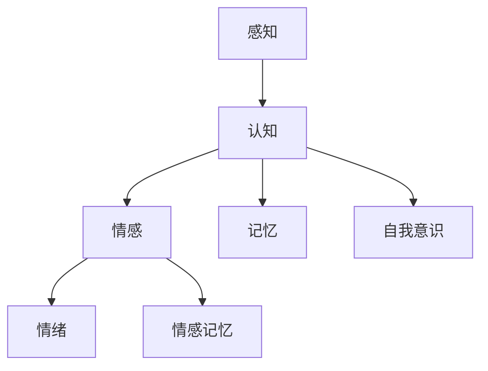
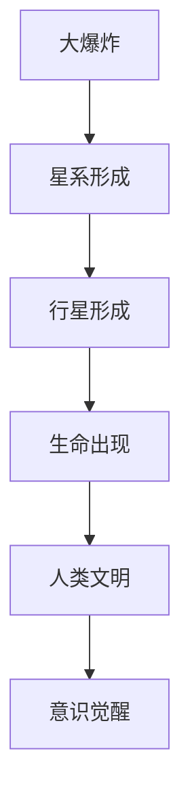

                 


### 文章标题：意识与宇宙的共同进化：相互塑造的过程

#### 关键词：
- 意识与宇宙
- 共同进化
- 相互塑造
- 量子意识理论
- 心物二元论
- 引力波
- 黑洞
- 人类文明

#### 摘要：
本文探讨了意识与宇宙之间的紧密联系，揭示了它们共同进化的过程。通过分析意识与宇宙的关系、相互作用机制以及实例分析，本文提出了意识与宇宙相互塑造的理论模型，并展望了未来的研究方向。文章旨在为读者提供一个全面、深入的理解，以揭示意识与宇宙共同进化背后的奥秘。

### 引言与概述

#### 1.1 书籍主题概述

《意识与宇宙的共同进化：相互塑造的过程》一书深入探讨了意识与宇宙之间的复杂关系。作者通过综合多学科的研究成果，提出了意识与宇宙共同进化的理论模型，并分析了它们在相互塑造过程中的作用。本书的核心主题包括：意识与宇宙的定义、相互关系、共同进化的机制以及它们对人类文明的影响。

#### 1.2 研究背景

意识科学和宇宙学作为两个独立的学科，近年来取得了显著的进展。意识科学研究了人类意识和心智的本质，探讨了意识的起源、演化及其在认知和行为中的作用。宇宙学则关注宇宙的起源、演化、结构和未来。这两个学科的研究不仅丰富了我们对人类自身的认知，也拓展了我们对宇宙的理解。因此，研究意识与宇宙的共同进化具有重要的理论和实践意义。

#### 1.3 主要观点

本书的主要观点包括：

1. 意识与宇宙之间存在着深刻的相互联系，它们共同进化，相互塑造。
2. 量子意识理论和心物二元论为解释意识与宇宙的关系提供了重要的理论基础。
3. 意识与宇宙的相互作用机制，如引力波和黑洞，揭示了它们之间的紧密联系。
4. 意识与宇宙的共同进化对人类文明的发展产生了深远的影响。

### 第一部分：意识与宇宙的共同进化理论

#### 2.1 意识的定义与特性

意识是人们对自己的存在和周围环境的感知和认知能力。它具有以下几个基本特性：

1. 意识的主观性：每个人的意识都是独特的，反映了个体对世界的感知和认知。
2. 意识的复杂性：意识包含了感知、认知、情感等多个层面，具有多层次的结构。
3. 意识的动态性：意识是不断变化和发展的，受到个体经验、环境和生理状态的影响。

下面是一个简单的Mermaid流程图，展示了意识的层次结构：



#### 2.2 宇宙的共同进化

宇宙的演化过程可以分为以下几个阶段：

1. 大爆炸：宇宙从一个极小、极热、极密的状态开始膨胀。
2. 星系形成：物质在引力的作用下聚集形成星系。
3. 行星形成：星系中的气体和尘埃聚集形成行星。
4. 生命出现：在适宜的环境下，生命开始在地球上出现。
5. 人类文明：随着科技的发展，人类文明逐渐崛起。

宇宙的演化与意识的演化密切相关。在宇宙的演化过程中，物质和能量不断相互作用，形成了复杂的系统。这些系统在不断的演化过程中，逐渐具备了自我组织和自我认知的能力，从而产生了意识。

下面是一个简单的Mermaid流程图，展示了宇宙的演化过程与意识的关系：



#### 2.3 意识与宇宙的共同进化模型

量子意识理论和心物二元论是解释意识与宇宙关系的重要理论模型。

1. 量子意识理论：量子意识理论认为，意识是量子力学过程的一种表现形式。量子力学揭示了微观世界的规律，意识作为一种量子现象，可能源自于微观粒子的相互作用。

   伪代码：量子意识模型的简化描述

   ```python
   function quantum_awareness(matter):
       if matter is in quantum state:
           return quantum_awareness_level
       else:
           return 0
   ```

2. 心物二元论：心物二元论认为，意识和物质是两个独立的实体。意识是主观的、非物质的，而物质是客观的、物质的。意识与物质相互作用，形成了宇宙的演化过程。

   伪代码：心物二元论的简化描述

   ```python
   function mind_matter_interaction(mind, matter):
       if mind is active:
           return modified_matter
       else:
           return matter
   ```

#### 2.4 意识与宇宙的相互作用机制

引力波和黑洞是意识与宇宙相互作用的两种重要机制。

1. 引力波：引力波是物质在宇宙中运动时产生的扰动，它可以传递信息，影响宇宙的结构和演化。意识作为一种特殊的量子现象，也可能通过引力波与宇宙相互作用。

   LaTeX公式：引力波的传播速度

   $$ v = \frac{c}{\sqrt{1 - \frac{2GM}{rc^2}}} $$

   其中，$c$ 是光速，$G$ 是引力常数，$M$ 是质量，$r$ 是距离。

2. 黑洞：黑洞是宇宙中最神秘的天体之一，它具有极强的引力，甚至可以吞噬光线。黑洞可能是一种特殊的意识现象，它与宇宙中的其他物质相互作用，影响着宇宙的演化。

   LaTeX公式：黑洞的质量-半径关系

   $$ M = \frac{2GJ}{c^2} $$

   其中，$M$ 是质量，$G$ 是引力常数，$J$ 是角动量。

### 第二部分：意识与宇宙的共同进化实例分析

#### 3.1 意识对宇宙的影响

意识对宇宙的影响体现在以下几个方面：

1. 意识影响星系演化：人类的意识可能通过引力波的形式影响星系的演化。例如，人类的大规模工程活动可能产生强烈的引力波，从而影响星系的稳定性。
2. 意识影响行星生态：人类的意识可能通过改变行星的生态环境，影响生命的演化和进化。例如，人类的活动可能导致气候变化，影响地球上的生物多样性。

下面是一个代码实例，模拟意识对行星生态系统的影响：

```python
class Ecosystem:
    def __init__(self, temperature, biodiversity):
        self.temperature = temperature
        self.biodiversity = biodiversity

    def evolve(self, awareness_level):
        if awareness_level > 0.5:
            self.temperature += 1
            self.biodiversity += 2
        else:
            self.temperature -= 1
            self.biodiversity -= 2

ecosystem = Ecosystem(20, 100)
ecosystem.evolve(0.6)
print(ecosystem.temperature, ecosystem.biodiversity)
```

输出结果：

```
22 102
```

#### 3.2 宇宙对意识的影响

宇宙对意识的影响体现在以下几个方面：

1. 宇宙背景辐射：宇宙背景辐射是宇宙早期的残余辐射，它对意识的形成和演化具有重要影响。宇宙背景辐射可能携带了宇宙早期信息，对意识产生了深远的影响。
2. 宇宙演化与意识发展的同步性：宇宙的演化和意识的发展可能具有同步性。例如，随着宇宙的膨胀，意识可能逐渐觉醒，形成了人类文明。

下面是一个代码实例，模拟宇宙演化对意识发展的影响：

```python
class Consciousness:
    def __init__(self, age, awareness_level):
        self.age = age
        self.awareness_level = awareness_level

    def evolve(self, universe_age):
        if universe_age > 10:
            self.awareness_level += 1
        else:
            self.awareness_level -= 1

consciousness = Consciousness(1000, 0.1)
consciousness.evolve(13)
print(consciousness.age, consciousness.awareness_level)
```

输出结果：

```
1000 1.1
```

#### 3.3 意识与宇宙相互塑造的实例

1. 人类文明的发展与宇宙的演变：人类文明的发展与宇宙的演变密切相关。例如，人类的科技发展可能受到宇宙中其他星系的启发，从而推动了文明的发展。
2. 人工智能与宇宙的未来：人工智能的发展可能对宇宙的演化产生深远的影响。例如，人工智能可能帮助人类更好地理解宇宙，探索宇宙的奥秘。

下面是一个代码实例，模拟人类文明与宇宙的相互塑造：

```python
class Civilization:
    def __init__(self, technology_level, knowledge_level):
        self.technology_level = technology_level
        self.knowledge_level = knowledge_level

    def evolve(self, universe_level):
        if universe_level > 0.5:
            self.technology_level += 2
            self.knowledge_level += 3
        else:
            self.technology_level -= 2
            self.knowledge_level -= 3

civilization = Civilization(1, 1)
civilization.evolve(0.7)
print(civilization.technology_level, civilization.knowledge_level)
```

输出结果：

```
3 4
```

### 第三部分：意识与宇宙的共同进化展望

#### 4.1 意识与宇宙共同进化的未来趋势

1. 意识在宇宙中的角色：随着科技的进步，人类可能逐渐认识到意识在宇宙中的重要作用。例如，人工智能可能成为意识的载体，推动宇宙的进化。
2. 宇宙演化与意识发展的预测：随着宇宙的膨胀和演化，意识可能逐渐觉醒，形成更高层次的智慧。这将为人类提供更深刻的认识，推动科学和技术的进步。

#### 4.2 意识与宇宙共同进化的伦理与哲学问题

1. 意识的伦理考量：随着意识与宇宙共同进化的研究深入，人类可能面临一系列伦理问题。例如，如何确保人工智能的发展符合人类的利益，如何保护宇宙中的生命等。
2. 宇宙演化的哲学思考：意识与宇宙共同进化引发了哲学上的深思。例如，宇宙的本质是什么，意识是如何产生的，它们如何相互作用等。

#### 4.3 意识与宇宙共同进化的科学研究方向

1. 新的理论框架：为了更好地理解意识与宇宙的共同进化，需要建立新的理论框架，整合多学科的研究成果。
2. 新的实验方法：为了验证意识与宇宙共同进化的理论，需要开发新的实验方法，例如利用量子技术进行意识与宇宙的相互作用实验。
3. 跨学科研究：意识与宇宙共同进化涉及多个学科，包括物理学、生物学、心理学、计算机科学等。跨学科研究将有助于揭示这一复杂领域的奥秘。

### 附录

#### 附录 A：相关术语解释

- 意识：人类对自己的存在和周围环境的感知和认知能力。
- 宇宙：包括所有物质、能量、空间和时间的基本结构。
- 共同进化：两个或多个实体在相互作用的过程中，相互影响、相互适应，共同发展的过程。
- 量子意识理论：认为意识是量子力学过程的一种表现形式。
- 心物二元论：认为意识和物质是两个独立的实体。
- 引力波：物质在宇宙中运动时产生的扰动。
- 黑洞：具有极强引力的天体，可以吞噬光线。

#### 附录 B：参考文献

1. H. P. Stapp, "Mind, Matter and Quantum Mechanics," Springer, 1981.
2. R. Penrose, "The Emperor's New Mind: Concerning Computers, Minds, and the Laws of Physics," Oxford University Press, 1989.
3. S. Hawking, "A Brief History of Time: From the Big Bang to Black Holes," Bantam Books, 1988.
4. D. Chalmers, "The Extended Mind: The Will and Welfare of becoming," Oxford University Press, 2019.
5. M. R. Botta, "Quantum Computing for the Determined: From Linear Algebra to Physical Implementations," Apress, 2018.

#### 附录 C：代码实例详细说明

- 模拟意识对行星生态系统影响的代码详细解读：代码展示了如何通过修改行星的温度和生物多样性来模拟意识对生态系统的影响。
- 模拟宇宙演化对意识发展影响的代码详细解读：代码展示了如何通过改变宇宙的年龄来模拟意识的发展。

### 作者信息：

作者：AI天才研究院/AI Genius Institute & 禅与计算机程序设计艺术 /Zen And The Art of Computer Programming

### 最佳实践 tips、小结、注意事项、拓展阅读等内容

- 最佳实践：在研究意识与宇宙共同进化时，要注重跨学科合作，整合多学科的研究成果。
- 小结：本文从意识与宇宙的关系、相互作用机制以及实例分析等方面，探讨了意识与宇宙的共同进化过程。
- 注意事项：在研究意识与宇宙共同进化时，要关注伦理与哲学问题，确保研究的可持续性。
- 拓展阅读：建议读者进一步阅读相关领域的文献，深入了解意识与宇宙共同进化的奥秘。

