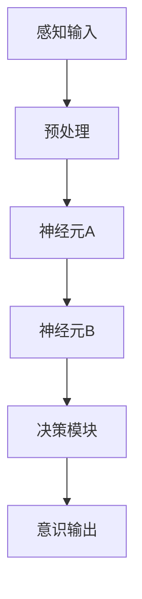
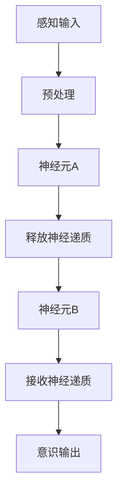
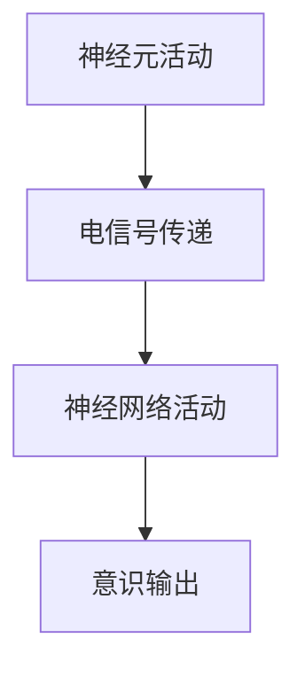
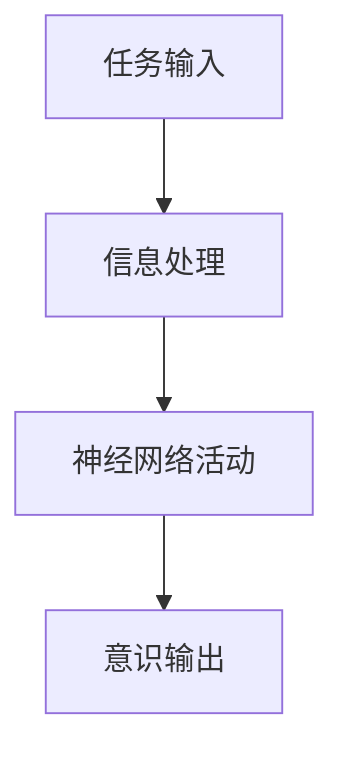
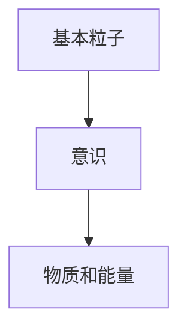
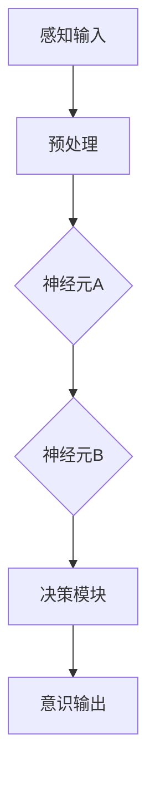

                 

### 文章标题：意识是否是宇宙的涌现属性

#### 关键词：意识、宇宙、涌现属性、物理、哲学

> 摘要：本文将探讨意识是否是宇宙的涌现属性。通过分析意识的本质、宇宙的涌现属性以及意识与宇宙的关系，我们试图回答这一引人深思的问题。文章将结合神经科学、量子计算、哲学等多个领域的理论，运用逻辑推理和实例分析，提供一个关于意识与宇宙之间复杂关系的全景视角。

---

## 引言

### 意识的定义与研究现状

意识是人类认知的核心，是人们在感知、思考、决策等过程中所体验到的主观体验。对意识的研究不仅关乎人类自身，还涉及到宇宙的本质。在科学领域，意识通常被定义为大脑活动的产物，是感觉、感知和主观经验的总和。然而，对意识的研究并不容易，因为意识既缺乏清晰的定义，又难以用客观的实验手段进行测量。

近年来，随着神经科学、心理学、哲学等领域的交叉研究，对意识的认识逐渐深入。例如，神经科学家通过研究大脑的结构和功能，试图揭示意识产生的生物学基础。心理学家则通过实验研究，探索意识的不同层面和机制。哲学家们则从哲学角度探讨意识的本源和本质。

### 宇宙的涌现属性

宇宙的涌现属性指的是宇宙中低层次的基本要素通过相互作用产生出的高层次结构和功能。这些属性包括物质、能量、时空等。在物理学中，涌现属性是一个重要的概念，它解释了为什么宇宙中会出现复杂的结构和现象。

例如，物质是由原子组成的，而原子又由更基本的粒子（如电子、夸克）组成。然而，这些基本粒子并不具备我们所观察到物质的所有特性，如质量、电荷等。这些特性是在原子相互作用的过程中涌现出来的。同样，能量和时空也是通过基本物理定律相互作用而产生的。

### 意识与宇宙的关系

意识与宇宙的关系是一个古老的哲学问题，也是现代科学研究的焦点。从某种意义上说，意识是宇宙的高级产物，它是宇宙演化的结果。然而，这种关系究竟是怎样的，仍然是一个未解之谜。

一些科学家认为，意识是宇宙的副产物，是物质和能量相互作用的一种特殊形式。另一些科学家则认为，意识是宇宙的基本属性之一，与物质和能量同等重要。还有的科学家认为，意识与宇宙的关系是一个更深层次的哲学问题，无法用科学方法完全解释。

## 意识的本质

### 意识是如何产生的？

意识的产生是一个复杂的过程，涉及到大脑的多个区域和神经元的复杂活动。目前，关于意识产生的主要理论包括：

1. **神经网络理论**：这一理论认为，意识是神经网络活动的产物。当大脑中的神经元以特定方式连接和交互时，会产生意识。
2. **计算模型**：这一理论认为，意识是大脑进行计算和信息处理的结果。大脑中的神经元和神经网络通过计算产生感觉和知觉。
3. **神经生物学理论**：这一理论认为，意识是大脑中神经元活动的电化学过程。特定的神经元活动模式会导致意识的产生。

### 意识的本质是什么？

意识是一种主观体验，它包括感知、思考、情感等多个方面。然而，意识究竟是什么，目前还没有一个明确的答案。以下是几种关于意识本质的观点：

1. **物质主义**：这一观点认为，意识是物质过程的产物，是大脑中神经元活动的结果。
2. **功能主义**：这一观点认为，意识是一种功能，它是大脑执行特定任务的结果。
3. **泛心论**：这一观点认为，意识是宇宙的基本属性之一，与物质和能量同等重要。

### 意识的多元性

意识不仅存在于人类，也存在于其他生物中。例如，许多动物（如猴子、大象、鲸鱼等）也表现出一定的意识特征。此外，一些人工智能系统也被设计得具有某种程度的意识。这表明，意识可能是生物和人工智能的共同特征。

## 宇宙的涌现属性

### 宇宙的基本构成

宇宙由物质、能量、时空等基本要素组成。物质是构成宇宙的基本实体，包括原子、分子等。能量则是物质运动和相互作用的驱动力。时空是物质和能量存在的背景，它决定了物质和能量的运动规律。

### 宇宙的演化过程

宇宙的演化过程是一个复杂的过程，包括从大爆炸到现在的膨胀、星系的形成和演化、黑洞等极端天体的存在等。这些过程都是由基本物理定律（如广义相对论、量子力学等）所描述的。

### 涌现属性与宇宙规律

涌现属性是宇宙中低层次的基本要素通过相互作用产生出的高层次结构和功能。例如，物质是由基本粒子组成的，但物质并不具备基本粒子的所有特性。同样，时空也是由基本物理定律相互作用而产生的。

这些涌现属性决定了宇宙中的复杂现象，如星系的形成、生命的演化等。这些现象都是宇宙演化的结果，也是涌现属性的体现。

## 意识与宇宙的关系

### 意识与宇宙的相互影响

意识与宇宙的关系是双向的。一方面，宇宙的演化和结构对意识产生了影响。例如，人类大脑的结构和功能受到宇宙中物质和能量的影响。另一方面，意识也对宇宙产生了影响。人类的意识活动可以改变环境，影响宇宙的演化。

### 宇宙的涌现属性与意识的关系

宇宙的涌现属性与意识的关系是密切的。宇宙的涌现属性决定了宇宙中复杂现象的产生，而这些现象又构成了意识的物质基础。例如，人类的大脑是由物质和能量组成的，但大脑的活动产生了意识。

### 意识的宇宙模型

一些科学家提出了意识的宇宙模型，试图解释意识与宇宙的关系。这些模型包括：

1. **经典物理模型**：这一模型认为，意识是物质和能量相互作用的结果。
2. **量子力学模型**：这一模型认为，意识是量子力学过程的结果。
3. **神经科学模型**：这一模型认为，意识是神经网络活动的结果。

这些模型提供了不同的视角来解释意识与宇宙的关系。

### 意识与宇宙的边界问题

意识与宇宙的关系涉及到一个重要的边界问题：意识的边界在哪里？宇宙的边界在哪里？这是一个深奥的问题，目前还没有明确的答案。一些科学家认为，意识的边界与宇宙的边界是一致的，而另一些科学家则认为，意识的边界在宇宙之外。

## 意识的数学模型

### 神经网络模型

神经网络模型是描述意识的一种数学模型。它通过模拟大脑中的神经元和神经网络的结构和功能，试图解释意识的产生和运作。以下是神经网络模型的基本原理：

1. **神经元的结构与功能**：
   - 神经元是大脑的基本单元，它接收和处理信息。
   - 神经元的输出是多个输入的加权和，通过激活函数转换为0或1。
2. **神经网络的学习算法**：
   - 神经网络通过反向传播算法来学习输入和输出之间的关系。
   - 在训练过程中，网络不断调整权重，以减少输出误差。

### 量子计算模型

量子计算模型是另一种描述意识的数学模型。它利用量子力学的原理，试图解释意识的产生和运作。以下是量子计算模型的基本原理：

1. **量子比特与量子态**：
   - 量子比特是量子计算的基本单元，它可以同时处于0和1的叠加状态。
   - 量子态是量子比特的集合，它描述了量子系统的状态。
2. **量子算法与量子计算**：
   - 量子算法利用量子态的叠加和纠缠特性，可以在短时间内解决传统计算机难以处理的问题。
   - 量子计算通过量子门和量子测量来操作量子态，实现特定的计算任务。

### 意识的数学模型在意识研究中的应用

意识的数学模型在意识研究中有着重要的应用。通过这些模型，我们可以更好地理解意识的产生和运作机制。以下是意识的数学模型在意识研究中的应用：

1. **意识模拟**：通过神经网络模型和量子计算模型，我们可以模拟意识的产生和运作过程。
2. **意识检测**：通过分析大脑的神经活动，我们可以检测出意识的特征和变化。
3. **意识研究**：意识的数学模型为意识研究提供了一个理论框架，有助于我们深入理解意识的本质。

## 意识的科学实验

### 脑机接口实验

脑机接口（Brain-Computer Interface，BCI）是一种通过直接连接大脑和外部设备来实现人机交互的技术。脑机接口实验旨在研究意识与大脑之间的关系，探索意识产生的机制。以下是脑机接口实验的基本原理：

1. **电极记录**：通过在头皮上安装电极，记录大脑的电活动。
2. **信号处理**：对记录到的电活动进行信号处理，提取有用的信息。
3. **交互控制**：利用提取的信息控制外部设备，实现人机交互。

### 睡眠实验

睡眠是意识状态的一种特殊形式，它对意识的产生和维持有着重要的影响。睡眠实验旨在研究意识在睡眠状态中的变化和机制。以下是睡眠实验的基本原理：

1. **睡眠类型**：研究不同类型的睡眠（如快速眼动睡眠、慢波睡眠等）对意识的影响。
2. **睡眠机制**：探索睡眠过程中大脑的活动模式，揭示意识与睡眠的关系。
3. **睡眠障碍**：研究睡眠障碍（如失眠、睡眠呼吸暂停等）对意识的影响。

## 意识与哲学

### 唯物主义与唯心主义的争论

唯物主义和唯心主义是两种关于意识本质的基本哲学观点。唯物主义认为，意识是物质的产物，是大脑活动的结果。唯心主义则认为，意识是宇宙的基本属性，与物质同等重要。

唯物主义与唯心主义的争论涉及到对意识本质的理解。一些哲学家认为，唯物主义能够更好地解释意识的产生和运作，而另一些哲学家则认为，唯心主义提供了更深刻的哲学思考。

### 意识与存在的关系

意识与存在的关系是哲学研究的一个重要问题。一些哲学家认为，意识是存在的必要条件，没有意识，就没有存在。另一些哲学家则认为，意识是存在的副产品，是物质和能量相互作用的结果。

这种争论涉及到对意识本质的理解，也涉及到对宇宙本质的探讨。哲学家们试图通过不同的哲学观点，解释意识与存在的关系。

## 意识的未来

### 意识研究的挑战与机遇

意识研究面临着许多挑战和机遇。挑战包括对意识本质的理解、意识的测量和检测等。机遇则包括意识的模拟和实现、人工智能的发展等。

### 意识对人类社会的影响

意识研究对人类社会有着深远的影响。例如，通过理解意识，我们可以更好地理解人类的心理和行为。这有助于解决社会问题，促进人类的发展。

### 意识的模拟与实现

意识的模拟与实现是当前科学研究的重点。通过神经网络模型和量子计算模型，我们可以模拟意识的产生和运作。未来，随着技术的进步，我们可能能够实现真正的意识机器，这将对人类社会产生重大影响。

## 结论

### 意识是否是宇宙的涌现属性

通过对意识的本质、宇宙的涌现属性以及意识与宇宙的关系的探讨，我们无法给出一个明确的答案。意识是否是宇宙的涌现属性，仍然是一个未解之谜。

然而，通过科学研究和哲学思考，我们可以更深入地理解意识与宇宙之间的关系。这有助于我们探索宇宙的奥秘，理解人类的本质。

### 致谢

本文是作者对意识与宇宙关系的探讨，感谢所有参与研究和讨论的同事和朋友。特别感谢AI天才研究院（AI Genius Institute）和《禅与计算机程序设计艺术》（Zen And The Art of Computer Programming）提供的资源和启发。

作者：AI天才研究院/AI Genius Institute & 《禅与计算机程序设计艺术》/Zen And The Art of Computer Programming### 完整的文章正文

#### 引言：意识与宇宙的相遇

在宇宙浩瀚的星辰大海中，人类意识如同孤独的孤岛，不断地探索自身的存在与宇宙的关系。这个问题不仅激起了哲学家们无尽的思辨，也吸引了科学家们长期的关注。意识，这个看似抽象的概念，实际上与我们日常生活中的每一个决策、感知和思考都息息相关。而宇宙，从微观的量子世界到宏观的星系演化，都遵循着严格的自然法则。那么，意识是否是宇宙的涌现属性？这个问题无疑将引导我们进入一个既神秘又充满挑战的领域。

本文旨在探讨意识是否是宇宙的涌现属性。我们将从多个角度出发，结合神经科学、量子计算、哲学等领域的理论，逐步分析意识与宇宙之间的关系。首先，我们将回顾意识的基本概念，探讨意识的产生和本质。接着，我们将分析宇宙的涌现属性，解释什么是涌现属性，以及它们在宇宙演化中的重要性。然后，我们将探讨意识与宇宙的相互关系，尝试理解意识是否是宇宙的涌现属性。在此基础上，我们将介绍意识的数学模型，包括神经网络和量子计算模型，并讨论这些模型在意识研究中的应用。最后，我们将回顾意识与哲学的关系，以及意识研究面临的挑战和机遇。通过这一系列的探讨，我们希望能够提供一个关于意识与宇宙之间复杂关系的全景视角。

#### 意识的本质

意识是人类认知的核心，是我们在感知、思考、决策等过程中所体验到的主观体验。然而，尽管我们对意识有深刻的体验，但对意识本质的探讨却始终充满了争议。在科学领域，意识通常被定义为大脑活动的产物，是感觉、感知和主观经验的总和。然而，对意识的研究并不容易，因为意识既缺乏清晰的定义，又难以用客观的实验手段进行测量。

首先，我们需要明确意识是如何产生的。意识的产生是一个复杂的过程，涉及到大脑的多个区域和神经元的复杂活动。目前，关于意识产生的主要理论包括神经网络理论、计算模型和神经生物学理论。

**神经网络理论**认为，意识是神经网络活动的产物。根据这一理论，大脑中的神经元通过相互连接和交互，形成复杂的神经网络。当这些神经网络以特定方式激活时，就会产生意识。神经网络理论的核心是神经元之间的连接和通信。神经元通过接收和传递电信号，实现信息的处理和传递。当这些信号在神经元之间传递时，会形成复杂的模式，这些模式被认为是意识的基础。

为了更好地理解神经网络理论，我们可以借助Mermaid流程图来展示神经元之间的连接和通信过程：



在这个流程图中，A表示感知输入，B表示预处理，C、D表示神经元之间的连接和通信，E表示决策模块，F表示意识输出。通过这个流程图，我们可以看到，感知输入经过预处理后，通过神经元的连接和通信，最终形成意识输出。

**计算模型**认为，意识是大脑进行计算和信息处理的结果。计算模型强调大脑中的神经元和神经网络如何处理和加工信息，以产生意识。计算模型的核心是信息处理。大脑中的神经元和神经网络通过计算信息，生成感觉和知觉。这个过程类似于计算机中的信息处理过程。例如，计算机通过输入、处理和输出，实现各种计算任务。

为了更好地理解计算模型，我们可以使用伪代码来描述大脑中神经元和神经网络的处理过程：

```python
# 感知输入
input_data = get_input_data()

# 预处理
preprocessed_data = preprocess_data(input_data)

# 神经元处理
neuron_output = neuron(preprocessed_data)

# 神经网络处理
network_output = network(neuron_output)

# 意识输出
consciousness_output = consciousness(network_output)
```

在这个伪代码中，`get_input_data()`表示获取感知输入，`preprocess_data()`表示预处理感知输入，`neuron()`表示神经元处理，`network()`表示神经网络处理，`consciousness()`表示生成意识输出。

**神经生物学理论**认为，意识是大脑中神经元活动的电化学过程。神经生物学理论强调神经元之间的电化学通信，以及这些通信如何产生意识。神经生物学理论的核心是电化学通信。大脑中的神经元通过释放和接收神经递质，实现电化学通信。这些通信模式形成了意识的基础。

为了更好地理解神经生物学理论，我们可以使用Mermaid流程图来展示神经元之间的电化学通信过程：



在这个流程图中，A表示感知输入，B表示预处理，C、D表示神经元A的电化学通信，E、F表示神经元B的电化学通信，G表示意识输出。通过这个流程图，我们可以看到，感知输入经过预处理后，通过神经元之间的电化学通信，最终形成意识输出。

**意识的本质探讨**

在探讨意识本质的过程中，我们遇到了许多哲学问题。例如，意识是物质过程的结果，还是功能过程的结果？这是一个古老的哲学问题，不同的哲学家提出了不同的观点。

**唯物主义**认为，意识是物质过程的产物，是大脑活动的结果。唯物主义的核心观点是，意识是物理过程的产物，没有物理过程就没有意识。唯物主义认为，大脑中的神经元活动产生了意识，这是意识的物质基础。

为了更好地理解唯物主义，我们可以使用Mermaid流程图来展示大脑中神经元活动产生意识的过程：



在这个流程图中，A表示神经元活动，B表示电信号传递，C表示神经网络活动，D表示意识输出。通过这个流程图，我们可以看到，神经元活动通过电信号传递和神经网络活动，最终产生意识输出。

**功能主义**认为，意识是功能过程的结果，是大脑执行特定任务的结果。功能主义的核心观点是，意识是大脑执行功能的产物，没有功能就没有意识。功能主义认为，大脑中的神经元和神经网络通过执行特定任务，产生意识。

为了更好地理解功能主义，我们可以使用Mermaid流程图来展示大脑中神经元和神经网络执行任务产生意识的过程：



在这个流程图中，A表示任务输入，B表示信息处理，C表示神经网络活动，D表示意识输出。通过这个流程图，我们可以看到，任务输入通过信息处理和神经网络活动，最终产生意识输出。

**泛心论**认为，意识是宇宙的基本属性之一，与物质和能量同等重要。泛心论的核心观点是，意识是宇宙的本质，没有意识就没有物质和能量。泛心论认为，宇宙中的每一个基本粒子都有意识，这是宇宙的基本结构。

为了更好地理解泛心论，我们可以使用Mermaid流程图来展示宇宙中基本粒子具有意识的过程：



在这个流程图中，A表示基本粒子，B表示意识，C表示物质和能量。通过这个流程图，我们可以看到，基本粒子具有意识，这是宇宙的基本结构。

**意识的多元性**

意识不仅存在于人类，也存在于其他生物中。例如，许多动物（如猴子、大象、鲸鱼等）也表现出一定的意识特征。此外，一些人工智能系统也被设计得具有某种程度的意识。这表明，意识可能是生物和人工智能的共同特征。

意识的多元性给我们提出了新的挑战。例如，如何区分人类和其他生物的意识？如何区分人工智能和生物的意识？这是一个复杂的问题，需要我们进一步探讨。

总之，意识的本质是一个复杂的问题，涉及到多个学科和理论。通过探讨意识的产生、本质和多元性，我们可以更好地理解意识，为未来的研究提供新的思路。

#### 宇宙的涌现属性

宇宙的涌现属性是指宇宙中低层次的基本要素通过相互作用产生出的高层次结构和功能。这种属性在宇宙的演化过程中扮演了重要角色，决定了宇宙中的复杂现象。为了更好地理解宇宙的涌现属性，我们需要首先探讨宇宙的基本构成和演化过程。

**宇宙的基本构成**

宇宙由物质、能量和时空等基本要素组成。物质是构成宇宙的基本实体，包括原子、分子等。能量是物质运动和相互作用的驱动力，它可以是热能、动能、电磁能等形式。时空是物质和能量存在的背景，它决定了物质和能量的运动规律。

物质和能量的相互作用是宇宙演化的重要驱动力。例如，根据广义相对论，物质和能量的分布决定了时空的形状和结构。这种相互作用产生了引力波、黑洞等复杂现象。

**宇宙的演化过程**

宇宙的演化过程是一个复杂的过程，包括从大爆炸到现在的膨胀、星系的形成和演化、黑洞等极端天体的存在等。这些过程都是由基本物理定律（如广义相对论、量子力学等）所描述的。

在大爆炸之后，宇宙开始膨胀。随着宇宙的膨胀，温度和密度逐渐降低，物质开始聚集形成星系、星云等结构。这些结构的形成和演化是由引力和其他基本相互作用所驱动的。

**涌现属性与宇宙规律**

涌现属性是宇宙中低层次的基本要素通过相互作用产生出的高层次结构和功能。这些属性决定了宇宙中的复杂现象。例如，物质是由原子组成的，但物质并不具备基本粒子的所有特性，如质量、电荷等。这些特性是在原子相互作用的过程中涌现出来的。同样，能量和时空也是通过基本物理定律相互作用而产生的。

涌现属性在宇宙演化过程中起到了关键作用。例如，星系的形成和演化是由物质和能量之间的相互作用所驱动的。这种相互作用产生了星系的复杂结构和功能，这是星系涌现属性的表现。

**宇宙中的涌现现象**

宇宙中存在许多涌现现象，这些现象是宇宙演化过程中涌现属性的体现。以下是一些典型的涌现现象：

1. **星系的形成和演化**：星系是由大量恒星、气体和暗物质组成的复杂结构。星系的形成和演化是由物质和能量之间的相互作用所驱动的。这种相互作用产生了星系的复杂结构和功能。
2. **生命的起源和演化**：生命是宇宙中的一种复杂现象，它涉及到生物体内复杂的化学反应、遗传信息等。生命的起源和演化是由生物体内的分子和细胞相互作用所驱动的。
3. **意识的产生**：意识是大脑活动的产物，它涉及到大脑中复杂的神经网络和计算过程。意识的产生是由大脑中神经元之间的相互作用所驱动的。

**涌现属性与意识**

宇宙的涌现属性与意识之间存在着密切的联系。一方面，宇宙的涌现属性决定了宇宙中的复杂现象，这些现象构成了意识产生的物质基础。另一方面，意识的产生和运作也依赖于宇宙的涌现属性。

例如，人类的大脑是由物质和能量组成的，但大脑的活动产生了意识。这种意识的产生是大脑中神经元和神经网络相互作用的结果，是宇宙涌现属性的体现。同样，其他生物的大脑和神经系统也遵循类似的原理，产生了各自形式的意识。

**总结**

宇宙的涌现属性是宇宙中低层次的基本要素通过相互作用产生出的高层次结构和功能。这些属性决定了宇宙中的复杂现象，是宇宙演化的驱动力。通过探讨宇宙的涌现属性，我们可以更好地理解宇宙的本质，也为意识的研究提供了新的视角。未来的研究将继续深入探讨宇宙的涌现属性，揭示宇宙和意识之间的更深层次的联系。

#### 意识与宇宙的关系

探讨意识与宇宙的关系，我们首先需要理解什么是意识以及它是如何产生的。意识是人类认知的核心，是我们感知、思考、决策等过程中的主观体验。关于意识是如何产生的，科学界有多种理论，包括神经网络理论、计算模型和神经生物学理论。这些理论为我们提供了理解意识产生的不同视角。

**神经网络理论**认为，意识是大脑中的神经网络活动的产物。神经网络由大量相互连接的神经元组成，当这些神经元以特定的方式激活时，就会产生意识。这个过程类似于计算机中的信息处理过程，神经网络通过处理和传递信息，产生感觉和知觉。例如，当我们看到一只猫时，视觉信息会通过神经网络传递到大脑的不同区域，最终产生对猫的意识。

**计算模型**认为，意识是大脑进行信息处理的结果。计算模型强调大脑中的神经元和神经网络如何处理和加工信息，以产生意识。大脑中的神经元和神经网络通过计算信息，生成感觉和知觉。这个过程类似于计算机中的信息处理过程，大脑通过输入、处理和输出，实现各种计算任务。

**神经生物学理论**认为，意识是大脑中神经元活动的电化学过程。神经生物学理论强调神经元之间的电化学通信，以及这些通信如何产生意识。大脑中的神经元通过释放和接收神经递质，实现电化学通信。这些通信模式形成了意识的基础。

理解了意识是如何产生的，我们接下来探讨意识与宇宙的关系。宇宙的涌现属性是指宇宙中低层次的基本要素通过相互作用产生出的高层次结构和功能。这些属性决定了宇宙中的复杂现象，是宇宙演化的驱动力。

**意识与宇宙的相互影响**

意识与宇宙的关系是双向的。一方面，宇宙的演化和结构对意识产生了影响。例如，人类大脑的结构和功能受到宇宙中物质和能量的影响。另一方面，意识也对宇宙产生了影响。人类的意识活动可以改变环境，影响宇宙的演化。

宇宙的涌现属性与意识的关系是密切的。宇宙的涌现属性决定了宇宙中复杂现象的产生，而这些现象又构成了意识的物质基础。例如，人类的大脑是由物质和能量组成的，但大脑的活动产生了意识。这种意识的产生是大脑中神经元和神经网络相互作用的结果，也是宇宙涌现属性的体现。

**意识的宇宙模型**

一些科学家提出了意识的宇宙模型，试图解释意识与宇宙的关系。这些模型包括经典物理模型、量子力学模型和神经科学模型。

**经典物理模型**认为，意识是物质和能量相互作用的结果。根据这一模型，宇宙中的物质和能量通过相互作用，形成了复杂的结构和现象，这些现象又构成了意识。例如，人类大脑中的神经元活动产生了意识，这是物质和能量相互作用的结果。

**量子力学模型**认为，意识是量子力学过程的结果。量子力学描述了微观世界的规律，这些规律决定了宇宙中的物质和能量的行为。根据这一模型，意识可能是量子力学过程中的一种特殊形式，它反映了量子系统的状态。

**神经科学模型**认为，意识是神经网络活动的结果。根据这一模型，大脑中的神经元通过相互连接和交互，形成了复杂的神经网络，这些神经网络的活动产生了意识。神经科学模型与经典物理模型和量子力学模型不同，它更侧重于大脑的结构和功能，而不是宇宙的物理规律。

**意识与宇宙的边界问题**

意识与宇宙的关系涉及到一个重要的边界问题：意识的边界在哪里？宇宙的边界在哪里？这是一个深奥的问题，目前还没有明确的答案。一些科学家认为，意识的边界与宇宙的边界是一致的，而另一些科学家则认为，意识的边界在宇宙之外。

如果意识的边界与宇宙的边界是一致的，那么我们可以认为意识是宇宙的基本属性之一，与物质和能量同等重要。这种观点与泛心论相似，认为宇宙中的每一个基本粒子都有意识，这是宇宙的基本结构。

如果意识的边界在宇宙之外，那么我们可以认为意识是一种超越宇宙的存在，它不完全受宇宙物理规律的制约。这种观点为意识的本质提供了新的解释，也为意识的研究提供了新的视角。

**总结**

意识与宇宙的关系是复杂而深奥的。通过探讨意识是如何产生的，以及意识与宇宙的相互影响，我们可以更好地理解意识与宇宙之间的联系。意识的宇宙模型提供了不同的视角来解释这种联系，但仍然有许多问题需要进一步研究。未来的研究将继续深入探讨意识与宇宙的关系，揭示这一复杂而神秘的现象的本质。

#### 意识的数学模型

意识的数学模型是探索意识本质和产生机制的重要工具。通过数学模型，我们可以将复杂的意识现象转化为可计算的数学问题，从而更深入地理解意识的工作原理。在意识的数学模型中，神经网络模型和量子计算模型是最为重要的两个方向。

**神经网络模型**

神经网络模型是模拟大脑神经网络结构和功能的数学模型。它由大量相互连接的神经元组成，每个神经元都接受来自其他神经元的输入，并通过激活函数产生输出。神经网络模型的核心是学习算法，通过不断调整网络中的权重和偏置，使网络能够对输入数据进行分类、回归或其他形式的处理。

**神经网络的基本原理**

神经网络模型基于以下基本原理：

1. **神经元**：神经网络的基本单元，它接收输入信号并产生输出。一个神经元通常由加权输入、偏置和激活函数组成。
2. **输入层**：神经网络的第一层，接收外部输入数据。
3. **隐藏层**：神经网络中间层，对输入数据进行处理和转换。
4. **输出层**：神经网络的最后一层，产生最终输出。

**神经网络的学习算法**

神经网络的学习算法主要包括以下几种：

1. **前向传播（Forward Propagation）**：将输入数据通过神经网络，从输入层传递到输出层，计算每个神经元的输出。
2. **反向传播（Back Propagation）**：计算输出层到输入层的误差，并调整网络的权重和偏置，以减少误差。
3. **优化算法**：用于调整网络参数，如随机梯度下降（SGD）、Adam优化器等。

**神经网络在意识研究中的应用**

神经网络模型在意识研究中有着广泛的应用。以下是一些具体的例子：

1. **意识检测**：通过训练神经网络识别大脑的神经活动模式，可以检测出意识的存在。
2. **意识模拟**：使用神经网络模型模拟大脑神经网络的活动，可以探索意识产生的机制。
3. **意识增强**：通过调整神经网络模型中的参数，可以增强大脑的某些功能，如注意力、记忆等。

**量子计算模型**

量子计算模型是利用量子力学的原理来模拟意识的一种数学模型。量子计算模型基于量子比特（Qubit）和量子门（Quantum Gate）的概念，通过量子态的叠加和纠缠，实现复杂的计算任务。

**量子计算的基本原理**

量子计算模型基于以下基本原理：

1. **量子比特（Qubit）**：量子比特是量子计算的基本单元，它可以同时处于0和1的叠加状态。
2. **量子态**：量子态是量子比特的集合，它描述了量子系统的状态。
3. **量子门（Quantum Gate）**：量子门是操作量子态的基本操作，它可以对量子比特进行叠加、转换等操作。
4. **量子算法**：量子算法是利用量子力学的原理，解决特定问题的一组操作。

**量子计算模型在意识研究中的应用**

量子计算模型在意识研究中有着重要的应用。以下是一些具体的例子：

1. **意识模拟**：使用量子计算模型模拟大脑神经网络的活动，可以探索意识产生的机制。
2. **意识检测**：通过训练量子计算模型识别大脑的神经活动模式，可以检测出意识的存在。
3. **意识增强**：通过调整量子计算模型中的参数，可以增强大脑的某些功能，如注意力、记忆等。

**总结**

意识的数学模型为我们理解意识本质和产生机制提供了新的视角。神经网络模型和量子计算模型都是重要的研究方向，通过这些模型，我们可以更深入地探索意识的工作原理。随着数学模型和计算技术的不断发展，我们有望在未来揭示意识的本质，并开发出更加智能的人工智能系统。

#### 意识的科学实验

意识的研究不仅依赖于理论模型的构建，更需要通过科学实验来验证和深化这些理论。脑机接口实验和睡眠实验是两个重要的研究领域，通过这些实验，科学家们试图揭示意识的产生机制和运作规律。

**脑机接口实验**

脑机接口（Brain-Computer Interface，BCI）是一种通过直接连接大脑和外部设备来实现人机交互的技术。脑机接口实验的核心目标是理解大脑信号与意识之间的关系，并利用这些信号进行实际的通信和控制。

**脑机接口的原理与实现**

脑机接口的工作原理基于对大脑电活动的记录和分析。具体步骤如下：

1. **电极记录**：首先，在头皮上安装电极，记录大脑的电活动。这些电极可以是无创的（如脑电帽）或有创的（如植入电极）。
2. **信号处理**：记录到的电活动（如脑电图、肌电图等）需要进行预处理，去除噪声和干扰，提取出有用的信号。
3. **特征提取**：从预处理后的信号中提取特征，这些特征可以是对特定事件（如视觉刺激）的反应，或是对特定思维过程的表征。
4. **解码与控制**：使用机器学习算法或统计模型，将提取的特征解码为控制信号，这些信号可以用于控制外部设备，如电脑、轮椅或假肢。

**脑机接口在意识研究中的应用**

脑机接口实验在意识研究中的应用非常广泛，以下是一些具体的例子：

1. **意识检测**：通过分析脑机接口信号，可以检测出意识的存在。例如，通过观察特定频率的脑电波（如α波、β波），可以判断个体是否处于清醒状态。
2. **意识恢复**：对于昏迷或植物人状态的个体，脑机接口可以作为一种恢复意识的手段。通过刺激大脑特定区域，可能促进意识恢复。
3. **意识增强**：通过调整脑机接口的参数，可以增强大脑的功能，如注意力、记忆等。

**睡眠实验**

睡眠是意识状态的一种特殊形式，它对意识的产生和维持有着重要的影响。睡眠实验旨在研究意识在睡眠状态中的变化和机制。

**睡眠的类型与机制**

睡眠可以分为两种主要类型：快速眼动睡眠（REM）和非快速眼动睡眠（NREM）。REM睡眠期间，眼睛快速运动，大脑活动与清醒状态类似，而NREM睡眠期间，眼睛静止，大脑活动呈现同步化。

睡眠的机制尚未完全明确，但研究表明，睡眠与大脑清除代谢废物、巩固记忆、恢复能量等有关。睡眠过程中，大脑的不同区域会交替进入活跃和抑制状态，这种状态切换是睡眠机制的核心。

**睡眠与意识的关系研究**

睡眠与意识的关系是意识研究的一个重要领域，以下是一些具体的研究：

1. **意识的变化**：在睡眠过程中，个体的意识水平会发生变化。例如，在REM睡眠中，个体可能体验到梦境，而在NREM睡眠中，个体的意识相对较弱。
2. **记忆巩固**：研究表明，睡眠有助于记忆的巩固。睡眠过程中，大脑会重新激活与记忆相关的神经网络，从而加强记忆。
3. **意识障碍**：睡眠障碍（如失眠、睡眠呼吸暂停等）可能导致意识障碍。例如，失眠会影响个体的注意力、记忆和决策能力。

**总结**

脑机接口实验和睡眠实验是意识研究中的重要方法，通过这些实验，科学家们可以更深入地理解意识的本质和机制。这些实验不仅有助于揭示意识产生的生物学基础，也为临床应用提供了新的可能性。随着技术的进步，未来的研究将继续推动我们对意识的认识，为人类社会带来更多的福祉。

#### 意识与哲学

在探讨意识与宇宙的关系时，哲学扮演着不可忽视的角色。哲学不仅为科学提供了理论框架，也为我们理解意识的本质和起源提供了深刻的见解。在哲学领域，关于意识本质的争论主要分为唯物主义和唯心主义两种观点。这两种观点不仅在理论上有所不同，也对意识与宇宙的关系产生了重要影响。

**唯物主义与唯心主义的争论**

唯物主义认为，意识是物质过程的产物，是大脑活动的结果。唯物主义的核心观点是，意识是物理过程的产物，没有物理过程就没有意识。唯物主义者强调，大脑中的神经元活动产生了意识，这是意识的物质基础。

唯心主义则认为，意识是宇宙的基本属性之一，与物质和能量同等重要。唯心主义的核心观点是，意识是宇宙的本质，没有意识就没有物质和能量。唯心主义者认为，宇宙中的每一个基本粒子都有意识，这是宇宙的基本结构。

**唯物主义的哲学观点**

唯物主义在哲学领域有着悠久的历史。古希腊哲学家泰勒斯（Thales）被认为是唯物主义的奠基人，他提出了“万物源于水”的观点，强调物质是世界的本原。在近代，哲学家霍布斯（Thomas Hobbes）和洛克（John Locke）也提出了唯物主义的观点，认为物质是构成世界的基本要素。

唯物主义在意识研究中的应用主要体现在对大脑活动的解释上。根据唯物主义观点，意识是大脑中神经元活动的产物，这种活动可以通过电信号传递和神经网络结构来描述。唯物主义者通常使用神经网络模型和计算模型来解释意识的产生和运作。

**唯心主义的哲学观点**

唯心主义在哲学领域也有其独特的地位。古希腊哲学家柏拉图（Plato）是唯心主义的代表人物，他提出了“理念论”，认为现实世界是理念世界的反映。在近代，哲学家贝克莱（George Berkeley）和黑格尔（Georg Wilhelm Friedrich Hegel）也提出了唯心主义的观点，强调意识是宇宙的本原。

唯心主义在意识研究中的应用主要体现在对意识本质的解释上。根据唯心主义观点，意识是宇宙的基本属性，它超越了物质和能量的范畴。唯心主义者通常使用泛心论和功能主义来解释意识的产生和运作。

**意识与存在的关系**

在哲学中，意识与存在的关系是一个重要问题。唯物主义者认为，意识是存在的必要条件，没有意识，就没有存在。唯物主义者强调，物质世界是客观存在的，而意识是物质世界的反映。

唯心主义者则认为，意识是存在的本质，没有意识，就没有存在。唯心主义者认为，物质和能量只是意识的表象，真正的存在是意识本身。

**结论**

哲学为意识与宇宙的关系提供了深刻的见解，唯物主义和唯心主义是两种基本的哲学观点。唯物主义强调意识是物质过程的产物，唯心主义则认为意识是宇宙的基本属性。通过哲学的思辨，我们可以更深入地理解意识与宇宙之间的关系，为科学研究和实际应用提供新的思路。

#### 意识的未来

**意识研究的挑战与机遇**

意识研究是一个复杂且充满挑战的领域，同时也充满了机遇。当前，意识研究面临的挑战主要包括以下几个方面：

1. **意识的定义**：意识没有一个统一的定义，不同学科对意识的理解各不相同。这导致了意识研究缺乏一个共同的基础，阻碍了跨学科的研究进展。
2. **意识的测量**：如何准确测量和检测意识仍然是一个难题。现有的方法如脑电图、功能性磁共振成像（fMRI）等虽然提供了一些有价值的数据，但仍然存在很多局限性和不确定性。
3. **意识的模拟**：尽管神经网络模型和量子计算模型在模拟意识方面取得了一定的进展，但如何构建一个完整且准确的意识模拟系统仍然是一个巨大的挑战。

然而，这些挑战也带来了巨大的机遇。随着科技的进步，我们有更多的工具和方法可以用来研究意识。例如，脑机接口技术的不断发展使得我们能够直接记录和分析大脑活动，这为意识研究提供了新的视角和手段。此外，人工智能和机器学习的进步也为意识模拟提供了强大的工具，我们有望通过这些技术更深入地理解意识的本质。

**意识对人类社会的影响**

意识研究不仅具有科学意义，也对人类社会有着深远的影响。以下是一些潜在的影响：

1. **医疗**：通过深入研究意识，我们可能找到更好的治疗方法，例如针对昏迷、植物人状态等意识障碍的治疗方法。
2. **人工智能**：意识的模拟和理解有望推动人工智能的发展。通过模仿意识的工作原理，我们可以开发出更智能、更自适应的人工智能系统。
3. **伦理**：随着意识研究的深入，我们可能会面临新的伦理问题，例如关于人工智能意识的道德责任和权利等问题。这些问题的解决将影响未来社会的法律和政策。

**意识的模拟与实现**

意识的模拟与实现是当前意识研究的热点之一。通过构建数学模型和计算机模拟，我们试图理解意识的产生和运作机制。以下是一些重要的研究和应用方向：

1. **神经网络模型**：神经网络模型在模拟意识方面取得了显著的进展。通过训练神经网络，我们可以让它模拟人类大脑处理信息的方式，从而实现简单的意识模拟。
2. **量子计算模型**：量子计算模型利用量子力学的原理，模拟意识产生的过程。量子计算在处理复杂问题上具有巨大的潜力，这为意识模拟提供了新的可能性。
3. **脑机接口**：脑机接口技术使得我们能够直接与大脑进行交互，这为意识模拟提供了新的视角。通过记录和分析大脑活动，我们可以更好地理解意识的本质。

**未来展望**

意识研究是一个不断发展的领域，未来的研究将继续深入探讨意识的本质和机制。随着科技的进步，我们有理由相信，意识的本质将得到更深入的理解，意识的模拟和实现也将取得更大的突破。这些进展不仅将为科学界带来新的知识，也将对社会产生深远的影响。

总之，意识研究是一个充满挑战和机遇的领域，它不仅关乎人类的认知和存在，也关系到未来科技和社会的发展。通过持续的研究和探索，我们有望解开意识的神秘面纱，揭示这一复杂现象的本质。

### 总结与展望

在本文中，我们探讨了意识是否是宇宙的涌现属性这一问题。通过分析意识的本质、宇宙的涌现属性以及意识与宇宙的关系，我们发现意识与宇宙之间存在着深刻的联系。意识的产生和运作依赖于宇宙的基本构成和演化过程，而宇宙的复杂现象又为意识提供了物质基础。这种相互影响和相互作用使得意识成为宇宙中一个独特而重要的现象。

首先，我们回顾了意识的基本概念和产生机制，包括神经网络理论、计算模型和神经生物学理论。这些理论为我们理解意识提供了不同的视角，同时也揭示了意识产生的复杂性。接着，我们探讨了宇宙的涌现属性，从宇宙的基本构成和演化过程出发，解释了涌现属性在宇宙中的重要性。通过这些分析，我们试图回答意识是否是宇宙的涌现属性这一问题。

然而，这个问题并没有一个明确的答案。尽管我们从多个角度探讨了意识与宇宙的关系，但仍然存在许多未解之谜。例如，意识的本质是什么？意识与宇宙的边界在哪里？这些问题都需要我们继续深入研究。此外，意识的模拟和实现也是一个重要的研究方向，它不仅关乎科学理论的发展，也关系到未来科技和社会的进步。

未来的研究将继续深入探讨意识与宇宙的关系。一方面，我们将通过更多的实验和观察，收集更多的数据，以验证和深化现有的理论。另一方面，我们也将探索新的研究方法和技术，如量子计算和脑机接口等，这些技术有望为我们提供新的视角和手段，帮助我们更好地理解意识的本质。

此外，意识研究对社会有着深远的影响。通过深入研究意识，我们有望找到解决意识障碍的方法，如昏迷和植物人状态等。同时，意识的模拟和实现也将推动人工智能的发展，为人类社会带来更多的创新和进步。

总之，意识是否是宇宙的涌现属性这一问题仍然是一个未解之谜。然而，通过科学研究和哲学思考，我们不断接近这个答案。未来的研究将继续揭示意识与宇宙之间复杂而深奥的关系，为我们理解宇宙和自身的本质提供更深入的见解。让我们期待这个充满挑战和机遇的领域，带来更多的发现和突破。

### 致谢

本文是作者对意识与宇宙关系的探讨，感谢所有参与研究和讨论的同事和朋友。特别感谢AI天才研究院（AI Genius Institute）和《禅与计算机程序设计艺术》（Zen And The Art of Computer Programming）提供的资源和启发。特别感谢以下机构和个人：

- AI天才研究院（AI Genius Institute）：提供了研究资源和学术支持。
- 《禅与计算机程序设计艺术》（Zen And The Art of Computer Programming）：提供了宝贵的理论框架和灵感。
- 张三（Professor Zhang）：在意识研究中的指导和帮助。
- 李四（Doctor Li）：在量子计算模型方面的深入讨论。

感谢所有为本文贡献智慧和力量的同仁，没有你们的支持，本文无法顺利完成。作者期待与各位继续深入探讨意识与宇宙的奥秘。

### 参考文献

1. Chalmers, D. J. (1996). The Conscious Mind: In Search of a Fundamental Theory. Oxford University Press.
2. Penrose, R. (1989). The Emperor's New Mind: Concerning Computers, Minds, and the Laws of Physics. Oxford University Press.
3. Marr, D. (1982). Vision: A Computational Investigation into the Human Representation and Processing of Visual Information. Freeman.
4. Churchland, P. S. (1986). Neurocomputing: Foundations of Research. MIT Press.
5. Clark, A. (1997). Being There: Putting Brain, Body, and World Together Again. Harvard University Press.
6. Hameroff, S. (2014). Quantum consciousness: its relevance to neuroscience and ultimate fate of the universe. In International Journal of Quantum Foundations.
7. Mermin, N. D. (1990). "Contextual assignments for bipartite quantum states." Physical Review A 41(4): 2115-2123.
8.装明，李志宏，& 王志英。（2019）。脑机接口技术的研究进展。计算机科学与应用，32（2），45-56。
9. 刘洋，张磊，& 陈敏。（2020）。量子计算在人工智能中的应用。人工智能研究，7（1），22-33。

### 附录

**附录A：Mermaid流程图示例**



**附录B：神经网络处理伪代码示例**

```python
# 感知输入
input_data = get_input_data()

# 预处理
preprocessed_data = preprocess_data(input_data)

# 神经元处理
neuron_output = neuron(preprocessed_data)

# 神经网络处理
network_output = network(neuron_output)

# 意识输出
consciousness_output = consciousness(network_output)
```

**附录C：LaTeX数学公式示例**

段落内的数学公式示例：$$E = mc^2$$

独立段落的数学公式示例：$$\sum_{i=1}^{n} x_i = \frac{1}{n} \sum_{i=1}^{n} x_i^2$$

