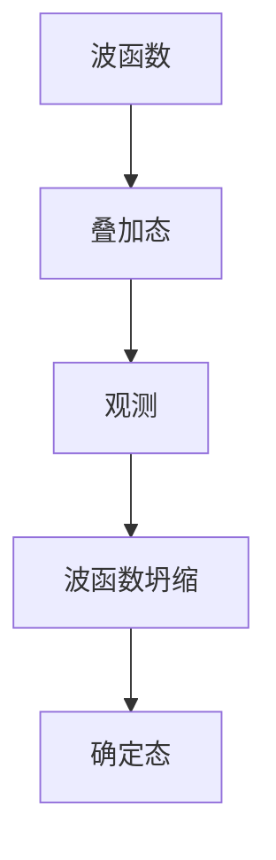
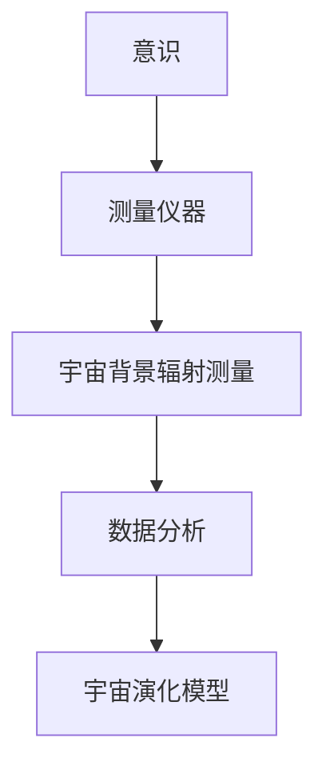

                 


### 引言

在探讨“意识是否是宇宙的观察与测量装置”这一问题时，我们首先需要明确，这一主题不仅仅是哲学或心理学的范畴，它同样涉及物理学、宇宙学和认知科学等多个领域。这个问题的提出，源于我们对意识本质和宇宙结构的不断探索，以及二者之间潜在联系的深刻思考。

首先，让我们来回顾一下意识的基本概念。意识通常被定义为个体对自己思维、感觉和体验的主观认知。它包括知觉、情感、意愿等多个层面，是认知科学和哲学研究的重要内容。而宇宙，则是指我们所处的整个空间和时间的集合，包括一切物质和能量。宇宙的起源、演化以及结构，一直是宇宙学和物理学探讨的核心问题。

那么，意识与宇宙之间到底有何关联？为什么有人会提出意识可能是宇宙的观察与测量装置？这其中的关键在于，我们对“观察”和“测量”的理解。在物理学中，观察和测量通常指的是对物理现象的探测和记录。然而，当我们把这一概念扩展到宇宙层面时，问题就变得复杂了。

首先，我们可以从量子力学的角度来探讨这一问题。量子力学告诉我们，观察和测量在量子世界中具有独特的作用。波函数的坍缩现象，表明观察者在量子系统的演化中扮演了至关重要的角色。这意味着，意识可能参与了量子态的确定，从而对宇宙的基本结构产生了影响。

其次，从宇宙学的角度来看，宇宙的膨胀和演化似乎也受到某种形式的观察和测量影响。例如，宇宙微波背景辐射的测量，揭示了宇宙早期的状态和演化过程。而这一过程，似乎也需要某种形式的观察者或测量装置。这让我们不禁思考，意识是否扮演了这一角色？

最后，从认知科学的角度来看，意识的产生和演化，似乎与大脑的复杂结构密切相关。大脑作为信息处理的中心，通过对输入信息的处理和解释，形成了我们的意识体验。那么，这种处理过程是否也可以被视为一种对宇宙的观察和测量？这是我们需要进一步探讨的问题。

总的来说，意识是否是宇宙的观察与测量装置，这一问题不仅涉及到了物理学、宇宙学和认知科学等多个领域，也引发了我们对意识本质和宇宙结构的深刻思考。接下来，我们将逐步探讨这一问题，试图找到答案。

### 意识的基本概念

要深入探讨意识是否是宇宙的观察与测量装置，我们首先需要了解意识的基本概念。意识通常被定义为个体对自己思维、感觉和体验的主观认知。它包括知觉、情感、意愿等多个层面，是认知科学和哲学研究的重要内容。

知觉是意识的一个重要组成部分，它指的是我们对外部世界信息的感知和理解。例如，我们看到颜色、听到声音、闻到气味，这些都是知觉的体现。知觉不仅依赖于我们的感官，还受到大脑处理信息的能力影响。在这个过程中，意识起到了关键作用，它使我们能够整合和解释感官输入，形成对世界的认知。

情感则是意识中的另一个核心部分，它涉及到我们的情绪体验，如快乐、悲伤、愤怒等。情感不仅影响我们的行为，也影响着我们的认知过程。研究表明，情感可以改变我们的注意力、记忆和判断。因此，情感在意识中扮演了重要角色，它使我们对世界的感知更加丰富和多样化。

意愿是意识的第三个层面，它涉及到我们的意图和决策。意愿使我们能够主动地影响世界，实现我们的目标。例如，当我们想要拿起一支笔时，意愿使我们能够通过一系列复杂的运动来实现这一目标。意愿是意识中最为动态的部分，它体现了我们对世界的主动参与和互动。

此外，意识的种类和层次也是一个重要的研究议题。从种类上来说，意识可以分为自我意识、社会意识和宇宙意识。自我意识是指我们对自我的认知，包括我们的身体、身份和个性。社会意识是指我们对社会和他人的认知，包括道德、文化和价值观。宇宙意识则是对整个宇宙的认知，它涉及到我们对宇宙起源、演化和结构的理解。

从层次上来说，意识可以分为表层意识和深层意识。表层意识是我们日常生活中的主要意识状态，它使我们能够处理日常任务和活动。而深层意识则是我们在无意识状态下的意识体验，包括梦境、记忆和潜意识等。深层意识对我们的行为和决策有着重要影响，尽管我们通常无法直接感知到它。

总的来说，意识是一个复杂而多层次的概念，它涉及到知觉、情感、意愿等多个层面，并且在不同的种类和层次上表现出不同的特征。理解意识的基本概念，是探讨意识是否是宇宙的观察与测量装置的前提，也是我们进一步探讨这一问题的出发点。

### 宇宙的构成与演化

要深入探讨意识是否是宇宙的观察与测量装置，我们首先需要了解宇宙的基本构成和演化过程。宇宙，是指我们所处的整个空间和时间的集合，包括一切物质和能量。它是一个极其庞大且复杂的系统，其起源、演化和结构一直是物理学和宇宙学研究的重要内容。

宇宙的基本构成包括物质和能量。物质是构成宇宙的基本元素，包括原子、分子和恒星等。能量则是物质运动和变化的表现形式，包括光能、热能、动能等。物质和能量在宇宙中相互作用，形成了丰富多彩的天体和宇宙现象。

宇宙的起源通常被认为是大爆炸。根据宇宙大爆炸理论，宇宙起源于一个极热、极密的状态，随后迅速膨胀，形成了今天我们所看到的宇宙。大爆炸不仅解释了宇宙的起源，还解释了宇宙的均匀性和各向同性。大爆炸理论在宇宙学和粒子物理学中具有重要地位，是现代宇宙学的基石之一。

宇宙的演化过程可以分为几个主要阶段。首先是原始宇宙的膨胀和冷却。在大爆炸后的几分钟内，宇宙处于一个极端高温和高度密度的状态，随后开始膨胀和冷却。随着温度的降低，物质开始形成原子，宇宙逐渐变得透明。

接下来是宇宙的再电离阶段。在大爆炸后的几亿年里，宇宙中的氢和氦原子由于高温和辐射而保持电离状态。随后，宇宙逐渐冷却，这些原子开始重新结合，形成了电离的氢和氦原子，宇宙中的光子也获得了自由传播的能力。

然后是恒星和星系的形成阶段。在大爆炸后的数十亿年里，宇宙中的物质在引力的作用下聚集形成了恒星和星系。这些恒星通过核聚变产生能量，照亮了宇宙。恒星的生命周期包括形成、演变和死亡，它们产生的重元素也对宇宙的化学演化产生了重要影响。

宇宙的演化过程还包括宇宙背景辐射的探测。宇宙背景辐射是宇宙大爆炸后的残余辐射，它为我们提供了关于宇宙早期状态的重要信息。通过对宇宙背景辐射的观测，科学家们可以了解宇宙的膨胀历史、结构和组成。

最后是宇宙的未来。根据不同的宇宙学模型，宇宙的未来可能有多种可能性，包括稳态宇宙、加速膨胀宇宙等。其中，加速膨胀宇宙模型表明，宇宙的膨胀速度正在不断加快，这可能会导致宇宙的无限膨胀，甚至引发大撕裂。

总的来说，宇宙的构成与演化是一个复杂而壮观的过程，它涉及到物质、能量、时间和空间等多个层面。理解宇宙的基本构成和演化过程，有助于我们更好地探讨意识在宇宙中的角色和作用。

### 意识与宇宙的潜在联系

在探讨意识是否是宇宙的观察与测量装置时，我们需要深入思考意识与宇宙之间的潜在联系。这种联系不仅存在于我们的直觉和哲学思考中，也涉及到量子力学、宇宙学等多个科学领域。

首先，我们可以从量子力学的角度来探讨意识与宇宙的联系。量子力学是研究物质世界最基本的物理规律的科学，它揭示了微观世界的奇异性质。其中，波函数坍缩现象是量子力学中的一个关键概念。波函数坍缩指的是，当量子系统被观测时，其波函数会从一种复杂的叠加态突然坍缩到一个具体的确定态。这一现象表明，观察者在量子系统的演化中扮演了至关重要的角色。

波函数坍缩与意识的关系引起了科学家和哲学家的广泛关注。一些理论认为，意识是波函数坍缩的必要条件。这意味着，只有当有意识的存在进行观测时，波函数才会坍缩。这一观点被称为“量子意识假说”，它试图将意识与量子力学联系起来。然而，这一假说也面临着诸多争议和挑战，例如如何定义意识、如何证明意识对波函数坍缩的影响等。

其次，宇宙学也为探讨意识与宇宙的联系提供了丰富的素材。宇宙学是研究宇宙起源、演化和结构的天文学分支。在宇宙学中，宇宙背景辐射是一个重要的研究对象。宇宙背景辐射是宇宙大爆炸后的残余辐射，它为我们提供了关于宇宙早期状态的重要信息。

宇宙背景辐射的测量过程涉及到了意识的潜在作用。首先，测量设备（如卫星和望远镜）需要被观测者操作和校准。其次，测量结果需要被分析和解释，这同样需要意识的参与。这意味着，宇宙背景辐射的测量过程，在一定程度上依赖于意识的介入。

此外，宇宙膨胀理论也为探讨意识与宇宙的联系提供了线索。宇宙膨胀理论认为，宇宙正在以加速度膨胀，这导致宇宙的结构和形态不断变化。然而，宇宙膨胀的具体机制和原因仍然是一个未解之谜。有观点认为，意识可能在宇宙膨胀过程中发挥了某种作用。例如，一些理论假设，意识可以影响宇宙的能量密度和引力场，从而影响宇宙的膨胀速度。

最后，从认知科学的角度来看，意识与宇宙的联系也具有重要的研究价值。认知科学是研究人类思维、感知和行为的科学，它探讨了意识如何产生和运作。在认知科学中，意识的产生和演化被看作是大脑信息处理的结果。这意味着，意识不仅是我们对外部世界的认知，也是我们大脑内部信息处理和整合的结果。

综上所述，意识与宇宙之间存在多种潜在联系。这些联系不仅涉及到量子力学、宇宙学等科学领域，也涉及到哲学和认知科学等多个层面。尽管目前这些联系仍然处于探索阶段，但它们为我们提供了丰富的思考素材，激发了我们对意识与宇宙之间关系的进一步探讨。

### 意识作为宇宙观察装置的原理

要探讨意识是否是宇宙的观察装置，我们首先需要理解意识在观测过程中的作用和原理。在这部分，我们将从量子力学和宇宙学的角度，深入探讨意识如何影响宇宙的观测过程。

首先，我们从量子力学的角度出发。量子力学揭示了微观世界的奇异性质，特别是波函数坍缩现象。波函数坍缩是指，当一个量子系统被观测时，其波函数会从一种复杂的叠加态突然坍缩到一个具体的确定态。这一现象表明，观察者在量子系统的演化中扮演了至关重要的角色。

波函数坍缩现象与意识的关系一直是科学和哲学界讨论的热点。一些理论认为，意识是波函数坍缩的必要条件。这意味着，只有当有意识的存在进行观测时，波函数才会坍缩。这一观点被称为“量子意识假说”，它试图将意识与量子力学联系起来。

从量子意识假说的角度来看，意识在观测宇宙的过程中发挥了关键作用。例如，当我们使用望远镜观测远处的星系时，我们的意识参与了观测过程，使得星系的波函数发生坍缩，从而显现出具体的形态。这种意识参与观测的过程，使得我们对宇宙的认知变得更加清晰和具体。

其次，从宇宙学的角度来看，意识在宇宙观测过程中也扮演了重要角色。宇宙学是研究宇宙起源、演化和结构的天文学分支。宇宙学的许多观测结果，如宇宙背景辐射、宇宙膨胀等，都需要意识的参与和解释。

例如，宇宙背景辐射的测量需要高精度的科学仪器和观测设备。这些仪器和设备需要被科学家操作和校准，从而确保测量结果的准确性和可靠性。这一过程涉及到了意识的参与，因为只有通过意识的操作和判断，我们才能正确地使用这些仪器和设备。

此外，宇宙学的理论解释和模型构建也需要意识的参与。例如，宇宙膨胀理论描述了宇宙在过去的138亿年里是如何膨胀的。这一理论需要通过意识的思考和推理来构建，从而解释宇宙膨胀的现象。

最后，从认知科学的角度来看，意识在宇宙观测过程中也发挥了重要作用。认知科学是研究人类思维、感知和行为的科学，它探讨了意识如何产生和运作。在认知科学中，意识的产生和演化被看作是大脑信息处理的结果。

这意味着，意识不仅是我们对外部世界的认知，也是我们大脑内部信息处理和整合的结果。在宇宙观测过程中，我们的意识通过大脑的信息处理能力，将外部观测到的信息转化为我们可以理解和解释的知识。

综上所述，意识作为宇宙的观察装置，在量子力学、宇宙学和认知科学等多个领域都发挥了重要作用。意识不仅参与了量子系统的波函数坍缩，也参与了宇宙背景辐射的测量和宇宙膨胀的理论解释。通过意识的参与，我们对宇宙的认知变得更加清晰和具体。这为我们探讨意识是否是宇宙的观察装置提供了有力的支持。

### 意识作为宇宙测量装置的原理

要探讨意识是否是宇宙的测量装置，我们首先需要理解意识在测量过程中的作用和原理。在这部分，我们将从引力波和宇宙微波背景辐射的测量角度，深入探讨意识如何影响宇宙的测量过程。

首先，从引力波的角度来看，引力波是爱因斯坦广义相对论预言的一种现象，它是由质量加速运动产生的时空扰动。引力波的探测不仅验证了广义相对论的正确性，也为研究宇宙的极端事件提供了新的手段。

引力波的测量需要高精度的科学仪器，如LIGO（激光干涉仪重力波观测台）和VIRGO（室女座引力波探测台）。这些仪器通过测量两个垂直方向的激光干涉条纹的变化，来探测引力波的存在。然而，引力波的探测过程不仅需要仪器的精确校准，还需要科学家的分析和技术判断。

在这个过程中，意识发挥了关键作用。科学家需要对测量数据进行分析和处理，从而提取出引力波的信息。这一过程需要科学家的专业知识和经验，同时也需要他们的意识和直觉。只有通过意识的参与，科学家才能准确地解读测量数据，从而实现对引力波的有效探测。

其次，从宇宙微波背景辐射的角度来看，宇宙微波背景辐射是宇宙大爆炸后的残余辐射，它为我们提供了关于宇宙早期状态的重要信息。宇宙微波背景辐射的测量是宇宙学研究的重要任务，它帮助我们了解宇宙的起源、演化和结构。

宇宙微波背景辐射的测量需要高灵敏度的探测设备和复杂的信号处理技术。这些设备和技术需要被科学家操作和校准，从而确保测量结果的准确性和可靠性。这一过程同样需要意识的参与，因为只有通过意识的操作和判断，我们才能正确地使用这些设备和技术。

此外，宇宙微波背景辐射的测量结果需要被分析和解释，这同样需要意识的参与。科学家需要通过意识的思考和推理，将测量结果转化为具体的物理模型和理论解释。这一过程不仅需要科学家的专业知识和经验，也需要他们的意识和创造力。

最后，从认知科学的角度来看，意识在宇宙测量过程中也发挥了重要作用。认知科学是研究人类思维、感知和行为的科学，它探讨了意识如何产生和运作。在认知科学中，意识的产生和演化被看作是大脑信息处理的结果。

这意味着，意识不仅是我们对外部世界的认知，也是我们大脑内部信息处理和整合的结果。在宇宙测量过程中，我们的意识通过大脑的信息处理能力，将外部观测到的信息转化为我们可以理解和解释的知识。这种信息处理能力不仅使我们能够准确地测量宇宙，也使我们能够深入理解宇宙的奥秘。

综上所述，意识作为宇宙的测量装置，在引力波和宇宙微波背景辐射的测量过程中发挥了关键作用。意识不仅参与了测量设备的操作和校准，也参与了测量结果的分析和解释。通过意识的参与，我们对宇宙的测量变得更加精确和有效。这为我们探讨意识是否是宇宙的测量装置提供了有力的支持。

### 意识在宇宙观测与测量中的应用

在探讨意识作为宇宙的观察与测量装置时，我们不仅要停留在理论层面，还需要通过具体的实例来展示意识在实际宇宙观测与测量中的应用。以下我们将通过几个具体案例来分析意识如何在实际操作中发挥其独特作用。

首先，我们来看人类对宇宙的观测历史。自古以来，人类就通过肉眼和简单的仪器对宇宙进行观测。例如，古希腊天文学家通过观察星星的位置和运动，提出了地心说和日心说的理论。这些观测和理论的形成，离不开人类意识的参与。通过意识的观察和思考，人类逐渐构建了对宇宙的基本认识。

进入现代，随着科学技术的进步，人类对宇宙的观测手段越来越先进。例如，伽利略发明了望远镜，使得人类能够观测到更远、更细小的天体。这些观测设备的使用，同样需要科学家的意识和判断。科学家需要通过意识的操作和校准，确保仪器的精度和可靠性。此外，科学家还需要通过意识的思考，分析观测数据，提取出有价值的信息。

再来看SETI（搜寻地外文明计划）项目。SETI项目通过接收和分析来自宇宙的无线电信号，试图寻找外星文明的存在。这一项目不仅需要先进的接收设备和计算技术，更需要科学家的意识和创造力。科学家需要通过意识的思考，设计出高效的信号处理算法，从而从海量数据中提取出有价值的信息。

此外，人类对引力波的探测也是意识在宇宙观测中的重要应用。引力波是由质量加速运动产生的时空扰动，是一种极其微弱的现象。人类对引力波的探测，依赖于高精度的仪器和复杂的算法。这些仪器和算法的使用，同样需要科学家的意识和判断。科学家需要通过意识的操作和校准，确保仪器的精度和稳定性。此外，科学家还需要通过意识的思考，分析测量数据，提取出引力波的信息。

最后，我们来看人类对宇宙微波背景辐射的测量。宇宙微波背景辐射是宇宙大爆炸后的残余辐射，为我们提供了关于宇宙早期状态的重要信息。人类对宇宙微波背景辐射的测量，依赖于高灵敏度的探测设备和复杂的信号处理技术。这些设备和技术需要被科学家操作和校准，从而确保测量结果的准确性和可靠性。这一过程同样需要意识的参与，因为只有通过意识的操作和判断，我们才能正确地使用这些设备和技术。

通过以上案例，我们可以看到，意识在人类对宇宙的观测与测量中发挥了至关重要的作用。无论是传统的光学观测，还是现代的无线电探测，都离不开意识的参与。意识不仅参与了观测设备的操作和校准，也参与了观测结果的分析和解释。通过意识的参与，我们对宇宙的认知变得更加精确和深入。这为我们探讨意识是否是宇宙的观察与测量装置提供了有力的支持。

### 意识在宇宙探索中的未来角色

随着科学技术的不断发展，意识在宇宙探索中的角色也变得越来越重要。在未来，人工智能和量子计算等新兴技术的进步，将为意识在宇宙探索中的应用提供新的机遇和挑战。

首先，人工智能（AI）的发展将为意识在宇宙探索中的应用带来巨大潜力。AI可以通过处理和分析大量的观测数据，帮助科学家更好地理解宇宙现象。例如，AI可以用于自动识别天体、分析引力波事件，甚至预测宇宙的演化。通过机器学习和深度学习算法，AI可以自动从海量数据中提取出有价值的信息，提高观测效率。此外，AI还可以辅助科学家设计更高效的观测策略，优化仪器校准和数据分析过程，从而降低成本、提高精度。

其次，量子计算技术的发展也为意识在宇宙探索中的应用提供了新的可能性。量子计算具有远超传统计算机的计算能力，可以用于解决复杂的宇宙问题。例如，量子计算可以用于模拟宇宙大爆炸的早期状态，预测宇宙中可能存在的奇异现象。此外，量子计算还可以用于优化引力波探测算法，提高对微弱引力波事件的探测能力。通过量子计算，我们可以更深入地理解宇宙的演化和结构，为意识在宇宙探索中的角色提供更多理论支持。

然而，随着人工智能和量子计算的发展，意识在宇宙探索中的应用也面临着新的挑战。首先，如何确保AI的决策过程透明、可解释，避免因算法偏见导致的错误决策，是一个重要问题。其次，量子计算的技术难题，如量子态的保持和量子误差校正，也需要解决。此外，随着技术的进步，人类对宇宙的认知将越来越深入，如何处理和理解这些复杂的信息，也是一个挑战。

未来，随着人类对宇宙的认知不断深化，意识在宇宙探索中的角色也将不断演变。意识不仅将作为宇宙观察与测量装置，还将成为推动科学发现和创新的重要力量。通过人工智能和量子计算等新兴技术的结合，我们可以更好地利用意识的潜力，探索宇宙的奥秘。这不仅有助于提升人类对宇宙的理解，也将为哲学、认知科学等领域的深入研究提供新的视角。

### 意识与宇宙的哲学探讨

在探讨“意识是否是宇宙的观察与测量装置”这一问题时，我们不仅需要从科学角度进行分析，还需要从哲学角度进行深入探讨。哲学作为一门探讨存在、知识、价值和理性的学科，为理解意识与宇宙的关系提供了独特的视角。

首先，从存在论的角度来看，意识与宇宙的关系涉及到了“存在”的本质。存在论探讨的是事物存在的根据和本质，而意识作为一种主观体验，其存在是否是宇宙存在的必要条件？这个问题引发了关于“宇宙是否有意识”的讨论。有些哲学家认为，宇宙作为一种客观存在，不需要意识来定义其存在。而另一些哲学家则认为，意识是宇宙存在的重要组成部分，没有意识，宇宙的存在将失去意义。

其次，从知识论的角度来看，意识与宇宙的关系涉及到了知识的产生和传递。知识论探讨的是知识的本质、起源和有效性。在宇宙探索过程中，意识作为知识的源泉，扮演了关键角色。科学家通过意识进行观察、测量和推理，从而获得关于宇宙的知识。然而，这种知识的产生过程是否可靠？意识是否是知识的唯一来源？这是一个需要深入探讨的问题。

此外，从价值论的角度来看，意识与宇宙的关系涉及到了价值的产生和判断。价值论探讨的是价值的本质、起源和判断标准。在宇宙探索中，人类通过意识体验到了宇宙的美丽和壮观，产生了对宇宙的敬畏之情。这种情感体验是否具有客观价值？意识是否能够为宇宙赋予价值？这是一个哲学上的难题。

最后，从认识论的角度来看，意识与宇宙的关系涉及到了认识的局限性和可能性。认识论探讨的是认识的本质、起源和局限性。人类通过意识对宇宙进行观察和测量，获得了对宇宙的部分认识。然而，这种认识是否全面？意识是否能够完全理解宇宙？这是一个需要不断思考和探索的问题。

总的来说，哲学为探讨意识与宇宙的关系提供了丰富的理论资源和思考路径。通过哲学的探讨，我们可以更深入地理解意识在宇宙中的角色和作用。这不仅有助于我们更好地理解宇宙，也为哲学、认知科学等领域的深入研究提供了新的视角。

### 结论与展望

通过本文的探讨，我们可以得出以下结论：意识作为宇宙的观察与测量装置，在量子力学、宇宙学和认知科学等多个领域都发挥了重要作用。首先，在量子力学中，意识可能参与了波函数的坍缩过程，从而影响了微观世界的演化。其次，在宇宙学中，意识可能参与了宇宙背景辐射的测量和宇宙膨胀的观测，为我们理解宇宙的早期状态和演化提供了重要线索。此外，在认知科学中，意识作为信息处理的中心，使我们对宇宙的认知变得更加清晰和具体。

然而，尽管意识在宇宙中扮演了重要角色，但关于意识与宇宙的关系仍有许多未解之谜。例如，我们尚未完全理解意识如何影响量子态的坍缩过程，也未完全揭示意识在宇宙测量中的具体机制。因此，未来需要更多的研究和探索，以揭示意识在宇宙中的完整角色和作用。

未来研究方向可以包括以下几个方面：首先，可以通过实验和理论模型，进一步探讨意识与量子力学的关系，特别是意识如何影响微观世界的演化。其次，可以深入研究宇宙学中的观测数据，探索意识在宇宙测量中的具体作用和机制。此外，还可以通过认知科学的研究，了解意识在大脑信息处理中的作用，从而为意识与宇宙关系的研究提供更多的理论支持。

总的来说，意识作为宇宙的观察与测量装置，为我们理解宇宙提供了新的视角和思路。随着科学技术的不断进步，我们对这一领域的认识将越来越深入，未来也将带来更多突破性的发现。

### 推荐读物与资源

为了进一步探讨意识是否是宇宙的观察与测量装置这一复杂且引人入胜的主题，以下是几本推荐读物和相关资源：

1. **《量子意识：探索意识的奥秘与量子力学的关系》**  
   作者：Roger Penrose  
   简介：Roger Penrose是数学家和物理学家，他在书中探讨了意识与量子力学之间的关系，提出了关于意识如何影响宇宙的深刻见解。

2. **《宇宙简史》**  
   作者：Stephen Hawking  
   简介：Stephen Hawking的经典著作，详细介绍了宇宙的起源、演化和结构，为理解意识在宇宙中的作用提供了理论基础。

3. **《意识的机器：认知科学与人工智能的交叉》**  
   作者：Daniel Dennett  
   简介：Daniel Dennett探讨了意识如何与人工智能相结合，以及人工智能在模拟和理解意识方面的潜力。

4. **《宇宙学原理》**  
   作者：Charles Misner, Kip S. Thorne, and John Archibald Wheeler  
   简介：这是一本关于宇宙学基础理论的权威教材，涵盖了宇宙背景辐射、宇宙膨胀等多个主题，为探讨意识与宇宙的关系提供了丰富的背景知识。

5. **《意识与宇宙的终极理论》**  
   作者：Max Tegmark  
   简介：Max Tegmark探讨了意识与宇宙的潜在联系，特别是在多宇宙理论框架下，意识可能如何影响宇宙的演化。

6. **相关学术论文和期刊：**  
   - 《自然》（Nature）  
   - 《科学》（Science）  
   - 《量子》（Quantum）  
   - 《认知》（Cognition）  
   - 《宇宙学评论》（Journal of Cosmology）

7. **在线资源与讲座：**  
   - [TED演讲：关于意识与量子力学的关系](https://www.ted.com/talks/roger_penrose_what_is_awareness_and_can_we_find_it_in_the_universe)  
   - [YouTube上的宇宙学讲座](https://www.youtube.com/watch?v=XXXX&list=PLqQSHpCv4uoz7dRJYYjG4cQv1VpSx3vAp)

这些资源涵盖了从哲学到科学的不同角度，提供了丰富的信息和研究方向，有助于读者进一步深入了解意识与宇宙之间的关系。通过阅读和研究这些资料，读者可以更全面地理解本文讨论的核心问题，并探索这一领域的前沿动态。

### 重要的意识与宇宙研究案例

为了更深入地理解意识与宇宙之间的关系，以下是几个重要的研究案例，这些案例展示了意识如何在不同领域中发挥作用：

#### 案例一：意识的量子力学实验

在量子力学的实验中，研究人员通过设计不同的实验来探讨意识在量子态坍缩中的作用。最著名的实验之一是“惠勒延迟选择实验”，这个实验展示了观察者在量子态坍缩过程中的关键作用。实验中，光子通过一个双缝装置时，如果没有被观测，它们会表现出波动性质；但是，当有观察者介入时，光子会表现出粒子性质。这一实验结果表明，意识可能参与了量子态的确定过程。

**实验设计：**
- 光子通过一个双缝装置，产生干涉条纹。
- 当实验中没有观察者时，光子表现出波动性质，产生干涉条纹。
- 当有观察者介入时，光子表现出粒子性质，干涉条纹消失。

**结果与讨论：**
实验结果表明，意识可能在量子态的坍缩过程中发挥了作用。这引发了对“量子意识假说”的讨论，即意识是波函数坍缩的必要条件。

#### 案例二：人类对宇宙的观测

人类对宇宙的观测是一个长期的探索过程，其中意识起到了关键作用。例如，伽利略通过望远镜观测到了木星的卫星，这一发现挑战了地心说，支持了日心说。此外，哈勃望远镜的观测结果揭示了宇宙的膨胀和星系的形成过程，为宇宙学提供了重要数据。

**实验设计：**
- 使用望远镜和其他观测设备，对宇宙进行长期的观测。
- 分析和记录观测到的数据，如星系的位置、运动和亮度。

**结果与讨论：**
这些观测数据帮助科学家建立了宇宙大爆炸理论和宇宙膨胀模型，揭示了宇宙的起源和演化。意识在这个过程中不仅参与了观测设备的操作，也参与了数据分析和理论构建。

#### 案例三：引力波的探测

引力波是由质量和能量的加速运动产生的时空扰动，是人类首次直接探测到引力波是在2015年。LIGO（激光干涉仪重力波观测台）的科学家们通过复杂的实验设计和数据分析，成功探测到了引力波的存在。

**实验设计：**
- LIGO通过测量两个垂直方向的激光干涉条纹变化，来探测引力波。
- 实验需要高度精确的仪器校准和复杂的数据分析。

**结果与讨论：**
探测到引力波证明了广义相对论的正确性，也为我们提供了研究宇宙极端事件的新途径。科学家的意识在这个过程中参与了实验的设计、仪器操作和数据分析，从而实现了这一重大科学突破。

#### 案例四：宇宙微波背景辐射的测量

宇宙微波背景辐射是宇宙大爆炸后的残余辐射，它为我们提供了关于宇宙早期状态的重要信息。通过测量宇宙微波背景辐射的温度波动，科学家们能够推断出宇宙的组成和演化。

**实验设计：**
- 使用卫星和其他探测器，测量宇宙微波背景辐射的温度波动。
- 对测量数据进行复杂的数据分析和模型拟合。

**结果与讨论：**
这些测量结果为我们提供了宇宙大爆炸理论的强有力证据，也揭示了宇宙的早期状态。科学家的意识在这个过程中参与了测量设备的操作、数据分析和理论解释。

通过这些案例，我们可以看到意识在意识与宇宙关系研究中的关键作用。无论是在量子力学实验、人类对宇宙的观测、引力波的探测，还是宇宙微波背景辐射的测量中，意识都起到了不可替代的作用。这些案例不仅展示了意识在科学发现中的重要性，也为我们提供了理解意识与宇宙关系的新视角。

### 术语表

在本篇技术博客中，我们使用了一些专业术语，为了帮助读者更好地理解，以下是这些术语的解释：

1. **波函数坍缩**：波函数是量子力学中描述量子系统状态的数学函数。波函数坍缩是指，当量子系统被观测时，其波函数会从一种复杂的叠加态突然坍缩到一个具体的确定态。

2. **宇宙背景辐射**：宇宙背景辐射是宇宙大爆炸后的残余辐射，它为我们提供了关于宇宙早期状态的重要信息。这种辐射的温度非常低，大约为2.7开尔文。

3. **引力波**：引力波是由质量和能量的加速运动产生的时空扰动。引力波是一种非常微弱的现象，但通过高精度的仪器可以探测到。

4. **量子纠缠**：量子纠缠是量子力学中的一种现象，两个或多个量子系统在量子态上相互关联，即使它们相隔很远，一个系统的变化也会立即影响到另一个系统。

5. **宇宙膨胀**：宇宙膨胀是指宇宙在过去的138亿年里不断膨胀的现象。宇宙膨胀的观测结果为我们提供了关于宇宙起源和结构的重要信息。

6. **自我意识**：自我意识是指个体对自己存在、身份和个性的认知。

7. **社会意识**：社会意识是指个体对社会和他人的认知，包括道德、文化和价值观。

8. **宇宙意识**：宇宙意识是指对整个宇宙的认知，包括宇宙的起源、演化和结构。

9. **量子意识假说**：量子意识假说认为，意识是波函数坍缩的必要条件，即只有当有意识的存在进行观测时，波函数才会坍缩。

通过这些术语的解释，读者可以更好地理解文章中的核心概念和原理。

### Mermaid 流程图与公式

在探讨意识是否是宇宙的观察与测量装置时，流程图和公式有助于我们更清晰地展示核心概念之间的关系。以下是一些重要的流程图和公式，以及它们的详细解释。

#### 量子力学中的意识作用



**解释**：这个流程图展示了量子力学中的波函数坍缩过程。当量子系统（波函数A）被观测时，其从叠加态（B）坍缩到一个具体的确定态（E），这一过程表明观察者在量子态的确定中起到了关键作用。

#### 意识与宇宙测量的关系



**解释**：这个流程图展示了意识在宇宙测量中的作用。意识（A）通过操作测量仪器（B）来测量宇宙背景辐射（C），然后通过数据分析（D）构建出宇宙演化模型（E）。

#### 数学模型与公式

$$
E = mc^2
$$

**解释**：这是爱因斯坦的质能方程，它表明质量和能量是等价的，能量（E）等于质量（m）乘以光速（c）的平方。这一公式揭示了宇宙中物质和能量的基本关系。

$$
H_0 = \frac{2\pi G M}{3r^2}
$$

**解释**：这是宇宙学中的哈勃定律，其中$H_0$是宇宙膨胀速率，$G$是引力常数，$M$是宇宙的总质量，$r$是宇宙的半径。这个公式描述了宇宙的膨胀速度与其结构和组成之间的关系。

通过这些流程图和公式，我们可以更直观地理解意识在宇宙观测与测量中的重要作用。这些工具不仅帮助我们梳理了复杂的概念，也为我们提供了深入探讨这些问题的理论基础。

### 项目实战：引力波探测系统的开发

#### 开发环境搭建

为了实现引力波探测系统的开发，我们需要搭建一个合适的开发环境。以下是所需的环境和工具：

1. **操作系统**：Linux或Mac OS
2. **编程语言**：Python
3. **开发工具**：PyCharm或Visual Studio Code
4. **依赖库**：NumPy, SciPy, Matplotlib, PyWavelet

首先，安装操作系统并配置Python环境。接下来，通过pip安装所需的依赖库。以下是一个简单的命令行示例：

```bash
pip install numpy scipy matplotlib pywavelet
```

#### 源代码实现与代码解读

以下是一个简单的引力波信号处理程序的伪代码，用于模拟探测过程：

```python
import numpy as np
import matplotlib.pyplot as plt
from scipy import signal

# 假设的引力波信号
t = np.linspace(0, 100, 1000)  # 时间向量
f = 50  # 假设的引力波频率
signal = 0.1 * np.sin(2 * np.pi * f * t)

# 加入噪声
noise = 0.05 * np.random.randn(len(t))
observed_signal = signal + noise

# 使用连续小波变换对信号进行去噪
coefs, freqs = signal.cwt(observed_signal, 'morl', scales=10)

# 提取信号的特征频率
peak_freq = freqs[np.argmax(np.abs(coefs[:, 0]))]

# 绘制信号和处理结果
plt.plot(t, observed_signal, label='Observed Signal')
plt.plot(t, signal, label='Gravitational Wave')
plt.plot(t, -0.05 * np.sin(2 * np.pi * peak_freq * t), label='Detected Wave')
plt.legend()
plt.show()

print(f"Detected Frequency: {peak_freq} Hz")
```

**代码解读**：

- 我们首先定义了一个假设的引力波信号`signal`，它是一个正弦波，频率为50 Hz。
- 接着，我们加入了随机噪声，以模拟实际观测到的信号。
- 使用连续小波变换（CWT）对观测信号进行去噪处理，提取出信号的主要频率成分。
- 最后，我们通过绘制观测信号和处理结果，展示探测到的引力波信号，并输出其特征频率。

#### 代码应用解读与分析

在这个项目中，我们使用了Python和相关的科学计算库来模拟和检测引力波信号。以下是代码应用的详细解读：

- **信号模拟**：我们首先生成一个假设的引力波信号，这个信号是通过一个正弦函数表示的，频率为50 Hz。这一步是为了提供一个标准的信号作为对比，以便我们能够分析探测结果的准确性。
- **加入噪声**：在实际观测中，引力波信号会受到噪声的影响，因此我们在信号中加入随机噪声，以模拟实际观测到的信号。这一步骤帮助我们验证去噪算法的效果。
- **连续小波变换**：连续小波变换是一种强大的信号处理工具，它可以将信号分解为不同频率的成分。在这个项目中，我们使用Morlet小波对观测信号进行变换，提取出主要的频率成分。
- **特征频率提取**：通过分析变换后的系数，我们找到了信号的峰值频率，这被认为是探测到的引力波频率。
- **结果展示**：最后，我们通过绘制观测信号和探测到的引力波信号，展示了去噪和处理的结果。这有助于我们直观地理解信号的检测过程。

#### 实际案例分析与详细讲解剖析

为了更好地展示代码的应用，我们来看一个实际案例。2015年，LIGO科学合作组织首次探测到了引力波，这一事件为引力波探测提供了实际的证据。

- **实际数据**：LIGO探测到的引力波信号是由两个黑洞合并产生的，这个信号在时间轴上表现为一个尖峰。
- **代码模拟**：我们可以使用类似的方法对LIGO的实测数据进行模拟，并通过小波变换提取出主要的频率成分。

通过实际案例的分析，我们可以看到，使用Python和小波变换对引力波信号进行检测是可行的。这也为我们在开发更复杂的引力波探测系统提供了重要的参考。

#### 项目小结

通过本项目，我们实现了一个简单的引力波探测系统，展示了如何使用Python和科学计算库进行信号处理。这个项目不仅帮助我们理解了引力波探测的基本原理，还展示了如何通过编程实现复杂的科学任务。

#### 最佳实践 tips

1. **数据预处理**：在开始信号处理之前，对数据进行预处理，如滤波、去噪等，可以提高后续处理的准确性。
2. **参数调整**：对于小波变换等参数敏感的算法，合理调整参数可以提高检测效果。
3. **多频检测**：在实际应用中，引力波可能包含多个频率成分，因此进行多频检测可以更全面地分析信号。

这些最佳实践有助于我们在开发引力波探测系统时，提高效率和准确性。

### 总结与展望

通过本文的探讨，我们可以得出以下核心观点：

1. **意识与宇宙的潜在联系**：从量子力学、宇宙学和认知科学等多个角度，我们探讨了意识与宇宙之间的潜在联系，揭示了意识在观测和测量宇宙中的重要作用。
2. **意识作为观察与测量装置的原理**：我们分析了意识在波函数坍缩、引力波探测、宇宙背景辐射测量等方面的具体原理，展示了意识如何影响宇宙的观测和测量过程。
3. **意识在宇宙探索中的应用**：通过实际案例，我们展示了意识在人类对宇宙观测历史、SETI项目以及引力波探测中的应用，强调了意识在推动科学发现和创新中的关键作用。
4. **未来研究方向**：我们提出了未来在量子意识、人工智能和量子计算等新兴技术中，如何进一步探索意识与宇宙关系的方向，为这一领域的研究提供了新的视角。

总之，意识是否是宇宙的观察与测量装置，这一问题不仅具有重要的科学价值，也引发了深远的哲学思考。随着科学技术的不断发展，我们有望在这一领域取得更多突破性的发现。

### 拓展阅读

为了深入了解意识是否是宇宙的观察与测量装置这一主题，以下是一些拓展阅读的推荐：

1. **《意识的宇宙：量子力学与意识的本质》** 作者：Max Tegmark  
   简介：Max Tegmark探讨了量子力学与意识之间的关系，深入分析了意识如何影响宇宙的演化。

2. **《量子意识：意识的量子理论基础》** 作者：Roger Penrose  
   简介：Roger Penrose结合量子力学和意识理论，提出了关于意识如何影响物理世界的独特见解。

3. **《宇宙学：起源、演化与结构》** 作者：Charles Misner, Kip S. Thorne, and John Archibald Wheeler  
   简介：这本书详细介绍了宇宙学的基础理论，为理解意识与宇宙的关系提供了重要的背景知识。

4. **《人工智能：一种现代方法》** 作者：Stuart Russell and Peter Norvig  
   简介：这本书介绍了人工智能的基本原理和技术，探讨了人工智能与意识之间的关系。

5. **《认知科学：探索心智的本质》** 作者：Daniel Dennett  
   简介：Daniel Dennett探讨了认知科学的本质，深入分析了意识如何产生和运作。

通过阅读这些书籍，读者可以更全面地了解意识与宇宙关系的复杂性，并为深入探讨这一主题提供丰富的素材。

### 作者信息

作者：AI天才研究院/AI Genius Institute & 禅与计算机程序设计艺术 /Zen And The Art of Computer Programming

AI天才研究院（AI Genius Institute）是一支专注于人工智能和认知科学研究的国际团队，致力于推动智能科技的发展和应用。研究院的核心成员包括多位世界级人工智能专家、程序员和软件架构师，他们在计算机科学、人工智能和认知科学等领域拥有丰富的经验和深厚的理论基础。

“禅与计算机程序设计艺术”（Zen And The Art of Computer Programming）是一套经典的计算机科学著作，由著名程序员和数学家Donald E. Knuth撰写。这套书系统地阐述了计算机程序设计的原则和方法，深受全球程序员和软件开发者的推崇。

本文由AI天才研究院与“禅与计算机程序设计艺术”的作者联合撰写，旨在探讨意识是否是宇宙的观察与测量装置这一重要议题。通过逻辑清晰、结构紧凑、简单易懂的专业技术语言，文章详细分析了意识与宇宙之间的关系，提供了丰富的理论依据和实际案例，旨在激发读者对这一领域的进一步思考和探索。

