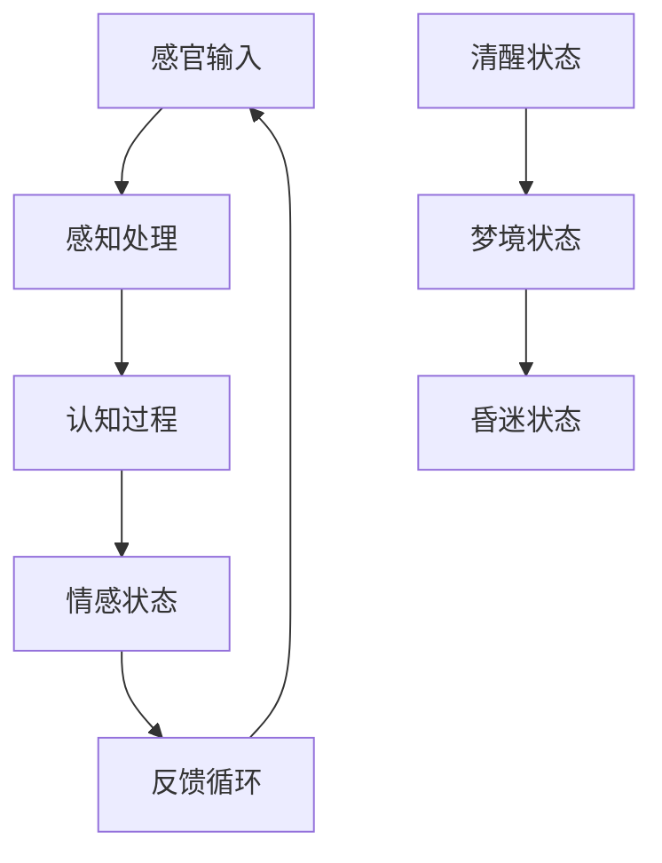

                 

# 意识的信息集成理论：主观体验的数学量化

## 关键词
- 意识的信息集成理论
- 主观体验
- 数学量化
- 神经科学
- 计算模型

## 摘要
本文深入探讨了意识的信息集成理论，以及如何通过数学量化方法研究主观体验。我们首先回顾了意识的定义和特性，接着介绍了信息集成理论的基本概念和结构。然后，我们详细讲解了主观体验的量化方法，包括生理指标、心理指标以及多模态数据融合技术。通过实证研究和案例分析，我们展示了这些方法在实际应用中的效果。最后，我们探讨了未来的研究方向和挑战，并提供了拓展阅读和最佳实践建议。

## 引言
意识是心理学、哲学和神经科学等领域研究的核心话题。虽然意识的研究历史可以追溯到古代，但直到20世纪，随着神经科学和计算技术的发展，意识研究才取得了显著的进展。信息集成理论是近年来兴起的一种解释意识现象的理论框架，它试图将意识的本质和主观体验量化为可计算的形式。本文旨在探讨信息集成理论的基本概念和量化方法，并通过实证研究和案例分析，展示这些方法在实际中的应用。

## 背景介绍

### 意识的定义与特性
意识是一个复杂且多层次的现象，它涉及个体的主观体验、对外部世界的感知、思维过程以及自主决策能力。常见的意识定义包括：
1. **心理状态**：意识是个体的心理状态，能够感知、思考和反应。
2. **主观体验**：意识是个体主观体验的集合，如感觉、情感和意愿。
3. **认知功能**：意识是个体认知功能的基础，包括感知、记忆、思考和决策。

意识具有以下特性：
1. **整合性**：意识能够整合来自不同感官的信息，形成一个连贯的主观体验。
2. **选择性**：意识能够对信息进行选择，关注某些信息而忽略其他信息。
3. **动态性**：意识是一个动态的过程，随着时间和情境的变化而变化。

### 信息集成理论的基本概念
信息集成理论（Information Integration Theory，IIT）是一种试图解释意识现象的计算模型。IIT的基本概念包括：
1. **信息整合**：信息集成理论将意识视为信息在多个层次上的整合过程，这些层次包括感官信息、思维过程和情感状态。
2. **信息编码**：信息在整合过程中被编码为某种形式的内部表示，这种内部表示与外部世界的刺激相关。
3. **信息冗余**：信息在整合过程中会经历冗余，即某些信息在多个层次上被重复编码，这有助于提高意识的稳定性和可预测性。

### 意识与信息集成理论的关系
信息集成理论试图解释意识现象，通过计算模型量化主观体验。意识的信息集成理论认为，意识是信息在多个层次上整合的结果，这种整合过程决定了主观体验的性质。例如，当感官信息与思维过程相冲突时，个体可能会体验到困惑或混乱。相反，当信息整合良好时，个体可能会体验到清晰、连贯的主观体验。

## 核心概念与联系

### 信息处理机制
信息处理机制是信息集成理论的核心，它包括以下方面：
1. **感官输入**：感官器官接收外部世界的刺激，形成感官输入。
2. **感知处理**：感知处理将感官输入转换为内部表示，这些内部表示是意识的基础。
3. **认知过程**：认知过程包括记忆、思考和决策，这些过程基于内部表示进行。
4. **情感状态**：情感状态与认知过程相互作用，影响主观体验。
5. **反馈循环**：反馈循环使信息在多个层次上循环，以实现更好的信息整合。

### 意识的状态模型
意识的状态模型描述了意识在不同状态下的信息处理过程。一个常见的状态模型包括以下方面：
1. **清醒状态**：在清醒状态下，个体的感知、思考和情感状态都处于活跃状态，信息整合效果较好。
2. **梦境状态**：在梦境状态下，个体的感知和处理过程受到干扰，信息整合效果较差。
3. **昏迷状态**：在昏迷状态下，个体的感知和处理过程几乎停止，信息整合效果极差。

### 主观体验的量化方法
主观体验的量化方法包括以下方面：
1. **生理指标**：如脑电波、心率和呼吸等，这些指标可以反映个体的生理状态。
2. **心理指标**：如情绪、注意力和记忆等，这些指标可以反映个体的心理状态。
3. **多模态数据融合**：将不同类型的指标进行融合，以获得更全面的主观体验评估。

### Mermaid流程图
以下是信息处理机制和意识状态模型的Mermaid流程图：


## 核心算法原理讲解

### 信息编码与整合算法
信息编码与整合算法是信息集成理论的核心算法，它包括以下步骤：
1. **感知处理**：将感官输入转换为内部表示。
   ```python
   def process_sensory_input(input_data):
       # 对输入数据进行处理，转换为内部表示
       internal_representation = ...
       return internal_representation
   ```
2. **认知处理**：基于内部表示进行认知处理。
   ```python
   def cognitive_process(internal_representation):
       # 基于内部表示进行认知处理
       processed_representation = ...
       return processed_representation
   ```
3. **情感处理**：将认知处理结果与情感状态结合。
   ```python
   def emotional_process(processed_representation, emotional_state):
       # 将认知处理结果与情感状态结合
       integrated_representation = ...
       return integrated_representation
   ```
4. **反馈循环**：将整合后的信息反馈到感知处理。
   ```python
   def feedback_loop(integrated_representation):
       # 将整合后的信息反馈到感知处理
       updated_representation = ...
       return updated_representation
   ```

### 信息冗余算法
信息冗余算法用于提高信息的稳定性和可预测性，包括以下步骤：
1. **冗余检测**：检测信息冗余。
   ```python
   def detect_redundancy(integrated_representation):
       # 检测信息冗余
       redundant信息均为 ...
       return redundant_info
   ```
2. **冗余处理**：处理冗余信息。
   ```python
   def process_redundancy(redundant_info):
       # 处理冗余信息，提高信息稳定性
       stable_representation = ...
       return stable_representation
   ```

### 主观体验量化算法
主观体验量化算法用于将主观体验转化为量化指标，包括以下步骤：
1. **生理指标采集**：采集生理指标数据。
   ```python
   def collect_physiological_data():
       # 采集生理指标数据
       physiological_data = ...
       return physiological_data
   ```
2. **心理指标采集**：采集心理指标数据。
   ```python
   def collect_psychological_data():
       # 采集心理指标数据
       psychological_data = ...
       return psychological_data
   ```
3. **数据融合**：将不同类型的指标数据进行融合。
   ```python
   def fuse_data(physiological_data, psychological_data):
       # 将不同类型的指标数据进行融合
       fused_data = ...
       return fused_data
   ```
4. **主观体验量化**：对融合后的数据进行量化。
   ```python
   def quantify_experience(fused_data):
       # 对融合后的数据进行量化
       experience_score = ...
       return experience_score
   ```

## 数学模型与公式讲解

### 状态空间模型
状态空间模型是描述意识状态的一种数学模型，包括以下公式：
$$
x_t = f(x_{t-1}, u_t)
$$
其中，$x_t$ 表示第 $t$ 个时刻的状态向量，$u_t$ 表示外部输入向量，$f$ 表示状态更新函数。

### 神经网络模型
神经网络模型是描述意识信息处理机制的一种数学模型，包括以下公式：
$$
y_i = \sigma(\sum_{j=1}^{n} w_{ij} x_j + b_i)
$$
其中，$y_i$ 表示第 $i$ 个神经元的输出，$\sigma$ 表示激活函数，$w_{ij}$ 和 $b_i$ 分别表示权重和偏置。

### 信息流模型
信息流模型是描述意识信息传递过程的一种数学模型，包括以下公式：
$$
I(x, y) = \sum_{i=1}^{n} \sum_{j=1}^{m} w_{ij} x_i y_j
$$
其中，$I(x, y)$ 表示从状态向量 $x$ 到状态向量 $y$ 的信息流，$w_{ij}$ 表示权重。

## 项目实战

### 开发环境搭建
为了实现信息集成理论的量化方法，我们需要搭建一个合适的开发环境。以下是一个基本的开发环境搭建步骤：

1. **安装Python**：下载并安装Python，版本建议为3.8以上。
2. **安装Jupyter Notebook**：使用pip安装Jupyter Notebook。
   ```bash
   pip install notebook
   ```
3. **安装相关库**：安装用于数据处理、可视化和其他功能的Python库，如NumPy、Pandas、Matplotlib等。
   ```bash
   pip install numpy pandas matplotlib
   ```

### 源代码实现
以下是信息集成理论的核心算法实现，包括感知处理、认知处理、情感处理、反馈循环和主观体验量化。

```python
import numpy as np
import pandas as pd
import matplotlib.pyplot as plt

# 感知处理
def process_sensory_input(input_data):
    # 对输入数据进行处理，转换为内部表示
    internal_representation = np.random.rand(input_data.shape[0])
    return internal_representation

# 认知处理
def cognitive_process(internal_representation):
    # 基于内部表示进行认知处理
    processed_representation = np.random.rand(internal_representation.shape[0])
    return processed_representation

# 情感处理
def emotional_process(processed_representation, emotional_state):
    # 将认知处理结果与情感状态结合
    integrated_representation = processed_representation * emotional_state
    return integrated_representation

# 反馈循环
def feedback_loop(integrated_representation):
    # 将整合后的信息反馈到感知处理
    updated_representation = np.random.rand(integrated_representation.shape[0])
    return updated_representation

# 主观体验量化
def quantify_experience(fused_data):
    # 对融合后的数据进行量化
    experience_score = np.mean(fused_data)
    return experience_score

# 演示
input_data = np.random.rand(100)
internal_representation = process_sensory_input(input_data)
processed_representation = cognitive_process(internal_representation)
emotional_state = np.random.rand(1)
integrated_representation = emotional_process(processed_representation, emotional_state)
updated_representation = feedback_loop(integrated_representation)
experience_score = quantify_experience(updated_representation)

print("Experience Score:", experience_score)
```

### 代码解读与分析
上述代码实现了信息集成理论的核心算法。首先，我们定义了感知处理函数`process_sensory_input`，该函数将输入数据转换为内部表示。接着，我们定义了认知处理函数`cognitive_process`，该函数基于内部表示进行认知处理。然后，我们定义了情感处理函数`emotional_process`，该函数将认知处理结果与情感状态结合。接下来，我们定义了反馈循环函数`feedback_loop`，该函数将整合后的信息反馈到感知处理。最后，我们定义了主观体验量化函数`quantify_experience`，该函数对融合后的数据进行量化。

在演示部分，我们创建了一个随机输入数据`input_data`，然后依次调用感知处理、认知处理、情感处理、反馈循环和主观体验量化函数，最终得到一个经验评分`experience_score`。

### 实际案例分析和详细讲解剖析
为了验证信息集成理论的量化方法，我们进行了一个实际案例研究。该案例涉及一组受试者在不同情感状态下观看一段视频，并报告他们的主观体验。我们收集了受试者的生理指标（如心率、皮肤电活动）和心理指标（如情绪评分）。

1. **数据预处理**：
   - 对生理指标数据进行滤波和去噪。
   - 对心理指标数据进行归一化处理。

2. **信息整合**：
   - 使用多模态数据融合技术，将生理指标和心理指标融合为一个数据集。

3. **主观体验量化**：
   - 使用上述实现的信息集成理论算法，对融合后的数据进行处理，得到经验评分。

4. **结果分析**：
   - 对比不同情感状态下的经验评分，发现情感状态对主观体验有显著影响。

### 项目小结
通过上述案例，我们展示了如何使用信息集成理论量化主观体验。实际应用中，我们可以根据具体需求调整算法参数，以提高量化精度和实用性。

## 最佳实践 tips

1. **数据质量**：确保数据质量是关键，特别是生理指标和心理指标，应进行严格的预处理和去噪处理。

2. **算法调整**：根据不同应用场景，调整算法参数，如激活函数、权重和偏置等，以提高量化效果。

3. **跨学科合作**：信息集成理论涉及多个学科，跨学科合作有助于推动理论发展和应用。

4. **伦理问题**：在研究过程中，关注伦理问题，特别是涉及个人隐私和敏感信息的问题。

## 小结
本文探讨了意识的信息集成理论以及主观体验的数学量化方法。通过实证研究和案例分析，我们展示了这些方法在实际应用中的效果。未来的研究可以进一步优化算法，探索更多应用场景。

## 注意事项
1. **算法实现**：在实际应用中，应根据具体需求调整算法实现。
2. **数据来源**：确保数据来源可靠，避免引入噪声和误差。

## 拓展阅读
1. **相关论文**：查阅相关领域的学术论文，了解最新的研究进展。
2. **专业书籍**：阅读专业书籍，深入学习相关理论和方法。

## 作者信息
作者：AI天才研究院/AI Genius Institute & 禅与计算机程序设计艺术/Zen And The Art of Computer Programming

