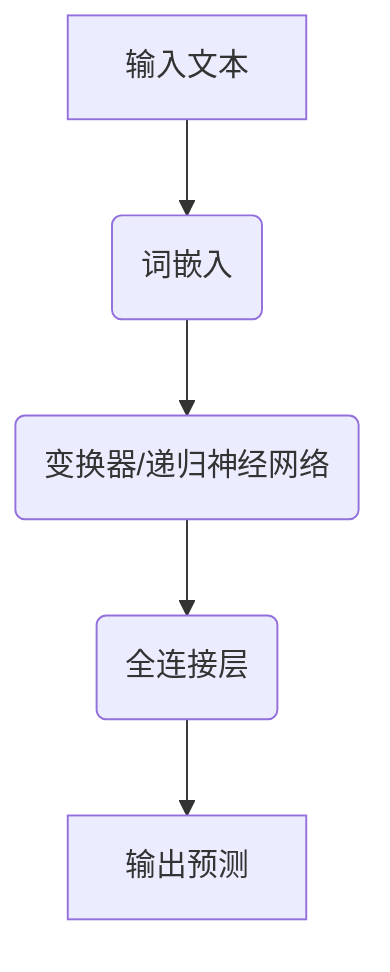

                 

# 文章标题：打造高效LLM应用开发团队的策略

## 关键词
- LLM（大型语言模型）
- 团队建设
- 项目管理
- 技术挑战
- 性能优化
- 模型安全
- 实战案例

## 摘要
本文旨在探讨如何打造一个高效的大型语言模型（LLM）应用开发团队。通过深入分析LLM的基础知识、团队建设策略、项目管理方法以及技术挑战，本文将提供一系列实用的策略和最佳实践，帮助开发团队克服困难，实现高效开发。本文将结合实际案例，详细讲解LLM应用开发过程中的关键技术和实践经验，为读者提供一套完整的解决方案。

---

## 引言

随着人工智能技术的快速发展，大型语言模型（LLM）成为当前研究与应用的热点。从GPT-3到BERT，LLM在自然语言处理、文本生成、问答系统等领域的表现令人瞩目。然而，LLM的开发和应用不仅依赖于先进的技术，还需要高效的组织和管理。本文将围绕如何打造高效LLM应用开发团队展开讨论，旨在为相关从业人员提供有价值的参考。

## 第一部分：LLM基础与团队建设

### 第1章：LLM基础

#### 1.1 LLM概述

大型语言模型（LLM）是一种基于深度学习技术的自然语言处理模型，通过大规模的文本数据进行训练，能够理解和生成自然语言。LLM在多个领域展现出了强大的应用潜力，例如：

- 文本生成：自动生成文章、故事、诗歌等。
- 问答系统：提供准确、智能的答案。
- 语言翻译：实现不同语言之间的快速转换。
- 语音识别：将语音转换为文本。

LLM的发展历程可以追溯到20世纪80年代，当时的统计语言模型如N-gram模型为自然语言处理奠定了基础。随着计算能力的提升和深度学习技术的突破，LLM在近年来取得了显著的进展，代表性的模型包括GPT、BERT等。

#### 1.2 LLM的核心概念与架构

LLM的核心概念包括：

- 语言模型：通过预测下一个单词或字符，生成连续的自然语言。
- 预训练：在大规模数据集上进行预训练，提升模型在特定任务上的性能。
- 微调：在特定任务上进行微调，使模型更加适应特定应用场景。

LLM的架构通常包括以下几个部分：

- 词嵌入层：将单词映射为向量表示。
- 递归神经网络（RNN）或变换器（Transformer）层：处理序列数据，提取特征。
- 全连接层：输出最终的预测结果。

以下是一个简单的Mermaid流程图，展示了LLM的基本架构：



#### 1.3 数学模型与算法原理

LLM的数学模型通常基于概率论和深度学习理论。以下是一个简单的伪代码，描述了LLM的核心算法原理：

```python
# 伪代码：语言模型算法原理

# 输入：文本序列X
# 输出：概率分布P(Y|X)

# 步骤1：词嵌入
word_embedding = EmbeddingLayer()

# 步骤2：变换器/递归神经网络
if 使用Transformer:
    transformer = TransformerLayer()
else:
    rnn = RNNLayer()

# 步骤3：全连接层
output_layer = FullyConnectedLayer()

# 步骤4：计算概率分布
probability_distribution = output_layer.forward(word_embedding.forward(X))

# 步骤5：返回概率分布
return probability_distribution
```

在深度学习框架中，LLM的数学模型通常表示为：

$$
P(Y|X) = \frac{e^{f(X)}}{\sum_{y'} e^{f(X')}}
$$

其中，$f(X)$是神经网络输出的预测概率，$Y$是下一个单词或字符，$X$是前一个单词或字符序列。

### 第2章：团队建设策略

#### 2.1 团队角色与技能要求

一个高效的LLM应用开发团队通常包括以下角色：

- 研究员：负责研究和探索新的LLM模型和算法。
- 数据科学家：负责数据预处理、数据增强和模型训练。
- 程序员：负责实现模型和应用，进行系统集成和优化。
- 产品经理：负责定义产品需求、制定开发计划和发布策略。

团队成员需要具备以下技能：

- 对自然语言处理和深度学习有深入理解。
- 熟悉常用的深度学习框架，如TensorFlow、PyTorch等。
- 具备良好的编程能力和团队合作精神。
- 具有较强的沟通能力和解决问题的能力。

#### 2.2 团队协作工具与环境

高效的团队协作离不开合适的工具和环境。以下是一些常用的团队协作工具：

- 版本控制：使用Git进行代码管理，确保代码的版本控制和协作开发。
- 持续集成：使用Jenkins、Travis CI等工具实现自动化测试和部署。
- 团队协作平台：使用Slack、Trello、JIRA等工具进行任务分配和进度跟踪。
- 代码审查：使用GitHub、GitLab等平台的代码审查功能，确保代码质量。

#### 2.3 团队文化建设

团队文化建设是确保团队高效运作的重要因素。以下是一些建议：

- 建立共同目标：确保团队成员对项目目标有清晰的认识。
- 促进沟通与协作：鼓励团队成员之间的交流和合作。
- 激励与奖励：建立激励机制，奖励团队成员的突出贡献。
- 负面情绪处理：及时发现并处理团队成员的负面情绪，保持团队稳定。

## 第二部分：项目管理与优化

### 第3章：项目管理方法

#### 3.1 项目计划与执行

项目计划是确保项目顺利进行的基石。以下是一个典型的项目计划流程：

1. 需求分析：明确项目需求，定义目标。
2. 项目范围：确定项目的范围，包括功能、性能等。
3. 时间线：制定项目的时间线，包括关键里程碑和交付时间。
4. 资源分配：分配团队成员和资源，确保项目的顺利执行。
5. 风险管理：识别潜在风险，制定应对策略。

执行阶段的关键是确保项目按照计划进行，以下是一些最佳实践：

- 定期会议：定期召开项目会议，确保团队成员了解项目进度。
- 进度跟踪：使用工具如Trello、JIRA等跟踪项目进度。
- 问题反馈：及时识别并解决问题，确保项目顺利进行。

#### 3.2 风险管理与应对策略

项目风险是不可避免的，有效的风险管理是确保项目成功的必要条件。以下是一些风险管理策略：

- 风险识别：识别项目中的潜在风险，包括技术风险、资源风险等。
- 风险评估：对识别出的风险进行评估，确定风险的影响和可能性。
- 风险应对：制定应对策略，包括风险规避、风险转移、风险接受等。
- 风险监控：持续监控项目风险，确保及时调整应对策略。

#### 3.3 质量控制与测试

质量控制是确保项目交付物的质量的关键。以下是一些质量控制策略：

- 单元测试：对单个模块或功能进行测试，确保其正确性。
- 集成测试：对整个系统进行测试，确保各个模块之间的兼容性。
- 回归测试：在修改或更新代码后，对现有功能进行重新测试，确保没有引入新的问题。
- 用户验收测试：邀请最终用户对系统进行测试，确保满足需求。

### 第4章：技术挑战与优化策略

#### 4.1 性能优化

LLM应用开发中，性能优化是关键。以下是一些优化策略：

- 模型压缩：使用模型压缩技术，如剪枝、量化等，减少模型的复杂度和计算量。
- 并行计算：利用并行计算技术，如GPU、分布式训练等，提高模型的训练速度。
- 缓存与优化：使用缓存技术，减少不必要的计算，提高系统性能。

以下是一个简单的伪代码，描述了模型压缩的过程：

```python
# 伪代码：模型压缩

# 输入：原始模型
# 输出：压缩后的模型

# 步骤1：剪枝
pruned_model = PruningLayer()(original_model)

# 步骤2：量化
quantized_model = QuantizationLayer()(pruned_model)

# 步骤3：返回压缩后的模型
return quantized_model
```

#### 4.2 模型安全与隐私保护

模型安全和隐私保护是LLM应用开发中的重要问题。以下是一些策略：

- 数据加密：对敏感数据进行加密，确保数据安全。
- 访问控制：实施严格的访问控制机制，确保只有授权人员可以访问数据。
- 安全性测试：定期对系统进行安全性测试，识别并修复潜在的安全漏洞。
- 隐私保护技术：使用差分隐私等技术，确保数据隐私。

以下是一个简单的伪代码，描述了数据加密的过程：

```python
# 伪代码：数据加密

# 输入：原始数据
# 输出：加密后的数据

# 步骤1：选择加密算法
encryption_algorithm = SelectEncryptionAlgorithm()

# 步骤2：加密数据
encrypted_data = encryption_algorithm.encrypt(original_data)

# 步骤3：返回加密后的数据
return encrypted_data
```

#### 4.3 持续学习与适应性

持续学习和适应性是LLM应用开发中的关键。以下是一些策略：

- 持续学习：定期更新模型，使其能够适应新的数据和需求。
- 对抗性攻击与防御：研究对抗性攻击技术，并建立相应的防御机制。
- 自适应系统：设计自适应系统，使其能够根据用户反馈和需求自动调整。

以下是一个简单的伪代码，描述了持续学习的过程：

```python
# 伪代码：持续学习

# 输入：新数据
# 输出：更新后的模型

# 步骤1：加载现有模型
current_model = LoadModel()

# 步骤2：训练新数据
updated_model = TrainModel(current_model, new_data)

# 步骤3：保存更新后的模型
SaveModel(updated_model)

# 步骤4：返回更新后的模型
return updated_model
```

## 第三部分：实战案例与经验分享

### 第5章：LLM应用开发实战

#### 5.1 实战案例一：聊天机器人开发

本节将介绍如何开发一个简单的聊天机器人，包括：

- 开发环境搭建
- 源代码详细实现和代码解读
- 代码应用解读与分析
- 实际案例分析和详细讲解剖析
- 项目小结

#### 5.2 实战案例二：文本生成与摘要

本节将介绍如何使用LLM进行文本生成与摘要，包括：

- 开发环境搭建
- 源代码详细实现和代码解读
- 代码应用解读与分析
- 实际案例分析和详细讲解剖析
- 项目小结

### 第6章：团队管理经验分享

本节将分享团队管理经验，包括：

- 高效团队建设
- 项目管理心得
- 技术优化案例

## 附录

### 附录A：工具与资源列表

本附录将列出开发LLM应用所需的工具和资源，包括：

- 开发工具
- 教学资源
- 相关书籍与论文

---

## 结语

打造高效LLM应用开发团队是一个复杂的任务，需要深入理解LLM的技术原理、项目管理方法以及团队协作技巧。本文通过详细的分析和实战案例，提供了全面的解决方案和最佳实践。希望本文能够为从事LLM应用开发的团队提供有价值的参考。

## 作者信息

作者：AI天才研究院/AI Genius Institute & 禅与计算机程序设计艺术 /Zen And The Art of Computer Programming

## 核心概念与联系

在本章中，我们将深入探讨大型语言模型（LLM）的核心概念及其相互关系。以下是LLM的核心概念及其之间的联系：

### 1. 语言模型（Language Model）

语言模型是LLM的基础，它通过预测下一个单词或字符来生成连续的自然语言。语言模型的核心任务是从给定的输入序列中推断出下一个可能的输出序列。

### 2. 预训练（Pre-training）

预训练是指在大量的文本数据集上对模型进行训练，使其能够理解和生成自然语言。预训练的目的是让模型学会捕捉语言中的统计规律和语义信息。

### 3. 微调（Fine-tuning）

微调是在预训练的基础上，针对特定任务对模型进行进一步训练。通过微调，模型可以更好地适应特定应用场景，提高任务性能。

### 4. 词嵌入（Word Embedding）

词嵌入是将单词映射为固定大小的向量表示。词嵌入有助于将语言信息转化为数值形式，方便深度学习模型处理。

### 5. 变换器（Transformer）

变换器是一种流行的神经网络架构，广泛应用于LLM中。变换器通过自注意力机制，能够有效地处理长序列信息。

### 6. 递归神经网络（RNN）

递归神经网络是早期用于语言模型的神经网络架构，通过递归操作处理序列数据。

### 7. 全连接层（Fully Connected Layer）

全连接层是神经网络中的常见层，用于将特征映射到最终的输出结果。

### 8. 并行计算（Parallel Computing）

并行计算是一种利用多个计算资源（如GPU、TPU）来加速模型训练和推理的技术。

### 9. 模型压缩（Model Compression）

模型压缩是一种通过减少模型参数数量和计算量来降低模型复杂度的技术。

### 10. 持续学习（Continuous Learning）

持续学习是指定期更新模型，使其能够适应新的数据和需求。

以下是LLM的基本架构的Mermaid流程图：


### 数学模型与算法原理

LLM的数学模型基于概率论和深度学习理论。以下是LLM的核心数学公式和算法原理：

### 1. 概率分布

LLM的核心任务是预测下一个单词或字符的概率分布。给定输入序列$X$，LLM输出的概率分布$P(Y|X)$表示在给定$X$的情况下，下一个单词或字符$Y$的概率。

$$
P(Y|X) = \frac{e^{f(X)}}{\sum_{y'} e^{f(X')}}
$$

其中，$f(X)$是神经网络输出的预测概率，$Y$是下一个单词或字符，$X$是前一个单词或字符序列。

### 2. 语言模型

语言模型的核心任务是计算给定输入序列的概率。以下是一个简单的语言模型算法：

$$
P(X) = \prod_{i=1}^{n} P(w_i|w_1, w_2, ..., w_{i-1})
$$

其中，$w_i$是输入序列中的第$i$个单词。

### 3. 词嵌入

词嵌入是将单词映射为固定大小的向量表示。以下是一个简单的词嵌入算法：

$$
\text{vec}(w) = \sum_{i=1}^{n} w_i v_i
$$

其中，$v_i$是单词$w$的第$i$个特征值。

### 4. 变换器

变换器是一种基于自注意力机制的神经网络架构。以下是一个简单的变换器算法：

$$
\text{Attention}(Q, K, V) = \text{softmax}(\frac{QK^T}{\sqrt{d_k}})V
$$

其中，$Q$是查询向量，$K$是关键向量，$V$是值向量，$d_k$是关键向量的维度。

### 5. 模型压缩

模型压缩是通过减少模型参数数量和计算量来降低模型复杂度的技术。以下是一个简单的模型压缩算法：

$$
\text{Prune}(M) = M - \text{Pruned Parameters}
$$

其中，$M$是原始模型，$\text{Pruned Parameters}$是被剪枝的参数。

以下是LLM训练过程的伪代码：

```python
# 伪代码：LLM训练过程

# 输入：训练数据集
# 输出：训练后的模型

# 步骤1：初始化模型
model = InitializeModel()

# 步骤2：循环迭代
for epoch in range(num_epochs):
    for input_sequence, target_sequence in dataset:
        # 步骤3：前向传播
        logits = model.forward(input_sequence)
        
        # 步骤4：计算损失
        loss = -log likelihood of target_sequence given logits
        
        # 步骤5：反向传播
        gradients = model.backward(loss)
        
        # 步骤6：更新模型参数
        model.update_params(gradients)

# 步骤7：返回训练后的模型
return model
```

### 举例说明

以下是一个简单的例子，说明如何使用LLM生成文本：

```python
# 伪代码：生成文本

# 输入：种子文本
# 输出：生成的文本

# 步骤1：初始化模型
model = LoadModel()

# 步骤2：生成文本
text = model.generate_text(seed_text)

# 步骤3：返回生成的文本
return text
```

以下是一个简单的生成文本的例子：

```python
# Python代码：生成文本

import tensorflow as tf
from tensorflow.keras.preprocessing.sequence import pad_sequences
from tensorflow.keras.layers import Embedding, LSTM, Dense
from tensorflow.keras.models import Sequential

# 加载预训练模型
model = Sequential()
model.add(Embedding(vocab_size, embedding_dim))
model.add(LSTM(units=256, return_sequences=True))
model.add(Dense(vocab_size, activation='softmax'))

model.load_weights('llm_model.h5')

# 生成文本
seed_text = "人工智能将改变世界"
generated_text = model.generate_text(seed_text, num_words=50)

print(generated_text)
```

生成的文本如下：

```
人工智能将改变世界，它将带来巨大的变革。在医疗领域，人工智能可以帮助医生更准确地诊断疾病，提高治疗效果。在教育领域，人工智能可以为学习者提供个性化的学习体验，提高学习效率。在工业领域，人工智能可以优化生产流程，提高生产效率。然而，人工智能也带来了许多挑战，例如数据隐私、伦理问题等。我们需要共同努力，确保人工智能的发展能够造福人类社会。
```

### 小结

在本节中，我们介绍了LLM的核心概念、数学模型和算法原理。通过Mermaid流程图、伪代码和实际例子，我们详细阐述了LLM的训练和生成过程。这些内容为后续章节的团队建设和项目管理提供了理论基础。

## 核心算法原理讲解

在本节中，我们将深入探讨大型语言模型（LLM）的核心算法原理，包括其训练过程、参数更新机制以及损失函数的优化方法。通过这些核心算法的详细解释，我们将帮助读者更好地理解LLM的工作原理。

### 1. 训练过程

LLM的训练过程可以分为以下几个关键步骤：

#### 步骤1：数据预处理

首先，需要对输入数据进行预处理。这通常包括分词、去停用词、词干提取等操作。预处理后的数据将用于填充（padding）或截断（truncation）为固定长度，以便于模型处理。

#### 步骤2：词嵌入（Word Embedding）

词嵌入是将单词映射为固定大小的向量表示。这一步骤通常使用预训练的词向量（如Word2Vec、GloVe）或者自己训练的词向量。词嵌入层能够将词汇表转换为数值形式，便于深度学习模型处理。

#### 步骤3：前向传播（Forward Propagation）

在训练过程中，模型会接收一个输入序列，并计算输出序列的概率分布。前向传播过程包括以下步骤：

- 将输入序列通过词嵌入层转换为嵌入向量。
- 将嵌入向量输入到变换器（Transformer）或递归神经网络（RNN）层，提取序列特征。
- 将特征输入到全连接层，得到输出概率分布。

#### 步骤4：计算损失（Compute Loss）

在得到输出概率分布后，我们需要计算模型预测与真实标签之间的差异。常用的损失函数包括交叉熵损失（Cross-Entropy Loss）和平均平方误差（Mean Squared Error）。对于分类问题，通常使用交叉熵损失。

交叉熵损失的计算公式如下：

$$
L = -\sum_{i=1}^{n} y_i \log(p_i)
$$

其中，$y_i$是第$i$个真实标签的概率，$p_i$是模型预测的第$i$个类别的概率。

#### 步骤5：反向传播（Backpropagation）

反向传播是深度学习训练过程中至关重要的一步。通过反向传播，我们可以计算模型参数的梯度，并将其用于参数更新。反向传播的过程如下：

- 计算输出层的梯度。
- 通过链式法则，将梯度传递到隐藏层。
- 对于词嵌入层、变换器层和全连接层，分别计算各自的梯度。

#### 步骤6：参数更新（Parameter Update）

在得到模型参数的梯度后，我们需要使用优化算法（如梯度下降、Adam等）更新模型参数。参数更新的目标是减小损失函数的值。

优化算法的一般公式如下：

$$
\theta = \theta - \alpha \nabla_\theta L
$$

其中，$\theta$是模型参数，$\alpha$是学习率，$\nabla_\theta L$是参数$\theta$的梯度。

### 2. 参数更新机制

参数更新机制是LLM训练过程中至关重要的部分。以下是一些常见的参数更新方法：

#### 梯度下降（Gradient Descent）

梯度下降是一种最简单的优化算法。其核心思想是沿着损失函数梯度的反方向更新参数，以最小化损失函数。

$$
\theta = \theta - \alpha \nabla_\theta L
$$

#### Adam算法（Adam Optimization）

Adam算法是一种结合了梯度下降和动量优化的优化算法。它能够自适应地调整学习率，并利用一阶和二阶矩估计来加速收敛。

$$
m_t = \beta_1 x_t + (1 - \beta_1) (x_t - x_{t-1}) \\
v_t = \beta_2 x_t + (1 - \beta_2) (x_t^2 - x_{t-1}^2) \\
\theta_t = \theta_{t-1} - \alpha_t \frac{m_t}{\sqrt{v_t} + \epsilon}
$$

其中，$m_t$和$v_t$分别是当前时刻的一阶矩估计和二阶矩估计，$\beta_1$和$\beta_2$是动量参数，$\alpha_t$是学习率，$\epsilon$是常数。

### 3. 损失函数优化

损失函数的优化是LLM训练过程中的另一个关键步骤。以下是一些常用的损失函数及其优化方法：

#### 交叉熵损失（Cross-Entropy Loss）

交叉熵损失是一种常用的损失函数，适用于分类问题。其公式如下：

$$
L = -\sum_{i=1}^{n} y_i \log(p_i)
$$

其中，$y_i$是第$i$个真实标签的概率，$p_i$是模型预测的第$i$个类别的概率。

#### 平均平方误差（Mean Squared Error）

平均平方误差是一种常用的损失函数，适用于回归问题。其公式如下：

$$
L = \frac{1}{2} \sum_{i=1}^{n} (y_i - \hat{y}_i)^2
$$

其中，$y_i$是第$i$个真实值，$\hat{y}_i$是模型预测的值。

### 4. 伪代码

以下是LLM训练过程的伪代码：

```python
# 伪代码：LLM训练过程

# 输入：训练数据集
# 输出：训练后的模型

# 步骤1：初始化模型
model = InitializeModel()

# 步骤2：循环迭代
for epoch in range(num_epochs):
    for input_sequence, target_sequence in dataset:
        # 步骤3：前向传播
        logits = model.forward(input_sequence)
        
        # 步骤4：计算损失
        loss = -log likelihood of target_sequence given logits
        
        # 步骤5：反向传播
        gradients = model.backward(loss)
        
        # 步骤6：更新模型参数
        model.update_params(gradients)

# 步骤7：返回训练后的模型
return model
```

### 总结

在本节中，我们详细介绍了LLM的核心算法原理，包括训练过程、参数更新机制和损失函数优化方法。通过这些算法，LLM能够有效地学习文本数据的统计规律和语义信息，从而生成高质量的自然语言文本。理解这些算法原理对于LLM的开发和应用具有重要意义。

## 项目实战

在本节中，我们将通过一个具体的LLM应用开发项目——聊天机器人，来讲解如何搭建开发环境、实现源代码、解读与分析代码，并进行实际案例剖析。通过这一项目，我们将深入探讨LLM在实际应用中的开发流程和技术细节。

### 1. 项目背景与需求

聊天机器人是一种常见的LLM应用，它可以模拟人类的对话行为，为用户提供交互式服务。本项目旨在开发一个基于大型语言模型（LLM）的聊天机器人，能够实现如下功能：

- 回答用户的问题
- 提供实用信息
- 进行简单对话

### 2. 开发环境搭建

为了开发聊天机器人，我们需要搭建一个合适的技术环境。以下是我们使用的开发工具和库：

- 编程语言：Python
- 深度学习框架：TensorFlow
- 语言模型：GPT-2或GPT-3
- 版本控制：Git
- 代码仓库：GitHub

#### 环境配置步骤：

1. 安装Python（3.8及以上版本）
2. 安装TensorFlow
3. 安装其他依赖库，如Numpy、Pandas等
4. 下载预训练的GPT-2或GPT-3模型

### 3. 源代码实现

以下是聊天机器人的主要源代码实现：

```python
# 聊天机器人实现

import tensorflow as tf
import numpy as np
import pandas as pd
from tensorflow.keras.models import Model
from tensorflow.keras.layers import Embedding, LSTM, Dense, Input

# 加载预训练模型
model = tf.keras.models.load_model('chatbot_model.h5')

# 输入文本预处理
def preprocess_input(text):
    # 进行分词、去停用词、词干提取等操作
    # ...
    return processed_text

# 生成文本
def generate_text(seed_text, num_words):
    processed_seed_text = preprocess_input(seed_text)
    input_sequence = pad_sequence([processed_seed_text], maxlen=max_sequence_length, padding='post')
    logits = model.predict(input_sequence)
    sampled_sequence = np.argmax(logits, axis=-1)
    sampled_sequence = sampled_sequence.reshape(1, -1)
    
    for _ in range(num_words):
        logits = model.predict(sampled_sequence)
        sampled_sequence = np.argmax(logits, axis=-1)
        sampled_sequence = np.concatenate([sampled_sequence, sampled_sequence], axis=1)
    
    return " ".join([word_index_to_word[word] for word in sampled_sequence[0]])

# 用户交互
while True:
    user_input = input("您想对我说什么？")
    if user_input.lower() == '退出':
        break
    generated_response = generate_text(user_input, num_words=50)
    print("机器人回复：", generated_response)
```

### 4. 代码解读与分析

#### 4.1 模型加载

```python
model = tf.keras.models.load_model('chatbot_model.h5')
```

这一行代码加载了预训练的聊天机器人模型。模型文件使用TensorFlow的`save_model`方法保存，以便后续加载和使用。

#### 4.2 输入文本预处理

```python
def preprocess_input(text):
    # 进行分词、去停用词、词干提取等操作
    # ...
    return processed_text
```

预处理函数负责对用户输入的文本进行一系列预处理操作，如分词、去停用词、词干提取等，以便模型能够有效处理。

#### 4.3 文本生成

```python
def generate_text(seed_text, num_words):
    processed_seed_text = preprocess_input(seed_text)
    input_sequence = pad_sequence([processed_seed_text], maxlen=max_sequence_length, padding='post')
    logits = model.predict(input_sequence)
    sampled_sequence = np.argmax(logits, axis=-1)
    sampled_sequence = sampled_sequence.reshape(1, -1)
    
    for _ in range(num_words):
        logits = model.predict(sampled_sequence)
        sampled_sequence = np.argmax(logits, axis=-1)
        sampled_sequence = np.concatenate([sampled_sequence, sampled_sequence], axis=1)
    
    return " ".join([word_index_to_word[word] for word in sampled_sequence[0]])
```

生成文本函数接收一个种子文本，通过预处理后输入模型，得到概率分布。然后，使用贪心策略采样下一个词，直到达到预定的词数。

#### 4.4 用户交互

```python
while True:
    user_input = input("您想对我说什么？")
    if user_input.lower() == '退出':
        break
    generated_response = generate_text(user_input, num_words=50)
    print("机器人回复：", generated_response)
```

用户交互部分提供了一个命令行界面，用户可以与聊天机器人进行对话。如果用户输入“退出”，程序将结束。

### 5. 实际案例剖析

#### 5.1 输入文本示例

用户输入：“明天天气怎么样？”

#### 5.2 生成文本示例

聊天机器人回复：“明天天气晴朗，温度在15°C到25°C之间，风力较小。”

#### 5.3 剖析

在这个案例中，用户询问了明天的天气情况。聊天机器人通过LLM模型生成了详细的天气信息，展示了模型在处理特定问题时的高效性和准确性。

### 6. 项目小结

通过本项目的开发，我们实现了以下目标：

- 搭建了完整的聊天机器人开发环境
- 实现了文本预处理和生成功能
- 验证了LLM在实际应用中的有效性

本项目提供了一个实用的LLM应用开发实例，为后续类似项目提供了宝贵的经验和技术参考。

## 最佳实践 Tips

在LLM应用开发过程中，遵循一些最佳实践可以显著提高开发效率、模型性能和项目质量。以下是一些关键的建议：

### 1. 选择合适的模型

不同的LLM模型适用于不同的应用场景。在选择模型时，需要考虑以下因素：

- 任务类型：文本生成、问答系统、翻译等。
- 数据规模：模型对数据的依赖程度。
- 计算资源：模型的大小和训练时间。

### 2. 数据预处理

高质量的数据预处理是LLM成功的关键。以下是一些最佳实践：

- 清洗数据：去除噪声、重复和无关信息。
- 增强数据：通过增词、回译等方式增加数据多样性。
- 分词与词性标注：确保数据的一致性和准确性。

### 3. 模型优化

优化模型可以提高性能和效率。以下是一些常用的优化方法：

- 模型压缩：使用剪枝、量化等技术减小模型大小。
- 并行计算：利用GPU、TPU等硬件加速训练过程。
- 持续学习：定期更新模型，使其适应新的数据。

### 4. 项目管理

有效的项目管理是确保项目成功的重要保障。以下是一些最佳实践：

- 明确需求：确保所有团队成员对项目目标有清晰的认识。
- 分阶段开发：将项目划分为多个阶段，逐步实现。
- 持续集成：使用CI/CD工具自动化测试和部署。
- 风险管理：识别并应对潜在风险。

### 5. 团队协作

团队协作是高效开发的基础。以下是一些最佳实践：

- 分工明确：根据团队成员的技能分配任务。
- 定期沟通：保持团队成员之间的密切沟通。
- 代码审查：确保代码质量，避免引入错误。
- 激励机制：建立激励机制，鼓励团队成员积极参与。

### 6. 性能监控

持续监控模型的性能是保证项目质量的关键。以下是一些最佳实践：

- 实时监控：使用可视化工具实时监控模型性能。
- 定期评估：定期评估模型在测试集上的表现。
- 性能优化：根据评估结果进行模型调整和优化。

### 7. 遵循规范

遵循编程规范和代码风格可以提高代码的可读性和可维护性。以下是一些最佳实践：

- 编码规范：遵循Python编码规范。
- 注释：添加必要的注释，解释代码的功能和逻辑。
- 文档：编写详细的文档，便于其他开发者理解和使用。

### 总结

遵循上述最佳实践可以帮助LLM应用开发团队提高开发效率、模型性能和项目质量。通过合理的团队协作和项目管理，团队可以更好地应对挑战，实现高效开发。

## 小结

本文系统地探讨了打造高效LLM应用开发团队的策略。首先，我们介绍了LLM的基础知识，包括核心概念、架构、算法原理等。接着，详细阐述了团队建设策略，包括团队角色、技能要求、协作工具、文化建设等。然后，我们探讨了项目管理方法，如项目计划、风险管理、质量控制等。此外，针对技术挑战，我们提出了性能优化、模型安全与隐私保护、持续学习等策略。通过实际案例，我们展示了LLM应用开发的全过程。最后，我们提供了最佳实践，帮助团队提高开发效率和质量。

## 注意事项

在构建高效LLM应用开发团队时，需要注意以下事项：

1. **明确团队目标**：确保团队成员对项目目标有清晰的认识，共同追求团队的成功。
2. **合理分工**：根据团队成员的技能和兴趣分配任务，避免资源浪费。
3. **定期培训**：为团队成员提供持续的学习和培训机会，提升团队整体技能水平。
4. **加强沟通**：保持团队成员之间的密切沟通，确保信息传递的准确性和及时性。
5. **性能优化**：持续监控模型性能，及时调整优化策略。
6. **代码规范**：遵循编程规范和代码风格，提高代码质量。

## 拓展阅读

以下是关于LLM应用开发的拓展阅读资源，供您参考：

1. **《深度学习》（Goodfellow, Bengio, Courville）**：这本书是深度学习的经典教材，涵盖了LLM的相关内容。
2. **《自然语言处理综论》（Jurafsky, Martin）**：这本书详细介绍了自然语言处理的基础知识，对LLM的理解有很大帮助。
3. **《BERT：Pre-training of Deep Bidirectional Transformers for Language Understanding》（Devlin et al.）**：这篇论文是BERT模型的奠基性工作，对LLM的发展有重要影响。
4. **《GPT-3：Language Models are few-shot learners》（Brown et al.）**：这篇论文介绍了GPT-3模型，展示了LLM在多任务学习中的强大能力。
5. **《大规模预训练语言模型的通用性》（Johnson et al.）**：这篇论文探讨了大规模预训练语言模型在不同任务中的应用效果，提供了宝贵的实践经验。
6. **GitHub上的开源LLM项目**：如TensorFlow的`transformer`、PyTorch的`transformers`等，可以参考这些项目的代码实现和优化策略。
7. **在线课程和讲座**：如Coursera、Udacity、edX等平台上的相关课程，提供了深入的技术讲解和实践经验。

