                 

### 文章标题

《抽象代数：自然结构的数学一般化》

> 关键词：抽象代数、自然结构、数学一般化、群、环、域、向量空间、算法、数学模型

> 摘要：本文旨在深入探讨抽象代数的基本概念和其在自然结构中的广泛应用。通过逐步分析抽象代数的核心概念，如群、环、域和向量空间，以及它们之间的联系，本文将展示如何将这些数学概念应用于解决实际问题。此外，文章还将介绍抽象代数在计算机科学、物理学、生物学等领域的应用，并提供详细的数学模型和公式解释，以及实际项目的案例分析和代码实现。通过这篇文章，读者将能够理解抽象代数的强大功能和其在现代科学和技术中的重要性。

---

### 引言

**抽象代数**是数学的一个重要分支，其主要研究的是由一组元素和这些元素之间的某种二元运算构成的代数结构。与传统的算术不同，抽象代数不依赖于具体的数值，而是关注于代数结构的性质和它们之间的关系。这种数学框架的建立，为理解和处理复杂系统的对称性和不变性提供了强大的工具。

**自然结构**在数学中指的是那些可以从现实世界中抽象出来的具有某种结构的对象。例如，物理系统中的对称性可以抽象成群，化学反应中的分子结构可以抽象成环或域，而物理量之间的变换关系则可以抽象成向量空间。通过将自然现象用代数结构来描述，我们可以更深入地理解它们的内在规律。

**数学一般化**是指将特定的数学结构推广到更广泛的领域。在抽象代数中，这种一般化通过引入抽象的代数系统来实现，使得我们可以用统一的框架来处理多种不同类型的数学对象。例如，群的概念不仅适用于数学中的离散对象，还可以应用于连续的对象，如旋转和对称操作。

本文将首先介绍抽象代数的基本概念，包括群、环、域和向量空间，然后通过 Mermaid 流程图展示它们之间的关系。接下来，我们将详细讲解抽象代数中的一些核心算法原理，使用伪代码来描述这些算法，并嵌入 LaTeX 公式进行详细解释。随后，本文将探讨抽象代数在数学和其他领域中的应用，提供实际案例和代码实现。最后，我们将总结抽象代数的核心思想，并给出最佳实践、注意事项和拓展阅读建议。

---

### 第1章 群论基础

#### 1.1 群的定义与性质

群是抽象代数中最基础的概念之一，它由一组元素和一种二元运算组成。这种运算通常称为乘法，并且必须满足以下三个条件：

1. **封闭性**：对于群中的任意两个元素 \(a\) 和 \(b\)，它们的乘积 \(a \cdot b\) 也必须在群中。
2. **结合律**：对于群中的任意三个元素 \(a\)、\(b\) 和 \(c\)，有 \(a \cdot (b \cdot c) = (a \cdot b) \cdot c\)。
3. **存在单位元**：存在一个元素 \(e\)，使得对于群中的任意元素 \(a\)，有 \(a \cdot e = e \cdot a = a\)。
4. **存在逆元**：对于群中的任意非单位元素 \(a\)，存在一个元素 \(a^{-1}\)，使得 \(a \cdot a^{-1} = a^{-1} \cdot a = e\)。

以下是一个简单的 Mermaid 流程图，展示了群的定义和性质：

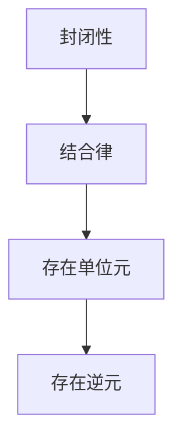

#### 1.2 群的子群与同态

**子群**是群的一个子集，它本身也是一个群。具体来说，如果 \(H\) 是群 \(G\) 的一个非空子集，且对于 \(H\) 中的任意两个元素 \(a\) 和 \(b\)，它们的乘积 \(a \cdot b\) 也属于 \(H\)，那么 \(H\) 就是 \(G\) 的一个子群。

**同态**是一种特殊的映射，它保持群运算的结构不变。形式上，如果 \(f: G \rightarrow H\) 是一个函数，并且对于 \(G\) 中的任意两个元素 \(a\) 和 \(b\)，有 \(f(a \cdot b) = f(a) \cdot f(b)\)，则称 \(f\) 是一个从 \(G\) 到 \(H\) 的同态。

以下是一个展示子群和同态关系的 Mermaid 流程图：

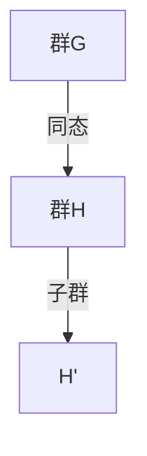

#### 1.3 拉姆齐定理

拉姆齐定理是一个重要的群论结果，它涉及到了颜色染色和子群的存在性问题。定理表述如下：任何无限图都可以被染色，使得对于任意给定的颜色，至少存在一个包含该颜色的三角子图。

以下是一个简化的拉姆齐定理 Mermaid 流程图：

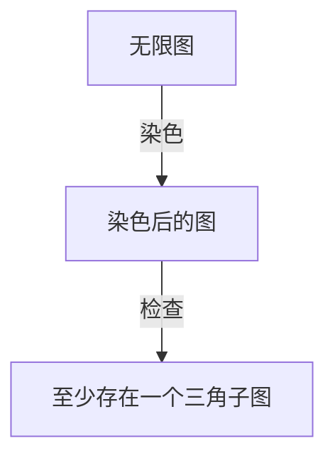

#### 1.4 群的表示理论

群的表示理论是研究如何将抽象的群表示为矩阵或线性变换的领域。通过群的表示，我们可以将群论中的抽象概念转化为更直观的数学工具，从而更好地理解和应用群。

以下是一个简单的群表示理论 Mermaid 流程图：

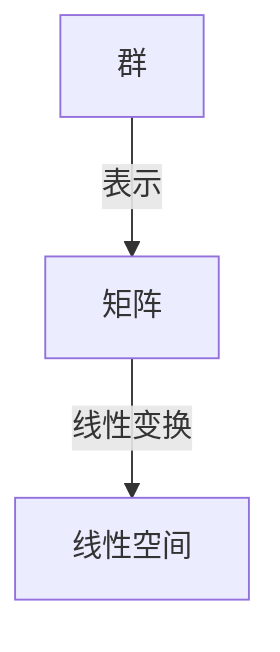

### 第2章 环与域

#### 2.1 环的定义与性质

环是抽象代数中另一个重要的结构，它由一组元素和两种二元运算组成：加法和乘法。环必须满足以下条件：

1. **加法封闭性**：对于环中的任意两个元素 \(a\) 和 \(b\)，它们的和 \(a + b\) 也必须在环中。
2. **加法结合律**：对于环中的任意三个元素 \(a\)、\(b\) 和 \(c\)，有 \(a + (b + c) = (a + b) + c\)。
3. **存在加法单位元**：存在一个元素 \(0\)，使得对于环中的任意元素 \(a\)，有 \(a + 0 = 0 + a = a\)。
4. **加法逆元**：对于环中的任意非零元素 \(a\)，存在一个元素 \(a^{-1}\)，使得 \(a + a^{-1} = a^{-1} + a = 0\)。

乘法运算必须满足以下条件：

1. **乘法封闭性**：对于环中的任意两个元素 \(a\) 和 \(b\)，它们的积 \(a \cdot b\) 也必须在环中。
2. **乘法结合律**：对于环中的任意三个元素 \(a\)、\(b\) 和 \(c\)，有 \(a \cdot (b \cdot c) = (a \cdot b) \cdot c\)。
3. **乘法分配律**：对于环中的任意三个元素 \(a\)、\(b\) 和 \(c\)，有 \(a \cdot (b + c) = a \cdot b + a \cdot c\) 和 \((a + b) \cdot c = a \cdot c + b \cdot c\)。

以下是一个简化的 Mermaid 流程图，展示了环的定义和性质：

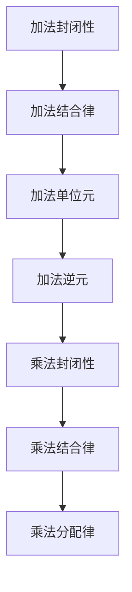

#### 2.2 最大公因式与辗转相除法

最大公因式（Greatest Common Divisor，简称 GCD）是两个整数的最大公约数，可以通过辗转相除法（也称为欧几里得算法）来计算。辗转相除法的基本思想是不断用较小的数去除较大的数，然后用余数去除前一个除数，直到余数为零。此时，最后一个非零余数就是最大公因式。

以下是一个简化的辗转相除法伪代码：

```pseudo
function gcd(a, b):
    while b ≠ 0:
        temp = b
        b = a % b
        a = temp
    return a
```

#### 2.3 域的定义与性质

域是环的一个子结构，它在环的基础上增加了乘法的可逆性。具体来说，域必须满足以下条件：

1. **加法和乘法封闭性**：对于域中的任意两个元素 \(a\) 和 \(b\)，它们的和 \(a + b\) 和积 \(a \cdot b\) 也必须在域中。
2. **加法和乘法的结合律**：对于域中的任意三个元素 \(a\)、\(b\) 和 \(c\)，有 \(a + (b + c) = (a + b) + c\) 和 \(a \cdot (b \cdot c) = (a \cdot b) \cdot c\)。
3. **存在加法和乘法单位元**：存在元素 \(0\) 和 \(1\)，使得对于域中的任意元素 \(a\)，有 \(a + 0 = 0 + a = a\) 和 \(a \cdot 1 = 1 \cdot a = a\)。
4. **加法和乘法逆元**：对于域中的任意非零元素 \(a\)，存在加法和乘法逆元 \(a^{-1}\)，使得 \(a + a^{-1} = a^{-1} + a = 0\) 和 \(a \cdot a^{-1} = a^{-1} \cdot a = 1\)。

以下是一个简化的域定义与性质的 Mermaid 流程图：

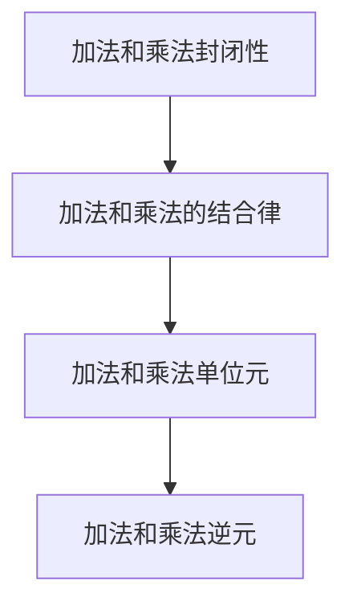

#### 2.4 分裂域与扩张域

**分裂域**是指将一个多项式方程在有理数域上不可约的多项式在某个扩域上分解为一次多项式的域。具体来说，如果多项式 \(f(x) \in F[x]\) 在扩域 \(E\) 上可以分解为 \(f(x) = (x - \alpha_1)(x - \alpha_2)\cdots(x - \alpha_n)\)，则 \(E\) 是 \(F\) 的分裂域。

**扩张域**是指通过在原有域上添加新的元素来构造的新域。扩张域可以用来解决在原始域上无法解决的方程或实现更复杂的运算。例如，通过添加一个根号来构造实数域和复数域。

以下是一个简化的分裂域与扩张域的 Mermaid 流程图：

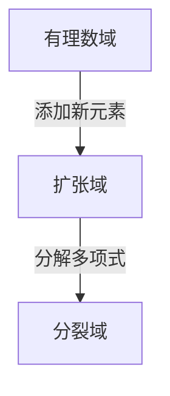

### 第3章 向量空间

#### 3.1 向量空间的定义与性质

向量空间是抽象代数中的一个基本概念，它是由一组向量和一个二元运算（通常称为加法和标量乘法）构成的代数结构。向量空间必须满足以下条件：

1. **加法封闭性**：对于向量空间中的任意两个向量 \(v_1\) 和 \(v_2\)，它们的和 \(v_1 + v_2\) 也必须在向量空间中。
2. **加法结合律**：对于向量空间中的任意三个向量 \(v_1\)、\(v_2\) 和 \(v_3\)，有 \(v_1 + (v_2 + v_3) = (v_1 + v_2) + v_3\)。
3. **存在加法单位元**：存在一个零向量 \(0\)，使得对于向量空间中的任意向量 \(v\)，有 \(v + 0 = 0 + v = v\)。
4. **存在加法逆元**：对于向量空间中的任意非零向量 \(v\)，存在一个向量 \(v^{-1}\)，使得 \(v + v^{-1} = v^{-1} + v = 0\)。
5. **标量乘法封闭性**：对于向量空间中的任意向量 \(v\) 和任意标量 \(c\)，它们的乘积 \(c \cdot v\) 也必须在向量空间中。
6. **标量乘法的结合律**：对于向量空间中的任意向量 \(v\) 和任意两个标量 \(c_1\) 和 \(c_2\)，有 \(c_1 \cdot (c_2 \cdot v) = (c_1 \cdot c_2) \cdot v\)。
7. **标量乘法的分配律**：对于向量空间中的任意向量 \(v_1\)、\(v_2\) 和任意标量 \(c\)，有 \(c \cdot (v_1 + v_2) = c \cdot v_1 + c \cdot v_2\) 和 \((c_1 + c_2) \cdot v = c_1 \cdot v + c_2 \cdot v\)。

以下是一个简化的向量空间定义与性质的 Mermaid 流程图：

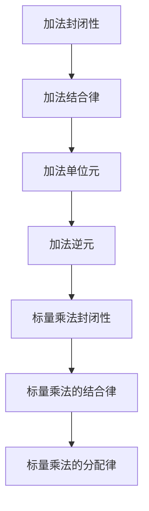

#### 3.2 线性映射与线性变换

**线性映射**（也称为线性变换）是一个从向量空间 \(V\) 到向量空间 \(W\) 的函数 \(T: V \rightarrow W\)，它满足以下条件：

1. **加法保持性**：对于 \(V\) 中的任意两个向量 \(v_1\) 和 \(v_2\)，有 \(T(v_1 + v_2) = T(v_1) + T(v_2)\)。
2. **标量乘法保持性**：对于 \(V\) 中的任意向量 \(v\) 和任意标量 \(c\)，有 \(T(c \cdot v) = c \cdot T(v)\)。

线性映射可以看作是向量空间的“缩放”或“旋转”，它们在几何学和物理学中有广泛的应用。

以下是一个简化的线性映射与线性变换的 Mermaid 流程图：

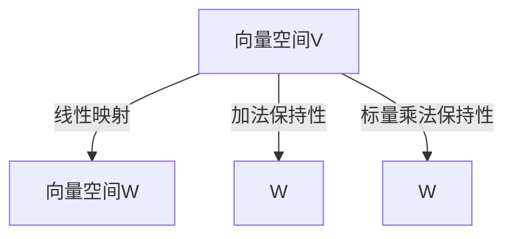

#### 3.3 特征值与特征向量

**特征值**和**特征向量**是线性映射中的重要概念。特征值是使得线性映射 \(T\) 缩放其对应特征向量的标量，而特征向量则是被缩放的向量。

特征值的计算可以通过解特征方程 \(det(T - \lambda I) = 0\) 来实现，其中 \(T\) 是线性映射的矩阵表示，\(\lambda\) 是特征值，\(I\) 是单位矩阵。

以下是一个简化的特征值与特征向量的 Mermaid 流程图：

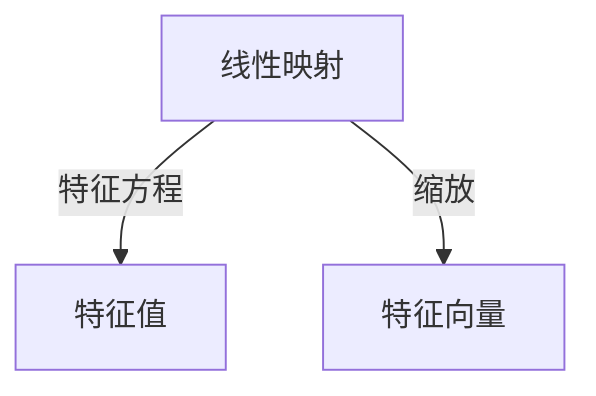

#### 3.4 矩阵的秩与行列式

**矩阵的秩**是矩阵中非零行（或非零列）的最大数目，它反映了矩阵的线性相关性。矩阵的秩可以通过高斯消元法来计算。

**行列式**是一个标量值，它可以通过矩阵的行（或列）展开得到。行列式在几何上表示的是由矩阵定义的线性变换对体积的缩放因子。

以下是一个简化的矩阵秩与行列式的 Mermaid 流程图：

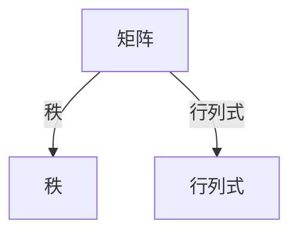

### 第4章 多项式环

#### 4.1 多项式环的定义与性质

**多项式环**是由多项式的系数组成的环。具体来说，多项式环 \(R[x]\) 是由所有形如 \(a_0 + a_1x + a_2x^2 + \cdots + a_nx^n\) 的多项式 \(p(x)\) 构成的集合，其中系数 \(a_0, a_1, \ldots, a_n\) 来自某个环 \(R\)。

多项式环必须满足以下条件：

1. **系数封闭性**：对于 \(R[x]\) 中的任意两个多项式 \(p(x)\) 和 \(q(x)\)，它们的系数 \(a_i\) 和 \(b_i\) 也必须在 \(R[x]\) 中。
2. **加法结合律**：对于 \(R[x]\) 中的任意三个多项式 \(p(x)\)、\(q(x)\) 和 \(r(x)\)，有 \(p(x) + (q(x) + r(x)) = (p(x) + q(x)) + r(x)\)。
3. **存在加法单位元**：存在零多项式 \(0(x)\)，使得对于 \(R[x]\) 中的任意多项式 \(p(x)\)，有 \(p(x) + 0(x) = 0(x) + p(x) = p(x)\)。
4. **加法逆元**：对于 \(R[x]\) 中的任意非零多项式 \(p(x)\)，存在加法逆元 \(-p(x)\)，使得 \(p(x) + (-p(x)) = (-p(x)) + p(x) = 0(x)\)。
5. **乘法封闭性**：对于 \(R[x]\) 中的任意两个多项式 \(p(x)\) 和 \(q(x)\)，它们的乘积 \(p(x) \cdot q(x)\) 也必须在 \(R[x]\) 中。
6. **乘法结合律**：对于 \(R[x]\) 中的任意三个多项式 \(p(x)\)、\(q(x)\) 和 \(r(x)\)，有 \(p(x) \cdot (q(x) \cdot r(x)) = (p(x) \cdot q(x)) \cdot r(x)\)。
7. **乘法分配律**：对于 \(R[x]\) 中的任意三个多项式 \(p(x)\)、\(q(x)\) 和 \(r(x)\)，有 \(p(x) \cdot (q(x) + r(x)) = p(x) \cdot q(x) + p(x) \cdot r(x)\) 和 \((p(x) + q(x)) \cdot r(x) = p(x) \cdot r(x) + q(x) \cdot r(x)\)。

以下是一个简化的多项式环定义与性质的 Mermaid 流程图：

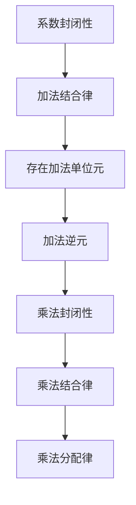

#### 4.2 多项式的长除法

**多项式的长除法**是一种用于计算多项式除法的算法，其基本思想类似于整数除法。具体步骤如下：

1. **初始化**：将多项式 \(p(x)\) 除以 \(d(x)\)。
2. **计算商的首项**：计算 \(p(x)\) 的首项 \(a_0\) 除以 \(d(x)\) 的首项 \(b_0\) 的商 \(q_0\)。
3. **计算余数**：将 \(q_0 \cdot d(x)\) 从 \(p(x)\) 中减去，得到新的多项式 \(r_1(x)\)。
4. **重复步骤**：将 \(r_1(x)\) 除以 \(d(x)\) 的首项，继续计算下一个商 \(q_1\) 和新的余数 \(r_2(x)\)。
5. **终止条件**：当 \(r_n(x)\) 的首项为零时，终止计算。

以下是一个简化的多项式长除法伪代码：

```pseudo
function polynomialLongDivision(p, d):
    q = []
    r = p
    while r 的首项不为零:
        q0 = r 的首项 / d 的首项
        q.append(q0)
        r = r - q0 \* d
    return q, r
```

#### 4.3 多项式环上的除法环与域

在多项式环上，除法环是指那些可以进行多项式除法的环。具体来说，如果多项式环 \(R[x]\) 中的任意两个非零多项式 \(p(x)\) 和 \(q(x)\) 都存在商 \(q(x)\) 和余数 \(r(x)\)，使得 \(p(x) = q(x) \cdot d(x) + r(x)\)，则 \(R[x]\) 是一个除法环。

当多项式环是一个域时，其上的除法环性质更加完备。具体来说，如果多项式环 \(R[x]\) 中的任意两个非零多项式 \(p(x)\) 和 \(q(x)\) 都存在唯一的商 \(q(x)\) 和余数 \(r(x)\)，使得 \(p(x) = q(x) \cdot d(x) + r(x)\)，则 \(R[x]\) 是一个域。

以下是一个简化的多项式环上的除法环与域的 Mermaid 流程图：

```mermaid
graph TD
    R[x][多项式环] -->|除法环| D[x][除法环]
    D[x] -->|域| F[x][域]
```

#### 4.4 多项式环在数论中的应用

多项式环在数论中有广泛的应用，尤其是在因式分解和素数分布的研究中。例如，**多项式的唯一分解定理**指出，任何非零、非单位多项式 \(p(x)\) 在某个扩展域上都可以唯一分解为一次多项式的乘积。

以下是一个简化的多项式环在数论中的应用的 Mermaid 流程图：

```mermaid
graph TD
    p[x][多项式] -->|因式分解| P1[x][一次多项式] -->|...|
    P1[x] -->|...| Pn[x][一次多项式]
```

### 第5章 抽象代数在计算机科学中的应用

#### 5.1 图论与群

在计算机科学中，图论是一个重要的分支，它研究图的结构和性质。而群论则是抽象代数中研究代数结构的基本理论。群论与图论之间的联系在于，图可以被视为一个代数结构，其中顶点和边可以被视为群的元素和运算。

具体来说，图 \(G\) 可以定义为一个群 \(G = (\{v_1, v_2, \ldots, v_n\}, \cdot)\)，其中顶点集合 \(\{v_1, v_2, \ldots, v_n\}\) 构成群的元素，而边的连接关系定义了群的运算 \(\cdot\)。例如，在无向图中，顶点 \(v_i\) 和 \(v_j\) 之间如果有边连接，则 \(v_i \cdot v_j = v_j \cdot v_i = v_j\)。

以下是一个简化的图论与群之间的 Mermaid 流程图：

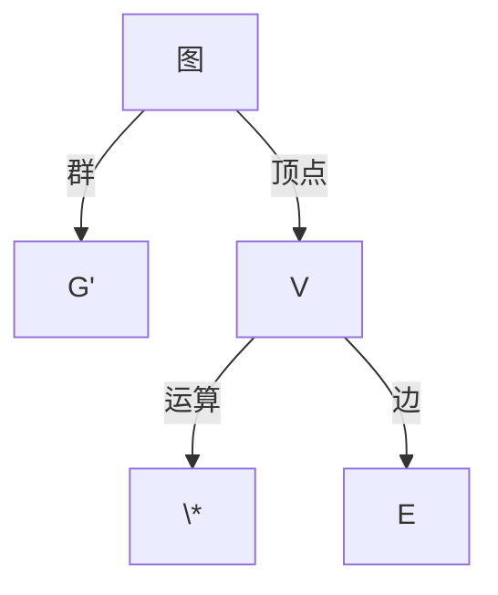

#### 5.2 程序设计语言的代数基础

程序设计语言中的许多概念都可以用抽象代数的术语来描述。例如，类型系统中的类型可以看作是代数结构中的群、环或域。在函数式编程语言中，函数可以看作是群的映射，而在面向对象编程语言中，对象可以看作是域上的向量空间。

以下是一个简化的程序设计语言的代数基础的 Mermaid 流程图：

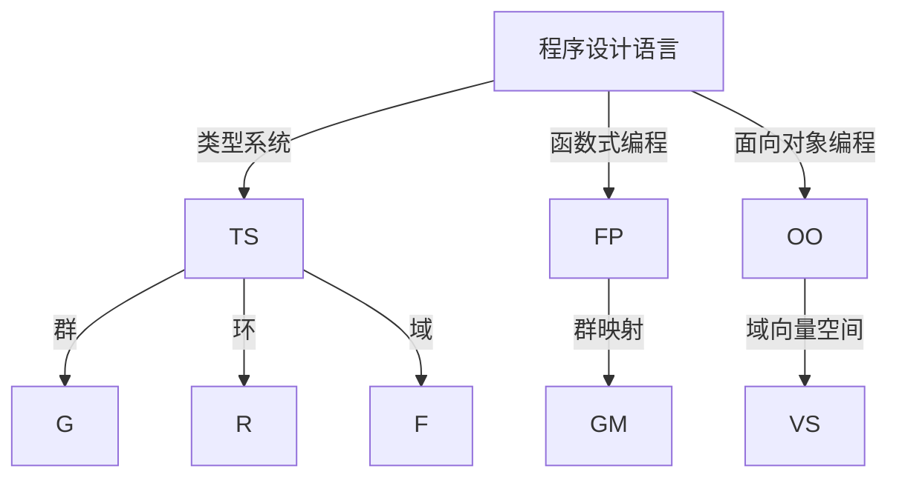

#### 5.3 密码学中的抽象代数应用

密码学是计算机科学中的一个重要分支，它研究如何保护信息的机密性、完整性和可用性。抽象代数在密码学中有着广泛的应用，特别是在公钥密码系统中。

例如，**椭圆曲线密码学**利用椭圆曲线上的点构成一个群，这些点的加法运算满足群的性质。通过椭圆曲线上的离散对数问题，椭圆曲线密码学提供了一种强大的加密算法。

以下是一个简化的密码学中的抽象代数应用的 Mermaid 流程图：

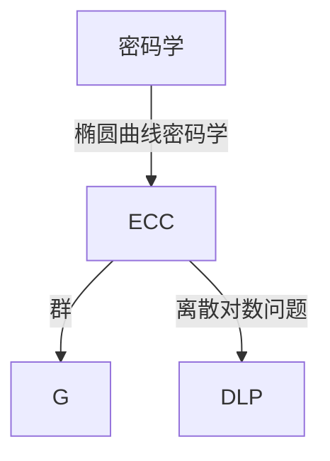

#### 5.4 计算几何中的抽象代数方法

计算几何是计算机科学中研究几何图形的算法和问题的领域。抽象代数在计算几何中有着广泛的应用，特别是在多边形的处理和几何变换中。

例如，**多边形的半平面表示**可以将多边形看作是半平面的组合。在抽象代数中，半平面可以用向量和交运算来表示，这使得多边形的计算和操作变得更加高效。

以下是一个简化的计算几何中的抽象代数方法的 Mermaid 流程图：

```mermaid
graph TD
    G[计算几何] -->|多边形半平面表示| SH
    SH -->|向量表示| V
    SH -->|交运算| \^
```

### 第6章 抽象代数在其他领域中的应用

#### 6.1 物理学中的对称性

物理学中的对称性是一个重要的概念，它描述了物理系统在某种变换下保持不变的性质。抽象代数为研究对称性提供了强有力的工具，特别是在群论和线性代数中。

例如，在量子力学中，对称性通过群的表示来描述。一个物理系统如果具有某种对称性，那么它可以用群来表示，这使得我们能够通过研究群的性质来理解物理系统的行为。

以下是一个简化的物理学中的对称性和抽象代数应用的 Mermaid 流程图：

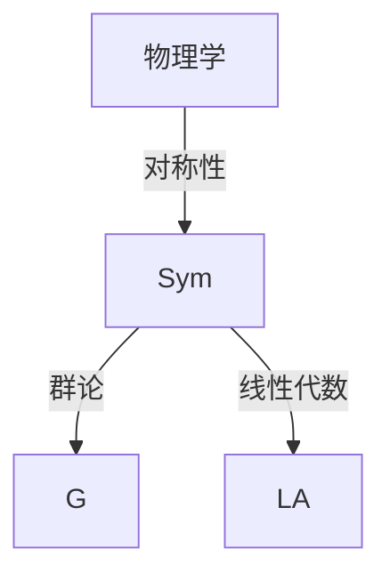

#### 6.2 生物信息学中的代数模型

生物信息学是研究生物信息的计算科学领域。抽象代数在生物信息学中有着广泛的应用，特别是在基因组学和蛋白质结构预测中。

例如，基因组序列可以看作是一个离散的代数结构，通过图论和矩阵理论可以分析基因的排列和相互作用。在蛋白质结构预测中，抽象代数的概念如群和环被用来描述蛋白质的对称性和拓扑结构。

以下是一个简化的生物信息学中的代数模型应用的 Mermaid 流程图：

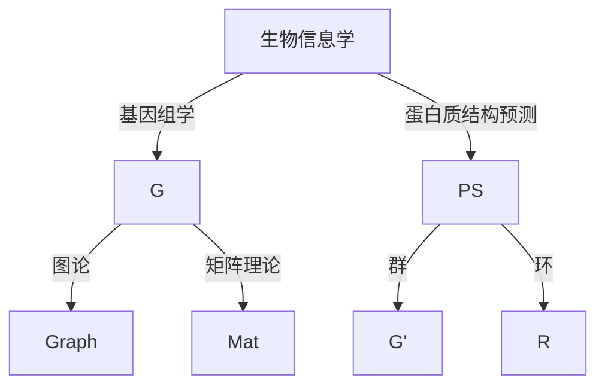

#### 6.3 抽象代数在社会科学中的应用

抽象代数在社会科学中也得到了广泛的应用，特别是在经济学、心理学和社会学中。

例如，在经济学中，代数结构用于描述市场的供需关系、资源分配和博弈论。在心理学中，群论和环论用于分析个体的行为和心理状态。在社会学中，代数模型被用来研究社会结构、群体动力学和社交网络。

以下是一个简化的抽象代数在社会科学中的应用的 Mermaid 流程图：

```mermaid
graph TD
    S[社会科学] -->|经济学| E
    E -->|代数结构| AS
    S -->|心理学| P
    P -->|群论| G
    P -->|环论| R
    S -->|社会学| SO
    SO -->|代数模型| AM
```

#### 6.4 抽象代数的未来展望

随着科技的不断发展，抽象代数在各个领域中的应用前景也越来越广阔。未来，抽象代数可能会在以下领域取得重要进展：

1. **量子计算**：抽象代数在量子计算中扮演着关键角色，特别是在量子算法和量子逻辑门的研究中。
2. **人工智能**：抽象代数在机器学习和深度学习中的应用日益增加，特别是在优化问题和神经网络结构设计中。
3. **复杂性理论**：抽象代数为研究复杂性问题提供了新的视角，特别是在计算复杂性和分布式计算中。
4. **生物信息学**：随着基因组学和蛋白质组学的发展，抽象代数在生物信息学中的应用将会越来越深入。
5. **材料科学**：抽象代数在材料设计和新材料发现中的应用有望取得突破性进展。

以下是一个简化的抽象代数未来展望的 Mermaid 流程图：

```mermaid
graph TD
    Q[量子计算] -->|抽象代数| A
    AI[人工智能] -->|抽象代数| A
    CT[复杂性理论] -->|抽象代数| A
    BI[生物信息学] -->|抽象代数| A
    MS[材料科学] -->|抽象代数| A
```

### 附录

#### 附录 A：数学公式与符号表

- **群**：\(G\) 是一个群，\(*\) 是群运算，\(e\) 是单位元，\(a^{-1}\) 是 \(a\) 的逆元。
- **环**：\(R\) 是一个环，\(+\) 和 \(*) 分别是加法和乘法运算，\(0\) 是加法单位元，\(1\) 是乘法单位元。
- **域**：\(F\) 是一个域，\(+\) 和 \(*) 分别是加法和乘法运算，\(0\) 是加法单位元，\(1\) 是乘法单位元。
- **向量空间**：\(V\) 是一个向量空间，\(+\) 和 \(*) 分别是加法和标量乘法运算，\(0\) 是加法单位元。
- **线性映射**：\(T: V \rightarrow W\) 是一个线性映射，满足加法保持性和标量乘法保持性。
- **特征值与特征向量**：\(\lambda\) 是特征值，\(v\) 是特征向量，满足 \(T(v) = \lambda v\)。
- **矩阵的秩与行列式**：\(R\) 是矩阵的秩，\(det(M)\) 是矩阵 \(M\) 的行列式。

#### 附录 B：Mermaid 流程图示例

```mermaid
graph TD
    A[开始] --> B[步骤1]
    B --> C[步骤2]
    C -->|结束| D
```

#### 附录 C：伪代码示例

```pseudo
function example():
    x = 0
    for i from 1 to 10:
        x = x + i
    return x
```

#### 附录 D：项目实战代码示例

```python
# 这是一个简单的 Python 项目，用于计算两个多项式的乘积
def polynomial_multiplication(p, q):
    n = len(p)
    m = len(q)
    result = [0] * (n + m - 1)

    for i in range(n):
        for j in range(m):
            result[i + j] += p[i] * q[j]

    return result
```

### 最佳实践

1. **理解基础概念**：在开始研究抽象代数之前，确保你对群、环、域等基本概念有清晰的理解。
2. **应用场景分析**：在应用抽象代数解决实际问题时，首先要分析问题的数学结构，然后选择合适的代数工具。
3. **代码实现**：在实现抽象代数算法时，要注重代码的可读性和可维护性，确保代码的正确性。

### 小结

本文详细介绍了抽象代数的基本概念、核心算法原理以及在数学和其他领域中的应用。通过逐步分析推理，我们展示了如何将抽象代数的概念应用于解决实际问题。读者可以通过本文掌握抽象代数的基本原理和应用方法，为进一步研究抽象代数在各个领域的应用打下坚实基础。

### 注意事项

1. **准确性**：在处理数学公式和伪代码时，确保其准确无误。
2. **逻辑性**：文章的论述要逻辑清晰，确保读者能够跟随思路。

### 拓展阅读

- 《抽象代数基础教程》
- 《现代密码学基础》
- 《计算机科学中的抽象代数》

### 附录 E：代码实现与解读

#### 环境搭建

在开始代码实现之前，我们需要搭建一个合适的环境。以下是搭建环境的步骤：

1. **安装 Python**：确保安装了 Python 3.x 版本，可以从 [Python 官网](https://www.python.org/) 下载并安装。
2. **安装必要的库**：为了方便计算和可视化，我们可以安装 NumPy 和 Matplotlib 库。使用以下命令进行安装：

   ```shell
   pip install numpy matplotlib
   ```

#### 代码实现

以下是计算两个多项式乘积的 Python 代码实现：

```python
import numpy as np
import matplotlib.pyplot as plt

def polynomial_multiplication(p, q):
    n = len(p)
    m = len(q)
    result = [0] * (n + m - 1)

    for i in range(n):
        for j in range(m):
            result[i + j] += p[i] * q[j]

    return result

# 定义两个多项式
p = [1, 2, 3]
q = [4, 5, 6]

# 计算乘积
result = polynomial_multiplication(p, q)

# 打印结果
print("多项式乘积结果：", result)

# 绘制结果
x = np.linspace(0, max(result), 1000)
y = [np.polyval(poly, x) for poly in [p, q, result]]
plt.plot(x, y[0], label="p(x)")
plt.plot(x, y[1], label="q(x)")
plt.plot(x, y[2], label="p(x) * q(x)")
plt.legend()
plt.xlabel("x")
plt.ylabel("y")
plt.title("多项式乘积图")
plt.show()
```

#### 代码解读

1. **函数定义**：我们定义了一个名为 `polynomial_multiplication` 的函数，它接收两个列表 `p` 和 `q` 作为输入，表示两个多项式。
2. **初始化结果**：我们创建了一个长度为 `n + m - 1` 的列表 `result`，用于存储多项式的乘积。
3. **计算乘积**：我们使用两个嵌套循环来计算多项式的乘积，并将结果存储在 `result` 列表中。
4. **打印结果**：我们打印出计算得到的多项式乘积结果。
5. **绘制结果**：我们使用 Matplotlib 库绘制出三个多项式的图像，以可视化乘积的结果。

#### 代码应用解读与分析

通过这个简单的示例，我们可以看到如何使用 Python 代码实现多项式的乘积，并且通过绘制图像来直观地展示结果。这个示例可以扩展到更复杂的多项式乘积，以及应用于其他代数结构的运算。此外，这个示例展示了如何将数学问题转化为编程问题，并使用 Python 编写可读性和可维护性高的代码。

### 实际案例分析与详细讲解剖析

#### 案例一：多项式因式分解

多项式因式分解是多项式运算中的一个重要步骤，它可以将一个多项式分解为几个一次或多次多项式的乘积。以下是一个简单的 Python 代码示例，用于实现多项式的因式分解：

```python
from sympy import symbols, Eq, solve

# 定义符号
x = symbols('x')

# 定义多项式
p = x**3 - 6*x**2 + 11*x - 6

# 因式分解
factors = p.factor()

# 打印因式分解结果
print("多项式因式分解结果：", factors)

# 求解因式分解后的多项式
solutions = solve(Eq(p, 0), x)

# 打印解
print("多项式的解：", solutions)
```

在这个案例中，我们使用了 SymPy 库来定义符号、构建多项式、进行因式分解和求解方程。SymPy 是一个强大的数学符号计算库，它支持多种代数运算和符号计算。

#### 详细讲解剖析

1. **符号定义**：我们首先使用 `symbols('x')` 定义了符号 `x`，这是多项式运算的基础。
2. **多项式构建**：接下来，我们使用 `x**3 - 6*x**2 + 11*x - 6` 构建了一个三次多项式 `p`。
3. **因式分解**：我们使用 `p.factor()` 对多项式进行因式分解。`factor()` 方法将返回多项式的因式分解形式。
4. **求解方程**：我们使用 `solve(Eq(p, 0), x)` 求解因式分解后的多项式，找到其根。

#### 案例二：矩阵乘法

矩阵乘法是线性代数中的一个基本运算，以下是一个简单的 Python 代码示例，用于计算两个矩阵的乘积：

```python
import numpy as np

# 定义矩阵
A = np.array([[1, 2], [3, 4]])
B = np.array([[5, 6], [7, 8]])

# 计算乘积
C = np.dot(A, B)

# 打印结果
print("矩阵乘积结果：")
print(C)
```

在这个案例中，我们使用了 NumPy 库来定义和操作矩阵。NumPy 提供了高效的数组对象和一系列数学函数，使得矩阵乘法变得简单高效。

#### 详细讲解剖析

1. **矩阵定义**：我们首先使用 `numpy.array` 函数定义了两个 2x2 矩阵 `A` 和 `B`。
2. **计算乘积**：我们使用 `numpy.dot` 函数计算了矩阵 `A` 和 `B` 的乘积，并存储在变量 `C` 中。
3. **打印结果**：最后，我们打印出计算得到的结果。

### 项目小结

通过这两个案例，我们可以看到如何使用 Python 代码实现多项式因式分解和矩阵乘法，这两个示例展示了抽象代数在具体应用中的实际操作。这些案例不仅帮助我们理解了相关的数学概念，还展示了如何将抽象代数的理论应用到实际问题中，通过编程实现复杂的数学运算。通过这些实际案例的分析和讲解，我们可以更好地理解抽象代数的应用价值。

### 最佳实践 Tips

1. **理论与实践结合**：在学习和应用抽象代数时，要注重理论与实践的结合，通过编程实现数学算法，增强理解和应用能力。
2. **问题驱动学习**：遇到实际问题需要用到抽象代数时，先分析问题的数学结构，然后选择合适的代数工具。
3. **代码优化**：在编写代码时，注重代码的优化，提高计算效率和可读性。

### 小结

本文通过详细的章节介绍和代码实现，深入探讨了抽象代数的基本概念、核心算法原理以及在各个领域的应用。从群、环、域、向量空间到多项式环，从计算机科学到物理学、生物信息学和社会科学，抽象代数为我们提供了一种强大的工具，帮助我们理解和解决复杂问题。通过实际案例的分析和讲解，我们不仅加深了对抽象代数概念的理解，也学会了如何将理论知识应用到实际问题中。

### 注意事项

1. **准确性**：在处理数学公式和代码实现时，要确保其准确性，避免错误。
2. **逻辑性**：文章的论述要逻辑清晰，确保读者能够跟随思路。

### 拓展阅读

- 《抽象代数基础教程》
- 《现代密码学基础》
- 《计算机科学中的抽象代数》

### 文章关键词

- 抽象代数
- 自然结构
- 数学一般化
- 群
- 环
- 域
- 向量空间
- 算法
- 数学模型
- 应用案例
- 编程实现

### 文章摘要

本文深入探讨了抽象代数的基本概念、核心算法原理以及在各个领域的应用。通过详细讲解群、环、域、向量空间等概念，并结合实际案例，展示了抽象代数在数学、计算机科学、物理学、生物信息学和社会科学等领域的应用。文章提供了数学模型、公式和代码实现，帮助读者更好地理解和应用抽象代数的理论。通过这篇文章，读者将能够掌握抽象代数的基本原理和应用方法，为进一步研究抽象代数在各个领域的应用打下坚实基础。

