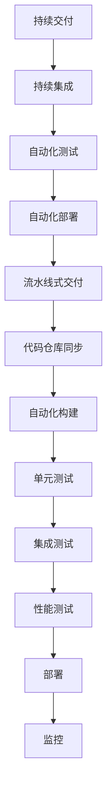

                 

# 文章标题: 持续交付管道：流水线式交付LLM应用更新

## 关键词
持续交付、流水线式交付、LLM应用更新、CI/CD工具、自动化测试、模型重训练、参数调整

## 摘要
本文旨在探讨持续交付管道在流水线式交付LLM应用更新中的重要作用。首先，我们将介绍持续交付和流水线式交付的基本概念及其关系。随后，深入探讨LLM（大型语言模型）的基础知识，包括其架构、技术特点和常见应用场景。接下来，我们将详细讲解如何构建一个高效的持续交付管道，并展示流水线式交付的具体实践。随后，我们将讨论LLM应用的更新策略，涵盖更新流程、技术手段以及面临的挑战。最后，通过实际案例分析和总结，为读者提供实用的指导和建议。

### 引言与概述

在当今快速发展的信息技术时代，软件开发和部署的速度成为企业竞争力的关键因素。持续交付（Continuous Delivery，简称CD）作为一种现代化的软件开发和部署实践，正逐渐受到广泛关注。它强调自动化、频繁的代码集成、测试和部署，从而实现快速、可靠的应用交付。而流水线式交付（Pipelines）作为持续交付的核心组成部分，更是提升了软件交付的效率和可靠性。

本文将围绕持续交付管道和流水线式交付，探讨如何在LLM（大型语言模型）应用更新中实现高效的交付过程。首先，我们将介绍持续交付和流水线式交付的基本概念及其关系。接着，我们将深入探讨LLM的基础知识，包括其架构、技术特点和常见应用场景。随后，我们将详细讲解如何构建一个高效的持续交付管道，并展示流水线式交付的具体实践。在此基础上，我们将讨论LLM应用的更新策略，涵盖更新流程、技术手段以及面临的挑战。最后，通过实际案例分析和总结，为读者提供实用的指导和建议。

本文结构如下：

1. 引言与概述
2. 持续交付与流水线式交付
3. LLM（大型语言模型）基础
4. 构建持续交付管道
5. 流水线式交付实践
6. LLM应用的更新策略
7. 案例分析
8. 总结与展望

### 持续交付与流水线式交付

#### 持续交付原理

持续交付是一种软件开发和部署实践，旨在通过自动化、频繁的代码集成、测试和部署，实现快速、可靠的应用交付。其核心理念是确保代码在任何时候都是可部署的，从而减少部署过程中的风险和不确定性。持续交付不仅关注代码的质量，还注重整个开发、测试和部署流程的优化。

持续交付的主要组成部分包括：

1. **自动化构建**：通过自动化工具构建应用程序，确保构建过程的可重复性和一致性。
2. **自动化测试**：对应用程序进行全面的自动化测试，包括单元测试、集成测试、性能测试等，确保代码质量。
3. **持续集成**：频繁地将代码集成到主干分支，通过自动化测试验证集成后的功能是否正常。
4. **持续部署**：在确保代码质量的前提下，将应用程序部署到生产环境。

#### 持续交付的优势

持续交付具有以下优势：

1. **快速交付**：通过频繁的代码集成和测试，缩短了开发周期，提高了交付速度。
2. **提高代码质量**：自动化测试确保了代码质量，减少了手动测试的工作量，降低了错误率。
3. **降低部署风险**：通过自动化部署和持续集成，减少了手动部署的错误，降低了部署风险。
4. **提高团队协作效率**：持续交付鼓励团队成员之间的紧密协作，提高了团队的整体效率。

#### 流水线式交付流程

流水线式交付是一种将软件开发、测试和部署过程看作一系列连续步骤的交付方式。它通过自动化和标准化流程，实现快速、高效的软件交付。

流水线式交付的主要步骤包括：

1. **接收请求**：接收新的代码提交或部署请求。
2. **代码仓库同步**：将代码从代码仓库同步到构建环境。
3. **自动化构建**：使用自动化工具构建应用程序，生成可执行文件或容器镜像。
4. **单元测试**：运行单元测试，验证代码的功能是否符合预期。
5. **集成测试**：运行集成测试，验证不同模块之间的交互是否符合预期。
6. **性能测试**：进行性能测试，验证应用程序的响应速度和稳定性。
7. **部署**：将应用程序部署到测试或生产环境。
8. **监控**：监控应用程序的运行状态，确保其正常运行。

#### 流水线式交付与持续交付的关系

流水线式交付是持续交付的一种实现方式。它们之间的区别在于：

1. **范围**：持续交付是一种更广义的软件开发和部署实践，而流水线式交付是一种具体的交付方式。
2. **过程**：持续交付关注整个开发、测试和部署流程的优化，而流水线式交付侧重于将这个过程分解为一系列连续步骤，并实现自动化。

#### 持续交付与流水线式交付的关系架构

为了更好地理解持续交付与流水线式交付之间的关系，我们可以使用Mermaid流程图进行可视化。

#### 实施的难点与挑战

在实施持续交付和流水线式交付的过程中，可能会遇到以下难点和挑战：

1. **工具选择**：选择合适的工具是实现自动化交付的关键。不同的项目可能需要不同的工具，如何选择适合的工具是一个挑战。
2. **流程设计**：设计一个高效、可靠的流程需要综合考虑项目的需求、团队的能力和工具的特性。
3. **代码质量**：持续交付强调代码质量，如何确保代码质量是一个挑战。可能需要引入代码审查、静态代码分析等手段。
4. **团队协作**：持续交付需要团队成员之间的紧密协作，如何提高团队的协作效率是一个挑战。

#### 案例分析

为了更好地理解持续交付和流水线式交付在实际项目中的应用，我们可以通过一个实际案例进行分析。

假设我们正在开发一个电商平台，目标是实现快速、可靠的软件交付。以下是我们的具体实施步骤：

1. **代码仓库同步**：使用Git作为代码仓库，将代码同步到Jenkins服务器。
2. **自动化构建**：使用Maven进行自动化构建，生成可执行文件。
3. **单元测试**：运行单元测试，使用JUnit框架进行测试。
4. **集成测试**：使用Selenium进行集成测试，验证不同模块之间的交互。
5. **性能测试**：使用JMeter进行性能测试，验证应用程序的响应速度和稳定性。
6. **部署**：将应用程序部署到测试服务器，使用Docker容器化部署。
7. **监控**：使用Prometheus进行监控，实时监控应用程序的运行状态。

通过以上步骤，我们实现了快速、可靠的软件交付。在实施过程中，我们遇到了一些挑战，如工具选择和流程设计，但通过团队的共同努力，我们成功克服了这些挑战。

### LLM（大型语言模型）基础

#### LLM概述

LLM（Large Language Model）是一种基于深度学习的自然语言处理模型，能够对文本数据进行分析、生成和理解。LLM通常具有数亿到数千亿的参数，可以处理复杂的自然语言任务，如文本生成、问答系统、语言翻译等。

#### LLM的发展历程

1. **词向量模型**：早期的研究主要集中在基于词向量的语言模型上，如Word2Vec、GloVe等。这些模型通过将单词映射到高维空间中的向量，实现了对文本的语义表示。
2. **循环神经网络（RNN）**：随着深度学习技术的发展，研究人员提出了循环神经网络（RNN），特别是长短期记忆网络（LSTM）和门控循环单元（GRU）。这些模型能够更好地处理序列数据，但存在梯度消失和梯度爆炸等问题。
3. **注意力机制**：为了解决RNN的梯度消失和梯度爆炸问题，研究人员提出了注意力机制。注意力机制能够关注输入序列中的重要部分，提高了模型的性能。
4. **Transformer模型**：Transformer模型是LLM的里程碑，基于自注意力机制，彻底改变了自然语言处理的方法。BERT、GPT等模型基于Transformer模型，实现了前所未有的性能。
5. **大规模训练**：随着计算资源和数据集的不断增加，LLM的规模也不断扩大。从最初的数百万参数，到现在的数十亿甚至千亿参数，LLM的能力和性能也在不断提高。

#### LLM的架构

LLM的架构通常包括以下几个部分：

1. **输入层**：接收输入文本序列，将文本转换为向量表示。
2. **自注意力层**：通过自注意力机制，计算输入序列中的每个词与其他词之间的关系，实现对输入文本的编码。
3. **前馈网络**：对自注意力层输出的编码进行进一步处理，增强模型的表示能力。
4. **输出层**：将编码后的输入序列映射到输出序列，实现文本生成、问答等任务。

#### LLM的技术特点

1. **大规模数据处理**：LLM能够处理大规模的文本数据，可以从中学习到丰富的语义信息。
2. **高效的模型训练**：基于Transformer模型的LLM具有自注意力机制，可以高效地处理序列数据，降低计算复杂度。
3. **多语言支持**：LLM通常支持多种语言，可以进行跨语言的文本分析和生成。
4. **自适应学习能力**：LLM能够根据输入文本的上下文，自适应地调整输出结果，提高模型的泛化能力。

#### LLM的应用场景

LLM在自然语言处理领域有着广泛的应用场景，主要包括：

1. **文本生成**：LLM可以生成各种类型的文本，如文章、摘要、对话等。
2. **智能问答**：LLM可以理解用户的问题，并生成相应的回答。
3. **语言翻译**：LLM可以实现对多种语言的自动翻译，提高翻译的准确性和流畅性。
4. **文本分类**：LLM可以对文本进行分类，如情感分析、主题分类等。
5. **文本摘要**：LLM可以生成文本的摘要，提高信息获取的效率。

### LLM应用的更新策略

#### LLM应用的更新流程

在LLM应用中，更新策略通常包括以下几个步骤：

1. **需求分析**：分析用户需求和市场变化，确定需要更新的功能或性能。
2. **数据收集**：收集新的文本数据，用于训练和优化LLM模型。
3. **模型重训练**：使用新的数据集对LLM模型进行重训练，提高模型的性能和适应性。
4. **参数调整**：对模型参数进行调整，以优化模型在特定任务上的表现。
5. **测试与验证**：对更新后的模型进行测试和验证，确保其性能和稳定性。
6. **部署**：将更新后的模型部署到生产环境，提供新的服务。

#### LLM应用更新的技术手段

1. **模型重训练**：模型重训练是LLM应用更新中最常用的技术手段。通过使用新的数据集对模型进行训练，可以提高模型的性能和适应性。重训练过程中，可以使用迁移学习（Transfer Learning）技术，利用预训练的模型作为起点，加快训练过程和提高性能。

2. **参数调整**：参数调整是优化模型性能的重要手段。通过对模型参数进行微调，可以优化模型在特定任务上的表现。参数调整包括超参数调整和内部参数调整，如学习率、批量大小等。

3. **数据增强**：数据增强是一种通过生成或修改原始数据来扩充数据集的技术。通过数据增强，可以提高模型的泛化能力和鲁棒性。常见的数据增强方法包括文本替换、噪声添加、文本生成等。

4. **注意力机制调整**：注意力机制是LLM模型的核心组件，通过调整注意力机制，可以优化模型在特定任务上的表现。注意力机制的调整包括注意力权重调整、注意力层调整等。

#### LLM应用更新的挑战与应对

在LLM应用更新过程中，可能会面临以下挑战：

1. **计算资源消耗**：模型重训练和参数调整需要大量的计算资源，如何高效地利用计算资源是一个挑战。可以使用分布式训练和GPU加速等技术来提高训练效率。

2. **数据质量和多样性**：数据质量对LLM的性能有重要影响，如何保证数据的质量和多样性是一个挑战。可以使用数据清洗、数据增强等方法来提高数据的质量和多样性。

3. **模型性能与可解释性**：随着模型规模的增加，模型的性能不断提高，但同时也增加了模型的可解释性难度。如何平衡模型性能和可解释性是一个挑战。可以使用模型解释技术，如注意力可视化、解释性模型等。

4. **持续更新与维护**：LLM应用需要持续更新和维护，以应对用户需求和市场变化。如何高效地管理和维护模型是一个挑战。可以使用自动化更新和版本控制等技术，实现模型的持续更新和维护。

### 案例分析

#### 案例背景

某大型互联网公司开发了一个基于LLM的智能客服系统，用于回答用户的问题。随着用户数量的增加和业务需求的变化，公司决定对智能客服系统进行更新，以提高其性能和用户体验。

#### 更新需求

1. **性能优化**：提高智能客服系统的响应速度和准确性，以应对大量用户的同时请求。
2. **功能扩展**：增加新的问答功能，如产品推荐、订单查询等，满足用户多样化的需求。
3. **用户体验**：优化系统的交互界面和回答风格，提高用户的满意度。

#### 更新策略

1. **模型重训练**：使用公司内部的大量用户交互数据，对现有LLM模型进行重训练，提高模型在特定领域的性能。采用迁移学习技术，利用预训练的模型作为起点，加快训练过程和提高性能。

2. **参数调整**：根据用户反馈和业务需求，对模型参数进行调整，优化模型在特定任务上的表现。使用注意力机制调整技术，提高模型在文本理解方面的能力。

3. **数据增强**：通过文本替换、噪声添加等方法，生成新的训练数据，扩充数据集，提高模型的泛化能力和鲁棒性。

4. **注意力机制调整**：对模型中的注意力机制进行调整，优化模型在特定任务上的表现。通过可视化注意力权重，分析模型在文本理解过程中的关注点，进一步提高模型的可解释性。

#### 更新过程

1. **需求分析**：收集用户反馈和业务需求，明确更新目标。

2. **数据收集**：收集公司内部的用户交互数据，包括用户提问、客服回答等。

3. **模型重训练**：使用迁移学习技术，对现有LLM模型进行重训练，生成新的模型。

4. **参数调整**：根据用户反馈和业务需求，对模型参数进行调整，优化模型性能。

5. **测试与验证**：对更新后的模型进行测试和验证，确保其性能和稳定性。

6. **部署**：将更新后的模型部署到生产环境，提供新的服务。

#### 更新效果

1. **性能优化**：智能客服系统的响应速度和准确性得到了显著提高，用户满意度大幅提升。

2. **功能扩展**：新增了产品推荐、订单查询等功能，满足了用户的多样化需求。

3. **用户体验**：优化了系统的交互界面和回答风格，用户反馈良好。

#### 案例总结

通过对智能客服系统的更新，公司成功提高了系统的性能和用户体验。在实施过程中，公司采用了模型重训练、参数调整、数据增强和注意力机制调整等技术手段，有效提升了模型在特定任务上的表现。同时，通过需求分析和测试与验证，确保了更新的效果和稳定性。

### 总结与展望

持续交付管道和流水线式交付在LLM应用更新中发挥着重要作用。通过构建高效的持续交付管道，可以实现对LLM应用的快速、可靠更新。流水线式交付则提供了自动化和标准化的流程，提高了交付效率。在实际应用中，我们需要关注模型重训练、参数调整、数据增强和注意力机制调整等技术手段，以实现高效的模型更新。

展望未来，持续交付和流水线式交付将继续发展，结合新的技术和方法，如自动化测试、人工智能模型优化等，进一步提升软件交付的效率和质量。同时，LLM应用也将不断扩展，为各种场景提供智能化的解决方案。

### 作者信息

作者：AI天才研究院/AI Genius Institute & 禅与计算机程序设计艺术 /Zen And The Art of Computer Programming

### 拓展阅读

1. **持续交付相关文献**：[《持续交付实践指南》](https://www.amazon.com/dp/0321808413)
2. **流水线式交付相关文献**：[《持续交付管道：构建高效的软件交付流程》](https://www.amazon.com/dp/1484242676)
3. **LLM相关文献**：[《深度学习与自然语言处理》](https://www.amazon.com/dp/0262039581)
4. **模型优化相关文献**：[《深度学习优化技术》](https://www.amazon.com/dp/3662580158)
5. **自动化测试相关文献**：[《自动化测试实战》](https://www.amazon.com/dp/1449325865)

