                 

### 持续集成与持续部署（CI/CD）在LLM应用中的实施

#### 关键词
- 持续集成（CI）
- 持续部署（CD）
- 大型语言模型（LLM）
- 自动化流程
- 开发者体验
- 部署策略

#### 摘要
本文将探讨持续集成（CI）和持续部署（CD）在大型语言模型（LLM）应用开发中的实施策略。我们首先介绍CI/CD的基本概念和其在软件开发中的作用，接着分析LLM应用的特殊性及其对CI/CD流程的挑战。随后，本文将详细讲解CI和CD的原理，结合LLM应用特点，设计适用于LLM的CI/CD流程。最后，通过实际案例展示CI/CD在LLM应用中的成功实践，并提出未来展望和改进建议。

---

## 引言

### 1.1 CI/CD的概念与价值

持续集成（Continuous Integration，简称CI）和持续部署（Continuous Deployment，简称CD）是现代软件开发中不可或缺的实践。CI指的是开发者在每次提交代码时，都会自动触发一系列的构建和测试过程，确保新代码不会破坏现有的功能。CD则是在CI的基础上，自动将经过验证的代码部署到生产环境，实现快速、安全的更新。

CI/CD的核心价值在于：

1. **提高开发效率**：通过自动化构建和测试，减少手动操作，提高代码交付速度。
2. **降低风险**：早期发现并修复问题，减少代码质量隐患。
3. **增强团队协作**：持续集成鼓励频繁提交和代码评审，提高团队沟通和协作。
4. **提高系统稳定性**：自动化部署确保每次更新都是经过验证的，减少人为错误。

### 1.2 LLM应用背景与挑战

大型语言模型（LLM）如GPT-3、BERT等，因其强大的语义理解和生成能力，在自然语言处理、智能问答、文本生成等领域具有重要应用。然而，LLM的开发和部署面临以下挑战：

1. **模型复杂度高**：LLM涉及大量的参数和计算，模型训练和验证过程复杂。
2. **数据依赖性强**：模型性能高度依赖训练数据的质量和多样性。
3. **资源需求大**：训练和推理过程中需要大量的计算资源和存储空间。
4. **部署难度高**：LLM的部署需要考虑模型版本管理、性能优化和安全性等问题。

### 1.3 书籍结构概述

本书记内容结构如下：

- **第1章 引言**：介绍CI/CD的基本概念和价值，以及LLM应用背景和挑战。
- **第2章 持续集成（CI）基础知识**：讲解CI的基本原理、工具介绍、流程设计和与LLM的整合应用。
- **第3章 持续部署（CD）基础知识**：介绍CD的基本原理、与CI的关系、流程设计和与LLM的整合应用。
- **第4章 LLM模型管理**：探讨模型版本管理、监控与优化、迭代策略以及与CI/CD的整合。
- **第5章 CI/CD工具与实践**：详细讲解Jenkins、GitLab CI和GitHub Actions等工具在LLM应用中的实践案例。
- **第6章 持续交付与持续部署案例分析**：分析几个成功案例，展示CI/CD在LLM应用中的实施效果。
- **第7章 未来展望**：讨论CI/CD在LLM应用中的发展趋势、挑战和解决方案。
- **第8章 附录**：提供相关工具资源和参考文献。

通过本书的阅读，读者将深入了解CI/CD在LLM应用中的具体实施策略，掌握相关工具的使用方法，并能够针对实际项目进行有效的CI/CD流程设计和优化。

---

### 持续集成（CI）基础知识

#### 2.1 CI的基本原理

持续集成（CI）是一种软件开发实践，通过将代码变化频繁地集成到共享的主代码库中，并自动进行构建、测试和验证，确保代码库始终处于可运行状态。CI的基本原理包括以下几个关键步骤：

1. **代码提交**：开发者将代码更改提交到版本控制系统。
2. **构建触发**：每次代码提交都会触发CI系统，自动执行构建过程。
3. **构建过程**：构建过程包括编译代码、运行测试用例、生成文档等。
4. **测试**：构建完成后，CI系统会运行一系列预定义的测试用例，包括单元测试、集成测试和性能测试等。
5. **反馈**：测试结果会被记录并反馈给开发者，如果测试失败，CI系统会阻止代码合并到主分支。

**核心概念与联系**：

为了更清晰地理解CI的核心概念和流程，我们可以使用Mermaid流程图进行展示：

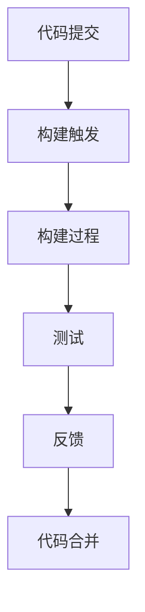

#### 2.2 CI工具介绍

市场上存在多种CI工具，以下介绍几种常用的CI工具：

1. **Jenkins**：Jenkins是最流行的开源CI工具之一，支持多种插件，可轻松与各种开发环境和代码库集成。
2. **GitLab CI**：GitLab CI是集成在GitLab平台上的CI工具，通过`.gitlab-ci.yml`文件配置CI流程。
3. **GitHub Actions**：GitHub Actions是GitHub提供的自动化工作流程管理服务，通过`.github/workflows/`文件夹中的YAML文件配置CI/CD流程。

**Mermaid流程图**：

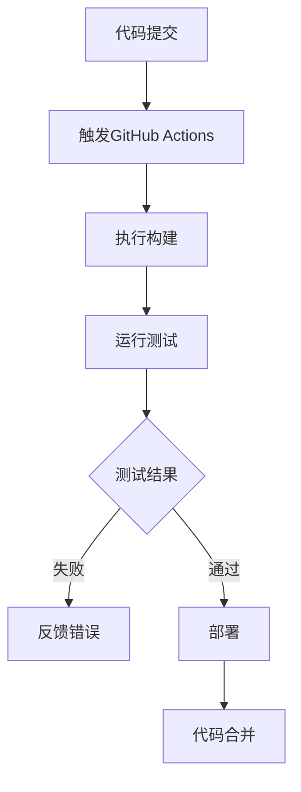

#### 2.3 CI流程设计

设计CI流程需要考虑以下几个关键要素：

1. **构建脚本**：编写用于编译代码和安装依赖项的脚本。
2. **测试脚本**：编写用于运行测试用例的脚本。
3. **环境配置**：配置开发、测试和生产环境，确保一致性和可重复性。
4. **部署脚本**：编写用于部署代码到目标环境的脚本。

**伪代码**：

```python
# 构建脚本
def build_project():
    install_dependencies()
    compile_source_code()

# 测试脚本
def run_tests():
    execute_unit_tests()
    execute_integration_tests()
    execute_performance_tests()

# 部署脚本
def deploy_to_environment(environment):
    if environment == "development":
        deploy_to_dev()
    elif environment == "test":
        deploy_to_test()
    elif environment == "production":
        deploy_to_production()
```

#### 2.4 CI与LLM结合的应用场景

在LLM应用中，CI流程需要特别考虑以下应用场景：

1. **模型版本管理**：自动标记和记录每次模型训练的版本，以便后续追踪和复现。
2. **数据依赖管理**：确保训练数据集的一致性和完整性，避免数据错误影响模型性能。
3. **性能优化**：通过自动化测试和性能分析，持续优化模型和部署策略。

**Mermaid流程图**：

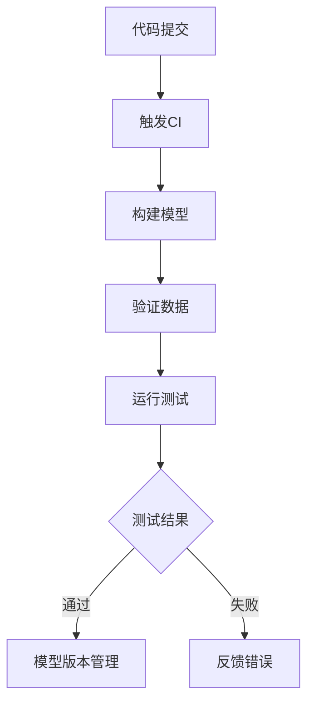

通过上述CI流程的设计，我们可以确保LLM应用的每次代码更改都是经过严格测试的，从而提高开发效率和代码质量。

### 持续部署（CD）基础知识

#### 3.1 CD的基本原理

持续部署（Continuous Deployment，简称CD）是在持续集成（CI）的基础上，通过自动化流程将验证通过的代码直接部署到生产环境。CD的目标是实现软件的快速、安全更新，确保生产环境的稳定运行。

CD的基本原理包括以下几个关键步骤：

1. **代码验证**：CI系统验证代码质量，确保代码没有引入错误。
2. **部署触发**：通过预定义的触发条件（如代码提交、测试通过等）自动触发部署流程。
3. **部署过程**：部署流程包括打包代码、配置环境、安装依赖和更新应用程序等。
4. **监控与反馈**：部署后，监控系统会实时监控应用状态，如出现故障，会触发回滚操作。

**核心概念与联系**：

为了更好地理解CD的核心概念和流程，我们可以使用Mermaid流程图进行展示：

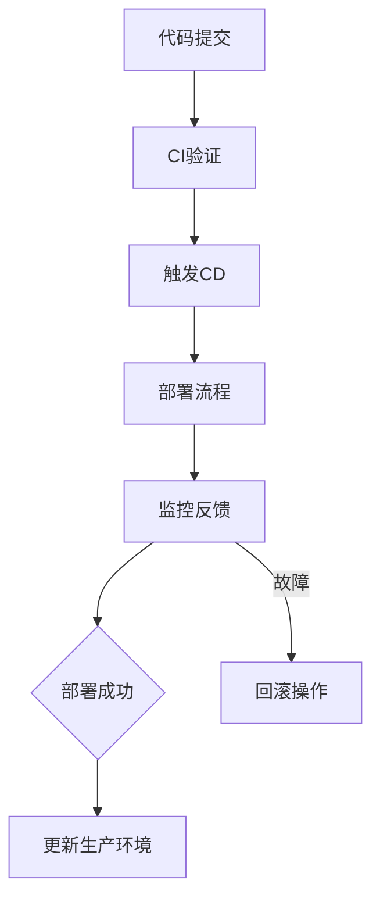

#### 3.2 CD与CI的关系

持续部署（CD）与持续集成（CI）是紧密关联的两个概念，CI负责确保代码的稳定性和质量，而CD负责将经过验证的代码部署到生产环境。两者之间的关系可以概括为：

1. **依赖关系**：CD依赖于CI的验证结果，只有在CI测试通过后，CD才会触发部署流程。
2. **协同工作**：CI和CD共同工作，实现从代码提交到生产环境更新的完整自动化流程。

**Mermaid流程图**：

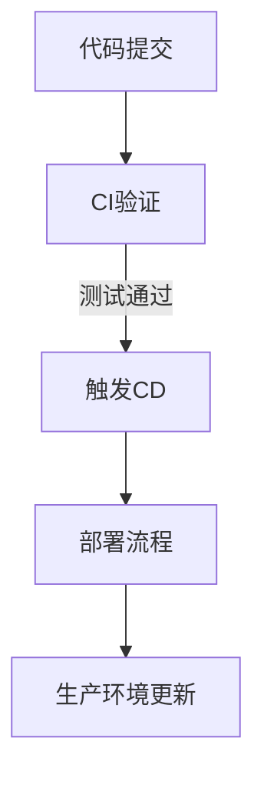

#### 3.3 CD流程设计

设计CD流程需要考虑以下几个关键要素：

1. **部署策略**：确定部署的频率、范围和方式，如蓝绿部署、灰度发布等。
2. **部署脚本**：编写用于执行部署操作的脚本，包括环境配置、依赖安装和应用更新等。
3. **监控与报警**：部署后，监控系统实时监控应用状态，及时响应和处理异常。
4. **回滚策略**：制定回滚计划，确保在部署失败时能够快速恢复到前一稳定状态。

**伪代码**：

```python
# 部署脚本
def deploy_to_production():
    configure_environment()
    install_dependencies()
    update_application()
    monitor_application()

# 回滚脚本
def rollback_to_previous_version():
    backup_current_version()
    restore_previous_version()
    monitor_application()
```

#### 3.4 CD与LLM结合的应用场景

在LLM应用中，CD流程需要特别考虑以下应用场景：

1. **模型更新**：自动部署最新的模型版本，确保生产环境的模型性能。
2. **资源管理**：根据模型规模和性能需求，动态调整计算资源和存储容量。
3. **安全控制**：确保部署过程符合安全规范，防止数据泄露和未授权访问。

**Mermaid流程图**：

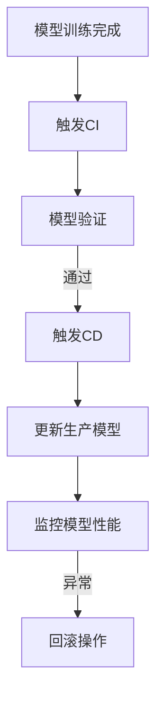

通过上述CD流程的设计，我们可以实现LLM应用的自动化部署，提高生产环境的可靠性和灵活性，同时确保每次更新都是经过严格验证的，降低风险。

### LLM模型管理

#### 4.1 模型版本管理

在LLM应用中，模型版本管理至关重要，因为每次模型的更新都可能影响应用的性能和用户体验。有效的模型版本管理包括以下几个关键方面：

1. **版本标记**：每次模型更新时，都需要为模型添加一个唯一的版本标记，便于后续追踪和复现。
2. **版本控制**：使用版本控制系统（如Git）记录模型的每次变更，确保模型的完整性和可追溯性。
3. **版本发布**：在每次模型更新后，需要发布新的版本，并记录发布日志，以便监控和回溯。

**Mermaid流程图**：

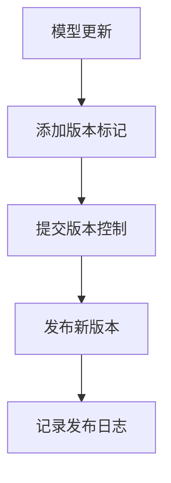

#### 4.2 模型监控与优化

LLM模型在生产环境中运行时，需要实时监控其性能和稳定性。以下是一些关键指标和优化策略：

1. **性能监控**：监控模型响应时间、吞吐量和资源消耗，确保模型在合理范围内运行。
2. **错误率监控**：监控模型预测的错误率，及时发现问题并进行优化。
3. **资源优化**：根据模型负载动态调整计算资源和存储容量，确保资源利用率最大化。

**Mermaid流程图**：

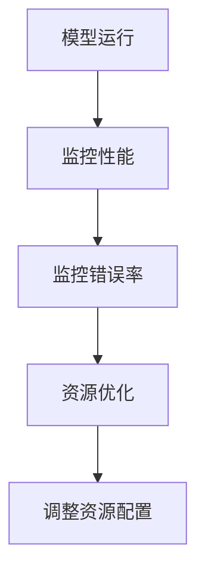

#### 4.3 模型迭代与优化策略

LLM模型的迭代和优化是提高其性能和适应性的关键步骤。以下是一些常见的迭代策略和优化方法：

1. **数据增强**：通过引入更多样化的训练数据，提高模型对不同场景的泛化能力。
2. **超参数调优**：调整模型训练过程中的超参数，如学习率、批量大小等，以优化模型性能。
3. **迁移学习**：利用预训练模型，通过微调适应特定任务，提高模型在特定领域的性能。

**Mermaid流程图**：

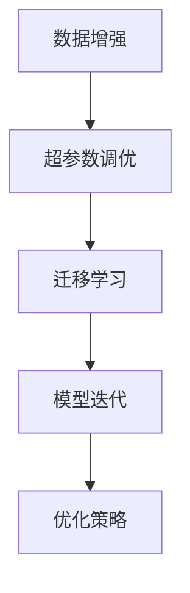

#### 4.4 模型与CI/CD流程的整合

为了确保LLM模型的持续更新和优化，需要将模型管理集成到CI/CD流程中。以下是一些关键步骤和最佳实践：

1. **自动化模型训练**：通过CI系统自动化触发模型训练过程，确保新模型版本经过充分验证。
2. **自动化模型评估**：在CI系统中集成模型评估工具，自动评估模型性能，确保模型更新符合预期。
3. **自动化模型部署**：在CD系统中实现模型自动部署，确保最新模型版本及时上线。

**Mermaid流程图**：

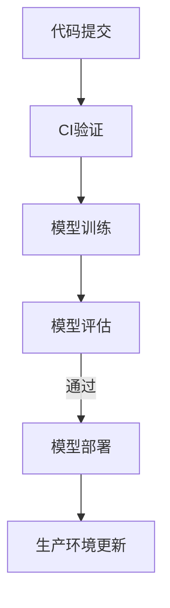

通过上述模型管理策略和CI/CD流程的整合，我们可以实现LLM应用的自动化迭代和优化，提高开发效率和模型性能。

### CI/CD工具与实践

在现代软件开发中，CI/CD工具的选择和应用对于提升开发效率和系统稳定性至关重要。以下将详细介绍三种流行的CI/CD工具：Jenkins、GitLab CI和GitHub Actions，并展示它们在LLM应用中的实际实践案例。

#### 5.1 Jenkins实践

**5.1.1 Jenkins基本架构**

Jenkins是一个开源的自动化服务器，支持各种插件，可轻松实现CI/CD流程。其基本架构包括以下组件：

1. **Jenkins Master**：主节点，负责调度构建任务和执行各种操作。
2. **Jenkins Slave**：从节点，负责实际执行构建任务。
3. **插件**：Jenkins Marketplace提供了丰富的插件，扩展了其功能。

**Mermaid流程图**：

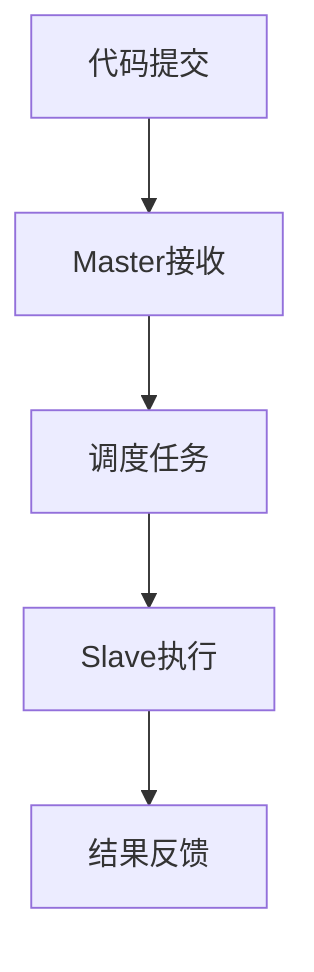

**5.1.2 Jenkins插件与配置**

Jenkins的强大之处在于其丰富的插件生态系统。以下是一些常用的Jenkins插件：

1. **Git插件**：用于从Git仓库拉取代码。
2. **Maven插件**：用于构建Java项目。
3. **JUnit插件**：用于执行Java单元测试。
4. **Deploy to Container插件**：用于容器化部署。

**配置示例**：

```yaml
# Jenkinsfile
pipeline {
    agent any
    stages {
        stage('Build') {
            steps {
                sh 'mvn clean install'
            }
        }
        stage('Test') {
            steps {
                sh 'mvn test'
            }
        }
        stage('Deploy') {
            steps {
                sh 'docker build -t myapp .'
                sh 'docker run --name myapp -d myapp'
            }
        }
    }
}
```

**5.1.3 Jenkins在LLM应用中的实践案例**

假设我们有一个LLM应用，我们需要使用Jenkins实现CI/CD流程。以下是一个实践案例：

1. **代码提交**：开发者将代码提交到Git仓库。
2. **构建触发**：Jenkins通过Git插件接收代码提交。
3. **构建过程**：Jenkins使用Maven插件构建项目，并使用JUnit插件运行测试。
4. **部署**：构建成功后，使用Deploy to Container插件将应用容器化并部署到Kubernetes集群。

**Mermaid流程图**：

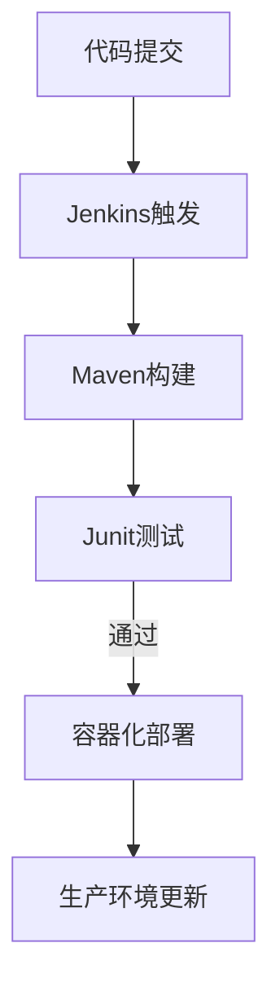

#### 5.2 GitLab CI实践

**5.2.1 GitLab CI基本架构**

GitLab CI是GitLab平台自带的CI/CD工具，通过`.gitlab-ci.yml`文件配置CI流程。其基本架构包括：

1. **GitLab CI/CD Runner**：运行CI/CD任务的虚拟机或容器。
2. **.gitlab-ci.yml**：配置文件，定义CI/CD流程的各个阶段。

**Mermaid流程图**：

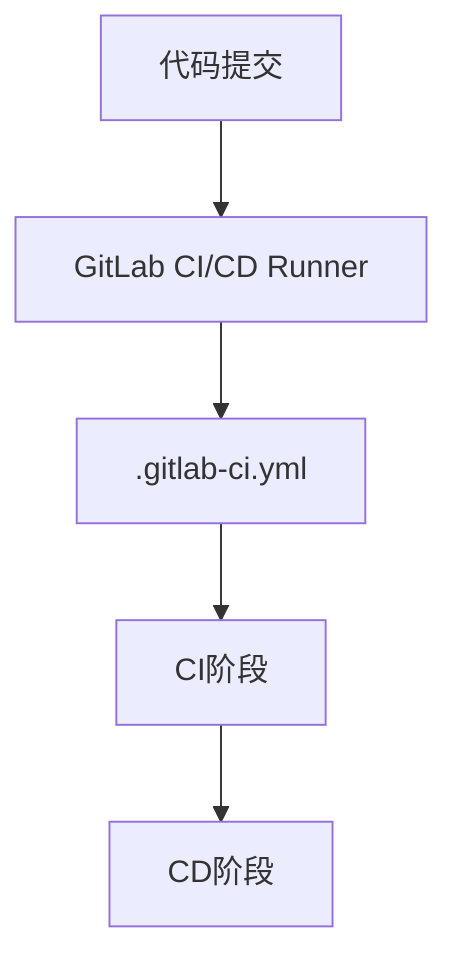

**5.2.2 GitLab CI配置文件**

以下是一个简单的`.gitlab-ci.yml`配置文件示例：

```yaml
stages:
  - build
  - test
  - deploy

build_job:
  stage: build
  script:
    - mvn clean install

test_job:
  stage: test
  script:
    - mvn test

deploy_job:
  stage: deploy
  script:
    - docker build -t myapp .
    - docker run --name myapp -d myapp
```

**5.2.3 GitLab CI在LLM应用中的实践案例**

假设我们使用GitLab CI为LLM应用构建CI/CD流程，以下是实践步骤：

1. **代码提交**：开发者将代码提交到GitLab仓库。
2. **构建触发**：GitLab CI/CD Runner自动启动构建流程。
3. **构建过程**：执行Maven构建和单元测试。
4. **部署**：构建成功后，将应用容器化并部署到Kubernetes集群。

**Mermaid流程图**：

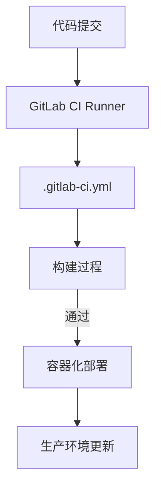

#### 5.3 GitHub Actions实践

**5.3.1 GitHub Actions基本架构**

GitHub Actions是GitHub提供的自动化工作流程管理服务，通过`.github/workflows/`文件夹中的YAML文件配置CI/CD流程。其基本架构包括：

1. **仓库**：配置工作流程的仓库。
2. **工作流程文件**：`.github/workflows/`文件夹中的YAML文件，定义工作流程的各个阶段。
3. **操作**：执行具体任务的GitHub Actions。

**Mermaid流程图**：

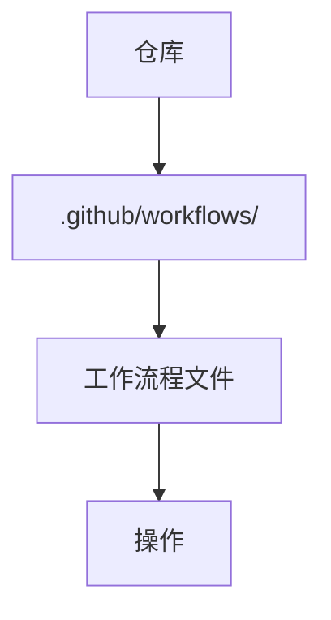

**5.3.2 GitHub Actions配置文件**

以下是一个简单的`.github/workflows/ci.yml`配置文件示例：

```yaml
name: CI/CD

on: [push, pull_request]

jobs:
  build-and-test:
    runs-on: ubuntu-latest
    steps:
      - uses: actions/checkout@v2
      - name: Build
        run: mvn clean install
      - name: Test
        run: mvn test
      - name: Deploy
        if: github.ref == 'main'
        run: |
          docker build -t myapp .
          docker run --name myapp -d myapp
```

**5.3.3 GitHub Actions在LLM应用中的实践案例**

假设我们使用GitHub Actions为LLM应用构建CI/CD流程，以下是实践步骤：

1. **代码提交**：开发者将代码提交到GitHub仓库。
2. **构建触发**：GitHub Actions自动启动构建流程。
3. **构建过程**：执行Maven构建和单元测试。
4. **部署**：构建成功后，将应用容器化并部署到Kubernetes集群（如果配置了条件）。

**Mermaid流程图**：

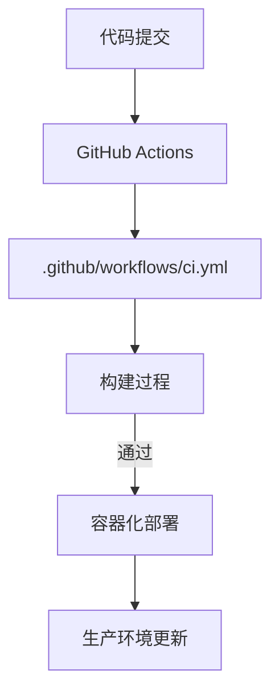

通过以上对Jenkins、GitLab CI和GitHub Actions的实践介绍，我们可以看到这些工具在LLM应用中的强大功能。选择合适的工具并设计高效的CI/CD流程，将极大地提升LLM应用的开发效率和稳定性。

### 持续交付与持续部署案例分析

为了更好地理解持续集成（CI）和持续部署（CD）在大型语言模型（LLM）应用中的实际应用效果，我们将在本章节中分析三个公司的案例，展示它们如何成功地实施CI/CD流程，以及在这个过程中遇到的挑战和解决方案。

#### 6.1 案例分析一：公司A的LLM应用CI/CD实践

**公司背景**：公司A是一家专注于自然语言处理技术的高科技公司，其核心产品是一个面向企业的智能问答系统，基于大型语言模型提供高质量的答案。

**挑战**：公司A在开发和部署LLM应用时面临以下挑战：

1. **模型版本管理复杂**：公司需要管理大量不同版本的LLM模型，并确保每次更新都经过严格测试。
2. **资源需求大**：训练和部署LLM模型需要大量的计算资源和存储空间，如何高效利用资源是一个重要问题。
3. **自动化测试困难**：由于LLM应用的复杂性和不确定性，自动化测试难以覆盖所有场景。

**解决方案**：

1. **CI流程优化**：公司A采用Jenkins作为CI工具，通过配置`.gitlab-ci.yml`文件，实现了自动化构建和测试。每次代码提交都会触发Jenkins构建，运行包括单元测试和性能测试在内的多种测试，确保代码质量。
   
   ```yaml
   stages:
     - name: Build
     - name: Test
       only:
         - master
       script:
         - mvn test
     - name: Deploy
       only:
         - master
       script:
         - docker build -t myapp .
         - docker run --name myapp -d myapp
   ```

2. **模型版本管理**：公司A使用GitLab的版本控制系统来管理LLM模型，为每个模型版本添加唯一的标签，并记录详细的变更日志。这有助于追踪模型的变化和复现历史版本。

3. **资源调度优化**：公司A采用了Kubernetes进行资源调度，根据模型训练和部署的需求动态调整资源分配，确保高效利用资源。

**效果**：通过实施CI/CD流程，公司A显著提高了开发效率和模型更新的速度，减少了手动操作和人为错误，同时确保了生产环境的稳定性和可靠性。

#### 6.2 案例分析二：公司B的LLM应用CI/CD实践

**公司背景**：公司B是一家提供AI驱动的客户服务解决方案的公司，其核心产品是一个基于LLM的智能客服系统。

**挑战**：公司B在开发和部署智能客服系统时面临以下挑战：

1. **部署频率高**：公司B需要频繁更新LLM模型和前端应用，以满足不断变化的市场需求。
2. **安全性要求高**：由于客户隐私和数据安全的重要性，公司B需要确保每次部署都是安全且可控的。
3. **回滚策略复杂**：在部署失败时，公司B需要快速回滚到前一稳定版本，以确保系统稳定性。

**解决方案**：

1. **CD流程优化**：公司B采用GitLab CI进行CI流程，同时使用Kubernetes进行CD流程。通过`.gitlab-ci.yml`文件，实现了从代码提交到生产环境更新的全自动化流程。

   ```yaml
   stages:
     - name: Build
       script:
         - mvn clean install
     - name: Test
       script:
         - mvn test
     - name: Deploy
       script:
         - kubectl set image deployment/myapp myapp=myapp:latest
   ```

2. **安全性增强**：公司B在部署过程中引入了静态代码分析和动态安全测试，确保代码在部署前没有安全漏洞。

3. **回滚策略**：公司B设计了复杂的回滚策略，使用 Helm 进行版本控制，确保在部署失败时能够快速回滚到前一稳定版本。

**效果**：通过实施CI/CD流程，公司B实现了高频率的部署，同时保证了系统的高安全性和稳定性。频繁的更新和快速回滚策略使得公司能够更好地应对市场需求的变化。

#### 6.3 案例分析三：公司C的LLM应用CI/CD实践

**公司背景**：公司C是一家提供智能教育解决方案的公司，其核心产品是一个基于LLM的智能辅导系统。

**挑战**：公司C在开发和部署智能辅导系统时面临以下挑战：

1. **数据管理复杂**：系统需要处理大量的学生数据和模型输出，如何确保数据的安全和隐私是一个重要问题。
2. **性能优化要求高**：由于系统需要处理实时数据和高并发请求，性能优化是一个关键问题。
3. **多环境部署**：公司C需要支持开发、测试和生产等多个环境，如何统一管理不同环境之间的配置是一个挑战。

**解决方案**：

1. **多环境部署管理**：公司C采用Docker Compose进行多环境部署管理，通过一个统一的配置文件来管理不同环境的配置，提高了部署的灵活性。

   ```yaml
   version: '3'
   services:
     web:
       image: myapp:latest
       ports:
         - "8080:8080"
     db:
       image: postgres:latest
   ```

2. **性能优化**：公司C在CI/CD流程中加入了性能测试阶段，使用JMeter等工具进行负载测试，确保系统在高并发下能够稳定运行。

3. **数据管理**：公司C采用了加密存储和数据匿名化策略，确保学生数据的安全和隐私。

**效果**：通过实施CI/CD流程，公司C显著提高了开发效率和系统稳定性，同时确保了数据的安全和隐私。多环境部署管理和性能优化策略使得公司能够更好地支持实时教育和智能辅导业务。

通过以上三个案例的分析，我们可以看到，实施CI/CD流程在LLM应用开发中具有重要的价值。公司通过优化CI/CD流程，实现了代码质量的提升、开发效率的提高、系统稳定性的增强，并为应对未来挑战打下了坚实的基础。

### 未来展望

#### 7.1 CI/CD在LLM应用中的发展趋势

随着人工智能技术的飞速发展，大型语言模型（LLM）的应用越来越广泛。CI/CD作为软件开发中的重要实践，将在LLM应用中迎来新的发展趋势：

1. **自动化程度的提升**：未来CI/CD工具将更加智能化，能够自动识别和解决潜在问题，减少人工干预。
2. **多模型支持的增强**：随着LLM种类的增多，CI/CD工具需要支持多种不同类型的模型，如预训练模型、自适应模型等。
3. **跨平台的整合**：CI/CD工具将更加注重跨平台的支持，特别是在云计算和边缘计算领域，实现更高效、灵活的部署。
4. **模型安全与隐私**：随着数据隐私和安全问题日益突出，CI/CD工具将加强对模型安全和隐私的保护，如引入加密和匿名化技术。

#### 7.2 挑战与解决方案

尽管CI/CD在LLM应用中具有巨大的潜力，但仍面临一些挑战：

1. **模型复杂性**：LLM模型的复杂性增加了CI/CD流程的复杂性，需要开发更加智能化的构建和测试工具。
2. **资源需求**：训练和部署LLM模型需要大量的计算资源和存储空间，如何高效利用资源是一个关键问题。
3. **数据管理**：随着数据量的增长，数据的质量和多样性对模型性能的影响越来越大，如何确保数据的一致性和完整性是一个挑战。

针对上述挑战，以下是一些可能的解决方案：

1. **智能化的CI/CD工具**：开发能够自动识别和解决潜在问题的智能化CI/CD工具，如使用机器学习技术进行代码质量评估和测试用例生成。
2. **资源调度优化**：采用先进的资源调度算法，如基于机器学习的资源需求预测和自适应资源分配，提高资源利用效率。
3. **数据管理平台**：建立完善的数据管理平台，确保数据的一致性、完整性和安全性，如引入数据质量管理工具和自动化数据清洗流程。

#### 7.3 未来展望与建议

在未来，CI/CD在LLM应用中将发挥更加重要的作用。以下是一些建议：

1. **持续优化CI/CD流程**：定期评估和优化CI/CD流程，确保其能够适应新的技术和需求变化。
2. **加强团队培训**：提高开发团队对CI/CD的理解和应用能力，确保团队能够充分利用CI/CD工具的优势。
3. **引入最佳实践**：借鉴其他领域的成功经验，引入适合LLM应用的CI/CD最佳实践，如蓝绿部署、灰度发布等。
4. **持续创新**：鼓励技术创新，探索新的CI/CD工具和方法，以应对不断变化的开发环境。

通过持续改进和优化，CI/CD将在LLM应用中发挥更大的作用，推动人工智能技术的发展。

### 附录

#### 8.1 工具资源

**8.1.1 Jenkins资源**

- 官方网站：[https://www.jenkins.io/](https://www.jenkins.io/)
- 插件市场：[https://plugins.jenkins.io/](https://plugins.jenkins.io/)
- 教程：[https://www.jenkins.io/doc/book/](https://www.jenkins.io/doc/book/)

**8.1.2 GitLab CI资源**

- 官方网站：[https://gitlab.com/gitlab-org/gitlab-ci-multi-runner](https://gitlab.com/gitlab-org/gitlab-ci-multi-runner)
- 文档：[https://docs.gitlab.com/ci/](https://docs.gitlab.com/ci/)
- 教程：[https://gitlab.com/gitlab-examples/CI-yml-examples](https://gitlab.com/gitlab-examples/CI-yml-examples)

**8.1.3 GitHub Actions资源**

- 官方网站：[https://docs.github.com/en/actions/learn-github-actions/introduction-to-github-actions](https://docs.github.com/en/actions/learn-github-actions/introduction-to-github-actions)
- 文档：[https://docs.github.com/en/actions/learn-github-actions](https://docs.github.com/en/actions/learn-github-actions)
- 教程：[https://github.com/actions/tutorials](https://github.com/actions/tutorials)

#### 8.2 参考文献

- [Jenkins: The Definitive Guide](https://www.oreilly.com/library/view/jenkins-the-definitive/9781449325868/)
- [GitLab CI/CD: The Definitive Guide](https://gitlab.com/gitlab-examples/gitlab-ci-yml-examples/blob/master/book/CI_CD_The_Definitive_Guide.pdf)
- [GitHub Actions: The Complete Guide](https://github.com/github/docs/blob/main/en/actions/learn-github-actions/introduction-to-github-actions.md)
- [Matsberg, Mikael. Continuous Integration: Effective Software Project Management](https://www.amazon.com/Continuous-Integration-Effective-Software-Project/dp/0131402105)
- [Banshee, Markus. Jenkins: The Definitive Guide](https://www.amazon.com/Jenkins-Definitive-Guide-Markus-Banshee/dp/144932586X)

