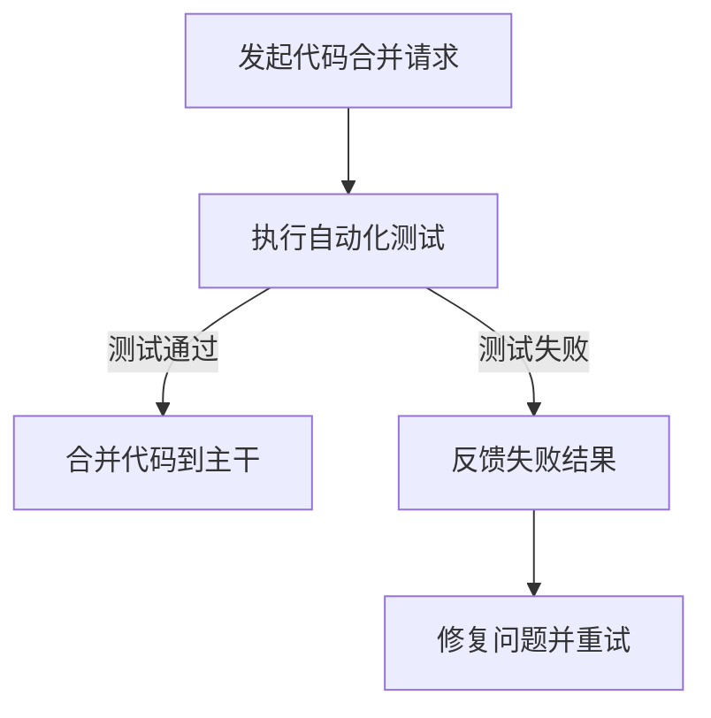
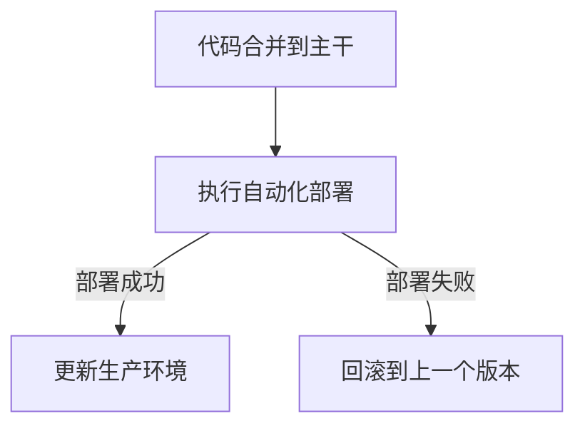

                 


为了撰写一篇高质量的技术博客文章《持续集成与部署在LLM应用开发中的实践》，我们将遵循以下步骤进行逻辑分析和推理：

### 1. 文章标题、关键词与摘要

**文章标题：** 持续集成与部署在LLM应用开发中的实践

**关键词：** 持续集成，持续部署，LLM，应用开发，CI/CD

**摘要：** 本文深入探讨了持续集成（CI）与持续部署（CD）在大型语言模型（LLM）应用开发中的重要性。文章首先介绍了CI/CD的基本概念，然后详细分析了LLM应用开发中的挑战，并提出了相应的解决方案与实践。

### 2. 持续集成与部署概述

**2.1 持续集成的基本原理**

持续集成是一种软件开发实践，通过频繁地将代码合并到主干分支，并在每次合并时执行一系列自动化测试，确保代码库的稳定性和质量。持续集成的基本原理包括：

- **自动化测试：** 通过自动化测试来验证代码的功能性和性能。
- **频繁集成：** 增加代码合并的频率，以便更快地发现和修复集成问题。
- **持续反馈：** 及时反馈测试结果，帮助开发人员快速响应问题。

**Mermaid流程图：**



**伪代码：**

```python
def ci_process(code_changes):
    if test_suite(code_changes):
        merge_to_main()
    else:
        report_failure()
        fix_issues(code_changes)
        ci_process(code_changes)
```

### 3. 持续部署的概念与实践

持续部署是CI的延伸，通过自动化工具将代码从开发环境部署到生产环境。持续部署的基本原理包括：

- **自动化部署：** 使用自动化脚本或工具进行部署。
- **快速回滚：** 在部署失败时，能够快速回滚到上一个稳定版本。
- **持续监控：** 对生产环境进行实时监控，确保服务的稳定性。

**Mermaid流程图：**



**伪代码：**

```python
def cd_process(code_changes):
    if deploy_to_production(code_changes):
        update_production()
    else:
        rollback_to_previous_version()
```

### 4. LLM应用开发中的挑战

**4.1 大规模语言模型的复杂性**

LLM应用开发面临着以下挑战：

- **计算资源需求：** LLM模型通常需要大量的计算资源进行训练和推理。
- **数据质量与多样性：** LLM模型的性能高度依赖于训练数据的质量和多样性。
- **模型可解释性：** LLM模型的决策过程通常是不透明的，难以解释。

**4.2 持续集成与部署的特殊需求**

在LLM应用开发中，CI/CD需要考虑以下特殊需求：

- **模型版本管理：** 需要有效地管理多个模型的版本。
- **持续优化：** 部署后需要持续优化模型，以提高性能和减少资源消耗。

### 5. 解决方案与实践

**5.1 持续集成实践**

在LLM应用开发中，我们可以采用以下持续集成实践：

- **多阶段测试：** 包括单元测试、集成测试和性能测试。
- **容器化：** 使用Docker等容器技术，确保环境一致性。
- **自动化测试框架：** 如pytest、Jest等。

**5.2 持续部署实践**

持续部署在LLM应用开发中需要考虑以下实践：

- **蓝绿部署：** 将新版本部署到部分生产环境，观察其性能和稳定性。
- **灰度发布：** 逐步增加新版本的用户比例，观察反馈。
- **监控与反馈：** 使用Prometheus、Grafana等工具进行实时监控，及时响应问题。

### 6. 工具与技术

**6.1 持续集成与部署工具**

- **Jenkins：** 一个开源的持续集成服务器。
- **GitLab CI/CD：** GitLab自带的CI/CD工具。
- **GitHub Actions：** GitHub提供的自动化工作流程服务。

**6.2 LLM应用开发工具**

- **Hugging Face Transformers：** 一个开源的Transformer模型库。
- **TensorFlow：** 一个用于机器学习的开源库。
- **PyTorch：** 另一个用于机器学习的开源库。

### 7. 项目实战

**7.1 案例研究**

我们将分析一个实际的LLM项目，展示如何进行持续集成与部署。包括：

- **开发环境搭建：** 配置必要的开发工具和依赖。
- **源代码实现：** 使用TensorFlow或PyTorch实现LLM。
- **代码解读：** 详细解释关键代码和逻辑。
- **应用解读：** 分析LLM在具体应用中的表现。
- **项目小结：** 总结项目中的经验与教训。

### 8. 最佳实践与拓展阅读

我们将提供一些最佳实践，如：

- **性能优化技巧：** 如何提高LLM模型的推理速度和效率。
- **安全性措施：** 如何保护LLM模型不被攻击。
- **资源管理策略：** 如何有效地使用计算资源。

最后，文章末尾将附上相关拓展阅读，帮助读者深入了解相关技术和理论。

通过以上步骤，我们可以撰写出一篇内容丰富、逻辑清晰的技术博客文章，为读者提供对持续集成与部署在LLM应用开发中的实践的全景了解。文章长度将在8000至12000字之间，确保每个小节都有详细讲解，让读者能够深入理解相关技术。

