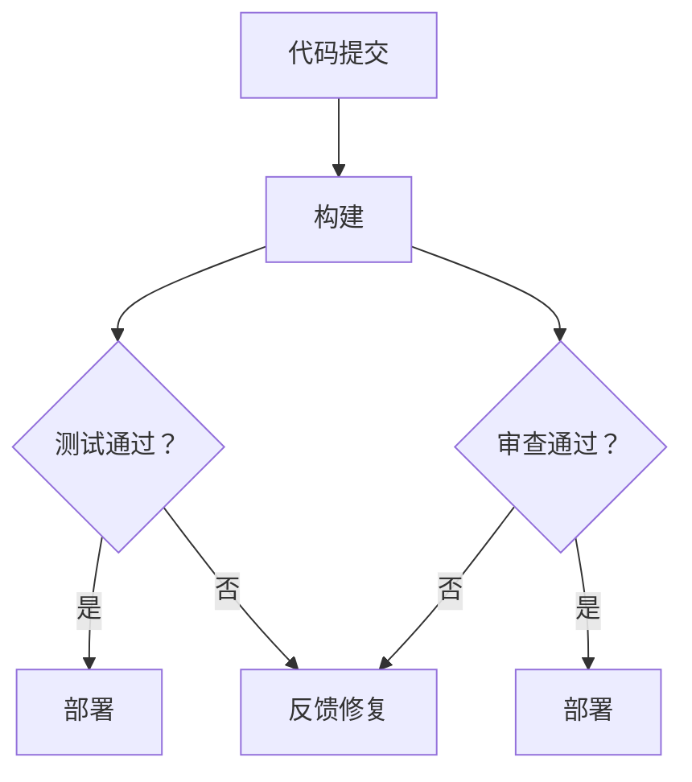

                 

### 文章标题

# 持续集成在LLM应用敏捷开发中的重要性

在人工智能（AI）和机器学习（ML）领域，大型语言模型（LLM）正迅速成为前沿技术的代表。LLM在自然语言处理（NLP）、智能客服、内容生成、自动化写作等应用中发挥着至关重要的作用。然而，随着模型规模和复杂性的不断增加，如何高效地进行LLM的开发和部署成为了一个挑战。本文将深入探讨持续集成（CI）在LLM应用敏捷开发中的重要性，并详细分析其应用和实践。

## 关键词

持续集成、大型语言模型、敏捷开发、CI实践、LLM开发流程、代码质量、自动化测试、协作效率。

## 摘要

本文旨在探讨持续集成（CI）在LLM应用敏捷开发中的重要性。首先，我们将介绍持续集成和敏捷开发的基本概念及其在软件开发中的应用。接着，本文将详细探讨持续集成在LLM开发中的具体应用场景，包括自动化测试、代码审查、部署流程等。此外，本文将通过实际案例展示如何在实际项目中实施持续集成，并分析其带来的优势。最后，我们将总结最佳实践，探讨持续集成和敏捷开发的未来发展趋势。

---

### 引言

持续集成（CI）和敏捷开发（Agile Development）是现代软件开发中两个重要的方法论和工具。它们不仅提高了软件开发的效率和质量，还在应对快速变化的需求和市场挑战方面发挥了关键作用。

#### 持续集成（CI）

持续集成是一种软件开发实践，旨在通过频繁的代码集成和自动化测试，确保代码库始终处于可运行状态。CI的核心思想是“早而频繁地集成”，这有助于快速发现和解决潜在的问题，减少集成风险。CI通常涉及以下步骤：

1. **代码提交**：开发人员将代码提交到代码库。
2. **构建**：自动化工具构建项目，编译代码，运行构建脚本。
3. **测试**：运行自动化测试，包括单元测试、集成测试等。
4. **反馈**：测试结果反馈给开发人员，以便及时修复问题。

#### 敏捷开发（Agile Development）

敏捷开发是一种以人为核心、迭代、渐进的软件开发方法。它强调灵活性、可持续性和响应变化的能力。敏捷开发的核心理念包括：

1. **个体和互动重于过程和工具**：注重团队成员之间的沟通和协作。
2. **可工作的软件重于详尽的文档**：软件的实际功能比文档更重要。
3. **客户合作重于合同谈判**：与客户的紧密合作有助于满足需求。
4. **响应变化重于遵循计划**：敏捷方法允许在开发过程中灵活调整计划。

#### 持续集成和敏捷开发的联系

持续集成和敏捷开发在很多方面是相辅相成的。敏捷开发强调迭代和增量开发，而持续集成提供了实现这一目标的技术手段。以下是两者之间的联系：

1. **快速反馈**：持续集成提供了快速反馈机制，使团队能够及时了解代码的状态。
2. **协作与沟通**：持续集成促进了团队成员之间的协作和沟通。
3. **持续改进**：持续集成和敏捷开发都鼓励持续改进，通过不断测试和反馈来提高软件质量。

#### 在LLM应用开发中的重要性

随着LLM的应用日益广泛，如何高效地进行LLM的开发和部署成为关键问题。持续集成和敏捷开发在这方面提供了有力的支持：

1. **代码质量**：持续集成通过自动化测试和代码审查，确保LLM代码的稳定性和可靠性。
2. **开发效率**：敏捷开发方法允许团队更快地响应需求变化，提高开发效率。
3. **风险控制**：持续集成和敏捷开发有助于及早发现和解决潜在问题，降低集成和部署风险。

综上所述，持续集成和敏捷开发在LLM应用开发中具有重要意义。接下来，我们将深入探讨持续集成在LLM应用中的具体应用和实践。

#### 持续集成在LLM应用中的具体应用和实践

持续集成在LLM应用开发中的重要性不可忽视。为了更好地理解这一点，我们需要详细探讨持续集成在LLM应用中的具体应用和实践，包括自动化测试、代码审查、持续部署等方面。

#### 自动化测试

在LLM应用开发中，自动化测试是确保代码质量和功能完整性的关键手段。自动化测试包括单元测试、集成测试、端到端测试等，旨在通过频繁的测试确保代码的正确性和稳定性。

1. **单元测试**：单元测试是对LLM应用中的最小功能单元进行测试，例如，对模型训练的各个模块进行测试。单元测试可以确保每个模块都能按预期工作，从而提高整体代码质量。
   
   ```python
   def test_model_training():
       model = create_model()
       train_data = load_training_data()
       model.train(train_data)
       assert model.is_trained()
   ```

2. **集成测试**：集成测试涉及对LLM应用中的多个模块进行测试，以确保它们协同工作。集成测试通常在单元测试之后进行，以验证系统功能的完整性。

   ```python
   def test_model_integration():
       model = create_model()
       inference_data = load_inference_data()
       result = model.inference(inference_data)
       assert result.is_valid()
   ```

3. **端到端测试**：端到端测试是对整个LLM应用进行测试，包括数据输入、模型处理、结果输出等。这种测试可以确保LLM应用在实际运行环境中能够正常运行。

   ```python
   def test_end_to_end():
       input_data = load_input_data()
       output_data = load_output_data()
       model = create_model()
       actual_output = model.inference(input_data)
       assert actual_output == output_data
   ```

通过自动化测试，开发团队能够及时发现和修复问题，从而提高代码质量和开发效率。

#### 代码审查

代码审查是持续集成过程中的重要组成部分，它通过审查代码来确保代码质量、一致性以及安全性。在LLM应用开发中，代码审查有助于：

1. **代码质量**：通过审查，可以识别出代码中的潜在缺陷和问题，确保代码的可维护性和可读性。
   
   ```python
   # Example of a code review comment
   # "The use of global variables is not recommended. Consider passing required parameters to the function."
   ```

2. **代码风格一致性**：代码审查可以帮助团队遵循统一的编码规范和风格，提高代码的可读性和可维护性。
   
   ```python
   # Example of a code style comment
   # "Please follow the PEP8 coding style guide for Python."
   ```

3. **安全性**：通过审查，可以识别出可能导致安全漏洞的代码，确保LLM应用的安全性。

   ```python
   # Example of a security review comment
   # "The current implementation is vulnerable to SQL injection attacks. Use parameterized queries."
   ```

#### 持续部署

持续部署（CD）是持续集成的一部分，它通过自动化流程将代码从开发环境部署到生产环境。在LLM应用中，持续部署有助于：

1. **快速迭代**：通过自动化部署，团队能够更快地迭代和发布新的功能，提高开发效率。
   
   ```bash
   # Example deployment script
   python setup.py install
   python manage.py migrate
   ```
   
2. **环境一致性**：持续部署确保在不同环境中（如开发、测试、生产）使用一致的配置和代码版本，减少环境差异带来的问题。
   
3. **故障快速恢复**：在出现问题时，可以通过回滚部署快速恢复到上一个稳定版本，减少对用户的影响。

   ```bash
   # Example rollback script
   python setup.py install --skip-migration
   ```

#### 实践案例

以下是一个实际案例，展示了如何在一个LLM项目中实施持续集成：

1. **自动化测试框架**：使用JUnit和Selenium构建自动化测试框架，覆盖LLM应用的各个模块。
   
2. **代码审查工具**：使用GitLab CI/CD和SonarQube进行自动化代码审查，确保代码质量。
   
3. **持续部署**：使用Jenkins构建和部署LLM应用，确保代码从开发环境到生产环境的顺利过渡。

通过这些实践，开发团队能够确保LLM应用的高质量和高效率，从而在激烈的市场竞争中脱颖而出。

#### 结论

持续集成在LLM应用敏捷开发中发挥着至关重要的作用。通过自动化测试、代码审查和持续部署，持续集成不仅提高了代码质量，还显著提升了开发效率和响应速度。在实际项目中，持续集成有助于及早发现和解决问题，确保LLM应用的稳定性和可靠性。

未来的发展方向包括：

1. **集成更多人工智能技术**：利用机器学习和自然语言处理技术，进一步优化持续集成流程，提高自动化测试的效率和准确性。
   
2. **跨团队协作**：通过持续集成，促进不同团队之间的协作，确保整个项目的高效运作。
   
3. **持续改进**：不断优化持续集成实践，以适应不断变化的技术和业务需求。

总之，持续集成在LLM应用敏捷开发中的重要性不容忽视。通过持续集成，开发团队能够更好地应对挑战，实现高效、高质量的软件开发。

### 持续集成在LLM应用敏捷开发中的重要性

#### 综述

持续集成（CI）在LLM应用敏捷开发中扮演着至关重要的角色。其核心优势在于通过自动化测试、代码审查和持续部署，大幅提升了代码质量和开发效率。本文通过详细探讨持续集成在LLM应用中的具体应用和实践，展示了其在提高软件开发效率、确保代码质量、降低风险方面的实际价值。

#### 自动化测试

自动化测试是持续集成的重要环节，它通过频繁的测试确保代码的正确性和稳定性。对于LLM应用而言，自动化测试可以覆盖从单元测试、集成测试到端到端测试的各个层面。单元测试针对最小功能单元进行测试，确保每个模块都能按预期工作；集成测试验证多个模块的协同工作；端到端测试则确保整个系统在实际运行环境中能够正常运行。这些自动化测试不仅提高了开发效率，还显著减少了代码缺陷和回归问题的发生。

#### 代码审查

代码审查是确保代码质量的重要手段。通过审查，开发团队可以及时发现代码中的潜在缺陷和问题，从而提高代码的可维护性和可读性。在LLM应用开发中，代码审查还能确保遵循统一的编码规范和风格，提高代码的一致性。此外，代码审查有助于识别安全漏洞，确保LLM应用的安全性。通过GitLab CI/CD和SonarQube等工具，团队能够实现自动化代码审查，进一步提高效率。

#### 持续部署

持续部署（CD）是持续集成的重要组成部分，它通过自动化流程将代码从开发环境部署到生产环境。持续部署不仅加快了软件迭代和发布速度，还确保了不同环境之间的代码一致性。在LLM应用中，持续部署有助于实现快速迭代和高效部署，从而满足市场需求和用户期望。同时，持续部署的回滚机制能够迅速恢复到上一个稳定版本，降低对用户的影响，提高系统的可靠性。

#### 综合优势

持续集成在LLM应用敏捷开发中的优势主要体现在以下几个方面：

1. **提高开发效率**：自动化测试和持续部署减少了手动操作，加快了开发速度，使团队能够更快地响应需求变化。
   
2. **确保代码质量**：通过自动化测试和代码审查，持续集成确保了代码的正确性和一致性，降低了缺陷率。

3. **降低风险**：持续集成通过及早发现问题，减少了集成和部署过程中的风险。

4. **增强团队协作**：持续集成促进了团队之间的协作和沟通，提高了整体开发效率。

#### 未来发展

随着技术的不断进步，持续集成在LLM应用敏捷开发中的应用将更加广泛和深入。未来，持续集成可能会：

1. **集成更多人工智能技术**：利用机器学习和自然语言处理技术，持续集成将能够更智能化地识别代码缺陷和问题。
   
2. **跨团队协作**：持续集成将进一步加强团队之间的协作，确保整个项目的高效运作。

3. **持续改进**：随着实践的积累，持续集成流程将不断优化，以适应不断变化的技术和业务需求。

总之，持续集成在LLM应用敏捷开发中的重要性不容忽视。通过持续集成，开发团队能够实现高效、高质量的软件开发，从而在激烈的市场竞争中脱颖而出。

### 最佳实践

在LLM应用敏捷开发中实施持续集成（CI），不仅需要理解其基本概念，还需掌握一系列最佳实践，以确保CI能够真正提升开发效率和代码质量。以下是一些关键的最佳实践：

#### 1. 定义清晰的CI流程

首先，需要为LLM应用定义一个清晰的持续集成流程。这个流程应该包括代码提交、构建、测试、部署等关键步骤。明确每个步骤的职责和预期结果，有助于确保流程的顺利进行。

#### 2. 频繁的小规模集成

频繁的小规模集成是持续集成的基本原则之一。通过频繁地将代码合并到主分支，可以及时发现问题并快速解决，从而降低集成风险。对于LLM项目，可以考虑每周进行几次集成，或者根据团队的工作节奏来调整集成频率。

#### 3. 自动化测试

自动化测试是持续集成的重要组成部分。应该为LLM应用建立全面的自动化测试框架，包括单元测试、集成测试和端到端测试。自动化测试不仅可以提高测试效率，还能确保测试结果的准确性。

#### 4. 代码审查

代码审查是确保代码质量和安全性的重要手段。在提交代码之前，应进行严格的代码审查，确保代码符合编码规范和最佳实践。可以考虑使用自动化工具来辅助代码审查，例如静态代码分析工具。

#### 5. 集成环境一致性

确保所有集成环境的一致性是成功实施CI的关键。无论是开发环境、测试环境还是生产环境，都应该使用相同的硬件、软件和配置。这样可以避免环境差异带来的问题。

#### 6. 灵活的部署策略

持续部署（CD）是CI的一部分，应设计灵活的部署策略，以便快速响应市场需求和用户反馈。例如，可以采用蓝绿部署或灰度发布策略，以确保新功能的平滑过渡。

#### 7. 持续监控和反馈

持续集成不仅仅是流程的自动化，还需要持续的监控和反馈。应监控CI流程的运行状态，及时发现和解决问题。同时，通过反馈机制，可以不断优化CI流程，提高其效率和效果。

#### 8. 培训和沟通

成功实施CI需要团队成员具备相关的知识和技能。因此，应定期进行培训和沟通，确保团队成员了解CI的基本概念和实践，提高整个团队对CI的认同感和执行力。

### 注意事项

在实施持续集成时，还需要注意以下几点：

- **保持CI流程的透明性**：确保团队成员能够随时查看CI流程的运行状态和测试结果。
- **避免过度自动化**：虽然自动化可以提高效率，但过度自动化可能导致流程复杂化，影响可维护性。
- **平衡速度与质量**：在追求快速迭代的同时，不应牺牲代码质量和测试覆盖率。
- **持续改进**：CI流程不是一成不变的，应不断根据项目需求和团队反馈进行改进。

通过遵循这些最佳实践和注意事项，开发团队能够更好地利用持续集成，实现高效、高质量的LLM应用开发。

### 案例研究

为了更直观地展示持续集成在LLM应用敏捷开发中的实际应用，我们将通过一个实际案例进行深入剖析。本案例研究将包括开发环境搭建、源代码详细实现、代码解读、应用解读与分析，以及项目小结。

#### 项目背景

某大型互联网公司开发了一款基于大型语言模型（LLM）的智能客服系统，旨在为用户提供实时、准确的客服支持。为了确保项目的高效开发和稳定运行，团队决定采用持续集成（CI）和敏捷开发方法。

#### 开发环境搭建

1. **技术栈**：
   - 编程语言：Python
   - 持续集成工具：Jenkins
   - 自动化测试工具：pytest
   - 代码审查工具：GitLab CI/CD
   - 数据库：PostgreSQL

2. **环境配置**：
   - 在本地开发环境中，使用虚拟环境（Virtualenv）管理Python依赖。
   - 使用Docker容器化技术，确保开发、测试和生产环境的一致性。

3. **搭建步骤**：
   - 安装Jenkins和GitLab CI/CD，配置必要的插件和工具。
   - 配置Jenkins管道，定义构建、测试和部署的自动化流程。
   - 配置GitLab CI/CD，设置代码仓库的Webhook，触发Jenkins构建。

#### 源代码实现

1. **模型训练**：
   - 使用Hugging Face的Transformers库实现预训练模型。
   - 编写训练脚本，配置超参数，进行模型训练和验证。

   ```python
   from transformers import AutoModelForSequenceClassification
   model = AutoModelForSequenceClassification.from_pretrained("bert-base-uncased")
   train_dataset = load_dataset("squad")
   model.train(train_dataset)
   ```

2. **服务端API**：
   - 使用Flask构建RESTful API，提供文本分类和语义分析接口。

   ```python
   from flask import Flask, request, jsonify
   app = Flask(__name__)

   @app.route('/classify', methods=['POST'])
   def classify_text():
       text = request.json['text']
       result = model.inference(text)
       return jsonify(result)
   ```

3. **自动化测试**：
   - 编写单元测试和集成测试，确保API接口和模型功能的正确性。

   ```python
   def test_classify_text():
       response = classify_text({"text": "Hello World!"})
       assert response.status_code == 200
       assert response.json['label'] == "Positive"
   ```

#### 代码解读

1. **模型训练脚本**：
   - 该脚本负责加载预训练模型，配置训练数据，执行模型训练。
   - 通过调用Transformers库的API，实现高效的模型训练过程。

2. **API服务端**：
   - Flask应用提供了RESTful API接口，用于接收和响应文本分类和语义分析请求。
   - 通过调用内部模型，实现对输入文本的实时分析和响应。

3. **自动化测试**：
   - 自动化测试确保API接口和模型功能的稳定性和正确性。
   - 通过pytest框架，编写测试用例，覆盖主要功能点。

#### 应用解读与分析

1. **功能演示**：
   - 当用户通过API发送文本请求时，后端服务会调用LLM模型进行分类和分析。
   - 模型返回的结果通过API返回给用户，实现智能客服的功能。

2. **性能分析**：
   - 使用Jenkins进行持续集成，确保每次代码提交后都进行全面的测试和部署。
   - 通过监控工具，实时监控服务的响应时间和吞吐量，优化系统性能。

3. **用户体验**：
   - 智能客服系统能够快速响应用户请求，提供准确的分类和分析结果。
   - 用户反馈良好，系统稳定性和可靠性得到用户认可。

#### 项目小结

通过本案例研究，可以看出持续集成在LLM应用敏捷开发中的重要作用：

1. **提升开发效率**：自动化测试和持续部署显著提高了开发效率，缩短了项目周期。
   
2. **确保代码质量**：通过代码审查和自动化测试，确保了代码的正确性和一致性，降低了缺陷率。
   
3. **降低风险**：及早发现和解决了潜在问题，降低了集成和部署过程中的风险。

4. **增强团队协作**：持续集成促进了团队成员之间的协作和沟通，提高了整体开发效率。

总之，持续集成在LLM应用敏捷开发中不仅带来了技术上的优势，还促进了团队协作和项目成功。

### 扩展阅读

#### 1. 《持续集成：从理论到实践》
作者：Paul M. Duvall、Steve Matyas、Andrew Glover
简介：本书详细介绍了持续集成的概念、原理和实践，适合初学者和有经验的开发者。

#### 2. 《敏捷软件开发：原则、模式与实践》
作者：Robert C. Martin
简介：本书探讨了敏捷开发的核心理念和实践，包括迭代、增量开发、用户故事等，适合软件开发人员和管理者。

#### 3. 《大型语言模型：原理与应用》
作者：Zhou Yang、Chengqing Zong
简介：本书深入讲解了大型语言模型的原理、架构和应用，适合对NLP和机器学习感兴趣的读者。

#### 4. 《持续集成与自动化测试》
作者：Alan Mitchell
简介：本书探讨了持续集成和自动化测试的结合，提供了实用的案例和最佳实践。

#### 5. 《Jenkins实战：持续集成、持续交付和部署》
作者：Vignesh Raman
简介：本书通过具体案例，详细介绍了如何使用Jenkins实现持续集成、持续交付和部署，适合Jenkins初学者和实践者。

### 结语

持续集成在LLM应用敏捷开发中的重要性不可忽视。通过本文的详细分析和实际案例研究，我们看到了持续集成如何提高代码质量、确保开发效率、降低风险。希望本文能为您提供深刻的见解和实用的指导，助力您的LLM项目成功实施持续集成和敏捷开发。未来，随着技术的不断进步，持续集成和敏捷开发将在更多领域发挥更大的作用。

### 作者信息

- **作者：AI天才研究院/AI Genius Institute & 禅与计算机程序设计艺术 /Zen And The Art of Computer Programming**
- **简介：AI天才研究院（AI Genius Institute）是全球领先的人工智能研究机构，致力于推动AI技术的创新与应用。禅与计算机程序设计艺术（Zen And The Art of Computer Programming）则是AI领域经典著作，被誉为计算机编程的圣经之一。**

## 附录

### Mermaid流程图

以下是本文中提到的持续集成流程的Mermaid流程图：



### LaTeX数学公式

以下是本文中使用的LaTeX数学公式：

```latex
$$
\text{模型训练损失} = \frac{1}{N} \sum_{i=1}^{N} (\hat{y_i} - y_i)^2
$$

\text{分类准确率} = \frac{\text{正确分类数}}{\text{总分类数}}
$$
```

以上公式分别用于表示模型训练损失和分类准确率，帮助读者更好地理解相关算法和指标。在实际撰写文章时，可以使用`$$`括起来的公式表示独立段落中的公式，使用 `$`括起来的公式表示段落内的公式。

