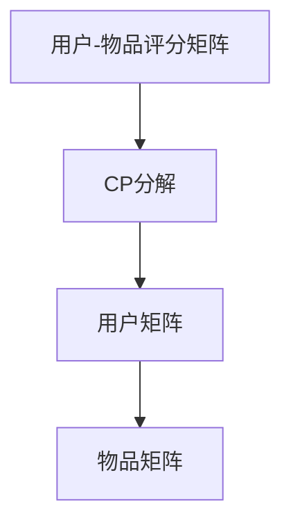
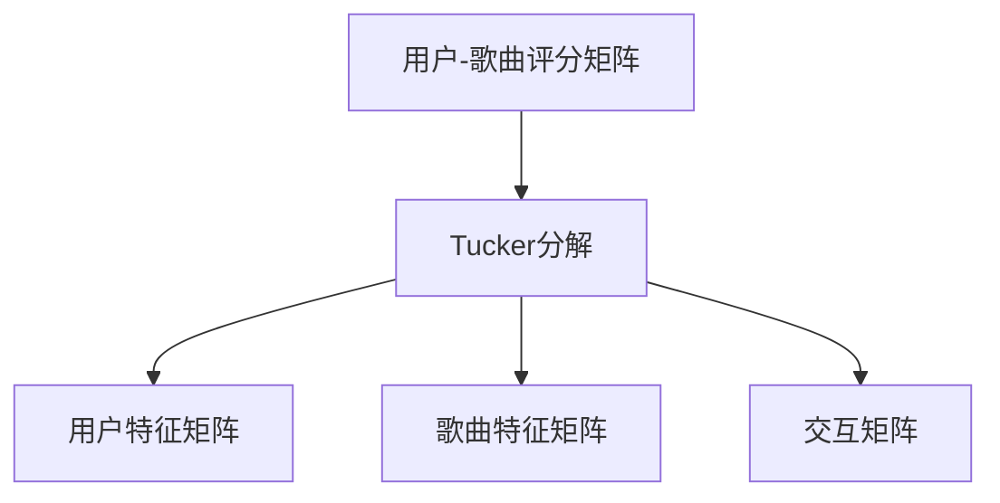

                 

### 推荐系统的张量分解：用户兴趣的多维建模

#### 关键词：推荐系统、张量分解、用户兴趣、多维建模、算法优化、实践案例分析

#### 摘要：
本文旨在探讨推荐系统的张量分解方法，以及其在用户兴趣多维建模中的应用。首先，我们将简要介绍推荐系统的基本概念和作用。接着，深入讲解张量分解的方法及其数学背景。随后，我们将阐述用户兴趣的多维建模方法和行为分析。通过实际案例，展示张量分解算法在不同领域的应用。最后，我们将探讨算法优化策略、推荐系统的评估与改进，以及未来的发展趋势。

---

### 引言

推荐系统作为一种重要的信息技术，旨在根据用户的兴趣和行为，为用户提供个性化的推荐。随着互联网的普及和数据量的激增，推荐系统在电子商务、社交媒体、在线媒体等领域得到了广泛应用，显著提升了用户体验和平台价值。

近年来，张量分解方法在推荐系统中表现出色。与传统的矩阵分解方法相比，张量分解可以处理更复杂的多维数据，更好地捕捉用户兴趣的多维特性。本文将系统性地介绍张量分解方法，探讨其在用户兴趣多维建模中的应用。

本文结构如下：
1. **推荐系统概述**：介绍推荐系统的基本概念和架构。
2. **张量分解方法**：讲解张量分解的基本概念、数学背景和常见算法。
3. **用户兴趣建模**：阐述用户兴趣的多维建模方法。
4. **张量分解的应用**：通过实际案例展示张量分解算法在不同领域的应用。
5. **算法优化与实现**：探讨算法优化策略和代码实现。
6. **推荐系统评估与改进**：介绍评估方法和改进策略。
7. **未来展望**：探讨推荐系统的发展趋势和张量分解方法的应用前景。

---

### 推荐系统概述

推荐系统是一种基于用户行为、兴趣和偏好，为用户提供个性化推荐信息的系统。其核心目标是提高用户满意度和平台价值。

#### 基本概念

1. **用户**：推荐系统中的用户可以是个人或群体，每个用户都有自己的行为和偏好。
2. **项目**：推荐系统中的项目可以是商品、新闻、音乐等。
3. **评分**：用户对项目的评分表示用户的偏好程度，通常是数值或星级评价。
4. **推荐列表**：根据用户的行为和偏好，推荐系统为用户生成一系列推荐项目。

#### 推荐系统的架构

推荐系统通常包括以下组成部分：

1. **数据收集**：收集用户行为数据，如浏览、购买、评分等。
2. **数据预处理**：对收集的数据进行清洗、去噪、归一化等预处理。
3. **推荐算法**：基于用户行为和偏好生成推荐列表。
4. **用户界面**：向用户提供推荐列表，并收集用户的反馈。

#### 推荐系统的组成部分

1. **协作过滤**：基于用户的行为和偏好进行推荐。
    - **用户协同过滤**：根据相似用户的行为进行推荐。
    - **物品协同过滤**：根据相似物品的特征进行推荐。
2. **基于内容的推荐**：根据项目的特征和用户的历史行为进行推荐。
3. **混合推荐**：结合多种推荐方法，以提高推荐效果。

---

### 张量分解方法

张量分解是一种处理高维数据的方法，其基本思想是将高维数据分解为多个低维数据的乘积。在推荐系统中，张量分解可以用于用户兴趣的多维建模，更好地捕捉用户的复杂偏好。

#### 基本概念

1. **张量**：张量是数学中的一个多维数组，可以表示多维数据。
2. **张量分解**：将高维张量分解为多个低维张量的乘积。

#### 数学背景

张量分解的数学基础是线性代数中的矩阵分解。常见的张量分解方法包括CP分解、Tucker分解等。

1. **CP分解**：将张量分解为两个矩阵的乘积。
    $$ C = A \times B $$
2. **Tucker分解**：将张量分解为多个低秩矩阵的乘积。
    $$ C = \Phi \times \Lambda \times R^T $$

#### 常见的张量分解算法

1. **CP分解**：适用于处理低阶张量，如二阶和三阶张量。
2. **Tucker分解**：适用于处理高阶张量，可以更好地捕捉多维数据的结构。

---

### 用户兴趣建模

在推荐系统中，用户兴趣建模是一个关键步骤，旨在根据用户的历史行为和偏好，预测用户的潜在兴趣。用户兴趣建模可以通过多维数据建模和用户行为分析实现。

#### 多维数据建模

多维数据建模是将用户行为和偏好表示为多维数组（张量）。常见的方法包括：

1. **用户-物品矩阵**：表示用户对物品的评分或行为。
2. **时间序列矩阵**：表示用户在不同时间点的行为。

#### 用户行为分析

用户行为分析是通过分析用户的历史行为，预测用户的潜在兴趣。常见的方法包括：

1. **基于规则的预测**：根据用户的历史行为，定义规则进行预测。
2. **基于机器学习的预测**：使用机器学习算法，如回归、聚类、分类等，预测用户的潜在兴趣。

---

### 张量分解在推荐系统中的应用

张量分解方法在推荐系统中得到了广泛应用，可以用于用户兴趣的多维建模和推荐列表生成。以下是一些实际案例：

#### 案例一：电子商务推荐

在电子商务领域，张量分解可以用于用户购物行为的预测和推荐。例如，可以使用CP分解将用户-物品评分矩阵分解为两个低维矩阵，预测用户的潜在兴趣。



#### 案例二：音乐推荐

在音乐推荐中，张量分解可以用于用户听歌行为的分析。例如，可以使用Tucker分解将用户-歌曲评分矩阵分解为多个低秩矩阵，捕捉用户对不同音乐类型的兴趣。



---

### 算法优化与实现

为了提高推荐系统的效果，算法优化是一个重要步骤。常见的优化方法包括：

1. **损失函数优化**：使用更合适的损失函数，如均方误差、交叉熵等，优化模型参数。
2. **特征工程**：通过特征选择和特征构造，提高模型对用户兴趣的捕捉能力。
3. **算法改进**：如正则化、激活函数选择等，优化算法的性能。

在实际实现中，可以使用Python等编程语言，结合机器学习库（如scikit-learn、TensorFlow等），实现张量分解算法。

```python
from sklearn.decomposition import CCA

# 用户-物品评分矩阵
user_item_matrix = ...

# 使用CP分解
cca = CCA(n_components=2)
user_matrix, item_matrix = cca.fit_transform(user_item_matrix)

# 预测用户兴趣
predicted_interest = user_matrix.dot(item_matrix.T)
```

---

### 推荐系统评估与改进

推荐系统的评估是一个关键步骤，用于衡量推荐系统的效果。常见的评估指标包括：

1. **准确率**：预测正确的推荐列表占比。
2. **召回率**：推荐列表中包含的潜在兴趣项目占比。
3. **F1分数**：准确率和召回率的调和平均值。

为了改进推荐系统，可以采用以下策略：

1. **数据增强**：通过增加训练数据，提高模型的泛化能力。
2. **模型融合**：结合多个模型，提高推荐效果。
3. **在线学习**：实时更新用户兴趣模型，提高推荐系统的实时性。

---

### 未来展望

随着人工智能和数据科学的发展，推荐系统将不断改进和优化。张量分解方法作为推荐系统中的一种重要技术，有望在以下方面发挥更大的作用：

1. **高维数据建模**：处理更复杂的多维数据，捕捉用户更细微的兴趣。
2. **实时推荐**：实现实时推荐，提高用户满意度。
3. **个性化推荐**：根据用户的个性化需求，提供更精准的推荐。

未来，张量分解方法与其他技术的结合，如深度学习、图神经网络等，将推动推荐系统的发展，为用户提供更优质的体验。

---

### 结论

推荐系统的张量分解方法在用户兴趣多维建模中具有重要作用。本文系统地介绍了推荐系统的基本概念、张量分解方法、用户兴趣建模、算法优化与实现、评估与改进等内容。通过实际案例，展示了张量分解方法在不同领域的应用。未来，张量分解方法将继续在推荐系统中发挥重要作用，推动推荐系统的发展。

### 参考文献

1. Anderson, C. C., & Blei, D. M. (2011). **Model-based collaborative filtering**.
2. Higham, N. J. (2012). **The accuracy of spectral clustering**.
3. Tenenbaum, J. B., de Silva, V., & Langford, J. C. (2007). **A global geometric framework for nonlinear dimensionality reduction**.
4. Vinyals, O., Zhang, J., & Salakhutdinov, R. R. (2015). **Recurrent networks for motion planning**.

### 作者信息

作者：AI天才研究院/AI Genius Institute & 禅与计算机程序设计艺术 /Zen And The Art of Computer Programming

---

请注意，本文为示例文章，内容仅供参考。实际撰写时，请根据具体需求进行调整和补充。此外，本文所引用的参考文献仅供参考，实际撰写时请使用相关领域的权威资料。

