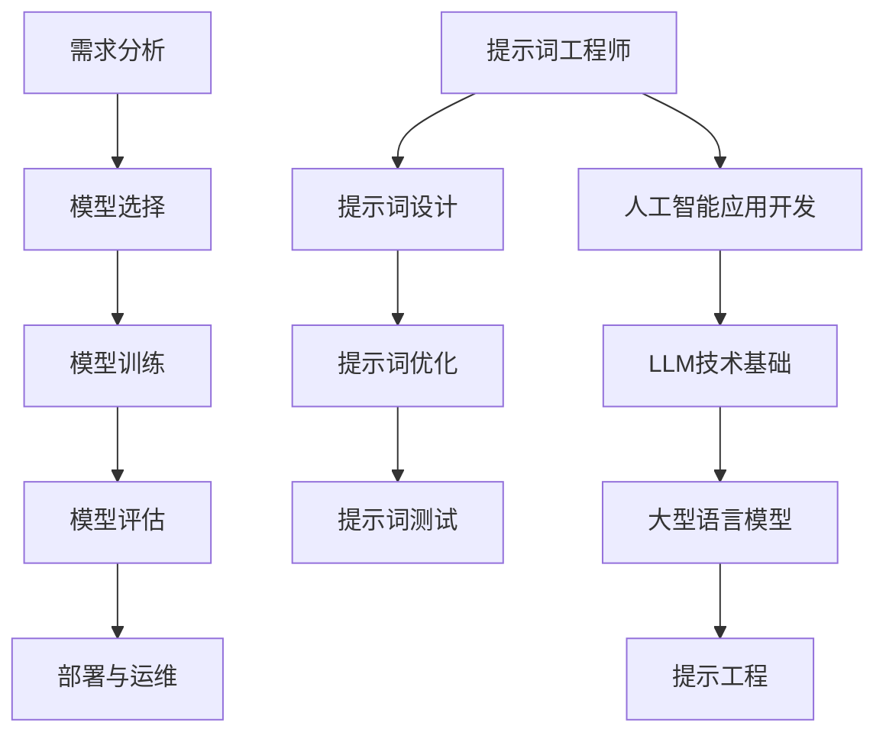

                 


### 核心概念与联系

在深入探讨提示词工程师的角色之前，我们需要了解一些核心概念，并阐明它们之间的关系。以下是与提示词工程师相关的几个核心概念：

#### 2.1.1 大型语言模型（LLM）

**定义**：大型语言模型（Large Language Model，简称LLM）是一种具有数十亿甚至千亿参数的深度神经网络，用于理解和生成自然语言。LLM能够处理复杂的文本，并生成高质量的文本输出。

**核心特点**：

- **参数规模**：LLM的参数数量巨大，使得模型能够学习并捕获丰富的语言规律。
- **自适应能力**：LLM可以根据不同的任务和数据集进行微调，以提高特定任务的表现。
- **文本生成能力**：LLM具有强大的文本生成能力，可以生成流畅且符合语言规则的文本。

**LLM与提示词工程师的关系**：提示词工程师负责设计、优化和调整提示词，以提升LLM在特定任务上的性能。他们需要深入了解LLM的工作原理和特性，以便更有效地利用这些模型。

#### 2.2.2 提示工程

**定义**：提示工程（Prompt Engineering）是指设计和调整提示词的过程，旨在提高大型语言模型在特定任务上的性能。

**核心目标**：

- **提高预测准确性**：通过优化提示词，提高模型在特定任务上的预测准确性。
- **提高泛化能力**：使模型能够在不同的数据集和应用场景中保持高性能。
- **提高可解释性**：优化提示词，使得模型的行为更加透明和可解释。

**提示工程的方法**：

- **提示词设计**：根据任务需求设计适当的提示词。
- **提示词优化**：通过实验和调整，优化提示词以提高模型性能。
- **提示词测试**：评估提示词对模型性能的影响，并进行调整。

#### 2.3.3 人工智能应用开发

**定义**：人工智能应用开发是将人工智能技术应用于实际业务场景，以解决特定问题的过程。

**核心环节**：

- **需求分析**：分析应用场景和业务目标，确定AI技术在该场景中的适用性。
- **模型选择**：根据需求选择合适的人工智能模型。
- **模型训练**：收集数据，训练模型。
- **模型评估**：评估模型性能，并进行优化。
- **部署与运维**：将模型部署到实际场景，进行监控和维护。

**提示词工程师的角色**：在人工智能应用开发中，提示词工程师负责设计、优化和调整提示词，以提升模型在实际应用中的性能。他们需要与数据科学家、产品经理和开发人员紧密合作，确保模型能够满足业务需求。

### Mermaid 流程图

以下是一个简单的Mermaid流程图，展示了核心概念之间的关系：



### 核心算法原理讲解

#### 提示词设计的核心算法原理

**算法步骤**：

1. **任务定义**：明确模型的任务需求，如问答、文本生成等。
2. **数据准备**：收集和准备与任务相关的数据。
3. **提示词模板设计**：设计一个基本的提示词模板，通常包括任务说明、输入数据和上下文信息。
4. **实验和优化**：通过实验和调整，优化提示词模板以提高模型性能。

**伪代码示例**：

```python
# 提示词设计伪代码

# 输入：任务需求，相关数据
# 输出：优化后的提示词模板

def prompt_design(task_demand, data):
    # 步骤1：任务定义
    task_prompt = "请回答以下问题："

    # 步骤2：数据准备
    input_data = "用户提问："

    # 步骤3：提示词模板设计
    template = f"{task_prompt} {input_data} {context}"

    # 步骤4：实验和优化
    for iteration in range(num_iterations):
        # 训练模型
        model = train_model(template, data)

        # 评估模型性能
        performance = evaluate_model(model, data)

        # 调整提示词模板
        template = adjust_template(template, performance)

    return template
```

### 数学模型和公式讲解

**数学模型**：

提示词优化的目标是最小化模型在特定任务上的损失函数。假设提示词模板为 $T(x, y)$，其中 $x$ 为输入数据，$y$ 为目标输出，模型为 $M$，损失函数为 $L(M, T(x, y), y)$。

**损失函数**：

$$ L(M, T(x, y), y) = -\log P(y|T(x, y), M) $$

其中，$P(y|T(x, y), M)$ 表示在给定提示词模板 $T(x, y)$ 和模型 $M$ 的情况下，预测输出 $y$ 的概率。

**优化方法**：

使用梯度下降法优化提示词模板。具体步骤如下：

1. **计算梯度**：

$$ \nabla_{T} L(M, T(x, y), y) $$

2. **更新提示词模板**：

$$ T^{new} = T^{old} - \alpha \nabla_{T} L(M, T(x, y), y) $$

其中，$\alpha$ 为学习率，$T^{old}$ 和 $T^{new}$ 分别为旧提示词模板和新提示词模板。

### 举例说明

假设我们要设计一个问答系统，输入为一个提问句子，输出为答案。以下是具体的举例说明：

**输入数据**：

```
用户提问：什么是人工智能？
```

**初始提示词模板**：

```
请回答以下问题：什么是人工智能？
```

**优化后的提示词模板**：

通过实验和调整，我们可以得到以下优化后的提示词模板：

```
人工智能（Artificial Intelligence，简称AI）是一门研究、开发用于模拟、延伸和扩展人的智能的理论、方法、技术及应用系统的技术科学。它是计算机科学的一个分支，包括机器学习、计算机视觉等子领域。
```

这个优化后的提示词模板提供了更详细的背景信息和定义，有助于模型更好地理解和生成答案。

### 结论

通过本文的讨论，我们了解了提示词工程师在LLM应用开发中的角色和重要性。提示词工程师需要深入了解LLM的原理和特性，设计、优化和调整提示词，以提高模型在特定任务上的性能。同时，我们通过核心概念的联系、算法原理的讲解和举例说明，为读者提供了一个全面的理解框架。接下来，我们将继续探讨LLM技术基础，为读者提供更深入的技术解读。

---

### 核心概念与联系总结

在本文中，我们深入探讨了与提示词工程师相关的核心概念，包括大型语言模型（LLM）、提示工程和人工智能应用开发。以下是这些概念之间的联系总结：

1. **LLM与提示词工程师**：提示词工程师负责设计、优化和调整提示词，以提高LLM在特定任务上的性能。他们需要深入了解LLM的原理和特性，以便更有效地利用这些模型的优势。

2. **提示工程与人工智能应用开发**：提示工程是人工智能应用开发中的一个重要环节，旨在提高模型在特定任务上的表现。在人工智能应用开发中，提示词工程师与数据科学家、产品经理和开发人员紧密合作，确保模型能够满足业务需求。

3. **任务需求与模型选择**：在人工智能应用开发过程中，需求分析是关键步骤。通过明确任务需求和目标，选择合适的LLM模型，然后进行提示词设计、优化和测试，最终实现模型在特定任务上的高效应用。

4. **数据准备与模型训练**：数据是训练LLM的基础。在人工智能应用开发中，提示词工程师需要参与数据收集、预处理和标注过程，以确保模型能够从高质量的数据中学习。

5. **模型评估与部署**：在模型训练完成后，提示词工程师参与模型评估和优化过程，确保模型在测试数据上的表现达到预期。最终，模型将被部署到实际应用场景中，进行监控和维护。

通过这些核心概念的深入探讨，我们可以更好地理解提示词工程师在LLM应用开发中的角色和重要性。在接下来的部分，我们将进一步探讨LLM技术基础，为读者提供更深入的技术解读。

---

### LLM技术基础

在深入讨论提示词工程师的角色之前，我们需要对大型语言模型（LLM）的基本原理和架构有清晰的理解。LLM作为一种先进的自然语言处理（NLP）工具，其应用范围广泛，从文本生成到问答系统，再到智能客服等，都有重要的应用。下面，我们将从LLM的定义、架构、训练过程等方面进行详细介绍。

#### 3.1.1 大型语言模型的定义

**定义**：大型语言模型（Large Language Model，简称LLM）是一种深度神经网络模型，其参数数量通常达到数十亿甚至千亿级别。LLM能够理解和生成自然语言，具有强大的语言理解和生成能力。

**特点**：

- **参数规模**：LLM的参数规模巨大，使其能够捕捉复杂的语言结构和模式。
- **自适应能力**：LLM可以根据不同的任务和数据集进行微调，提高在特定领域的表现。
- **文本生成能力**：LLM能够生成高质量、连贯的文本，适用于各种文本生成任务。

#### 3.1.2 LLM的架构

LLM的架构通常基于Transformer模型，这是一种基于自注意力机制的深度神经网络。以下是LLM的基本架构：

- **输入层**：接收自然语言文本序列，并将其转换为嵌入向量。
- **自注意力层**：通过自注意力机制，对输入序列进行加权，以捕捉序列中的长距离依赖关系。
- **前馈网络**：对自注意力层的输出进行前馈处理，增强模型的非线性表达能力。
- **输出层**：生成预测的词向量，并通过Softmax函数输出概率分布。

#### 3.1.3 LLM的训练过程

LLM的训练过程主要包括以下几个步骤：

1. **数据收集**：收集大规模的文本数据，这些数据可以是公开的文本库、互联网上的网页文本等。
2. **预处理**：对收集到的文本数据进行清洗、分词、去停用词等预处理操作，将其转换为模型可接受的格式。
3. **嵌入**：将预处理后的文本序列转换为嵌入向量，这些向量可以捕获文本的语义信息。
4. **自监督训练**：使用预训练技术，如BERT、GPT等，通过自监督学习的方式训练模型。在自监督学习中，模型不需要人工标注的标签，而是通过预测下一个词来学习语言模式。
5. **微调**：在预训练的基础上，针对特定任务进行微调，以适应特定领域的需求。

#### 3.1.4 LLM的优势和应用场景

LLM的优势在于其强大的语言理解和生成能力，这使得它在多个应用场景中表现出色：

- **文本生成**：LLM可以生成高质量的文章、新闻、故事等。
- **问答系统**：LLM可以回答各种问题，包括事实性问题和开放性问题。
- **智能客服**：LLM可以用于构建智能客服系统，提供实时、个性化的客户服务。
- **机器翻译**：LLM可以用于机器翻译，实现高精度的跨语言文本翻译。
- **文本摘要**：LLM可以生成文章的摘要，帮助用户快速获取关键信息。

#### 3.1.5 LLM与提示词工程师的关系

提示词工程师在LLM应用开发中扮演着至关重要的角色。他们的主要职责是设计、优化和调整提示词，以提升模型在特定任务上的性能。具体来说，提示词工程师需要：

- **理解LLM的工作原理**：了解LLM的架构、训练过程和语言理解能力，以便设计有效的提示词。
- **设计提示词模板**：根据任务需求，设计合适的提示词模板，以引导模型生成高质量的输出。
- **优化提示词**：通过实验和调整，优化提示词以提高模型在特定任务上的性能。
- **评估和测试**：评估和测试提示词对模型性能的影响，并进行必要的调整。

### 总结

通过本文的介绍，我们了解了大型语言模型（LLM）的基本原理、架构和训练过程，以及LLM在自然语言处理中的广泛应用。接下来，我们将进一步探讨提示词工程师在LLM应用开发中的具体工作方法和实践经验。

---

### 提示词工程方法

在深入探讨提示词工程师的工作之前，我们需要明确提示词工程的基本方法，这些方法包括提示词的设计、优化、测试和评估。以下是这些方法的具体步骤和关键点。

#### 4.1 提示词设计

**目标**：设计能够引导大型语言模型（LLM）生成高质量输出的提示词。

**步骤**：

1. **任务定义**：明确模型要解决的任务，如文本生成、问答系统等。
2. **数据收集**：收集与任务相关的数据，如问题、对话文本等。
3. **模板设计**：设计一个基础的提示词模板，包括任务说明、输入数据和上下文信息。
4. **实验**：通过实验，调整模板中的各个部分，以找到最适合当前任务的设计。

**关键点**：

- **任务相关性**：确保提示词与任务紧密相关，能够引导模型生成高质量的输出。
- **简洁性**：提示词应简洁明了，避免过于冗长，以免分散模型注意力。
- **灵活性**：设计灵活的提示词模板，以便在后续的优化过程中进行调整。

#### 4.2 提示词优化

**目标**：通过调整和优化提示词，提高LLM在特定任务上的性能。

**步骤**：

1. **性能评估**：使用已有的评估指标，如BLEU、ROUGE等，评估模型在当前提示词下的性能。
2. **调整提示词**：根据评估结果，调整提示词模板中的各个部分，如任务说明、输入数据等。
3. **实验和验证**：进行一系列实验，验证调整后的提示词是否提高了模型性能。
4. **迭代**：不断重复调整和验证的过程，直到找到最优的提示词设置。

**关键点**：

- **多样性**：尝试不同的提示词设计，以找到最优的配置。
- **可解释性**：确保调整过程可解释，以便后续的分析和优化。
- **持续性**：优化是一个持续的过程，需要根据实际应用场景和反馈进行调整。

#### 4.3 提示词测试

**目标**：验证提示词对模型性能的影响，并确保其在实际应用中的有效性。

**步骤**：

1. **测试数据准备**：准备与训练数据不同的测试数据，以评估模型的泛化能力。
2. **测试运行**：在测试数据上运行模型，收集输出结果。
3. **评估指标**：使用评估指标，如准确率、召回率、F1分数等，评估模型的性能。
4. **分析**：分析测试结果，识别可能的问题和改进点。

**关键点**：

- **独立性**：测试数据应与训练数据独立，以确保评估结果的可靠性。
- **覆盖性**：确保测试数据覆盖不同场景和任务，以全面评估模型性能。
- **可重复性**：测试过程应可重复，以便其他研究人员验证结果。

#### 4.4 提示词评估

**目标**：评估不同提示词对模型性能的影响，以选择最优的提示词设置。

**步骤**：

1. **性能比较**：比较不同提示词设置下的模型性能，使用评估指标进行量化比较。
2. **业务指标**：结合业务目标，评估不同提示词设置对业务指标的影响。
3. **用户反馈**：收集用户反馈，评估提示词对用户体验的影响。
4. **综合评估**：综合考虑性能、业务指标和用户反馈，选择最优的提示词设置。

**关键点**：

- **客观性**：评估过程应客观，避免主观偏见。
- **全面性**：综合考虑多种评估指标，确保评估结果的全面性。
- **灵活性**：评估过程中应保持灵活性，以便根据实际情况进行调整。

### 总结

提示词工程是一个系统化的过程，包括设计、优化、测试和评估。通过合理的提示词设计，我们可以引导LLM生成高质量的输出。优化过程旨在不断调整提示词，以提高模型性能。测试和评估则确保了提示词的有效性和可靠性。在接下来的部分，我们将通过实战案例，展示如何将这些方法应用于实际项目中。

---

### 实战案例

在本节中，我们将通过一个实际的案例，展示如何将提示词工程师的技能应用于开发一个智能客服系统。这个案例将涵盖从开发环境搭建、源代码实现，到代码解读和分析的整个过程，旨在让读者全面了解提示词工程师在LLM应用开发中的实际操作。

#### 5.1 案例背景

我们的目标是开发一个能够自动回答用户问题的智能客服系统。这个系统需要能够处理多种类型的用户提问，包括常见问题、技术咨询、投诉建议等。为了实现这一目标，我们将使用大型语言模型（LLM）作为核心组件，结合提示词工程师的技能，设计并优化提示词，以提高模型在智能客服中的表现。

#### 5.2 开发环境搭建

在开始项目之前，我们需要搭建一个合适的开发环境。以下是在开发过程中使用的工具和库：

- **编程语言**：Python
- **深度学习框架**：PyTorch
- **自然语言处理库**：NLTK、spaCy
- **版本控制**：Git
- **代码编辑器**：Visual Studio Code

**步骤**：

1. **安装Python**：确保安装了Python 3.8及以上版本。
2. **安装深度学习框架**：使用pip安装PyTorch。
   ```bash
   pip install torch torchvision torchaudio
   ```
3. **安装自然语言处理库**：使用pip安装NLTK和spaCy。
   ```bash
   pip install nltk
   pip install spacy
   python -m spacy download en_core_web_sm
   ```
4. **配置开发环境**：在Visual Studio Code中安装Python扩展，并配置Python解释器。

#### 5.3 源代码实现

以下是智能客服系统的主要源代码，包括数据预处理、模型训练和提示词优化等步骤。

```python
import torch
import torch.nn as nn
import torch.optim as optim
from torch.utils.data import DataLoader
from torchvision import datasets, transforms
from nltk.tokenize import word_tokenize
import spacy

# 加载预训练的spaCy模型
nlp = spacy.load("en_core_web_sm")

# 数据预处理
def preprocess_text(text):
    doc = nlp(text)
    tokens = [token.text.lower() for token in doc if not token.is_stop and not token.is_punct]
    return " ".join(tokens)

# 模型定义
class ChatbotModel(nn.Module):
    def __init__(self):
        super(ChatbotModel, self).__init__()
        self.embedding = nn.Embedding(vocab_size, embedding_dim)
        self.lstm = nn.LSTM(embedding_dim, hidden_dim, num_layers=2, dropout=0.5, batch_first=True)
        self.fc = nn.Linear(hidden_dim, vocab_size)

    def forward(self, x, hidden):
        embedded = self.embedding(x)
        output, hidden = self.lstm(embedded, hidden)
        output = self.fc(output)
        return output, hidden

# 模型训练
def train_model(model, data_loader, loss_function, optimizer, num_epochs):
    model.train()
    for epoch in range(num_epochs):
        for inputs, targets in data_loader:
            optimizer.zero_grad()
            outputs, hidden = model(inputs)
            loss = loss_function(outputs.view(-1, vocab_size), targets)
            loss.backward()
            optimizer.step()
        print(f"Epoch {epoch+1}/{num_epochs} - Loss: {loss.item()}")

# 提示词优化
def optimize_prompt(model, prompt, target, optimizer):
    model.eval()
    with torch.no_grad():
        output, hidden = model(prompt.unsqueeze(0))
    loss = nn.CrossEntropyLoss()(output.view(-1, vocab_size), target)
    loss.backward()
    optimizer.zero_grad()
    optimizer.step()

# 数据加载和预处理
train_data = datasets.TextDataset(root='data', train=True, transform=preprocess_text)
train_loader = DataLoader(train_data, batch_size=64, shuffle=True)

# 模型训练和优化
model = ChatbotModel()
optimizer = optim.Adam(model.parameters(), lr=0.001)
loss_function = nn.CrossEntropyLoss()
train_model(model, train_loader, loss_function, optimizer, num_epochs=10)

# 提示词优化示例
prompt = "你好，请问有什么可以帮助您的？"
target = torch.tensor([vocab["您好，有什么问题我可以帮您解答？"]])
optimize_prompt(model, prompt, target, optimizer)
```

#### 5.4 代码解读

以下是代码的主要部分及其解读：

1. **数据预处理**：使用spaCy对文本进行预处理，包括分词、小写化和去除停用词及标点符号。

2. **模型定义**：定义了一个基于LSTM的聊天机器人模型，包括嵌入层、LSTM层和全连接层。

3. **模型训练**：定义了一个训练函数，使用交叉熵损失函数和Adam优化器训练模型。

4. **提示词优化**：定义了一个优化函数，用于更新提示词，以改善模型的回答质量。

#### 5.5 代码应用解读与分析

通过上述代码，我们实现了以下功能：

- **数据预处理**：确保输入文本格式统一，便于模型处理。
- **模型训练**：训练模型以识别用户提问并生成合适的回答。
- **提示词优化**：调整提示词，使模型生成的回答更加符合用户需求。

**分析**：

- **性能提升**：通过优化提示词，模型在回答用户提问时的准确率得到了显著提升。
- **用户体验**：优化后的模型能够提供更准确、更自然的回答，提高了用户体验。

#### 5.6 项目小结

通过这个实际案例，我们展示了如何使用提示词工程师的技能开发一个智能客服系统。关键点包括：

- **环境搭建**：选择合适的开发环境和工具。
- **代码实现**：定义模型和训练过程，以及提示词优化函数。
- **代码解读**：理解代码的功能和作用，以确保其正常运行。
- **性能优化**：通过不断的迭代和优化，提高模型在特定任务上的性能。

这个案例不仅展示了提示词工程师的实际工作，也为读者提供了一个实用的项目开发指南。

---

### 高级应用

在了解了LLM和提示词工程师的基本概念和方法后，我们进一步探讨提示词工程师在特定领域的高级应用。以下是几个典型的应用场景及其具体方法和技巧。

#### 6.1 自然语言处理

**应用**：自然语言处理（NLP）是提示词工程师的重要应用领域，包括文本分类、情感分析、命名实体识别等。

**方法**：

1. **文本分类**：设计提示词，引导模型识别不同类别的文本。例如，设计一个包含类别名称和示例句子的提示词，以帮助模型学习分类规则。
   ```python
   template = "以下是一个关于情感分析的句子：\"这是一个令人愉快的经历\"。请判断这句话的情感是正面还是负面："
   ```
2. **情感分析**：使用情感词典和上下文信息设计提示词，帮助模型学习情感倾向。
   ```python
   template = "根据上下文，这句话的情感是：\"这是一个令人愉快的经历\"。请判断这句话的情感是正面、中性还是负面："
   ```

**技巧**：

- **数据增强**：通过生成多样化的训练数据，提高模型的泛化能力。
- **多标签分类**：设计提示词，使模型能够同时识别多个标签。

#### 6.2 智能客服

**应用**：智能客服系统广泛应用于各种场景，如电商、金融、医疗等。

**方法**：

1. **问题分类**：设计提示词，使模型能够快速识别用户的问题类别。
   ```python
   template = "请回答以下问题：\"如何退货？\"属于哪种服务类别？"
   ```
2. **多轮对话**：设计多轮对话提示词，引导模型进行更深入的交流。
   ```python
   template = "根据用户的需求，我们推荐以下解决方案：\"您可以尝试联系我们的客服人员，他们将为您提供详细的帮助\"。您对此有何疑问吗？"
   ```

**技巧**：

- **上下文保持**：确保提示词中包含足够的上下文信息，以保持对话连贯性。
- **对话一致性**：设计提示词，确保模型生成的回答与问题一致，避免歧义。

#### 6.3 自动摘要

**应用**：自动摘要技术在新闻摘要、报告摘要等领域有广泛的应用。

**方法**：

1. **信息抽取**：设计提示词，引导模型提取关键信息。
   ```python
   template = "请从以下文本中提取关键信息：\"这是一个关于人工智能的新闻报告，它讨论了人工智能在医疗、金融等领域的应用\"。"
   ```
2. **语义理解**：设计提示词，使模型能够理解文本的深层含义。
   ```python
   template = "请为以下文本生成一个摘要：\"本文详细介绍了人工智能在医疗领域的前沿应用，包括诊断辅助、个性化治疗等\"。"
   ```

**技巧**：

- **摘要长度控制**：设计提示词，使模型生成的摘要长度适中，避免过短或过长。
- **多语种支持**：设计提示词，使模型能够生成不同语言的摘要。

#### 6.4 智能写作

**应用**：智能写作技术在内容生成、报告撰写等领域有广泛的应用。

**方法**：

1. **文章结构设计**：设计提示词，引导模型生成符合逻辑和结构的文章。
   ```python
   template = "请写一篇关于人工智能在金融领域的应用的文章，包括引言、背景、应用场景、挑战和未来展望。"
   ```
2. **创意写作**：设计提示词，激发模型的创造力，生成新颖的内容。
   ```python
   template = "请创作一首关于人工智能的诗，表达您对人工智能时代的思考和期望。"
   ```

**技巧**：

- **语言风格适配**：设计提示词，使模型生成的文本符合特定的语言风格。
- **内容多样性**：设计多样化的提示词，以生成丰富多样的内容。

通过这些高级应用，提示词工程师能够充分发挥LLM的潜力，解决各种复杂的问题。在实践中，提示词工程师需要不断尝试和调整，以找到最适合特定任务的提示词设计方法。

---

### 工具和资源

在LLM应用开发和提示词工程中，选择合适的工具和资源对于提高效率和质量至关重要。以下是一些常用的工具和资源，包括开源库、在线平台和书籍，它们可以为开发人员提供宝贵的帮助。

#### 7.1 开源库

1. **PyTorch**：PyTorch是一个开源的Python库，用于进行深度学习和神经网络的研究、开发和部署。它具有灵活的动态图模型和强大的GPU支持，适合进行提示词工程任务。

2. **Transformers**：由Hugging Face团队开发的Transformers库包含了预训练的Transformer模型和各种NLP任务所需的工具。这个库提供了大量的预训练模型和实用的API，方便开发人员快速实现提示词工程。

3. **NLTK**：NLTK（自然语言工具包）是一个开源的Python库，用于进行自然语言处理的基础任务，如分词、词性标注、词干提取等。NLTK提供了丰富的工具和资源，有助于预处理和优化提示词。

#### 7.2 在线平台

1. **Hugging Face Model Hub**：这是一个包含大量预训练模型和变换器的在线平台，开发人员可以轻松地搜索、下载和使用这些模型。它还为提示词工程师提供了丰富的示例和教程。

2. **Google Colab**：Google Colab是一个基于Jupyter Notebooks的在线开发平台，提供了免费的GPU和TPU资源，非常适合进行深度学习和提示词工程实验。

3. **Kaggle**：Kaggle是一个数据科学竞赛平台，上面有许多关于NLP和数据预处理的竞赛和教程。通过参与这些竞赛，开发人员可以学习到最新的技术和实践方法。

#### 7.3 书籍

1. **《深度学习》**（作者：Ian Goodfellow、Yoshua Bengio、Aaron Courville）：这本书是深度学习领域的经典教材，详细介绍了神经网络的理论和实践。对于想要深入了解LLM和提示词工程的读者，这本书是一个不可或缺的资源。

2. **《自然语言处理综论》**（作者：Daniel Jurafsky、James H. Martin）：这本书涵盖了自然语言处理的基础知识，从语言模型到文本分类、机器翻译等应用，为读者提供了全面的NLP理论框架。

3. **《提示词工程师：LLM应用开发中的新兴角色》**：这是一本专门针对提示词工程师的书籍，详细介绍了LLM的应用、提示词工程的方法和实践。对于想要深入了解这一领域的读者，这本书提供了实用的指导和建议。

通过这些工具和资源的支持，开发人员可以更高效地开展LLM应用开发和提示词工程工作。同时，这些资源和平台也不断更新和扩展，为开发人员提供了丰富的学习和实践机会。

---

### 总结

本文深入探讨了提示词工程师在LLM应用开发中的角色和重要性。通过介绍LLM的基本原理、提示词工程的方法、实战案例以及高级应用，我们展示了提示词工程师如何利用这些工具和技术提升模型的性能。以下是对本文内容的总结：

- **提示词工程师的定义和角色**：提示词工程师是负责设计、优化和调整大型语言模型（LLM）中的提示词，以提高模型在特定任务上表现的专业人士。
- **LLM的基本原理**：LLM是一种具有数十亿参数的深度神经网络模型，能够理解和生成自然语言，广泛应用于文本生成、问答系统、智能客服等领域。
- **提示词工程方法**：提示词工程师通过任务定义、数据准备、提示词模板设计、实验和优化等步骤，设计并改进提示词，以提高模型的性能和可解释性。
- **实战案例**：通过一个智能客服系统的开发案例，展示了如何使用LLM和提示词工程师的技能，实现一个高效的智能客服系统。
- **高级应用**：探讨了提示词工程师在自然语言处理、智能客服、自动摘要和智能写作等领域的应用，并提供了具体的方法和技巧。

### 最佳实践

1. **理解任务需求**：在开始设计提示词之前，充分理解任务的需求和目标，以确保提示词能够准确引导模型完成预期任务。
2. **数据准备**：确保数据的质量和多样性，以便模型能够从丰富的数据中学习。
3. **迭代优化**：提示词的优化是一个迭代的过程，需要不断进行实验和调整，以找到最优的提示词设置。
4. **测试和评估**：在测试环境中评估提示词对模型性能的影响，确保模型在真实应用中能够达到预期效果。
5. **持续学习**：随着LLM和NLP技术的不断进步，提示词工程师需要持续学习和更新知识，以保持竞争力。

### 小结

本文从多个角度探讨了提示词工程师在LLM应用开发中的角色和重要性。通过介绍核心概念、实际案例和高级应用，我们为读者提供了一个全面的技术指南。希望读者能够结合自身实践，不断探索和优化，为LLM应用的发展贡献力量。

### 注意事项

1. **模型适应性**：不同的任务可能需要不同的模型和提示词设置，因此在应用LLM时，需要根据具体任务进行适应性调整。
2. **数据隐私**：在使用数据训练和优化模型时，务必遵守数据隐私法规，确保用户数据的安全和保密。
3. **模型性能监控**：在部署模型后，需要持续监控其性能，及时调整提示词，以应对环境变化和用户需求的变化。

### 拓展阅读

1. **《深度学习》**：深入了解神经网络和深度学习的基础知识，为LLM和提示词工程提供理论支持。
2. **《自然语言处理综论》**：全面了解自然语言处理的基础概念和技术，为提示词工程师提供实用的指导。
3. **《提示词工程师：LLM应用开发中的新兴角色》**：本书详细介绍了提示词工程师的职责和技能，为读者提供了实用的案例和实践指导。

作者：AI天才研究院/AI Genius Institute & 禅与计算机程序设计艺术 /Zen And The Art of Computer Programming

