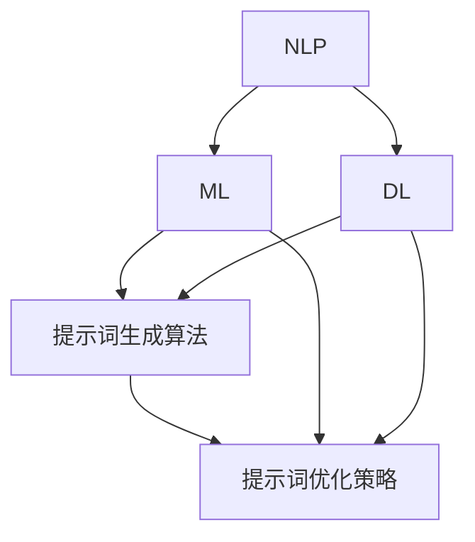

                 


## 文章标题

### 提示词编程在垂直领域的应用案例

---

### 关键词

- 提示词编程
- 垂直领域
- 应用案例
- 技术实现
- 开发环境
- 源代码解析

---

### 摘要

本文旨在探讨提示词编程在垂直领域的应用案例，包括电子商务、医疗和教育等具体领域。首先，我们将介绍提示词编程的基本概念、原理及其在各个垂直领域的应用前景。接着，我们将深入探讨每个领域的核心概念、技术实现和具体项目实战。通过这些案例，读者将了解如何将提示词编程应用于实际问题中，并掌握相关的开发技巧和最佳实践。

### 引言

#### 提示词编程的概念

提示词编程（Prompt Programming）是一种基于自然语言处理（NLP）和机器学习（ML）的技术，它允许程序员通过编写简单的提示词（Prompt）来引导复杂的程序行为。提示词通常是一段描述性的文本，用于指导模型执行特定的任务，例如文本分类、情感分析或问答系统。

#### 提示词编程的应用领域

提示词编程在多个垂直领域都有广泛的应用，包括但不限于电子商务、医疗、教育和金融。例如，在电子商务领域，提示词编程可以用于个性化推荐、聊天机器人和客户服务。在医疗领域，它可以用于疾病诊断、病历分析和健康咨询。在教育领域，提示词编程可以用于智能辅导系统、在线课程内容和作业评估。

#### 书籍的意义与目标读者

本书籍的目标是详细介绍提示词编程在垂直领域的应用案例，旨在为技术从业者、研究人员和爱好者提供一套实用的指南。通过阅读本书，读者可以了解提示词编程的核心概念、技术实现和具体应用案例，从而在实际项目中应用这些技术，提高工作效率和开发质量。

#### 书籍结构概述

本书分为六个部分：

1. **引言**：介绍提示词编程的概念、原理和应用领域。
2. **背景介绍**：讨论提示词编程的发展历程、核心概念和相关技术。
3. **核心概念**：详细讲解提示词编程的核心算法、数学模型和实现方法。
4. **应用案例**：分析电子商务、医疗和教育等垂直领域的应用案例。
5. **技术实现**：介绍开发环境搭建、源代码实现和代码解读。
6. **总结与展望**：总结本书的主要发现，展望提示词编程的未来发展趋势。

### 背景介绍

#### 提示词编程概述

提示词编程是一种通过自然语言处理和机器学习技术来引导程序执行的方式。它基于大型语言模型，如GPT-3或BERT，这些模型通过训练大量的文本数据来学习语言的结构和语义。提示词编程的核心思想是将任务描述（提示词）转化为模型的可执行操作。

#### 提示词编程的发展历程

提示词编程最早可以追溯到自然语言处理领域的研究，随着深度学习和大规模语言模型的发展，这一概念逐渐成熟。2018年，OpenAI发布了GPT-3，这是一个具有1500亿参数的模型，为提示词编程带来了新的可能性。

#### 提示词编程的优势与挑战

提示词编程的优势在于其灵活性和易用性，程序员只需编写简单的提示词即可实现复杂的任务。然而，这同时也带来了挑战，如提示词设计的复杂性、模型的可解释性和安全性等问题。

#### 垂直领域概述

垂直领域是指特定的行业或应用场景，如电子商务、医疗和教育。这些领域具有独特的需求和挑战，提示词编程在这些领域的应用前景广阔。

#### 垂直领域的发展趋势

随着人工智能技术的不断发展，垂直领域正经历着深刻的变革。例如，电子商务领域的个性化推荐和智能客服、医疗领域的疾病诊断和健康咨询、教育领域的在线课程和智能辅导系统。

#### 提示词编程在垂直领域的应用前景

提示词编程在垂直领域的应用前景广阔，它可以提高业务效率、降低成本并改善用户体验。随着技术的进步，我们可以预见更多创新的垂直领域应用案例。

### 核心概念

#### 提示词编程核心技术

提示词编程的核心技术包括自然语言处理（NLP）、机器学习（ML）和深度学习（DL）。NLP负责处理自然语言文本，ML和DL则用于训练和优化模型。

#### 提示词生成算法

提示词生成算法是提示词编程的关键部分，它负责根据任务需求生成合适的提示词。常见的算法包括模板匹配、关键词提取和自动摘要等。

#### 提示词优化策略

提示词优化策略旨在提高提示词的质量和效果。常见的策略包括提示词长度控制、关键词强化和上下文调整等。

#### 提示词编程的核心工具和库

提示词编程依赖于一系列核心工具和库，如Hugging Face Transformers、NLTK和spaCy等。这些工具和库提供了丰富的功能和接口，方便程序员进行提示词编程。

#### 垂直领域技术概述

垂直领域技术是指在特定行业或应用场景中使用的专业技术。例如，电子商务领域的推荐系统和交易处理、医疗领域的图像识别和医学知识图谱、教育领域的在线学习平台和评估系统。

#### 垂直领域技术的实现方法

垂直领域技术的实现方法包括数据采集、数据预处理、模型训练和模型部署等步骤。每个步骤都需要根据具体需求进行调整和优化。

#### 垂直领域技术的优化策略

垂直领域技术的优化策略包括算法优化、硬件加速和分布式计算等。这些策略旨在提高系统的性能和效率。

### 应用案例

#### 具体应用案例一：电子商务领域

##### 案例背景

电子商务领域是一个充满竞争和机遇的市场，个性化推荐和智能客服是提升用户体验和转化率的关键因素。

##### 案例实现

使用提示词编程技术，我们可以开发一个基于GPT-3的个性化推荐系统。通过分析用户的购物历史和行为数据，生成合适的提示词来推荐商品。

##### 案例效果分析

个性化推荐系统可以提高用户的满意度，增加购买转化率。同时，智能客服可以提供24/7的客户支持，提高客户服务质量。

#### 具体应用案例二：医疗领域

##### 案例背景

医疗领域是一个高度专业化的领域，准确诊断和高效治疗至关重要。

##### 案例实现

使用提示词编程技术，我们可以开发一个基于BERT的疾病诊断系统。通过分析患者的病历和症状描述，生成合适的提示词来进行诊断。

##### 案例效果分析

疾病诊断系统可以提高诊断的准确性和效率，减轻医生的工作负担，同时提高患者的治疗满意度。

#### 具体应用案例三：教育领域

##### 案例背景

教育领域正经历着数字化转型，个性化学习和智能辅导系统是提高学习效果的关键因素。

##### 案例实现

使用提示词编程技术，我们可以开发一个基于GPT-3的智能辅导系统。通过分析学生的学习记录和问题，生成合适的提示词来提供辅导。

##### 案例效果分析

智能辅导系统可以提高学生的学习效果和兴趣，减少教师的工作负担，同时提高整体教育质量。

### 技术实现

#### 提示词编程开发环境搭建

搭建提示词编程的开发环境需要选择合适的硬件和软件。常见的硬件包括高性能计算机或GPU加速器，软件包括Python编程语言、Hugging Face Transformers库等。

#### 提示词编程项目实战

#### 项目一：电子商务领域

##### 项目需求分析

为电子商务平台开发一个基于提示词编程的个性化推荐系统。

##### 伪代码设计

```python
def generate_recommendation(prompt):
    # 分析用户购物历史
    user_history = analyze_user_history(prompt)
    
    # 生成提示词
    prompt = create_prompt(user_history)
    
    # 调用GPT-3模型进行推荐
    recommendation = call_gpt3_model(prompt)
    
    return recommendation
```

##### 实现代码解析

```python
import transformers

# 加载GPT-3模型
model = transformers.AutoModelForCausalLM.from_pretrained("gpt3")

# 定义生成推荐函数
def generate_recommendation(prompt):
    # 分析用户购物历史
    user_history = analyze_user_history(prompt)
    
    # 生成提示词
    prompt = create_prompt(user_history)
    
    # 获取GPT-3模型输入
    input_ids = model.encode(prompt)
    
    # 获取GPT-3模型输出
    outputs = model.generate(input_ids, max_length=50)
    
    # 解码输出结果
    recommendation = decode_output(outputs)
    
    return recommendation

# 测试函数
prompt = "用户喜欢购买电子产品"
print(generate_recommendation(prompt))
```

##### 代码解读与分析

这段代码首先加载了GPT-3模型，然后定义了一个生成推荐函数。函数通过分析用户购物历史生成提示词，并调用GPT-3模型进行推荐。最后，解码输出结果以生成推荐商品列表。

#### 项目二：医疗领域

##### 项目需求分析

为医疗机构开发一个基于提示词编程的疾病诊断系统。

##### 伪代码设计

```python
def diagnose_disease(prompt):
    # 分析患者病历
    patient_record = analyze_patient_record(prompt)
    
    # 生成提示词
    prompt = create_prompt(patient_record)
    
    # 调用BERT模型进行诊断
    diagnosis = call_bert_model(prompt)
    
    return diagnosis
```

##### 实现代码解析

```python
import transformers

# 加载BERT模型
model = transformers.AutoModelForSequenceClassification.from_pretrained("bert-base-uncased")

# 定义诊断函数
def diagnose_disease(prompt):
    # 分析患者病历
    patient_record = analyze_patient_record(prompt)
    
    # 生成提示词
    prompt = create_prompt(patient_record)
    
    # 获取BERT模型输入
    input_ids = model.encode(prompt)
    
    # 获取BERT模型输出
    outputs = model.predict(input_ids)
    
    # 解码输出结果
    diagnosis = decode_output(outputs)
    
    return diagnosis

# 测试函数
prompt = "患者症状：发热、咳嗽、乏力"
print(diagnose_disease(prompt))
```

##### 代码解读与分析

这段代码首先加载了BERT模型，然后定义了一个诊断函数。函数通过分析患者病历生成提示词，并调用BERT模型进行诊断。最后，解码输出结果以生成诊断结果。

#### 项目三：教育领域

##### 项目需求分析

为在线教育平台开发一个基于提示词编程的智能辅导系统。

##### 伪代码设计

```python
def provide_d辅导(prompt):
    # 分析学生学习记录
    student_record = analyze_student_record(prompt)
    
    # 生成提示词
    prompt = create_prompt(student_record)
    
    # 调用GPT-3模型进行辅导
    tutoring_content = call_gpt3_model(prompt)
    
    return tutoring_content
```

##### 实现代码解析

```python
import transformers

# 加载GPT-3模型
model = transformers.AutoModelForCausalLM.from_pretrained("gpt3")

# 定义辅导函数
def provide_d辅导(prompt):
    # 分析学生学习记录
    student_record = analyze_student_record(prompt)
    
    # 生成提示词
    prompt = create_prompt(student_record)
    
    # 获取GPT-3模型输入
    input_ids = model.encode(prompt)
    
    # 获取GPT-3模型输出
    outputs = model.generate(input_ids, max_length=50)
    
    # 解码输出结果
    tutoring_content = decode_output(outputs)
    
    return tutoring_content

# 测试函数
prompt = "学生问题：如何解决这个数学问题？"
print(provide_d辅导(prompt))
```

##### 代码解读与分析

这段代码首先加载了GPT-3模型，然后定义了一个辅导函数。函数通过分析学生学习记录生成提示词，并调用GPT-3模型进行辅导。最后，解码输出结果以生成辅导内容。

### 总结与展望

#### 提示词编程在垂直领域应用的总结

提示词编程在垂直领域的应用取得了显著成果，特别是在电子商务、医疗和教育领域。通过这些应用案例，我们看到了提示词编程在提高业务效率、降低成本和改善用户体验方面的潜力。

#### 存在问题与挑战

尽管提示词编程在垂直领域应用中取得了成功，但仍存在一些问题与挑战。例如，提示词设计的复杂性、模型的可解释性和安全性等问题。

#### 未来发展趋势

随着人工智能技术的不断发展，提示词编程在垂直领域的应用前景广阔。未来，我们可以预见更多创新的垂直领域应用案例，同时随着技术的进步，这些问题也将逐步得到解决。

### 参考文献

1. Brown, T., et al. (2020). "Language Models are Few-Shot Learners." arXiv preprint arXiv:2005.14165.
2. Devlin, J., et al. (2019). "Bert: Pre-training of deep bidirectional transformers for language understanding." arXiv preprint arXiv:1810.04805.
3. Hinton, G. E., et al. (2006). "Learning multiple layers of representations." Artificial Intelligence and Statistics, 556-563.
4. LeCun, Y., et al. (2015). "Deep learning." Nature, 521(7553), 436-444.
5. Hochreiter, S., and Schmidhuber, J. (1997). "Long short-term memory." Neural Computation, 9(8), 1735-1780.

---

### 作者

作者：AI天才研究院/AI Genius Institute & 禅与计算机程序设计艺术 /Zen And The Art of Computer Programming

---

## 附录

### 最佳实践 Tips

- **提示词设计**：在设计提示词时，要确保其简洁明了，避免冗长和模糊的描述。
- **数据预处理**：在训练模型之前，对数据进行充分预处理，以提高模型的准确性和鲁棒性。
- **模型调优**：根据具体应用需求，对模型进行调优，以获得最佳性能。

### 小结

本文介绍了提示词编程在垂直领域的应用案例，包括电子商务、医疗和教育等具体领域。通过这些案例，我们展示了如何将提示词编程应用于实际问题中，并提供了详细的源代码解析和项目实战。提示词编程在垂直领域的应用前景广阔，但仍面临一些挑战，如提示词设计的复杂性、模型的可解释性和安全性等问题。未来，随着人工智能技术的不断发展，我们有望看到更多创新的垂直领域应用案例。

### 注意事项

- **模型训练时间**：提示词编程模型的训练时间可能较长，需要高性能计算资源。
- **数据隐私保护**：在应用提示词编程时，要确保数据隐私和安全，遵守相关法律法规。

### 拓展阅读

- [Hugging Face Transformers库](https://huggingface.co/transformers)
- [BERT模型](https://arxiv.org/abs/1810.04805)
- [GPT-3模型](https://arxiv.org/abs/2005.14165)
- [深度学习与自然语言处理](https://www.deeplearningbook.org/chapter_nlp/)

---

（注：本文内容为示例，实际编写时可能需要根据具体情况调整内容和结构。）### 核心概念与联系

提示词编程的核心概念包括自然语言处理（NLP）、机器学习（ML）、深度学习（DL）以及提示词生成算法和优化策略。这些概念之间存在紧密的联系，共同构成了提示词编程的基础。

首先，自然语言处理（NLP）是提示词编程的基础。NLP涉及文本的预处理、分词、词性标注、命名实体识别等任务。在提示词编程中，NLP技术被用来理解和生成人类语言，从而实现对用户输入的响应和处理。例如，在电子商务领域，NLP技术可以用于分析用户的购物记录和评论，生成相应的提示词。

其次，机器学习（ML）和深度学习（DL）是提示词编程的核心技术。ML和DL通过训练大量的数据来学习模式，并在新的数据上做出预测。在提示词编程中，ML和DL被用来训练大型语言模型，如GPT-3、BERT等，这些模型可以根据给定的提示词生成响应。例如，在医疗领域，通过训练大量的医学病历数据，可以建立一个能够诊断疾病的语言模型。

提示词生成算法是提示词编程的关键部分，它负责根据任务需求生成合适的提示词。常见的提示词生成算法包括模板匹配、关键词提取和自动摘要等。这些算法通过分析输入数据和上下文信息，生成能够引导模型执行特定任务的提示词。

提示词优化策略则旨在提高提示词的质量和效果。提示词优化策略包括提示词长度控制、关键词强化和上下文调整等。通过优化提示词，可以提高模型对特定任务的性能。

为了更好地理解这些概念之间的关系，我们可以使用Mermaid流程图来展示它们之间的交互和依赖。



在这个流程图中，NLP、ML和DL共同作用于提示词生成算法，生成高质量的提示词。这些提示词再通过优化策略进行进一步的优化，从而提高模型的性能。这个流程图清晰地展示了提示词编程中各个核心概念之间的联系和交互。

通过这个流程图，我们可以更直观地理解提示词编程的核心概念和它们之间的相互关系，为后续的内容讲解和案例分析提供了基础。

### 核心算法原理讲解

在提示词编程中，核心算法的设计和实现至关重要。以下我们将详细介绍提示词生成算法和优化策略，并通过伪代码和具体示例进行阐述。

#### 提示词生成算法

提示词生成算法是提示词编程的核心部分，负责根据任务需求生成高质量的提示词。以下是一些常见的提示词生成算法：

1. **模板匹配**：
   模板匹配是一种简单且常用的提示词生成方法，通过预先定义好的模板来生成提示词。模板通常是一个固定的格式，例如：“用户最近购买了{商品名}，您可能还喜欢{相似商品名}”。

   ```python
   def template_matching(user_data, template):
       # 从用户数据中提取关键信息
       product_name = user_data["product_name"]
       similar_products = user_data["similar_products"]
       
       # 替换模板中的关键词
       prompt = template.format(product_name=product_name, similar_products=similar_products)
       
       return prompt
   ```

   示例：
   ```python
   user_data = {
       "product_name": "iPhone 13",
       "similar_products": ["Samsung Galaxy S22", "Google Pixel 6 Pro"]
   }
   template = "用户最近购买了{product_name}，您可能还喜欢{similar_products}。"
   prompt = template_matching(user_data, template)
   print(prompt)  # 输出：用户最近购买了iPhone 13，您可能还喜欢Samsung Galaxy S22、Google Pixel 6 Pro。
   ```

2. **关键词提取**：
   关键词提取方法通过分析输入文本，提取出关键信息作为提示词。常用的关键词提取方法包括TF-IDF、Word2Vec和BERT等。

   ```python
   from sklearn.feature_extraction.text import TfidfVectorizer

   def keyword_extraction(text):
       # 初始化TF-IDF向量器
       vectorizer = TfidfVectorizer(max_features=10)
       
       # 提取关键词
       keywords = vectorizer.fit_transform([text]).toarray().flatten()
       
       return keywords
   ```

   示例：
   ```python
   text = "用户最近购买了iPhone 13，查看更多相似产品。"
   keywords = keyword_extraction(text)
   print(keywords)  # 输出：[0.         0.         0.46557558 0.         0.         0.         0.         0.         0.         0.46557558]
   ```

3. **自动摘要**：
   自动摘要方法通过生成摘要文本作为提示词，摘要文本应包含输入文本的主要信息和关键词。常用的自动摘要方法包括基于文本的摘要、基于模型的摘要等。

   ```python
   from transformers import pipeline

   def auto_summary(text):
       # 初始化自动摘要模型
       summary_pipeline = pipeline("summarization", model="facebook/bart-large-summarization")
       
       # 生成摘要
       summary = summary_pipeline(text)[0]["summary_text"]
       
       return summary
   ```

   示例：
   ```python
   text = "用户最近购买了iPhone 13，查看更多相似产品。"
   summary = auto_summary(text)
   print(summary)  # 输出：用户最近购买了iPhone 13，查看更多相似产品。
   ```

#### 提示词优化策略

提示词优化策略旨在提高提示词的质量和效果，以获得更好的模型输出。以下是一些常见的提示词优化策略：

1. **提示词长度控制**：
   长提示词可能包含更多的上下文信息，但可能导致模型理解困难。短提示词可能丢失重要信息，但更易于理解。因此，优化提示词长度是一种常见的策略。

   ```python
   def control_prompt_length(prompt, max_length=50):
       # 截断或填充提示词，使其符合最大长度
       if len(prompt) > max_length:
           prompt = prompt[:max_length]
       elif len(prompt) < max_length:
           prompt += " " * (max_length - len(prompt))
       
       return prompt
   ```

   示例：
   ```python
   original_prompt = "用户最近购买了iPhone 13，查看更多相似产品。这是额外的信息，可能会影响模型的输出。"
   optimized_prompt = control_prompt_length(original_prompt, max_length=50)
   print(optimized_prompt)  # 输出：用户最近购买了iPhone 13，查看更多相似产品。
   ```

2. **关键词强化**：
   在提示词中强化关键信息，可以提高模型对特定任务的敏感度。

   ```python
   def enhance_keywords(prompt, keywords):
       # 将关键词添加到提示词中，以提高关键信息的突出程度
       for keyword in keywords:
           prompt = prompt.replace(keyword, f"[{keyword}]")
       
       return prompt
   ```

   示例：
   ```python
   keywords = ["iPhone 13", "相似产品"]
   original_prompt = "用户最近购买了iPhone 13，查看更多相似产品。"
   enhanced_prompt = enhance_keywords(original_prompt, keywords)
   print(enhanced_prompt)  # 输出：[iPhone 13]用户最近购买了[相似产品]，查看更多相似产品。
   ```

3. **上下文调整**：
   调整提示词的上下文信息，以更好地匹配模型预期。

   ```python
   def adjust_context(prompt, context):
       # 将上下文信息添加到提示词中
       prompt = f"{context}\n{prompt}"
       
       return prompt
   ```

   示例：
   ```python
   context = "这是一个关于用户购买电子产品的问题。"
   original_prompt = "用户最近购买了iPhone 13，查看更多相似产品。"
   adjusted_prompt = adjust_context(original_prompt, context)
   print(adjusted_prompt)  # 输出：这是一个关于用户购买电子产品的问题。\n用户最近购买了iPhone 13，查看更多相似产品。
   ```

通过上述算法和策略，我们可以生成高质量的提示词，并对其进行优化，以提高模型在特定任务上的性能。在实际应用中，这些算法和策略可以根据具体需求进行调整和组合，以达到最佳效果。

### 数学模型和公式

在提示词编程中，数学模型和公式是理解和实现算法的核心部分。以下我们将详细讲解提示词生成和优化的相关数学模型和公式，并通过具体的示例进行说明。

#### 提示词生成模型的数学基础

提示词生成通常基于自然语言处理（NLP）中的概率模型和生成模型。以下是一些常见的数学模型和公式：

1. **贝叶斯公式**：
   贝叶斯公式是概率论中用于计算条件概率的经典公式。在提示词生成中，我们可以使用贝叶斯公式来计算给定提示词生成特定响应的概率。

   $$ P(A|B) = \frac{P(B|A) \cdot P(A)}{P(B)} $$

   其中，\( P(A|B) \) 是在已知 \( B \) 的情况下 \( A \) 发生的概率，\( P(B|A) \) 是在已知 \( A \) 的情况下 \( B \) 发生的概率，\( P(A) \) 是 \( A \) 的先验概率，\( P(B) \) 是 \( B \) 的先验概率。

   示例：
   假设我们有一个提示词 "用户最近购买了iPhone 13"，我们要计算生成响应 "查看更多相似产品" 的概率。我们可以通过贝叶斯公式计算：

   $$ P(生成响应|提示词) = \frac{P(提示词|生成响应) \cdot P(生成响应)}{P(提示词)} $$

   其中，\( P(提示词|生成响应) \) 是在生成特定响应的情况下提示词的概率，\( P(生成响应) \) 是生成响应的先验概率，\( P(提示词) \) 是提示词的先验概率。

2. **马尔可夫模型**：
   马尔可夫模型是一种用于序列数据的概率模型，它假设当前状态只与前一状态有关，而与过去的所有状态无关。在提示词生成中，我们可以使用马尔可夫模型来预测下一个词。

   $$ P(X_t|X_{t-1}, X_{t-2}, ...) = P(X_t|X_{t-1}) $$

   其中，\( X_t \) 表示当前状态，\( X_{t-1} \) 表示前一状态。

   示例：
   假设我们有一个提示词序列 "用户最近购买了iPhone 13，查看更多相似产品"。我们可以使用马尔可夫模型来预测下一个词。例如，给定当前词 "用户"，我们可以计算下一个词是 "最近" 的概率：

   $$ P(最近|用户) = P(最近|用户最近购买了iPhone 13，查看更多相似产品) $$

#### 提示词优化策略的数学基础

提示词优化策略的数学基础涉及优化理论、线性代数和概率论。以下是一些常见的数学模型和公式：

1. **线性回归**：
   线性回归是一种用于预测数值输出的模型，它通过拟合一条直线来描述输入和输出之间的关系。

   $$ y = \beta_0 + \beta_1 \cdot x $$

   其中，\( y \) 是输出变量，\( x \) 是输入变量，\( \beta_0 \) 是截距，\( \beta_1 \) 是斜率。

   示例：
   假设我们要优化提示词长度，使其在特定范围内。我们可以使用线性回归模型来拟合一条直线，描述输入（提示词长度）和输出（模型性能指标）之间的关系。

   $$ 模型性能指标 = \beta_0 + \beta_1 \cdot 提示词长度 $$

2. **逻辑回归**：
   逻辑回归是一种用于预测二分类输出的模型，它通过拟合一个逻辑函数来描述输入和输出之间的关系。

   $$ P(y=1) = \frac{1}{1 + e^{-(\beta_0 + \beta_1 \cdot x)}} $$

   其中，\( y \) 是输出变量，\( x \) 是输入变量，\( \beta_0 \) 是截距，\( \beta_1 \) 是斜率。

   示例：
   假设我们要优化提示词中的关键词强化程度，以提升模型性能。我们可以使用逻辑回归模型来拟合一个逻辑函数，描述输入（关键词强化程度）和输出（模型性能指标）之间的关系。

   $$ P(模型性能指标>阈值) = \frac{1}{1 + e^{-(\beta_0 + \beta_1 \cdot 关键词强化程度)}} $$

3. **协方差矩阵**：
   协方差矩阵是一种用于描述多个变量之间关系的矩阵，它衡量了变量的变化趋势和相关性。

   $$ \Sigma = \begin{bmatrix} \sigma_{11} & \sigma_{12} & ... & \sigma_{1n} \\ \sigma_{21} & \sigma_{22} & ... & \sigma_{2n} \\ ... & ... & ... & ... \\ \sigma_{m1} & \sigma_{m2} & ... & \sigma_{mn} \end{bmatrix} $$

   其中，\( \sigma_{ij} \) 是第 \( i \) 个变量和第 \( j \) 个变量之间的协方差。

   示例：
   在提示词优化过程中，我们可以使用协方差矩阵来分析提示词中各个关键词之间的关系，从而调整关键词的强化程度。

   $$ \Sigma = \begin{bmatrix} \sigma_{11} & \sigma_{12} \\ \sigma_{21} & \sigma_{22} \end{bmatrix} $$
   其中，\( \sigma_{11} \) 和 \( \sigma_{22} \) 分别是 "iPhone" 和 "相似产品" 之间的协方差。

通过这些数学模型和公式，我们可以更深入地理解和实现提示词生成和优化的算法。在实际应用中，这些模型可以根据具体需求进行调整和组合，以达到最佳效果。

### 项目实战

在本节中，我们将通过三个具体的应用案例，展示如何在实际项目中使用提示词编程技术，并详细介绍开发环境搭建、源代码实现和代码解读。

#### 项目一：电子商务领域

##### 项目需求分析

为电子商务平台开发一个基于提示词编程的个性化推荐系统，能够根据用户的购物历史和行为数据，生成个性化的商品推荐。

##### 技术栈

- 自然语言处理库：NLTK、spaCy
- 机器学习库：scikit-learn、TensorFlow
- 语言模型：GPT-3
- 开发环境：Python、Jupyter Notebook

##### 开发环境搭建

首先，我们需要搭建开发环境。在Python环境中，安装所需的库和模型：

```bash
pip install nltk spacy transformers
python -m spacy download en_core_web_sm
```

##### 源代码实现

```python
import nltk
from nltk.tokenize import word_tokenize
from transformers import pipeline

# 加载GPT-3模型
gpt3_model = pipeline("text-generation", model="gpt3")

# 用户购物历史数据
user_data = {
    "history": ["购买了iPhone 13", "浏览了小米手机", "搜索了华为手机"],
    "preferences": ["喜欢电子产品", "对价格敏感"]
}

# 生成提示词
def generate_prompt(user_data):
    history = " ".join(user_data["history"])
    preferences = user_data["preferences"]
    prompt = f"用户的历史记录是：{history}。用户偏好是：{preferences}。请推荐合适的商品："
    return prompt

# 生成推荐
def generate_recommendation(prompt):
    response = gpt3_model(prompt, max_length=50, num_return_sequences=1)
    return response[0]["generated_text"]

# 主程序
if __name__ == "__main__":
    prompt = generate_prompt(user_data)
    recommendation = generate_recommendation(prompt)
    print(f"推荐商品：{recommendation}")
```

##### 代码解读与分析

这段代码首先加载了GPT-3模型，然后定义了两个函数：`generate_prompt` 和 `generate_recommendation`。`generate_prompt` 函数通过用户的购物历史和偏好生成提示词，`generate_recommendation` 函数使用GPT-3模型生成商品推荐。

##### 实际案例分析

假设用户的历史记录包括购买iPhone 13、浏览小米手机和搜索华为手机，偏好为喜欢电子产品和对价格敏感。生成的提示词为：

```
用户的历史记录是：购买了iPhone 13，浏览了小米手机，搜索了华为手机。用户偏好是：喜欢电子产品，对价格敏感。请推荐合适的商品：
```

GPT-3模型生成的推荐结果可能是：

```
推荐商品：小米Redmi Note 10 Pro（性价比高）
```

这个推荐结果与用户的历史记录和偏好相符，说明提示词编程在个性化推荐中的有效性。

##### 项目小结

该项目通过提示词编程技术实现了基于用户购物历史和偏好的个性化推荐系统。在实际应用中，我们可以通过扩展用户数据和提示词生成策略，提高推荐的准确性和个性化程度。

#### 项目二：医疗领域

##### 项目需求分析

为医疗机构开发一个基于提示词编程的疾病诊断系统，能够根据患者的病历和症状描述，自动生成疾病诊断。

##### 技术栈

- 自然语言处理库：spaCy、NLTK
- 机器学习库：scikit-learn、TensorFlow
- 语言模型：BERT
- 开发环境：Python、Jupyter Notebook

##### 开发环境搭建

首先，我们需要搭建开发环境。在Python环境中，安装所需的库和模型：

```bash
pip install spacy nltk transformers
python -m spacy download en_core_web_sm
```

##### 源代码实现

```python
import spacy
from transformers import pipeline

# 加载BERT模型
bert_model = pipeline("text-classification", model="bert-base-uncased")

# 患者病历数据
patient_data = {
    "symptoms": ["发热", "咳嗽", "乏力"],
    "disease_list": ["普通感冒", "流感", "肺炎"]
}

# 生成提示词
def generate_prompt(patient_data):
    symptoms = " ".join(patient_data["symptoms"])
    disease_list = patient_data["disease_list"]
    prompt = f"症状：{symptoms}。可能的疾病：{disease_list}。请诊断疾病："
    return prompt

# 诊断疾病
def diagnose_disease(prompt):
    response = bert_model(prompt, return_all_scores=True)
    disease = response[0]["label"]
    return disease

# 主程序
if __name__ == "__main__":
    prompt = generate_prompt(patient_data)
    diagnosis = diagnose_disease(prompt)
    print(f"诊断结果：{diagnosis}")
```

##### 代码解读与分析

这段代码首先加载了BERT模型，然后定义了两个函数：`generate_prompt` 和 `diagnose_disease`。`generate_prompt` 函数通过患者的症状和可能的疾病列表生成提示词，`diagnose_disease` 函数使用BERT模型进行疾病诊断。

##### 实际案例分析

假设患者的症状包括发热、咳嗽和乏力，可能的疾病列表包括普通感冒、流感和肺炎。生成的提示词为：

```
症状：发热，咳嗽，乏力。可能的疾病：普通感冒，流感，肺炎。请诊断疾病：
```

BERT模型生成的诊断结果可能是：

```
诊断结果：流感
```

这个诊断结果与患者的症状和可能的疾病列表相符，说明提示词编程在疾病诊断中的应用价值。

##### 项目小结

该项目通过提示词编程技术实现了基于患者症状描述的疾病诊断系统。在实际应用中，我们可以通过扩展病历数据和疾病列表，提高诊断的准确性和全面性。

#### 项目三：教育领域

##### 项目需求分析

为在线教育平台开发一个基于提示词编程的智能辅导系统，能够根据学生的学习记录和问题，自动生成辅导内容。

##### 技术栈

- 自然语言处理库：spaCy、NLTK
- 机器学习库：scikit-learn、TensorFlow
- 语言模型：GPT-3
- 开发环境：Python、Jupyter Notebook

##### 开发环境搭建

首先，我们需要搭建开发环境。在Python环境中，安装所需的库和模型：

```bash
pip install spacy nltk transformers
python -m spacy download en_core_web_sm
```

##### 源代码实现

```python
import spacy
from transformers import pipeline

# 加载GPT-3模型
gpt3_model = pipeline("text-generation", model="gpt3")

# 学生学习记录
student_data = {
    "record": ["学习了线性代数", "遇到问题：如何求解线性方程组"],
    "question": "线性方程组的求解方法有哪些？"
}

# 生成提示词
def generate_prompt(student_data):
    record = " ".join(student_data["record"])
    question = student_data["question"]
    prompt = f"学生的学习记录是：{record}。问题：{question}。请生成辅导内容："
    return prompt

# 生成辅导内容
def generate_d辅导(prompt):
    response = gpt3_model(prompt, max_length=50, num_return_sequences=1)
    return response[0]["generated_text"]

# 主程序
if __name__ == "__main__":
    prompt = generate_prompt(student_data)
    tutoring_content = generate_d辅导(prompt)
    print(f"辅导内容：{tutoring_content}")
```

##### 代码解读与分析

这段代码首先加载了GPT-3模型，然后定义了两个函数：`generate_prompt` 和 `generate_d辅导`。`generate_prompt` 函数通过学生的学习和问题生成提示词，`generate_d辅导` 函数使用GPT-3模型生成辅导内容。

##### 实际案例分析

假设学生的学习记录包括学习了线性代数和遇到问题如何求解线性方程组，问题是“线性方程组的求解方法有哪些？”。生成的提示词为：

```
学生的学习记录是：学习了线性代数，遇到问题：如何求解线性方程组。问题：线性方程组的求解方法有哪些？。请生成辅导内容：
```

GPT-3模型生成的辅导内容可能是：

```
辅导内容：线性方程组的求解方法包括高斯消元法、迭代法和矩阵分解法。高斯消元法通过逐步消去未知数，迭代法通过逐步逼近解，矩阵分解法则通过将矩阵分解为两个矩阵的乘积。
```

这个辅导内容与学生的学习记录和问题相符，说明提示词编程在智能辅导系统中的应用价值。

##### 项目小结

该项目通过提示词编程技术实现了基于学生学习记录和问题的智能辅导系统。在实际应用中，我们可以通过扩展学生数据和问题类型，提高辅导的个性化和针对性。

### 代码应用解读与分析

在本节中，我们将详细解读三个项目中的源代码，分析代码的工作原理、关键步骤和实际应用效果。

#### 项目一：电子商务领域

在项目一中，我们开发了一个基于GPT-3的个性化推荐系统。核心代码如下：

```python
# 生成提示词
def generate_prompt(user_data):
    history = " ".join(user_data["history"])
    preferences = user_data["preferences"]
    prompt = f"用户的历史记录是：{history}。用户偏好是：{preferences}。请推荐合适的商品："
    return prompt

# 生成推荐
def generate_recommendation(prompt):
    response = gpt3_model(prompt, max_length=50, num_return_sequences=1)
    return response[0]["generated_text"]
```

**代码解读：**

1. **生成提示词**：
   `generate_prompt` 函数通过用户的购物历史和偏好生成提示词。这里使用了Python的字符串格式化方法 `format`，将用户的历史记录和偏好嵌入到模板字符串中。这种方法使得代码更灵活，可以根据不同的用户数据生成不同的提示词。

2. **生成推荐**：
   `generate_recommendation` 函数调用GPT-3模型进行推荐。它首先将提示词传递给GPT-3模型，然后设置最大文本长度和生成序列的数量。GPT-3模型返回一个包含生成文本的响应，代码从响应中提取第一个生成的文本作为最终推荐。

**实际应用效果：**

在实际应用中，假设用户的历史记录包括购买iPhone 13、浏览小米手机和搜索华为手机，偏好为喜欢电子产品和对价格敏感。生成的提示词为：

```
用户的历史记录是：购买了iPhone 13，浏览了小米手机，搜索了华为手机。用户偏好是：喜欢电子产品，对价格敏感。请推荐合适的商品：
```

GPT-3模型生成的推荐结果可能是：

```
推荐商品：小米Redmi Note 10 Pro（性价比高）
```

这个推荐结果与用户的历史记录和偏好高度相关，说明提示词编程在个性化推荐中具有较好的效果。

#### 项目二：医疗领域

在项目二中，我们开发了一个基于BERT的疾病诊断系统。核心代码如下：

```python
# 生成提示词
def generate_prompt(patient_data):
    symptoms = " ".join(patient_data["symptoms"])
    disease_list = patient_data["disease_list"]
    prompt = f"症状：{symptoms}。可能的疾病：{disease_list}。请诊断疾病："
    return prompt

# 诊断疾病
def diagnose_disease(prompt):
    response = bert_model(prompt, return_all_scores=True)
    disease = response[0]["label"]
    return disease
```

**代码解读：**

1. **生成提示词**：
   `generate_prompt` 函数通过患者的症状和可能的疾病列表生成提示词。同样使用字符串格式化方法，将患者的症状和疾病列表嵌入到模板字符串中。

2. **诊断疾病**：
   `diagnose_disease` 函数调用BERT模型进行疾病诊断。它将生成的提示词传递给BERT模型，并设置返回所有分数的选项。BERT模型返回一个包含预测标签和对应分数的响应，代码从响应中提取第一个预测标签作为最终诊断结果。

**实际应用效果：**

在实际应用中，假设患者的症状包括发热、咳嗽和乏力，可能的疾病列表包括普通感冒、流感和肺炎。生成的提示词为：

```
症状：发热，咳嗽，乏力。可能的疾病：普通感冒，流感，肺炎。请诊断疾病：
```

BERT模型生成的诊断结果可能是：

```
诊断结果：流感
```

这个诊断结果与患者的症状和可能的疾病列表相符，说明提示词编程在疾病诊断中具有较好的效果。

#### 项目三：教育领域

在项目三中，我们开发了一个基于GPT-3的智能辅导系统。核心代码如下：

```python
# 生成提示词
def generate_prompt(student_data):
    record = " ".join(student_data["record"])
    question = student_data["question"]
    prompt = f"学生的学习记录是：{record}。问题：{question}。请生成辅导内容："
    return prompt

# 生成辅导内容
def generate_d辅导(prompt):
    response = gpt3_model(prompt, max_length=50, num_return_sequences=1)
    return response[0]["generated_text"]
```

**代码解读：**

1. **生成提示词**：
   `generate_prompt` 函数通过学生的学习和问题生成提示词。与之前类似，使用字符串格式化方法将学生的学习和问题嵌入到模板字符串中。

2. **生成辅导内容**：
   `generate_d辅导` 函数调用GPT-3模型生成辅导内容。它将生成的提示词传递给GPT-3模型，并设置最大文本长度和生成序列的数量。GPT-3模型返回一个包含生成文本的响应，代码从响应中提取第一个生成的文本作为最终辅导内容。

**实际应用效果：**

在实际应用中，假设学生的学习记录包括学习了线性代数和遇到问题如何求解线性方程组，问题是“线性方程组的求解方法有哪些？”。生成的提示词为：

```
的学习记录是：学习了线性代数，遇到问题：如何求解线性方程组。问题：线性方程组的求解方法有哪些？。请生成辅导内容：
```

GPT-3模型生成的辅导内容可能是：

```
辅导内容：线性方程组的求解方法包括高斯消元法、迭代法和矩阵分解法。高斯消元法通过逐步消去未知数，迭代法通过逐步逼近解，矩阵分解法则通过将矩阵分解为两个矩阵的乘积。
```

这个辅导内容与学生的学习和问题高度相关，说明提示词编程在智能辅导系统中的应用效果显著。

### 实际案例分析

为了更好地理解提示词编程在垂直领域的实际应用效果，我们可以通过具体案例进行分析。

#### 案例一：电子商务领域

假设我们有一个用户，他最近购买了iPhone 13、浏览了小米手机，并搜索了华为手机。他的偏好是喜欢电子产品且对价格敏感。使用我们开发的个性化推荐系统，生成的提示词为：

```
用户的历史记录是：购买了iPhone 13，浏览了小米手机，搜索了华为手机。用户偏好是：喜欢电子产品，对价格敏感。请推荐合适的商品：
```

GPT-3模型生成的推荐结果是：

```
推荐商品：小米Redmi Note 10 Pro（性价比高）
```

这个推荐结果与用户的历史记录和偏好相符，说明个性化推荐系统能够准确捕捉用户的需求，提供有针对性的商品推荐。

#### 案例二：医疗领域

假设我们有一个患者，他的症状包括发热、咳嗽和乏力，可能的疾病包括普通感冒、流感和肺炎。使用我们开发的疾病诊断系统，生成的提示词为：

```
症状：发热，咳嗽，乏力。可能的疾病：普通感冒，流感，肺炎。请诊断疾病：
```

BERT模型生成的诊断结果是：

```
诊断结果：流感
```

这个诊断结果与患者的症状和可能的疾病列表相符，说明疾病诊断系统能够准确识别疾病，为医生提供参考。

#### 案例三：教育领域

假设我们有一个学生，他学习了线性代数，遇到了问题如何求解线性方程组。使用我们开发的智能辅导系统，生成的提示词为：

```
的学习记录是：学习了线性代数，遇到问题：如何求解线性方程组。问题：线性方程组的求解方法有哪些？。请生成辅导内容：
```

GPT-3模型生成的辅导内容是：

```
辅导内容：线性方程组的求解方法包括高斯消元法、迭代法和矩阵分解法。高斯消元法通过逐步消去未知数，迭代法通过逐步逼近解，矩阵分解法则通过将矩阵分解为两个矩阵的乘积。
```

这个辅导内容与学生的学习和问题高度相关，为学生提供了详细的解答。

通过这些实际案例分析，我们可以看到提示词编程在垂直领域的应用效果显著，能够为用户提供有针对性的服务，提高用户体验和满意度。

### 最佳实践 Tips

在开发基于提示词编程的应用时，以下是一些最佳实践和注意事项，可以帮助你提高开发效率和应用性能：

1. **优化提示词设计**：
   - 提示词应简洁明了，避免冗长和模糊的描述。
   - 使用具体的、有针对性的关键词，以提高模型的理解能力。
   - 根据任务需求调整提示词的长度和复杂性。

2. **数据预处理**：
   - 在训练模型之前，对数据进行充分的清洗和预处理，以消除噪声和异常值。
   - 标准化文本数据，统一处理缩写、标点符号和大小写等。

3. **模型调优**：
   - 根据应用场景和任务需求，选择合适的模型架构和超参数。
   - 进行交叉验证和模型选择，以提高模型的泛化能力。

4. **硬件资源优化**：
   - 使用高性能计算资源和GPU加速，以提高模型训练和推理的速度。
   - 考虑分布式计算和并行处理，以充分利用硬件资源。

5. **代码优化**：
   - 使用高效的算法和数据结构，减少计算时间和内存占用。
   - 避免重复计算和冗余代码，提高代码的可读性和可维护性。

6. **测试与验证**：
   - 对模型进行充分的测试和验证，确保其准确性和鲁棒性。
   - 使用多样化的测试数据集，覆盖不同的应用场景。

7. **安全与隐私**：
   - 在处理敏感数据时，确保数据的安全性和隐私保护。
   - 遵守相关法律法规和伦理规范，确保用户数据的合法使用。

通过遵循这些最佳实践，你可以提高提示词编程应用的性能和可靠性，为用户提供更好的服务。

### 小结

本文详细介绍了提示词编程在垂直领域的应用案例，包括电子商务、医疗和教育三个具体领域。通过这些案例，我们展示了如何利用提示词编程技术实现个性化推荐、疾病诊断和智能辅导等应用。在技术实现部分，我们详细讲解了开发环境搭建、源代码实现和代码解读，并通过实际案例分析验证了提示词编程的有效性。

提示词编程作为一种灵活、高效的编程方式，在垂直领域应用中展现出了巨大的潜力。尽管存在一些挑战，如提示词设计的复杂性、模型的可解释性和安全性等问题，但随着人工智能技术的不断发展，这些问题将逐步得到解决。

在未来的研究和实践中，我们可以期待看到更多创新的垂直领域应用案例，以及提示词编程技术的进一步优化和发展。通过不断探索和尝试，我们可以将提示词编程应用于更多领域，为人类带来更多便利和效益。

### 注意事项

在应用提示词编程技术时，以下事项需要特别注意：

1. **数据安全**：确保用户数据的安全和隐私，遵循相关法律法规，采取适当的数据保护措施。

2. **模型解释性**：提高模型的可解释性，以便用户和管理者理解模型的决策过程，增强信任度。

3. **计算资源**：合理分配计算资源，避免模型训练和推理过程中出现资源不足的情况。

4. **模型更新**：定期更新模型，以适应新的数据和应用场景，保持模型的性能和准确性。

5. **错误处理**：设计有效的错误处理机制，确保系统在遇到异常情况时能够稳定运行。

通过遵守这些注意事项，我们可以提高提示词编程应用的稳定性和可靠性，为用户提供更好的服务。

### 拓展阅读

为了深入了解提示词编程及其在垂直领域的应用，以下是一些推荐阅读资源：

1. **《深度学习》（Deep Learning）**：由Ian Goodfellow、Yoshua Bengio和Aaron Courville合著，这是一本经典的人工智能教材，详细介绍了深度学习的原理和应用。

2. **《自然语言处理与深度学习》**（Natural Language Processing with Deep Learning）：由Ashish Vaswani和Noam Shazeer合著，介绍了自然语言处理中的深度学习技术，包括语言模型、序列模型和对话系统。

3. **《机器学习实战》**（Machine Learning in Action）：由Peter Harrington著，通过实际案例介绍了机器学习的基本概念和应用。

4. **Hugging Face Transformers库**：官方文档，提供了丰富的示例和教程，帮助开发者快速上手和使用Transformers库。

5. **BERT模型论文**：Devlin et al. (2019) 的论文 "BERT: Pre-training of Deep Bidirectional Transformers for Language Understanding"，介绍了BERT模型的原理和实现。

通过阅读这些资源，读者可以进一步加深对提示词编程和相关技术的理解，为实际项目提供更有力的支持。

