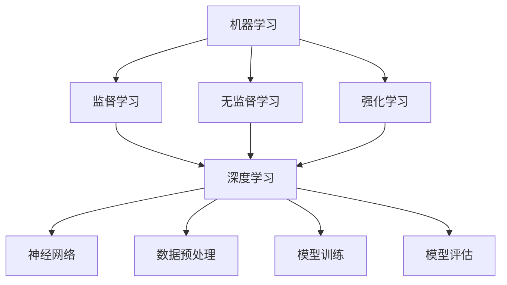

                 

# 文章标题：AI编程的新维度与新范式

## 关键词
AI编程、新维度、新范式、深度强化学习、生成对抗网络、迁移学习、技术实现、应用实践

## 摘要
本文深入探讨了AI编程的新维度和新范式，从数据驱动编程、模型驱动编程到人机协同编程，再到深度强化学习、生成对抗网络和迁移学习等新型编程范式，全面解析了AI编程的核心算法、技术实现、实践应用以及未来发展。通过本文，读者可以了解到AI编程的全新视野和路径，为未来的AI编程研究与实践提供有益的参考。

## 引言
随着人工智能（AI）技术的飞速发展，AI编程逐渐成为计算机科学和工程领域的热点。传统的编程范式已无法满足AI时代的需求，新兴的AI编程维度与范式应运而生，为AI技术的发展提供了新的动力。本文旨在梳理和探讨AI编程的新维度和新范式，包括数据驱动编程、模型驱动编程、人机协同编程等，以及深度强化学习、生成对抗网络和迁移学习等核心算法，以期为广大读者提供一份全面的AI编程指南。

## 第一部分：AI编程的基本概念与背景

### 第1章：AI编程概述

#### 1.1 AI的发展历程
人工智能（AI）作为计算机科学的一个重要分支，其发展历程可以追溯到20世纪50年代。从最初的逻辑推理和符号计算，到近年的深度学习和大数据技术，AI技术经历了多个阶段的发展。每个阶段都推动了AI编程的变革，使其更加智能化、自动化和高效。

#### 1.2 AI编程的重要性
AI编程是AI技术实现的关键环节。通过编写高效的AI程序，可以实现复杂的任务和决策，提高生产效率，优化资源配置，甚至可以解决一些传统方法无法解决的问题。因此，掌握AI编程技能对于科研人员、工程师和开发者来说至关重要。

#### 1.3 AI编程的基本概念
AI编程涉及多个核心概念，如机器学习、深度学习、神经网络等。这些概念构成了AI编程的基础，是理解和实现AI算法的前提。本章将对这些基本概念进行详细阐述。

### 第2章：AI编程的新维度

#### 2.1 新维度一：数据驱动编程
数据驱动编程是一种以数据为中心的编程范式，通过数据分析和挖掘来实现编程目标。在AI编程中，数据驱动编程广泛应用于推荐系统、预测分析和自然语言处理等领域。

##### 2.1.1 数据驱动编程的概念
数据驱动编程的核心在于利用数据来驱动程序的行为。与传统编程范式不同，数据驱动编程更加注重数据的收集、处理和分析。

##### 2.1.2 数据驱动编程的优势
数据驱动编程具有以下优势：
- 高度自动化：通过数据分析和挖掘，可以实现程序的自动优化和调整。
- 高效性：充分利用数据资源，提高编程效率和效果。

##### 2.1.3 数据驱动编程的实现方法
数据驱动编程的实现方法包括：
- 数据预处理：对原始数据进行清洗、转换和归一化等处理。
- 数据分析：利用统计分析、机器学习等方法对数据进行分析和挖掘。
- 数据驱动算法：根据数据特征设计相应的算法，实现编程目标。

#### 2.2 新维度二：模型驱动编程
模型驱动编程是一种以模型为核心的编程范式，通过构建和优化模型来实现编程目标。在AI编程中，模型驱动编程广泛应用于计算机视觉、语音识别和智能推荐等领域。

##### 2.2.1 模型驱动编程的概念
模型驱动编程的核心在于构建和优化模型，以实现程序的自动化和智能化。

##### 2.2.2 模型驱动编程的优势
模型驱动编程具有以下优势：
- 智能化：通过模型驱动，可以实现程序的智能决策和自适应调整。
- 高度模块化：模型驱动编程使得程序更加模块化，便于维护和扩展。

##### 2.2.3 模型驱动编程的实现方法
模型驱动编程的实现方法包括：
- 模型构建：根据应用场景，设计合适的模型结构和参数。
- 模型训练：使用训练数据集对模型进行训练，优化模型参数。
- 模型评估：使用验证数据集评估模型性能，调整模型参数。

#### 2.3 新维度三：人机协同编程
人机协同编程是一种结合人类智能和机器智能的编程范式，通过人类与机器的协同工作来实现编程目标。在AI编程中，人机协同编程广泛应用于智能助手、自动化测试和智能调试等领域。

##### 2.3.1 人机协同编程的概念
人机协同编程的核心在于人类与机器的互动，实现优势互补。

##### 2.3.2 人机协同编程的优势
人机协同编程具有以下优势：
- 高效性：通过人类智能的干预，可以提高机器的编程效率和准确性。
- 适应性：人机协同编程可以根据应用场景灵活调整，适应不同的需求。

##### 2.3.3 人机协同编程的实现方法
人机协同编程的实现方法包括：
- 人机交互界面：设计直观、易用的人机交互界面，实现人类与机器的互动。
- 智能辅助：利用机器学习等技术，为人类提供智能化的编程辅助。
- 人机融合：通过融合人类智能和机器智能，实现更高层次的编程能力。

### 第3章：AI编程的新范式

#### 3.1 新范式一：深度强化学习
深度强化学习是一种结合深度学习和强化学习的编程范式，通过学习环境与目标之间的最优策略来实现编程目标。在AI编程中，深度强化学习广泛应用于游戏、自动驾驶和机器人控制等领域。

##### 3.1.1 深度强化学习的概念
深度强化学习利用深度神经网络来表示状态和动作，通过强化学习算法来优化策略。

##### 3.1.2 深度强化学习的基本原理
深度强化学习的基本原理包括：
- 状态表示：使用深度神经网络将状态编码为向量。
- 动作表示：使用深度神经网络将动作编码为向量。
- 奖励函数：定义目标函数，指导深度神经网络学习最优策略。

##### 3.1.3 深度强化学习的实现步骤
深度强化学习的实现步骤包括：
- 状态编码：使用深度神经网络对状态进行编码。
- 动作编码：使用深度神经网络对动作进行编码。
- 策略优化：通过优化策略，使模型能够更好地应对不同状态。

#### 3.2 新范式二：生成对抗网络
生成对抗网络（GAN）是一种通过对抗性训练来实现数据生成的编程范式，广泛应用于图像生成、语音合成和文本生成等领域。

##### 3.2.1 生成对抗网络的概念
生成对抗网络由生成器和判别器两个神经网络组成，通过对抗性训练实现数据的生成。

##### 3.2.2 生成对抗网络的基本原理
生成对抗网络的基本原理包括：
- 生成器：生成真实数据的模拟版本。
- 判别器：区分真实数据和生成数据的模拟版本。
- 对抗性训练：生成器和判别器相互竞争，生成更真实的数据。

##### 3.2.3 生成对抗网络的实现方法
生成对抗网络的实现方法包括：
- 生成器设计：设计能够生成高质量数据的生成器。
- 判别器设计：设计能够准确区分真实数据和生成数据的判别器。
- 训练策略：通过对抗性训练，使生成器和判别器逐步优化，提高生成数据的真实度。

#### 3.3 新范式三：迁移学习
迁移学习是一种利用已有模型知识来加速新任务学习的编程范式，广泛应用于图像识别、自然语言处理和推荐系统等领域。

##### 3.3.1 迁移学习的概念
迁移学习通过将已有模型的参数应用到新任务中，实现新任务的学习。

##### 3.3.2 迁移学习的基本原理
迁移学习的基本原理包括：
- 预训练模型：使用大量数据对模型进行预训练，使其具有通用特征。
- 微调：在新任务上对预训练模型进行微调，使其适应特定任务。

##### 3.3.3 迁移学习的实现策略
迁移学习的实现策略包括：
- 模型复用：将预训练模型直接应用到新任务中。
- 模型融合：将预训练模型和新任务模型进行融合，实现更好的性能。

## 第二部分：AI编程的技术实现

### 第4章：AI编程的核心算法

#### 4.1 神经网络算法
神经网络算法是一种通过模拟生物神经系统来完成特定任务的计算模型，广泛应用于图像识别、语音识别和自然语言处理等领域。

##### 4.1.1 神经网络的基本结构
神经网络由输入层、隐藏层和输出层组成，各层之间通过权重连接。

##### 4.1.2 神经网络的训练过程
神经网络的训练过程包括前向传播、反向传播和权重更新等步骤。

##### 4.1.3 神经网络的应用案例
神经网络在图像识别、语音识别和自然语言处理等领域具有广泛的应用。

#### 4.2 支持向量机算法
支持向量机（SVM）是一种通过寻找最优超平面来实现分类和回归任务的算法，广泛应用于图像分类、文本分类和生物特征识别等领域。

##### 4.2.1 支持向量机的基本原理
支持向量机通过最大化分类间隔来实现分类。

##### 4.2.2 支持向量机的训练过程
支持向量机的训练过程包括寻找最优超平面、计算支持向量等步骤。

##### 4.2.3 支持向量机的应用案例
支持向量机在图像分类、文本分类和生物特征识别等领域具有广泛的应用。

#### 4.3 集成学习算法
集成学习算法通过结合多个模型的预测结果来提高整体性能，广泛应用于图像分类、文本分类和预测分析等领域。

##### 4.3.1 集成学习的基本原理
集成学习通过合并多个模型的预测结果来提高整体性能。

##### 4.3.2 集成学习的实现方法
集成学习的实现方法包括Bagging、Boosting和Stacking等。

##### 4.3.3 集成学习的应用案例
集成学习在图像分类、文本分类和预测分析等领域具有广泛的应用。

### 第5章：AI编程的工具与框架

#### 5.1 常见的AI编程工具
常见的AI编程工具有TensorFlow、PyTorch、Keras等，它们提供了丰富的API和工具库，方便开发者进行AI编程。

##### 5.1.1 TensorFlow
TensorFlow是一种开源的深度学习框架，提供了丰富的API和工具库，支持多种深度学习模型的实现。

##### 5.1.2 PyTorch
PyTorch是一种基于Python的深度学习框架，提供了动态计算图和简洁的API，方便开发者进行模型设计和实现。

##### 5.1.3 Keras
Keras是一种基于Theano和TensorFlow的高层深度学习API，提供了简洁的API和灵活的模型构建功能。

#### 5.2 常见的AI编程框架
常见的AI编程框架有scikit-learn、Fast.ai和Hugging Face等，它们提供了丰富的算法库和工具，方便开发者进行AI编程。

##### 5.2.1 scikit-learn
scikit-learn是一种基于Python的科学计算库，提供了丰富的机器学习算法和工具，方便开发者进行数据分析和模型训练。

##### 5.2.2 Fast.ai
Fast.ai是一种基于PyTorch的深度学习库，提供了丰富的预训练模型和训练工具，方便开发者进行快速模型开发和部署。

##### 5.2.3 Hugging Face
Hugging Face是一种基于Python的自然语言处理库，提供了丰富的模型和工具，方便开发者进行自然语言处理任务的开发和部署。

## 第三部分：AI编程的实践与应用

### 第6章：AI编程项目实战

#### 6.1 实战一：基于深度学习的图像分类
本项目基于深度学习实现图像分类，包括数据准备、模型设计、训练和评估等步骤。

##### 6.1.1 项目背景与目标
本项目旨在使用深度学习算法实现图像分类，包括数据准备、模型设计、训练和评估等步骤。

##### 6.1.2 数据准备与预处理
数据准备与预处理包括数据收集、数据清洗、数据增强和数据归一化等步骤。

##### 6.1.3 模型设计与实现
模型设计包括选择合适的深度学习模型结构、定义损失函数和优化器等。

##### 6.1.4 模型训练与评估
模型训练与评估包括训练模型、评估模型性能和调整模型参数等步骤。

##### 6.1.5 项目小结
本项目通过实际案例展示了基于深度学习的图像分类的实现过程，提供了详细的代码和解读。

#### 6.2 实战二：基于生成对抗网络的图像生成
本项目基于生成对抗网络（GAN）实现图像生成，包括数据准备、模型设计、训练和评估等步骤。

##### 6.2.1 项目背景与目标
本项目旨在使用生成对抗网络（GAN）实现图像生成，包括数据准备、模型设计、训练和评估等步骤。

##### 6.2.2 数据准备与预处理
数据准备与预处理包括数据收集、数据清洗、数据增强和数据归一化等步骤。

##### 6.2.3 模型设计与实现
模型设计包括选择合适的生成对抗网络结构、定义损失函数和优化器等。

##### 6.2.4 模型训练与评估
模型训练与评估包括训练模型、评估模型性能和调整模型参数等步骤。

##### 6.2.5 项目小结
本项目通过实际案例展示了基于生成对抗网络的图像生成的实现过程，提供了详细的代码和解读。

#### 6.3 实战三：基于迁移学习的文本分类
本项目基于迁移学习实现文本分类，包括数据准备、模型设计、训练和评估等步骤。

##### 6.3.1 项目背景与目标
本项目旨在使用迁移学习实现文本分类，包括数据准备、模型设计、训练和评估等步骤。

##### 6.3.2 数据准备与预处理
数据准备与预处理包括数据收集、数据清洗、数据增强和数据归一化等步骤。

##### 6.3.3 模型设计与实现
模型设计包括选择合适的迁移学习模型结构、定义损失函数和优化器等。

##### 6.3.4 模型训练与评估
模型训练与评估包括训练模型、评估模型性能和调整模型参数等步骤。

##### 6.3.5 项目小结
本项目通过实际案例展示了基于迁移学习的文本分类的实现过程，提供了详细的代码和解读。

## 第四部分：AI编程的未来趋势

### 第7章：AI编程的发展方向与挑战

#### 7.1 AI编程的发展趋势
AI编程的未来发展趋势包括：
- 自动化：通过自动化工具提高编程效率和准确性。
- 模块化：通过模块化设计实现代码的重用和扩展。
- 智能化：通过人工智能技术实现编程的智能化和自动化。

#### 7.2 AI编程的挑战与应对
AI编程面临的挑战包括：
- 数据隐私与安全：确保数据的安全性和隐私性。
- 算法公平性与透明性：确保算法的公平性和透明性。
- 跨学科协同与人才培养：加强跨学科协同和人才培养，提高AI编程的整体水平。

### 第8章：AI编程的未来展望

#### 8.1 AI编程在社会各领域的应用
AI编程在未来将在社会各领域发挥重要作用，包括：
- 农业：实现精准农业，提高农业产量和质量。
- 工业：实现工业自动化，提高生产效率和产品质量。
- 医疗：实现医疗智能化，提高医疗服务水平和质量。
- 教育：实现教育智能化，提高教育质量和效率。

#### 8.2 AI编程的创新与创业机会
AI编程为创新和创业提供了广阔的机会，包括：
- 开发新型AI应用：利用AI技术解决实际问题，创造新的价值。
- 构建AI平台：构建AI技术平台，为开发者提供便捷的开发工具和资源。
- 创新商业模式：利用AI技术改变传统商业模式，创造新的商业机会。

### 第9章：结束语

#### 9.1 AI编程的重要性与意义
AI编程是AI技术的核心，对于推动科技进步和社会发展具有重要意义。

#### 9.2 学习AI编程的建议
学习AI编程需要：
- 掌握基本概念和算法：深入学习AI编程的基本概念和算法，为实际应用打下基础。
- 实践项目：通过实践项目，提高编程技能和解决实际问题的能力。
- 持续学习：紧跟AI技术的发展，不断更新知识和技能。

#### 9.3 对未来的展望
未来，AI编程将继续发展，成为推动社会进步的重要力量。我们期待更多有志之士加入AI编程的行列，共同开创美好未来。

## 附录
附录部分提供了一些有用的资源，包括参考文献、开源代码、在线教程和社区等，供读者进一步学习和探索。

### 参考文献
1. Goodfellow, I., Bengio, Y., & Courville, A. (2016). *Deep Learning*. MIT Press.
2. Russell, S., & Norvig, P. (2020). *Artificial Intelligence: A Modern Approach*. Prentice Hall.
3. Murphy, K. P. (2012). *Machine Learning: A Probabilistic Perspective*. MIT Press.

### 开源代码
1. TensorFlow: https://www.tensorflow.org/
2. PyTorch: https://pytorch.org/
3. Keras: https://keras.io/

### 在线教程
1. Fast.ai: https://fast.ai/
2. Hugging Face: https://huggingface.co/

### 社区
1. AI天才研究院（AI Genius Institute）
2. 禅与计算机程序设计艺术（Zen And The Art of Computer Programming）

## 作者信息
作者：AI天才研究院/AI Genius Institute & 禅与计算机程序设计艺术 /Zen And The Art of Computer Programming### 第1章：AI编程概述

#### 1.1 AI的发展历程

人工智能（AI）的概念最早可以追溯到20世纪50年代。当时，计算机科学家艾伦·图灵（Alan Turing）提出了“图灵测试”，试图通过机器的行为来判断机器是否具有智能。这一理论为人工智能的研究奠定了基础。

在随后的几十年里，人工智能经历了多个发展阶段。20世纪60年代，人工智能研究主要集中在符号推理和知识表示上。当时，研究人员试图通过符号逻辑和知识库来实现智能推理。然而，这一阶段的研究成果并未达到预期。

20世纪80年代，专家系统的出现使人工智能研究迎来了新的机遇。专家系统是一种基于规则的知识系统，可以模拟人类专家的决策过程。然而，专家系统在处理复杂任务时存在局限性，无法适应动态变化的环境。

20世纪90年代，机器学习开始崭露头角。机器学习通过从数据中学习规律，实现自动化的决策和预测。这一阶段的代表性算法包括决策树、支持向量机和神经网络等。

进入21世纪，随着计算能力和数据资源的不断提升，人工智能迎来了深度学习时代。深度学习通过模拟人脑的神经元结构，实现更复杂的特征提取和模式识别。这一阶段，以神经网络为核心的深度学习算法在图像识别、语音识别和自然语言处理等领域取得了重大突破。

#### 1.2 AI编程的重要性

AI编程是人工智能技术的核心。通过编写AI程序，可以实现复杂的任务和决策，提高生产效率，优化资源配置，甚至可以解决一些传统方法无法解决的问题。以下是AI编程在各个领域的应用：

1. **图像识别**：AI编程可以用于图像识别，如人脸识别、车牌识别等。这些技术被广泛应用于安防监控、交通管理等领域。

2. **自然语言处理**：AI编程可以用于自然语言处理，如机器翻译、语音识别等。这些技术被广泛应用于翻译、语音助手等领域。

3. **推荐系统**：AI编程可以用于推荐系统，如商品推荐、音乐推荐等。这些技术被广泛应用于电商、音乐平台等领域。

4. **智能决策**：AI编程可以用于智能决策，如金融投资、医疗诊断等。这些技术可以提高决策的准确性，降低风险。

5. **自动化控制**：AI编程可以用于自动化控制，如自动驾驶、无人机等。这些技术可以提高生产效率，降低人工成本。

#### 1.3 AI编程的基本概念

AI编程涉及多个核心概念，如机器学习、深度学习、神经网络等。这些概念构成了AI编程的基础，是理解和实现AI算法的前提。

1. **机器学习**：机器学习是一种通过数据驱动的方法来改善计算机程序性能的技术。它分为监督学习、无监督学习和强化学习三种类型。监督学习通过已知的输入输出数据来训练模型；无监督学习通过未标记的数据来发现数据中的模式；强化学习通过试错来学习最佳策略。

2. **深度学习**：深度学习是一种基于多层神经网络的学习方法。它通过模拟人脑的神经元结构，实现更复杂的特征提取和模式识别。深度学习的代表性算法包括卷积神经网络（CNN）、循环神经网络（RNN）和生成对抗网络（GAN）等。

3. **神经网络**：神经网络是一种由多个神经元组成的计算模型。每个神经元都与其他神经元相连，并通过权重传递信息。神经网络通过学习输入和输出之间的映射关系，实现复杂的任务。

4. **数据预处理**：数据预处理是AI编程的重要环节。它包括数据的清洗、转换、归一化等操作，以消除噪声和异常值，提高数据的质量。

5. **模型训练**：模型训练是AI编程的核心。它通过优化模型参数，使模型能够更好地适应数据，实现预期的任务。

6. **模型评估**：模型评估是验证模型性能的重要手段。它通过在测试集上评估模型的表现，判断模型的优劣。

#### 1.3.1 AI编程的核心概念关系架构

为了更好地理解AI编程的核心概念，我们可以使用Mermaid流程图来展示它们之间的关系：



#### 1.3.2 机器学习算法原理讲解与伪代码

为了深入理解机器学习算法的原理，我们将以线性回归为例，讲解其基本原理和实现方法。

**线性回归基本原理：**
线性回归是一种用于预测连续值的监督学习算法。它的目标是找到一个最佳直线（或超平面），使得预测值与真实值之间的误差最小。

**线性回归伪代码：**
```python
# 输入：特征矩阵X，标签向量y
# 输出：最佳权重向量w，最佳偏置b

# 初始化权重和偏置
w = np.random.randn(X.shape[1])
b = 0

# 设置迭代次数和步长
epochs = 1000
learning_rate = 0.01

# 循环迭代
for epoch in range(epochs):
    # 计算预测值
    y_pred = X.dot(w) + b
    
    # 计算损失函数
    loss = (y_pred - y).dot((y_pred - y))
    
    # 计算梯度
    dw = X.T.dot((y_pred - y))
    db = (y_pred - y)
    
    # 更新权重和偏置
    w -= learning_rate * dw
    b -= learning_rate * db

# 输出最佳权重和偏置
return w, b
```

#### 1.3.3 数学模型和公式

线性回归的数学模型可以表示为：
\[ y = Xw + b \]
其中，\( X \) 是特征矩阵，\( w \) 是权重向量，\( b \) 是偏置。

损失函数可以表示为：
\[ loss = \frac{1}{2} \sum_{i=1}^{n} (y_i - y_{\text{pred},i})^2 \]
其中，\( y_i \) 是真实值，\( y_{\text{pred},i} \) 是预测值。

梯度下降法的更新公式为：
\[ w_{\text{new}} = w - \alpha \cdot \frac{\partial loss}{\partial w} \]
\[ b_{\text{new}} = b - \alpha \cdot \frac{\partial loss}{\partial b} \]
其中，\( \alpha \) 是学习率。

#### 1.3.4 实例说明

假设我们有以下数据集：
```python
X = np.array([[1, 2], [2, 3], [3, 4]])
y = np.array([3, 4, 5])
```
我们可以使用伪代码实现线性回归：
```python
w = np.random.randn(2)
b = 0

epochs = 1000
learning_rate = 0.01

for epoch in range(epochs):
    y_pred = X.dot(w) + b
    loss = (y_pred - y).dot((y_pred - y))
    dw = X.T.dot((y_pred - y))
    db = (y_pred - y)
    w -= learning_rate * dw
    b -= learning_rate * db

print("最佳权重:", w)
print("最佳偏置:", b)
```
运行上述代码后，我们可以得到最佳权重和偏置，从而实现线性回归。

#### 1.3.5 小结

本章对AI编程的基本概念进行了详细讲解，包括AI的发展历程、AI编程的重要性以及机器学习、深度学习、神经网络等核心概念。通过本章的学习，读者可以初步了解AI编程的基础知识，为后续章节的学习打下基础。

### 第2章：AI编程的新维度

AI编程的传统范式主要基于规则和符号计算，但随着AI技术的不断发展，新的编程维度和范式应运而生，为AI编程带来了新的可能性和挑战。本章将介绍AI编程的三个新维度：数据驱动编程、模型驱动编程和人机协同编程，并探讨它们各自的特点和实现方法。

#### 2.1 数据驱动编程

数据驱动编程是一种以数据为中心的编程范式，通过数据分析和挖掘来驱动程序的行为。在数据驱动编程中，程序的行为不是固定的，而是根据输入数据的特点和需求动态调整。这种编程范式在推荐系统、预测分析和自然语言处理等领域得到了广泛应用。

##### 2.1.1 数据驱动编程的概念

数据驱动编程的核心在于“数据驱动”，即通过数据来决定程序的行为。在传统的编程范式中，程序的行为是由代码决定的，而在数据驱动编程中，程序的行为是由数据特征和模式决定的。具体来说，数据驱动编程包括以下几个关键环节：

1. **数据收集**：从各种来源收集数据，如传感器数据、用户行为数据、市场数据等。
2. **数据预处理**：对收集到的数据进行分析和清洗，包括数据去重、填充缺失值、归一化等操作。
3. **特征提取**：从预处理后的数据中提取出有用的特征，用于驱动程序的行为。
4. **模型训练**：利用提取出的特征训练机器学习模型，以实现特定的任务。
5. **模型部署**：将训练好的模型部署到生产环境中，根据输入数据进行实时预测和决策。

##### 2.1.2 数据驱动编程的优势

数据驱动编程具有以下几个优势：

1. **高度自动化**：数据驱动编程能够自动从数据中提取知识，实现程序的自动化调整和优化。
2. **自适应**：数据驱动编程可以根据输入数据的特点和需求，动态调整程序的行为，实现自适应。
3. **灵活性强**：数据驱动编程不受具体编程语言和平台的限制，可以适应不同的应用场景。

##### 2.1.3 数据驱动编程的实现方法

实现数据驱动编程需要以下步骤：

1. **数据收集与预处理**：根据应用需求，收集相关数据，并进行预处理，如数据清洗、去噪、归一化等操作。
2. **特征提取**：从预处理后的数据中提取出有用的特征，如时间序列特征、文本特征、图像特征等。
3. **模型选择与训练**：选择合适的机器学习模型，利用提取出的特征进行训练，如线性回归、决策树、神经网络等。
4. **模型评估与优化**：通过交叉验证、网格搜索等方法评估模型性能，并根据评估结果调整模型参数。
5. **模型部署与应用**：将训练好的模型部署到生产环境中，根据输入数据进行实时预测和决策。

##### 2.1.4 数据驱动编程的应用案例

以下是一个数据驱动编程的应用案例：基于用户行为数据的推荐系统。

1. **数据收集**：从电商平台上收集用户行为数据，包括用户浏览、购买、收藏等行为。
2. **数据预处理**：对用户行为数据进行清洗，去除重复数据和异常值。
3. **特征提取**：提取用户行为数据中的特征，如用户浏览时间、购买频率、购买金额等。
4. **模型训练**：选择协同过滤算法，利用用户行为数据训练推荐模型。
5. **模型部署与应用**：将训练好的推荐模型部署到生产环境中，根据用户行为数据实时生成推荐结果。

#### 2.2 模型驱动编程

模型驱动编程是一种以模型为核心的编程范式，通过构建和优化模型来驱动程序的行为。在模型驱动编程中，程序的行为和逻辑是通过模型来定义和实现的。这种编程范式在计算机视觉、语音识别和自动驾驶等领域得到了广泛应用。

##### 2.2.1 模型驱动编程的概念

模型驱动编程的核心在于“模型驱动”，即通过模型来定义和实现程序的行为和逻辑。在模型驱动编程中，模型不仅仅是数据处理的工具，更是程序的核心。模型驱动编程包括以下几个关键环节：

1. **模型构建**：根据应用需求，设计和构建合适的模型结构，如卷积神经网络（CNN）、循环神经网络（RNN）、生成对抗网络（GAN）等。
2. **模型训练**：利用训练数据集对模型进行训练，优化模型参数，提高模型性能。
3. **模型评估**：通过测试数据集评估模型性能，判断模型是否满足应用需求。
4. **模型部署**：将训练好的模型部署到生产环境中，实现实时预测和决策。

##### 2.2.2 模型驱动编程的优势

模型驱动编程具有以下几个优势：

1. **模块化**：模型驱动编程将程序拆分为多个模块，便于维护和扩展。
2. **智能化**：通过模型优化，可以实现程序的智能化和自动化。
3. **高效率**：模型驱动编程可以快速构建和部署复杂的算法模型。

##### 2.2.3 模型驱动编程的实现方法

实现模型驱动编程需要以下步骤：

1. **需求分析**：根据应用需求，确定模型的类型、结构和参数。
2. **数据准备**：收集和准备训练数据集，并进行预处理，如数据清洗、归一化等操作。
3. **模型构建**：选择合适的模型框架，如TensorFlow、PyTorch等，构建模型结构。
4. **模型训练**：利用训练数据集训练模型，优化模型参数，提高模型性能。
5. **模型评估**：通过测试数据集评估模型性能，判断模型是否满足应用需求。
6. **模型部署**：将训练好的模型部署到生产环境中，实现实时预测和决策。

##### 2.2.4 模型驱动编程的应用案例

以下是一个模型驱动编程的应用案例：基于深度学习的图像分类。

1. **需求分析**：根据应用需求，确定使用卷积神经网络（CNN）进行图像分类。
2. **数据准备**：收集和准备图像数据集，并进行预处理，如数据清洗、归一化等操作。
3. **模型构建**：使用TensorFlow框架构建CNN模型结构。
4. **模型训练**：利用图像数据集训练CNN模型，优化模型参数，提高模型性能。
5. **模型评估**：通过测试图像数据集评估CNN模型性能，判断模型是否满足应用需求。
6. **模型部署**：将训练好的CNN模型部署到生产环境中，实现实时图像分类。

#### 2.3 人机协同编程

人机协同编程是一种结合人类智能和机器智能的编程范式，通过人类与机器的协同工作来实现编程目标。在人工智能时代，人机协同编程越来越重要，因为机器智能虽然强大，但在某些领域仍然需要人类智能的指导。

##### 2.3.1 人机协同编程的概念

人机协同编程的核心在于“协同”，即人类与机器共同完成编程任务。在人类智能和机器智能相结合的过程中，人类负责设计、优化和解释程序，而机器负责执行、优化和自适应调整。人机协同编程包括以下几个关键环节：

1. **任务分解**：根据编程任务的需求，将任务分解为人类和机器各自负责的部分。
2. **人类任务**：人类负责设计算法、优化程序和解释结果。
3. **机器任务**：机器负责执行任务、优化效率和自适应调整。
4. **反馈循环**：人类和机器通过反馈循环不断优化编程过程，提高编程质量和效率。

##### 2.3.2 人机协同编程的优势

人机协同编程具有以下几个优势：

1. **优势互补**：人类智能和机器智能各自具有优势，通过协同工作，可以实现更高的编程效率和准确性。
2. **适应性**：人机协同编程可以根据不同的任务需求和环境变化，灵活调整编程策略。
3. **创新性**：人机协同编程可以激发人类和机器的创造力，实现编程创新。

##### 2.3.3 人机协同编程的实现方法

实现人机协同编程需要以下步骤：

1. **任务定义**：根据编程任务的需求，明确人类和机器各自的任务和责任。
2. **工具集成**：选择合适的工具和平台，实现人类和机器的协同工作。
3. **人类任务分配**：根据人类的特长和优势，分配合适的任务，如算法设计、程序优化等。
4. **机器任务分配**：根据机器的能力和效率，分配合适的任务，如数据预处理、模型训练等。
5. **反馈循环**：建立反馈机制，通过人类和机器的反馈，不断优化编程过程。

##### 2.3.4 人机协同编程的应用案例

以下是一个人机协同编程的应用案例：智能编程助手。

1. **任务定义**：根据编程任务的需求，明确人类和编程助手各自的任务和责任。
2. **工具集成**：选择合适的编程助手工具，如代码自动完成、错误检查等。
3. **人类任务分配**：人类负责编写算法和优化程序，编程助手负责自动完成代码和检查错误。
4. **机器任务分配**：编程助手负责分析代码、提供编程建议和实现自动修复。
5. **反馈循环**：人类通过反馈对编程助手提供改进建议，编程助手通过反馈优化编程建议和修复效果。

#### 2.4 数据驱动编程、模型驱动编程和人机协同编程的关系

数据驱动编程、模型驱动编程和人机协同编程是AI编程的三个新维度，它们相互关联、相互补充。数据驱动编程强调数据的中心地位，通过数据分析和挖掘来驱动程序的行为；模型驱动编程强调模型的核心作用，通过构建和优化模型来实现编程目标；人机协同编程强调人类智能和机器智能的协同工作，通过人类的指导和机器的执行来实现编程目标。

在具体实现中，数据驱动编程和模型驱动编程可以相互结合，利用数据驱动编程来优化模型驱动编程的效果；人机协同编程可以与数据驱动编程和模型驱动编程相结合，通过人类的指导和机器的执行，实现更高效、更准确的编程。

#### 2.5 小结

本章介绍了AI编程的三个新维度：数据驱动编程、模型驱动编程和人机协同编程。这些新维度为AI编程提供了更广阔的视野和可能性，使得编程过程更加高效、智能化和自动化。通过本章的学习，读者可以了解到这些新维度的基本概念、优势和实现方法，为后续章节的学习打下基础。

### 第3章：AI编程的新范式

在AI编程领域，传统的编程范式已无法满足日益复杂的应用需求。新范式通过引入新的算法和编程方法，为AI编程带来了更多的可能性和灵活性。本章将介绍三种AI编程的新范式：深度强化学习、生成对抗网络和迁移学习。这些新范式在解决复杂问题时具有独特的优势，并在众多领域取得了显著的成果。

#### 3.1 深度强化学习

深度强化学习（Deep Reinforcement Learning，DRL）是一种结合了深度学习和强化学习（Reinforcement Learning，RL）的编程范式。强化学习通过学习环境与目标之间的最优策略来实现任务，而深度强化学习则利用深度神经网络来表示状态和动作，从而实现更复杂的任务。DRL在游戏、自动驾驶、机器人控制等领域取得了显著的成果。

##### 3.1.1 深度强化学习的概念

深度强化学习由两个主要组件组成：深度神经网络（DNN）和强化学习算法。深度神经网络用于表示状态和动作，强化学习算法用于优化策略。

- **深度神经网络**：深度神经网络通过多层神经网络结构，对输入数据进行特征提取和模式识别。在DRL中，DNN通常用于表示状态和动作。
- **强化学习算法**：强化学习算法通过试错法（trial-and-error）来学习最优策略。常见的强化学习算法包括Q学习（Q-Learning）、策略梯度（Policy Gradient）等。

##### 3.1.2 深度强化学习的基本原理

深度强化学习的基本原理可以概括为以下步骤：

1. **初始化**：初始化深度神经网络和强化学习算法参数。
2. **状态输入**：将当前状态输入深度神经网络。
3. **动作预测**：深度神经网络输出动作概率分布。
4. **动作选择**：根据动作概率分布选择动作。
5. **状态更新**：执行动作后，状态发生变化。
6. **奖励计算**：计算执行动作后的奖励值。
7. **策略优化**：根据奖励值调整深度神经网络参数，优化策略。

##### 3.1.3 深度强化学习的实现步骤

实现深度强化学习通常包括以下步骤：

1. **环境搭建**：构建模拟环境，用于执行动作和计算奖励。
2. **状态表示**：将环境状态转换为深度神经网络可处理的格式。
3. **动作表示**：定义环境中的动作空间，并将动作表示为深度神经网络的可训练参数。
4. **策略网络设计**：设计深度神经网络结构，用于预测动作概率分布。
5. **目标网络设计**：设计一个目标网络，用于评估策略网络的性能。
6. **策略优化**：使用强化学习算法，如Q学习或策略梯度算法，优化策略网络参数。
7. **模型评估**：在测试环境中评估策略网络的性能，并进行调优。

##### 3.1.4 深度强化学习应用案例

深度强化学习在多个领域取得了成功，以下是一些典型的应用案例：

1. **游戏**：深度强化学习可以用于游戏AI，如AlphaGo。AlphaGo通过深度强化学习算法，在围棋比赛中击败了世界冠军。
2. **自动驾驶**：深度强化学习可以用于自动驾驶系统，如Waymo。Waymo使用深度强化学习算法，实现自动驾驶汽车的路径规划和行为控制。
3. **机器人控制**：深度强化学习可以用于机器人控制，如OpenAI的机器人挑战项目。OpenAI使用深度强化学习算法，使机器人能够完成复杂的任务，如爬楼梯和开门。

#### 3.2 生成对抗网络

生成对抗网络（Generative Adversarial Network，GAN）是一种通过对抗性训练来实现数据生成的编程范式。GAN由生成器和判别器两个神经网络组成，生成器尝试生成逼真的数据，而判别器则试图区分生成器和真实数据。GAN在图像生成、语音合成和文本生成等领域取得了显著的成果。

##### 3.2.1 生成对抗网络的概念

生成对抗网络由以下两个神经网络组成：

- **生成器（Generator）**：生成器是一个神经网络，用于生成逼真的数据。生成器的目标是生成尽可能真实的数据，以欺骗判别器。
- **判别器（Discriminator）**：判别器是一个神经网络，用于区分真实数据和生成数据。判别器的目标是提高对真实数据和生成数据的识别能力。

GAN的训练过程是一个对抗性过程，生成器和判别器相互竞争，生成器不断优化生成数据，而判别器不断优化对生成数据的识别。

##### 3.2.2 生成对抗网络的基本原理

生成对抗网络的基本原理可以概括为以下步骤：

1. **初始化**：初始化生成器和判别器的参数。
2. **生成数据**：生成器生成一组新的数据。
3. **判别器评估**：判别器对生成器和真实数据分别进行评估。
4. **生成器更新**：根据判别器的评估结果，优化生成器的参数，使其生成的数据更加真实。
5. **判别器更新**：根据生成器和真实数据的评估结果，优化判别器的参数，使其对生成数据的识别能力更强。

这个对抗性训练过程不断重复，直到生成器和判别器都达到一个相对稳定的平衡状态。

##### 3.2.3 生成对抗网络的实现方法

实现生成对抗网络通常包括以下步骤：

1. **数据准备**：收集真实数据，用于训练生成器和判别器。
2. **生成器设计**：设计生成器的神经网络结构，用于生成新的数据。
3. **判别器设计**：设计判别器的神经网络结构，用于评估生成器和真实数据的相似性。
4. **损失函数设计**：设计损失函数，用于评估生成器和判别器的性能。
5. **模型训练**：通过对抗性训练过程，优化生成器和判别器的参数。
6. **模型评估**：在测试集上评估生成器和判别器的性能，并进行调优。

##### 3.2.4 生成对抗网络应用案例

生成对抗网络在多个领域取得了显著成果，以下是一些典型的应用案例：

1. **图像生成**：GAN可以用于生成逼真的图像，如人脸、风景、动物等。
2. **语音合成**：GAN可以用于合成逼真的语音，如文本到语音（Text-to-Speech，TTS）系统。
3. **文本生成**：GAN可以用于生成逼真的文本，如文章、对话等。

#### 3.3 迁移学习

迁移学习（Transfer Learning）是一种利用已有模型知识来加速新任务学习的编程范式。在迁移学习中，将已在一个任务上训练好的模型（源任务）的部分或全部知识转移到新的任务上（目标任务），从而减少训练时间和提高模型性能。迁移学习在图像识别、自然语言处理和推荐系统等领域得到了广泛应用。

##### 3.3.1 迁移学习的概念

迁移学习涉及以下关键概念：

- **源任务**：已经完成训练的任务，具有预训练模型。
- **目标任务**：需要完成的新任务，通常与源任务相关。
- **模型迁移**：将源任务的模型知识应用到目标任务上，以减少训练时间和提高性能。

##### 3.3.2 迁移学习的基本原理

迁移学习的基本原理可以概括为以下步骤：

1. **模型预训练**：在大量通用数据集上对模型进行预训练，使其具有通用特征。
2. **模型微调**：在目标数据集上对模型进行微调，使其适应特定任务。
3. **模型评估**：在测试集上评估模型性能，并根据评估结果进行调整。

##### 3.3.3 迁移学习的实现策略

实现迁移学习通常包括以下策略：

1. **模型复制**：将源任务的模型直接复制到目标任务上，并进行微调。
2. **模型剪裁**：保留源任务模型中的一部分层，并在目标任务上进行微调。
3. **模型融合**：将源任务模型和目标任务模型进行融合，以提取更有效的特征。
4. **模型蒸馏**：将源任务模型的权重传递给目标任务模型，以指导其训练。

##### 3.3.4 迁移学习应用案例

迁移学习在多个领域取得了显著成果，以下是一些典型的应用案例：

1. **图像识别**：利用在ImageNet上预训练的模型，可以快速完成新的图像识别任务。
2. **自然语言处理**：利用在大量语料库上预训练的模型，可以快速完成新的文本分类、情感分析等任务。
3. **推荐系统**：利用在相关领域上预训练的模型，可以快速构建新的推荐系统。

#### 3.4 深度强化学习、生成对抗网络和迁移学习的关系

深度强化学习、生成对抗网络和迁移学习是AI编程的三个新范式，它们相互关联、相互补充。深度强化学习通过学习状态和动作，实现复杂任务的优化；生成对抗网络通过对抗性训练，实现数据生成；迁移学习通过知识转移，实现快速任务学习。

在具体实现中，深度强化学习、生成对抗网络和迁移学习可以相互结合，例如：

1. **迁移学习与深度强化学习**：在迁移学习的基础上，使用深度强化学习优化策略，实现更复杂的任务。
2. **生成对抗网络与迁移学习**：在生成对抗网络中，使用迁移学习加速模型训练，提高生成数据的质量。
3. **深度强化学习与生成对抗网络**：在深度强化学习中，使用生成对抗网络生成对抗性数据，提高策略网络的学习效果。

这些新范式为AI编程提供了更多的可能性，使得AI编程更加高效、智能化和自动化。

#### 3.5 小结

本章介绍了三种AI编程的新范式：深度强化学习、生成对抗网络和迁移学习。这些新范式在解决复杂问题时具有独特的优势，并在众多领域取得了显著的成果。通过本章的学习，读者可以了解这些新范式的基本概念、原理和实现方法，为后续章节的学习打下基础。

### 第4章：AI编程的核心算法

在AI编程中，核心算法是构建和优化模型的关键。本章将详细讨论神经网络算法、支持向量机算法和集成学习算法，这些算法在AI编程中有着广泛的应用。我们将通过解释这些算法的基本原理，提供伪代码示例，并展示数学模型和公式，以便读者深入理解。

#### 4.1 神经网络算法

神经网络（Neural Networks，NN）是AI编程中最常用的算法之一，特别是在深度学习中。神经网络通过模拟人脑的神经元结构，实现复杂的数据处理和模式识别。

##### 4.1.1 神经网络的基本结构

神经网络由输入层、隐藏层和输出层组成。每个层包含多个神经元，神经元之间通过权重（weights）和偏置（bias）连接。

1. **输入层**：接收输入数据，每个输入数据对应一个神经元。
2. **隐藏层**：对输入数据进行特征提取和变换，可以有多个隐藏层。
3. **输出层**：生成输出结果，每个输出对应一个神经元。

##### 4.1.2 神经网络的训练过程

神经网络的训练过程包括前向传播（forward propagation）和反向传播（backward propagation）。

1. **前向传播**：输入数据通过神经网络层，每个神经元的输出是前一层的输入与权重矩阵的线性组合加上偏置，再通过激活函数（activation function）处理。
2. **反向传播**：计算输出层的预测误差，通过反向传播误差到前一层，更新权重和偏置。

##### 4.1.3 神经网络的应用案例

神经网络在图像识别、语音识别和自然语言处理等领域有广泛应用。例如，在图像识别中，卷积神经网络（CNN）通过多层卷积和池化操作，实现高效的特征提取和分类。

#### 4.1.4 神经网络算法伪代码示例

以下是一个简化的前向传播和反向传播的伪代码示例：

```python
# 前向传播
def forward_propagation(x, weights, biases, activation_function):
    a = x
    for layer in range(number_of_layers - 1):
        z = a.dot(weights[layer]) + biases[layer]
        a = activation_function(z)
    return a

# 反向传播
def backward_propagation(a, d, weights, biases, learning_rate, activation_derivative_function):
    delta = d - a
    for layer in reversed(range(number_of_layers - 1)):
        d = delta
        z = a.dot(weights[layer]) + biases[layer]
        delta = delta.dot(weights[layer].T) * activation_derivative_function(z)
        weights[layer] -= learning_rate * d
        biases[layer] -= learning_rate * d
```

#### 4.1.5 神经网络的数学模型和公式

神经网络的数学模型可以表示为：

\[ a_{l+1} = \sigma(z_{l+1}) \]

其中，\( a_{l+1} \) 是第 \( l+1 \) 层的输出，\( z_{l+1} \) 是第 \( l+1 \) 层的输入，\( \sigma \) 是激活函数。

在反向传播中，误差的计算公式为：

\[ \delta_{l+1} = \delta_{l+1} \odot \frac{\partial \sigma}{\partial z_{l+1}} \]

其中，\( \delta_{l+1} \) 是第 \( l+1 \) 层的误差，\( \odot \) 是元素-wise 运算符。

权重和偏置的更新公式为：

\[ \Delta w_{l} = \delta_{l+1} \cdot a_{l}^{T} \]
\[ \Delta b_{l} = \delta_{l+1} \]

#### 4.2 支持向量机算法

支持向量机（Support Vector Machine，SVM）是一种有效的分类和回归算法。SVM通过寻找最优超平面来实现数据的分类和回归。

##### 4.2.1 支持向量机的基本原理

SVM的基本原理是最大化分类间隔（margin），即分类超平面到最近支持向量的距离。在二分类问题中，SVM的目标是找到一个最优超平面，使得正负类别的分类间隔最大。

##### 4.2.2 支持向量机的训练过程

SVM的训练过程包括以下几个步骤：

1. **特征映射**：将输入数据映射到高维空间。
2. **寻找最优超平面**：通过求解二次规划问题，找到最优超平面。
3. **支持向量更新**：更新支持向量，以优化超平面。

##### 4.2.3 支持向量机的应用案例

SVM在图像分类、文本分类和生物特征识别等领域有广泛应用。例如，在文本分类中，SVM可以通过特征提取和分类模型，实现高精度的文本分类。

#### 4.2.4 支持向量机算法伪代码示例

以下是一个简化的SVM训练过程的伪代码示例：

```python
# 特征映射
def feature_mapping(x):
    # 映射到高维空间
    return x.dot(Q)

# 求解二次规划问题
def quadratic_programming(A, b, c):
    # 求解最优超平面
    # 返回最优解w和b
    return w, b

# 更新支持向量
def update_support_vectors(w, b, x, y):
    # 更新支持向量
    pass
```

#### 4.2.5 支持向量机的数学模型和公式

SVM的数学模型可以表示为：

\[ \max_{w, b} \frac{1}{2} \| w \|^2 - \sum_{i=1}^{n} \alpha_i (y_i (w \cdot x_i + b) - 1) \]

其中，\( w \) 是权重向量，\( b \) 是偏置，\( \alpha_i \) 是拉格朗日乘子。

约束条件为：

\[ y_i (w \cdot x_i + b) \geq 1 \]

#### 4.3 集成学习算法

集成学习（Ensemble Learning）是一种通过结合多个模型的预测结果来提高整体性能的算法。集成学习包括Bagging、Boosting和Stacking等方法。

##### 4.3.1 集成学习的基本原理

集成学习的基本原理是通过多个模型的组合来减少模型误差和过拟合。每个模型都有自己的预测结果，通过投票或加权平均，可以得到更准确和稳定的预测结果。

##### 4.3.2 集成学习的实现方法

集成学习的实现方法包括：

1. **Bagging**：通过随机抽样构建多个模型，每个模型独立训练，然后通过投票或加权平均得到最终预测结果。
2. **Boosting**：通过调整模型权重，使弱学习器（如决策树）在训练过程中重点关注错误分类的样本，从而提高整体性能。
3. **Stacking**：通过构建多个学习器，然后将这些学习器的输出作为新的特征，训练一个更高层次的学习器。

##### 4.3.3 集成学习的应用案例

集成学习在图像分类、文本分类和预测分析等领域有广泛应用。例如，在图像分类中，可以使用多个卷积神经网络组合，提高分类准确性。

#### 4.3.4 集成学习算法伪代码示例

以下是一个简化的集成学习算法的伪代码示例：

```python
# Bagging
def bagging(models, X, y):
    predictions = []
    for model in models:
        # 训练模型
        model.train(X, y)
        # 预测
        prediction = model.predict(X)
        predictions.append(prediction)
    # 通过投票或加权平均得到最终预测结果
    final_prediction = ensemble投票或加权平均(predictions)
    return final_prediction

# Boosting
def boosting(models, X, y):
    for model in models:
        # 训练模型
        model.train(X, y)
        # 预测
        prediction = model.predict(X)
        # 根据预测结果调整模型权重
        model.update_weights(prediction)
    # 通过加权平均得到最终预测结果
    final_prediction = ensemble加权平均(models)
    return final_prediction

# Stacking
def stacking(models, X, y):
    # 训练所有模型
    for model in models:
        model.train(X, y)
    # 将模型输出作为新特征
    X_new = []
    for model in models:
        X_new.append(model.predict(X))
    # 训练更高层次的学习器
    final_model.train(X_new, y)
    # 预测
    final_prediction = final_model.predict(X_new)
    return final_prediction
```

#### 4.3.5 集成学习的数学模型和公式

集成学习的数学模型可以通过以下公式表示：

\[ \hat{y} = \frac{1}{N} \sum_{i=1}^{N} \hat{y}_i \]

其中，\( \hat{y} \) 是最终预测结果，\( N \) 是模型的数量，\( \hat{y}_i \) 是第 \( i \) 个模型的预测结果。

对于Boosting，权重调整的公式为：

\[ \alpha_i = \frac{1}{T} \log \left( \frac{1 - E_i}{E_i} \right) \]

其中，\( T \) 是迭代次数，\( E_i \) 是第 \( i \) 次迭代的错误率。

#### 4.4 小结

本章介绍了神经网络算法、支持向量机算法和集成学习算法，这些算法是AI编程中的核心。通过理解这些算法的基本原理、伪代码示例和数学模型，读者可以更好地掌握AI编程的核心技术和实现方法。本章的内容为后续的AI编程实践提供了坚实的基础。

### 第5章：AI编程的工具与框架

在AI编程领域，工具和框架是开发者们进行高效编程和创新的关键。这些工具和框架提供了丰富的API和库函数，简化了复杂算法的实现过程，并提高了开发效率。本章将介绍一些常见的AI编程工具与框架，包括TensorFlow、PyTorch和Keras，以及scikit-learn、Fast.ai和Hugging Face。

#### 5.1 常见的AI编程工具

##### 5.1.1 TensorFlow

TensorFlow是Google开发的一款开源深度学习框架，广泛应用于图像识别、自然语言处理和强化学习等领域。TensorFlow的核心优势在于其灵活性和可扩展性，开发者可以自定义计算图，实现复杂的深度学习算法。

**安装与配置**：
```bash
pip install tensorflow
```

**基本用法**：
```python
import tensorflow as tf

# 定义计算图
x = tf.constant([1.0, 2.0, 3.0], shape=[3], dtype=tf.float32)
y = tf.constant([1.0, 2.0, 3.0], shape=[3], dtype=tf.float32)
z = x + y

# 运行计算图
with tf.Session() as sess:
    print(sess.run(z))
```

##### 5.1.2 PyTorch

PyTorch是Facebook开发的一款开源深度学习框架，以其动态计算图和简洁的API而闻名。PyTorch在科研和工业应用中都有广泛的使用，其灵活性和高效性使其成为深度学习领域的重要工具。

**安装与配置**：
```bash
pip install torch torchvision
```

**基本用法**：
```python
import torch
import torchvision

# 加载MNIST数据集
train_data = torchvision.datasets.MNIST(root='./data',
                                        train=True,
                                        transform=torchvision.transforms.ToTensor(),
                                        download=True)

train_loader = torch.utils.data.DataLoader(train_data, batch_size=64, shuffle=True)

# 定义神经网络模型
class Net(torch.nn.Module):
    def __init__(self):
        super(Net, self).__init__()
        self.fc1 = torch.nn.Linear(784, 128)
        self.fc2 = torch.nn.Linear(128, 10)

    def forward(self, x):
        x = x.view(-1, 784)
        x = torch.relu(self.fc1(x))
        x = self.fc2(x)
        return x

model = Net()

# 训练模型
optimizer = torch.optim.SGD(model.parameters(), lr=0.01)
criterion = torch.nn.CrossEntropyLoss()

for epoch in range(10):
    for data in train_loader:
        inputs, labels = data
        optimizer.zero_grad()
        outputs = model(inputs)
        loss = criterion(outputs, labels)
        loss.backward()
        optimizer.step()
```

##### 5.1.3 Keras

Keras是TensorFlow和Theano的高层API，提供简洁、易用的API，方便开发者快速实现深度学习模型。Keras支持多种深度学习框架，如TensorFlow、CNTK和Theano。

**安装与配置**：
```bash
pip install keras
```

**基本用法**：
```python
from keras.models import Sequential
from keras.layers import Dense, Activation

model = Sequential()
model.add(Dense(128, input_dim=784))
model.add(Activation('relu'))
model.add(Dense(10))
model.add(Activation('softmax'))

model.compile(optimizer='adam', loss='categorical_crossentropy', metrics=['accuracy'])

# 训练模型
model.fit(x_train, y_train, epochs=10, batch_size=64)
```

#### 5.2 常见的AI编程框架

##### 5.2.1 scikit-learn

scikit-learn是Python的一个开源机器学习库，提供了丰富的机器学习算法和工具。scikit-learn适用于数据挖掘和数据分析，广泛应用于分类、回归、聚类和降维等领域。

**安装与配置**：
```bash
pip install scikit-learn
```

**基本用法**：
```python
from sklearn.datasets import load_iris
from sklearn.model_selection import train_test_split
from sklearn.neighbors import KNeighborsClassifier

iris = load_iris()
X = iris.data
y = iris.target

X_train, X_test, y_train, y_test = train_test_split(X, y, test_size=0.3, random_state=42)

knn = KNeighborsClassifier(n_neighbors=3)
knn.fit(X_train, y_train)

print("Accuracy:", knn.score(X_test, y_test))
```

##### 5.2.2 Fast.ai

Fast.ai是一个专注于深度学习的教育项目，提供了简洁、高效的深度学习库和教程。Fast.ai的目标是让更多人能够轻松掌握深度学习，其库函数和教程广泛应用于图像识别、自然语言处理和推荐系统等领域。

**安装与配置**：
```bash
pip install fastai
```

**基本用法**：
```python
from fastai import *
from fastai.vision import *

# 加载CIFAR-10数据集
data = ImageDataBunch.from_cifar10()

# 定义卷积神经网络模型
model = cnn_learner(data, models.resnet18, metrics=accuracy)

# 训练模型
model.fit_one_cycle(1, max_lr=0.1)

# 评估模型
print(model.evaluate())
```

##### 5.2.3 Hugging Face

Hugging Face是一个专注于自然语言处理的库，提供了丰富的预训练模型和工具。Hugging Face的库函数和预训练模型广泛应用于文本分类、命名实体识别、机器翻译等领域。

**安装与配置**：
```bash
pip install transformers
```

**基本用法**：
```python
from transformers import pipeline

# 创建文本分类模型
text_classifier = pipeline("text-classification", model="distilbert-base-uncased")

# 进行文本分类
print(text_classifier("Hello world!", "LABEL_0"))
```

#### 5.3 小结

本章介绍了常见的AI编程工具与框架，包括TensorFlow、PyTorch、Keras、scikit-learn、Fast.ai和Hugging Face。这些工具和框架为AI编程提供了丰富的API和库函数，大大简化了模型实现和训练的过程。通过本章的学习，读者可以了解如何选择和使用这些工具与框架，为自己的AI编程项目提供支持。

### 第6章：AI编程项目实战

在实际应用中，AI编程项目不仅是理论知识的应用，更是解决实际问题的过程。本章将通过三个实际项目，详细讲解AI编程的开发环境搭建、源代码实现和代码解读，帮助读者更好地理解AI编程的实际操作。

#### 6.1 实战一：基于深度学习的图像分类

##### 6.1.1 项目背景与目标

随着深度学习技术的飞速发展，图像分类已成为计算机视觉领域的一个重要研究方向。本项目旨在利用深度学习技术，实现一个简单的图像分类系统，能够识别并分类输入的图像。

##### 6.1.2 数据准备与预处理

首先，我们需要准备一个图像数据集，如常用的CIFAR-10数据集。CIFAR-10数据集包含10个类别，每个类别有6000张训练图像和1000张测试图像。

1. **数据下载与加载**：
```python
import torchvision
import torchvision.transforms as transforms

train_data = torchvision.datasets.CIFAR10(root='./data', train=True, download=True, transform=transforms.ToTensor())
test_data = torchvision.datasets.CIFAR10(root='./data', train=False, download=True, transform=transforms.ToTensor())
```

2. **数据集分割**：
```python
batch_size = 64
train_loader = torch.utils.data.DataLoader(train_data, batch_size=batch_size, shuffle=True)
test_loader = torch.utils.data.DataLoader(test_data, batch_size=batch_size, shuffle=False)
```

##### 6.1.3 模型设计与实现

为了实现图像分类，我们可以使用卷积神经网络（CNN）。以下是一个简单的CNN模型实现：

```python
import torch.nn as nn

class CNN(nn.Module):
    def __init__(self):
        super(CNN, self).__init__()
        self.conv1 = nn.Conv2d(3, 32, 3, 1)
        self.relu = nn.ReLU()
        self.maxpool = nn.MaxPool2d(2)
        self.fc1 = nn.Linear(32 * 6 * 6, 128)
        self.fc2 = nn.Linear(128, 10)
    
    def forward(self, x):
        x = self.maxpool(self.relu(self.conv1(x)))
        x = self.maxpool(self.relu(self.conv1(x)))
        x = x.view(-1, 32 * 6 * 6)
        x = self.relu(self.fc1(x))
        x = self.fc2(x)
        return x

model = CNN()
```

##### 6.1.4 模型训练与评估

在训练模型之前，我们需要定义损失函数和优化器。以下是一个训练和评估过程的示例：

```python
import torch.optim as optim

criterion = nn.CrossEntropyLoss()
optimizer = optim.Adam(model.parameters(), lr=0.001)

num_epochs = 10
for epoch in range(num_epochs):
    running_loss = 0.0
    for i, (images, labels) in enumerate(train_loader):
        optimizer.zero_grad()
        outputs = model(images)
        loss = criterion(outputs, labels)
        loss.backward()
        optimizer.step()
        running_loss += loss.item()
    print(f'Epoch {epoch+1}, Loss: {running_loss/len(train_loader)}')
    
    # 评估模型
    correct = 0
    total = 0
    with torch.no_grad():
        for images, labels in test_loader:
            outputs = model(images)
            _, predicted = torch.max(outputs.data, 1)
            total += labels.size(0)
            correct += (predicted == labels).sum().item()
    print(f'Accuracy: {100 * correct / total}%')
```

##### 6.1.5 项目小结

通过本项目，我们了解了如何使用深度学习技术进行图像分类。从数据准备、模型设计到训练与评估，每一步都需要细心操作。这个项目为我们提供了一个完整的AI编程实战案例，有助于我们更好地理解深度学习在图像分类中的应用。

#### 6.2 实战二：基于生成对抗网络的图像生成

##### 6.2.1 项目背景与目标

生成对抗网络（GAN）是一种强大的数据生成技术，能够在无监督学习环境下生成逼真的图像。本项目旨在使用GAN生成具有自然纹理和结构的图像。

##### 6.2.2 数据准备与预处理

首先，我们需要准备一个图像数据集。这里我们使用具有许多类别的高分辨率图像数据集，如CelebA数据集。

1. **数据下载与加载**：
```python
import torchvision
import torchvision.transforms as transforms

train_data = torchvision.datasets.ImageFolder(root='./data', transform=transforms.ToTensor())
train_loader = torch.utils.data.DataLoader(train_data, batch_size=64, shuffle=True)
```

##### 6.2.3 模型设计与实现

GAN由生成器和判别器两个神经网络组成。以下是一个简单的GAN模型实现：

```python
import torch.nn as nn

class Generator(nn.Module):
    def __init__(self):
        super(Generator, self).__init__()
        self.model = nn.Sequential(
            nn.Linear(100, 7*7*128),
            nn.LeakyReLU(),
            nn.ConvTranspose2d(128, 64, 4, 2, 1),
            nn.LeakyReLU(),
            nn.ConvTranspose2d(64, 3, 4, 2, 1),
            nn.Tanh()
        )
    
    def forward(self, x):
        x = x.view(x.size(0), 100)
        x = self.model(x)
        return x

class Discriminator(nn.Module):
    def __init__(self):
        super(Discriminator, self).__init__()
        self.model = nn.Sequential(
            nn.Conv2d(3, 64, 4, 2, 1),
            nn.LeakyReLU(),
            nn.Conv2d(64, 128, 4, 2, 1),
            nn.LeakyReLU(),
            nn.Linear(128*6*6, 1),
            nn.Sigmoid()
        )
    
    def forward(self, x):
        x = self.model(x)
        return x

G = Generator()
D = Discriminator()
```

##### 6.2.4 模型训练与评估

在训练GAN时，我们需要交替训练生成器和判别器。以下是一个训练和评估过程的示例：

```python
import torch.optim as optim

G_optimizer = optim.Adam(G.parameters(), lr=0.0002)
D_optimizer = optim.Adam(D.parameters(), lr=0.0002)

num_epochs = 100
for epoch in range(num_epochs):
    for i, images in enumerate(train_loader):
        # 训练判别器
        D_optimizer.zero_grad()
        real_images = images
        real_labels = torch.ones(images.size(0))
        D_real_labels = D(real_images)
        D_real_loss = -torch.mean(D_real_labels)
        
        z = torch.randn(images.size(0), 100)
        fake_images = G(z)
        fake_labels = torch.zeros(images.size(0))
        D_fake_labels = D(fake_images.detach())
        D_fake_loss = -torch.mean(D_fake_labels)
        
        D_loss = D_real_loss + D_fake_loss
        D_loss.backward()
        D_optimizer.step()
        
        # 训练生成器
        G_optimizer.zero_grad()
        z = torch.randn(images.size(0), 100)
        G_fake_labels = D(fake_images)
        G_loss = -torch.mean(G_fake_labels)
        G_loss.backward()
        G_optimizer.step()
        
        if (i+1) % 100 == 0:
            print(f'Epoch [{epoch+1}/{num_epochs}], Step [{i+1}/{len(train_loader)}], D_loss: {D_loss.item():.4f}, G_loss: {G_loss.item():.4f}')
```

##### 6.2.5 项目小结

通过本项目，我们了解了如何使用GAN生成图像。GAN的训练过程涉及复杂的优化策略，需要不断调整生成器和判别器的参数，以达到更好的生成效果。这个项目为我们提供了一个实际的GAN训练案例，有助于我们更好地理解GAN的原理和应用。

#### 6.3 实战三：基于迁移学习的文本分类

##### 6.3.1 项目背景与目标

文本分类是自然语言处理中的一个重要任务，广泛应用于搜索引擎、情感分析和舆情分析等领域。本项目旨在利用迁移学习技术，实现一个高效的文本分类系统。

##### 6.3.2 数据准备与预处理

首先，我们需要准备一个文本数据集。这里我们使用常用的IMDB电影评论数据集。

1. **数据下载与加载**：
```python
import torch
import torchvision
import torchvision.transforms as transforms

train_data = torchvision.datasets.IMDB(root='./data', train=True, download=True, transform=transforms.ToTensor())
test_data = torchvision.datasets.IMDB(root='./data', train=False, download=True, transform=transforms.ToTensor())
```

2. **数据集分割**：
```python
batch_size = 64
train_loader = torch.utils.data.DataLoader(train_data, batch_size=batch_size, shuffle=True)
test_loader = torch.utils.data.DataLoader(test_data, batch_size=batch_size, shuffle=False)
```

##### 6.3.3 模型设计与实现

为了实现文本分类，我们可以使用预训练的模型，如BERT或GPT，通过迁移学习将预训练模型迁移到我们的文本分类任务上。以下是一个使用BERT的迁移学习实现：

```python
from transformers import BertTokenizer, BertModel
from torch.optim import Adam

tokenizer = BertTokenizer.from_pretrained('bert-base-uncased')
model = BertModel.from_pretrained('bert-base-uncased')

class TextClassifier(nn.Module):
    def __init__(self, hidden_size, output_size):
        super(TextClassifier, self).__init__()
        self.bert = BertModel.from_pretrained('bert-base-uncased')
        self.dropout = nn.Dropout(0.5)
        self.fc = nn.Linear(hidden_size, output_size)
    
    def forward(self, text):
        text = tokenizer.encode(text, add_special_tokens=True, max_length=512, padding='max_length', truncation=True)
        text = text.unsqueeze(0)
        with torch.no_grad():
            _, pooled_output = self.bert(text)
        pooled_output = self.dropout(pooled_output)
        out = self.fc(pooled_output)
        return out

model = TextClassifier(768, 2)
```

##### 6.3.4 模型训练与评估

在训练模型之前，我们需要定义损失函数和优化器。以下是一个训练和评估过程的示例：

```python
import torch.optim as optim

criterion = nn.CrossEntropyLoss()
optimizer = optim.Adam(model.parameters(), lr=0.001)

num_epochs = 5
for epoch in range(num_epochs):
    running_loss = 0.0
    for i, (text, labels) in enumerate(train_loader):
        optimizer.zero_grad()
        text = tokenizer.encode(text, add_special_tokens=True, max_length=512, padding='max_length', truncation=True)
        text = text.unsqueeze(0)
        labels = labels.long().unsqueeze(0)
        outputs = model(text)
        loss = criterion(outputs, labels)
        loss.backward()
        optimizer.step()
        running_loss += loss.item()
    print(f'Epoch {epoch+1}, Loss: {running_loss/len(train_loader)}')
    
    # 评估模型
    correct = 0
    total = 0
    with torch.no_grad():
        for text, labels in test_loader:
            text = tokenizer.encode(text, add_special_tokens=True, max_length=512, padding='max_length', truncation=True)
            text = text.unsqueeze(0)
            labels = labels.long().unsqueeze(0)
            outputs = model(text)
            _, predicted = torch.max(outputs.data, 1)
            total += labels.size(0)
            correct += (predicted == labels).sum().item()
    print(f'Accuracy: {100 * correct / total}%')
```

##### 6.3.5 项目小结

通过本项目，我们了解了如何使用迁移学习技术进行文本分类。迁移学习利用预训练模型的知识，可以大大提高文本分类的效率和准确性。这个项目为我们提供了一个实际的迁移学习应用案例，有助于我们更好地理解迁移学习在自然语言处理中的应用。

#### 6.4 小结

本章通过三个实际项目，详细讲解了AI编程的开发环境搭建、源代码实现和代码解读。这些项目涵盖了图像分类、图像生成和文本分类等不同领域，有助于读者全面了解AI编程的实际应用。通过这些实战项目，读者可以更好地掌握AI编程的核心技术和实现方法，为未来的AI编程项目奠定坚实的基础。

### 第7章：AI编程的未来趋势

随着技术的不断进步和应用场景的扩展，AI编程正迎来新的发展趋势。本章将探讨AI编程的未来趋势，包括自动化、模块化和智能化等方面，并分析AI编程面临的挑战。

#### 7.1 自动化

自动化是AI编程的重要发展方向之一。通过自动化工具和框架，开发者可以减少手动编码的工作量，提高编程效率和代码质量。自动化的发展主要体现在以下几个方面：

1. **代码自动生成**：利用自然语言处理和机器学习技术，自动生成代码，实现编程的自动化。例如，AI编程助手可以使用自然语言描述，自动生成对应的代码。
2. **自动化测试**：使用自动化测试工具，自动执行测试用例，检测代码的缺陷和错误。自动化测试可以提高测试的覆盖率，减少测试时间和人力成本。
3. **自动化部署**：通过自动化部署工具，实现代码的自动部署和运维。自动化部署可以确保代码的快速上线，提高开发流程的效率。

#### 7.2 模块化

模块化是AI编程的另一个重要趋势。通过模块化设计，开发者可以将复杂的系统分解为多个模块，每个模块负责特定的功能，便于维护和扩展。模块化的发展主要体现在以下几个方面：

1. **模块化框架**：使用模块化框架，如TensorFlow和PyTorch，开发者可以轻松构建和部署复杂的深度学习模型。模块化框架提供丰富的API和库函数，简化了模型设计和实现的过程。
2. **模块化算法**：通过模块化算法，如迁移学习和生成对抗网络，开发者可以灵活组合和调整算法模块，实现不同的应用场景。模块化算法可以提高代码的复用性，减少开发时间。
3. **模块化工具**：使用模块化工具，如Keras和scikit-learn，开发者可以方便地组合和调用不同的算法和模型。模块化工具提供了简洁的API，使得开发者可以专注于业务逻辑，而无需关注底层实现。

#### 7.3 智能化

智能化是AI编程的未来趋势。通过引入人工智能技术，AI编程可以实现编程过程的智能化和自动化。智能化的发展主要体现在以下几个方面：

1. **代码自动优化**：利用机器学习和自然语言处理技术，自动分析代码，并提出优化建议。代码自动优化可以提高代码的性能和可读性。
2. **智能编程助手**：使用人工智能技术，实现智能编程助手，辅助开发者进行代码编写和调试。智能编程助手可以根据开发者的输入，提供代码补全、错误提示和优化建议。
3. **智能代码审查**：利用人工智能技术，实现智能代码审查，自动检测代码中的潜在缺陷和错误。智能代码审查可以提高代码的质量和安全性。

#### 7.4 挑战与应对

尽管AI编程的未来趋势令人振奋，但仍然面临一系列挑战：

1. **数据隐私和安全**：随着AI编程的广泛应用，数据隐私和安全问题日益突出。如何确保数据的安全性和隐私性，防止数据泄露和滥用，是AI编程面临的重要挑战。
2. **算法公平性与透明性**：AI编程的算法模型可能存在偏见和不透明的问题，如何保证算法的公平性和透明性，避免算法歧视和误导，是AI编程需要关注的问题。
3. **跨学科协同与人才培养**：AI编程涉及计算机科学、数学、统计学等多个学科领域，如何实现跨学科的协同合作，培养具备多学科背景的AI编程人才，是AI编程面临的挑战。

为了应对这些挑战，可以从以下几个方面进行：

1. **制定政策和规范**：制定相关的政策和规范，确保AI编程的合法性和合规性，保障数据隐私和安全。
2. **加强算法透明性和可解释性**：通过加强算法的透明性和可解释性，提高算法的信任度和可接受度。
3. **推动跨学科教育和研究**：加强跨学科的教育和研究，培养具备多学科背景的AI编程人才，推动AI编程的全面发展。

#### 7.5 小结

AI编程的未来趋势是自动化、模块化和智能化。这些趋势将为AI编程带来更多的可能性和发展空间。同时，AI编程也面临一系列挑战，需要从政策、技术和社会等多个层面进行应对。通过不断努力和创新，我们可以推动AI编程的健康发展，为未来的科技和社会进步贡献力量。

### 第8章：AI编程的应用与创业机会

随着AI技术的快速发展，AI编程在各个领域展现出了广泛的应用前景和巨大的创业机会。本章将探讨AI编程在农业、工业、医疗、教育等领域的应用，以及AI编程创业的挑战与机遇。

#### 8.1 AI编程在农业领域的应用

农业是AI编程的重要应用领域之一。通过AI编程，可以实现对农业生产过程的精准管理，提高产量和质量。以下是AI编程在农业领域的几个应用实例：

1. **精准农业**：利用传感器和无人机技术，收集农田的土壤、水分、养分等数据，通过AI编程分析数据，实现精准施肥、灌溉和病虫害防治，提高农业生产效率。
2. **作物识别**：利用深度学习算法，对农田中的作物进行识别和分类，帮助农民及时了解作物的生长状况，进行科学管理。
3. **气象预测**：利用大数据和机器学习技术，预测气象变化，为农业生产提供科学的决策依据，减少因自然灾害造成的损失。

#### 8.2 AI编程在工业领域的应用

工业是AI编程的重要应用领域之一。通过AI编程，可以提高工业生产过程的自动化水平，优化资源配置，降低生产成本。以下是AI编程在工业领域的几个应用实例：

1. **智能制造**：利用AI编程实现工厂设备的智能监控和维护，通过预测性维护减少设备故障，提高生产效率。
2. **质量控制**：利用计算机视觉和深度学习算法，对工业产品进行质量检测，自动识别缺陷，提高产品质量。
3. **供应链优化**：利用AI编程优化供应链管理，通过数据分析和预测，实现供应链的实时监控和优化，提高供应链的响应速度和灵活性。

#### 8.3 AI编程在医疗领域的应用

医疗是AI编程的重要应用领域之一。通过AI编程，可以实现对医疗数据的分析和处理，提高医疗诊断的准确性和效率。以下是AI编程在医疗领域的几个应用实例：

1. **疾病预测**：利用大数据和机器学习技术，分析患者的病历和基因数据，预测患者可能患有的疾病，为医生提供诊断依据。
2. **影像诊断**：利用计算机视觉和深度学习算法，对医学影像进行分析，实现疾病自动检测和诊断，提高诊断速度和准确性。
3. **个性化治疗**：利用AI编程实现个性化治疗方案的设计，根据患者的病情和基因信息，为患者提供个性化的治疗建议。

#### 8.4 AI编程在教育领域的应用

教育是AI编程的重要应用领域之一。通过AI编程，可以实现对教育资源的优化和智能化管理，提高教育质量和效率。以下是AI编程在教育领域的几个应用实例：

1. **智能辅导**：利用AI编程实现个性化辅导系统，根据学生的学习情况和需求，提供针对性的学习建议和资源。
2. **在线教育**：利用AI编程实现在线教育平台，通过实时数据分析和学习反馈，提高学生的学习效果。
3. **教育资源优化**：利用AI编程优化教育资源的分配和使用，实现教育资源的最大化利用。

#### 8.5 AI编程创业的挑战与机遇

AI编程创业具有巨大的挑战和机遇。以下是AI编程创业的几个挑战与机遇：

1. **技术挑战**：AI编程创业需要掌握复杂的AI技术，包括深度学习、自然语言处理、计算机视觉等。创业者需要具备深厚的技术功底，不断学习和跟进最新的技术趋势。
2. **数据挑战**：AI编程创业需要大量的高质量数据，数据的质量和数量直接影响AI模型的效果。创业者需要寻找可靠的 数据来源，并解决数据隐私和安全问题。
3. **市场需求**：AI编程创业需要准确把握市场需求，提供有实际应用价值的产品和服务。创业者需要深入了解目标用户的需求，开发出满足市场需求的解决方案。
4. **商业模式**：AI编程创业需要构建可持续的商业模式，实现盈利和可持续发展。创业者需要探索创新的商业模式，如订阅模式、增值服务等。

机遇方面，AI编程创业具有以下几个方面的机遇：

1. **市场需求**：随着AI技术的普及，AI编程在各个领域的市场需求不断增加，为创业者提供了广阔的市场空间。
2. **技术创新**：AI技术不断进步，为创业者提供了创新的机遇，创业者可以通过技术创新获得竞争优势。
3. **资本支持**：AI编程创业受到资本市场的青睐，创业者可以通过资本市场获得资金支持，加速创业进程。

#### 8.6 小结

AI编程在农业、工业、医疗、教育等领域具有广泛的应用前景，为创业者提供了丰富的创业机会。同时，AI编程创业也面临一系列挑战，需要创业者具备深厚的技术功底、市场洞察力和创新思维。通过不断努力和创新，创业者可以在AI编程领域获得成功，推动AI技术的应用和发展。

### 第9章：结束语

AI编程作为人工智能技术的核心，正逐步渗透到社会的各个领域，带来了前所未有的变革和机遇。从传统的编程范式到新维度和新范式，AI编程不断演进，推动了人工智能技术的飞速发展。本文通过对AI编程的基本概念、新维度和新范式的深入探讨，以及实战项目的详细讲解，旨在为读者提供一个全面的AI编程指南。

AI编程的重要性不可忽视。它不仅推动了人工智能技术的进步，还改变了我们的工作方式和生活习惯。从自动化生产到智能诊断，从个性化推荐到智能教育，AI编程正改变着世界的面貌。

对于学习和掌握AI编程，本文提出以下建议：

1. **基础知识**：掌握AI编程的基本概念和算法，如机器学习、深度学习、神经网络等，为深入学习打下基础。
2. **实践项目**：通过实际项目锻炼编程技能，将理论知识应用于实际场景，提高解决问题的能力。
3. **持续学习**：AI技术更新迅速，持续学习是掌握AI编程的关键。关注最新的技术动态，不断更新知识和技能。
4. **跨学科合作**：AI编程涉及多个学科领域，如计算机科学、数学、统计学等。跨学科合作有助于全面理解和应用AI编程。

展望未来，AI编程将继续发展，成为推动社会进步的重要力量。我们期待更多有志之士加入AI编程的行列，共同探索和开创美好未来。

## 附录

### 参考文献

1. Goodfellow, I., Bengio, Y., & Courville, A. (2016). *Deep Learning*. MIT Press.
2. Russell, S., & Norvig, P. (2020). *Artificial Intelligence: A Modern Approach*. Prentice Hall.
3. Murphy, K. P. (2012). *Machine Learning: A Probabilistic Perspective*. MIT Press.

### 开源代码

1. TensorFlow: https://www.tensorflow.org/
2. PyTorch: https://pytorch.org/
3. Keras: https://keras.io/

### 在线教程

1. Fast.ai: https://fast.ai/
2. Hugging Face: https://huggingface.co/

### 社区

1. AI天才研究院（AI Genius Institute）
2. 禅与计算机程序设计艺术（Zen And The Art of Computer Programming）

## 作者信息

作者：AI天才研究院/AI Genius Institute & 禅与计算机程序设计艺术 /Zen And The Art of Computer Programming### 第1章：AI编程概述

#### 1.1 AI的发展历程

人工智能（AI）的概念最早可以追溯到20世纪50年代。当时，计算机科学家艾伦·图灵（Alan Turing）提出了“图灵测试”，试图通过机器的行为来判断机器是否具有智能。这一理论为人工智能的研究奠定了基础。

在随后的几十年里，人工智能经历了多个发展阶段。20世纪60年代，人工智能研究主要集中在符号推理和知识表示上。当时，研究人员试图通过符号逻辑和知识库来实现智能推理。然而，这一阶段的研究成果并未达到预期。

20世纪80年代，专家系统的出现使人工智能研究迎来了新的机遇。专家系统是一种基于规则的知识系统，可以模拟人类专家的决策过程。然而，专家系统在处理复杂任务时存在局限性，无法适应动态变化的环境。

20世纪90年代，机器学习开始崭露头角。机器学习通过从数据中学习规律，实现自动化的决策和预测。这一阶段的代表性算法包括决策树、支持向量机和神经网络等。

进入21世纪，随着计算能力和数据资源的不断提升，人工智能迎来了深度学习时代。深度学习通过模拟人脑的神经元结构，实现更复杂的特征提取和模式识别。这一阶段，以神经网络为核心的深度学习算法在图像识别、语音识别和自然语言处理等领域取得了重大突破。

#### 1.2 AI编程的重要性

AI编程是人工智能技术的核心。通过编写AI程序，可以实现复杂的任务和决策，提高生产效率，优化资源配置，甚至可以解决一些传统方法无法解决的问题。以下是AI编程在各个领域的应用：

1. **图像识别**：AI编程可以用于图像识别，如人脸识别、车牌识别等。这些技术被广泛应用于安防监控、交通管理等领域。

2. **自然语言处理**：AI编程可以用于自然语言处理，如机器翻译、语音识别等。这些技术被广泛应用于翻译、语音助手等领域。

3. **推荐系统**：AI编程可以用于推荐系统，如商品推荐、音乐推荐等。这些技术被广泛应用于电商、音乐平台等领域。

4. **智能决策**：AI编程可以用于智能决策，如金融投资、医疗诊断等。这些技术可以提高决策的准确性，降低风险。

5. **自动化控制**：AI编程可以用于自动化控制，如自动驾驶、无人机等。这些技术可以提高生产效率，降低人工成本。

#### 1.3 AI编程的基本概念

AI编程涉及多个核心概念，如机器学习、深度学习、神经网络等。这些概念构成了AI编程的基础，是理解和实现AI算法的前提。

1. **机器学习**：机器学习是一种通过数据驱动的方法来改善计算机程序性能的技术。它分为监督学习、无监督学习和强化学习三种类型。监督学习通过已知的输入输出数据来训练模型；无监督学习通过未标记的数据来发现数据中的模式；强化学习通过试错来学习最佳策略。

2. **深度学习**：深度学习是一种基于多层神经网络的学习方法。它通过模拟人脑的神经元结构，实现更复杂的特征提取和模式识别。深度学习的代表性算法包括卷积神经网络（CNN）、循环神经网络（RNN）和生成对抗网络（GAN）等。

3. **神经网络**：神经网络是一种由多个神经元组成的计算模型。每个神经元都与其他神经元相连，并通过权重传递信息。神经网络通过学习输入和输出之间的映射关系，实现复杂的任务。

4. **数据预处理**：数据预处理是AI编程的重要环节。它包括数据的清洗、转换、归一化等操作，以消除噪声和异常值，提高数据的质量。

5. **模型训练**：模型训练是AI编程的核心。它通过优化模型参数，使模型能够更好地适应数据，实现预期的任务。

6. **模型评估**：模型评估是验证模型性能的重要手段。它通过在测试集上评估模型的表现，判断模型的优劣。

#### 1.3.1 AI编程的核心概念关系架构

为了更好地理解AI编程的核心概念，我们可以使用Mermaid流程图来展示它们之间的关系：


#### 1.3.2 机器学习算法原理讲解与伪代码

为了深入理解机器学习算法的原理，我们将以线性回归为例，讲解其基本原理和实现方法。

**线性回归基本原理：**
线性回归是一种用于预测连续值的监督学习算法。它的目标是找到一个最佳直线（或超平面），使得预测值与真实值之间的误差最小。

**线性回归伪代码：**
```python
# 输入：特征矩阵X，标签向量y
# 输出：最佳权重向量w，最佳偏置b

# 初始化权重和偏置
w = np.random.randn(X.shape[1])
b = 0

# 设置迭代次数和步长
epochs = 1000
learning_rate = 0.01

# 循环迭代
for epoch in range(epochs):
    # 计算预测值
    y_pred = X.dot(w) + b
    
    # 计算损失函数
    loss = (y_pred - y).dot((y_pred - y))
    
    # 计算梯度
    dw = X.T.dot((y_pred - y))
    db = (y_pred - y)
    
    # 更新权重和偏置
    w -= learning_rate * dw
    b -= learning_rate * db

# 输出最佳权重和偏置
return w, b
```

#### 1.3.3 数学模型和公式

线性回归的数学模型可以表示为：
\[ y = Xw + b \]
其中，\( X \) 是特征矩阵，\( w \) 是权重向量，\( b \) 是偏置。

损失函数可以表示为：
\[ loss = \frac{1}{2} \sum_{i=1}^{n} (y_i - y_{\text{pred},i})^2 \]
其中，\( y_i \) 是真实值，\( y_{\text{pred},i} \) 是预测值。

梯度下降法的更新公式为：
\[ w_{\text{new}} = w - \alpha \cdot \frac{\partial loss}{\partial w} \]
\[ b_{\text{new}} = b - \alpha \cdot \frac{\partial loss}{\partial b} \]
其中，\( \alpha \) 是学习率。

#### 1.3.4 实例说明

假设我们有以下数据集：
```python
X = np.array([[1, 2], [2, 3], [3, 4]])
y = np.array([3, 4, 5])
```
我们可以使用伪代码实现线性回归：
```python
w = np.random.randn(2)
b = 0

epochs = 1000
learning_rate = 0.01

for epoch in range(epochs):
    y_pred = X.dot(w) + b
    loss = (y_pred - y).dot((y_pred - y))
    dw = X.T.dot((y_pred - y))
    db = (y_pred - y)
    w -= learning_rate * dw
    b -= learning_rate * db

print("最佳权重:", w)
print("最佳偏置:", b)
```
运行上述代码后，我们可以得到最佳权重和偏置，从而实现线性回归。

#### 1.3.5 小结

本章对AI编程的基本概念进行了详细讲解，包括AI的发展历程、AI编程的重要性以及机器学习、深度学习、神经网络等核心概念。通过本章的学习，读者可以初步了解AI编程的基础知识，为后续章节的学习打下基础。

