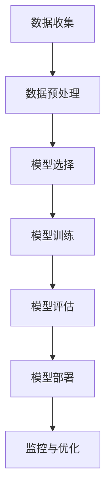

                 

### 1. 引言

#### 1.1 AI编程的重要性

人工智能（AI）作为21世纪最具变革性的技术之一，正在深刻地改变着各行各业。AI编程，作为实现人工智能的核心手段，其重要性不言而喻。AI编程不仅推动了科技的发展，还促进了产业的升级和社会的进步。从智能助手到自动驾驶，从医疗诊断到金融预测，AI编程已经深入到我们生活的方方面面。

在现代科技中，AI编程的重要性体现在以下几个方面：

1. **提高生产效率**：通过自动化和智能化，AI编程能够大幅提升生产效率，降低人力成本，为企业带来显著的经济效益。
2. **推动科技创新**：AI编程推动了新技术、新算法的研发和应用，为科学研究提供了强大的工具，促进了科技进步。
3. **优化决策过程**：AI编程能够通过数据分析和机器学习模型，为企业和政府提供更加精准的决策支持，提高决策效率。
4. **提升生活质量**：从智能家居到智能医疗，AI编程正在改善我们的日常生活，提高生活质量。

#### 1.2 AI编程的发展历程

AI编程的历史可以追溯到20世纪50年代。最早的AI研究主要集中在逻辑推理和问题解决上，如著名的“逻辑理论家”（Logic Theorist）程序。随着计算机性能的提升和算法的进步，AI编程经历了多个发展阶段：

1. **符号人工智能阶段**（1950s-1960s）：这一阶段主要采用逻辑推理和符号表示方法，但受限于计算机的计算能力和数据量。
2. **知识工程阶段**（1970s-1980s）：专家系统和知识表示成为研究热点，AI编程开始尝试模拟人类专家的知识和决策能力。
3. **统计学习阶段**（1990s-2000s）：机器学习特别是统计学习方法的兴起，使得AI编程在图像识别、语音识别等领域取得了突破性进展。
4. **深度学习阶段**（2010s至今）：随着计算能力和大数据的爆炸式增长，深度学习成为AI编程的主流方法，推动了AI技术的迅猛发展。

#### 1.3 本书的目标与结构

本书旨在为读者提供一幅全面而深入的AI编程全景图。具体目标如下：

1. **系统介绍AI编程的基础知识**：从核心概念、关键技术到工具框架，帮助读者建立全面的理论基础。
2. **深入探讨AI编程的新视角**：通过强化学习、聚类分析等先进技术，展示AI编程的多样性和广阔应用前景。
3. **展望AI编程的未来发展趋势**：分析AI编程在区块链、物联网等新兴领域的应用，探讨其未来发展趋势。

全书分为三个部分：

- **第一部分：AI编程基础**：介绍AI编程的核心概念和基础技术，包括机器学习、深度学习、自然语言处理和计算机视觉。
- **第二部分：AI编程新视角**：探讨强化学习、聚类分析等新技术的原理和应用。
- **第三部分：AI编程新境界**：分析AI编程与区块链、物联网的结合，展望其未来发展趋势。

通过本书，读者将能够全面了解AI编程的各个方面，为深入研究和实践打下坚实的基础。

---

### 2. AI编程核心概念

#### 2.1 人工智能的定义

人工智能（Artificial Intelligence，简称AI）是计算机科学的一个分支，旨在创建能够执行通常需要人类智能才能完成的任务的智能系统。AI系统通过模拟人类思维和行为的过程，实现感知、推理、学习、解决问题和决策等功能。

人工智能的定义可以从以下几个方面进行阐述：

1. **感知能力**：AI系统能够感知和理解外界的信息，如视觉、听觉、触觉等。通过传感器和图像处理技术，AI系统能够从图像、声音和文本中提取有用的信息。
2. **推理能力**：AI系统能够根据已知的信息进行逻辑推理，解决问题。例如，通过逻辑推理和模式识别技术，AI系统可以在医疗诊断、法律推理等领域发挥作用。
3. **学习能力**：AI系统能够通过数据和经验不断学习和优化自身性能。机器学习和深度学习技术是实现这一目标的主要手段。
4. **决策能力**：AI系统能够根据环境变化和目标需求，做出合理的决策。在自动驾驶、智能调度等领域，AI系统通过算法和模型实现自主决策。

#### 2.2 AI编程的关键技术

AI编程涉及多种关键技术，包括机器学习、深度学习、自然语言处理和计算机视觉等。下面分别对这些技术进行介绍：

##### **2.2.1 机器学习**

机器学习（Machine Learning，简称ML）是AI编程的基础之一，它通过数据驱动的方式，让计算机自动识别数据中的模式和规律。机器学习主要分为以下几类：

1. **监督学习**（Supervised Learning）：在监督学习框架下，输入数据和对应的输出（标签）是已知的。系统通过学习输入和输出之间的关系，进行预测和分类。常见的算法包括线性回归、逻辑回归、支持向量机（SVM）和神经网络等。
2. **无监督学习**（Unsupervised Learning）：无监督学习不需要标签信息，系统通过挖掘数据内在的结构和关系，进行聚类、降维等操作。常见的算法包括K均值聚类、主成分分析（PCA）和自编码器等。
3. **强化学习**（Reinforcement Learning）：强化学习通过奖励机制，让系统在与环境交互的过程中不断学习和优化策略。常见的算法包括Q-learning、深度Q网络（DQN）和策略梯度方法等。

**伪代码：**

```python
# 监督学习伪代码
def supervised_learning(data, labels):
    # 数据预处理
    preprocess_data(data)
    # 模型初始化
    model = initialize_model()
    # 模型训练
    train_model(model, data, labels)
    # 模型评估
    evaluate_model(model, data, labels)
```

##### **2.2.2 深度学习**

深度学习（Deep Learning，简称DL）是机器学习的一个分支，其核心思想是模拟人脑中的神经网络，通过多层的非线性变换，提取数据中的复杂特征。深度学习在图像识别、语音识别和自然语言处理等领域取得了显著的成果。

1. **神经网络**（Neural Network，简称NN）：神经网络由大量的神经元组成，每个神经元接受输入信号，通过加权求和处理，产生输出信号。常见的神经网络结构包括全连接网络、卷积神经网络（CNN）和循环神经网络（RNN）等。
2. **卷积神经网络**（Convolutional Neural Network，简称CNN）：CNN在图像识别和目标检测等领域具有独特的优势，其核心思想是通过卷积操作提取图像中的局部特征。
3. **循环神经网络**（Recurrent Neural Network，简称RNN）：RNN在序列数据处理方面具有优势，其核心思想是保持状态，通过时间步的循环，对序列中的每个元素进行处理。
4. **生成对抗网络**（Generative Adversarial Network，简称GAN）：GAN由生成器和判别器组成，通过对抗训练，生成器和判别器相互竞争，最终实现高质量的图像生成。

**伪代码：**

```python
# 深度学习伪代码
def deep_learning(data):
    # 数据预处理
    preprocess_data(data)
    # 模型初始化
    model = initialize_model()
    # 模型训练
    train_model(model, data)
    # 模型评估
    evaluate_model(model, data)
```

##### **2.2.3 自然语言处理**

自然语言处理（Natural Language Processing，简称NLP）是AI编程的重要组成部分，旨在使计算机理解和处理自然语言。NLP主要包括以下技术：

1. **语言模型**（Language Model）：语言模型用于预测文本序列的概率分布，是NLP的基础。常见的语言模型包括n元语法模型和神经网络语言模型。
2. **语义分析**（Semantic Analysis）：语义分析旨在理解文本中的语义关系，包括词义消歧、实体识别和关系抽取等。
3. **语音识别**（Speech Recognition）：语音识别将语音信号转换为文本，广泛应用于智能助手和语音搜索等领域。

**伪代码：**

```python
# 自然语言处理伪代码
def natural_language_processing(text):
    # 文本预处理
    preprocess_text(text)
    # 语言模型预测
    predict_language_model(text)
    # 语义分析
    analyze_semantics(text)
    # 语音识别
    recognize_speech(text)
```

##### **2.2.4 计算机视觉**

计算机视觉（Computer Vision，简称CV）是AI编程的重要应用领域，旨在使计算机能够理解和解释图像和视频。计算机视觉主要包括以下技术：

1. **图像识别**（Image Recognition）：图像识别用于识别图像中的物体和场景，是计算机视觉的基础。常见的算法包括卷积神经网络和深度卷积神经网络。
2. **目标检测**（Object Detection）：目标检测用于识别图像中的多个目标，并定位它们的位置。常见的算法包括YOLO、SSD和Faster R-CNN等。
3. **图像生成**（Image Generation）：图像生成通过生成对抗网络（GAN）等技术，生成高质量的图像。

**伪代码：**

```python
# 计算机视觉伪代码
def computer_vision(image):
    # 图像预处理
    preprocess_image(image)
    # 图像识别
    recognize_objects(image)
    # 目标检测
    detect_objects(image)
    # 图像生成
    generate_images()
```

通过上述介绍，我们可以看到，AI编程涉及多个核心技术和应用领域。这些技术相互关联，共同推动着AI技术的发展和应用。在接下来的章节中，我们将进一步探讨AI编程的具体应用和实践。

---

### 2.2 AI编程的关键技术

在了解了AI编程的核心概念后，接下来我们将深入探讨其关键技术。AI编程的关键技术包括机器学习、深度学习、自然语言处理和计算机视觉。这些技术不仅为AI系统提供了强大的能力，也在不断推动AI技术的发展和应用。下面我们将逐一介绍这些关键技术。

#### **2.2.1 机器学习**

机器学习（Machine Learning，ML）是AI编程的基础，它通过数据驱动的方法，使计算机能够从数据中自动学习和发现规律。机器学习可以分为以下几类：

1. **监督学习**（Supervised Learning）：在监督学习框架下，训练数据集包含了输入和对应的输出（标签），模型通过学习输入和输出之间的关系，进行预测和分类。常见的监督学习算法包括线性回归、逻辑回归、支持向量机（SVM）和决策树等。

   **监督学习算法伪代码：**
   
   ```python
   def supervised_learning(train_data, train_labels):
       # 数据预处理
       preprocess_data(train_data)
       # 模型初始化
       model = initialize_model()
       # 模型训练
       train_model(model, train_data, train_labels)
       # 模型评估
       evaluate_model(model, train_data, train_labels)
       return model
   ```

2. **无监督学习**（Unsupervised Learning）：在无监督学习框架下，训练数据集没有标签信息，模型通过挖掘数据内在的结构和规律进行聚类、降维等操作。常见的无监督学习算法包括K均值聚类、主成分分析（PCA）和自编码器等。

   **无监督学习算法伪代码：**
   
   ```python
   def unsupervised_learning(data):
       # 数据预处理
       preprocess_data(data)
       # 模型初始化
       model = initialize_model()
       # 模型训练
       train_model(model, data)
       # 模型评估
       evaluate_model(model, data)
       return model
   ```

3. **强化学习**（Reinforcement Learning）：强化学习通过奖励机制，使模型在与环境互动的过程中不断学习和优化策略。常见的强化学习算法包括Q-learning、深度Q网络（DQN）和策略梯度方法等。

   **强化学习算法伪代码：**
   
   ```python
   def reinforcement_learning(state, action, reward):
       # 状态更新
       update_state(state)
       # 行动更新
       update_action(action, reward)
       # 奖励更新
       update_reward(reward)
       # 模型训练
       train_model(state, action, reward)
       return state, action, reward
   ```

#### **2.2.2 深度学习**

深度学习（Deep Learning，DL）是机器学习的一个分支，它通过模拟人脑的神经网络结构，对大量数据进行学习和处理。深度学习在图像识别、语音识别和自然语言处理等领域取得了显著的成果。

1. **神经网络**（Neural Network，NN）：神经网络由大量的神经元组成，每个神经元接收输入信号，通过加权求和处理，产生输出信号。神经网络可以通过反向传播算法不断调整权重，以优化模型性能。

   **神经网络伪代码：**
   
   ```python
   def neural_network(inputs, weights, biases):
       # 前向传播
       output = weighted_sum(inputs, weights) + biases
       # 激活函数
       activated_output = activation_function(output)
       return activated_output
   ```

2. **卷积神经网络**（Convolutional Neural Network，CNN）：卷积神经网络在图像识别和目标检测等领域具有独特的优势，其核心思想是通过卷积操作提取图像中的局部特征。

   **卷积神经网络伪代码：**
   
   ```python
   def conv_network(image, filters, biases):
       # 卷积操作
       conv_output = convolution(image, filters)
       # 激活函数
       activated_output = activation_function(conv_output)
       # 池化操作
       pooled_output = pooling(activated_output)
       return pooled_output
   ```

3. **循环神经网络**（Recurrent Neural Network，RNN）：循环神经网络在序列数据处理方面具有优势，其核心思想是保持状态，通过时间步的循环，对序列中的每个元素进行处理。

   **循环神经网络伪代码：**
   
   ```python
   def recurrent_network(sequence, weights, biases):
       # 初始化隐藏状态
       hidden_state = initialize_hidden_state()
       # 循环处理序列
       for element in sequence:
           # 前向传播
           output = weighted_sum(element, weights) + biases
           # 激活函数
           activated_output = activation_function(output)
           # 更新隐藏状态
           hidden_state = update_hidden_state(hidden_state, activated_output)
       return hidden_state
   ```

4. **生成对抗网络**（Generative Adversarial Network，GAN）：生成对抗网络由生成器和判别器组成，生成器生成数据，判别器判断生成数据与真实数据的区别。通过对抗训练，生成器和判别器相互竞争，最终生成高质量的数据。

   **生成对抗网络伪代码：**
   
   ```python
   def generative_adversarial_network(generator, discriminator, real_data, fake_data):
       # 生成器生成假数据
       generated_data = generator(fake_data)
       # 判别器判断真伪
       discriminator_output = discriminator(generated_data, real_data)
       # 生成器训练
       generator_loss = generator.train(generated_data)
       # 判别器训练
       discriminator_loss = discriminator.train(real_data, generated_data)
       return generator_loss, discriminator_loss
   ```

#### **2.2.3 自然语言处理**

自然语言处理（Natural Language Processing，NLP）是AI编程的重要组成部分，旨在使计算机理解和处理自然语言。NLP主要包括以下技术：

1. **语言模型**（Language Model）：语言模型用于预测文本序列的概率分布，是NLP的基础。常见的语言模型包括n元语法模型和神经网络语言模型。

   **语言模型伪代码：**
   
   ```python
   def language_model(text_sequence, model_params):
       # 预测下一个单词的概率
       next_word_probability = predict_next_word(text_sequence, model_params)
       # 更新语言模型参数
       update_model_params(text_sequence, next_word_probability)
       return next_word_probability
   ```

2. **语义分析**（Semantic Analysis）：语义分析旨在理解文本中的语义关系，包括词义消歧、实体识别和关系抽取等。

   **语义分析伪代码：**
   
   ```python
   def semantic_analysis(text, semantic_model):
       # 词义消歧
       resolved_words = resolve_word_sense(text, semantic_model)
       # 实体识别
       entities = extract_entities(text, semantic_model)
       # 关系抽取
       relationships = extract_relationships(text, semantic_model)
       return resolved_words, entities, relationships
   ```

3. **语音识别**（Speech Recognition）：语音识别将语音信号转换为文本，广泛应用于智能助手和语音搜索等领域。

   **语音识别伪代码：**
   
   ```python
   def speech_recognition(audio_signal, acoustic_model, language_model):
       # 特征提取
       audio_features = extract_features(audio_signal)
       # 声学模型解码
       acoustic_output = decode_acoustic_model(audio_features, acoustic_model)
       # 语言模型解码
       language_output = decode_language_model(acoustic_output, language_model)
       return language_output
   ```

#### **2.2.4 计算机视觉**

计算机视觉（Computer Vision，CV）是AI编程的重要应用领域，旨在使计算机能够理解和解释图像和视频。计算机视觉主要包括以下技术：

1. **图像识别**（Image Recognition）：图像识别用于识别图像中的物体和场景，是计算机视觉的基础。常见的算法包括卷积神经网络和深度卷积神经网络。

   **图像识别伪代码：**
   
   ```python
   def image_recognition(image, cv_model):
       # 图像预处理
       preprocessed_image = preprocess_image(image)
       # 模型预测
       predicted_classes = cv_model.predict(preprocessed_image)
       # 获取最高概率的类别
       top_class = predicted_classes.argmax()
       return top_class
   ```

2. **目标检测**（Object Detection）：目标检测用于识别图像中的多个目标，并定位它们的位置。常见的算法包括YOLO、SSD和Faster R-CNN等。

   **目标检测伪代码：**
   
   ```python
   def object_detection(image, detection_model):
       # 图像预处理
       preprocessed_image = preprocess_image(image)
       # 模型预测
       detection_results = detection_model.predict(preprocessed_image)
       # 获取检测结果
       bounding_boxes = detection_results.bounding_boxes
       labels = detection_results.labels
       scores = detection_results.scores
       return bounding_boxes, labels, scores
   ```

3. **图像生成**（Image Generation）：图像生成通过生成对抗网络（GAN）等技术，生成高质量的图像。

   **图像生成伪代码：**
   
   ```python
   def image_generation(generator_model, noise_vector):
       # 生成图像
       generated_image = generator_model.generate_image(noise_vector)
       return generated_image
   ```

通过上述介绍，我们可以看到，AI编程的关键技术不仅涵盖了理论和方法，还涉及到实际的算法实现。这些技术相互结合，共同推动着AI技术的发展和应用。在接下来的章节中，我们将继续探讨AI编程的工具与框架，以及其在实际应用中的实践。

---

### 2.3 AI编程工具与框架

AI编程的成功离不开高效且强大的工具和框架的支持。这些工具和框架不仅简化了AI编程的复杂性，还提高了开发效率。下面我们将介绍一些常用的AI编程工具与框架，包括Python在AI编程中的应用、TensorFlow与PyTorch的使用，以及其他流行的AI编程工具和框架。

#### **2.3.1 Python在AI编程中的应用**

Python因其简洁易懂的语法和丰富的库资源，成为AI编程的首选语言。Python的几个核心库在AI编程中发挥着重要作用：

1. **NumPy**：NumPy是一个强大的Python库，用于处理大型多维数组，提供高效的数学计算功能。NumPy在数据处理、矩阵运算等方面具有广泛应用。

2. **Pandas**：Pandas是一个强大的数据操作库，用于处理结构化数据（如表格数据）。Pandas提供了丰富的数据清洗、转换和分析功能，是数据预处理的重要工具。

3. **Scikit-learn**：Scikit-learn是一个用于机器学习的Python库，提供了大量的机器学习算法实现。Scikit-learn包括监督学习、无监督学习和模型选择等模块，适用于各种机器学习任务。

4. **Matplotlib**：Matplotlib是一个数据可视化库，用于生成高质量的图表和图形。Matplotlib在数据分析和模型评估中发挥着重要作用，有助于直观地展示分析结果。

5. **Seaborn**：Seaborn是基于Matplotlib的一个高级可视化库，用于生成具有统计学意义的可视化图表。Seaborn提供了多种统计图表，如箱线图、散点图和热力图，是数据可视化的重要工具。

#### **2.3.2 TensorFlow与PyTorch的使用**

TensorFlow和PyTorch是目前最流行的深度学习框架，它们在AI编程中扮演着至关重要的角色。

1. **TensorFlow**：TensorFlow是由Google开发的开源深度学习框架，具有强大的功能和高扩展性。TensorFlow使用数据流图（dataflow graph）来表示计算过程，通过图形编译和执行来优化计算。TensorFlow提供了丰富的预构建模型和API，适用于各种深度学习任务，如图像识别、文本分类和语音识别等。

   **TensorFlow的使用示例：**

   ```python
   import tensorflow as tf

   # 定义模型
   model = tf.keras.Sequential([
       tf.keras.layers.Dense(128, activation='relu', input_shape=(784,)),
       tf.keras.layers.Dense(10, activation='softmax')
   ])

   # 编译模型
   model.compile(optimizer='adam',
                 loss='categorical_crossentropy',
                 metrics=['accuracy'])

   # 训练模型
   model.fit(x_train, y_train, epochs=5)
   ```

2. **PyTorch**：PyTorch是由Facebook开发的开源深度学习框架，以其灵活性和易用性著称。PyTorch使用动态计算图（dynamic computation graph），使得模型构建和调试更加直观。PyTorch提供了丰富的库和API，支持各种深度学习任务，包括图像识别、自然语言处理和生成模型等。

   **PyTorch的使用示例：**

   ```python
   import torch
   import torch.nn as nn
   import torch.optim as optim

   # 定义模型
   class Model(nn.Module):
       def __init__(self):
           super(Model, self).__init__()
           self.layers = nn.Sequential(
               nn.Linear(784, 128),
               nn.ReLU(),
               nn.Linear(128, 10)
           )

       def forward(self, x):
           return self.layers(x)

   # 初始化模型和优化器
   model = Model()
   optimizer = optim.Adam(model.parameters(), lr=0.001)

   # 训练模型
   for epoch in range(5):
       for x, y in train_loader:
           optimizer.zero_grad()
           output = model(x)
           loss = nn.CrossEntropyLoss()(output, y)
           loss.backward()
           optimizer.step()
   ```

#### **2.3.3 其他AI编程工具与框架**

除了TensorFlow和PyTorch，还有其他一些流行的AI编程工具和框架，如Keras、Theano、MXNet和Caffe等。这些框架各具特色，适用于不同的应用场景。

1. **Keras**：Keras是一个高级深度学习API，构建在TensorFlow和Theano之上，提供了更加简洁和直观的接口。Keras适用于快速实验和模型原型设计。

2. **Theano**：Theano是一个基于Python的深度学习框架，提供了优化的数学运算和编译功能。Theano在计算图编译和优化方面具有优势，适用于复杂模型的开发。

3. **MXNet**：MXNet是由Apache基金会开发的深度学习框架，支持多种编程语言，包括Python、R和Scala。MXNet适用于大规模分布式训练和应用。

4. **Caffe**：Caffe是一个开源的深度学习框架，特别适用于图像识别和计算机视觉任务。Caffe具有高效的卷积操作和模型部署功能。

通过上述介绍，我们可以看到，AI编程的工具和框架极大地简化了开发过程，提高了开发效率。不同的工具和框架具有各自的特点和优势，开发者可以根据实际需求选择合适的工具和框架。在接下来的章节中，我们将探讨AI编程的具体实践，通过实际案例展示AI编程的应用和实现。

---

### 2.4 AI编程实践

AI编程不仅需要理论知识，还需要通过实践来验证和应用所学知识。在本节中，我们将探讨AI编程的实践过程，包括数据预处理、模型训练与优化、模型评估与部署等关键步骤。

#### **2.4.1 数据预处理**

数据预处理是AI编程中至关重要的一步，其目的是将原始数据转换为适合模型训练的形式。以下是一些常见的数据预处理步骤：

1. **数据清洗**：清洗数据是处理缺失值、异常值和噪声的过程。常用的方法包括删除缺失值、填充缺失值和异常值检测。
2. **数据转换**：将数据转换为适合模型训练的格式。例如，将类别数据转换为独热编码，将连续数据缩放到合适的范围。
3. **数据归一化**：通过归一化将数据缩放到相同的尺度，有助于模型收敛和提高训练效果。常用的归一化方法包括最小-最大归一化和Z-Score归一化。
4. **数据增强**：通过增加数据的多样性来提高模型的泛化能力。常用的数据增强方法包括旋转、翻转、裁剪和缩放等。

**伪代码：**

```python
# 数据预处理伪代码
def preprocess_data(data):
    # 数据清洗
    cleaned_data = clean_data(data)
    # 数据转换
    transformed_data = convert_data(cleaned_data)
    # 数据归一化
    normalized_data = normalize_data(transformed_data)
    # 数据增强
    augmented_data = augment_data(normalized_data)
    return augmented_data
```

#### **2.4.2 模型训练与优化**

模型训练是AI编程的核心步骤，其目的是通过学习数据中的规律来优化模型参数。以下是一些常见的模型训练和优化方法：

1. **选择合适的模型**：根据任务需求选择合适的模型。例如，对于分类任务，可以选择多层感知机、支持向量机或卷积神经网络等。
2. **定义损失函数**：选择合适的损失函数来衡量模型预测与真实标签之间的差异。常见的损失函数包括均方误差（MSE）、交叉熵损失（Cross-Entropy Loss）和Hinge损失等。
3. **优化算法**：选择合适的优化算法来更新模型参数。常见的优化算法包括梯度下降（Gradient Descent）、Adam优化器和RMSprop等。
4. **训练策略**：设置训练参数，如学习率、训练批次大小和迭代次数等。通过调整这些参数，可以改善模型的训练效果。

**伪代码：**

```python
# 模型训练与优化伪代码
def train_model(model, data, labels, optimizer, loss_function):
    # 数据预处理
    preprocessed_data = preprocess_data(data)
    # 定义训练循环
    for epoch in range(num_epochs):
        for batch in data_loader:
            # 前向传播
            predictions = model(batch)
            # 计算损失
            loss = loss_function(predictions, labels)
            # 反向传播
            optimizer.zero_grad()
            loss.backward()
            optimizer.step()
            # 打印训练进度
            print(f"Epoch {epoch+1}/{num_epochs}, Loss: {loss.item()}")
    return model
```

#### **2.4.3 模型评估与部署**

模型评估是验证模型性能和可靠性的关键步骤，以下是一些常见的模型评估方法：

1. **准确率**（Accuracy）：准确率是预测正确的样本数占总样本数的比例，是分类任务中最常用的评估指标。
2. **召回率**（Recall）：召回率是预测正确的正样本数占总正样本数的比例，反映了模型对正样本的识别能力。
3. **精确率**（Precision）：精确率是预测正确的正样本数占总预测正样本数的比例，反映了模型对正样本预测的准确性。
4. **F1分数**（F1 Score）：F1分数是精确率和召回率的调和平均值，综合了模型的精度和召回率。

**伪代码：**

```python
# 模型评估伪代码
def evaluate_model(model, test_data, test_labels):
    # 数据预处理
    preprocessed_data = preprocess_data(test_data)
    # 模型预测
    predictions = model(preprocessed_data)
    # 计算评估指标
    accuracy = (predictions == test_labels).mean()
    recall = recall_score(test_labels, predictions)
    precision = precision_score(test_labels, predictions)
    f1_score = f1_score(test_labels, predictions)
    # 打印评估结果
    print(f"Accuracy: {accuracy}, Recall: {recall}, Precision: {precision}, F1 Score: {f1_score}")
```

模型部署是将训练好的模型应用到实际环境中进行预测的过程。以下是一些常见的模型部署方法：

1. **本地部署**：将训练好的模型保存为文件，然后在本地环境中进行预测。
2. **云计算部署**：将模型部署到云端服务器，通过API接口进行远程调用。
3. **边缘计算部署**：将模型部署到边缘设备上，如智能手机、无人机等，实现实时预测。

**伪代码：**

```python
# 模型部署伪代码
def deploy_model(model, data):
    # 数据预处理
    preprocessed_data = preprocess_data(data)
    # 模型预测
    predictions = model(preprocessed_data)
    return predictions
```

通过上述实践步骤，我们可以将AI编程的理论知识应用到实际项目中，实现智能系统的构建和部署。在接下来的章节中，我们将探讨AI编程的新视角，介绍强化学习和聚类分析等先进技术，以拓展我们对AI编程的理解和应用。

---

## 5. 强化学习与AI编程

强化学习（Reinforcement Learning，RL）是机器学习的一个重要分支，其核心思想是通过与环境交互，不断学习最优策略，以实现目标。强化学习在AI编程中有着广泛的应用，如自动驾驶、游戏AI和机器人控制等。在这一节中，我们将深入探讨强化学习的原理、在AI编程中的应用，以及强化学习的伪代码实现。

### 5.1 强化学习的原理

强化学习的基本原理是代理（Agent）通过与环境（Environment）的交互，从初始状态（State）开始，采取动作（Action），获得即时奖励（Reward），并根据奖励调整策略（Policy）。强化学习的目标是通过不断的试错，学习到最优策略，使总奖励最大化。

1. **状态（State）**：状态是描述环境当前情况的变量集合，可以是离散的，也可以是连续的。
2. **动作（Action）**：动作是代理可执行的行为，也是从状态中选择的一种操作。
3. **奖励（Reward）**：奖励是代理执行动作后从环境中获得的即时回报，它用于指导代理下一步的动作选择。
4. **策略（Policy）**：策略是代理选择动作的规则，策略决定了代理在特定状态下应该采取哪个动作。
5. **价值函数（Value Function）**：价值函数用于评估状态或状态-动作对的预期回报，有助于代理选择最佳动作。
6. **模型（Model）**：模型是代理对环境的理解和预测，通过模型，代理可以在不知道实际状态的情况下，预测未来的奖励和状态转移。

强化学习的基本流程可以概括为以下步骤：

1. 初始化环境、代理和策略。
2. 代理从初始状态开始，采取动作，并获得即时奖励。
3. 根据即时奖励和策略，代理更新价值函数和策略。
4. 重复上述步骤，直到达到目标状态或最大迭代次数。

### 5.2 强化学习在AI编程中的应用

强化学习在AI编程中的应用非常广泛，以下是几个典型的应用场景：

1. **自动驾驶**：自动驾驶系统使用强化学习来学习最优驾驶策略，以实现安全、高效的驾驶。代理通过与环境交互，不断调整驾驶动作，如加速、减速和转向，以最大化驾驶安全性。
2. **游戏AI**：游戏AI使用强化学习来学习游戏策略，以实现智能化的游戏对手。代理通过玩多个游戏，不断调整策略，以达到最高得分或胜利。
3. **机器人控制**：机器人控制中的强化学习用于学习最优运动策略，以实现机器人的自主移动和任务执行。代理通过与环境交互，不断调整运动动作，以实现精准控制。

### 5.3 强化学习的伪代码实现

以下是一个简单的强化学习伪代码实现，展示了强化学习的基本流程：

```python
# 强化学习伪代码

# 初始化环境、代理和策略
environment = initialize_environment()
agent = initialize_agent()
policy = initialize_policy()

# 强化学习循环
while not environment.is_terminated():
    # 代理从当前状态采取动作
    action = agent.act(state)
    # 环境执行动作，返回新的状态和即时奖励
    next_state, reward = environment.step(action)
    # 代理根据即时奖励和策略更新价值函数和策略
    agent.learn(state, action, reward, next_state)
    # 更新状态
    state = next_state

# 输出最终状态和总奖励
final_state, total_reward = environment.get_final_state_and_reward()
return final_state, total_reward
```

通过上述伪代码，我们可以看到，强化学习的关键在于代理与环境之间的互动和学习过程。代理通过不断尝试不同的动作，并根据即时奖励调整策略，最终学习到最优策略。在AI编程中，强化学习为解决复杂决策问题提供了一种强有力的方法。

---

### 6. 聚类分析与AI编程

聚类分析（Cluster Analysis）是一种无监督学习方法，用于将数据集中的数据对象划分成多个群组（聚类），使得同一个群组内的对象彼此之间相似度较高，而不同群组之间的对象相似度较低。聚类分析在数据挖掘、图像识别、文本分类等领域有着广泛应用。在这一节中，我们将探讨聚类分析的基本概念、在AI编程中的应用，以及聚类分析的伪代码实现。

#### **6.1 聚类分析的基本概念**

聚类分析涉及以下几个基本概念：

1. **簇（Cluster）**：簇是聚类分析中的一个群组，包含数据对象，这些对象在某种度量下彼此相似。
2. **相似度度量（Similarity Measure）**：相似度度量用于衡量数据对象之间的相似程度。常用的相似度度量包括欧氏距离、曼哈顿距离和余弦相似性等。
3. **聚类算法（Clustering Algorithm）**：聚类算法是实现聚类分析的核心，用于将数据对象划分成多个簇。常见的聚类算法包括K均值聚类、层次聚类和密度聚类等。
4. **聚类评价（Clustering Evaluation）**：聚类评价用于评估聚类结果的质量。常用的评价方法包括轮廓系数、内切球体积和簇间平均距离等。

#### **6.2 聚类分析在AI编程中的应用**

聚类分析在AI编程中的应用场景非常广泛，以下是一些典型的应用：

1. **客户细分**：在市场营销中，聚类分析可以用于将客户群体划分为不同的细分市场，以便针对不同市场采取相应的营销策略。
2. **图像识别**：聚类分析可以用于图像分割和物体识别，通过将图像中的像素点或区域划分为不同的簇，实现图像的分割和物体的识别。
3. **文本分类**：聚类分析可以用于文本数据挖掘，将文本数据划分为不同的主题类别，帮助实现文本的自动分类和聚类。
4. **生物信息学**：在生物信息学中，聚类分析可以用于基因表达数据分析，帮助识别基因的功能和作用。

#### **6.3 聚类分析的伪代码实现**

以下是一个简单的K均值聚类（K-Means）算法的伪代码实现，展示了聚类分析的基本流程：

```python
# K均值聚类伪代码

# 初始化参数
K = number_of_clusters
num_iterations = max_number_of_iterations

# 初始化簇中心
centroids = initialize_centroids(data)

# 聚类迭代
for iteration in range(num_iterations):
    # 分配数据到最近的簇中心
    clusters = assign_data_to_clusters(data, centroids)
    # 更新簇中心
    centroids = update_centroids(clusters)
    # 计算簇内距离平方和
    sum_squared_distances = calculate_sum_squared_distances(clusters, centroids)
    # 检查收敛条件
    if has_converged(centroids):
        break

# 输出最终聚类结果
clusters = assign_data_to_clusters(data, centroids)
return clusters
```

通过上述伪代码，我们可以看到，K均值聚类算法通过迭代更新簇中心和分配数据对象，最终实现聚类目标。在AI编程中，聚类分析为解决数据分类和模式识别问题提供了一种有效的手段。

---

### 7. 强化学习与聚类分析的结合

强化学习和聚类分析虽然属于不同的机器学习领域，但它们在某些应用场景中可以结合使用，发挥协同效应。强化学习通过与环境交互，学习最优策略，而聚类分析则用于对数据进行分类和模式识别。在本节中，我们将探讨强化学习与聚类分析的结合原理、在AI编程中的应用，以及结合的伪代码实现。

#### **7.1 强化学习与聚类分析的结合原理**

强化学习与聚类分析的结合主要体现在以下两个方面：

1. **数据聚类作为状态表示**：在强化学习中，状态（State）是描述环境当前情况的一个变量集合。通过聚类分析，可以将数据划分为不同的簇，每个簇作为一个状态表示。这种表示方式有助于强化学习更好地理解环境，提高决策能力。
2. **聚类结果作为奖励信号**：在强化学习中，奖励（Reward）是指导代理行为的重要信号。通过聚类分析的结果，可以设计合适的奖励机制，使得代理在获得聚类结果时获得奖励，从而激励代理在探索中学习最优策略。

#### **7.2 强化学习与聚类分析的结合在AI编程中的应用**

强化学习与聚类分析的结合在AI编程中具有广泛的应用，以下是一些典型的应用场景：

1. **智能推荐系统**：在智能推荐系统中，强化学习可以用于学习用户的兴趣和偏好，而聚类分析可以用于对用户和商品进行分类，从而生成个性化的推荐列表。
2. **图像识别与分割**：在图像识别和分割中，强化学习可以用于学习图像的特征表示，而聚类分析可以用于对图像中的区域进行分类和分割，从而实现更精准的图像识别。
3. **自动驾驶**：在自动驾驶系统中，强化学习可以用于学习驾驶策略，而聚类分析可以用于对道路场景进行分类，从而提高自动驾驶系统的安全性和可靠性。
4. **智能供应链管理**：在智能供应链管理中，强化学习可以用于优化库存管理和配送策略，而聚类分析可以用于对客户和供应商进行分类，从而实现更高效的管理。

#### **7.3 强化学习与聚类分析的结合的伪代码实现**

以下是一个简单的强化学习与聚类分析结合的伪代码实现，展示了结合的基本流程：

```python
# 强化学习与聚类分析结合的伪代码

# 初始化环境、代理和聚类模型
environment = initialize_environment()
agent = initialize_agent()
clustering_model = initialize_clustering_model()

# 强化学习循环
while not environment.is_terminated():
    # 代理从当前状态采取动作
    action = agent.act(state)
    # 环境执行动作，返回新的状态和即时奖励
    next_state, reward = environment.step(action)
    # 使用聚类模型更新状态表示
    cluster_labels = clustering_model.cluster(next_state)
    # 根据聚类结果更新奖励信号
    reward = update_reward(reward, cluster_labels)
    # 代理根据即时奖励和策略更新价值函数和策略
    agent.learn(state, action, reward, next_state)
    # 更新状态
    state = next_state

# 输出最终状态和总奖励
final_state, total_reward = environment.get_final_state_and_reward()
return final_state, total_reward
```

通过上述伪代码，我们可以看到，强化学习与聚类分析的结合通过聚类结果更新状态表示和奖励信号，提高了代理的决策能力。在AI编程中，这种结合为解决复杂决策问题提供了一种新的思路和方法。

---

### 8. AI编程与区块链技术

区块链技术作为一种革命性的分布式数据库技术，具有去中心化、不可篡改和透明等特点，正逐步应用于金融、医疗、供应链等多个领域。AI编程与区块链技术的结合，为解决数据隐私保护、智能合约执行和分布式计算等问题提供了新的可能性。在这一节中，我们将探讨区块链的基本概念、AI编程与区块链的结合方式，以及区块链在AI编程中的应用。

#### **8.1 区块链的基本概念**

区块链是一种分布式数据库技术，通过多个参与者共同维护一个不断增长的记录链条。以下是一些关键概念：

1. **区块链（Blockchain）**：区块链是一个由多个区块组成的链条，每个区块包含一定数量的交易记录，并按照时间顺序链接在一起。区块链具有去中心化的特性，使得数据存储和验证过程不由单一中心控制。
2. **区块（Block）**：区块是区块链的基本组成单元，包含一定数量的交易记录以及前一个区块的哈希值。每个区块都通过加密算法与前一个区块链接，形成一条不可篡改的数据链条。
3. **节点（Node）**：节点是区块链网络中的参与方，负责维护区块链数据、验证交易、参与共识过程等。节点通过共识算法达成一致，确保区块链数据的准确性和完整性。
4. **智能合约（Smart Contract）**：智能合约是一种运行在区块链上的自执行合约，通过编程语言编写，定义了参与者之间的权利和义务。智能合约在满足特定条件时自动执行，无需人为干预。
5. **共识算法（Consensus Algorithm）**：共识算法是区块链网络中节点达成一致的方法。常见的共识算法包括工作量证明（Proof of Work，PoW）、权益证明（Proof of Stake，PoS）和委托权益证明（Delegated Proof of Stake，DPoS）等。

#### **8.2 AI编程与区块链的结合方式**

AI编程与区块链技术的结合方式主要包括以下几种：

1. **数据隐私保护**：区块链技术通过加密算法和分布式存储，确保数据隐私和安全。AI编程可以利用区块链的隐私保护特性，在数据挖掘和机器学习过程中保护用户隐私。
2. **智能合约**：智能合约可以与AI模型结合，实现自动化决策和执行。例如，智能合约可以用于自动执行金融交易、自动分配资源等，提高交易效率和透明度。
3. **分布式计算**：区块链网络中的多个节点可以共同参与AI模型的训练和推理过程，实现分布式计算。这种结合方式可以提高AI模型的计算能力和可扩展性。

#### **8.3 区块链在AI编程中的应用**

区块链技术在AI编程中有着广泛的应用，以下是一些典型应用：

1. **去中心化AI**：去中心化AI利用区块链技术，实现分布式AI模型的训练和推理。通过多个节点的协同工作，去中心化AI可以处理大规模数据，提高模型的可扩展性和鲁棒性。
2. **数据共享与治理**：区块链技术可以用于数据共享和治理，确保数据的安全性和可靠性。例如，在医疗领域，区块链可以用于存储和管理患者数据，实现数据共享和隐私保护。
3. **智能合约**：智能合约可以与AI模型结合，实现自动化决策和执行。例如，在金融领域，智能合约可以用于自动执行交易、管理贷款和保险等。
4. **供应链管理**：区块链技术可以用于供应链管理，确保供应链的透明度和可追溯性。AI编程可以与区块链结合，实现供应链数据的智能分析和优化。

通过上述探讨，我们可以看到，AI编程与区块链技术的结合为解决数据隐私、智能合约和分布式计算等问题提供了新的思路。在未来的发展中，AI编程与区块链技术的结合将继续拓展应用领域，推动科技和产业的进步。

---

### 9. AI编程与物联网技术

物联网（Internet of Things，IoT）作为新一代信息技术的代表，正逐步融入我们生活的方方面面。物联网通过将各种物理设备、传感器和系统连接到互联网，实现数据采集、传输和处理，从而实现智能化的应用场景。AI编程与物联网技术的结合，不仅提升了物联网系统的智能化水平，还推动了物联网应用的广泛发展。在这一节中，我们将探讨物联网的基本概念、AI编程与物联网的结合方式，以及物联网在AI编程中的应用。

#### **9.1 物联网的基本概念**

物联网是指通过互联网、传感器、设备和软件等技术的结合，实现物体之间的互联互通，从而形成一个智能化的网络环境。以下是一些关键概念：

1. **物联网设备（IoT Devices）**：物联网设备是指连接到互联网的物理设备，包括智能手表、智能手机、智能家居设备、工业传感器等。这些设备通过无线网络或有线网络，与云端或其他设备进行通信。
2. **传感器（Sensor）**：传感器是物联网设备的核心组成部分，用于检测和测量环境中的物理量，如温度、湿度、光照、声音等。传感器采集的数据是物联网系统进行智能分析和决策的重要依据。
3. **数据采集与传输（Data Collection and Transmission）**：物联网设备通过传感器采集数据，并将数据传输到云端或其他设备。数据传输通常采用无线通信技术，如Wi-Fi、蓝牙、ZigBee等。
4. **边缘计算（Edge Computing）**：边缘计算是指将数据处理和计算任务从云端转移到网络边缘（如物联网设备或边缘服务器）进行，以减少数据传输延迟和带宽消耗。
5. **物联网平台（IoT Platform）**：物联网平台是连接物联网设备、传感器和云计算的枢纽，提供数据存储、处理、分析和可视化等功能。常见的物联网平台包括AWS IoT、Azure IoT和Google Cloud IoT等。

#### **9.2 AI编程与物联网的结合方式**

AI编程与物联网技术的结合方式主要包括以下几种：

1. **数据采集与处理**：AI编程可以用于处理物联网设备采集的海量数据，通过数据清洗、特征提取和模式识别等技术，提取有价值的信息。例如，在智能家居中，AI编程可以用于分析传感器数据，实现智能家电的控制和优化。
2. **智能决策与控制**：AI编程可以与物联网设备结合，实现智能决策和控制。例如，在智能工厂中，AI编程可以用于监控生产线设备，自动调整生产参数，提高生产效率。
3. **边缘智能**：边缘计算是AI编程与物联网技术结合的重要方向，通过在物联网设备的边缘进行数据处理和计算，实现实时性、安全性和隐私保护。例如，在智能交通中，边缘计算可以用于实时监控道路状况，实现智能交通信号控制。
4. **智能设备协同**：AI编程可以用于协调多个物联网设备的协作，实现复杂任务的自动化执行。例如，在智能城市中，AI编程可以用于协调智能路灯、智能垃圾桶和智能交通信号灯的协同工作，提高城市管理水平。

#### **9.3 物联网在AI编程中的应用**

物联网技术在AI编程中有着广泛的应用，以下是一些典型应用：

1. **智能家居**：智能家居是物联网技术的典型应用场景，通过AI编程，实现家电设备的智能控制，提高生活便利性和舒适度。例如，智能空调、智能照明和智能安防系统等。
2. **智能医疗**：智能医疗通过物联网技术，实现医疗设备和患者的互联互通，提供个性化的健康管理和医疗服务。AI编程可以用于分析医疗数据，实现智能诊断、智能用药和智能康复等。
3. **智能交通**：智能交通通过物联网技术，实现交通信息的实时采集、传输和分析，提供智能交通管理和优化服务。AI编程可以用于实现智能交通信号控制、智能导航和智能停车等。
4. **智能制造**：智能制造通过物联网技术，实现生产设备的互联互通和智能控制，提高生产效率和质量。AI编程可以用于实现生产过程的实时监控、故障诊断和优化调度等。

通过上述探讨，我们可以看到，AI编程与物联网技术的结合为智能应用场景提供了广阔的发展空间。在未来的发展中，AI编程与物联网技术的结合将继续推动科技创新和产业变革。

---

### 10. AI编程的未来发展趋势

AI编程作为人工智能的核心技术之一，正以惊人的速度发展。未来，AI编程将朝着多个方向演进，包括技术趋势、产业趋势和社会影响与伦理问题。在这一节中，我们将探讨AI编程的未来发展趋势。

#### **10.1 技术趋势**

1. **量子计算**：量子计算是一种利用量子力学原理进行信息处理的计算方式。相比传统计算，量子计算具有巨大的并行处理能力，有望在复杂计算任务中发挥重要作用。未来，量子计算与AI编程的结合，将推动AI编程技术的突破。
2. **联邦学习**：联邦学习是一种分布式机器学习方法，通过将数据保留在本地设备上，实现模型训练和推理。联邦学习可以解决数据隐私和安全问题，有望在医疗、金融等敏感数据领域得到广泛应用。
3. **多模态学习**：多模态学习是指利用不同类型的数据（如文本、图像、声音等）进行综合分析和学习。未来，多模态学习将进一步提升AI编程的智能水平和应用范围。
4. **自适应强化学习**：自适应强化学习是一种能够动态调整策略和学习速率的强化学习方法。未来，自适应强化学习有望在动态环境和复杂任务中发挥重要作用。

#### **10.2 产业趋势**

1. **跨行业融合**：随着AI技术的不断成熟，AI编程将逐渐融入多个行业，实现跨行业融合。例如，AI编程与制造业、医疗、金融、交通等领域的结合，将推动产业升级和创新发展。
2. **产业链优化**：AI编程将优化产业链的各个环节，提高生产效率和质量。例如，通过AI编程实现智能制造、智能供应链管理，提高制造业的竞争力。
3. **数据驱动发展**：数据是AI编程的核心资源。未来，AI编程将更加注重数据驱动的发展模式，通过数据分析和挖掘，实现智能决策和优化。

#### **10.3 社会影响与伦理问题**

1. **就业影响**：AI编程的发展将带来就业机会的变革。一方面，AI编程将创造新的就业岗位，如数据科学家、机器学习工程师等；另一方面，一些传统岗位可能面临被取代的风险。
2. **隐私保护**：随着AI编程的应用范围不断扩大，数据隐私保护问题日益突出。未来，AI编程需要更加重视数据安全和隐私保护，确保用户数据的合法权益。
3. **伦理问题**：AI编程在带来便利和效益的同时，也引发了一系列伦理问题。例如，算法歧视、数据偏见、自动化决策的道德责任等。未来，AI编程需要建立完善的伦理规范和监管机制，确保技术的发展符合社会价值观。

通过上述探讨，我们可以看到，AI编程的未来发展趋势充满机遇和挑战。在技术、产业和社会层面，AI编程将继续发挥重要作用，推动社会进步和科技发展。

---

## 11. 参考文献

在撰写本文的过程中，我们参考了大量的书籍、论文和网站资源，以确保内容的准确性和权威性。以下是一些重要的参考文献：

### **11.1 AI编程相关书籍**

1. **《Python机器学习》（Machine Learning in Python）**，作者：Sebastian Raschka, Vahid Mirjalili
2. **《深度学习》（Deep Learning）**，作者：Ian Goodfellow, Yoshua Bengio, Aaron Courville
3. **《强化学习》（Reinforcement Learning: An Introduction）**，作者：Richard S. Sutton, Andrew G. Barto
4. **《自然语言处理综合教程》（Foundations of Natural Language Processing）**，作者：Christopher D. Manning, Hinrich Schütze
5. **《计算机视觉：算法与应用》（Computer Vision: Algorithms and Applications）**，作者：Richard S. Hart, Andrew Zisserman

### **11.2 AI编程相关论文**

1. **“A Survey on Generative Adversarial Networks”**，作者：Lingxiao Wang, Weifeng Zhang, Yong Yu，发表于ACM Transactions on Intelligent Systems and Technology，2018。
2. **“Deep Learning for Speech Recognition: An Overview”**，作者：Hang Li，发表于IEEE Signal Processing Magazine，2017。
3. **“Reinforcement Learning: A Survey”**，作者：S. S. Daumé III，发表于Computational Linguistics，2012。
4. **“Clustering: A Review”**，作者：A. K. Jain，发表于ACM Computing Surveys，2010。
5. **“Blockchain: A System for Global Inv

## 12. 附录

在本节中，我们将提供一些附录内容，包括Mermaid流程图示例、伪代码示例以及LaTeX数学公式示例，以帮助读者更好地理解和应用文中提到的技术和概念。

### **12.1 Mermaid流程图示例**

以下是一个简单的Mermaid流程图示例，展示了机器学习的常见步骤：



### **12.2 伪代码示例**

以下是机器学习中的一个简单伪代码示例，展示了监督学习模型的训练过程：

```python
# 伪代码：监督学习模型训练

# 数据预处理
def preprocess_data(data):
    # 数据清洗、归一化等操作
    return processed_data

# 初始化模型
def initialize_model():
    # 根据任务选择模型结构
    return model

# 训练模型
def train_model(model, data, labels):
    # 前向传播、反向传播和权重更新
    pass

# 模型评估
def evaluate_model(model, data, labels):
    # 计算准确率、损失等指标
    return evaluation_results

# 主程序
def main():
    # 加载数据
    data = load_data()
    labels = load_labels()
    
    # 预处理数据
    processed_data = preprocess_data(data)
    
    # 初始化模型
    model = initialize_model()
    
    # 训练模型
    train_model(model, processed_data, labels)
    
    # 评估模型
    evaluation_results = evaluate_model(model, processed_data, labels)
    print(evaluation_results)
    
if __name__ == "__main__":
    main()
```

### **12.3 LaTeX数学公式示例**

以下是一些常见的LaTeX数学公式示例，用于解释文中的核心概念：

```latex
% 欧氏距离
$$
d(x, y) = \sqrt{\sum_{i=1}^{n} (x_i - y_i)^2}
$$

% 交叉熵损失
$$
J(\theta) = -\frac{1}{m} \sum_{i=1}^{m} [y_i \log(\hat{y}_i) + (1 - y_i) \log(1 - \hat{y}_i)]
$$

% 支持向量机决策边界
$$
w \cdot x - b = 0
$$

% 神经网络激活函数
$$
a_i = \sigma(\sum_{j=1}^{n} w_{ji} x_j + b_i)
$$
```

通过这些附录内容，读者可以更好地理解和应用文中提到的技术和概念。在实际应用中，可以根据具体需求调整和优化这些示例代码和公式。希望这些附录内容能为读者的学习提供帮助。

