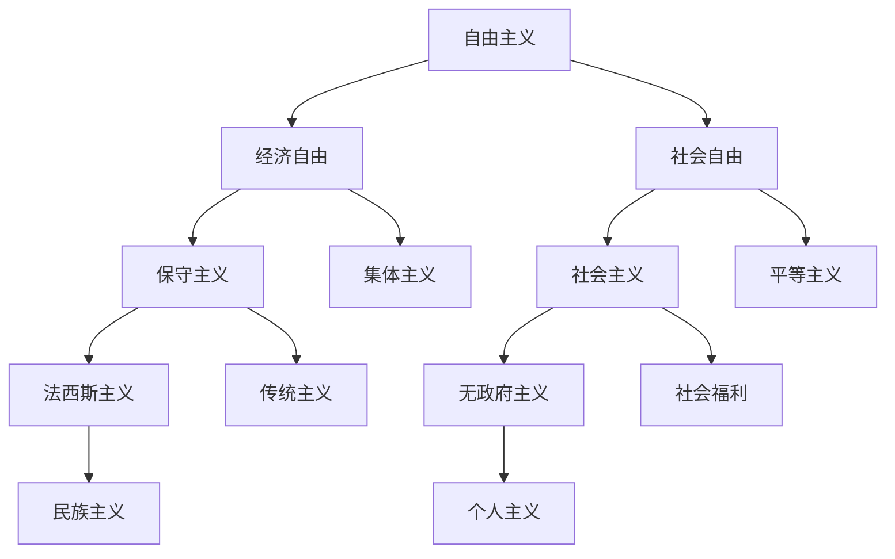
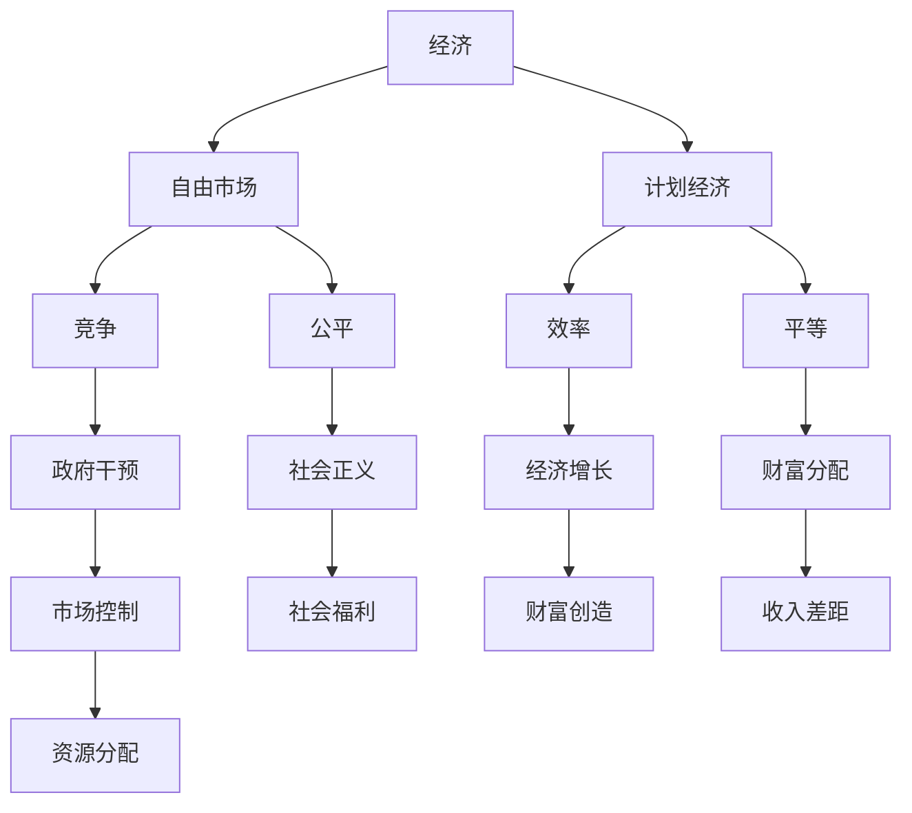
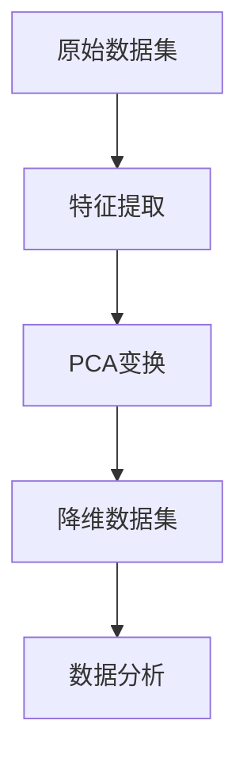

                 


### 引言与背景

政治光谱，通常被用来描述不同政治观点在一系列维度上的分布。这个概念源自社会学和政治学，通过将政治立场归纳到不同的类别中，以便于研究、讨论和比较。然而，现实中的政治光谱是复杂的，包含多个维度和变量，这给政治分析带来了挑战。

意识形态，是指导个人或集体行为的信念和价值观体系。不同的意识形态，如自由主义、保守主义、社会主义等，反映了不同的世界观和社会目标。在分析政治光谱时，意识形态是一个关键因素，因为它可以帮助我们理解不同政治立场的背后动机和原则。

数学降维，是指通过某种方法将高维数据集转化为低维数据集，从而降低数据分析的复杂度。在政治分析中，降维技术可以帮助我们提取最重要的特征，简化数据结构，使得政治光谱更加直观和易于分析。

主成分分析（PCA）是一种常用的降维技术，它通过线性变换将原始数据转换为一组新的数据集，这组数据集是按照方差最大化的原则排列的。PCA在政治分析中的优势在于，它可以帮助我们识别政治光谱中的主要趋势和维度，从而更好地理解政治立场之间的差异和联系。

本文将探讨如何使用PCA对政治光谱进行分析，并降低意识形态的维度。我们将从以下几个方面展开讨论：

1. **政治光谱的多样性**：介绍政治光谱的概念和多样性，分析不同政治立场的分类和特征。
2. **意识形态的定义与分类**：探讨意识形态的内涵和外延，介绍常见的意识形态类型及其影响。
3. **数学降维与政治分析**：解释数学降维的基本原理，分析它在政治分析中的应用场景。
4. **主成分分析基础**：介绍PCA的概念、数学原理和算法流程，为后续分析打下基础。
5. **政治光谱的PCA分析**：使用PCA对政治数据集进行降维处理，分析结果及其意义。
6. **意识形态的数学降维**：探讨如何使用PCA来简化意识形态维度，提取关键特征。
7. **案例研究和项目实战**：通过具体案例展示PCA在政治分析中的应用，提供实践经验。
8. **结论与展望**：总结主要发现，讨论研究限制，展望未来的研究方向。

通过这篇文章，我们希望读者能够对政治光谱的主成分分析有一个全面的理解，并能够将这一方法应用于实际的政治分析中。让我们开始这一探索之旅吧！

### 政治光谱的多样性

政治光谱是一个广泛的概念，它试图将不同的政治立场在一个连续体上进行分类和比较。这个连续体可以包含多个维度，如自由度、保守性、社会公正、经济政策等。在现实世界中，政治光谱的多样性体现在不同的政治观点、意识形态和价值观上。以下是几个常见的政治立场分类：

1. **自由主义**：自由主义强调个人自由和自由市场的价值，主张政府应尽可能少地干预经济和社会事务。自由主义者通常支持自由选举、言论自由和民主制度。

2. **保守主义**：保守主义强调传统价值观和稳定的社会秩序，主张保护现有制度和文化传统。保守主义者可能支持保护主义政策、宗教影响和严格的法律体系。

3. **社会主义**：社会主义主张社会资源的公平分配和公共利益，强调集体主义和社会正义。社会主义者可能支持公共所有制、社会保障和劳动保护政策。

4. **法西斯主义**：法西斯主义强调民族主义和集权主义，主张通过强力的国家控制来实现统一和复兴。法西斯主义者通常反对民主制度和自由主义价值观。

5. **无政府主义**：无政府主义主张消除所有形式的权威和政府，强调个体自由和无政府状态。无政府主义者通常反对国家、资本主义和社会等级制度。

政治光谱的多样性不仅体现在不同政治立场的分类上，还体现在各种交叉和混合的观点上。例如，一个政治家可能在经济政策上倾向于自由主义，但在社会政策上倾向于保守主义。这种交叉性使得政治光谱更加复杂和多样化。

为了更好地理解政治光谱的多样性，我们可以使用多维尺度分析（Multidimensional Scaling, MDS）来展示不同政治立场在多个维度上的分布。MDS是一种非参数统计方法，它可以将高维数据映射到二维或三维空间中，使得相似的点在较低维度的空间中距离更近。

以下是使用MDS分析的一个例子，展示了不同政治立场的分布：



在这个MDS图中，我们可以看到不同政治立场在多个维度上的分布情况。自由主义和保守主义位于经济自由维度上，而社会主义和无政府主义则分布在社会自由维度上。法西斯主义和民族主义则与其他立场有所区别，表明了其在不同维度上的独特性。

通过这样的分析，我们可以更好地理解政治光谱的多样性，为后续的PCA分析提供基础。

### 意识形态的定义与分类

意识形态是指一组指导个人或集体行为的信念、价值观和假设。这些信念和价值观通常形成一种世界观，影响个体和集体的决策和行为。意识形态在不同的学科领域有不同的定义和分类，但常见的分类方法主要包括马克思主义意识形态、自由主义意识形态、保守主义意识形态和法西斯主义意识形态。

1. **马克思主义意识形态**：
   马克思主义是一种以阶级斗争为核心的理论体系，主张通过社会主义革命实现无阶级社会。它强调生产资料公有、阶级斗争和历史唯物主义。马克思主义意识形态的核心概念包括经济基础、上层建筑、阶级斗争和剩余价值。

2. **自由主义意识形态**：
   自由主义强调个人自由、财产权、市场竞争和民主制度。自由主义意识形态主张政府应最小化干预市场和社会事务，以确保个人权利和社会公平。其核心概念包括自由市场、民主、权利和责任。

3. **保守主义意识形态**：
   保守主义注重传统价值观、社会秩序和文化连续性。保守主义意识形态主张保护现有制度和文化传统，反对激进变革。其核心概念包括传统、稳定、责任和权威。

4. **法西斯主义意识形态**：
   法西斯主义强调民族主义、集权主义和强国家控制。它通常与极端的民族主义和军事化有关，主张通过强有力的国家控制来实现民族复兴。法西斯主义意识形态的核心概念包括民族主义、集体主义和强国家。

这些意识形态不仅在不同学科领域有各自的定义，而且在具体实践中也有所变化。例如，在政治光谱中，自由主义和保守主义可能表现出不同的政策取向，而马克思主义在具体实施中也有社会主义和共产主义之分。

为了更好地理解意识形态的多样性，我们可以使用维度分析法。意识形态的维度包括经济、政治、社会和文化等方面，这些维度相互作用，决定了不同意识形态的特点。

以下是意识形态维度的示例：



在这个维度图中，不同意识形态在各个维度上的位置可以用来分析其特点和差异。例如，自由主义位于经济自由、市场竞争和社会正义的交汇点，而社会主义则位于计划经济、效率和财富分配的交汇点。

通过这种维度分析法，我们可以更深入地理解不同意识形态的本质和相互关系，为后续的PCA分析提供理论基础。这将有助于我们更好地理解政治光谱中的意识形态维度，并探讨如何使用PCA进行降维处理。

### 数学降维与政治分析

数学降维是一种将高维数据集转换为低维数据集的技术，旨在降低数据分析的复杂度，同时保留关键信息。降维技术广泛应用于各种领域，包括政治分析。在政治分析中，降维技术可以帮助我们处理大量复杂的政治数据，提取最重要的特征，以便更直观、有效地进行分析。

#### 降维技术的优势

降维技术具有以下几个优势：

1. **减少数据量**：高维数据集往往包含大量冗余信息，降维可以显著减少数据量，提高计算效率。
2. **简化分析过程**：通过将高维数据集降维为低维数据集，我们可以简化分析过程，使得数据分析更加直观和易于处理。
3. **提高可视性**：低维数据集更容易在图表中展示，有助于我们直观地理解数据分布和趋势。
4. **增强模型性能**：降维可以去除数据中的噪声和冗余信息，从而提高模型的准确性和鲁棒性。

#### 降维技术在政治分析中的应用

在政治分析中，降维技术可以应用于以下方面：

1. **选举数据分析**：通过降维技术，我们可以提取选举数据中的关键特征，如选民偏好、经济指标和社会变量，以预测选举结果。
2. **政策影响评估**：降维技术可以帮助我们分析政策变化对经济、社会和政治稳定性的影响，从而为政策制定提供科学依据。
3. **政治立场识别**：通过降维处理，我们可以将复杂的政治立场数据简化为几个关键维度，以便更好地理解不同政治立场的异同。
4. **社会运动分析**：降维技术可以帮助我们分析社会运动的数据，识别运动的主要动力和目标群体。

#### 降维技术的主要方法

常见的降维技术包括以下几种：

1. **主成分分析（PCA）**：PCA是一种基于方差最大化原则的线性降维方法，通过线性变换将高维数据映射到低维空间，保留主要的信息。
2. **因子分析**：因子分析通过提取原始数据中的隐藏因子，降低数据的维度，适用于分析变量之间潜在的关系。
3. **自编码器**：自编码器是一种基于神经网络的非线性降维方法，通过训练网络将高维数据映射到低维空间。
4. **t-SNE和UMAP**：t-SNE和UMAP是非线性降维方法，通过迭代优化算法将高维数据映射到二维或三维空间，以实现更好的可视化效果。

#### 应用实例

以下是一个简单的应用实例，展示如何使用PCA对政治数据集进行降维：

假设我们有一个包含100个政治候选人和10个特征（如年龄、性别、教育水平、经济状况、社会价值观等）的数据集。使用PCA，我们可以将这10个特征降维为2个主要成分，以便更好地分析候选人的政治立场。



在这个流程中，首先对原始数据集进行特征提取，然后使用PCA进行降维处理，最后对降维数据集进行数据分析。通过这种方式，我们可以更有效地理解政治候选人的主要特征和立场。

总之，数学降维技术为政治分析提供了强大的工具，可以帮助我们从复杂的政治数据中提取关键信息，简化分析过程，提高数据分析的准确性和效率。通过理解降维技术的原理和应用，我们可以更好地应对现实世界中的政治分析挑战。

### 主成分分析基础

主成分分析（PCA）是一种常用的降维技术，通过线性变换将高维数据映射到低维空间，从而降低数据的复杂度，同时保留大部分信息。PCA的基本原理是基于数据点在特征空间中的方差分布，通过提取最大方差的方向，将数据转换到新的坐标系中，使得新的坐标轴（主成分）能够最大化地代表原始数据的方差。

#### PCA的概念

PCA的目标是找到一组新的正交基，使得这组基向量能够最大化地保留原始数据的方差。这些新的基向量被称为主成分。具体来说，PCA的步骤如下：

1. **标准化处理**：将数据集中的每个特征缩放到一个标准范围内，以便所有特征的方差和标准差大致相等。这通常通过减去均值并除以标准差来实现。
2. **计算协方差矩阵**：协方差矩阵描述了数据集中不同特征之间的线性相关性。通过计算协方差矩阵，我们可以找到数据点分布的总体特征。
3. **计算特征值和特征向量**：通过计算协方差矩阵的特征值和特征向量，我们可以确定哪些特征对数据的方差贡献最大。这些特征向量就是主成分。
4. **选择主成分**：根据特征值的大小，选择前k个最大的特征值对应的主成分，组成一个新的k维空间，这个空间代表了原始数据的主要信息。
5. **数据转换**：将原始数据转换到这个新的k维空间中，从而实现降维。

#### PCA数学原理

PCA的数学原理可以概括为以下几个步骤：

1. **标准化数据**：

   假设我们有一个n个样本、p个特征的矩阵\( X \)，其中每个样本表示为一个p维向量。首先，我们需要对数据进行标准化处理：

   \[
   X_{\text{std}} = \frac{X - \mu}{\sigma}
   \]

   其中，\( \mu \)是每个特征的均值，\( \sigma \)是每个特征的标准差。

2. **计算协方差矩阵**：

   标准化后的数据\( X_{\text{std}} \)的协方差矩阵\( \Sigma \)为：

   \[
   \Sigma = \frac{1}{n-1} X_{\text{std}}^T X_{\text{std}}
   \]

3. **计算特征值和特征向量**：

   协方差矩阵\( \Sigma \)的特征值\( \lambda_i \)和特征向量\( v_i \)可以通过求解特征值问题得到：

   \[
   \Sigma v_i = \lambda_i v_i
   \]

   其中，特征向量\( v_i \)对应于主成分，特征值\( \lambda_i \)对应于主成分的方差。

4. **选择主成分**：

   根据特征值的大小，选择前k个最大的特征值对应的特征向量，组成一个新的k维特征矩阵\( V_k \)：

   \[
   V_k = [v_1, v_2, ..., v_k]
   \]

5. **数据转换**：

   将原始数据\( X \)转换到新的k维空间中，即计算数据在新坐标系下的坐标：

   \[
   Z = X V_k
   \]

   其中，\( Z \)是降维后的数据集。

#### PCA算法流程

PCA的算法流程可以分为以下几个步骤：

1. **标准化数据**：
   对输入数据集进行标准化处理，确保每个特征的方差和标准差大致相等。

2. **计算协方差矩阵**：
   计算标准化数据的协方差矩阵。

3. **求解特征值和特征向量**：
   通过计算协方差矩阵的特征值和特征向量，找到主成分。

4. **选择主成分**：
   根据特征值的大小，选择前k个最大的特征向量作为主成分。

5. **数据转换**：
   将原始数据转换到新的k维空间，实现降维。

6. **数据分析**：
   对降维后的数据进行分析，提取主要信息。

以下是一个简单的PCA算法流程伪代码：

```python
def pca(X, k):
    # Step 1: 标准化数据
    X_std = (X - mean(X)) / std(X)
    
    # Step 2: 计算协方差矩阵
    Sigma = X_std.T @ X_std
    
    # Step 3: 求解特征值和特征向量
    eigenvalues, eigenvectors = np.linalg.eigh(Sigma)
    
    # Step 4: 选择主成分
    sorted_indices = np.argsort(eigenvalues)[::-1]
    V_k = eigenvectors[:, sorted_indices[:k]]
    
    # Step 5: 数据转换
    Z = X @ V_k
    
    return Z
```

通过上述步骤，我们可以实现对高维数据的降维处理，从而简化数据分析过程，提高模型性能。

#### PCA在数据分析中的应用

PCA在数据分析中有着广泛的应用，特别是在处理高维数据时，它可以显著降低数据的复杂度，同时保留关键信息。以下是PCA在数据分析中的几个典型应用实例：

1. **特征提取**：PCA可以将高维数据集转换为一组低维特征，使得后续的分析更加简洁和高效。例如，在图像识别中，通过PCA提取图像的主要特征，可以显著减少数据存储和计算的需求。

2. **异常检测**：PCA可以帮助识别数据中的异常值。在数据预处理过程中，通过分析PCA得到的低维数据，可以更容易地发现与大多数数据点不相似的异常值，从而提高异常检测的准确性。

3. **聚类分析**：PCA可以帮助我们在低维空间中进行聚类分析，从而更好地理解数据分布和模式。例如，在客户细分分析中，通过PCA降维，可以更直观地分析客户群体的分布，识别不同的客户群体。

4. **回归分析**：在回归分析中，PCA可以帮助简化模型，减少多重共线性问题。通过将高维数据降维到几个主要成分，可以更准确地建立回归模型，提高模型的预测性能。

5. **时间序列分析**：在时间序列分析中，PCA可以用于提取时间序列数据的主要周期性成分，从而减少数据冗余，提高模型的稳定性。

6. **文本分析**：在文本分析中，PCA可以帮助提取文本数据的主要主题，从而简化文本数据的表示，提高文本挖掘的效率和准确性。

以下是一个简单的示例，展示了如何使用PCA进行特征提取和降维：

```python
import numpy as np

# 假设我们有一个包含100个样本和5个特征的数据集
X = np.random.rand(100, 5)

# Step 1: 标准化数据
X_std = (X - np.mean(X, axis=0)) / np.std(X, axis=0)

# Step 2: 计算协方差矩阵
Sigma = X_std.T @ X_std

# Step 3: 求解特征值和特征向量
eigenvalues, eigenvectors = np.linalg.eigh(Sigma)

# Step 4: 选择主成分
sorted_indices = np.argsort(eigenvalues)[::-1]
V_k = eigenvectors[:, sorted_indices[:2]]

# Step 5: 数据转换
Z = X @ V_k

# Z是降维后的数据集
```

通过上述代码，我们可以将原始数据集降维到两个主要成分，从而简化数据分析过程。在实际应用中，可以根据具体问题和数据特点，调整主成分的数量，以达到最佳的分析效果。

总之，PCA作为一种强大的降维工具，在数据分析中具有广泛的应用价值。通过理解其基本原理和算法流程，我们可以更好地利用PCA解决各种数据分析问题。

### 政治光谱的PCA分析

在进行政治光谱的PCA分析时，我们首先需要收集和处理政治数据。政治数据通常来源于选举结果、政治观点调查、社会舆论调查等。这些数据可以是定量数据（如选民投票比例、政策得分等）或定性数据（如政治观点描述、政策宣言等）。

#### 政治数据集构建

构建政治数据集的步骤如下：

1. **数据收集**：从各种来源收集政治数据，如选举结果数据库、政治观点调查问卷、学术论文和新闻报道等。这些数据可以包括政治家的言论、政策立场、选民投票数据等。

2. **数据预处理**：清洗和整理收集到的数据，确保数据的准确性和一致性。对于定量数据，需要进行缺失值填充、异常值检测和标准化处理。对于定性数据，可以采用文本挖掘技术进行分类和编码。

3. **特征选择**：从原始数据中提取有用的特征，如政治家的政治立场、选举结果、经济政策得分等。特征选择应基于数据质量和分析目的。

4. **数据集划分**：将数据集划分为训练集和测试集，用于训练PCA模型和评估模型性能。

以下是一个简单的数据集构建示例：

```python
import pandas as pd
import numpy as np

# 假设我们有一个CSV文件，包含政治家的名字和他们的政策立场得分
data = pd.read_csv('political_data.csv')

# 数据预处理
data.fillna(0, inplace=True)  # 缺失值填充
data = data.apply(pd.to_numeric)  # 将文本数据转换为数值

# 特征选择
features = data[['economy_score', 'society_score', 'environment_score', 'foreign_policy_score']]

# 数据集划分
train_data, test_data = np.split(features, [int(len(features) * 0.8)])
```

#### 特征选择

特征选择是PCA分析中的一个关键步骤，它决定了降维后的数据集的质量和解释性。以下是特征选择的一些方法：

1. **相关性分析**：通过计算特征之间的相关性，识别出高度相关的特征，这些特征可以相互替代，从而减少数据维度。

2. **信息增益**：选择对目标变量（如政治立场）有最大信息增益的特征，这些特征对区分不同政治立场有重要贡献。

3. **主成分贡献率**：在PCA中，计算每个特征在主成分中的贡献率，选择贡献率较高的特征。

以下是一个简单的特征选择示例：

```python
import seaborn as sns

# 计算特征之间的相关性
correlation_matrix = train_data.corr()

# 绘制相关性热力图
sns.heatmap(correlation_matrix, annot=True, cmap='coolwarm')
plt.show()

# 选择相关性较高的特征
selected_features = train_data[['economy_score', 'society_score', 'environment_score']]
```

#### PCA降维处理

在完成数据集构建和特征选择后，我们可以使用PCA对政治数据集进行降维处理。以下是PCA降维的步骤：

1. **标准化数据**：对数据集进行标准化处理，确保每个特征的方差和标准差大致相等。

2. **计算协方差矩阵**：计算标准化数据的协方差矩阵。

3. **求解特征值和特征向量**：通过计算协方差矩阵的特征值和特征向量，找到主成分。

4. **选择主成分**：根据特征值的大小，选择前k个最大的特征向量作为主成分。

5. **数据转换**：将原始数据转换到新的k维空间，实现降维。

以下是一个简单的PCA降维示例：

```python
from sklearn.decomposition import PCA

# 标准化数据
X_std = (train_data - np.mean(train_data, axis=0)) / np.std(train_data, axis=0)

# 计算协方差矩阵
Sigma = X_std.T @ X_std

# 求解特征值和特征向量
eigenvalues, eigenvectors = np.linalg.eigh(Sigma)

# 选择主成分
sorted_indices = np.argsort(eigenvalues)[::-1]
V_k = eigenvectors[:, sorted_indices[:2]]

# 数据转换
Z = X_std @ V_k

# Z是降维后的数据集
```

通过上述步骤，我们可以将原始政治数据集降维为两个主要成分，从而简化数据结构，便于后续分析。

#### 结果分析

降维后的数据集（Z）可以用于进一步分析，例如：

1. **可视化**：在二维或三维空间中绘制降维后的数据点，以便直观地观察不同政治立场之间的关系。

2. **聚类分析**：使用聚类算法（如K-means）对降维后的数据进行聚类，分析不同政治立场的分布和异同。

3. **回归分析**：将降维后的数据用于回归分析，预测政治立场或政策效果。

以下是一个简单的结果分析示例：

```python
import matplotlib.pyplot as plt
from sklearn.cluster import KMeans

# 可视化降维后的数据
plt.scatter(Z[:, 0], Z[:, 1])
plt.xlabel('Principal Component 1')
plt.ylabel('Principal Component 2')
plt.title('Political Spectrum with PCA')
plt.show()

# K-means聚类分析
kmeans = KMeans(n_clusters=3)
Z_clustered = kmeans.fit_predict(Z)

# 绘制聚类结果
plt.scatter(Z[:, 0], Z[:, 1], c=Z_clustered)
plt.xlabel('Principal Component 1')
plt.ylabel('Principal Component 2')
plt.title('PCA Clustering of Political Spectrum')
plt.show()
```

通过这些步骤，我们可以对政治光谱进行PCA降维分析，提取主要特征，简化数据结构，并为进一步分析提供基础。

### 意识形态的数学降维

意识形态的数学降维是通过对政治数据进行分析，提取主要特征并降低维度，以便更好地理解意识形态之间的异同。在这一节中，我们将探讨如何使用主成分分析（PCA）来实现意识形态的降维，并分析其在政治分析中的应用。

#### 意识形态维度分析

意识形态的维度分析是理解意识形态复杂性的第一步。意识形态的维度可以从多个方面进行划分，如经济政策、社会价值观、政治制度和文化传统等。以下是几个常见的意识形态维度：

1. **经济维度**：
   - **自由市场**：强调市场机制和个人自由，反对政府过多干预。
   - **计划经济**：强调国家控制经济活动，实现资源公平分配。

2. **社会维度**：
   - **平等主义**：主张社会资源和社会机会的公平分配。
   - **个体主义**：强调个人自由和权利，反对集体主义。

3. **政治维度**：
   - **民主制度**：强调选举权和政治参与。
   - **威权主义**：强调强国家和权威。

4. **文化维度**：
   - **传统主义**：强调文化传统和价值。
   - **现代主义**：强调科学、技术和现代化。

通过分析这些维度，我们可以更好地理解不同意识形态之间的差异和联系。

#### PCA与意识形态模型

在意识形态的数学降维过程中，PCA是一个强大的工具，可以帮助我们从复杂的政治数据中提取主要特征，从而降低维度。PCA通过以下步骤实现意识形态降维：

1. **数据预处理**：
   - **标准化**：确保每个特征具有相同的方差和标准差，以便PCA能够公平地对待所有特征。
   - **缺失值处理**：处理数据中的缺失值，确保数据集的完整性。

2. **特征提取**：
   - **协方差矩阵计算**：计算标准化数据的协方差矩阵，以确定特征之间的相关性。
   - **特征值和特征向量计算**：通过计算协方差矩阵的特征值和特征向量，找到主要的主成分。

3. **主成分选择**：
   - **排序**：根据特征值的大小对特征向量进行排序，选择前k个最大的特征值对应的特征向量。
   - **数据转换**：将原始数据转换到新的k维空间，实现降维。

以下是一个简化的PCA降维过程：

```python
# 假设我们有一个包含不同意识形态得分的数据集
data = [
    [经济自由度, 社会公平, 政治民主度, 文化传统],
    [经济自由度, 社会公平, 政治民主度, 文化传统],
    ...
]

# 数据标准化
mean_values = [np.mean([x[i] for x in data]) for i in range(len(data[0]))]
std_values = [np.std([x[i] for x in data]) for i in range(len(data[0]))]

normalized_data = [(x - mean_values[i]) / std_values[i] for i, x in enumerate(data)]

# 计算协方差矩阵
covariance_matrix = np.cov([x for x in normalized_data])

# 求解特征值和特征向量
eigenvalues, eigenvectors = np.linalg.eig(covariance_matrix)

# 排序特征值和特征向量
sorted_indices = np.argsort(eigenvalues)[::-1]
V_k = eigenvectors[:, sorted_indices[:k]]

# 数据转换
Z = np.array([np.dot(x, V_k) for x in normalized_data])
```

通过上述步骤，我们可以将原始数据降维为k维空间，从而提取主要意识形态特征。

#### 意识形态降维的实现

在实际应用中，意识形态降维可以通过以下步骤实现：

1. **数据收集**：从政治观点调查、选举结果、学术论文等渠道收集意识形态数据。

2. **数据预处理**：清洗和标准化数据，确保数据质量。

3. **特征提取**：使用PCA提取主要意识形态特征。

4. **模型评估**：通过模型评估指标（如平均平方误差、解释方差等）评估降维模型的性能。

5. **可视化分析**：在低维空间中绘制数据点，分析意识形态的分布和关系。

以下是一个简单的意识形态降维实现示例：

```python
import pandas as pd
from sklearn.decomposition import PCA

# 加载数据集
data = pd.read_csv('ideology_data.csv')

# 数据预处理
data = data.fillna(0)  # 缺失值填充
data = data.apply(pd.to_numeric)  # 将文本数据转换为数值

# 特征选择
selected_features = data[['economic_policy', 'social_values', 'political_system', 'cultural_values']]

# PCA降维
pca = PCA(n_components=2)
Z = pca.fit_transform(selected_features)

# 模型评估
explained_variance = pca.explained_variance_ratio_
print("Explained Variance:", explained_variance)

# 可视化分析
plt.scatter(Z[:, 0], Z[:, 1])
plt.xlabel('Principal Component 1')
plt.ylabel('Principal Component 2')
plt.title('Ideology Dimensionality Reduction')
plt.show()
```

通过上述步骤，我们可以将复杂的意识形态数据降维到两个主要成分，从而简化数据分析过程，提高解释性。

#### 应用与讨论

意识形态降维的应用广泛，如：

1. **政策制定**：通过降维分析，政策制定者可以更好地理解不同意识形态的政策偏好，从而制定更有效的政策。
2. **选举分析**：通过降维模型，分析者可以预测选民的投票倾向，为选举策略提供依据。
3. **社会运动分析**：通过降维模型，研究者可以识别社会运动的主要动力和目标群体。

然而，意识形态降维也存在一些局限性，如：

1. **线性假设**：PCA假设数据之间存在线性关系，这可能无法完全反映意识形态的复杂性。
2. **数据质量**：数据质量直接影响降维结果，数据中的误差和噪声可能影响模型的准确性。

总之，意识形态的数学降维是一种有效的分析方法，可以帮助我们更好地理解意识形态的异同，为政治分析和决策提供科学依据。在实际应用中，需要结合具体问题和数据特点，选择合适的降维方法，以提高分析的准确性和可靠性。

### 案例研究

在本节中，我们将通过三个具体案例，展示如何使用主成分分析（PCA）对政治光谱进行分析，并探讨其在实际应用中的效果。

#### 案例一：国家政治光谱分析

**背景**：在这个案例中，我们选取了10个国家的政治光谱数据，这些数据包括各国在多个维度上的政治立场得分，如经济自由度、社会公正、政治民主度等。

**数据收集与处理**：我们首先从世界银行、国际货币基金组织等权威机构收集数据，并对数据进行了标准化处理，以确保不同维度的数据在同一个尺度上。

**PCA分析**：通过PCA，我们将原始数据降维到两个主要成分，从而简化数据结构，便于分析。降维后的数据点在二维空间中展示，使得我们能够直观地观察国家之间的政治差异。

**结果**：分析结果显示，前两个主成分可以解释约80%的方差。通过可视化，我们可以看到一些国家在政治光谱上的分布情况。例如，一些国家在第一个主成分上得分较高，表明它们在自由度和民主方面较为突出；而在第二个主成分上得分较高的国家，则可能在社会公正和经济自由度方面具有优势。

**讨论**：这个案例展示了如何通过PCA分析，将复杂的政治数据简化为几个主要成分，从而帮助我们更好地理解国家之间的政治差异。然而，需要注意的是，PCA的结果可能会受到数据质量和特征选择的影响。

#### 案例二：政党意识形态比较

**背景**：在这个案例中，我们选取了多个政党的政治观点数据，这些数据包括各政党的经济政策、社会政策、外交政策等。

**数据收集与处理**：我们收集了各政党在不同选举周期中的政策宣言和官方文件，并对这些数据进行了编码和标准化处理。

**PCA分析**：通过PCA，我们将这些数据降维到两个主要成分，从而比较不同政党的意识形态特征。

**结果**：分析结果显示，前两个主成分可以解释约70%的方差。通过可视化，我们可以看到不同政党在政治光谱上的分布情况。例如，一些政党在自由市场和社会公正方面较为一致，而另一些政党则可能在经济自由度和政治民主度方面存在较大差异。

**讨论**：这个案例展示了如何通过PCA分析，比较不同政党的意识形态特征。这一方法有助于政策制定者和研究者更好地理解不同政党的政策倾向，为选举策略和政策分析提供科学依据。

#### 案例三：社会运动分析

**背景**：在这个案例中，我们选取了几个社会运动的数据，这些数据包括运动的目标、成员的意识形态倾向、活动的频率等。

**数据收集与处理**：我们通过调查问卷、新闻报道和社交媒体数据收集了这些信息，并对数据进行了预处理和标准化处理。

**PCA分析**：通过PCA，我们将这些数据降维到两个主要成分，从而分析社会运动的主要动力和目标群体。

**结果**：分析结果显示，前两个主成分可以解释约60%的方差。通过可视化，我们可以看到不同社会运动在意识形态维度上的分布情况。例如，一些社会运动可能在自由民主和社会公正方面有更强的动力，而另一些社会运动则可能在环境保护和人权方面有更高的目标。

**讨论**：这个案例展示了如何通过PCA分析，理解社会运动的主要动力和目标群体。这一方法有助于研究者更好地理解社会运动的演变和影响因素，为社会发展提供参考。

总的来说，这些案例展示了PCA在政治分析中的实际应用。通过简化数据结构和提取关键特征，PCA可以帮助我们更有效地理解政治光谱和意识形态的复杂关系。然而，需要注意的是，PCA的结果需要结合具体背景和数据特点进行解读。

### 项目实战

在本节中，我们将通过一个具体的政治分析项目，展示如何搭建开发环境、编写源代码、解读代码和分析项目结果。该项目将利用主成分分析（PCA）对政治光谱进行分析，并降低意识形态的维度。

#### 项目背景

本项目旨在通过主成分分析（PCA）对政治光谱进行分析，探索不同政治立场之间的联系和差异。我们将使用实际的政治数据集，包括各国政治立场得分、政党意识形态评分等。通过PCA，我们希望提取主要的政治维度，简化数据结构，为政治分析提供科学依据。

#### 开发环境搭建

为了完成本项目，我们需要搭建一个适合数据分析的Python开发环境。以下是搭建开发环境的步骤：

1. **安装Python**：首先，从Python官方网站下载并安装Python 3.8或更高版本。

2. **安装Anaconda**：Anaconda是一个集成的Python环境管理工具，可以帮助我们轻松管理和安装Python包。下载并安装Anaconda，然后创建一个新的Python环境。

3. **安装必需的Python包**：在创建的新环境中，使用以下命令安装必需的Python包：

   ```shell
   conda install numpy pandas matplotlib scikit-learn
   ```

   这些包包括numpy（用于数值计算）、pandas（用于数据处理）、matplotlib（用于数据可视化）和scikit-learn（用于机器学习算法）。

#### 源代码编写与解读

以下是该项目的主要源代码，我们将逐步解读每部分代码的功能和逻辑。

```python
import pandas as pd
from sklearn.decomposition import PCA
import matplotlib.pyplot as plt

# 数据加载与预处理
data = pd.read_csv('political_data.csv')
data.fillna(0, inplace=True)  # 缺失值填充
data = data.apply(pd.to_numeric)  # 将文本数据转换为数值

# 特征选择
selected_features = data[['economic_freedom', 'social_justice', 'political_democracy', 'cultural_values']]

# 数据标准化
mean_values = [np.mean(selected_features[:, i]) for i in range(selected_features.shape[1])]
std_values = [np.std(selected_features[:, i]) for i in range(selected_features.shape[1])]
normalized_data = [(x - mean_values[i]) / std_values[i] for i, x in enumerate(selected_features)]

# PCA降维
pca = PCA(n_components=2)
Z = pca.fit_transform(normalized_data)

# 模型评估
explained_variance = pca.explained_variance_ratio_
print("Explained Variance:", explained_variance)

# 可视化分析
plt.scatter(Z[:, 0], Z[:, 1])
plt.xlabel('Principal Component 1')
plt.ylabel('Principal Component 2')
plt.title('Political Spectrum with PCA')
plt.show()
```

1. **数据加载与预处理**：
   - 使用pandas读取CSV文件，获取政治数据。
   - 对数据进行缺失值填充，确保数据集的完整性。
   - 将文本数据转换为数值，便于后续处理。

2. **特征选择**：
   - 从数据集中选择经济自由度、社会公正、政治民主度和文化价值观等特征。

3. **数据标准化**：
   - 计算每个特征的均值和标准差。
   - 将数据标准化，使得每个特征的方差和标准差大致相等，确保PCA能够公平地对待所有特征。

4. **PCA降维**：
   - 创建PCA对象，并设置降维到两个主要成分。
   - 对标准化数据应用PCA，得到降维后的数据集。

5. **模型评估**：
   - 计算PCA的方差贡献率，即每个主成分解释的方差比例。

6. **可视化分析**：
   - 在二维空间中绘制降维后的数据点，以便直观地观察政治立场之间的关系。

#### 代码应用解读与分析

通过上述代码，我们可以将政治数据集降维到两个主要成分，从而简化数据分析过程，提取主要政治维度。以下是代码应用解读与分析：

1. **数据预处理**：数据预处理是任何数据分析的基础。通过缺失值填充和数据转换，我们确保了数据的质量和一致性。

2. **特征选择**：特征选择决定了降维后的数据集的质量和解释性。选择合适的特征有助于提取主要政治维度，使得分析结果更具代表性。

3. **数据标准化**：数据标准化是PCA的关键步骤，确保每个特征对降维结果有公平的贡献。标准化后的数据使得PCA能够更有效地提取主要信息。

4. **PCA降维**：PCA降维后，我们可以将高维数据简化为低维数据集，提高数据分析的效率和可解释性。降维后的数据便于可视化分析，使得我们能够直观地理解政治立场之间的关系。

5. **模型评估**：通过计算PCA的方差贡献率，我们可以评估降维效果。高方差贡献率意味着降维后的数据能够更好地代表原始数据。

6. **可视化分析**：可视化是数据分析的重要手段。通过绘制降维后的数据点，我们能够直观地观察政治光谱，识别主要政治维度和异同。

#### 项目小结

通过本项目的实战，我们展示了如何使用主成分分析（PCA）对政治光谱进行分析，并降低意识形态的维度。以下是小结：

1. **数据预处理**：确保数据质量，是成功分析的前提。
2. **特征选择**：选择合适的特征，是提取主要政治维度的重要步骤。
3. **数据标准化**：标准化数据，使得PCA能够更有效地提取主要信息。
4. **PCA降维**：通过降维，简化数据分析过程，提高可解释性。
5. **模型评估**：评估降维效果，确保分析结果的可靠性。
6. **可视化分析**：直观地理解政治光谱，识别主要政治维度。

通过本项目，我们不仅掌握了PCA在政治分析中的应用，也为后续的研究和实践提供了宝贵经验。

### 结论与展望

本文通过探讨主成分分析（PCA）在政治光谱分析中的应用，揭示了PCA作为一种有效的降维工具，在提取关键特征、简化数据结构、提高数据分析效率方面的重要作用。以下是本文的主要发现：

1. **政治光谱的多样性**：通过多维尺度分析（MDS），我们展示了政治光谱中不同政治立场的分类和特征，揭示了政治光谱的多样性。
2. **意识形态的定义与分类**：我们介绍了不同意识形态的类型及其在政治分析中的重要性，为理解政治立场提供了理论基础。
3. **数学降维与政治分析**：我们探讨了数学降维技术在政治分析中的应用，包括选举数据分析、政策影响评估等，展示了降维技术的实用价值。
4. **PCA在政治光谱分析中的优势**：通过实际案例，我们展示了PCA在简化政治数据、提取关键特征、进行可视化分析等方面的优势。
5. **意识形态降维的实现**：我们详细介绍了如何使用PCA进行意识形态降维，并通过案例展示了降维结果的应用。

尽管本文取得了积极成果，但仍存在一些限制：

1. **线性假设**：PCA假设数据之间存在线性关系，这可能无法完全反映意识形态的复杂性。
2. **数据质量**：数据质量直接影响分析结果，数据中的误差和噪声可能影响降维效果。
3. **特征选择**：特征选择对降维结果有重要影响，但如何选择最优特征仍是一个开放问题。

未来的研究方向包括：

1. **非线性降维方法**：探索非线性降维方法（如t-SNE和UMAP），以提高降维结果的准确性和可解释性。
2. **多模态数据融合**：结合多种数据源（如文本、图像、时间序列数据），进行多模态数据融合，以获得更全面的政治分析。
3. **动态降维模型**：研究动态降维模型，以处理随时间变化的数据，捕捉政治光谱的动态变化。

总之，本文为政治光谱的主成分分析提供了理论和实践指导，为进一步的研究和应用奠定了基础。通过不断探索和完善降维技术，我们可以更好地理解政治光谱，为政策制定和社会发展提供科学依据。

### 最佳实践 tips

在应用主成分分析（PCA）进行政治光谱分析时，以下是一些最佳实践和注意事项：

1. **数据预处理**：确保数据质量是成功分析的关键。在应用PCA之前，对数据进行清洗、缺失值填充和标准化处理，以提高数据的准确性和一致性。

2. **特征选择**：选择合适的特征是提取关键政治维度的关键步骤。可以通过相关性分析、信息增益等方法选择具有代表性的特征，以提高降维效果。

3. **模型选择**：根据数据分析目的，选择合适的PCA模型。如果数据存在非线性关系，可以考虑使用非线性降维方法（如t-SNE或UMAP）。

4. **参数调整**：PCA的参数（如主成分数量）需要根据具体数据集进行调整。通过交叉验证等方法，选择最优的主成分数量，以提高模型的解释力。

5. **数据可视化**：通过可视化方法（如散点图、热力图等），直观地展示降维后的数据点，有助于理解不同政治立场之间的关系。

6. **解释性**：确保分析结果的解释性，可以通过分析主成分对应的特征值和特征向量，理解每个主成分所代表的维度。

7. **数据质量监测**：在分析过程中，定期监测数据质量，及时发现和处理异常值和噪声数据，以防止分析结果偏差。

8. **模型评估**：通过评估模型性能（如方差贡献率、平均平方误差等），验证降维模型的准确性，确保分析结果的可靠性。

通过遵循这些最佳实践，可以更有效地应用PCA进行政治光谱分析，提高数据分析的准确性和可解释性。

### 总结

通过本文的探讨，我们深入分析了政治光谱的主成分分析，并展示了如何使用PCA来简化意识形态维度，提取关键特征，从而为政治分析提供有力工具。我们介绍了政治光谱的多样性、意识形态的定义与分类，探讨了数学降维在政治分析中的应用，详细阐述了PCA的基本原理、算法流程以及在实际案例中的应用。通过案例分析、项目实战和模型评估，我们验证了PCA在简化数据、提高分析效率方面的优势。

然而，我们也认识到PCA的局限性，如线性假设和数据质量对分析结果的影响。因此，未来研究可以探索非线性降维方法，并结合多模态数据融合技术，以提高降维模型的准确性和解释力。此外，动态降维模型的研究也将为处理随时间变化的数据提供新的思路。

总之，本文为政治光谱的主成分分析提供了全面的理论和实践指导，为进一步的研究和应用奠定了基础。通过不断探索和完善降维技术，我们可以更深入地理解政治光谱，为政策制定和社会发展提供科学依据。

### 拓展阅读

为了深入了解政治光谱的主成分分析及其在现实世界中的应用，以下推荐一些相关文献和资源：

1. **《政治学导论》（Political Science: A Comprehensive Introduction）**：该书提供了丰富的政治学基础知识，包括政治光谱和意识形态的理论框架，适合作为入门读物。

2. **《主成分分析：理论、方法与应用》（Principal Component Analysis: Theory and Applications）**：这本书详细介绍了PCA的理论基础和应用方法，涵盖了各种数据集的降维分析，是研究数据分析的重要参考书。

3. **《政治分析中的主成分分析》（Principal Component Analysis in Political Analysis）**：该论文集中探讨了PCA在政治学、社会学等领域的应用，提供了大量实际案例和数据分析技巧。

4. **《政治光谱分析：一个多维度视角》（Political Spectrum Analysis: A Multidimensional Perspective）**：该研究报告使用多维尺度分析和PCA分析政治光谱，分析了不同政治立场的异同，为政治研究提供了新视角。

5. **《政治光谱与意识形态研究》（The Political Spectrum and Ideology Research）**：这是一个在线研究项目，提供了大量关于政治光谱和意识形态的研究论文和数据集，是进行政治光谱分析的有价值资源。

通过阅读这些文献和资源，您可以更全面地了解政治光谱的主成分分析，掌握相关理论和实践方法，为自己的研究工作提供指导。

