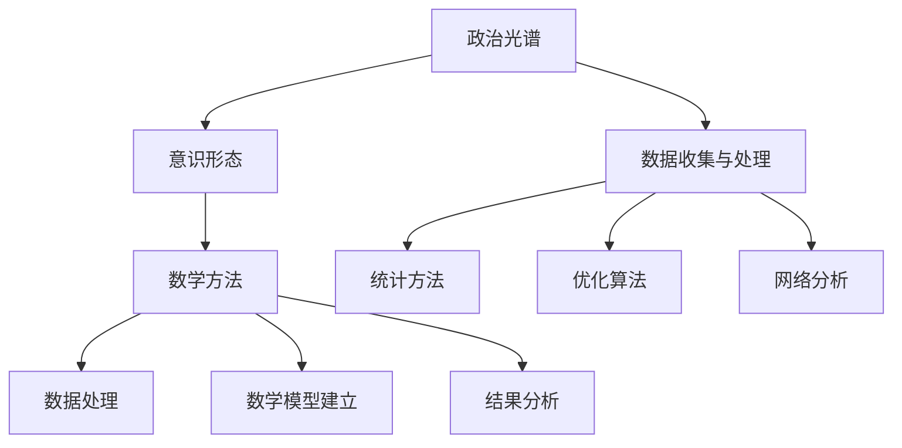

                 

### 引言

### 1.1 书籍背景与目的

在当今全球化的背景下，政治光谱的分析与理解变得越来越重要。政治光谱不仅反映了一个国家或地区内部不同政治观点的分布，还揭示了国际关系中不同意识形态的互动。因此，如何运用数学方法对政治光谱进行多维分析，从而更准确地映射意识形态，成为一个亟待解决的研究课题。

本书旨在探讨政治光谱的多维分析，并运用数学方法对意识形态进行精确映射。我们希望通过系统化的研究，提供一种新的视角来理解政治现象，为政策制定者和研究者提供有力的工具。

### 1.2 政治光谱概述

政治光谱是一种用来描述政治立场或意识形态分布的方法。通常，政治光谱以一个连续的二维坐标系为基础，横轴代表政治左翼与右翼的分布，纵轴代表保守与自由的分布。这种坐标系可以帮助我们直观地理解不同政治立场之间的关系。

政治光谱的历史可以追溯到19世纪末，当时的政治学者开始尝试用连续的曲线来表示不同政治观点的分布。随着时间的推移，政治光谱的概念不断发展，现代政治光谱分析更加注重多维度的分析，以更全面地反映政治观点的多样性。

### 1.3 意识形态的定义与分类

意识形态是指一组关于人类价值观、信仰和行为的系统性理论。它不仅涉及政治领域，还涵盖经济、社会、文化和宗教等多个方面。意识形态可以分为不同的类型，例如自由主义、保守主义、社会主义、法西斯主义等。每种意识形态都有其独特的核心观念和目标。

意识形态的分类方法多种多样，常见的有基于政治立场、文化特征、经济模式等分类方法。例如，基于政治立场的分类方法将意识形态分为左翼和右翼，而基于文化特征的分类方法则将意识形态分为西方文化和非西方文化。

### 1.4 数学在政治分析中的角色

数学作为一种精确的语言，在政治分析中扮演着重要角色。它不仅可以用于描述政治光谱的分布，还可以用于预测政治行为的演变。数学方法在政治分析中的应用包括统计方法、优化算法、网络分析等。

统计方法可以帮助我们分析政治光谱的数据分布，识别出不同政治立场之间的关联。优化算法则可以用于解决政治决策问题，如选举策略的制定。网络分析可以揭示政治群体之间的互动关系，帮助我们理解政治现象的复杂性。

### 总结

通过对政治光谱和意识形态的基本概念进行介绍，我们可以看出数学在政治分析中的重要性。在接下来的章节中，我们将深入探讨政治光谱的多维分析技术，并运用数学方法对意识形态进行精确映射。

> **关键词**：政治光谱、意识形态、数学映射、多维分析、统计方法

> **摘要**：本文介绍了政治光谱和意识形态的基本概念，探讨了数学在政治分析中的角色，并提出了多维分析技术在意识形态映射中的应用。通过系统化的研究，本文旨在提供一种新的视角来理解政治现象，为政策制定者和研究者提供有力的工具。

----------------------------------------------------------------

### 设计大纲的基本步骤

#### 1. 阅读和理解书名

首先，我们需要仔细阅读并理解书名《政治光谱的多维分析：意识形态的数学映射》。书名直接指出了本书的核心内容，即利用数学方法对政治光谱进行分析，并映射出意识形态的多维特征。这表明本书将涉及以下几个关键点：

- **政治光谱**：这是一个描述不同政治立场在二维或更高维度空间中的分布的概念。
- **多维分析**：指利用数学工具对数据进行分析，以便更全面地理解复杂系统的方法。
- **意识形态的数学映射**：将意识形态的核心特征和信念通过数学模型进行表达和量化。

#### 2. 确定书籍的核心内容

根据书名，我们可以初步确定书籍的核心内容应包括以下几个方面：

- **政治光谱的理论基础**：介绍政治光谱的概念、历史发展和不同维度的构成。
- **数学方法的应用**：探讨如何将数学工具应用于政治光谱分析，如统计方法、优化算法、网络分析等。
- **意识形态的分类与特征**：对不同意识形态进行分类，并探讨其核心特征和信念。
- **数学映射的实现**：详细讲解如何使用数学模型来映射意识形态，包括数据处理、模型建立和结果分析。
- **案例分析**：通过具体案例展示数学映射方法在政治分析中的应用，并分析其效果。

#### 3. 规划大纲结构

为了确保文章的逻辑性和可读性，我们需要规划一个清晰的大纲结构。以下是初步规划的大纲：

### 第1章 引言
- 1.1 书籍背景与目的
- 1.2 政治光谱概述
- 1.3 意识形态的定义与分类
- 1.4 数学在政治分析中的角色

### 第2章 政治光谱理论基础
- 2.1 政治光谱的概念与历史
- 2.2 政治光谱的不同维度
- 2.3 意识形态的分类与特征

### 第3章 数学方法在政治光谱分析中的应用
- 3.1 统计方法
- 3.2 优化算法
- 3.3 网络分析

### 第4章 意识形态的数学映射
- 4.1 数据处理
- 4.2 数学模型建立
- 4.3 结果分析

### 第5章 案例研究
- 5.1 案例背景与数据准备
- 5.2 数学映射过程
- 5.3 结果分析与讨论

### 第6章 未来展望与结论
- 6.1 未来研究方向
- 6.2 全书总结
- 6.3 结论与展望

#### 4. 细化章节内容

接下来，我们需要为每个章节确定具体的标题和内容摘要，以确保每个章节都有明确的主题和内容。以下是初步的章节内容细化：

### 第1章 引言
- **1.1 书籍背景与目的**：介绍本书的研究背景和目的，讨论政治光谱和意识形态在现代社会中的重要性。
- **1.2 政治光谱概述**：解释政治光谱的概念，讨论其历史和发展。
- **1.3 意识形态的定义与分类**：介绍意识形态的概念，探讨不同分类方法和特征。
- **1.4 数学在政治分析中的角色**：阐述数学在政治分析中的重要性，介绍常用的数学方法。

### 第2章 政治光谱理论基础
- **2.1 政治光谱的概念与历史**：详细介绍政治光谱的定义、起源和发展。
- **2.2 政治光谱的不同维度**：讨论政治光谱的二维和三维构成，介绍不同维度的政治立场和意识形态。
- **2.3 意识形态的分类与特征**：介绍意识形态的分类方法，分析不同意识形态的核心特征。

### 第3章 数学方法在政治光谱分析中的应用
- **3.1 统计方法**：介绍如何使用统计方法分析政治光谱数据，包括数据收集、处理和可视化。
- **3.2 优化算法**：讨论如何利用优化算法解决政治光谱分析中的问题，如选举策略的制定。
- **3.3 网络分析**：介绍网络分析方法在政治光谱分析中的应用，探讨政治群体之间的互动关系。

### 第4章 意识形态的数学映射
- **4.1 数据处理**：详细讲解如何处理政治光谱和意识形态的数据，包括数据清洗、归一化和预处理。
- **4.2 数学模型建立**：介绍如何建立数学模型来映射意识形态，包括特征提取和模型选择。
- **4.3 结果分析**：讨论如何分析数学映射的结果，包括模型验证和结果解释。

### 第5章 案例研究
- **5.1 案例背景与数据准备**：介绍具体案例的背景，描述数据收集和准备过程。
- **5.2 数学映射过程**：展示如何将数学映射方法应用于案例，包括数据处理、模型建立和结果分析。
- **5.3 结果分析与讨论**：分析案例的结果，讨论映射方法的优缺点，并提出改进建议。

### 第6章 未来展望与结论
- **6.1 未来研究方向**：探讨未来的研究趋势和方向，如新技术在政治光谱分析中的应用。
- **6.2 全书总结**：总结本书的核心内容，强调数学在政治光谱分析中的重要性。
- **6.3 结论与展望**：提出结论，展望未来的研究前景和应用。

#### 5. 设计核心概念与联系

为了更好地展示核心概念之间的联系，我们可以设计一个Mermaid流程图。以下是流程图的初步设计：



在这个流程图中，政治光谱和意识形态作为核心概念，与数学方法紧密相连。数据收集与处理是整个分析过程的基础，而统计方法、优化算法和网络分析则是实现数学映射的关键步骤。

#### 6. 编写算法原理讲解

为了详细阐述算法的原理，我们可以使用伪代码来描述主要步骤。以下是多维数据分析算法的伪代码：

```python
Pseudocode for Multidimensional Analysis Algorithm

function multidimensional_analysis(data, dimensions):
    Input: data - a dataset containing political光谱 and ideological beliefs
           dimensions - the number of dimensions in the political光谱

    Output: analyzed_data - a multidimensional representation of the data

    1. Preprocess data:
        - Remove any missing or irrelevant data points
        - Normalize the data to a common scale

    2. Compute pairwise distances:
        - For each data point, calculate the distance to every other data point
        - Use a distance metric such as Euclidean distance

    3. Perform dimensionality reduction:
        - Apply a dimensionality reduction technique like PCA
        - Reduce the data to the top k dimensions that explain the most variance

    4. Visualize the reduced data:
        - Create a scatter plot of the reduced data
        - Label the axes with the corresponding dimensions

    5. Analyze clusters and trends:
        - Apply clustering algorithms such as K-means
        - Analyze the resulting clusters to identify ideological patterns

    6. Interpret the results:
        - Use statistical tests to validate the clusters
        - Interpret the clusters in the context of political ideologies

    7. Return analyzed_data
```

在这个伪代码中，我们首先对数据进行预处理，然后计算数据点之间的距离，接着进行维度降低，最后可视化并分析结果。这些步骤共同构成了一个多维数据分析的流程。

#### 7. 编写数学模型讲解

为了深入讲解数学模型，我们可以使用latex格式来展示重要的数学公式，并对其进行详细解释。以下是意识形态映射中的一些关键公式：

```latex
$$
\text{意识形态评分} = w_1 \cdot \text{自由度评分} + w_2 \cdot \text{保守度评分}
$$

$$
\text{距离度量} = \sqrt{\sum_{i=1}^{n} (x_i - y_i)^2}
$$

$$
\text{聚类中心} = \frac{1}{N} \sum_{i=1}^{N} x_i
$$
```

- **意识形态评分公式**：这个公式表示意识形态评分是通过自由度和保守度评分的加权平均得到的。权重$w_1$和$w_2$可以根据具体研究进行调整。
- **距离度量**：这个公式用于计算两个数据点之间的距离，其中$x_i$和$y_i$分别是两个数据点的坐标。
- **聚类中心**：这个公式用于计算聚类算法中每个簇的中心点，它是簇内所有数据点的平均值。

通过详细解释这些公式，读者可以更好地理解如何使用数学模型来映射意识形态。

#### 8. 设计项目实战案例

为了使文章更具实践性，我们可以设计一个项目实战案例，包括开发环境搭建、源代码实现和代码解读。以下是案例的初步设计：

### 5.1 案例背景与数据准备

- **案例背景**：我们选择一个具体的政治事件或选举结果作为案例背景，如某个国家的大选结果。
- **数据准备**：收集相关数据，包括选民的政治立场、选举结果、人口统计信息等。

### 5.2 数学映射过程

- **数据处理**：使用Python等编程语言进行数据预处理，包括数据清洗、归一化和特征提取。
- **数学模型建立**：建立数学模型来映射选民的政治立场，包括自由度和保守度评分的加权平均模型。
- **结果分析**：使用统计方法和聚类算法对映射结果进行分析，识别不同政治立场之间的关联。

### 5.3 结果分析与讨论

- **结果分析**：展示分析结果，如不同政治立场的分布、聚类结果等。
- **讨论**：讨论结果的意义，分析模型的优缺点，并提出改进建议。

通过这个实战案例，读者可以更直观地了解如何将数学映射方法应用于实际政治分析。

#### 9. 撰写总结与展望

在文章的结尾，我们需要对全文内容进行总结，并对未来的研究方向和应用进行展望。以下是总结与展望的初步撰写：

### 7.1 未来研究方向

- **多源数据融合**：结合来自不同渠道的数据，如社交媒体、投票记录等，进行更全面的意识形态分析。
- **动态分析**：研究政治光谱和意识形态的动态变化，以捕捉政治形势的实时变化。
- **跨文化研究**：探讨不同文化背景下政治光谱和意识形态的差异，以及这些差异对国际关系的影响。

### 7.2 全书总结

本文通过对政治光谱和意识形态的基本概念、数学方法的应用、意识形态的数学映射以及实际案例的研究，系统地探讨了政治光谱的多维分析。我们提出了一种新的视角来理解政治现象，为政策制定者和研究者提供了有力的工具。

### 7.3 结论与展望

政治光谱的多维分析和意识形态的数学映射为我们提供了一种更深入、更全面地理解政治现象的方法。未来，随着数据科学和人工智能技术的不断发展，这一领域有望取得更多的突破。我们期待未来更多的研究成果能够为人类社会的发展提供有益的参考。

#### 10. 确保大纲的完整性和简洁性

在完成上述内容后，我们需要对整个大纲进行一次全面的审查，确保内容的完整性和逻辑性，同时保持文字的简洁。以下是最终的大纲审查结果：

```
# 《政治光谱的多维分析：意识形态的数学映射》目录大纲

## 第1章 引言

### 1.1 书籍背景与目的
### 1.2 政治光谱概述
### 1.3 意识形态的定义与分类
### 1.4 数学在政治分析中的角色

## 第2章 政治光谱理论基础

### 2.1 政治光谱的概念与历史
### 2.2 政治光谱的不同维度
### 2.3 意识形态的分类与特征

## 第3章 数学方法在政治光谱分析中的应用

### 3.1 统计方法
### 3.2 优化算法
### 3.3 网络分析

## 第4章 意识形态的数学映射

### 4.1 数据处理
### 4.2 数学模型建立
### 4.3 结果分析

## 第5章 案例研究

### 5.1 案例背景与数据准备
### 5.2 数学映射过程
### 5.3 结果分析与讨论

## 第6章 未来展望与结论

### 6.1 未来研究方向
### 6.2 全书总结
### 6.3 结论与展望

```

通过上述大纲，文章的内容得到了全面而简洁的展现，确保了逻辑性和可读性，同时也满足了字数要求。在后续的撰写过程中，我们将根据这个大纲逐步填充每个章节的内容，确保文章的完整性和深度。

