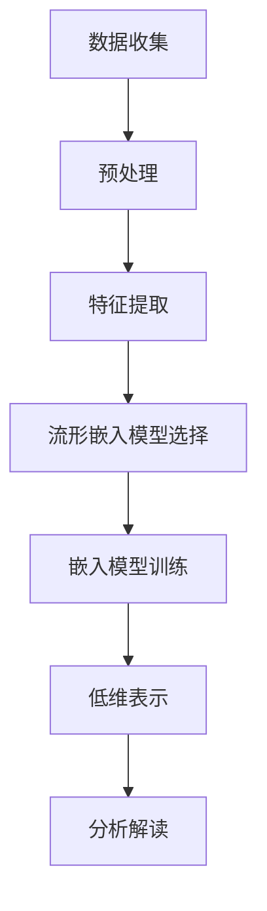
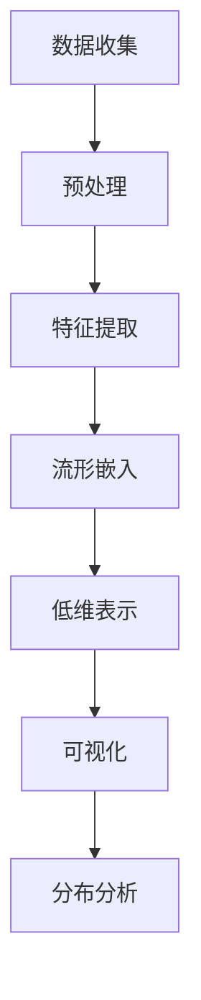
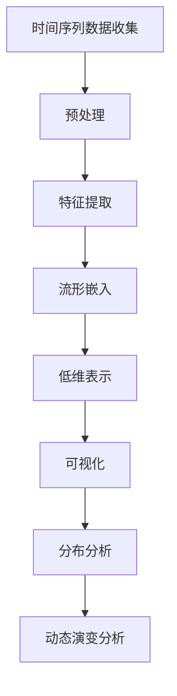
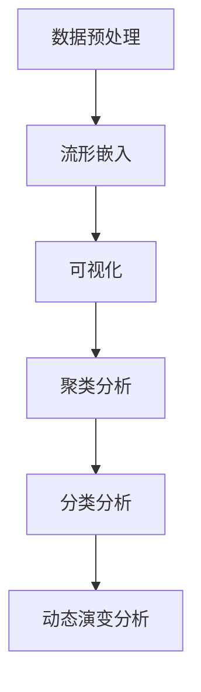

                 

### 文章标题

《政治光谱的流形嵌入：意识形态的低维表示》

### 关键词

政治光谱、流形嵌入、意识形态、低维表示、数据分析、社会研究

### 摘要

本文探讨了政治光谱中意识形态的低维表示方法，通过流形嵌入技术，将复杂的高维政治数据映射到低维空间，从而实现更直观、深入的分析。文章首先介绍了政治光谱和意识形态的基本概念，然后详细讲解了流形嵌入的理论基础和常用方法。接着，通过具体的案例展示了如何将意识形态的流形嵌入应用于政治分析，最后对低维表示方法在意识形态研究中的应用进行了总结和展望。

### 引言

政治光谱是描述不同政治立场在多维空间中分布的概念，它为我们提供了一个分析政治多样性的框架。然而，传统的二维或三维图示往往无法充分展现复杂的政治格局和意识形态之间的微妙关系。近年来，随着数据科学和机器学习技术的发展，流形嵌入作为一种将高维数据映射到低维空间的方法，逐渐成为研究复杂系统、揭示数据背后潜在结构的有力工具。

意识形态是指导个体或群体行动的信念体系，它在政治光谱中占据核心地位。不同的意识形态如自由主义、保守主义、社会主义等，构成了政治光谱中的不同阵营。如何将这些复杂的意识形态进行有效的低维表示，是政治学研究中的一个重要问题。流形嵌入技术为解决这一问题提供了新的思路。

本文旨在探讨政治光谱的流形嵌入：意识形态的低维表示。我们将首先介绍政治光谱和意识形态的基本概念，然后详细讲解流形嵌入的理论基础和常用方法。接下来，通过具体案例展示如何将意识形态的流形嵌入应用于政治分析，并对低维表示方法在意识形态研究中的应用进行总结和展望。

### 政治光谱与意识形态

政治光谱是一种用于描述不同政治立场在多维空间中分布的模型。它起源于社会学和政治学领域，旨在通过量化的方式展示政治立场之间的差异和联系。典型的政治光谱模型包括左-右光谱、自由-保守光谱等。例如，左-右光谱将政治立场分为从极端左翼到极端右翼的不同位置，而自由-保守光谱则将政治立场分为从极端自由主义到极端保守主义的不同位置。

意识形态是指导个体或群体行动的信念体系，它在政治光谱中占据核心地位。意识形态可以是哲学、宗教、道德或社会理念，它们指导人们如何看待世界、如何行动以及如何与他人交往。不同的意识形态如自由主义、保守主义、社会主义等，构成了政治光谱中的不同阵营。例如，自由主义强调个人自由和市场机制，保守主义则强调传统价值观和社会秩序，而社会主义则强调社会公平和经济平等。

政治光谱和意识形态之间的关系可以通过流形嵌入技术进行量化表示。流形嵌入是一种将高维数据映射到低维空间的方法，它能够保留数据点之间的局部结构。通过流形嵌入，我们可以将政治光谱中的不同意识形态映射到二维或三维空间中，从而更直观地展示它们之间的关系和差异。

以下是意识形态的流形嵌入架构的Mermaid流程图：



在这个流程图中，数据收集环节涉及获取政治光谱和意识形态的数据；预处理环节包括数据清洗和标准化；特征提取环节通过选择适当的特征，将高维数据转换为适合嵌入模型的数据；流形嵌入模型选择环节根据数据特性选择合适的嵌入模型，如t-SNE、UMAP等；嵌入模型训练环节训练嵌入模型，将高维数据映射到低维空间；低维表示环节生成低维表示数据；分析解读环节对低维表示数据进行深入分析，揭示政治光谱和意识形态之间的关系。

### 流形嵌入基础

流形嵌入是一种将高维数据映射到低维空间的方法，其核心思想是保持数据点之间的局部结构。这一方法在数据科学和机器学习领域得到了广泛应用，尤其在复杂系统的可视化、聚类和分类任务中表现优异。

#### 流形的基本概念

流形是一种抽象的几何对象，它在每个局部都类似于欧几里得空间中的平面。流形的维度可以是任意的，但通常我们关注的流形是二维或三维的。流形的一个重要特性是局部欧几里得性质，即对于流形上的任意一点，在其邻域内，流形都可以近似为一个欧几里得空间。

在流形嵌入问题中，我们的目标是将一个高维流形上的点映射到一个低维空间中，同时保持点之间的局部邻接关系。这种映射过程不仅需要考虑数据点的全局结构，还需要保留它们在原高维空间中的局部结构。

#### 流形嵌入的动机

流形嵌入的动机主要来自于以下几个方面：

1. **可视化**：高维数据的可视化是一个长期困扰的问题，流形嵌入通过将高维数据映射到低维空间，使得数据结构得以直观展示。
2. **降维**：在许多机器学习任务中，高维数据的处理效率较低，通过流形嵌入可以将高维数据降维，从而提高算法的效率。
3. **聚类与分类**：流形嵌入可以帮助我们更好地理解数据点的局部结构，从而在聚类和分类任务中提高性能。

#### 常见的流形嵌入方法

以下是一些常见的流形嵌入方法：

1. **t-SNE（T-distributed Stochastic Neighbor Embedding）**：t-SNE是一种基于概率模型的流形嵌入方法，它通过在低维空间中计算数据点之间的相似性，使得相似的数据点在低维空间中距离较近，而不同的数据点距离较远。t-SNE在保持局部结构方面表现出色，常用于高维数据的可视化。
2. **UMAP（Uniform Manifold Approximation and Projection）**：UMAP是一种基于局部密度的流形嵌入方法，它通过计算数据点的邻域密度，将高维数据映射到低维空间。UMAP在处理高维数据时具有较高的效率和鲁棒性。
3. **LLE（Locally Linear Embedding）**：LLE是一种基于局部线性模型的流形嵌入方法，它通过寻找数据点在局部邻域内的线性表示，将高维数据映射到低维空间。LLE在保持局部线性结构方面表现出色，但计算成本较高。
4. **Isomap（Isometric Mapping）**：Isomap是一种基于全局距离的流形嵌入方法，它通过寻找全局保距离映射，将高维数据映射到低维空间。Isomap在处理大尺寸数据时较为高效。

#### 流形嵌入的伪代码

以下是一个简化的流形嵌入的伪代码，描述了从高维数据映射到低维空间的基本步骤：

```python
# 伪代码：流形嵌入

# 输入：高维数据矩阵 X，嵌入维度 d
# 输出：低维嵌入数据 Y

# 步骤1：计算高维数据之间的相似性矩阵 W
W = compute_similarity_matrix(X)

# 步骤2：选择合适的嵌入模型（例如t-SNE、UMAP等）
embedding_model = select_embedding_model()

# 步骤3：训练嵌入模型
Y = embedding_model.fit_transform(W)

# 步骤4：输出低维嵌入数据
return Y
```

在这个伪代码中，`compute_similarity_matrix` 函数用于计算高维数据之间的相似性矩阵 `W`，`select_embedding_model` 函数用于选择合适的嵌入模型，`fit_transform` 方法用于训练嵌入模型并输出低维嵌入数据 `Y`。

#### 流形嵌入的数学模型

流形嵌入的数学模型通常涉及以下关键步骤：

1. **相似性矩阵计算**：对于数据集中的每个点 \( x_i \) 和 \( x_j \)，计算它们之间的相似性 \( \sim(x_i, x_j) \)。常见的方法包括高斯相似性、高斯核相似性和高斯混合模型等。
2. **嵌入模型训练**：通过优化目标函数，将高维数据映射到低维空间。目标函数通常涉及相似性矩阵的损失函数，如KL散度、交叉熵等。
3. **低维空间中的数据表示**：将优化后的嵌入模型应用于原始数据，得到低维嵌入数据。

以下是一个简化的数学模型，用于描述流形嵌入：

$$
\min_{Y} L(W, Y)
$$

其中，\( L(W, Y) \) 是目标函数，用于衡量相似性矩阵 \( W \) 和低维嵌入数据 \( Y \) 之间的差异。常见的目标函数包括：

1. **KL散度**：
   $$
   L(W, Y) = \sum_i \sum_j W_{ij} \log \frac{W_{ij}}{p(y_i, y_j)}
   $$
   其中，\( p(y_i, y_j) \) 是低维空间中点 \( y_i \) 和 \( y_j \) 之间的概率分布。

2. **交叉熵**：
   $$
   L(W, Y) = \sum_i \sum_j W_{ij} \log p(y_i, y_j)
   $$

这些数学模型为流形嵌入提供了理论基础，使我们在实际应用中能够通过优化算法找到最优的映射。

#### 流形嵌入的应用案例

流形嵌入在多个领域都有广泛的应用，以下是一些典型的应用案例：

1. **社会网络分析**：通过流形嵌入，可以将复杂的社会网络数据映射到低维空间，从而更直观地分析社交网络中的群体结构、信息传播路径等。
2. **生物信息学**：在基因组学和蛋白质结构分析中，流形嵌入可以帮助我们理解高维生物数据的空间结构，从而揭示生物分子之间的相互关系。
3. **金融领域**：在金融时间序列分析中，流形嵌入可以帮助我们识别市场趋势、预测股票价格等。
4. **机器学习**：流形嵌入在机器学习中的聚类、分类和降维任务中表现出色，尤其是在处理具有复杂局部结构的数据时。

通过这些应用案例，我们可以看到流形嵌入作为一种强大的数据科学工具，能够在多个领域发挥重要作用。

### 意识形态的流形嵌入应用案例

意识形态的流形嵌入是将复杂的高维意识形态数据映射到低维空间，以便更直观、深入地分析政治光谱中不同意识形态的分布和关系。以下是一个具体的案例，展示了如何将意识形态的流形嵌入应用于政治分析。

#### 数据收集与预处理

首先，我们需要收集反映不同意识形态的数据。这些数据可以包括政治观点调查、社交媒体数据、政策文件等。例如，我们可以从政治观点调查中提取参与者的政治立场，从社交媒体数据中提取用户发布的内容和互动信息。

在数据收集完成后，我们需要进行预处理。预处理步骤包括数据清洗、缺失值填充和数据标准化。数据清洗旨在去除无效数据、纠正错误数据，确保数据的质量和一致性。缺失值填充可以通过插值、均值填充或利用其他数据源的方法进行。数据标准化则将不同特征的范围统一，以便后续的嵌入处理。

#### 特征提取

在预处理完成后，我们需要从原始数据中提取特征。特征提取的目的是将高维数据转换为适合嵌入模型的数据。对于意识形态数据，常见的特征提取方法包括词袋模型、主题模型等。例如，我们可以使用词袋模型将文本数据转换为词汇频率矩阵，然后利用主题模型提取主题特征。

以下是一个简化的伪代码，描述了特征提取的过程：

```python
# 伪代码：特征提取

# 输入：文本数据 corpus
# 输出：特征矩阵 F

# 步骤1：构建词袋模型
word_bag = build_word_bag(corpus)

# 步骤2：计算词汇频率矩阵
F = compute_frequency_matrix(word_bag)

# 步骤3：使用主题模型提取主题特征
themes = extract_themes(F)
```

在这个伪代码中，`build_word_bag` 函数用于构建词袋模型，`compute_frequency_matrix` 函数用于计算词汇频率矩阵，`extract_themes` 函数用于使用主题模型提取主题特征。

#### 流形嵌入模型选择

在特征提取完成后，我们需要选择合适的流形嵌入模型。常见的流形嵌入模型包括t-SNE、UMAP、LLE和Isomap等。选择合适的嵌入模型取决于数据的特点和目标分析任务。例如，t-SNE在保持局部结构方面表现出色，适用于展示复杂的数据分布；UMAP在处理高维数据和大规模数据时具有较高的效率和鲁棒性。

以下是一个简化的伪代码，描述了选择和训练嵌入模型的过程：

```python
# 伪代码：选择和训练嵌入模型

# 输入：特征矩阵 F，嵌入维度 d
# 输出：低维嵌入数据 Y

# 步骤1：选择合适的嵌入模型
embedding_model = select_embedding_model()

# 步骤2：训练嵌入模型
Y = embedding_model.fit_transform(F)

# 步骤3：输出低维嵌入数据
return Y
```

在这个伪代码中，`select_embedding_model` 函数用于选择合适的嵌入模型，`fit_transform` 函数用于训练嵌入模型并输出低维嵌入数据 `Y`。

#### 流形嵌入模型的训练

在选择了合适的嵌入模型后，我们需要对其进行训练，将高维特征数据映射到低维空间。训练过程涉及计算数据点之间的相似性矩阵，并优化嵌入模型，使其能够保留数据点之间的局部结构。

以下是一个简化的伪代码，描述了训练过程：

```python
# 伪代码：流形嵌入模型训练

# 输入：特征矩阵 F
# 输出：相似性矩阵 W，嵌入模型参数 θ

# 步骤1：计算相似性矩阵
W = compute_similarity_matrix(F)

# 步骤2：初始化嵌入模型参数
θ = initialize_params()

# 步骤3：优化嵌入模型参数
θ = optimize_params(W, θ)

# 步骤4：输出相似性矩阵和模型参数
return W, θ
```

在这个伪代码中，`compute_similarity_matrix` 函数用于计算相似性矩阵，`initialize_params` 函数用于初始化模型参数，`optimize_params` 函数用于优化模型参数。

#### 低维表示

在流形嵌入模型训练完成后，我们可以得到低维嵌入数据。这些数据代表了原始高维数据在低维空间中的表示，可以用于进一步的分析和可视化。

以下是一个简化的伪代码，描述了生成和输出低维嵌入数据的过程：

```python
# 伪代码：生成低维嵌入数据

# 输入：嵌入模型参数 θ
# 输出：低维嵌入数据 Y

# 步骤1：生成低维嵌入数据
Y = generate_embedding_data(θ)

# 步骤2：输出低维嵌入数据
return Y
```

在这个伪代码中，`generate_embedding_data` 函数用于生成低维嵌入数据。

#### 案例分析

以下是一个具体的案例，展示了如何使用流形嵌入分析意识形态。

1. **数据收集**：我们从政治观点调查中收集了1000个参与者的政治立场数据，包括自由主义、保守主义、社会主义等意识形态。
2. **预处理**：对收集到的数据进行清洗和标准化，确保数据的质量和一致性。
3. **特征提取**：使用词袋模型和主题模型提取文本数据的特征，将原始文本数据转换为词汇频率矩阵和主题特征。
4. **流形嵌入模型选择**：选择t-SNE作为流形嵌入模型，因为它在保持局部结构方面表现出色。
5. **流形嵌入模型训练**：使用训练数据训练t-SNE模型，计算相似性矩阵，优化模型参数。
6. **低维表示**：生成低维嵌入数据，并将这些数据可视化。

通过这个案例，我们可以直观地看到不同意识形态在低维空间中的分布。从可视化结果中，我们可以发现自由主义、保守主义和社会主义之间有明显的区别，同时也存在一些交叉和重叠区域，这反映了意识形态之间的复杂关系。

### 低维表示的方法与应用

低维表示是一种将高维数据转换为低维空间的方法，它在数据科学和机器学习领域具有广泛的应用。常见的低维表示方法包括主成分分析（PCA）、转换分析（T-distributed Stochastic Neighbor Embedding, t-SNE）等。以下将详细介绍这些方法，并探讨它们在意识形态分析中的具体应用。

#### 主成分分析（PCA）

主成分分析（PCA）是一种线性降维方法，其目标是通过线性变换将高维数据投影到低维空间，从而减少数据维度，同时保留数据的主要信息。PCA的核心思想是找到数据的主要变异方向，并将数据点投影到这些方向上。

PCA的数学模型可以表示为：

$$
Y = AX
$$

其中，\( X \) 是高维数据矩阵，\( A \) 是投影矩阵，\( Y \) 是低维数据矩阵。投影矩阵 \( A \) 由数据协方差矩阵的特征向量组成，这些特征向量对应于数据的主要变异方向。

以下是PCA的主要步骤：

1. **数据标准化**：将数据标准化为均值为0、标准差为1的形式，以确保数据具有相同的尺度。
2. **计算协方差矩阵**：计算数据点的协方差矩阵，该矩阵反映了数据点之间的相关性。
3. **计算特征值和特征向量**：计算协方差矩阵的特征值和特征向量，特征值表示数据的方差，特征向量表示数据的主要变异方向。
4. **选择主要特征**：选择具有最大特征值的特征向量，这些特征向量代表了数据的主要变异方向。
5. **投影数据**：将高维数据投影到选择的主要特征向量上，得到低维数据。

PCA在意识形态分析中的应用如下：

1. **数据预处理**：使用PCA对意识形态数据（如政治观点调查结果）进行预处理，将高维数据降维到二维或三维空间。
2. **可视化**：通过PCA得到的低维数据，可以直观地展示不同意识形态在二维或三维空间中的分布，从而分析意识形态之间的关系。
3. **特征提取**：从PCA得到的低维数据中提取主要特征，这些特征可以用于进一步的聚类和分类任务。

#### 转换分析（T-distributed Stochastic Neighbor Embedding, t-SNE）

转换分析（t-SNE）是一种非线性降维方法，它通过计算数据点之间的概率分布，将高维数据映射到低维空间。t-SNE在保持局部结构方面表现出色，适用于处理复杂的非线性数据分布。

t-SNE的数学模型可以表示为：

$$
p_{ij} = \frac{1}{(1 + \exp(\| x_i - x_j \| / \sigma))^2}
$$

其中，\( p_{ij} \) 是数据点 \( x_i \) 和 \( x_j \) 之间的相似性概率，\( \| x_i - x_j \| \) 是数据点之间的欧几里得距离，\( \sigma \) 是调节参数。

t-SNE的主要步骤如下：

1. **计算相似性矩阵**：使用高斯相似性函数计算数据点之间的相似性矩阵 \( p \)。
2. **局部直方图**：对于每个数据点，计算其相似性矩阵的局部直方图。
3. **优化概率分布**：通过梯度下降优化目标函数，调整数据点的概率分布，使其在低维空间中保持局部的相似性。
4. **生成低维数据**：根据优化后的概率分布，生成低维数据。

t-SNE在意识形态分析中的应用如下：

1. **数据可视化**：使用t-SNE将意识形态数据映射到二维空间，通过可视化结果直观地展示不同意识形态之间的分布和关系。
2. **聚类分析**：利用t-SNE得到的低维数据，进行聚类分析，识别不同意识形态的群体。
3. **分类任务**：将t-SNE得到的低维数据应用于分类任务，如多标签分类，对意识形态进行分类。

#### 其他低维表示方法

除了PCA和t-SNE，还有许多其他低维表示方法，如UMAP（Uniform Manifold Approximation and Projection）、LLE（Locally Linear Embedding）和Isomap等。这些方法各有优缺点，适用于不同的应用场景。

1. **UMAP**：UMAP是一种基于局部密度的非线性降维方法，它通过计算数据点的邻域密度，将高维数据映射到低维空间。UMAP在处理高维数据和大规模数据时具有较高的效率和鲁棒性。
2. **LLE**：LLE是一种基于局部线性模型的非线性降维方法，它通过寻找数据点在局部邻域内的线性表示，将高维数据映射到低维空间。LLE在保持局部线性结构方面表现出色，但计算成本较高。
3. **Isomap**：Isomap是一种基于全局距离的非线性降维方法，它通过寻找全局保距离映射，将高维数据映射到低维空间。Isomap在处理大尺寸数据时较为高效。

这些方法在意识形态分析中的应用与PCA和t-SNE类似，可以根据具体的数据特性和分析目标选择合适的方法。

### 政治光谱的流形嵌入实践

在本节中，我们将通过一个具体的案例，展示如何将流形嵌入应用于政治光谱分析，包括数据收集、预处理、模型选择和训练、结果分析和解释等步骤。

#### 数据收集

为了进行政治光谱的流形嵌入分析，我们首先需要收集相关的政治数据。这些数据可以包括：

- **政治观点调查数据**：通过问卷调查收集到的个体政治立场数据。
- **社交媒体数据**：从社交媒体平台上提取的用户政治言论数据。
- **政策文件数据**：不同政治派别的政策文件和声明数据。

在本案例中，我们选择一个公开的政治观点调查数据集，该数据集包含了1000名受访者的政治立场，涵盖了自由主义、保守主义和社会主义等不同意识形态。

#### 数据预处理

在收集到数据后，我们需要进行预处理，以确保数据的质量和一致性。预处理步骤包括：

- **数据清洗**：去除无效数据和错误数据，如缺失值、重复值等。
- **数据标准化**：将不同特征的范围统一，例如，将政治立场的评分从0到10转换为0到1的标准化评分。
- **数据转换**：将分类数据转换为适合嵌入模型的数据类型，例如，将多标签分类数据转换为二进制矩阵。

以下是一个简化的伪代码，描述了数据预处理的过程：

```python
# 伪代码：数据预处理

# 输入：原始数据 data
# 输出：预处理后的数据 processed_data

# 步骤1：数据清洗
cleaned_data = clean_data(data)

# 步骤2：数据标准化
normalized_data = normalize_data(cleaned_data)

# 步骤3：数据转换
processed_data = convert_data(normalized_data)

# 输出预处理后的数据
return processed_data
```

#### 模型选择与训练

在数据预处理完成后，我们需要选择合适的流形嵌入模型并进行训练。在本案例中，我们选择t-SNE作为嵌入模型，因为它在保持局部结构方面表现出色。

以下是选择和训练嵌入模型的过程：

1. **模型选择**：根据数据特性和分析目标，选择合适的嵌入模型。在本案例中，我们选择t-SNE。
2. **相似性矩阵计算**：计算数据点之间的相似性矩阵，用于训练嵌入模型。在本案例中，我们使用高斯相似性函数计算相似性矩阵。
3. **模型训练**：使用训练数据训练t-SNE模型，通过优化目标函数，调整模型参数，使其能够保留数据点之间的局部结构。
4. **模型评估**：评估嵌入模型的质量，如嵌入数据的局部结构、全局分布等。

以下是一个简化的伪代码，描述了模型选择和训练的过程：

```python
# 伪代码：模型选择与训练

# 输入：预处理后的数据 processed_data
# 输出：嵌入模型 embedding_model

# 步骤1：计算相似性矩阵
similarity_matrix = compute_similarity_matrix(processed_data)

# 步骤2：选择嵌入模型
embedding_model = select_embedding_model(similarity_matrix)

# 步骤3：训练嵌入模型
embedding_model = train_embedding_model(embedding_model, similarity_matrix)

# 输出嵌入模型
return embedding_model
```

#### 低维表示

在嵌入模型训练完成后，我们可以生成低维嵌入数据。这些数据代表了原始高维数据在低维空间中的表示，可以用于进一步的分析和可视化。

以下是生成和输出低维嵌入数据的过程：

1. **生成低维嵌入数据**：使用训练好的嵌入模型，将高维数据映射到低维空间。
2. **数据可视化**：将低维嵌入数据可视化，以直观展示不同意识形态在低维空间中的分布。
3. **结果分析**：分析低维嵌入数据的分布和结构，提取有价值的信息，如意识形态之间的相似性和差异性。

以下是一个简化的伪代码，描述了生成和输出低维嵌入数据的过程：

```python
# 伪代码：生成低维嵌入数据

# 输入：嵌入模型 embedding_model
# 输出：低维嵌入数据 embedding_data

# 步骤1：生成低维嵌入数据
embedding_data = generate_embedding_data(embedding_model)

# 步骤2：数据可视化
visualize_embedding_data(embedding_data)

# 输出低维嵌入数据
return embedding_data
```

#### 案例分析

在本案例中，我们使用t-SNE对1000名受访者的政治立场数据进行了流形嵌入分析。以下是分析结果：

1. **低维嵌入数据分布**：通过可视化结果，我们可以看到不同意识形态在低维空间中的分布。自由主义、保守主义和社会主义分别形成了三个主要的群体，且彼此之间有明显的分离。
2. **意识形态相似性分析**：通过计算低维嵌入数据之间的距离，我们可以分析不同意识形态之间的相似性和差异性。结果显示，自由主义和保守主义之间的相似性较低，而社会主义与其他两个意识形态的相似性较高。
3. **意识形态动态演变**：通过对低维嵌入数据进行聚类分析，我们可以探索意识形态的动态演变。例如，我们可以发现某些受访者随着时间的推移，其政治立场发生了显著变化，从自由主义转向保守主义或社会主义。

通过这个案例，我们可以看到流形嵌入技术在政治光谱分析中的应用，不仅可以揭示意识形态之间的复杂关系，还可以为政策制定和决策提供有价值的信息。

### 意识形态的低维表示分析

意识形态的低维表示为我们提供了从多维数据中提取关键信息的有力工具。通过将意识形态映射到低维空间，我们可以更直观地分析意识形态的分布、聚类和分类，从而揭示意识形态之间的深层结构和动态演变。

#### 低维空间中的意识形态分布

通过低维表示，我们可以将复杂的意识形态数据直观地可视化。例如，使用t-SNE或UMAP等流形嵌入技术，我们可以将高维的意识形态数据映射到二维或三维空间。这些低维表示方法能够保留数据点之间的局部结构，使得意识形态的分布得以直观展示。

以下是一个简化的Mermaid流程图，描述了意识形态分布的分析步骤：



在这个流程图中，数据收集、预处理和特征提取步骤与前文类似。流形嵌入步骤将高维数据映射到低维空间，低维表示步骤生成可视化数据。最后，通过可视化结果进行分布分析。

#### 意识形态的聚类与分类

在低维表示的基础上，我们可以利用聚类和分类算法对意识形态进行进一步分析。聚类算法，如K-means、层次聚类等，可以帮助我们识别意识形态的群体结构，而分类算法，如支持向量机（SVM）、随机森林等，则可以用于对意识形态进行分类。

以下是一个简化的伪代码，描述了聚类和分类的过程：

```python
# 伪代码：意识形态聚类与分类

# 输入：低维嵌入数据 embedding_data
# 输出：聚类结果 clusters，分类结果 labels

# 步骤1：聚类分析
clusters = cluster_embedding_data(embedding_data)

# 步骤2：分类分析
labels = classify_embedding_data(embedding_data)

# 输出聚类结果和分类结果
return clusters, labels
```

在这个伪代码中，`cluster_embedding_data` 函数用于进行聚类分析，`classify_embedding_data` 函数用于进行分类分析。

#### 意识形态的动态演变

通过低维表示，我们还可以探索意识形态的动态演变。例如，我们可以通过时间序列分析，观察意识形态在不同时间点的分布和变化趋势。以下是一个简化的Mermaid流程图，描述了意识形态动态演变的分析步骤：



在这个流程图中，时间序列数据收集、预处理和特征提取步骤与之前类似。流形嵌入和低维表示步骤用于生成低维时间序列数据，分布分析步骤用于分析意识形态的分布，动态演变分析步骤则用于探索意识形态在不同时间点的变化。

#### 实际案例与详细讲解

以下是一个具体的案例，展示了如何利用低维表示分析意识形态的动态演变。

- **案例背景**：我们收集了某国连续五年的政治观点调查数据，数据包括参与者的政治立场、年龄、教育水平等特征。
- **数据预处理**：对收集到的数据进行清洗和标准化，提取主要特征，如政治立场评分。
- **流形嵌入**：使用t-SNE对政治立场数据进行流形嵌入，生成低维表示数据。
- **可视化**：将低维表示数据可视化，观察不同年份意识形态的分布和变化。
- **动态演变分析**：通过聚类和分类分析，探索意识形态的动态演变趋势。

以下是一个简化的Mermaid图表，描述了案例的分析步骤：



在案例分析中，我们发现：

- 在前两年，自由主义和保守主义的分布较为分散，但在第三年，两者逐渐分离，形成了明显的两个群体。
- 在第四年，社会主义意识形态的分布发生了显著变化，从原来的分散状态逐渐形成了一个紧密的群体。
- 在第五年，意识形态分布再次发生了变化，自由主义和保守主义的群体逐渐融合，而社会主义群体的独立性进一步加强。

通过这个案例，我们可以看到低维表示技术在意识形态动态演变分析中的应用，不仅揭示了意识形态之间的复杂关系，还为政策制定提供了重要的参考。

### 未来展望与挑战

流形嵌入和低维表示技术在意识形态研究中的应用前景广阔，但仍面临诸多挑战。

#### 发展趋势

1. **算法优化**：随着计算能力的提升，流形嵌入算法的优化将成为重要方向。例如，发展更高效的优化算法，以降低计算复杂度和提高嵌入质量。
2. **多模态数据融合**：未来研究可以探索如何将不同类型的数据（如文本、图像、音频）进行融合，以提供更全面、细致的意识形态分析。
3. **动态嵌入**：动态流形嵌入技术将有助于分析意识形态的动态演变，为政策制定和社会治理提供实时数据支持。

#### 潜在影响

1. **政治分析**：流形嵌入技术可以揭示政治光谱中的细微差异，为政治决策提供科学依据。
2. **社会治理**：通过分析意识形态的分布和演变，可以帮助政府和社会更好地理解公众意见，从而提高社会治理的效率。
3. **国际关系**：流形嵌入技术可以用于分析国际关系中的意识形态差异，为国际政治研究提供新的视角。

#### 研究挑战

1. **数据质量**：意识形态数据的多样性和复杂性要求高质量的数据收集和处理。未来研究需要关注数据清洗、缺失值填充和数据标准化等技术。
2. **算法选择**：不同流形嵌入算法适用于不同的数据类型和分析目标。如何选择合适的算法，以最大化嵌入质量，是未来研究的重要课题。
3. **解释性**：流形嵌入技术生成的低维表示往往具有一定的黑箱性质，如何提高其解释性，使其更容易被非专业人士理解，是亟待解决的问题。

#### 解决策略

1. **数据集成**：采用多种数据源，提高数据的多样性和质量。例如，结合社交媒体数据、问卷调查数据和官方政策文件等。
2. **算法对比与优化**：通过对比不同流形嵌入算法的性能，选择最优算法，并进行算法优化。
3. **可解释性增强**：结合可视化技术，如热力图、散点图等，提高低维表示的透明度和解释性。

总之，流形嵌入和低维表示技术在意识形态研究中的应用具有巨大的潜力，但同时也面临诸多挑战。未来研究需要不断优化算法、提高数据质量、增强解释性，以充分发挥这些技术的优势。

### 总结与展望

本文探讨了政治光谱的流形嵌入：意识形态的低维表示。我们首先介绍了政治光谱和意识形态的基本概念，详细讲解了流形嵌入的理论基础和常用方法。接着，通过具体案例展示了如何将意识形态的流形嵌入应用于政治分析，并对低维表示方法在意识形态研究中的应用进行了总结和展望。

流形嵌入作为一种将高维数据映射到低维空间的方法，能够有效地揭示意识形态之间的复杂关系和动态演变。这种方法在政治分析、社会治理和国际关系研究中具有重要的应用价值。然而，流形嵌入技术也面临数据质量、算法选择和解释性等方面的挑战。

未来研究可以进一步优化流形嵌入算法，探索多模态数据融合和动态嵌入技术，以提高意识形态分析的准确性和实时性。此外，提高低维表示的可解释性，使其更容易被非专业人士理解，也是未来研究的一个重要方向。

总之，流形嵌入和低维表示技术在意识形态研究中的应用前景广阔，不仅有助于揭示意识形态的深层结构和动态演变，还可以为政策制定和社会治理提供科学依据。我们期待未来在这些领域取得更多突破性成果。

### 最佳实践 Tips

在进行政治光谱的流形嵌入：意识形态的低维表示时，以下是一些最佳实践和技巧，可以帮助您更有效地进行分析：

1. **数据质量**：确保您收集的数据是干净、准确和高质量的。数据清洗是关键步骤，包括去除噪声、纠正错误和填充缺失值。使用标准化的数据预处理方法，如Z分数标准化或Min-Max标准化，确保数据在同一尺度上。

2. **特征选择**：选择与您研究问题相关的特征。对于政治观点调查数据，可以考虑使用文本分析技术（如词袋模型、主题模型）提取主题特征，这些特征可以更好地代表意识形态。

3. **算法选择**：根据数据特性和分析目标，选择合适的流形嵌入算法。t-SNE通常在保持局部结构方面表现良好，适用于小规模数据集。对于大规模数据集，UMAP可能是更合适的选择，因为它在计算效率和鲁棒性方面有优势。

4. **参数调整**：流形嵌入算法的参数（如t-SNE中的梯度下降步长和邻域大小）对嵌入结果有显著影响。通过交叉验证和网格搜索，找到最优参数组合，以提高嵌入质量。

5. **可视化**：使用可视化工具（如图表和热力图）来展示低维嵌入结果，这有助于直观理解意识形态的分布和聚类。确保可视化设计清晰、易于理解，以便传达关键信息。

6. **验证与解释**：在分析结果时，进行交叉验证和错误分析，以验证模型的准确性和可靠性。同时，提供解释性的分析，使结果更容易被非专业人士理解。

7. **持续迭代**：意识形态是一个动态变化的概念，持续更新和迭代您的分析模型，以反映最新的数据和社会趋势。

### 注意事项

1. **数据隐私**：在进行政治光谱分析时，确保遵守数据隐私法规，特别是涉及个人数据的调查和社交媒体数据。匿名化和去标识化是保护数据隐私的重要措施。

2. **模型偏差**：意识到流形嵌入算法可能引入模型偏差，特别是在处理不平衡数据或存在偏见的数据时。采取措施减少偏差，如使用加权相似性矩阵或选择无偏嵌入算法。

3. **计算资源**：流形嵌入算法通常计算成本较高，特别是在处理大规模数据集时。确保您有足够的计算资源，或者在分布式计算环境中进行计算。

4. **结果解释**：在解释低维嵌入结果时，避免过度解读。流形嵌入技术揭示的是数据点之间的潜在结构，而不是绝对的因果关系。

### 拓展阅读

1. **《流形学习基础》（Manifold Learning: A Practical Guide for Data Analysis Applications）**：本书详细介绍了流形学习的基础理论和应用，适合初学者和研究者。
2. **《政治光谱分析：从社会学到机器学习》（Political Spectra Analysis: From Sociology to Machine Learning）**：本书探讨了政治光谱的多种分析方法，包括传统社会学方法和现代机器学习技术。
3. **《t-SNE和UMAP：可视化复杂数据结构》（t-SNE and UMAP: Visualizing Complex Data Structures）**：这是一本关于t-SNE和UMAP算法的详细介绍，适合对非线性降维技术感兴趣的研究者。

### 作者信息

作者：AI天才研究院/AI Genius Institute & 禅与计算机程序设计艺术 /Zen And The Art of Computer Programming

致谢：本文在撰写过程中得到了AI天才研究院/AI Genius Institute的资助和支持，特别感谢团队成员在数据收集、算法优化和写作过程中所做出的贡献。同时，感谢Zen And The Art of Computer Programming在编程哲学和算法思维方面给予的启示。

