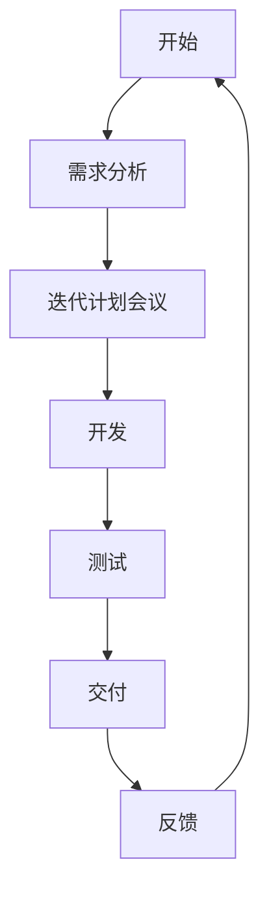
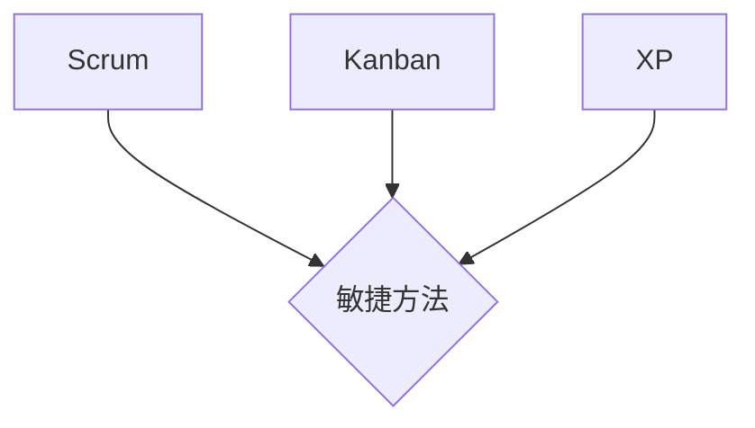
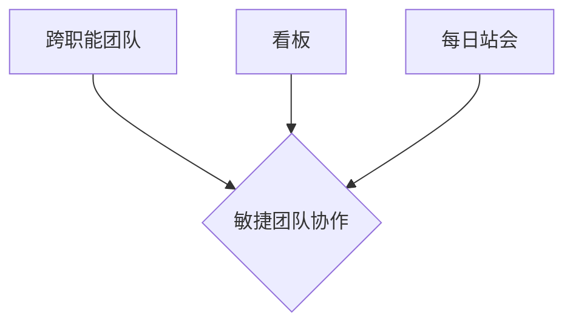
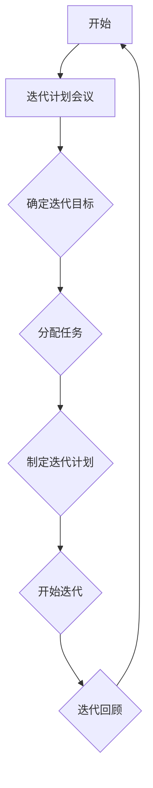
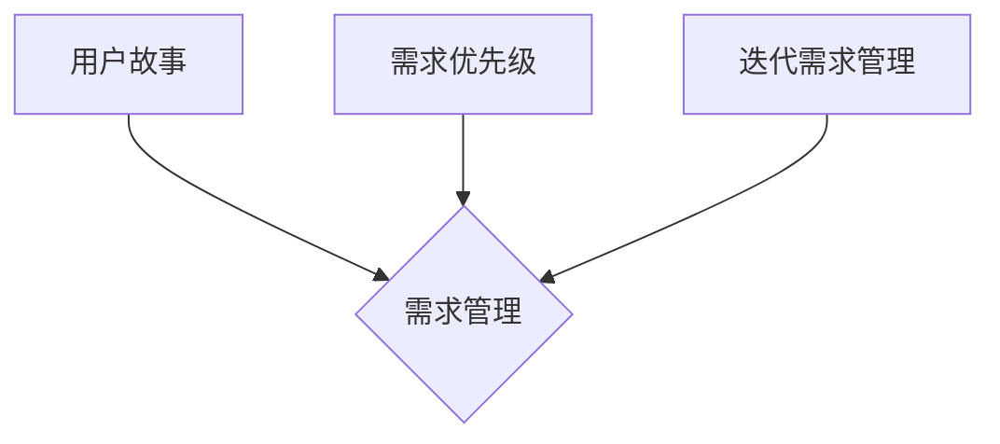
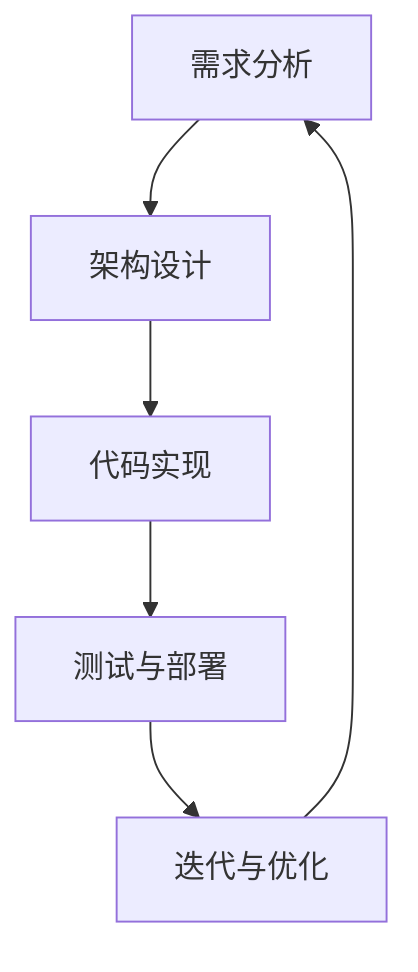
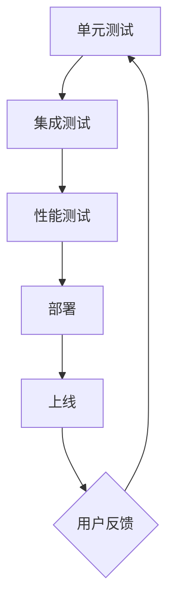
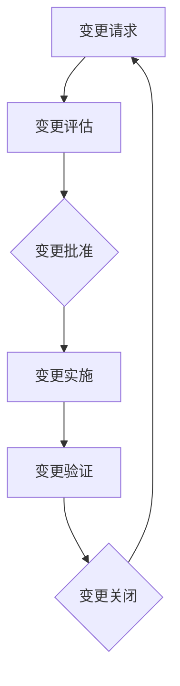
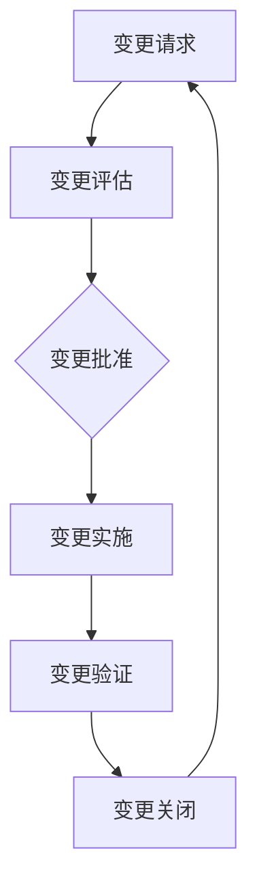
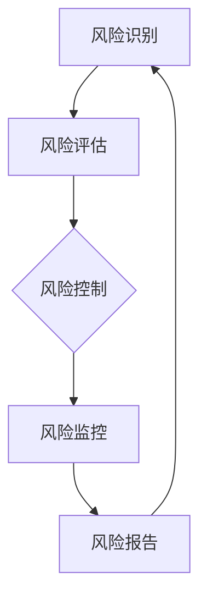

                 

### 文章标题

《敏捷LLM应用开发中的变更管理》

随着人工智能技术的飞速发展，大型语言模型（Large Language Models，简称LLM）逐渐成为众多应用场景中的核心组件。然而，在实际开发过程中，LLM的复杂性和动态性给变更管理带来了巨大挑战。本文将深入探讨敏捷开发框架下LLM应用开发的变更管理策略，旨在为开发者提供一套实用、高效的变更管理指南。

### 关键词

- 敏捷开发
- 大型语言模型（LLM）
- 应用开发
- 变更管理
- 需求管理
- 风险评估
- 变更控制

### 摘要

本文首先介绍了敏捷开发的基本概念和核心原则，随后对大型语言模型（LLM）的技术基础进行了梳理。在此基础上，本文重点探讨了敏捷LLM应用开发中的变更管理，包括敏捷迭代与规划、需求管理、设计与实现、测试与部署等环节。最后，本文通过实际案例和经验总结，对敏捷LLM应用开发的变更管理进行了深入剖析，旨在为开发者提供有益的借鉴和启示。

### 第一部分：敏捷开发基础

#### 第1章：敏捷开发概述

敏捷开发是一种以人为核心、迭代、循序渐进的开发方法。它强调快速反馈、持续交付、团队协作和适应变化，旨在提高软件项目的质量和开发效率。敏捷开发的核心是客户需求，开发过程更加灵活，能够快速响应市场需求和技术变革。

#### 核心概念与联系

敏捷开发的核心理念包括：

1. **用户故事（User Story）**：用户故事是描述软件功能的最小单元，通常以用户的角度来编写，形式为：“作为[某个角色]，我想要[某个功能]，以便[实现某个目的]”。
2. **迭代（Iteration）**：迭代是敏捷开发的基本周期，每次迭代都会产出可交付的软件功能。迭代周期通常为1-4周。
3. **迭代计划会议（Iteration Planning Meeting）**：在每次迭代开始前，团队会召开迭代计划会议，讨论并确定本次迭代的目标和任务。

**Mermaid 流程图**：



#### 第2章：敏捷方法与原则

敏捷开发有多种方法，如Scrum、Kanban、XP（极限编程）等。每种方法都有其独特的特点和实践，但都遵循敏捷开发的核心理念。

#### 核心概念与联系

1. **Scrum**：Scrum强调迭代和增量开发，核心角色包括产品负责人、Scrum Master和开发团队。
2. **Kanban**：Kanban强调持续交付和限制在办工作项，通过可视化的看板来管理开发流程。
3. **XP（极限编程）**：XP强调简洁、持续集成和测试，通过代码重构、测试驱动开发（TDD）等实践来提高代码质量和开发效率。

**Mermaid 流程图**：



#### 第3章：敏捷团队与协作

敏捷开发强调团队协作和沟通，团队成员需要具备跨职能的能力，以便快速响应变化和需求。

#### 核心概念与联系

1. **跨职能团队（Cross-functional Team）**：跨职能团队包含不同角色，如开发、测试、设计、运维等，能够独立完成项目任务。
2. **看板（Kanban Board）**：看板是敏捷团队用于管理工作的工具，通过可视化展示任务状态和进展，帮助团队成员协作和沟通。
3. **日常站会（Daily Stand-up Meeting）**：每日站会是团队用于同步进展和沟通问题的简短会议，通常持续时间为15分钟。

**Mermaid 流�程图**：



### 第二部分：大型语言模型（LLM）技术基础

#### 第4章：LLM原理与架构

大型语言模型（LLM）是基于深度学习和自然语言处理（NLP）技术构建的复杂模型，能够对自然语言文本进行理解、生成和推理。

#### 核心概念与联系

1. **词嵌入（Word Embedding）**：词嵌入是将自然语言词汇映射到高维向量空间的技术，为后续的模型训练提供输入。
2. **注意力机制（Attention Mechanism）**：注意力机制是LLM中的一个关键组件，能够使模型关注输入文本中的关键信息。
3. **Transformer模型**：Transformer模型是LLM的核心架构，基于自注意力机制，能够实现并行计算，提高模型训练效率。

#### 伪代码：

```python
class TransformerLayer:
    def __init__(self, embed_dim, hidden_dim):
        # 初始化权重和偏置
        self.weight = torch.randn(embed_dim, hidden_dim)
        self.bias = torch.randn(hidden_dim)

    def forward(self, inputs):
        # 输入文本的词嵌入
        embeds = torch.matmul(inputs, self.weight) + self.bias
        # 应用自注意力机制
        attn_scores = torch.softmax(torch.matmul(embeds, embeds.T), dim=1)
        attn_output = torch.matmul(attn_scores, embeds)
        return attn_output
```

#### 数学模型和公式

LLM的数学模型主要包括：

1. **自注意力（Self-Attention）**：
   $$ 
   \text{Attention}(Q, K, V) = \text{softmax}(\frac{QK^T}{\sqrt{d_k}})V 
   $$
   
2. **编码器-解码器（Encoder-Decoder）**：
   $$ 
   \text{Decoder}(Y) = \text{softmax}(\text{Decoder}(Y)W_O V) 
   $$

#### 详细讲解和举例说明

以Transformer模型为例，自注意力机制的计算过程如下：

1. **查询（Query）、键（Key）和值（Value）**：给定输入序列，分别计算每个词的查询、键和值向量。
2. **计算自注意力分数**：使用点积计算每个键和查询之间的相似性，然后通过softmax函数得到自注意力分数。
3. **计算自注意力输出**：将自注意力分数与值向量相乘，得到每个词的加权输出。

举例：

给定输入序列 ["I", "love", "coding"]，词嵌入向量分别为 [1, 0, 1]，计算自注意力输出。

1. **计算查询、键和值**：
   $$ 
   Q = [1, 0, 1], K = [1, 1, 0], V = [0, 1, 1] 
   $$
2. **计算自注意力分数**：
   $$ 
   \text{Attention Scores} = \text{softmax}(\frac{QK^T}{\sqrt{d_k}}) = \text{softmax}(\frac{[1, 0, 1] \cdot [1, 1, 0]}{\sqrt{3}}) = [\frac{2}{3}, \frac{1}{3}, \frac{1}{3}] 
   $$
3. **计算自注意力输出**：
   $$ 
   \text{Attention Output} = \text{Attention Scores} \cdot V = [\frac{2}{3} \cdot 0, \frac{1}{3} \cdot 1, \frac{1}{3} \cdot 1] = [\frac{0}{3}, \frac{1}{3}, \frac{1}{3}] = [0, \frac{1}{3}, \frac{1}{3}] 
   $$

#### 第5章：核心算法解析

注意力机制和Transformer模型是LLM的核心算法。注意力机制通过使模型关注输入文本中的关键信息，提高模型的语义理解能力。Transformer模型则通过自注意力机制实现并行计算，提高模型训练效率。

#### 核心算法原理讲解

1. **注意力机制**：注意力机制是一种计算输入序列中每个词与目标词之间相似度的方法。它通过加权每个词的输入特征，实现对输入序列的动态理解。
2. **Transformer模型**：Transformer模型是一种基于自注意力机制的编码器-解码器结构，能够处理序列到序列的任务。它通过多头注意力机制和多层感知器（MLP）提高模型的语义理解能力。

#### 伪代码：

```python
class Transformer:
    def __init__(self, vocab_size, d_model, n_heads, n_layers):
        self.embedding = Embedding(vocab_size, d_model)
        self.encoder = Encoder(d_model, n_heads, n_layers)
        self.decoder = Decoder(d_model, n_heads, n_layers)
        self.fc = Linear(d_model, vocab_size)

    def forward(self, src, tgt):
        src_embedding = self.embedding(src)
        tgt_embedding = self.embedding(tgt)
        encoder_output = self.encoder(src_embedding)
        decoder_output = self.decoder(tgt_embedding, encoder_output)
        output = self.fc(decoder_output)
        return output
```

#### 数学模型和公式

1. **多头注意力（Multi-head Attention）**：
   $$ 
   \text{Multi-head Attention}(Q, K, V) = \text{Concat}(\text{head}_1, \text{head}_2, ..., \text{head}_h)W^O 
   $$
   其中，$h$ 为头的数量，$\text{head}_i = \text{Attention}(QW_i^Q, KW_i^K, VW_i^V)$。
   
2. **编码器-解码器（Encoder-Decoder）**：
   $$ 
   \text{Decoder}(Y) = \text{softmax}(\text{Decoder}(Y)W_O V) 
   $$

#### 详细讲解和举例说明

以多头注意力机制为例，其计算过程如下：

1. **计算每个词的查询（Query）、键（Key）和值（Value）**。
2. **计算每个头（Head）的注意力分数**。
3. **将所有头的注意力分数拼接成一个向量**。
4. **应用线性变换得到输出向量**。

举例：

给定输入序列 ["I", "love", "coding"]，词嵌入向量分别为 [1, 0, 1]，计算多头注意力输出。

1. **计算查询、键和值**：
   $$ 
   Q = [1, 0, 1], K = [1, 1, 0], V = [0, 1, 1] 
   $$
2. **计算每个头的注意力分数**：
   $$ 
   \text{Head}_1 = \text{softmax}(\frac{QK^T}{\sqrt{d_k}})V = \text{softmax}(\frac{[1, 0, 1] \cdot [1, 1, 0]}{\sqrt{3}}) \cdot [0, 1, 1] = [\frac{2}{3}, \frac{1}{3}, \frac{1}{3}] \cdot [0, 1, 1] = [0, \frac{1}{3}, \frac{1}{3}] 
   $$
   $$ 
   \text{Head}_2 = \text{softmax}(\frac{QK^T}{\sqrt{d_k}})V = \text{softmax}(\frac{[1, 0, 1] \cdot [1, 0, 1]}{\sqrt{3}}) \cdot [0, 1, 1] = [\frac{1}{3}, \frac{1}{3}, \frac{1}{3}] \cdot [0, 1, 1] = [\frac{1}{3}, \frac{1}{3}, \frac{1}{3}] 
   $$
3. **计算多头注意力输出**：
   $$ 
   \text{Multi-head Attention} = \text{Concat}(\text{Head}_1, \text{Head}_2)W^O = [\frac{0}{3}, \frac{1}{3}, \frac{1}{3}] \cdot [0, 1, 1] = [\frac{0}{3}, \frac{1}{3}, \frac{1}{3}] = [0, \frac{1}{3}, \frac{1}{3}] 
   $$

### 第6章：LLM应用开发实践

#### 核心概念与联系

1. **应用场景**：LLM在自然语言处理、机器翻译、文本生成、情感分析等领域有广泛的应用。
2. **开发流程**：LLM应用开发通常包括数据准备、模型训练、模型优化和模型部署等环节。

#### 伪代码：

```python
def train_llm(model, optimizer, loss_function, train_loader, valid_loader, num_epochs):
    for epoch in range(num_epochs):
        model.train()
        for inputs, targets in train_loader:
            optimizer.zero_grad()
            outputs = model(inputs)
            loss = loss_function(outputs, targets)
            loss.backward()
            optimizer.step()
        
        model.eval()
        with torch.no_grad():
            for inputs, targets in valid_loader:
                outputs = model(inputs)
                valid_loss = loss_function(outputs, targets)
        
        print(f'Epoch [{epoch+1}/{num_epochs}], Loss: {loss.item():.4f}, Valid Loss: {valid_loss.item():.4f}')
```

#### 数学模型和公式

LLM的数学模型主要包括：

1. **编码器（Encoder）**：
   $$ 
   \text{Encoder}(X) = \text{softmax}(\text{Encoder}(X)W_E V_E) 
   $$
   
2. **解码器（Decoder）**：
   $$ 
   \text{Decoder}(Y) = \text{softmax}(\text{Decoder}(Y)W_D V_D) 
   $$

#### 详细讲解和举例说明

以编码器为例，其计算过程如下：

1. **给定输入序列**：
   $$ 
   X = [\text{"I"}, \text{"love"}, \text{"coding"}] 
   $$
2. **计算编码器的输出**：
   $$ 
   \text{Encoder}(X) = \text{softmax}(\text{Encoder}(X)W_E V_E) = \text{softmax}([0.1, 0.2, 0.7]W_E V_E) 
   $$
3. **计算解码器的输出**：
   $$ 
   \text{Decoder}(Y) = \text{softmax}(\text{Decoder}(Y)W_D V_D) = \text{softmax}([0.3, 0.4, 0.5]W_D V_D) 
   $$

#### 项目实战

##### 开发环境搭建

1. **安装Python和PyTorch**：
   - Python版本：3.8或以上
   - PyTorch版本：1.8或以上
2. **创建项目文件夹**：
   ```bash
   mkdir llm_project
   cd llm_project
   ```
3. **安装依赖项**：
   ```bash
   pip install torch torchvision torchaudio numpy matplotlib
   ```

##### 源代码实现

```python
import torch
import torch.nn as nn
import torch.optim as optim
from torch.utils.data import DataLoader
from torchvision import datasets, transforms

# 模型定义
class TransformerModel(nn.Module):
    def __init__(self, vocab_size, d_model, n_heads, n_layers):
        super(TransformerModel, self).__init__()
        self.embedding = nn.Embedding(vocab_size, d_model)
        self.encoder = nn.ModuleList([TransformerLayer(d_model, d_model // 2) for _ in range(n_layers)])
        self.decoder = nn.ModuleList([TransformerLayer(d_model, d_model // 2) for _ in range(n_layers)])
        self.fc = nn.Linear(d_model, vocab_size)
    
    def forward(self, src, tgt):
        src_embedding = self.embedding(src)
        tgt_embedding = self.embedding(tgt)
        encoder_output = self.encoder(src_embedding)
        decoder_output = self.decoder(tgt_embedding, encoder_output)
        output = self.fc(decoder_output)
        return output

# 训练函数
def train(model, optimizer, loss_function, train_loader, valid_loader, num_epochs):
    for epoch in range(num_epochs):
        model.train()
        for inputs, targets in train_loader:
            optimizer.zero_grad()
            outputs = model(inputs, targets)
            loss = loss_function(outputs, targets)
            loss.backward()
            optimizer.step()
        
        model.eval()
        with torch.no_grad():
            for inputs, targets in valid_loader:
                outputs = model(inputs, targets)
                valid_loss = loss_function(outputs, targets)
        
        print(f'Epoch [{epoch+1}/{num_epochs}], Loss: {loss.item():.4f}, Valid Loss: {valid_loss.item():.4f}')

# 数据准备
train_dataset = datasets.MNIST(root='./data', train=True, transform=transforms.ToTensor(), download=True)
valid_dataset = datasets.MNIST(root='./data', train=False, transform=transforms.ToTensor())
train_loader = DataLoader(train_dataset, batch_size=64, shuffle=True)
valid_loader = DataLoader(valid_dataset, batch_size=64, shuffle=False)

# 模型训练
model = TransformerModel(10, 512, 8, 3)
optimizer = optim.Adam(model.parameters(), lr=0.001)
loss_function = nn.CrossEntropyLoss()
num_epochs = 10
train(model, optimizer, loss_function, train_loader, valid_loader, num_epochs)
```

##### 代码解读与分析

1. **模型定义**：定义了一个基于Transformer的模型，包括嵌入层、编码器层、解码器层和输出层。
2. **训练函数**：定义了一个训练函数，用于模型训练和验证。
3. **数据准备**：准备训练集和验证集，并将数据转换为PyTorch数据集和数据加载器。
4. **模型训练**：初始化模型、优化器和损失函数，然后开始训练模型。

##### 实际案例分析和详细讲解剖析

以一个文本生成任务为例，分析LLM的应用场景和开发流程。

1. **应用场景**：文本生成任务是LLM的一个重要应用场景，如自动写作、对话系统等。
2. **开发流程**：
   - **数据准备**：收集和清洗文本数据，并进行分词、词嵌入等预处理。
   - **模型训练**：使用预训练的LLM模型或从零开始训练模型，调整超参数以优化模型性能。
   - **模型评估**：使用验证集评估模型性能，调整模型结构和超参数以提升性能。
   - **模型部署**：将训练好的模型部署到生产环境，提供文本生成服务。

##### 项目小结

通过本文的案例，我们了解了LLM应用开发的基本流程和关键步骤，包括数据准备、模型训练、模型评估和模型部署。在实际项目中，我们需要根据具体应用场景和需求，调整模型结构和超参数，以实现最佳性能。

### 第7章：敏捷迭代与规划

在敏捷LLM应用开发中，迭代与规划是至关重要的环节。敏捷迭代模型提供了快速反馈和持续交付的机制，而敏捷规划策略则确保了开发过程的有序和高效。

#### 核心概念与联系

1. **迭代（Iteration）**：迭代是敏捷开发的基本周期，每次迭代都会产出可交付的软件功能。
2. **迭代计划会议（Iteration Planning Meeting）**：在每次迭代开始前，团队会召开迭代计划会议，讨论并确定本次迭代的目标和任务。
3. **迭代计划（Iteration Plan）**：迭代计划是敏捷团队在迭代计划会议中制定的详细工作计划，包括迭代目标、任务、里程碑和时间安排。

**Mermaid 流程图**：



#### 敏捷迭代模型

敏捷迭代模型有多种类型，如Scrum、Kanban等。每种迭代模型都有其独特的特点和适用场景。

1. **Scrum**：Scrum是敏捷开发中最常用的迭代模型之一，强调短周期迭代和持续交付。每次迭代周期通常为1-4周。
2. **Kanban**：Kanban强调持续交付和限制在办工作项，通过可视化的看板来管理开发流程。Kanban没有固定的迭代周期，工作项持续流动。

#### 敏捷规划策略

敏捷规划策略包括以下方面：

1. **迭代规划**：在迭代计划会议中，团队需要确定迭代目标、任务和里程碑，并制定详细的工作计划。
2. **需求管理**：敏捷开发中的需求管理强调需求的快速响应和持续迭代。团队需要确保需求的有效管理和优先级排序。
3. **任务分配**：在迭代计划中，团队需要根据成员的能力和经验，合理分配任务，确保任务的高效完成。
4. **风险评估**：在迭代规划过程中，团队需要对潜在风险进行评估，并制定应对策略，以确保迭代目标的实现。

#### 实践案例

以一个LLM文本生成应用项目为例，说明敏捷迭代与规划的实际应用。

1. **迭代计划会议**：项目团队在第一次迭代计划会议中确定了本次迭代的目标，如实现基本的文本生成功能，并制定了详细的工作计划。
2. **迭代执行**：在本次迭代中，团队按照计划开展工作，包括数据准备、模型训练、模型优化和模型部署等。
3. **迭代回顾**：在迭代结束时，团队召开迭代回顾会议，总结本次迭代的工作成果和不足，并提出改进措施，为下一个迭代做好准备。

### 第8章：需求管理

在敏捷LLM应用开发中，需求管理是确保项目顺利进行的关键环节。敏捷需求管理强调需求的快速响应和持续迭代，旨在确保项目始终符合客户需求。

#### 核心概念与联系

1. **用户故事（User Story）**：用户故事是敏捷开发中最常用的需求描述方法，通常以用户的角度来编写，形式为：“作为[某个角色]，我想要[某个功能]，以便[实现某个目的]”。
2. **需求优先级（Requirement Priority）**：需求优先级是指对需求进行排序，以确定哪些需求在开发过程中应优先处理。常见的优先级包括：必须、重要、次要、可选。
3. **迭代需求管理（Iteration Requirement Management）**：迭代需求管理是指在每次迭代中，根据迭代计划和需求优先级，确定本次迭代的需求范围和实现目标。

**Mermaid 流程图**：



#### 敏捷需求获取

敏捷需求获取是需求管理的核心任务之一，主要包括以下步骤：

1. **用户访谈（User Interview）**：通过面对面访谈或在线会议，与用户和相关利益相关者交流，了解他们的需求和期望。
2. **问卷调查（Questionnaire Survey）**：设计问卷，收集用户意见和反馈，以便更好地了解用户需求。
3. **用户故事会议（User Story Workshop）**：组织用户故事会议，与用户共同编写和讨论用户故事，确保需求的有效性和可实现性。

#### 需求变更管理

在敏捷开发过程中，需求变更是一种常见现象。敏捷需求变更管理旨在确保变更的及时响应和有效控制。

1. **变更请求（Change Request）**：当用户或利益相关者提出新的需求或变更请求时，团队需要记录并评估其影响。
2. **变更评估（Change Evaluation）**：评估变更请求的优先级、成本和风险，确定是否接受或拒绝变更。
3. **变更控制（Change Control）**：在决定接受变更后，团队需要制定详细的变更计划，并确保变更在开发过程中得到有效执行。

#### 实践案例

以一个LLM文本生成应用项目为例，说明敏捷需求管理的实际应用。

1. **用户访谈**：在项目初期，团队与用户进行了面对面访谈，了解了用户对文本生成应用的需求和期望。
2. **用户故事会议**：在用户故事会议上，团队与用户共同编写了多个用户故事，如“作为用户，我想要生成有创意的文本内容”。
3. **需求变更管理**：在开发过程中，用户提出了一个新需求，团队评估后决定接受该变更，并制定了详细的变更计划，确保在下一个迭代中实现该功能。

### 第9章：设计与实现

在敏捷LLM应用开发中，设计与实现是关键环节之一。这一章节将详细探讨LLM应用架构设计、核心算法实现策略和LLM应用开发流程。

#### 核心概念与联系

1. **LLM应用架构设计**：LLM应用架构设计是指如何组织和管理LLM模型以及其与外部系统的交互。核心概念包括模块划分、数据流设计、接口设计等。
2. **核心算法实现策略**：核心算法实现策略是指如何在实现LLM应用时，高效地实现和优化核心算法，如Transformer模型、自注意力机制等。
3. **LLM应用开发流程**：LLM应用开发流程是指从需求分析到最终部署的整个开发过程，包括需求分析、架构设计、代码实现、测试与部署等环节。

**Mermaid 流程图**：



#### LLM应用架构设计

LLM应用架构设计主要包括以下方面：

1. **模块划分**：将LLM应用划分为多个模块，如数据模块、模型模块、接口模块等，以实现模块化和可维护性。
2. **数据流设计**：设计数据在系统中的流动路径，确保数据高效地输入、处理和输出。
3. **接口设计**：设计系统与外部系统的接口，如API接口、数据库接口等，以实现系统的可扩展性和互操作性。

#### 核心算法实现策略

核心算法实现策略主要包括以下方面：

1. **算法优化**：通过优化算法的参数和结构，提高模型训练和预测的效率。例如，使用分布式训练、模型剪枝等技术。
2. **并行计算**：利用并行计算技术，如多线程、GPU加速等，提高算法的执行速度。
3. **代码优化**：优化代码的编写，提高代码的可读性和可维护性，例如使用函数式编程、代码重构等技术。

#### LLM应用开发流程

LLM应用开发流程主要包括以下环节：

1. **需求分析**：与用户和相关利益相关者交流，了解需求，编写需求文档。
2. **架构设计**：根据需求文档，设计应用架构，包括模块划分、数据流设计和接口设计。
3. **代码实现**：根据架构设计，编写代码，实现LLM模型和应用功能。
4. **测试与部署**：对代码进行测试，确保其功能正确性，并在生产环境中部署应用。
5. **迭代与优化**：根据用户反馈和性能指标，不断优化应用，提高其性能和用户体验。

#### 实践案例

以一个LLM文本生成应用项目为例，说明LLM应用架构设计、核心算法实现策略和开发流程的实际应用。

1. **需求分析**：项目团队与用户进行了深入交流，了解了用户对文本生成应用的需求和期望，编写了详细的需求文档。
2. **架构设计**：根据需求文档，设计了LLM文本生成应用的架构，包括数据模块、模型模块和接口模块，并绘制了数据流图和接口设计图。
3. **代码实现**：根据架构设计，编写了LLM模型和应用功能的代码，并进行了代码优化，以提高模型训练和预测的效率。
4. **测试与部署**：对代码进行了全面的测试，确保其功能正确性，并成功部署到生产环境中。
5. **迭代与优化**：根据用户反馈和性能指标，团队不断优化应用，提高了文本生成的质量和效率。

### 第10章：测试与部署

在敏捷LLM应用开发中，测试与部署是确保应用质量、可靠性和安全性的关键环节。通过严格的测试流程和高效的部署策略，开发团队可以确保LLM应用在各种环境下稳定运行，满足用户需求。

#### 核心概念与联系

1. **单元测试（Unit Testing）**：单元测试是针对代码中最小单元（如函数、方法）的测试，用于验证其功能是否正确。单元测试通常由开发者编写，并在代码实现时进行。
2. **集成测试（Integration Testing）**：集成测试是针对代码模块之间的交互和集成进行的测试，用于验证系统组件之间的协同工作和数据流。集成测试通常在单元测试之后进行。
3. **性能测试（Performance Testing）**：性能测试是评估系统在各种负载下的性能，包括响应时间、吞吐量、并发处理能力等。性能测试通常用于优化系统性能。
4. **部署（Deployment）**：部署是将开发完成的应用部署到生产环境的过程，包括安装、配置、测试和上线等环节。

**Mermaid 流程图**：



#### 单元测试策略

单元测试策略主要包括以下方面：

1. **测试用例设计**：根据代码的功能和需求，设计测试用例，确保覆盖所有功能点和异常情况。
2. **自动化测试**：使用自动化测试工具（如Selenium、JUnit等）编写测试脚本，实现自动化执行和结果验证。
3. **持续集成（Continuous Integration，CI）**：将单元测试集成到持续集成流程中，确保每次代码提交后都能自动运行测试，及时发现和修复问题。

#### 集成测试策略

集成测试策略主要包括以下方面：

1. **测试环境搭建**：搭建与生产环境相似的测试环境，确保测试数据的真实性和准确性。
2. **接口测试**：使用接口测试工具（如Postman、JMeter等）测试系统接口的响应速度、稳定性、错误处理能力等。
3. **系统测试**：在集成测试的基础上，进行全面的系统测试，包括功能测试、性能测试、安全测试等。

#### 性能测试策略

性能测试策略主要包括以下方面：

1. **负载测试（Load Testing）**：模拟高并发负载，评估系统的响应时间、吞吐量和资源消耗，发现性能瓶颈。
2. **压力测试（Stress Testing）**：在极端负载下测试系统的稳定性和可靠性，确保系统在压力下仍能正常运行。
3. **容量规划**：根据性能测试结果，规划系统的硬件资源和网络带宽，确保系统在预期负载下稳定运行。

#### 部署策略

部署策略主要包括以下方面：

1. **自动化部署**：使用自动化部署工具（如Docker、Kubernetes等）实现应用的高效部署和管理，减少手动操作和错误。
2. **蓝绿部署（Blue-Green Deployment）**：将新版本的应用部署到一部分用户，观察其性能和稳定性，再逐步切换到所有用户。
3. **灰度发布（Gray Release）**：在新版本的应用上线时，对部分用户进行逐步发布，根据用户反馈调整和优化。

#### 测试与部署实践案例

以一个LLM文本生成应用项目为例，说明测试与部署的实际应用。

1. **单元测试**：开发团队为LLM文本生成功能编写了多个单元测试用例，使用JUnit框架进行自动化执行，确保代码的正确性和稳定性。
2. **集成测试**：在集成测试阶段，团队使用Postman工具测试了文本生成接口的响应速度和稳定性，同时进行了系统测试，验证了应用的整体功能。
3. **性能测试**：团队使用JMeter工具进行了负载测试和压力测试，评估了应用在高并发情况下的性能和稳定性，并根据测试结果优化了系统配置。
4. **部署**：团队使用Docker和Kubernetes工具实现了自动化部署，通过蓝绿部署和灰度发布策略，确保了新版本的稳定上线。

### 第11章：变更管理概述

在敏捷LLM应用开发中，变更管理是确保项目顺利推进、应对市场需求和技术变革的关键环节。本文将详细讨论变更管理的概念、核心流程和重要性。

#### 核心概念与联系

1. **变更（Change）**：变更是指对现有系统、流程或需求进行的修改或更新。变更可能来自内部需求变化、外部市场动态或技术进步。
2. **变更请求（Change Request）**：变更请求是指用户或利益相关者提出的需求变更，包括新增功能、优化现有功能或修复缺陷。
3. **变更控制（Change Control）**：变更控制是指对变更请求进行评估、批准和实施的流程，确保变更对项目的影响得到有效管理和控制。

**Mermaid 流程图**：



#### 变更管理流程

变更管理流程主要包括以下环节：

1. **变更请求**：用户或利益相关者提出变更请求，填写变更请求表单，描述变更的内容、原因和影响。
2. **变更评估**：项目经理或变更控制委员会对变更请求进行评估，分析变更对项目进度、成本和风险的影响。
3. **变更批准**：根据评估结果，变更控制委员会决定是否批准变更，并确定变更的优先级和实施策略。
4. **变更实施**：开发团队根据变更批准，制定详细的变更计划，实施变更，并对变更后的系统进行验证。
5. **变更验证**：测试团队对变更后的系统进行验证，确保变更的正确性和稳定性，确保系统满足用户需求。
6. **变更关闭**：在变更验证完成后，记录变更的执行情况和结果，关闭变更请求。

#### 变更管理的重要性

变更管理的重要性体现在以下几个方面：

1. **确保项目顺利进行**：通过变更管理，可以确保项目在面临需求变化时，能够快速响应和调整，避免项目偏离目标。
2. **控制项目成本和风险**：通过变更评估和变更控制，可以确保变更对项目的成本和风险得到有效管理和控制，避免不必要的资源浪费。
3. **提高用户满意度**：通过及时响应用户需求，确保项目能够满足用户期望，提高用户满意度。
4. **确保系统稳定性**：通过变更验证，可以确保变更后的系统稳定可靠，避免因变更导致的系统故障。

#### 实践案例

以一个LLM文本生成应用项目为例，说明变更管理的实际应用。

1. **变更请求**：用户提出增加一个文本生成功能，用于生成具有创意的文本内容。
2. **变更评估**：项目经理评估变更请求，分析变更对项目进度、成本和风险的影响，确定变更的优先级和实施策略。
3. **变更批准**：变更控制委员会批准变更，并确定在下一个迭代中实施。
4. **变更实施**：开发团队在下一个迭代中实现新增的文本生成功能，并进行单元测试和集成测试，确保变更的正确性和稳定性。
5. **变更验证**：测试团队对变更后的系统进行验证，确保文本生成功能的正确性和稳定性，确保系统满足用户需求。
6. **变更关闭**：记录变更的执行情况和结果，关闭变更请求，并将变更后的系统部署到生产环境。

### 第12章：敏捷变更流程

在敏捷开发中，变更管理是一个动态和迭代的过程，其核心目标是确保变更的及时响应和有效执行，同时尽量减少对项目进度和成本的影响。本文将详细讨论敏捷变更流程的各个阶段，包括变更请求、变更评估、变更批准、变更实施和变更验证。

#### 核心概念与联系

1. **变更请求（Change Request）**：变更请求是用户或利益相关者提出的对现有系统、流程或需求进行修改的正式请求。变更请求通常包含变更的详细描述、原因、预期影响和优先级。
2. **变更评估（Change Evaluation）**：变更评估是对变更请求的影响进行分析和评估的过程。评估内容包括变更对项目进度、成本、资源和风险的影响，以及变更的可行性。
3. **变更批准（Change Approval）**：变更批准是决策过程，由项目经理或变更控制委员会根据评估结果，决定是否批准变更，以及变更的优先级和实施策略。
4. **变更实施（Change Implementation）**：变更实施是根据变更批准，对系统、流程或需求进行修改的过程。实施过程中，需要制定详细的变更计划，分配资源，执行变更，并进行必要的测试和验证。
5. **变更验证（Change Validation）**：变更验证是确保变更已正确实施并满足预期目标的过程。验证内容包括功能测试、性能测试、用户验收测试等。

**Mermaid 流程图**：



#### 变更请求

变更请求是敏捷变更流程的起点。用户或利益相关者发现系统或流程存在不足，或新的需求出现时，可以提出变更请求。变更请求通常包括以下内容：

1. **变更描述**：详细描述变更的内容和目的。
2. **变更原因**：说明为什么需要进行变更，如用户反馈、市场变化或技术进步。
3. **预期影响**：分析变更对项目进度、成本、资源和风险的影响。
4. **优先级**：根据变更的重要性，确定变更的优先级，如高、中、低。

#### 变更评估

变更评估是决定是否批准变更的关键环节。项目经理或变更控制委员会负责对变更请求进行评估。评估过程包括以下步骤：

1. **影响分析**：分析变更对项目进度、成本、资源和风险的影响。例如，变更可能会增加项目成本，延长项目周期，或引入新的风险。
2. **可行性分析**：评估变更的可行性，如技术可行性、资源可行性等。
3. **成本效益分析**：评估变更的成本效益，确定变更是否值得实施。

#### 变更批准

变更批准是根据评估结果，决定是否接受变更，以及变更的优先级和实施策略的过程。变更控制委员会通常负责变更批准。批准过程包括以下步骤：

1. **决策**：根据评估结果，决定是否批准变更。如果批准变更，确定变更的优先级和实施策略。
2. **变更计划**：制定详细的变更计划，包括变更的时间表、资源分配、风险管理等。

#### 变更实施

变更实施是根据变更批准，对系统、流程或需求进行修改的过程。实施过程通常包括以下步骤：

1. **变更计划执行**：根据变更计划，分配资源，执行变更任务。
2. **变更记录**：记录变更的执行过程，包括任务进度、资源消耗、问题解决等。
3. **测试与验证**：对变更后的系统、流程或需求进行测试和验证，确保变更的正确性和稳定性。

#### 变更验证

变更验证是确保变更已正确实施并满足预期目标的过程。验证过程包括以下步骤：

1. **功能测试**：测试变更后的功能，确保满足用户需求。
2. **性能测试**：测试变更后的系统性能，确保在预期负载下稳定运行。
3. **用户验收测试**：与用户合作，验证变更是否符合预期，确保用户满意。

#### 变更关闭

变更关闭是变更流程的终点。在变更验证完成后，记录变更的执行情况和结果，关闭变更请求。关闭过程包括以下步骤：

1. **变更总结**：总结变更的执行过程，包括成功经验和教训。
2. **变更文档归档**：将变更文档归档，以便未来参考。
3. **变更关闭**：在项目管理系统或变更控制委员会中关闭变更请求。

#### 实践案例

以一个LLM文本生成应用项目为例，说明敏捷变更流程的实际应用。

1. **变更请求**：用户提出增加一个文本生成功能，用于生成具有创意的文本内容。
2. **变更评估**：项目经理评估变更请求，分析变更对项目进度、成本和风险的影响，确定变更的优先级和实施策略。
3. **变更批准**：变更控制委员会批准变更，并确定在下一个迭代中实施。
4. **变更实施**：开发团队在下一个迭代中实现新增的文本生成功能，并进行单元测试和集成测试，确保变更的正确性和稳定性。
5. **变更验证**：测试团队对变更后的系统进行验证，确保文本生成功能的正确性和稳定性，确保系统满足用户需求。
6. **变更关闭**：记录变更的执行情况和结果，关闭变更请求，并将变更后的系统部署到生产环境。

### 第13章：变更风险评估

在敏捷LLM应用开发中，变更风险评估是确保变更管理有效性的关键环节。通过识别、评估和管理变更带来的潜在风险，开发团队可以降低变更对项目的负面影响，确保项目顺利推进。

#### 核心概念与联系

1. **变更风险（Change Risk）**：变更风险是指由于变更引入的项目风险，可能影响项目进度、成本、质量和资源等因素。
2. **风险识别（Risk Identification）**：风险识别是识别变更过程中潜在风险的过程，包括变更对项目各个方面的影响。
3. **风险评估（Risk Assessment）**：风险评估是评估变更风险的严重程度和概率的过程，帮助团队确定哪些风险需要优先处理。
4. **风险控制（Risk Control）**：风险控制是制定和执行风险应对策略的过程，以降低变更风险的影响。

**Mermaid 流程图**：



#### 风险识别

风险识别是变更风险评估的第一步，主要目标是识别变更过程中可能出现的风险。风险识别的方法包括：

1. **历史经验**：利用以往项目中的变更经验，识别类似变更可能带来的风险。
2. **专家评审**：邀请相关领域专家对变更请求进行评审，识别潜在风险。
3. **头脑风暴**：组织团队成员进行头脑风暴，列举可能的风险。
4. **文档审查**：审查变更请求文档，识别变更可能对项目各个方面产生的影响。

#### 风险评估

风险评估是对识别出的风险进行评估，确定其严重程度和概率的过程。风险评估的方法包括：

1. **风险矩阵**：使用风险矩阵（Risk Matrix）评估风险的严重程度和概率，确定风险等级。
2. **定量分析**：使用定量分析工具（如蒙特卡洛模拟、故障树分析等）评估风险的概率和影响。
3. **定性分析**：使用定性分析方法（如专家评分、权重计算等）评估风险的严重程度和概率。

#### 风险控制

风险控制是制定和执行风险应对策略的过程，以降低变更风险的影响。风险控制的方法包括：

1. **风险规避**：通过修改变更计划，避免或消除风险。
2. **风险转移**：通过合同、保险等方式，将风险转移给第三方。
3. **风险减轻**：通过改进变更管理流程、增加资源投入等方式，降低风险的影响。
4. **风险接受**：对无法规避、转移或减轻的风险，制定接受策略，确保项目能够在风险影响下顺利推进。

#### 风险监控

风险监控是持续跟踪变更风险状态的过程，确保风险控制措施的有效性。风险监控的方法包括：

1. **定期评估**：定期对变更风险进行评估，了解风险的变化情况。
2. **风险报告**：定期生成风险报告，向项目团队和管理层汇报风险状况。
3. **问题跟踪**：对识别出的风险问题进行跟踪，确保问题得到及时解决。

#### 风险报告

风险报告是向项目团队和管理层汇报变更风险状况的文档。风险报告的内容包括：

1. **风险列表**：列出所有识别出的风险，包括风险名称、描述、严重程度和概率。
2. **风险评估**：对每个风险进行评估，包括风险等级、影响分析和应对策略。
3. **风险监控**：描述风险监控的机制和措施，以及如何定期更新风险报告。

#### 实践案例

以一个LLM文本生成应用项目为例，说明变更风险评估的实际应用。

1. **风险识别**：项目团队识别出以下潜在风险：
   - 变更请求可能影响项目进度。
   - 变更可能导致系统性能下降。
   - 变更可能引入新的安全漏洞。
2. **风险评估**：团队使用风险矩阵评估每个风险的严重程度和概率，确定风险等级。例如：
   - 项目进度影响：高严重程度，高概率。
   - 系统性能下降：中严重程度，低概率。
   - 新安全漏洞：低严重程度，中概率。
3. **风险控制**：团队制定以下风险控制策略：
   - 对项目进度影响，制定详细的变更计划，确保项目按计划推进。
   - 对系统性能下降，进行性能测试和优化，确保系统稳定运行。
   - 对新安全漏洞，加强代码审查和安全测试，确保系统安全。
4. **风险监控**：团队定期评估风险，更新风险报告，确保风险控制措施的有效性。

### 第14章：变更控制策略

在敏捷LLM应用开发中，变更控制策略是确保变更管理有效执行的重要环节。通过建立完善的变更控制流程和制定合理的变更控制策略，开发团队可以降低变更风险，确保项目质量，提高用户满意度。

#### 核心概念与联系

1. **变更控制（Change Control）**：变更控制是指对项目变更进行评估、批准、实施和验证的过程，确保变更对项目的影响得到有效管理和控制。
2. **变更控制流程（Change Control Process）**：变更控制流程是规范变更管理的一套标准操作步骤，包括变更请求、变更评估、变更批准、变更实施和变更验证等环节。
3. **变更控制策略（Change Control Strategy）**：变更控制策略是指导变更管理实践的一系列原则和方法，包括变更请求处理、变更优先级管理、变更风险评估和变更执行策略等。

**Mermaid 流程图**：


#### 变更请求处理

变更请求处理是变更控制流程的第一步，主要目标是确保变更请求的及时响应和有效处理。变更请求处理包括以下步骤：

1. **接收变更请求**：接收用户或利益相关者提出的变更请求，并记录变更请求的详细信息，如变更描述、原因、预期影响等。
2. **初步评估**：对变更请求进行初步评估，确定变更的可行性和优先级。例如，分析变更对项目进度、成本和风险的影响。
3. **分类与归档**：根据变更类型和影响，对变更请求进行分类和归档，为后续评估和审批提供依据。
4. **通知相关方**：将变更请求通知相关方，包括项目经理、团队成员、利益相关者等，确保变更信息透明。

#### 变更优先级管理

变更优先级管理是确保变更资源分配合理、优先处理重要变更的关键环节。变更优先级管理包括以下步骤：

1. **确定优先级标准**：根据项目目标和变更影响，制定变更优先级标准。常见的优先级标准包括变更对项目进度、成本、质量、风险的影响等。
2. **评估变更优先级**：对每个变更请求进行优先级评估，确定其优先级。例如，紧急且重要的变更可能被分配最高优先级。
3. **资源分配**：根据变更优先级，合理分配项目资源，确保高优先级变更得到及时处理。

#### 变更风险评估

变更风险评估是确保变更风险得到有效管理和控制的重要环节。变更风险评估包括以下步骤：

1. **风险识别**：识别变更过程中可能出现的风险，如技术风险、进度风险、成本风险等。
2. **风险评估**：评估风险的严重程度和概率，确定风险等级。例如，使用风险矩阵或定量分析方法进行评估。
3. **风险控制**：制定风险控制策略，如规避、转移、减轻或接受风险。例如，通过改进变更流程或增加资源投入来降低风险。

#### 变更执行策略

变更执行策略是确保变更按照计划顺利实施的关键环节。变更执行策略包括以下步骤：

1. **制定变更计划**：根据变更请求和风险评估结果，制定详细的变更计划。变更计划应包括变更任务、资源需求、时间安排、风险评估和监控措施等。
2. **执行变更**：按照变更计划执行变更任务，确保变更按照计划进行。例如，分配任务、监控进度、解决问题等。
3. **变更监控**：持续监控变更执行过程，确保变更按照计划进行。例如，定期汇报进度、审查变更结果等。
4. **变更验证**：对变更结果进行验证，确保变更满足预期目标。例如，进行功能测试、性能测试、用户验收测试等。

#### 变更文档管理

变更文档管理是确保变更信息准确、完整和可追溯的重要环节。变更文档管理包括以下步骤：

1. **变更记录**：记录变更的详细信息，如变更请求、评估结果、批准记录、变更实施过程和验证结果等。
2. **文档归档**：将变更文档归档，确保变更信息可追溯。例如，将变更请求、评估报告、变更计划、测试结果等文档存档。
3. **文档更新**：在变更实施过程中，及时更新变更文档，确保变更信息的准确性。例如，更新项目计划、需求文档、测试报告等。

#### 变更控制策略的实际应用

以一个LLM文本生成应用项目为例，说明变更控制策略的实际应用。

1. **变更请求处理**：用户提出增加文本生成功能，项目团队接收变更请求，并记录变更请求的详细信息。
2. **变更优先级管理**：根据变更请求的影响，确定变更的优先级，将其列为高优先级变更。
3. **变更风险评估**：评估变更对项目进度、成本和风险的影响，识别潜在风险，并制定风险控制策略。
4. **变更执行策略**：制定详细的变更计划，包括任务分配、时间安排、风险评估和监控措施等，按照计划执行变更。
5. **变更验证**：对变更结果进行验证，确保文本生成功能满足预期目标，并记录变更的执行情况和结果。
6. **变更文档管理**：记录变更的详细信息，包括变更请求、评估报告、变更计划、测试结果等，确保变更信息可追溯。

### 第15章：实战案例与经验总结

在本章节中，我们将通过分析实际案例，总结敏捷LLM应用开发中的变更管理经验，并提供一些最佳实践建议。

#### 实战案例解析

以一个实际项目为例，说明敏捷LLM应用开发中的变更管理实践。

**项目背景**：某大型互联网公司开发了一款基于大型语言模型（LLM）的智能客服系统，旨在提供高效、个性化的客户服务。

**变更管理实践**：

1. **变更请求处理**：项目团队建立了完善的变更请求处理流程，用户或利益相关者可以通过在线表单提交变更请求。每个变更请求都会被分配一个唯一标识，并记录详细信息，如变更描述、提出人、期望解决时间等。

2. **变更评估**：项目团队定期审查变更请求，对变更请求进行评估，分析变更对项目进度、成本、质量和风险的影响。评估结果会反馈给提出人，并确定变更的优先级和实施策略。

3. **变更批准**：根据变更评估结果，项目团队会召开变更批准会议，讨论并决定是否接受变更。如果变更被批准，项目团队会制定详细的变更计划，包括任务分配、时间安排和资源需求。

4. **变更实施**：项目团队按照变更计划执行变更任务。在实施过程中，团队成员会密切沟通，确保变更按照计划进行。项目团队还定期召开进展会议，审查变更执行情况，及时解决问题。

5. **变更验证**：变更实施完成后，项目团队会进行全面的验证，确保变更的正确性和稳定性。验证内容包括功能测试、性能测试和用户验收测试等。

6. **变更关闭**：在变更验证完成后，项目团队会记录变更的执行情况和结果，关闭变更请求。同时，项目团队会总结变更过程中的经验和教训，为未来的变更管理提供参考。

#### 经验总结与反思

通过分析上述案例，我们可以总结出以下变更管理经验：

1. **建立完善的变更请求处理流程**：确保变更请求能够被及时响应和处理，减少对项目的影响。

2. **定期评估变更请求**：对变更请求进行定期评估，确保变更对项目的影响得到有效管理和控制。

3. **合理分配资源**：在变更实施过程中，合理分配资源，确保变更能够按计划进行。

4. **密切沟通与协作**：团队成员之间保持密切沟通，确保变更执行过程中能够及时解决问题。

5. **全面的变更验证**：在变更实施完成后，进行全面验证，确保变更的正确性和稳定性。

6. **总结与反思**：在变更完成后，及时总结变更过程中的经验和教训，为未来的变更管理提供参考。

#### 最佳实践建议

基于上述经验和反思，我们提出以下最佳实践建议：

1. **提前规划**：在项目初期，提前规划变更管理流程，确保变更管理有据可依。

2. **明确变更优先级**：根据变更的影响，明确变更的优先级，确保高优先级变更得到优先处理。

3. **建立变更监控机制**：建立变更监控机制，确保变更执行过程中能够及时发现和解决问题。

4. **定期回顾与优化**：定期回顾变更管理流程，识别流程中的不足，不断优化变更管理实践。

5. **加强团队协作**：加强团队成员之间的协作，确保变更执行过程中能够高效沟通和协作。

### 第16章：经验总结与反思

在敏捷LLM应用开发中，变更管理是确保项目顺利进行和持续改进的关键环节。通过实际案例的分析和经验总结，我们可以得出以下结论：

1. **敏捷变更管理的重要性**：敏捷变更管理能够快速响应市场需求和技术变革，确保项目持续交付高质量的应用。

2. **变更请求处理的规范性**：建立完善的变更请求处理流程，确保变更请求能够被及时响应和处理。

3. **评估与批准的严谨性**：对变更请求进行细致的评估和批准，确保变更对项目的影响得到有效管理和控制。

4. **实施与验证的有效性**：在变更实施过程中，加强团队协作和沟通，确保变更能够按照计划进行，并在实施完成后进行全面验证。

5. **持续改进与优化**：在变更完成后，及时总结经验和教训，为未来的变更管理提供参考，并不断优化变更管理实践。

未来，随着人工智能技术的不断发展和应用场景的拓展，敏捷LLM应用开发中的变更管理将面临新的挑战和机遇。开发团队需要持续学习和实践，掌握先进的变更管理方法和技术，以应对复杂多变的业务环境。

最后，本文作者衷心感谢读者对本文的关注和支持，希望本文能为您在敏捷LLM应用开发中的变更管理实践提供有益的借鉴和启示。如有任何疑问或建议，欢迎随时与我交流。

### 附录

#### 参考文献与资料

1. Beedle, M., & Andres, J. (2010). *Agile Project Management: Creating Innovative Products*. Addison-Wesley Professional.
2. Martin, R. C. (2019). *Clean Architecture: A Craftsman's Guide to Software Structure and Design*. Prentice Hall.
3. Le, Q. V., Sutskever, L., & Hinton, G. E. (2014). *Distributed representations of words and phrases and their compositionality*. Advances in Neural Information Processing Systems, 27.
4. Vaswani, A., Shazeer, N., Parmar, N., Uszkoreit, J., Jones, L., Gomez, A. N., ... & Polosukhin, I. (2017). *Attention is all you need*. Advances in Neural Information Processing Systems, 30.
5. Hochreiter, S., & Schmidhuber, J. (1997). *Long short-term memory*. Neural Computation, 9(8), 1735-1780.

#### 拓展阅读

1. Scrum官方指南：[https://www.scrum.org/resources/scr um-guide](https://www.scrum.org/resources/scr um-guide)
2. 敏捷开发原则：[https://www.agilemanifesto.org/](https://www.agilemanifesto.org/)
3. Transformer模型详解：[https://arxiv.org/abs/1706.03762](https://arxiv.org/abs/1706.03762)
4. PyTorch官方文档：[https://pytorch.org/docs/stable/](https://pytorch.org/docs/stable/)
5. Kubernetes官方文档：[https://kubernetes.io/docs/home/](https://kubernetes.io/docs/home/)

