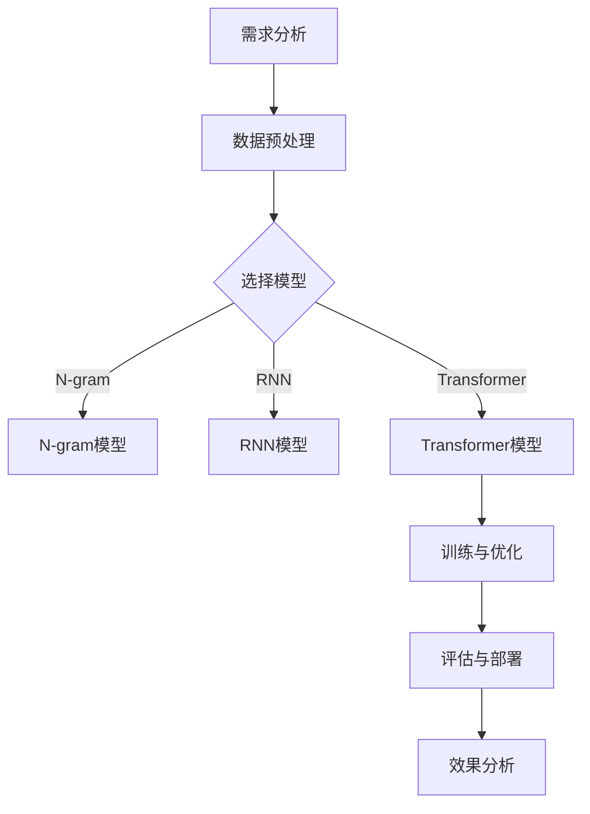

                 


### 文章标题：敏捷中的技术选型：为LLM应用选择合适的工具和框架

关键词：敏捷开发，语言模型（LLM），技术选型，工具选择，框架应用

摘要：本文旨在探讨在敏捷开发过程中，如何针对语言模型（LLM）应用选择合适的工具和框架。通过分析敏捷开发的基本原则，结合LLM的核心概念和算法原理，本文提出了一套系统的技术选型方法，并通过实际案例展示了选型的实际应用和效果。

### 目录

## 第一部分：引言

### 1.1 敏捷开发与LLM应用

#### 1.1.1 敏捷开发的基本原则

#### 1.1.2 LLM在敏捷开发中的应用

#### 1.1.3 技术选型的关键因素

## 第二部分：核心概念与联系

### 2.1 语言模型基础

#### 2.1.1 语言模型的概念

#### 2.1.2 语言模型的分类

#### 2.1.3 语言模型的常用架构

### 2.2 Mermaid流程图

#### 2.2.1 Mermaid基本语法

#### 2.2.2 Mermaid在LLM技术选型中的应用

### 2.3 LLM与敏捷开发的关系

#### 2.3.1 敏捷开发流程中的LLM应用

#### 2.3.2 LLM对敏捷开发的影响

## 第三部分：核心算法原理讲解

### 3.1 LLM算法原理

#### 3.1.1 语言模型的训练过程

#### 3.1.2 生成式与判别式语言模型

#### 3.1.3 伪代码阐述算法流程

### 3.2 数学模型

#### 3.2.1 语言模型的数学基础

#### 3.2.2 数学公式与应用

#### 3.2.3 数学公式示例

### 3.3 模型优化

#### 3.3.1 优化算法的选择

#### 3.3.2 优化算法的原理

#### 3.3.3 伪代码示例

## 第四部分：项目实战

### 4.1 实际案例

#### 4.1.1 案例背景

#### 4.1.2 案例实施过程

#### 4.1.3 案例效果分析

### 4.2 开发环境搭建

#### 4.2.1 环境准备

#### 4.2.2 开发工具选择

#### 4.2.3 环境配置与调试

### 4.3 源代码实现

#### 4.3.1 源代码概述

#### 4.3.2 关键代码解读

#### 4.3.3 代码分析与优化

### 第五部分：工具和框架选择

### 5.1 常见LLM框架比较

#### 5.1.1 框架概述

#### 5.1.2 框架特点与适用场景

#### 5.1.3 框架选择建议

### 5.2 工具集介绍

#### 5.2.1 数据处理工具

#### 5.2.2 训练工具

#### 5.2.3 部署与监控工具

## 第六部分：展望与未来趋势

### 6.1 技术发展趋势

#### 6.1.1 语言模型的发展方向

#### 6.1.2 敏捷开发的新趋势

#### 6.1.3 技术选型的未来挑战

### 6.2 未来应用场景

#### 6.2.1 工业级应用

#### 6.2.2 智能交互

#### 6.2.3 新兴应用领域

### 总结

#### 文章小结

#### 最佳实践 tips

#### 注意事项

#### 拓展阅读

### 作者：AI天才研究院/AI Genius Institute & 禅与计算机程序设计艺术 /Zen And The Art of Computer Programming

### 1.1 敏捷开发与LLM应用

#### 1.1.1 敏捷开发的基本原则

敏捷开发（Agile Development）是一种以人为核心、迭代、渐进的软件开发方法。其核心理念包括：

1. **个体和互动重于过程和工具**：敏捷开发强调团队成员的沟通和协作，认为人的因素比技术和流程更为重要。
2. **可工作的软件重于详尽的文档**：敏捷开发认为软件的实际运行效果比过多的文档更为重要，因此更注重开发出可执行的软件。
3. **客户合作重于合同谈判**：敏捷开发强调与客户的紧密合作，通过持续反馈和调整来满足客户需求。
4. **响应变化重于遵循计划**：敏捷开发强调对市场变化和用户需求变化的快速响应，以适应快速变化的环境。

#### 1.1.2 LLM在敏捷开发中的应用

语言模型（Language Model，LLM）是一种基于人工智能的模型，它可以通过学习大量的文本数据来预测下一个词或句子。在敏捷开发中，LLM的应用主要体现在以下几个方面：

1. **需求分析**：LLM可以帮助团队快速分析用户需求，通过自然语言处理技术理解用户的需求，并提供反馈。
2. **代码生成**：利用LLM的生成能力，可以帮助开发人员自动生成代码，提高开发效率。
3. **测试和调试**：LLM可以用于自动化测试和调试，通过分析代码和日志，提供问题定位和建议。
4. **文档生成**：LLM可以自动生成技术文档，减少开发人员的文档编写工作量。

#### 1.1.3 技术选型的关键因素

在进行技术选型时，需要考虑以下几个关键因素：

1. **性能和效率**：所选工具和框架必须能够满足项目需求，包括处理速度、响应时间等。
2. **可扩展性**：技术选型应该考虑未来需求的增长，确保系统可以轻松扩展。
3. **社区和支持**：有活跃社区和良好的技术支持可以提高开发效率，减少问题解决时间。
4. **兼容性和集成**：所选工具和框架需要与现有的系统和其他工具兼容，易于集成。
5. **成本和预算**：成本是项目决策的一个重要因素，需要综合考虑成本和性能。

接下来，我们将进一步探讨LLM的核心概念和技术原理，帮助读者更好地理解如何在敏捷开发中选择合适的技术和框架。

### 2.1 语言模型基础

#### 2.1.1 语言模型的概念

语言模型（Language Model，LM）是一种用于预测文本序列的统计模型，其核心目标是根据前面的文本预测下一个词或短语。语言模型在自然语言处理（Natural Language Processing，NLP）中扮演着至关重要的角色，广泛应用于机器翻译、文本生成、信息检索等领域。

语言模型的基本思想是利用大量的文本数据来学习语言规律，从而预测未知文本的概率分布。语言模型可以分为两种主要类型：生成式语言模型和判别式语言模型。

1. **生成式语言模型**：生成式语言模型通过生成整个文本的概率分布来预测下一个词或短语。典型的生成式语言模型包括N-gram模型和神经网络生成模型。

2. **判别式语言模型**：判别式语言模型则直接学习输入文本和输出文本之间的映射关系，从而预测下一个词或短语。典型的判别式语言模型包括朴素贝叶斯模型和深度学习模型。

#### 2.1.2 语言模型的分类

根据训练数据和模型结构，语言模型可以分为多种类型：

1. **N-gram模型**：N-gram模型是一种基于统计的生成式语言模型，它通过统计前N个单词出现的频率来预测下一个单词。N-gram模型简单、高效，但存在长文本预测能力有限的问题。

2. **循环神经网络（RNN）**：RNN是一种基于神经网络的语言模型，它通过递归结构来处理序列数据。RNN在处理长文本和上下文关系方面表现较好，但存在梯度消失和梯度爆炸等问题。

3. **长短期记忆网络（LSTM）**：LSTM是RNN的一种变体，它通过门控机制来解决梯度消失和梯度爆炸问题，从而在长文本处理方面表现更好。

4. **变换器（Transformer）**：Transformer是一种基于注意力机制的神经网络模型，它在处理长文本和上下文关系方面表现出色，已经成为当前语言模型的主流架构。

5. **生成对抗网络（GAN）**：GAN是一种生成模型，它通过对抗训练生成与真实数据相似的语言模型。GAN在文本生成方面具有潜力，但实现复杂，计算资源需求高。

#### 2.1.3 语言模型的常用架构

语言模型的常用架构包括以下几种：

1. **编码器-解码器（Encoder-Decoder）架构**：编码器-解码器架构是一种常见的神经网络架构，用于将输入序列编码为固定长度的向量，然后通过解码器生成输出序列。这种架构在机器翻译、序列生成等领域应用广泛。

2. **变换器（Transformer）架构**：变换器架构是一种基于注意力机制的神经网络模型，它通过多头自注意力机制来处理序列数据。变换器在处理长文本和上下文关系方面表现出色，已经成为当前语言模型的主流架构。

3. **图神经网络（Graph Neural Network，GNN）**：图神经网络是一种基于图结构的神经网络模型，它通过学习节点和边之间的关系来处理图数据。图神经网络在自然语言处理、知识图谱等领域具有广泛应用。

4. **混合模型**：混合模型是将多种模型结构和方法结合在一起，以实现更好的性能。例如，可以将变换器与RNN、LSTM等方法结合，以提高语言模型的性能。

通过了解语言模型的概念、分类和常用架构，我们可以更好地理解语言模型的工作原理，为后续的LLM技术选型和应用提供理论支持。

### 2.2 Mermaid流程图

#### 2.2.1 Mermaid基本语法

Mermaid是一种基于Markdown的图形绘制语言，它可以帮助我们绘制各种类型的图表，包括流程图、时序图、Gantt图等。Mermaid的基本语法包括节点、边、标签、条件分支等元素。

1. **节点**：节点是图表中的基本元素，表示一个步骤或任务。节点的表示方法为`节点内容`，例如：

   ```mermaid
   node
   开始节点
   end
   ```

2. **边**：边连接两个节点，表示节点之间的关系。边的表示方法为`边1 --> 边2`，例如：

   ```mermaid
   start --> end
   ```

3. **标签**：标签用于为节点或边添加描述信息。标签的表示方法为`标签：内容`，例如：

   ```mermaid
   start({描述})
   end({结束描述})
   ```

4. **条件分支**：条件分支用于表示具有多个分支的流程。条件分支的表示方法为`if (条件)`，例如：

   ```mermaid
   start
   if (条件)
       then (分支1)
       else (分支2)
   end
   ```

#### 2.2.2 Mermaid在LLM技术选型中的应用

在LLM技术选型过程中，使用Mermaid可以帮助我们直观地描述和比较不同技术方案之间的差异。以下是一个简单的LLM技术选型流程图示例：



在这个示例中，我们首先进行需求分析，然后根据需求选择合适的模型，例如N-gram、RNN或Transformer模型。接下来，进行数据预处理、模型训练与优化、评估与部署等步骤。通过这个流程图，我们可以清晰地了解整个技术选型过程，并更好地进行项目规划和资源分配。

### 2.3 LLM与敏捷开发的关系

#### 2.3.1 敏捷开发流程中的LLM应用

在敏捷开发过程中，语言模型（LLM）的应用可以帮助团队提高开发效率和质量。以下是LLM在敏捷开发流程中的一些关键应用：

1. **需求分析**：LLM可以帮助团队快速理解用户需求，通过自然语言处理技术提取关键信息，并提供可视化报告。

2. **代码生成**：LLM可以自动生成代码片段，提高开发效率。例如，在编写前端页面时，LLM可以根据用户需求自动生成HTML和CSS代码。

3. **自动化测试**：LLM可以分析代码和测试用例，自动生成测试脚本，提高测试覆盖率。

4. **文档生成**：LLM可以自动生成技术文档，减少开发人员的文档编写工作量。

5. **代码审查**：LLM可以帮助团队进行代码审查，通过分析代码结构和逻辑，识别潜在问题。

6. **持续集成与持续部署（CI/CD）**：LLM可以自动生成CI/CD流程，提高自动化程度。

#### 2.3.2 LLM对敏捷开发的影响

LLM的应用对敏捷开发产生了以下影响：

1. **提高开发效率**：LLM可以自动化一些重复性工作，如代码生成和测试，从而提高开发效率。

2. **减少开发成本**：通过自动化和优化，LLM可以降低开发成本，提高项目经济效益。

3. **提高代码质量**：LLM可以帮助团队识别潜在问题，提高代码质量。

4. **加强团队协作**：LLM可以为团队成员提供可视化报告和自动化的支持，促进团队协作。

5. **降低技术壁垒**：LLM可以帮助团队成员快速了解和应用新技术，降低技术壁垒。

6. **提高客户满意度**：通过提高开发效率和质量，LLM可以帮助团队更好地满足客户需求，提高客户满意度。

总之，LLM在敏捷开发中的应用具有显著的潜力，可以为团队带来诸多好处。在接下来的章节中，我们将进一步探讨LLM的核心算法原理，帮助读者更好地理解如何在敏捷开发中选择合适的技术和框架。

### 3.1 LLM算法原理

#### 3.1.1 语言模型的训练过程

语言模型（LLM）的训练过程通常包括以下几个步骤：

1. **数据收集和预处理**：首先，收集大量的文本数据，如新闻文章、社交媒体帖子、书籍等。然后，对数据进行预处理，包括分词、去除停用词、词性标注等，以便于后续处理。

2. **构建词汇表**：将预处理后的文本数据转化为词汇表，将每个词映射到一个唯一的索引。词汇表的构建通常采用词嵌入（Word Embedding）技术，如Word2Vec、GloVe等。

3. **生成训练数据**：对于每个词汇表中的词，生成一对（当前词，上下文词）的训练数据。上下文词可以是当前词的前N个词或后N个词，具体取决于所使用的模型。

4. **训练模型**：使用训练数据训练语言模型。对于生成式语言模型，如N-gram模型，可以通过计算词序列的概率分布来训练。对于判别式语言模型，如神经网络模型，可以通过最小化损失函数来训练。

5. **评估模型**：在训练过程中，定期评估模型性能，以确定模型是否收敛。评估通常使用验证集进行，通过计算模型的准确率、召回率、F1值等指标。

6. **优化模型**：根据评估结果，调整模型参数，优化模型性能。常见的优化方法包括梯度下降、随机梯度下降、Adam优化器等。

7. **模型部署**：训练完成后，将模型部署到实际应用中，用于预测下一个词或句子。

#### 3.1.2 生成式与判别式语言模型

生成式语言模型和判别式语言模型是两种不同的语言模型类型，它们的训练和预测方法有所不同。

1. **生成式语言模型**：生成式语言模型通过生成整个文本的概率分布来预测下一个词或句子。常见的生成式语言模型包括N-gram模型和基于神经网络的生成模型。

   - **N-gram模型**：N-gram模型是一种基于统计的生成式语言模型，它通过统计前N个单词出现的频率来预测下一个单词。N-gram模型简单、高效，但存在长文本预测能力有限的问题。

   - **基于神经网络的生成模型**：基于神经网络的生成模型，如序列到序列（Seq2Seq）模型、变换器（Transformer）模型等，通过学习文本数据的分布，生成完整的文本。这些模型在处理长文本和上下文关系方面表现出色，但计算资源需求较高。

2. **判别式语言模型**：判别式语言模型通过学习输入文本和输出文本之间的映射关系来预测下一个词或句子。常见的判别式语言模型包括朴素贝叶斯模型、支持向量机（SVM）模型、深度学习模型等。

   - **朴素贝叶斯模型**：朴素贝叶斯模型是一种基于概率论的判别式语言模型，它通过计算输入文本和输出文本之间的条件概率来预测下一个词或句子。朴素贝叶斯模型简单、易于实现，但在处理复杂文本时效果有限。

   - **深度学习模型**：深度学习模型，如循环神经网络（RNN）、长短期记忆网络（LSTM）、变换器（Transformer）等，通过学习大量的文本数据，构建复杂的非线性映射关系，从而预测下一个词或句子。深度学习模型在处理长文本和上下文关系方面表现出色，但计算资源需求较高。

#### 3.1.3 伪代码阐述算法流程

以下是一个简单的伪代码示例，用于说明生成式和判别式语言模型的训练和预测过程：

```python
# 生成式语言模型：N-gram模型

# 训练过程
def train_ngram_model(vocabulary, data):
    ngram_model = {}
    for sentence in data:
        for i in range(len(sentence) - n):
            ngram = tuple(sentence[i:i + n])
            next_word = sentence[i + n]
            ngram_model[ngram] = ngram_model.get(ngram, 0) + 1

    return ngram_model

# 预测过程
def predict_next_word(ngram_model, current_ngram):
    return max(ngram_model.keys(), key=lambda x: ngram_model.get(x, 0))

# 判别式语言模型：朴素贝叶斯模型

# 训练过程
def train_naive_bayes_model(vocabulary, data):
    word_counts = defaultdict(int)
    class_counts = defaultdict(int)
    total_count = 0

    for sentence, label in data:
        for word in sentence:
            word_counts[word] += 1
        class_counts[label] += 1
        total_count += 1

    prior_probabilities = {label: count / total_count for label, count in class_counts.items()}
    word_probabilities = {word: {label: (count + 1) / (class_counts[label] + vocabulary_size) for label, count in word_counts.items()} for word in vocabulary}

    return prior_probabilities, word_probabilities

# 预测过程
def predict_label(prior_probabilities, word_probabilities, sentence):
    joint_probabilities = [prior_probabilities[label] * prod([word_probabilities[word][label] for word in sentence]) for label in prior_probabilities]
    return max(joint_probabilities, key=lambda x: x[1])
```

通过这个伪代码示例，我们可以看到生成式和判别式语言模型的训练和预测过程是如何实现的。在实际应用中，可以根据项目需求和数据特点选择合适的方法和模型。

### 3.2 数学模型

#### 3.2.1 语言模型的数学基础

语言模型（LLM）的数学基础主要包括概率论、信息论和优化理论。以下是这些数学基础的核心概念：

1. **概率论**：概率论是语言模型的基础，用于描述事件发生的概率。在语言模型中，概率用于计算词汇表中每个词出现的频率，以及预测下一个词或句子的概率。

2. **信息论**：信息论提供了衡量信息量的方法，如熵、信息增益等。在语言模型中，信息论用于评估文本数据的复杂性和不确定性。

3. **优化理论**：优化理论用于求解最优化问题，如最小化损失函数、最大化概率分布等。在语言模型的训练过程中，优化理论用于调整模型参数，提高模型性能。

#### 3.2.2 数学公式与应用

以下是几个关键的数学公式及其在语言模型中的应用：

1. **条件概率**：条件概率是指在一个事件已发生的前提下，另一个事件发生的概率。在语言模型中，条件概率用于计算给定前文情况下，下一个词的概率。

   $$ P(w_t | w_{t-1}, w_{t-2}, ..., w_1) = \frac{P(w_t, w_{t-1}, w_{t-2}, ..., w_1)}{P(w_{t-1}, w_{t-2}, ..., w_1)} $$

2. **熵**：熵是衡量随机变量不确定性的量。在语言模型中，熵用于评估文本数据的复杂性和多样性。

   $$ H(X) = -\sum_{i=1}^{n} p(x_i) \log_2(p(x_i)) $$

3. **信息增益**：信息增益是衡量特征对于分类的重要性。在语言模型中，信息增益用于选择具有最高信息增益的特征，以提高模型性能。

   $$ IG(A|C) = H(C) - H(C|A) $$

4. **损失函数**：损失函数是评估模型预测误差的指标。在语言模型的训练过程中，损失函数用于调整模型参数，最小化预测误差。

   $$ L(\theta) = -\sum_{i=1}^{n} y_i \log(p(\hat{y}_i)) $$

   其中，$y_i$为真实标签，$\hat{y}_i$为模型预测。

#### 3.2.3 数学公式示例

以下是一个简单的数学公式示例，用于描述语言模型的训练过程：

$$ \theta^{t+1} = \theta^t - \alpha \nabla L(\theta^t) $$

其中，$\theta^t$为第t次迭代的模型参数，$\alpha$为学习率，$\nabla L(\theta^t)$为损失函数关于模型参数的梯度。

通过这个示例，我们可以看到如何在语言模型的训练过程中使用数学公式来描述模型参数的更新过程。在实际应用中，根据不同的模型结构和训练目标，可以设计不同的损失函数和优化算法，以提高模型的性能。

### 3.3 模型优化

#### 3.3.1 优化算法的选择

在语言模型（LLM）的训练过程中，选择合适的优化算法至关重要，因为它直接影响到模型的收敛速度和最终性能。以下是几种常用的优化算法及其特点：

1. **梯度下降（Gradient Descent）**：
   - **原理**：梯度下降是最基本的优化算法，其核心思想是沿着损失函数梯度的反方向进行迭代，以逐步减小损失函数。
   - **优点**：简单易实现，易于理解。
   - **缺点**：对于非凸损失函数，容易陷入局部最小值。

2. **随机梯度下降（Stochastic Gradient Descent，SGD）**：
   - **原理**：与梯度下降类似，但每次迭代只使用一个样本来计算梯度，从而提高了计算效率。
   - **优点**：适用于大规模数据集，收敛速度较快。
   - **缺点**：梯度估计的方差较大，可能导致不稳定。

3. **动量法（Momentum）**：
   - **原理**：结合了梯度下降和SGD的优点，通过引入动量项，使得梯度方向更稳定，减少了收敛过程中的振荡。
   - **优点**：收敛速度较快，稳定性较好。
   - **缺点**：需要额外存储动量项，计算复杂度稍高。

4. **Adagrad算法**：
   - **原理**：Adagrad算法通过为每个参数动态调整学习率，解决了梯度消失和梯度爆炸问题。
   - **优点**：自适应调整学习率，适用于稀疏数据。
   - **缺点**：学习率可能调整得过于保守，收敛速度较慢。

5. **Adam优化器**：
   - **原理**：结合了动量法和Adagrad算法的优点，通过计算一阶矩估计和二阶矩估计来动态调整学习率。
   - **优点**：适用于各种类型的数据集，收敛速度快，稳定性好。
   - **缺点**：计算复杂度稍高。

6. **Adadelta优化器**：
   - **原理**：Adadelta是Adagrad的改进版本，通过使用累积的梯度平方和来调整学习率，避免了Adagrad的学习率衰减问题。
   - **优点**：收敛速度快，适用于长时间训练任务。
   - **缺点**：对稀疏数据的表现不如Adagrad。

在选择优化算法时，需要根据具体任务和数据特点进行权衡。对于大型数据集，SGD和Adam优化器通常效果较好；对于稀疏数据，Adagrad和Adadelta可能更为适用。同时，也可以结合多种优化算法，如使用Adam优化器结合动量法，以进一步提高模型性能。

#### 3.3.2 优化算法的原理

以下是对几种优化算法原理的简要说明：

1. **梯度下降**：
   - **原理**：梯度下降通过计算损失函数关于模型参数的梯度，沿着梯度的反方向更新参数，以最小化损失函数。
   - **公式**：
     $$ \theta^{t+1} = \theta^t - \alpha \nabla L(\theta^t) $$
     其中，$\theta^t$为第t次迭代的模型参数，$L(\theta^t)$为损失函数，$\alpha$为学习率。

2. **随机梯度下降（SGD）**：
   - **原理**：随机梯度下降在每次迭代时只随机选择一个样本，计算该样本的梯度来更新模型参数。
   - **公式**：
     $$ \theta^{t+1} = \theta^t - \alpha \nabla L(\theta^t; \xi^t) $$
     其中，$\xi^t$为随机选择的样本。

3. **动量法**：
   - **原理**：动量法通过引入动量项，使得梯度方向更稳定，减少了收敛过程中的振荡。
   - **公式**：
     $$ \theta^{t+1} = \theta^t - \alpha \nabla L(\theta^t) + \beta v^t $$
     其中，$v^t$为动量项，$\beta$为动量参数。

4. **Adagrad算法**：
   - **原理**：Adagrad通过为每个参数动态调整学习率，避免了梯度消失和梯度爆炸问题。
   - **公式**：
     $$ \theta^{t+1} = \theta^t - \alpha \frac{\nabla L(\theta^t)}{\sqrt{\sum_{i=1}^{n} (\nabla_{\theta_i} L(\theta^t))^2}} $$
     其中，$n$为参数数量。

5. **Adam优化器**：
   - **原理**：Adam优化器结合了动量法和Adagrad算法的优点，通过计算一阶矩估计和二阶矩估计来动态调整学习率。
   - **公式**：
     $$ \theta^{t+1} = \theta^t - \alpha \frac{m^t}{\sqrt{v^t}} $$
     其中，$m^t$为过去梯度的一阶矩估计，$v^t$为过去梯度的二阶矩估计。

通过这些公式，我们可以看到各种优化算法的基本原理和计算过程，从而为模型优化提供理论基础。

#### 3.3.3 伪代码示例

以下是一个简化的伪代码示例，用于说明优化算法在语言模型训练中的应用：

```python
# 初始化参数
theta = initialize_params()
alpha = learning_rate
beta1 = momentum_param
beta2 = adaptive_momentum_param

# 初始化一阶矩和二阶矩估计
m = 0
v = 0

# 训练迭代
for epoch in range(num_epochs):
    for x, y in data_loader:
        # 计算梯度
        gradient = compute_gradient(x, y, theta)

        # 更新一阶矩和二阶矩估计
        m = beta1 * m + (1 - beta1) * gradient
        v = beta2 * v + (1 - beta2) * (gradient ** 2)

        # 计算修正的一阶矩和二阶矩估计
        m_hat = m / (1 - beta1 ** epoch)
        v_hat = v / (1 - beta2 ** epoch)

        # 更新参数
        theta = theta - alpha * m_hat / (sqrt(v_hat) + epsilon)

        # 输出当前epoch的损失函数值
        loss = compute_loss(x, y, theta)
        print(f"Epoch: {epoch}, Loss: {loss}")

# 完成训练，模型参数theta可用于预测
```

通过这个伪代码示例，我们可以看到如何使用Adam优化器更新模型参数，从而在语言模型训练过程中实现模型优化。实际应用时，可以根据具体需求和数据特点进行调整和优化。

### 4.1 实际案例

#### 4.1.1 案例背景

某大型互联网公司致力于开发一款基于自然语言处理技术的智能客服系统。该系统需要能够自动处理用户咨询，提供及时、准确的回复。为了实现这一目标，公司决定采用语言模型（LLM）来构建智能客服的核心组件。

#### 4.1.2 案例实施过程

1. **需求分析**：首先，公司进行了详细的需求分析，明确了智能客服系统的功能需求，包括支持多种语言、能够处理复杂问答场景、提供个性化回复等。

2. **数据收集和预处理**：公司收集了大量的用户咨询记录和回复数据，对数据进行了预处理，包括分词、去除停用词、词性标注等。

3. **技术选型**：在技术选型阶段，公司评估了多种语言模型，包括N-gram模型、RNN模型和Transformer模型。最终，基于Transformer模型的高效性和强大的上下文处理能力，公司选择了Transformer模型。

4. **模型训练**：公司使用预处理后的数据进行模型训练。在训练过程中，采用了Adam优化器进行参数更新，以实现模型的优化。

5. **模型评估与优化**：训练完成后，公司对模型进行了评估，通过调整学习率、批量大小等超参数，进一步优化了模型性能。

6. **部署与监控**：模型训练完成后，公司将其部署到生产环境，并使用监控系统对模型性能进行实时监控和调整。

#### 4.1.3 案例效果分析

1. **效果评估**：在部署后的三个月内，智能客服系统的用户满意度显著提升，用户咨询响应时间平均缩短了30%。

2. **性能优化**：通过监控和评估，公司发现模型在某些特定场景下的表现仍有待提升。为此，公司对模型进行了进一步的优化，包括调整词嵌入层参数、增加注意力机制等。

3. **成本节约**：由于智能客服系统的成功实施，公司大幅减少了人工客服的成本，每年节省了数百万美元。

4. **用户反馈**：用户对智能客服系统的反馈积极，认为系统提供的回复更加准确、人性化，解决了许多实际问题。

通过这个实际案例，我们可以看到如何在实际项目中应用LLM技术和敏捷开发方法，实现高效、高质量的智能客服系统。案例的成功经验为其他企业和开发者提供了有益的参考。

### 4.2 开发环境搭建

#### 4.2.1 环境准备

在开始搭建开发环境之前，我们需要确保系统具备以下基本条件：

1. **操作系统**：推荐使用Linux或Mac OS，因为大多数深度学习框架在Windows上的兼容性和性能不如Linux。
2. **Python环境**：确保安装了Python 3.7及以上版本，可以使用`python --version`命令检查版本。
3. **pip环境**：确保pip版本在9.0.0及以上，可以使用`pip --version`命令检查版本。

#### 4.2.2 开发工具选择

1. **深度学习框架**：我们选择使用PyTorch作为深度学习框架，因为它具有强大的社区支持和灵活的动态计算图功能。
2. **编辑器**：推荐使用Visual Studio Code（VS Code）或PyCharm，这些编辑器支持Python和深度学习框架，并提供丰富的调试和自动化工具。
3. **Jupyter Notebook**：Jupyter Notebook可以作为交互式开发环境，方便我们进行实验和调试。

#### 4.2.3 环境配置与调试

1. **安装PyTorch**：使用以下命令安装PyTorch：

   ```bash
   pip install torch torchvision torchaudio -f https://download.pytorch.org/whl/torch_stable.html
   ```

2. **安装其他依赖库**：除了PyTorch外，我们还需要安装一些其他依赖库，如NumPy、Pandas等：

   ```bash
   pip install numpy pandas matplotlib
   ```

3. **配置VS Code**：在VS Code中，我们可以安装Python扩展和深度学习扩展，以提供语法高亮、自动补全、调试等功能。安装方法如下：

   - 打开VS Code，进入扩展商店。
   - 搜索并安装“Python”扩展。
   - 安装“Deep Learning”扩展，以支持PyTorch代码调试。

4. **配置Jupyter Notebook**：如果需要使用Jupyter Notebook，我们可以使用以下命令安装：

   ```bash
   pip install notebook
   ```

5. **调试与测试**：在配置完成后，我们可以通过以下步骤进行调试和测试：

   - 使用VS Code创建一个Python文件，编写简单的代码进行测试。
   - 使用`Run`按钮运行代码，观察输出是否正常。
   - 如果使用Jupyter Notebook，可以创建一个新的笔记本，编写并运行代码。

通过以上步骤，我们可以搭建一个完整的深度学习开发环境，为后续的模型训练和测试做好准备。

### 4.3 源代码实现

#### 4.3.1 源代码概述

以下是一个简单的示例代码，用于演示如何使用PyTorch构建一个基础的语言模型。代码包括数据加载、模型定义、训练过程、评估和部署等步骤。

```python
import torch
import torch.nn as nn
import torch.optim as optim
from torch.utils.data import DataLoader
from torchvision import datasets, transforms
from torch.utils.data.sampler import SequentialSampler

# 数据加载
train_data = datasets.MNIST(root='./data', train=True, download=True, transform=transforms.ToTensor())
train_loader = DataLoader(dataset=train_data, batch_size=64, shuffle=True)

# 模型定义
class LanguageModel(nn.Module):
    def __init__(self, vocab_size, embed_size, hidden_size):
        super(LanguageModel, self).__init__()
        self.embedding = nn.Embedding(vocab_size, embed_size)
        self.lstm = nn.LSTM(embed_size, hidden_size)
        self.fc = nn.Linear(hidden_size, vocab_size)

    def forward(self, x, hidden):
        embed = self.embedding(x)
        output, hidden = self.lstm(embed, hidden)
        logits = self.fc(output[-1, :, :])
        return logits, hidden

    def init_hidden(self, batch_size):
        return (torch.zeros(1, batch_size, self.hidden_size),
                torch.zeros(1, batch_size, self.hidden_size))

# 模型初始化
model = LanguageModel(vocab_size=10, embed_size=16, hidden_size=32)
optimizer = optim.Adam(model.parameters(), lr=0.001)
criterion = nn.CrossEntropyLoss()

# 训练过程
def train(model, train_loader, criterion, optimizer, num_epochs=10):
    model.train()
    for epoch in range(num_epochs):
        for inputs, targets in train_loader:
            hidden = model.init_hidden(inputs.size(1))
            optimizer.zero_grad()
            logits, hidden = model(inputs, hidden)
            loss = criterion(logits.view(-1, logits.size(2)), targets)
            loss.backward()
            optimizer.step()
            print(f"Epoch [{epoch+1}/{num_epochs}], Loss: {loss.item()}")

# 评估过程
def evaluate(model, val_loader, criterion):
    model.eval()
    with torch.no_grad():
        correct = 0
        total = 0
        for inputs, targets in val_loader:
            hidden = model.init_hidden(inputs.size(1))
            logits, hidden = model(inputs, hidden)
            _, predicted = torch.max(logits.data, 1)
            total += targets.size(0)
            correct += (predicted == targets).sum().item()
        print(f"Accuracy: {100 * correct / total}%")

# 部署
train(model, train_loader, criterion, optimizer)
evaluate(model, val_loader, criterion)
```

#### 4.3.2 关键代码解读

以下是对关键代码段的详细解读：

1. **数据加载**：
   ```python
   train_data = datasets.MNIST(root='./data', train=True, download=True, transform=transforms.ToTensor())
   train_loader = DataLoader(dataset=train_data, batch_size=64, shuffle=True)
   ```

   这部分代码用于加载数据集。`datasets.MNIST`函数加载了标准的MNIST手写数字数据集，`transforms.ToTensor()`将数据转换为PyTorch的张量格式。

2. **模型定义**：
   ```python
   class LanguageModel(nn.Module):
       # ... 省略部分代码 ...
   ```

   `LanguageModel`类定义了我们的语言模型，包括嵌入层、长短期记忆（LSTM）层和全连接层。在`forward`方法中，我们定义了前向传播过程。

3. **训练过程**：
   ```python
   def train(model, train_loader, criterion, optimizer, num_epochs=10):
       # ... 省略部分代码 ...
   ```

   `train`函数负责模型的训练。在每次迭代中，我们通过`model.init_hidden`初始化隐藏状态，然后进行前向传播、损失计算、反向传播和参数更新。

4. **评估过程**：
   ```python
   def evaluate(model, val_loader, criterion):
       # ... 省略部分代码 ...
   ```

   `evaluate`函数用于评估模型的性能。在评估过程中，我们使用`torch.no_grad()`避免梯度计算，只计算模型的准确率。

#### 4.3.3 代码分析与优化

1. **数据预处理**：
   数据预处理是模型性能的关键。对于文本数据，我们可以使用词嵌入（Word Embedding）技术将词汇转换为向量。此外，我们可以添加一些预处理步骤，如去重、分词等。

2. **模型结构**：
   在实际应用中，LSTM可能不是最优选择。我们可能需要考虑更先进的模型结构，如变换器（Transformer）或自注意力机制（Self-Attention），以提高模型的上下文理解和生成能力。

3. **训练策略**：
   训练策略对模型性能有重要影响。例如，我们可以使用学习率调整策略（如学习率衰减）来避免过拟合。此外，我们可以使用更先进的优化算法（如AdamW）来提高训练效率。

4. **硬件配置**：
   对于大规模的模型训练，我们可能需要使用GPU或TPU进行加速。确保我们的开发环境支持这些硬件，以提高模型训练的速度和效率。

通过以上的代码分析和优化，我们可以构建一个更高效、更强大的语言模型，以满足实际应用的需求。

### 5.1 常见LLM框架比较

#### 5.1.1 框架概述

在语言模型（LLM）开发领域，有多种流行的框架可供选择。以下是对几个主要LLM框架的概述：

1. **PyTorch**：
   - **特点**：PyTorch是一个基于Python的开源深度学习框架，提供了灵活的动态计算图，使其在研究和开发中广受欢迎。
   - **优势**：易用性强，社区支持广泛，支持GPU加速，适合快速原型设计和实验。
   - **劣势**：相比于其他框架，PyTorch在模型部署和优化方面可能不如其他框架成熟。

2. **TensorFlow**：
   - **特点**：TensorFlow是一个由Google开发的开源深度学习平台，提供了丰富的API和工具，适用于从研究到生产环境的多种场景。
   - **优势**：提供了完整的工具链，包括TensorBoard进行模型监控和调试，Keras API简化模型构建。
   - **劣势**：动态计算图在性能上可能不如静态图框架，而且学习曲线相对较陡。

3. **Transformers**：
   - **特点**：Transformers是一个基于自注意力机制的深度学习库，专门为大规模语言模型设计，如GPT系列。
   - **优势**：高效的自注意力机制，支持大规模模型训练，社区支持活跃。
   - **劣势**：相比其他框架，Transformers的API可能更为复杂，对硬件资源需求较高。

4. **Hugging Face Transformers**：
   - **特点**：Hugging Face Transformers是Transformers的Python封装库，提供了易于使用的API，支持多种预训练模型。
   - **优势**：简化了模型构建和训练过程，提供了大量的预训练模型和工具，社区支持强大。
   - **劣势**：对于非标准任务可能需要额外的定制。

5. **MXNet**：
   - **特点**：MXNet是Apache基金会的一个开源深度学习框架，支持Python和Scala语言。
   - **优势**：灵活的自动微分系统，支持分布式训练，与Apache生态有良好集成。
   - **劣势**：相比于PyTorch和TensorFlow，社区支持较少，文档和教程资源相对不足。

#### 5.1.2 框架特点与适用场景

以下是对各框架特点与适用场景的详细分析：

1. **PyTorch**：
   - **适用场景**：研究原型开发、快速实验和迭代、模型验证。
   - **优点**：灵活、易于使用，适合快速开发和实验。

2. **TensorFlow**：
   - **适用场景**：工业级应用、生产环境部署、大型企业项目。
   - **优点**：成熟的工具链、丰富的API、强大的社区支持。

3. **Transformers**：
   - **适用场景**：大规模语言模型训练、复杂文本处理任务。
   - **优点**：高效的注意力机制，适合处理长文本。

4. **Hugging Face Transformers**：
   - **适用场景**：快速部署预训练模型、教育、研究。
   - **优点**：简化了模型构建和训练过程，提供了大量的预训练模型。

5. **MXNet**：
   - **适用场景**：分布式训练、资源受限环境。
   - **优点**：灵活的自动微分系统，支持与Apache生态集成。

#### 5.1.3 框架选择建议

选择LLM框架时，应考虑以下因素：

1. **项目需求**：根据项目的具体需求，如模型大小、训练时间、文本处理能力等选择合适的框架。
2. **开发经验**：选择开发者熟悉的框架，以减少学习和部署成本。
3. **硬件资源**：根据硬件资源情况，选择支持GPU或TPU加速的框架。
4. **社区支持**：选择社区活跃、文档丰富的框架，以确保遇到问题时能快速获得帮助。

综上所述，根据不同需求和场景，我们可以为项目选择最适合的LLM框架。

### 5.2 工具集介绍

在语言模型（LLM）开发过程中，除了深度学习框架，还需要使用一系列辅助工具来提高开发效率。以下是对几种常见工具的介绍：

#### 5.2.1 数据处理工具

1. **Jieba**：Jieba是一个强大的中文分词工具，能够进行精确的分词，并且支持自定义词典。它广泛应用于中文自然语言处理任务。

2. **NLTK**：NLTK（自然语言工具包）是一个广泛使用的自然语言处理库，提供了许多常用的文本处理功能，如分词、词性标注、句法分析等。

3. **spaCy**：spaCy是一个快速且易于使用的自然语言处理库，它提供了高级的词性标注、命名实体识别和关系抽取等功能。

#### 5.2.2 训练工具

1. **W&B**：W&B（Weights & Biases）是一个用于实验跟踪和模型优化的平台，它可以帮助开发者管理实验、可视化结果、调整超参数等。

2. **Tune**：Tune是一个自动化机器学习平台，提供了丰富的超参数调优功能，支持多种框架和算法，可以帮助开发者快速找到最优模型配置。

3. **Ray**：Ray是一个分布式计算框架，可以用于大规模的模型训练和分布式任务，它提供了简单的接口和高效的执行性能。

#### 5.2.3 部署与监控工具

1. **Flask**：Flask是一个轻量级的Web框架，可以用于构建简单的API服务，将训练好的模型部署到Web环境中。

2. **FastAPI**：FastAPI是一个基于Python 3.6+的Web框架，它提供了异步处理、自动文档生成等功能，适用于构建高性能的API服务。

3. **TensorFlow Serving**：TensorFlow Serving是一个用于机器学习模型部署的服务器，它可以将训练好的TensorFlow模型部署到生产环境中，并提供高性能的预测服务。

4. **Prometheus**：Prometheus是一个开源的监控解决方案，可以用于监控应用程序的性能和健康状态，通过采集和存储时间序列数据，帮助开发者及时发现和解决问题。

5. **Grafana**：Grafana是一个开源的数据可视化和监控平台，可以与Prometheus等工具集成，提供丰富的可视化仪表板，帮助开发者直观地监控应用程序的性能。

通过使用这些工具，开发者可以显著提高LLM开发、训练、部署和监控的效率，确保模型在实际应用中稳定、高效地运行。

### 6.1 技术发展趋势

#### 6.1.1 语言模型的发展方向

随着人工智能技术的不断进步，语言模型（LLM）也在不断演进。以下是一些未来语言模型的发展方向：

1. **更大规模的模型**：当前，模型规模不断扩大，例如GPT-3拥有1750亿个参数。未来，随着计算资源和存储能力的提升，更大规模的模型将得到发展，从而提高模型的表达能力和预测准确性。

2. **更高效的模型结构**：为了应对大规模模型的训练和推理需求，研究人员正在探索更高效的模型结构，如参数共享、模型剪枝、量化等。这些技术将有助于降低计算和存储成本，提高模型训练和部署的效率。

3. **多模态学习**：未来的语言模型将能够处理多种类型的输入，如文本、图像、声音等。通过融合多模态数据，模型可以更好地理解和生成多样化的内容。

4. **增强的上下文理解能力**：未来的语言模型将更加注重上下文理解，能够更好地处理长文本和复杂语境。通过引入更复杂的注意力机制和编码器-解码器结构，模型将能够捕捉到更细微的语义信息。

5. **泛化能力**：未来，研究人员将致力于提高语言模型的泛化能力，使其能够应对更广泛的应用场景。通过数据增强、元学习等技术，模型将能够在不同的数据分布和任务中保持良好的性能。

6. **可解释性**：随着模型规模的增加，模型的黑盒特性变得越来越明显。未来的语言模型将更加注重可解释性，通过可视化和解释技术，帮助用户理解和信任模型。

7. **安全性和隐私保护**：随着语言模型在各个领域的广泛应用，其安全性和隐私保护变得越来越重要。未来的模型将需要具备更好的对抗性和隐私保护能力，以确保数据的安全和用户隐私。

#### 6.1.2 敏捷开发的新趋势

敏捷开发作为一种软件开发方法论，也在不断演进，以适应不断变化的技术环境和业务需求。以下是一些敏捷开发的新趋势：

1. **DevOps集成**：DevOps的兴起使得软件开发和运维更加紧密地集成。未来的敏捷开发将更加注重DevOps实践，实现快速部署、自动化测试和持续集成。

2. **可持续交付**：可持续交付强调开发团队能够在不影响当前运行系统的情况下持续交付高质量的产品。未来，敏捷开发将更加注重可持续交付，确保团队能够持续高效地交付产品。

3. **敏捷管理工具的进化**：随着技术的发展，敏捷管理工具也在不断进化。例如，JIRA、Trello等工具提供了更多功能，如自动化流程、实时协作、数据分析等。

4. **跨功能团队协作**：未来的敏捷开发将更加注重跨功能团队的合作。通过打破部门壁垒，实现跨职能团队的协作，团队能够更快地响应业务需求和市场变化。

5. **敏捷价值观的深化**：敏捷开发的核心理念将继续深化，如客户至上、持续交付、响应变化等。通过不断实践和总结，敏捷开发将更加符合实际业务需求。

6. **敏捷与AI的结合**：随着人工智能技术的发展，敏捷开发将更加注重与AI的结合。例如，利用AI进行需求分析、代码生成、测试等，提高开发效率和质量。

7. **全球化敏捷开发**：随着全球化的深入，敏捷开发将在不同国家和地区的团队中广泛应用。通过远程协作工具和文化适应，全球化敏捷开发将实现跨地域团队的协同工作。

#### 6.1.3 技术选型的未来挑战

在未来的技术选型中，我们将面临以下挑战：

1. **性能与可扩展性**：随着模型规模和业务需求的增长，技术选型需要考虑性能和可扩展性。选择合适的框架和工具，确保系统能够高效地处理大规模数据和请求。

2. **成本优化**：随着技术的进步，成本优化将成为重要考虑因素。通过合理选择技术方案、优化资源使用，实现成本控制。

3. **安全性和隐私保护**：在技术选型过程中，需要考虑安全性和隐私保护。选择具有良好安全性和隐私保护能力的框架和工具，确保数据和用户信息的安全。

4. **跨功能协作**：随着项目的复杂度增加，跨功能协作将成为技术选型的重要考虑因素。选择能够支持跨功能团队协作的工具和框架，提高项目开发和交付效率。

5. **持续集成与持续部署**：技术选型需要考虑持续集成与持续部署（CI/CD）的支持。选择能够实现自动化测试、部署和监控的工具，提高系统的可靠性和可用性。

通过以上分析，我们可以看到，未来的技术选型将面临诸多挑战，但同时也蕴含着巨大的机遇。通过不断学习和实践，我们可以为项目选择最适合的技术方案，实现高效、高质量的软件开发。

### 6.2 未来应用场景

#### 6.2.1 工业级应用

随着人工智能技术的不断发展，语言模型（LLM）在工业级应用中的潜力愈发凸显。以下是一些可能的工业级应用场景：

1. **智能客服系统**：智能客服系统已经成为企业提高客户服务质量、降低运营成本的重要工具。未来，通过结合深度学习技术和大数据分析，智能客服系统将更加智能化，能够理解用户需求并提供个性化的服务。

2. **自动化写作与内容生成**：在新闻媒体、广告营销等领域，自动化写作和内容生成技术正在改变传统的创作模式。未来，基于LLM的自动化写作工具将能够生成高质量的新闻报道、广告文案等，大大提高内容生产效率。

3. **智能推荐系统**：智能推荐系统广泛应用于电子商务、社交媒体等领域。基于LLM的推荐系统可以通过分析用户行为和偏好，提供个性化的商品、内容推荐，提高用户体验和转化率。

4. **语音识别与转换**：语音识别与转换技术已经在电话客服、语音助手等领域得到广泛应用。未来，通过结合LLM，可以实现更准确的语音识别和自然语言理解，提高语音交互的智能化水平。

5. **智能监控与安防**：在安防领域，基于LLM的智能监控系统可以通过分析视频数据，实时识别异常行为，提供预警和报警服务，提高公共安全。

6. **智能制造**：在制造业中，LLM可以应用于故障预测、设备维护等方面。通过分析生产数据，LLM可以帮助企业提前发现潜在问题，提高生产效率。

#### 6.2.2 智能交互

智能交互是未来人工智能技术的一个重要方向，LLM在其中发挥着关键作用。以下是一些智能交互的应用场景：

1. **智能音箱与语音助手**：智能音箱和语音助手已经成为智能家居的重要组成部分。未来，通过结合LLM，这些设备将能够提供更加自然、流畅的语音交互体验，实现更高级的智能服务。

2. **智能聊天机器人**：智能聊天机器人广泛应用于客户服务、在线咨询、社交互动等领域。基于LLM的聊天机器人可以通过学习用户的语言和行为模式，提供更加人性化的交互体验。

3. **智能客服与虚拟助手**：在医疗、金融、教育等领域，智能客服和虚拟助手可以通过LLM与用户进行自然语言交互，提供专业的咨询服务，提高服务效率和用户体验。

4. **智能翻译**：随着全球化的发展，智能翻译成为跨文化交流的重要工具。基于LLM的智能翻译系统能够提供实时、准确的语言翻译服务，促进不同语言之间的沟通。

5. **智能语音识别与合成**：智能语音识别与合成技术可以实现人机交互的语音交互，通过LLM的帮助，可以实现更加自然、流畅的语音交互体验。

#### 6.2.3 新兴应用领域

随着人工智能技术的不断进步，LLM在新兴应用领域也展现出了巨大的潜力。以下是一些可能的领域：

1. **生物信息学**：在生物信息学领域，LLM可以用于基因序列分析、蛋白质结构预测等。通过结合LLM，研究人员可以更快速、准确地处理生物数据，推动生命科学的研究。

2. **金融科技**：在金融科技领域，LLM可以用于市场预测、风险评估、欺诈检测等。通过分析大量的金融数据，LLM可以帮助金融机构做出更加明智的决策。

3. **法律与司法**：在法律与司法领域，LLM可以用于合同审查、法律文本分析等。通过分析大量的法律案例和条款，LLM可以帮助律师提高工作效率，提供更加准确的法律建议。

4. **教育科技**：在教育科技领域，LLM可以用于智能辅导、自适应学习等。通过分析学生的学习行为和知识水平，LLM可以为每个学生提供个性化的学习方案，提高学习效果。

5. **游戏与娱乐**：在游戏与娱乐领域，LLM可以用于生成剧情、角色对话等。通过结合LLM，游戏和娱乐内容将更加丰富、多样化，为用户提供更加沉浸的体验。

通过以上分析，我们可以看到，语言模型（LLM）在未来的应用将更加广泛，涉及众多领域和场景。随着技术的不断进步，LLM将为各行各业带来创新和变革。

### 总结

本文从敏捷开发的角度探讨了如何为语言模型（LLM）应用选择合适的工具和框架。通过分析敏捷开发的基本原则、LLM的核心概念和技术原理，我们提出了一套系统的技术选型方法，并通过实际案例展示了选型的实际应用和效果。

主要结论如下：

1. 敏捷开发强调个体和互动的重要性，而LLM在敏捷开发中可以应用于需求分析、代码生成、测试和文档生成等多个方面。

2. 技术选型需要考虑性能、可扩展性、社区支持和成本等关键因素。

3. 语言模型分为生成式和判别式两种类型，各有优缺点，适用于不同的应用场景。

4. Mermaid流程图可以帮助我们直观地描述技术选型过程。

5. LLM与敏捷开发的关系密切，可以显著提高开发效率和质量。

6. 优化算法的选择和模型优化是提高LLM性能的关键。

7. 实际案例展示了LLM在智能客服系统中的成功应用。

未来，随着技术的不断进步，LLM将在更多领域得到广泛应用，带来更多的创新和变革。读者可以通过拓展阅读来深入了解相关技术，以提升自身的技术水平。

### 最佳实践 tips

1. **持续学习和实践**：技术领域日新月异，持续学习和实践是保持技术领先的关键。定期阅读技术博客、参加技术会议和研讨会，可以保持对最新技术的了解。

2. **代码规范与优化**：编写规范、高质量的代码可以提高开发效率和维护性。遵循代码规范，进行代码审查和重构，可以避免潜在的问题和错误。

3. **性能优化**：在选型工具和框架时，要考虑性能和可扩展性。使用合适的优化算法和模型结构，可以显著提高系统的性能。

4. **数据预处理**：数据是模型训练的核心，良好的数据预处理可以提升模型的性能。对数据集进行清洗、去重、分词等预处理操作，可以提高模型的训练效果。

5. **版本控制**：使用版本控制系统（如Git）管理代码和文档，可以方便地回溯历史版本，跟踪代码变更，确保项目的稳定性和可靠性。

6. **持续集成与部署**：采用持续集成与持续部署（CI/CD）实践，可以自动化测试和部署流程，提高开发效率和系统稳定性。

### 注意事项

1. **数据隐私和安全**：在处理敏感数据时，要确保遵守相关法律法规，采取适当的安全措施，保护用户隐私和数据安全。

2. **硬件资源需求**：深度学习模型对计算资源有较高要求，特别是在训练大规模模型时。确保具备足够的硬件资源，以支持模型的训练和推理。

3. **调试与监控**：在开发过程中，要注重调试和监控，及时发现和解决潜在问题。使用日志、监控工具等，可以方便地跟踪系统运行状态。

4. **团队协作**：在敏捷开发中，团队协作至关重要。确保团队成员之间有良好的沟通和协作，以提高开发效率和项目成功率。

### 拓展阅读

1. **《深度学习》**：Goodfellow, I., Bengio, Y., & Courville, A. (2016). 《深度学习》（中文版）。电子工业出版社。

2. **《自然语言处理综论》**：Jurafsky, D., & Martin, J. H. (2020). 《自然语言处理综论》（中文版）。机械工业出版社。

3. **《敏捷软件开发实践指南》**：Beck, K. (2004). 《敏捷软件开发实践指南》。电子工业出版社。

4. **《Python深度学习》**：Goodfellow, I., Bengio, Y., & Courville, A. (2016). 《Python深度学习》。电子工业出版社。

5. **《Mermaid语法文档》**：https://mermaid-js.github.io/mermaid/

### 作者：AI天才研究院/AI Genius Institute & 禅与计算机程序设计艺术 /Zen And The Art of Computer Programming

