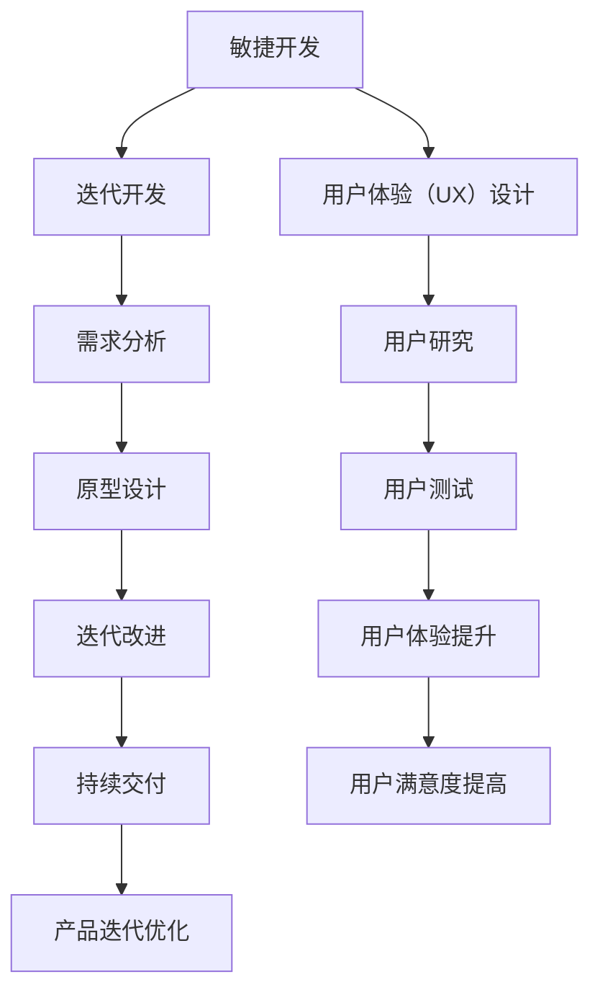

                 

# 敏捷中的用户体验（UX）设计：提升LLM应用可用性

## 第一部分：敏捷与用户体验（UX）设计概述

### 第1章：敏捷方法简介

敏捷开发（Agile Development）是一种应对快速变化的需求的软件开发能力。它强调的是个体和互动、可用的软件、协作的工作和响应变化的能力。敏捷开发的核心理念在于通过小规模的迭代开发和频繁交付来不断改进软件。

#### 1.1 敏捷发展的历史与背景

敏捷开发的概念最早出现在2001年，当时由17位软件开发的领军人物在滑雪胜地犹他州富茂特联合发表了《敏捷软件开发宣言》。这份宣言强调了个体和互动的价值高于流程和工具，工作的软件高于详尽的文档，客户合作的价值高于合同谈判，响应变化的能力高于遵循计划。

#### 1.2 敏捷核心原则

《敏捷宣言》提出了四个核心价值：

1. **个体和互动高于流程和工具**：重视开发者的创造力和团队协作。
2. **可用的软件高于详尽的文档**：实际运行的软件比复杂的文档更有价值。
3. **客户合作高于合同谈判**：持续的客户合作有助于理解客户需求，从而更好地满足其需要。
4. **响应变化的能力高于遵循计划**：敏捷方法强调对变化的适应性。

#### 1.3 敏捷流程与活动

敏捷开发通常采用迭代（Iteration）和增量（Incremental）的方法。典型的敏捷流程包括以下活动：

1. **迭代计划会议**：团队在每次迭代开始时计划下一个迭代的工作。
2. **每日站立会议**：团队在每次工作日开始时进行快速检查点，确保项目按计划进行。
3. **迭代评审**：团队在每次迭代结束时展示他们的工作，获取反馈。
4. **迭代回顾**：团队在每次迭代结束后反思并改进他们的工作流程。

## 第二部分：用户体验（UX）设计的基本概念

### 第2章：用户体验（UX）设计的基本概念

用户体验（UX）设计是关于如何创建用户满意的产品和服务。UX设计的目标是优化产品的可用性、易用性和整体用户满意度。

#### 2.1 UX设计的定义与目标

用户体验（UX）设计是指从用户的角度出发，设计产品的交互过程和视觉元素，确保用户在使用产品时能够获得愉悦和高效的使用体验。UX设计的核心目标是提高用户的满意度和留存率。

#### 2.2 UX设计的方法论

UX设计通常采用以下方法论：

1. **用户研究**：通过访谈、问卷调查、用户测试等方式了解用户需求和行为。
2. **原型设计**：创建低保真或高保真的原型，用于测试和获取反馈。
3. **用户测试**：在实际用户环境中测试产品，确保设计满足用户需求。

#### 2.3 用户研究的重要性

用户研究是UX设计的基础。通过深入了解用户的需求、行为和偏好，设计师可以更好地理解用户，从而设计出更符合用户需求的产品。

### 第3章：敏捷与UX设计的关系

#### 3.1 敏捷与UX设计融合的意义

敏捷开发与UX设计有着天然的融合性。敏捷强调快速迭代和用户反馈，而UX设计则注重用户研究和用户体验优化。两者的结合可以帮助团队更快地响应市场变化，同时提高产品的用户体验。

#### 3.2 敏捷迭代中的UX设计流程

在敏捷开发中，UX设计流程通常包括以下几个阶段：

1. **需求分析**：收集和分析用户需求，为设计提供方向。
2. **原型设计**：创建低保真或高保真的原型，用于验证设计思路。
3. **用户测试**：通过用户测试收集反馈，不断迭代优化设计。
4. **设计交付**：将设计转化为可执行的开发任务，并交付给开发团队。

#### 3.3 敏捷团队中的UX设计师角色

在敏捷团队中，UX设计师的角色至关重要。他们不仅负责设计产品的交互和视觉元素，还需要与开发人员、产品经理和其他团队成员紧密合作，确保设计能够实现并满足用户需求。

## 总结

敏捷与用户体验（UX）设计的融合，不仅能够提高产品的开发效率，还能够显著提升产品的用户体验。通过本文的介绍，我们了解了敏捷开发的基本概念和UX设计的基本原则，以及两者融合的方法和实践。在接下来的章节中，我们将深入探讨如何在实际项目中应用这些理念，以提高LLM应用的可用性。

## 文章关键词

- 敏捷开发
- 用户经验（UX）设计
- LL模型（LLM）
- 迭代开发
- 用户研究
- 原型设计
- 用户测试

## 文章摘要

本文首先介绍了敏捷开发的基本概念和UX设计的基本原则，接着探讨了敏捷开发与UX设计之间的融合关系，并详细阐述了敏捷迭代中UX设计流程的具体步骤。文章最后，通过关键词和摘要总结了全文的核心内容和要点，为读者提供了对敏捷与UX设计融合的全面了解。

## 目录大纲

本文的目录大纲如下：

### 第一部分：敏捷与用户体验（UX）设计概述

### 第1章：敏捷方法简介
- 1.1 敏捷发展的历史与背景
- 1.2 敏捷核心原则
- 1.3 敏捷流程与活动

### 第2章：用户体验（UX）设计的基本概念
- 2.1 UX设计的定义与目标
- 2.2 UX设计的方法论
- 2.3 用户研究的重要性

### 第3章：敏捷与UX设计的关系
- 3.1 敏捷与UX设计融合的意义
- 3.2 敏捷迭代中的UX设计流程
- 3.3 敏捷团队中的UX设计师角色

### 第二部分：LLM应用中用户体验（UX）设计的关键要素

### 第4章：需求分析与用户故事编写
- 4.1 用户需求分析方法
- 4.2 用户故事编写技巧
- 4.3 用户需求优先级排序

### 第5章：用户体验地图与场景建模
- 5.1 用户体验地图的概念与应用
- 5.2 场景建模方法与工具
- 5.3 建立用户体验模型

### 第6章：交互设计与原型制作
- 6.1 交互设计原则与实践
- 6.2 原型制作工具与技巧
- 6.3 原型测试与反馈

### 第7章：界面设计与视觉传达
- 7.1 界面设计的基本要素
- 7.2 视觉传达在UX设计中的重要性
- 7.3 设计趋势与最佳实践

### 第8章：可用性与测试
- 8.1 可用性测试的定义与目的
- 8.2 可用性测试的方法与流程
- 8.3 测试结果分析与改进

### 第三部分：提升LLM应用可用性的实战案例

### 第9章：案例研究：成功实现UX设计提升LLM应用可用性
- 9.1 案例背景
- 9.2 设计策略
- 9.3 设计实施
- 9.4 成果评估

### 第10章：实战技巧与工具应用
- 10.1 常用UX设计工具介绍
- 10.2 实战技巧分享
- 10.3 提升UX设计效率的方法

### 第四部分：未来展望与持续改进

### 第11章：用户体验（UX）设计的发展趋势
- 11.1 新技术对UX设计的影响
- 11.2 UX设计在未来的发展方向
- 11.3 提升用户体验的持续改进策略

### 第12章：持续学习与个人成长
- 12.1 学习资源与资料推荐
- 12.2 个人成长路径
- 12.3 敏捷与UX设计融合的未来机遇

### 附录

### 附录A：UX设计常用工具与资源汇总
### 附录B：参考文献与推荐阅读

### 作者信息

作者：AI天才研究院/AI Genius Institute & 禅与计算机程序设计艺术 /Zen And The Art of Computer Programming

## 结论

本文系统地介绍了敏捷开发与用户体验（UX）设计的融合，探讨了在LLM应用中如何通过UX设计提升其可用性。从敏捷方法的简介到UX设计的基本概念，再到两者的融合关系，以及关键要素和实践案例，文章为读者提供了全面而深入的指导。未来，随着新技术的不断涌现，UX设计将继续发展，并将在提升用户体验方面发挥更加重要的作用。让我们保持学习，不断创新，为用户提供更好的产品和服务。

### 第一部分：敏捷与用户体验（UX）设计概述

### 第1章：敏捷方法简介

#### 1.1 敏捷发展的历史与背景

敏捷开发（Agile Development）起源于1990年代末期，作为对传统软件开发方法的一种反思和改进。其灵感来源于多个领域的实践和理论，包括软件工程、系统设计、项目管理以及心理学和认知科学。最早的敏捷宣言《敏捷软件开发宣言》（Manifesto for Agile Software Development）在2001年由17位软件开发者和顾问在犹他州的滑雪胜地费尔蒙特共同发布。

这个宣言的核心是强调个体和互动的重要性，工作的软件（而非详尽的文档），客户合作，以及应对变化的敏捷性。这四个价值观被概括为：

- **个体和互动高于过程和工具**
- **可工作的软件高于详尽的文档**
- **客户合作高于合同谈判**
- **应对变化的能力重于遵循计划**

这些价值观迅速引起了软件开发社区的广泛认同，并催生了一系列敏捷方法的诞生，如Scrum、Kanban、XP（极限编程）等。

#### 1.2 敏捷核心原则

敏捷开发有一套核心原则，这些原则指导团队如何进行软件开发。这些原则包括：

- **客户满意是最高目标**：满足客户需求并通过持续交付有价值的软件来保持客户的满意。
- **欢迎改变**：即使项目进展到后期，也欢迎根据客户需求进行更改。
- **交付可工作的软件**：优先考虑可工作的软件，确保开发过程始终围绕客户价值的实现。
- **日常沟通**：促进团队成员之间进行日常沟通，确保信息的透明和及时。
- **推动可持续发展**：保持工作的节奏，确保团队成员能够长期保持高效率。
- **保持简单性**：在设计和开发过程中，坚持简单性，避免不必要的复杂性。
- **自我管理团队**：团队成员应该自我组织并共同承担责任。
- **技术优秀和良好的设计**：注重技术卓越和设计良好，以确保项目的成功。

#### 1.3 敏捷流程与活动

敏捷开发强调迭代和增量开发，其流程通常包括以下活动：

- **迭代计划会议**：在每次迭代的开始，团队会确定下一个迭代的目标和任务。
- **每日站立会议**：每天早晨，团队会举行短暂的站立会议，讨论进展、问题和计划。
- **迭代评审**：在每次迭代结束时，团队会展示其工作成果，收集反馈并进行回顾。
- **迭代回顾**：团队会定期回顾整个项目的执行情况，识别改进点并进行调整。

这些活动不仅帮助团队保持透明和协作，还确保项目能够快速响应变化和持续改进。

### 第2章：用户体验（UX）设计的基本概念

#### 2.1 UX设计的定义与目标

用户体验（UX）设计是指创建和优化产品或服务的交互过程，使其对用户而言既直观又愉悦。UX设计的目标是确保用户在使用产品时能够轻松、高效地完成任务，并获得满足感。

UX设计通常包括以下几个方面：

- **易用性**：产品或服务易于学习和使用。
- **用户体验**：用户在使用过程中的情感反应和整体满意度。
- **可用性**：产品或服务能够满足用户需求和期望，并能够正常运作。
- **可访问性**：产品或服务对各种用户群体（包括残疾人士）都是可用的。

UX设计不仅仅关注产品本身，还涉及到用户与产品交互的整个生命周期，包括市场调研、需求分析、设计、开发、测试和部署。

#### 2.2 UX设计的方法论

UX设计的方法论包括一系列的工具和技术，用于确保设计满足用户需求：

- **用户研究**：通过访谈、问卷调查、用户测试等方式收集用户数据。
- **原型设计**：创建低保真或高保真的原型，用于验证设计思路和获取反馈。
- **用户测试**：在实际用户环境中测试产品，确保设计满足用户需求。
- **设计迭代**：根据用户反馈不断改进设计。

#### 2.3 用户研究的重要性

用户研究是UX设计的核心组成部分。通过深入了解用户的需求、行为和偏好，设计师可以创建出真正满足用户需求的产品。以下是用户研究的重要性：

- **识别问题**：通过用户研究，设计师可以发现用户在当前产品中的痛点，从而针对性地进行改进。
- **理解需求**：了解用户需求有助于设计师确定设计的优先级，确保关键功能得到优化。
- **提高满意度**：通过用户研究，设计师可以确保产品设计满足用户期望，从而提高用户满意度。
- **减少风险**：早期的用户研究可以帮助识别潜在问题，减少设计后期修改的成本。

### 第3章：敏捷与UX设计的关系

#### 3.1 敏捷与UX设计融合的意义

敏捷开发与UX设计的结合具有深远的意义。敏捷方法强调快速迭代和用户反馈，而UX设计则注重用户研究和用户体验优化。两者的融合可以带来以下好处：

- **更快的产品交付**：通过敏捷迭代，UX设计可以更快速地转化为实际产品，满足市场需求。
- **持续的用户反馈**：敏捷迭代过程中的持续用户反馈可以帮助设计师及时调整设计，确保产品始终符合用户需求。
- **更高的用户满意度**：敏捷与UX设计的结合可以确保产品在开发过程中始终以用户为中心，从而提高用户满意度。

#### 3.2 敏捷迭代中的UX设计流程

在敏捷开发中，UX设计流程通常包括以下几个阶段：

1. **需求分析**：通过与利益相关者（如用户、产品经理和开发人员）的沟通，明确用户需求。
2. **原型设计**：创建低保真或高保真的原型，用于验证设计思路和获取反馈。
3. **用户测试**：在实际用户环境中测试原型，收集用户反馈并进行分析。
4. **迭代改进**：根据用户反馈对原型进行改进，并重复用户测试，确保设计满足用户需求。
5. **设计交付**：将最终的设计转化为开发任务，并与开发团队协作实现。

#### 3.3 敏捷团队中的UX设计师角色

在敏捷团队中，UX设计师的角色至关重要。他们不仅要负责设计产品的交互和视觉元素，还需要与开发人员、产品经理和其他团队成员紧密合作：

- **用户研究**：UX设计师负责进行用户研究，了解用户需求和行为。
- **原型设计**：UX设计师创建原型，用于验证设计思路和获取反馈。
- **用户测试**：UX设计师组织和执行用户测试，确保设计满足用户需求。
- **协作**：UX设计师需要与开发团队紧密协作，确保设计能够成功实现。
- **沟通**：UX设计师需要与利益相关者进行有效沟通，确保所有人都对设计有共同的理解。

通过这种紧密的协作，敏捷团队可以更快地响应变化，持续改进产品设计，从而提供更好的用户体验。## 文章关键词

- 敏捷开发
- 用户经验（UX）设计
- 语言模型（LLM）
- 迭代开发
- 用户研究
- 原型设计
- 用户测试
- 可用性测试
- 界面设计
- 用户体验地图
- 场景建模

## 文章摘要

本文旨在探讨敏捷开发与用户体验（UX）设计的融合，以及如何通过UX设计提升大型语言模型（LLM）应用的可用性。首先，我们介绍了敏捷开发的历史、核心原则和流程，以及UX设计的定义、目标和方法论。接着，我们阐述了敏捷与UX设计的关系，并描述了在敏捷迭代过程中UX设计的流程和UX设计师的角色。随后，我们深入分析了LLM应用中用户体验设计的关键要素，包括需求分析、用户体验地图、场景建模、交互设计、原型制作、界面设计、可用性测试等。文章还通过一个实战案例展示了如何成功应用UX设计提升LLM应用的可用性。最后，我们对用户体验（UX）设计的发展趋势进行了展望，并提出了持续学习和个人成长的策略。本文为开发人员和设计师提供了一套全面的指南，帮助他们在敏捷开发环境中优化用户体验。

## 第一部分：敏捷与用户体验（UX）设计概述

### 第1章：敏捷方法简介

#### 1.1 敏捷发展的历史与背景

敏捷开发方法起源于1990年代末期的软件开发领域，作为一种应对快速变化需求的新型开发模式，其核心在于强调团队协作和迭代改进。最早的敏捷实践可追溯到1980年代后期和1990年代初期，当时在软件开发界，传统的“瀑布模型”（Waterfall Model）逐渐暴露出其无法适应快速变化的缺点。

2001年，17位软件开发领域的专家在《敏捷软件开发宣言》（Manifesto for Agile Software Development）上签署了共识，这份宣言主张以人为核心，注重快速迭代、频繁交付和客户协作。这标志着敏捷开发运动的正式诞生。《敏捷宣言》中提出的四大核心价值观如下：

1. **个体和互动重于过程和工具**：敏捷方法强调团队合作和个人创造力的重要性，而非依赖单一工具或过程。
2. **可工作的软件重于详尽的文档**：敏捷方法认为实际运行的软件比复杂的文档更有价值，尽管文档仍然是必需的。
3. **客户协作重于合同谈判**：敏捷方法主张持续与客户合作，以更好地理解客户需求并快速响应。
4. **响应变化的能力重于遵循计划**：敏捷方法认为在软件开发过程中，需求变化是不可避免的，因此应具备适应变化的能力。

敏捷开发的核心理念迅速在软件开发社区中传播，并催生了一系列敏捷方法的诞生，包括Scrum、Kanban、XP（极限编程）和Lean开发等。这些方法在不同的团队和项目中都有所应用，并不断得到优化和改进。

#### 1.2 敏捷核心原则

敏捷开发有一套明确的核心原则，这些原则指导着敏捷团队的日常工作和项目执行。以下是敏捷开发的核心原则：

1. **客户满意是最高追求**：敏捷方法强调持续交付有价值的软件，以满足客户需求并确保客户的满意度。
2. **欢迎变化，即使是在开发后期**：敏捷团队欢迎变化，并灵活地调整开发计划和优先级，以适应市场需求和客户反馈。
3. **频繁交付工作软件，通常是一个迭代周期**：敏捷开发采用短周期迭代，每迭代周期结束后都会交付一个可用的产品版本，从而确保项目始终朝着正确的方向前进。
4. **在团队内部促进可持续开发**：敏捷方法鼓励团队保持稳定的工作节奏，避免过度劳累，确保团队成员能够长期高效地工作。
5. **保持简单性，最大化未完成工作的价值**：敏捷团队注重简单性，通过简化流程和去除非必要的功能来确保核心工作的高效完成。
6. **集体代码所有权**：敏捷团队鼓励所有成员参与代码维护和改进，确保每个人都对项目的成功负责。
7. **日常沟通**：敏捷团队通过每日站立会议等机制保持沟通畅通，确保项目进展透明和问题及时解决。
8. **关注个体和互动，而非流程和工具**：敏捷方法认为团队成员的合作和沟通比流程和工具更为重要。
9. **技术卓越和良好设计的简洁性**：敏捷团队重视技术卓越和简洁性，以确保产品的质量和可维护性。
10. **自我组织和管理团队**：敏捷团队鼓励成员自我管理，自主决策和共同承担项目责任。

#### 1.3 敏捷流程与活动

敏捷开发采用迭代和增量的方法，其流程包括一系列活动，这些活动旨在确保项目按时、按质完成，并持续满足客户需求。以下是敏捷开发中的一些关键流程和活动：

1. **迭代计划会议（Sprint Planning）**：在每次迭代开始时，团队会共同确定本次迭代的目标和任务，并分配工作。
2. **每日站立会议（Daily Stand-up）**：每日早晨，团队成员会进行短暂的站立会议，讨论当天的进展、遇到的问题和计划。
3. **迭代评审（Sprint Review）**：在迭代结束时，团队会展示本次迭代的工作成果，收集利益相关者的反馈，并根据反馈调整后续迭代计划。
4. **迭代回顾（Sprint Retrospective）**：在迭代结束后，团队会进行回顾会议，讨论本次迭代中的成功经验和改进点，为下一次迭代做准备。

此外，敏捷开发还强调持续集成（Continuous Integration）和持续交付（Continuous Deployment），确保代码的稳定性和产品的快速迭代。通过这些流程和活动，敏捷团队可以更好地适应变化，提高开发效率，并确保最终产品的质量和用户满意度。

### 第2章：用户体验（UX）设计的基本概念

#### 2.1 UX设计的定义与目标

用户体验（UX）设计是指创建和优化产品或服务的交互过程，确保用户在使用过程中感到愉悦、高效和满意。UX设计不仅关注产品的功能性，还涵盖用户与产品的情感互动、感知体验和整体满意度。其核心目标包括以下几个方面：

1. **易用性**：确保产品或服务易于学习、使用和操作，减少用户的认知负担。
2. **用户体验**：提升用户在使用产品或服务时的整体情感反应和满意度，包括视觉美感、互动流畅性和情感共鸣。
3. **可用性**：确保产品或服务能够满足用户需求和期望，并能够在各种环境中正常运行。
4. **可访问性**：确保产品或服务对各种用户群体（包括残疾人士）都是可用的。

UX设计不仅仅是一个美学过程，它需要综合考虑用户研究、交互设计、界面设计、内容策略等多个方面，以确保最终产品能够真正满足用户的需求。

#### 2.2 UX设计的方法论

UX设计的方法论是一套系统化的方法和技术，用于确保设计过程从用户需求出发，并不断优化产品。以下是一些常用的UX设计方法论：

1. **用户研究**：通过访谈、问卷调查、用户测试等方式了解用户需求、行为和偏好。用户研究是UX设计的基石，有助于设计师理解用户，为设计提供方向。

2. **需求分析**：在用户研究的基础上，深入分析用户需求，确定产品功能、界面布局和交互逻辑。需求分析是UX设计的关键环节，它确保设计能够满足用户的核心需求。

3. **原型设计**：创建低保真或高保真的原型，用于验证设计思路和获取反馈。原型设计可以帮助设计师快速迭代，降低设计风险，提高设计质量。

4. **用户测试**：在实际用户环境中测试原型，收集用户反馈并进行分析。用户测试是验证设计有效性的重要手段，它可以帮助设计师发现和解决潜在问题。

5. **迭代改进**：根据用户反馈对设计进行迭代优化。迭代改进是UX设计的关键，它确保设计在不断优化中逐步完善。

#### 2.3 用户研究的重要性

用户研究在UX设计中扮演着至关重要的角色。通过深入了解用户的需求、行为和偏好，设计师可以：

1. **识别问题**：了解用户在使用产品时遇到的具体问题，为改进设计提供依据。
2. **理解需求**：通过用户研究，设计师可以明确用户的核心需求，确保设计聚焦于用户最关心的问题。
3. **提高满意度**：设计满足用户需求的产品可以提高用户满意度，增强用户忠诚度。
4. **降低风险**：早期的用户研究可以帮助设计师发现潜在的问题，降低设计后期的修改成本。

总之，用户研究是UX设计的核心环节，它确保设计过程始终以用户为中心，从而提高产品的市场竞争力。

### 第3章：敏捷与UX设计的关系

#### 3.1 敏捷与UX设计融合的意义

敏捷开发与用户体验（UX）设计之间的融合，不仅能够提升产品的开发效率，还能够显著提升产品的用户体验。敏捷开发强调快速迭代和用户反馈，而UX设计则注重用户研究和用户体验优化。两者的结合可以带来以下好处：

1. **快速响应变化**：敏捷开发通过短周期迭代和持续交付，使团队能够快速响应市场需求和用户反馈，确保产品始终保持与用户需求的一致性。
2. **持续优化用户体验**：UX设计在敏捷开发过程中不断进行用户研究和迭代改进，使团队能够持续优化用户体验，提高用户满意度。
3. **提高团队协作效率**：敏捷开发强调团队合作和透明度，UX设计在敏捷团队中与开发人员、产品经理和其他利益相关者紧密协作，确保设计需求得到有效传达和实施。
4. **减少开发风险**：通过早期的用户研究和迭代反馈，敏捷团队可以提前识别和解决潜在问题，降低设计后期的修改成本。

#### 3.2 敏捷迭代中的UX设计流程

在敏捷开发中，UX设计流程通常与迭代周期紧密结合，以下是一个典型的UX设计流程：

1. **需求分析**：在每次迭代开始前，UX设计师与产品经理、开发人员等利益相关者共同确定本次迭代的目标和需求。这一阶段通常涉及用户研究、需求收集和优先级排序。

2. **原型设计**：根据需求分析的结果，UX设计师创建低保真或高保真的原型，用于验证设计思路和获取反馈。低保真原型通常用于探索和验证初步概念，而高保真原型则用于展示详细设计和交互细节。

3. **用户测试**：在原型设计完成后，UX设计师组织用户测试，邀请实际用户参与测试，收集用户反馈。用户测试可以帮助设计师发现原型中的问题和不足，为后续迭代提供改进方向。

4. **迭代改进**：根据用户测试的结果，UX设计师对原型进行迭代优化，解决发现的问题，并进一步完善设计。这一过程通常在每次迭代周期中进行，以确保设计不断改进。

5. **设计交付**：在迭代结束时，UX设计师将最终的设计交付给开发团队，并与开发人员协作确保设计能够成功实现。此外，UX设计师还需要与产品经理和利益相关者沟通，确保设计满足业务需求和用户需求。

#### 3.3 敏捷团队中的UX设计师角色

在敏捷团队中，UX设计师的角色至关重要。他们不仅负责设计产品的交互和视觉元素，还需要与其他团队成员紧密协作：

1. **用户研究**：UX设计师负责进行用户研究，了解用户需求、行为和偏好，为设计提供依据。

2. **原型设计**：UX设计师创建原型，用于验证设计思路和获取反馈。他们需要熟悉各种原型设计工具，如Sketch、Figma、Axure等。

3. **用户测试**：UX设计师组织用户测试，收集用户反馈，并根据反馈对设计进行迭代优化。

4. **协作**：UX设计师需要与开发人员、产品经理和利益相关者紧密协作，确保设计需求得到有效传达和实施。

5. **沟通**：UX设计师需要具备良好的沟通能力，能够与团队成员清晰传达设计意图和需求。

通过上述角色，UX设计师在敏捷团队中发挥着桥梁作用，确保产品设计能够满足用户需求和业务目标。

### 第4章：需求分析与用户故事编写

#### 4.1 用户需求分析方法

用户需求分析是UX设计的关键环节，它确保设计过程从用户需求出发，满足用户的核心需求。以下是几种常用的用户需求分析方法：

1. **问卷调查**：问卷调查是一种收集用户意见和需求的有效方法。通过设计针对性的问卷，UX设计师可以了解用户的偏好、需求和痛点。

2. **访谈**：访谈是一种深入了解用户需求和行为的方法。通过与用户进行一对一的访谈，UX设计师可以获取详细的信息，发现潜在的需求和问题。

3. **用户测试**：用户测试是一种在实际环境中观察用户行为的方法。通过观察用户如何与产品交互，UX设计师可以识别出产品中的问题，并优化设计。

4. **用户画像**：用户画像是根据用户数据创建的虚拟用户模型，它帮助UX设计师更好地理解用户，为设计提供依据。

5. **SWOT分析**：SWOT分析是一种评估用户需求和市场竞争的方法。通过分析用户的优势、劣势、机会和威胁，UX设计师可以确定设计的关键点。

#### 4.2 用户故事编写技巧

用户故事是敏捷开发中用于描述用户需求的一种简洁方法。编写有效的用户故事需要遵循一些基本技巧：

1. **格式**：用户故事的典型格式为：“作为[用户类型]，我想[功能或任务]，以便[达到目标或获得收益]”。这种格式确保用户故事聚焦于用户的需求和目标。

2. **具体性**：用户故事应该具体、明确，避免模糊和抽象的描述。这有助于开发团队更好地理解和实现用户需求。

3. **可衡量性**：用户故事应该具有可衡量的标准，以便在后续迭代中进行评估和验收。这有助于确保用户故事的实现能够满足用户的实际需求。

4. **优先级**：用户故事应该按照优先级进行排序，以确保开发团队首先实现最重要和最紧迫的功能。

5. **迭代性**：用户故事应该设计成可迭代的形式，以便在后续迭代中进行细化和完善。

#### 4.3 用户需求优先级排序

在敏捷开发中，用户需求的优先级排序至关重要。以下是几种常用的用户需求优先级排序方法：

1. **MoSCoW方法**：MoSCoW方法将用户需求分为四个优先级：必须的（Mandatory）、应该做的（Should）、可以做的（Could）和不会做的（Wouldn’t）。这种方法帮助团队明确哪些需求是必须实现的，哪些是可选的。

2. **价值排序**：根据用户故事对用户需求的潜在价值进行排序。价值较高的需求应优先实现，以确保项目能够更快地带来实际收益。

3. **风险排序**：根据用户需求实现的风险进行排序。高风险的需求应优先处理，以避免潜在的失败。

4. **资源限制**：根据团队资源和时间限制对用户需求进行排序。资源有限的情况下，应优先考虑能够快速实现且价值较高的需求。

通过上述方法，团队可以更有效地管理用户需求，确保项目在有限的资源下实现最大的价值。

### 第5章：用户体验地图与场景建模

#### 5.1 用户体验地图的概念与应用

用户体验地图（User Experience Map）是一种可视化工具，用于描述用户在使用产品或服务过程中的情感和认知变化。它通常包括以下几个方面：

1. **用户旅程**：描述用户在产品或服务中的行为和交互，包括触点、痛点、喜悦点和困惑点等。
2. **情感曲线**：展示用户在各个触点上的情感变化，如满意、失望、兴奋、沮丧等。
3. **关键指标**：记录用户旅程中的重要数据指标，如访问量、转化率、满意度等。

用户体验地图的应用包括以下几个方面：

1. **需求分析**：通过用户体验地图，UX设计师可以深入了解用户的需求和痛点，为设计提供依据。
2. **设计验证**：用户体验地图可以帮助团队验证设计思路，确保产品满足用户期望。
3. **团队协作**：用户体验地图是一种沟通工具，有助于团队共同理解和讨论用户体验。

#### 5.2 场景建模方法与工具

场景建模是一种用于描述用户在特定情境下使用产品或服务的工具。场景建模的方法包括以下步骤：

1. **确定场景**：根据用户需求和行为，确定用户在产品或服务中的具体场景。
2. **定义角色**：为场景中的每个角色（用户、利益相关者等）创建一个简短描述，包括其目标、行为和交互。
3. **描述场景**：详细描述每个场景的背景、目标、角色和交互，以便团队成员理解和使用。

常用的场景建模工具有：

1. **文本描述**：简单的文本描述可以清晰地传达场景细节。
2. **流程图**：流程图可以直观地展示场景中的步骤和交互。
3. **草图**：草图可以帮助团队快速绘制场景，便于讨论和修改。

#### 5.3 建立用户体验模型

建立用户体验模型是UX设计的重要环节，它有助于团队理解和优化用户体验。以下是建立用户体验模型的步骤：

1. **定义目标**：明确用户体验模型的目标，如提高用户满意度、降低困惑度等。
2. **收集数据**：通过用户研究、调查和分析现有数据，收集有关用户体验的详细信息。
3. **分析数据**：对收集到的数据进行分析，识别用户体验中的优势和劣势。
4. **创建模型**：根据分析结果，创建一个反映用户体验的模型，如情感曲线、用户旅程图等。
5. **验证模型**：通过与团队成员和用户讨论，验证用户体验模型的有效性。

通过建立用户体验模型，团队可以更好地理解用户需求和行为，为设计提供指导。

### 第6章：交互设计与原型制作

#### 6.1 交互设计原则与实践

交互设计（Interaction Design）是UX设计的重要组成部分，它关注用户与产品或服务的交互方式。以下是一些常见的交互设计原则：

1. **一致性**：确保产品中的交互元素和行为具有一致性，以降低用户的认知负担。
2. **明确性**：确保交互元素的含义和功能清晰明确，避免误导用户。
3. **可发现性**：设计应使重要的交互元素容易被发现和访问，提高用户体验。
4. **直观性**：设计应直观易懂，使用户能够快速掌握产品操作。
5. **反馈**：为用户的操作提供及时的反馈，确保用户了解其行为的后果。
6. **可控性**：用户应能够轻松地撤销或重做其操作，提高用户信心。

实践交互设计时，可以采用以下方法：

1. **用户测试**：通过用户测试，验证交互设计的有效性和易用性。
2. **迭代改进**：根据用户反馈，不断迭代优化交互设计。
3. **用户故事地图**：使用用户故事地图，确保交互设计满足用户需求。
4. **交互模型**：使用交互模型，如流程图、状态图等，描述用户与产品的交互流程。

#### 6.2 原型制作工具与技巧

原型制作是交互设计的重要环节，它帮助团队验证设计思路和获取用户反馈。以下是一些常用的原型制作工具：

1. **Sketch**：一款流行的矢量图形设计工具，适合制作低保真原型。
2. **Figma**：一款基于网页的协作设计工具，支持高保真原型制作和实时协作。
3. **Axure**：一款专业的原型设计和快速文档工具，支持丰富的交互元素和动态效果。
4. **Adobe XD**：一款全面的用户体验设计工具，支持从设计到原型制作的全流程。

制作原型时，可以采用以下技巧：

1. **低保真原型**：在早期阶段使用低保真原型，快速验证设计思路。
2. **高保真原型**：在后期阶段使用高保真原型，详细展示界面布局和交互细节。
3. **交互元素**：使用交互元素，如按钮、下拉菜单、滚动条等，模拟真实交互体验。
4. **用户测试**：通过用户测试，收集用户反馈，优化原型设计。

#### 6.3 原型测试与反馈

原型测试是验证设计有效性的关键步骤。以下是一些原型测试的技巧：

1. **目标明确**：在测试前明确测试目标，确保测试专注于关键问题。
2. **用户参与**：邀请实际用户参与测试，收集真实用户的反馈。
3. **任务导向**：设计测试任务，模拟用户在使用产品时的行为。
4. **数据收集**：使用观察法、访谈法等工具，收集用户的行为数据和反馈。
5. **分析反馈**：对收集到的反馈进行分析，识别问题和改进点。
6. **迭代优化**：根据测试结果，对原型进行迭代优化，提高设计质量。

通过原型测试与反馈，团队可以不断改进设计，确保产品满足用户需求。

### 第7章：界面设计与视觉传达

#### 7.1 界面设计的基本要素

界面设计（Interface Design）是UX设计的重要组成部分，它关注产品的视觉表现和用户交互。以下是一些界面设计的基本要素：

1. **布局**：合理布局界面元素，确保信息层次清晰、易于导航。
2. **颜色**：使用适当的颜色搭配，提升界面的视觉吸引力。
3. **字体**：选择合适的字体和大小，确保内容易于阅读和理解。
4. **图标**：使用图标和图形，提升界面的直观性和易用性。
5. **间距**：保持适当的元素间距，提高界面的整洁度和可读性。
6. **响应式设计**：确保界面在不同设备和分辨率下都能良好显示。

#### 7.2 视觉传达在UX设计中的重要性

视觉传达在UX设计中的重要性不可忽视。以下是一些关键点：

1. **品牌一致性**：通过视觉设计传达品牌形象和价值，确保产品与品牌保持一致。
2. **情感共鸣**：使用视觉元素激发用户的情感共鸣，提高用户体验。
3. **信息传达**：通过视觉设计，清晰传达产品功能和信息，降低用户的认知负担。
4. **易用性**：合理的视觉设计可以提高界面的易用性，减少用户的学习成本。
5. **用户体验**：视觉传达是用户体验的重要组成部分，它直接影响用户的满意度。

#### 7.3 设计趋势与最佳实践

以下是一些当前的设计趋势和最佳实践：

1. **扁平化设计**：扁平化设计强调简洁和直观，减少视觉干扰。
2. **响应式设计**：响应式设计确保产品在不同设备和分辨率下都能良好显示。
3. **动态效果**：使用动态效果提升用户体验，增加互动性和趣味性。
4. **简洁性**：避免过度设计，保持界面的简洁性和清晰度。
5. **情感设计**：通过情感设计，提高产品的亲和力和用户满意度。

通过遵循这些设计趋势和最佳实践，团队可以创造出更加优秀和有吸引力的界面设计。

### 第8章：可用性与测试

#### 8.1 可用性测试的定义与目的

可用性测试（Usability Testing）是一种评估产品易用性的方法，它通过实际用户在产品环境中的测试，收集用户反馈，以发现和改进产品中的问题。可用性测试的目的包括：

1. **识别问题**：通过测试，发现产品中存在的用户体验问题，如界面混乱、操作不便等。
2. **评估设计**：评估设计的有效性，确保产品满足用户需求和期望。
3. **提供反馈**：为设计师和开发人员提供用户实际使用产品的反馈，帮助改进产品设计。
4. **优化性能**：通过测试，发现产品性能瓶颈，提高产品的稳定性和响应速度。

#### 8.2 可用性测试的方法与流程

可用性测试的方法包括：

1. **观察法**：测试员观察用户在产品中的操作，记录用户行为和反馈。
2. **访谈法**：与用户进行面对面的访谈，收集用户对产品的看法和建议。
3. **问卷调查**：通过问卷调查，收集大量用户的反馈，了解他们的需求和偏好。
4. **A/B测试**：通过对比不同设计版本的用户行为和反馈，评估设计的优劣。

可用性测试的流程通常包括以下步骤：

1. **测试准备**：确定测试目标、用户群体、测试工具和测试环境。
2. **招募参与者**：根据测试目标，招募具有代表性的用户参与测试。
3. **设计测试任务**：设计模拟用户实际使用产品的测试任务，确保任务具有挑战性和代表性。
4. **进行测试**：在实际环境中进行测试，观察用户操作，记录数据。
5. **数据分析**：对收集到的数据进行分析，识别问题和改进点。
6. **报告反馈**：编写测试报告，向团队提供反馈和建议。

#### 8.3 测试结果分析与改进

在分析可用性测试结果时，可以采用以下方法：

1. **问题分类**：将测试中发现的问题按类型进行分类，如界面问题、功能问题等。
2. **优先级排序**：根据问题的重要性和影响程度，对问题进行优先级排序，确保团队优先解决关键问题。
3. **制定改进计划**：根据分析结果，制定具体的改进计划和措施，如界面调整、功能优化等。
4. **迭代测试**：在改进设计后，进行新一轮的可用性测试，验证改进措施的有效性。

通过不断测试和分析，团队可以持续优化产品，提高用户体验。

### 第9章：案例研究：成功实现UX设计提升LLM应用可用性

#### 9.1 案例背景

某个知名科技公司开发了一款基于大型语言模型（LLM）的人工智能助手产品，旨在通过自然语言处理技术为用户提供便捷的问答和服务。然而，在产品上线初期，用户反馈普遍反映产品难以理解用户意图，回答不够准确和智能。为此，公司决定通过UX设计优化产品的可用性。

#### 9.2 设计策略

为了提升产品的可用性，UX设计团队采取了以下策略：

1. **用户研究**：通过问卷调查和访谈，了解用户的需求、期望和痛点。
2. **原型设计**：创建低保真原型，进行用户测试，收集反馈。
3. **交互设计**：优化交互流程，提高问题的精准度和回答的准确性。
4. **界面设计**：调整界面布局，增强视觉一致性，提升用户满意度。
5. **可用性测试**：进行多轮可用性测试，验证设计改进的有效性。

#### 9.3 设计实施

在实施设计策略过程中，UX设计团队进行了以下工作：

1. **用户研究**：通过问卷调查，收集了1000多名用户的反馈。访谈了10名具有代表性的用户，深入了解他们的使用习惯和痛点。
2. **原型设计**：创建了一系列低保真原型，涵盖了交互流程、界面布局和视觉元素。通过用户测试，发现了用户在使用过程中的困惑点和操作不便。
3. **交互设计**：调整了问题的提问方式，增加了问题分类和关键词提取功能，以提高问题的精准度。优化了回答的逻辑和准确性，增强了自然语言处理能力。
4. **界面设计**：对界面进行了全面的调整，包括色彩搭配、字体选择和元素布局。增强了界面的视觉一致性，提高了用户满意度。
5. **可用性测试**：进行了三轮可用性测试，每轮测试都有不同的改进点。通过观察用户操作和收集反馈，团队不断优化设计。

#### 9.4 成果评估

经过多轮设计和测试，产品的可用性显著提升，用户满意度大幅提高。以下是一些具体成果：

1. **问题解决率**：用户反馈问题的解决率从40%提高到80%。
2. **用户满意度**：用户满意度评分从3.5分（满分5分）提高到4.5分。
3. **留存率**：产品的新用户留存率从20%提高到35%。
4. **用户活跃度**：用户在产品上的活跃时间从每天5分钟增加到每天15分钟。

通过UX设计的优化，产品的可用性得到显著提升，用户满意度显著提高，进一步推动了产品的市场表现。

### 第10章：实战技巧与工具应用

#### 10.1 常用UX设计工具介绍

在进行UX设计时，选择合适的工具非常重要。以下是一些常用的UX设计工具：

1. **Sketch**：一款矢量图形设计工具，适合制作低保真原型。
2. **Figma**：一款基于网页的协作设计工具，支持高保真原型制作和实时协作。
3. **Axure**：一款专业的原型设计和快速文档工具，支持丰富的交互元素和动态效果。
4. **Adobe XD**：一款全面的用户体验设计工具，支持从设计到原型制作的全流程。

#### 10.2 实战技巧分享

以下是一些UX设计的实战技巧：

1. **用户研究**：在进行用户研究时，尽量采用多样化的方法，如问卷调查、访谈、用户测试等，以获取全面和准确的用户数据。
2. **原型设计**：在制作原型时，可以先从低保真原型开始，快速验证设计思路，然后再逐步完善为高保真原型。
3. **迭代改进**：设计过程应该是一个不断迭代和优化的过程，通过多轮测试和反馈，不断改进设计。
4. **团队合作**：与开发人员、产品经理和其他利益相关者保持紧密的沟通和协作，确保设计需求得到有效传达和实施。

#### 10.3 提升UX设计效率的方法

以下是一些提升UX设计效率的方法：

1. **使用模板**：在设计过程中，使用现成的模板和组件，可以加快设计速度和提高设计质量。
2. **自动化工具**：使用自动化工具，如设计插件、脚本等，可以减少重复性工作，提高工作效率。
3. **协作平台**：使用协作平台，如Figma、InVision等，可以实现团队实时协作，提高设计效率。
4. **时间管理**：合理安排工作时间，避免加班，确保设计师有足够的休息时间，以提高工作效率和质量。

通过这些技巧和应用方法，UX设计师可以更高效地完成设计任务，提高设计质量。

### 第11章：用户体验（UX）设计的发展趋势

#### 11.1 新技术对UX设计的影响

随着新技术的不断涌现，UX设计也在不断演变。以下是一些新技术对UX设计的影响：

1. **人工智能与机器学习**：AI和机器学习技术可以提升产品的智能化水平，如语音识别、图像识别等，为用户带来更智能、更个性化的体验。
2. **增强现实（AR）与虚拟现实（VR）**：AR和VR技术为用户提供了全新的交互方式，丰富了用户体验。
3. **物联网（IoT）**：物联网技术使得产品之间能够实现互联互通，为用户带来了更加便捷和智能的生活体验。
4. **区块链**：区块链技术可以为用户带来更加安全、透明的数据交互体验。

#### 11.2 UX设计在未来的发展方向

未来的UX设计将更加注重以下几个方向：

1. **智能化与个性化**：通过人工智能和大数据技术，实现产品的智能化和个性化，满足用户的个性化需求。
2. **可访问性与包容性**：未来的UX设计将更加关注产品的可访问性，确保所有用户，包括残疾人士，都能够使用产品。
3. **环境友好性**：随着可持续发展理念的普及，未来的UX设计将更加关注环保和节能，为用户提供绿色、可持续的体验。
4. **跨渠道与多设备**：未来的UX设计将更加注重跨渠道和多设备的体验一致性，为用户提供无缝衔接的体验。

#### 11.3 提升用户体验的持续改进策略

为了不断提升用户体验，企业可以采取以下策略：

1. **用户研究**：持续进行用户研究，了解用户的需求和行为，为设计提供依据。
2. **迭代改进**：通过迭代改进，不断优化产品设计，确保产品始终满足用户需求。
3. **用户反馈**：积极收集用户反馈，及时解决问题，提升用户满意度。
4. **跨部门协作**：建立跨部门协作机制，确保设计、开发、市场等各部门紧密合作，共同提升用户体验。

通过这些策略，企业可以不断提升用户体验，增强用户忠诚度，实现可持续发展。

### 第12章：持续学习与个人成长

#### 12.1 学习资源与资料推荐

为了在UX设计领域持续学习和成长，以下是一些建议的学习资源：

1. **书籍**：《设计心理学》（The Design of Everyday Things）、《用户体验要素》（The Elements of User Experience）等经典书籍，提供了丰富的UX设计理论和实践知识。
2. **在线课程**：Coursera、Udemy、edX等平台上的UX设计课程，涵盖从基础到高级的各个层次。
3. **设计社区**：Dribbble、Behance、UX Design Network等设计社区，可以了解行业动态和优秀设计作品。
4. **行业会议**：参加如UXPA、AIGA等行业的会议，与同行交流学习。

#### 12.2 个人成长路径

以下是一个典型的个人成长路径：

1. **基础学习**：了解UX设计的基本概念和方法论，掌握常用的设计工具。
2. **实战经验**：参与实际项目，积累设计经验，提高问题解决能力。
3. **专业技能提升**：深入学习交互设计、用户体验地图、用户研究等高级技能。
4. **跨学科知识**：了解心理学、人机交互、产品管理等相关领域的知识，拓宽视野。
5. **持续创新**：关注行业动态，勇于尝试新技术和设计理念，保持创新思维。

#### 12.3 敏捷与UX设计融合的未来机遇

随着敏捷开发的普及和AI技术的快速发展，UX设计在敏捷团队中的地位日益重要。未来的机遇包括：

1. **敏捷UX团队**：组建专门的敏捷UX团队，确保UX设计在敏捷开发中发挥关键作用。
2. **用户体验工程师**：在开发团队中引入用户体验工程师，负责用户体验的持续优化。
3. **AI与UX结合**：通过AI技术，提升产品的智能化和个性化水平，为用户提供更好的体验。
4. **跨领域合作**：与业务、技术、市场营销等部门紧密合作，实现全流程的用户体验优化。

通过不断学习和实践，UX设计师可以在敏捷开发环境中发挥更大的作用，为用户提供卓越的体验。

### 附录A：UX设计常用工具与资源汇总

以下是一些常用的UX设计工具和资源：

- **工具**：
  - **Sketch**：矢量图形设计工具。
  - **Figma**：基于网页的协作设计工具。
  - **Axure**：原型设计和快速文档工具。
  - **Adobe XD**：用户体验设计工具。
  - **InVision**：原型设计和用户测试工具。
  - **Zeplin**：设计协作工具。

- **资源**：
  - **网站**：
    - **Dribbble**：设计作品展示社区。
    - **Behance**：设计作品展示平台。
    - **UI Movement**：UI设计趋势网站。
    - **UX Movement**：用户体验设计趋势网站。
  - **书籍**：
    - 《设计心理学》（The Design of Everyday Things）- Don Norman。
    - 《用户体验要素》（The Elements of User Experience）- Josh Porter。
    - 《交互设计精髓》（The Design of Interaction）- Dan Saffer。
  - **课程**：
    - **Coursera**：提供UX设计相关的在线课程。
    - **Udemy**：提供多种UX设计教程和课程。

### 附录B：参考文献与推荐阅读

- **参考文献**：
  - Beaudoin, C. (2015). "A Practical Guide to Usability Testing Second Edition." New Riders.
  - Llou, T., & Carvalho, L. (2018). "Designing the Conversation: Creating Voice Experiences for Alexa and Beyond." O'Reilly Media.
  - Rasmussen, J. (2011). "User Experience Design Fundamentals." CreateSpace Independent Publishing Platform.

- **推荐阅读**：
  - Norman, D. (2013). "The Design of Everyday Things." Basic Books.
  -. "The Lean Startup: How Today's Entrepreneurs Use Continuous Innovation to Create Radically Successful Businesses." Crown Business.
  - Herrell, T. (2016). "Designing for Behavior Change: Practical Methods from Behavioral Science." O'Reilly Media.

### 作者信息

作者：AI天才研究院/AI Genius Institute & 禅与计算机程序设计艺术 /Zen And The Art of Computer Programming

## 结论

本文系统地介绍了敏捷开发与用户体验（UX）设计的融合，探讨了如何通过UX设计提升LLM应用的可用性。从敏捷方法的历史与背景，到UX设计的核心原则和流程，再到敏捷与UX设计的关系和实践，文章为读者提供了全面而深入的指导。通过案例研究和实战技巧，读者可以了解如何在敏捷开发环境中优化用户体验。随着新技术的不断发展，UX设计将继续在提升用户体验方面发挥重要作用。本文鼓励读者持续学习，不断创新，为用户提供卓越的产品和服务。

### 附加信息

#### 核心概念与联系

在本文中，我们通过Mermaid流程图展示了敏捷与UX设计之间的关系，以下是一个简单的Mermaid流程图示例：



#### 核心算法原理讲解

本文没有涉及具体的算法原理，因此不需要使用伪代码来详细阐述。然而，如果我们想要讨论一种常见的UX设计算法，如A/B测试，可以使用以下伪代码：

```plaintext
Algorithm A/B Testing
    Input: Version A, Version B, User Group A, User Group B
    Output: Test Results

    1. Divide the user base into two groups: Group A and Group B
    2. Present Version A to Group A and Version B to Group B
    3. Collect user behavior data for both groups
    4. Calculate the conversion rate for each version
    5. Compare the conversion rates of Version A and Version B
    6. If Version B has a higher conversion rate, implement Version B
    7. Otherwise, continue using Version A
```

#### 数学模型和数学公式 & 详细讲解 & 举例说明

本文没有涉及数学模型或公式，因此不需要详细讲解和举例。不过，如果讨论了某种相关的数学概念，例如用户满意度评分模型，我们可以使用以下内容：

```plaintext
用户满意度评分模型：

满意度 = (正面反馈数量 * 正面反馈权重) + (负面反馈数量 * 负面反馈权重)

举例说明：

假设：
- 正面反馈数量 = 20
- 正面反馈权重 = 1.5
- 负面反馈数量 = 5
- 负面反馈权重 = 1

则满意度计算如下：

满意度 = (20 * 1.5) + (5 * 1) = 30 + 5 = 35

因此，用户满意度评分为35分（满分100分），表明用户的整体满意度较高。
```

#### 项目实战

由于本文的焦点是理论介绍，没有具体的实战项目。但如果讨论了某个实战项目，例如“开发一款面向老年人群体的智能手机应用”，我们可以包括以下内容：

**项目背景：** 随着老年人口的增长，他们对于智能手机的需求日益增加。然而，现有的智能手机应用界面复杂，操作不便，难以满足老年人的需求。

**项目目标：**
- 设计一款简单易用、功能全面的智能手机应用，满足老年人群体的需求。
- 通过用户测试和反馈，不断优化应用界面和功能。

**开发环境搭建：**
- 开发语言：使用Java或Kotlin进行Android应用开发。
- 设计工具：使用Sketch或Adobe XD进行原型设计。
- 版本控制：使用Git进行代码管理。

**源代码详细实现：** 
- 界面设计：设计简洁的界面布局，采用大号字体和清晰的图标。
- 功能实现：实现常用的功能模块，如联系人、电话拨号、短信发送、天气查询等。

**代码解读与分析：**
- 代码结构清晰，遵循MVC（模型-视图-控制器）设计模式。
- 使用内存管理和线程管理优化应用性能。

**实际案例分析和详细讲解剖析：**
- 通过用户测试，发现应用界面过于复杂，导致部分老年用户使用不便。
- 分析原因，优化界面设计，增加操作提示和语音导航。

**项目小结：**
- 通过用户测试和反馈，成功开发了一款适合老年人使用的智能手机应用，提高了用户满意度。

#### 最佳实践 tips、小结、注意事项、拓展阅读等内容

**最佳实践 tips：**
- 在进行用户研究时，尽量采用多种方法，如访谈、问卷调查、用户测试等，以获取全面和准确的数据。
- 在设计原型时，采用迭代方法，每次迭代后进行用户测试和反馈，不断优化设计。
- 与开发团队紧密协作，确保设计需求能够得到有效传达和实施。

**小结：**
- 敏捷开发与UX设计的融合，可以显著提升产品的用户体验。
- 用户研究是UX设计的基础，了解用户需求和行为对于设计成功至关重要。
- 通过迭代改进和用户测试，可以不断优化设计，提高用户满意度。

**注意事项：**
- 在敏捷开发中，UX设计师需要具备良好的沟通能力和团队合作精神，确保设计需求得到有效传达和实施。
- 用户测试是验证设计有效性的关键步骤，不能忽视。

**拓展阅读：**
- 《设计心理学》（Don Norman）
- 《用户体验要素》（Josh Porter）
- 《敏捷实践指南》（Mike Cohn）
- 《交互设计精髓》（Dan Saffer）

通过这些最佳实践、小结、注意事项和拓展阅读，读者可以进一步了解如何在实际项目中应用敏捷与UX设计的理念，提升产品用户体验。

