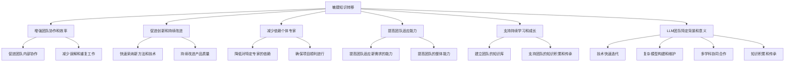

                 

### 文章标题

《敏捷中的知识转移：确保LLM团队的持续学习》

### 文章关键词

敏捷、知识转移、LLM、持续学习、项目实战

### 文章摘要

本文深入探讨了敏捷开发环境中知识转移的重要性，特别是在大型语言模型（LLM）团队中的应用。文章首先介绍了敏捷和知识转移的基本概念，接着阐述了LLM在敏捷团队中的关键角色。随后，文章详细探讨了知识转移的方法和策略，包括内部知识共享和与外部团队的协作。本文还探讨了如何构建持续学习机制，确保LLM团队在不断变化的技术环境中保持竞争力。通过实际案例分析和最佳实践分享，本文为LLM团队提供了实用的指导，以实现高效的知识转移和持续学习。

### 引言和概述

在当今快速发展的技术时代，敏捷开发方法已成为许多软件开发团队的首选。敏捷的核心在于其灵活性和适应性，允许团队迅速响应变化的需求和市场动态。然而，敏捷开发并不只是关于流程和工具，更重要的是如何在团队成员之间高效地传递知识。知识转移是敏捷开发中一个至关重要的环节，它确保了团队的整体能力和效率。

知识转移（Knowledge Transfer）指的是将一个团队、部门或组织内的知识有效地传递到另一个团队或个体。在敏捷环境中，知识转移的意义尤为突出。随着团队成员的流动和项目的迭代，确保知识能够在团队中持续传递和更新，对于保持团队的生产力和创新能力至关重要。

大型语言模型（LLM）是当前人工智能领域的一项重要技术，它们在自然语言处理、文本生成、情感分析等领域展现出了巨大的潜力。LLM团队在敏捷开发中的角色不仅仅是开发出强大的语言模型，更重要的是如何确保团队内部的持续学习和知识共享。LLM具有高度复杂性和动态性，这意味着团队需要不断更新和扩展他们的知识库，以应对新兴的技术趋势和应用场景。

本文的目标是探讨如何在敏捷开发环境中确保LLM团队的持续学习。文章将分为以下几个部分：首先，介绍敏捷和知识转移的基本概念，解释它们在LLM团队中的重要性。然后，详细讨论LLM的基础知识，包括其定义、特点和关键算法。接下来，我们将探讨知识转移的方法和策略，以及如何构建持续学习机制。最后，通过实际案例和最佳实践分享，为LLM团队提供实用的指导和建议。

### 敏捷知识转移背景和意义

敏捷开发（Agile Development）是一种以人为核心、迭代、灵活的软件开发方法。它强调快速反馈、持续改进和团队合作，旨在通过迭代和增量式的方法，迅速响应变化的需求和市场动态。敏捷开发的关键原则包括客户满意度、响应变化、工作软件、持之以恒的沟通、简单性、自我管理团队和可持续发展。

在敏捷开发中，知识转移（Knowledge Transfer）扮演着至关重要的角色。知识转移不仅仅涉及技术知识的传递，还包括项目经验、团队文化和最佳实践。以下是知识转移在敏捷开发中的一些重要意义：

**1. 增强团队协作和效率：**
在敏捷团队中，知识转移有助于团队成员之间的有效沟通和协作。通过知识共享，团队成员可以更快地理解项目目标和需求，减少误解和重复工作，提高整体效率。

**2. 促进创新和持续改进：**
敏捷开发鼓励不断尝试新的方法和技术，知识转移使得团队成员可以快速学习并采纳新的最佳实践。这有助于团队在开发过程中持续改进，提高产品质量。

**3. 减少依赖个体专家：**
知识转移有助于降低对特定个体或专家的依赖。即使关键成员离开团队，其他成员也能够通过知识共享来弥补空缺，确保项目顺利进行。

**4. 提高团队适应能力：**
在快速变化的市场环境中，团队需要具备快速适应新需求和技术的能力。知识转移有助于团队积累丰富的经验，提高其适应性和灵活性。

**5. 支持持续学习和成长：**
知识转移鼓励团队成员不断学习新的知识和技能，这有助于团队整体能力的提升，并支持团队的长远发展。

对于LLM团队来说，知识转移的意义更加显著。LLM技术具有高度复杂性和动态性，团队成员需要不断学习最新的研究成果和技术趋势。以下是一些特定于LLM团队的背景和意义：

**1. 技术快速迭代：**
LLM领域的技术发展非常迅速，新的算法、模型和工具层出不穷。知识转移确保团队能够及时掌握这些新进展，保持技术竞争力。

**2. 复杂模型构建和维护：**
LLM模型的构建和维护是一个复杂的过程，需要团队成员具备多方面的知识和技能。知识转移有助于团队内部共享这些知识，提高整个团队的构建和维护能力。

**3. 多学科协同合作：**
LLM团队通常涉及计算机科学、人工智能、数学等多个学科。知识转移促进团队成员之间的跨学科交流与合作，有助于解决复杂问题。

**4. 知识积累和传承：**
随着团队成员的流动，确保知识能够被有效传承和积累，对于LLM团队的长远发展至关重要。知识转移有助于建立团队的知识库，支持团队的知识积累和传承。

综上所述，敏捷知识转移对于LLM团队至关重要。它不仅提高了团队的整体协作效率，还促进了知识的持续学习和更新，为团队在快速变化的技术环境中保持竞争力提供了坚实的基础。在接下来的部分中，我们将深入探讨LLM的基础知识，包括其定义、特点以及关键算法，为后续的知识转移方法和策略奠定基础。|>



### LLM的基础知识

#### 定义和分类

大型语言模型（Large Language Model，简称LLM）是一类通过大规模文本数据进行预训练的深度神经网络模型，主要用于自然语言处理（Natural Language Processing，简称NLP）任务。LLM的核心功能包括文本生成、文本分类、情感分析、机器翻译等。这些模型能够理解、生成和操作自然语言，从而在多种实际应用场景中发挥重要作用。

根据模型的结构和训练方式，LLM可以分为以下几类：

1. **基于循环神经网络（RNN）的模型：**例如LSTM（Long Short-Term Memory）和GRU（Gated Recurrent Unit），这些模型能够处理变长的序列数据，并具备较好的长期依赖处理能力。

2. **基于变换器（Transformer）的模型：**如BERT（Bidirectional Encoder Representations from Transformers）和GPT（Generative Pre-trained Transformer），这些模型采用注意力机制，能够捕捉长距离的依赖关系，并在大规模数据集上取得了显著的效果。

3. **基于图神经网络的模型：**例如Graph Neural Network（GNN），这类模型通过图结构来表示文本，能够更好地处理文本中的复杂关系。

#### 工作原理

LLM的工作原理主要分为两个阶段：预训练和微调。

1. **预训练：**在预训练阶段，LLM使用大量无标签的文本数据来学习文本的分布和语法规则。这个过程通常采用深度学习技术，特别是基于变换器的模型，如BERT和GPT。预训练的目标是使模型能够生成语义上合理、连贯的文本。

2. **微调：**在预训练完成后，LLM会根据具体任务的需求进行微调。微调过程通常使用有标签的数据，如训练集和验证集。在微调过程中，模型会学习特定任务的特征，并优化其参数，以在目标任务上取得更好的性能。

#### 关键算法和数学模型

LLM的核心算法和数学模型包括以下几个方面：

1. **变换器（Transformer）架构：**变换器架构采用自注意力机制（Self-Attention）和多头注意力（Multi-Head Attention），能够高效地捕捉文本中的长距离依赖关系。其基本结构包括编码器（Encoder）和解码器（Decoder），编码器负责生成上下文表示，解码器则负责生成预测的词语。

2. **位置编码（Positional Encoding）：**为了处理变长的序列数据，变换器架构引入了位置编码（Positional Encoding），通过给每个词语添加位置信息，使得模型能够理解词语在序列中的位置关系。

3. **门控循环单元（Gated Recurrent Unit，GRU）：**GRU是RNN的一种改进模型，通过引入门控机制，能够有效地处理长期依赖关系。GRU包含更新门（Update Gate）和重置门（Reset Gate），这两个门控制信息在序列中的流动。

4. **长短期记忆（Long Short-Term Memory，LSTM）：**LSTM是另一种改进的RNN模型，通过引入记忆单元和门控机制，能够更好地处理长期依赖关系。LSTM的核心是细胞状态（Cell State），通过门控机制控制信息的流动。

#### 伪代码示例

以下是基于变换器架构的BERT模型的简化伪代码：

```python
# 初始化模型参数
model = TransformerModel(vocab_size, hidden_size, num_heads, num_layers)

# 预训练阶段
pretrained_data = load_pretrained_data()
for data in pretrained_data:
    inputs, labels = preprocess_data(data)
    loss = model(inputs, labels)
    optimize(loss)

# 微调阶段
fine_tuning_data = load_fine_tuning_data()
for data in fine_tuning_data:
    inputs, labels = preprocess_data(data)
    loss = model(inputs, labels)
    optimize(loss)
```

#### 总结

大型语言模型（LLM）是自然语言处理领域的重要技术，通过预训练和微调，能够生成语义上合理、连贯的文本。LLM的工作原理基于变换器架构，包括自注意力机制、位置编码、门控循环单元和长短期记忆等核心算法和数学模型。在敏捷开发环境中，LLM团队需要掌握这些基础知识，以构建高效、灵活的文本处理系统，支持敏捷知识转移和持续学习。

### 知识转移方法和策略

在敏捷开发环境中，确保LLM团队的持续学习与高效的知识转移密切相关。知识转移不仅仅是技术知识的传递，还包括经验、团队文化和最佳实践。以下将探讨几种常用的知识转移方法和策略，以及如何在LLM团队内部和与外部团队的协作中实施这些方法。

#### 团内知识转移方法

1. **定期知识分享会：** 团队可以定期举行知识分享会，让团队成员分享他们的经验、新学的技能或遇到的问题。这种方式不仅能够增强团队之间的沟通，还能促进知识的积累和传播。

2. **导师制：** 为新成员分配经验丰富的导师，帮助他们在项目中学习和成长。导师可以提供指导、反馈和资源，加快新成员的融入速度。

3. **内部培训和工作坊：** 团队可以定期举办内部培训和工作坊，专门针对某些技术或主题进行深入讨论和学习。这种方式有助于团队成员不断提升技能水平。

4. **文档和知识库：** 建立一个全面的文档和知识库，记录项目经验、最佳实践和技术文档。团队成员可以随时查阅，确保知识不会随着人员的流动而丢失。

5. **代码审查和结对编程：** 通过代码审查和结对编程，团队成员可以相互学习、交流，并共同解决问题。这种方式有助于团队成员之间的知识共享和技能提升。

#### 团队间知识转移方法

1. **跨团队协作：** 在大型项目中，不同团队可能会负责不同的模块或任务。通过跨团队协作，团队成员可以相互学习、交流和分享知识，提高整体项目效率。

2. **共享平台和工具：** 建立一个共享的平台和工具，如Wiki、论坛或协作软件，让团队成员可以方便地分享信息和资源。这种方式有助于打破信息孤岛，实现知识的高效传递。

3. **外部培训和学习：** 鼓励团队成员参加外部培训、研讨会和会议，了解最新的技术趋势和行业动态。这种方式不仅有助于个人成长，还能为团队带来新的知识和观点。

4. **知识交流会议：** 定期举办知识交流会议，邀请不同团队的人员参加，分享他们在项目中遇到的问题和解决方案。这种方式有助于建立跨团队的知识网络，促进团队间的知识共享。

#### 知识转移策略

1. **明确知识转移目标：** 在知识转移过程中，首先要明确知识转移的目标和预期效果。这有助于确保知识转移活动有的放矢，提高转移的效率。

2. **建立知识共享文化：** 营造一个知识共享的文化氛围，鼓励团队成员主动分享知识和经验。这种方式能够激发团队成员的学习热情，促进知识的流动。

3. **提供学习资源和支持：** 为团队成员提供丰富的学习资源和支持，如在线课程、图书、研讨会和内部培训等。这有助于团队成员不断提升技能，为知识转移提供坚实的基础。

4. **制定知识转移计划：** 根据团队的需求和实际情况，制定详细的知识转移计划，明确知识转移的时间、内容、负责人和实施步骤。这种方式有助于确保知识转移活动的有序进行。

5. **评估知识转移效果：** 定期评估知识转移的效果，了解团队成员对知识转移活动的满意度和接受程度。根据评估结果，及时调整知识转移策略，提高转移的实效性。

### 实施案例

以下是一个LLM团队内部知识转移的实施案例：

**案例背景：** 一家大型科技公司的一个LLM团队，由于项目需求的变化，需要将一个基于GPT-2的文本生成模型迁移到GPT-3。然而，团队中有些成员对GPT-3并不熟悉，需要进行知识转移。

**解决方案：**
1. **制定知识转移计划：** 团队制定了一个详细的知识转移计划，包括培训内容、时间安排和培训负责人。

2. **内部培训：** 邀请了一位在GPT-3领域有丰富经验的专家，为团队成员进行为期一周的内部培训。培训内容包括GPT-3的基本原理、模型结构、训练过程和优化技巧等。

3. **实操演练：** 在培训过程中，团队成员进行了实操演练，通过实际操作来加深对GPT-3的理解。

4. **代码审查和反馈：** 培训结束后，团队成员进行了代码审查和反馈，确保他们能够将所学知识应用到实际项目中。

5. **持续支持：** 培训后，团队建立了持续的沟通和支持机制，成员可以在遇到问题时随时向专家请教。

**效果评估：** 经过培训和实践，团队成员对GPT-3有了更深入的了解，能够在项目中灵活运用。知识转移活动有效提高了团队的整体技能水平，确保了项目的顺利进行。

通过以上方法和策略，LLM团队可以有效地进行知识转移，确保团队成员持续学习和成长，提高团队的整体竞争力。在接下来的部分，我们将探讨如何构建LLM团队的持续学习机制，以支持团队在快速变化的技术环境中保持领先地位。

### 持续学习机制

在敏捷开发环境中，确保LLM团队能够持续学习是至关重要的。持续学习不仅能够帮助团队适应快速变化的技术环境，还能够提升团队的整体竞争力和创新能力。以下是构建LLM团队持续学习机制的方法和策略。

#### 定期技术交流会议

定期举行技术交流会议是促进团队内部知识共享和持续学习的重要手段。这些会议可以包括以下几个方面：

1. **内部技术分享：** 鼓励团队成员分享他们在项目中遇到的技术问题、解决方案和新知识。这种方式有助于团队成员相互学习，共同进步。

2. **外部技术讲座：** 邀请外部专家或行业领导者分享最新的技术趋势和研究成果。这种方式能够帮助团队成员了解行业前沿动态，拓宽视野。

3. **研讨会和工作坊：** 定期举办研讨会和工作坊，针对特定技术或主题进行深入讨论和学习。这种方式有助于团队成员在特定领域内进行专业化的学习和提升。

#### 在线学习和培训

利用在线学习和培训平台，为团队成员提供丰富的学习资源和机会。以下是一些实用的策略：

1. **定制化学习路径：** 根据团队成员的技能水平和职业发展需求，为他们制定个性化的学习路径。这种方式有助于团队成员有针对性地进行学习，提高学习效率。

2. **在线课程和讲座：** 利用在线课程和讲座平台，如Coursera、edX等，为团队成员提供高质量的学习资源。这些平台通常涵盖最新的技术趋势和深度学习课程。

3. **内部培训材料：** 建立内部培训材料库，记录团队内部培训的内容和资料。这种方式有助于团队成员随时查阅和回顾，巩固所学知识。

#### 持续学习评估和反馈

为了确保持续学习机制的实效性，需要对学习过程进行评估和反馈。以下是一些评估和反馈的方法：

1. **技能评估：** 定期对团队成员的技能水平进行评估，了解他们在不同技术领域的掌握情况。这种方式有助于发现团队成员的强项和短板，为后续的学习提供指导。

2. **学习报告：** 要求团队成员定期提交学习报告，总结他们的学习成果和心得体会。这种方式有助于团队成员反思自己的学习过程，持续改进。

3. **反馈机制：** 建立反馈机制，鼓励团队成员对学习过程和学习资源提出意见和建议。这种方式能够不断优化学习环境和资源，提高学习效果。

#### 持续学习的工具和技术

为了支持持续学习，团队可以采用一些工具和技术，提高学习效率和实践能力。以下是一些常用的工具和技术：

1. **Jupyter Notebook：** Jupyter Notebook是一个交互式的计算环境，适用于数据分析和机器学习项目。通过Jupyter Notebook，团队成员可以方便地编写、运行和分享代码，进行实验和探索。

2. **GitHub：** GitHub是一个版本控制和协作平台，适用于软件开发和项目管理。通过GitHub，团队成员可以方便地共享代码、跟踪进度和协作开发。

3. **TensorFlow和PyTorch：** TensorFlow和PyTorch是两种流行的深度学习框架，广泛应用于机器学习和自然语言处理项目。通过这些框架，团队成员可以轻松构建和训练复杂的深度学习模型。

4. **在线协作工具：** 如Slack、Trello和Asana等在线协作工具，有助于团队成员进行有效的沟通和协作，提高工作效率。

#### 实施案例

以下是一个LLM团队持续学习机制的实施案例：

**案例背景：** 一家科技公司的LLM团队正在开发一个基于GPT-3的文本生成系统，为了确保团队能够持续学习，团队建立了一套完整的持续学习机制。

**解决方案：**
1. **定期技术交流会议：** 团队每周举行一次技术交流会议，分享项目进展、技术问题和解决方案。此外，每月邀请外部专家进行技术讲座，分享行业前沿动态。

2. **在线学习和培训：** 团队为成员提供了多种在线学习资源，包括Coursera上的深度学习课程、内部培训材料和在线讲座。团队成员可以根据自己的需求和兴趣选择合适的学习内容。

3. **技能评估和反馈：** 团队定期对成员进行技能评估，了解他们的掌握情况。成员需要提交学习报告，总结学习成果和心得体会。团队根据反馈不断优化学习环境和资源。

4. **持续学习工具：** 团队使用Jupyter Notebook进行数据分析和模型训练，使用GitHub进行代码管理和协作开发。通过这些工具，团队成员能够方便地进行实验和探索，提高学习效果。

**效果评估：** 经过一年的持续学习，团队在GPT-3应用和模型训练方面取得了显著进步。成员的技能水平得到了提升，项目进展顺利，客户满意度不断提高。

通过以上方法和策略，LLM团队可以建立有效的持续学习机制，支持团队成员在快速变化的技术环境中不断学习和成长，提高团队的整体竞争力。

### 实战案例和经验分享

在本节中，我们将通过实际案例和经验分享，深入探讨如何将敏捷知识转移和持续学习理念应用到LLM团队中，并提供实用的最佳实践。

#### 案例一：敏捷知识转移在LLM团队中的成功实践

**背景：** 一家领先的人工智能公司决定采用敏捷开发方法来提升其LLM团队的效率和创新能力。在项目初期，团队面临着知识转移的挑战，尤其是如何确保新成员能够迅速融入并掌握关键技能。

**解决方案：**
1. **导师制：** 为新成员分配经验丰富的导师，通过一对一指导，帮助新成员了解项目目标、技术和团队文化。导师定期与新成员交流，解答疑问，并提供学习资源。

2. **知识分享会：** 团队每月举行一次知识分享会，由团队成员轮流分享他们在项目中的经验和技术知识。这种形式不仅促进了团队成员之间的交流，也帮助新成员更快地掌握所需技能。

3. **内部培训：** 团队组织了多场内部培训，包括深度学习基础、LLM模型架构和最佳实践等内容。培训后，团队成员进行了实操演练，确保所学知识能够应用到实际项目中。

4. **代码审查和结对编程：** 通过代码审查和结对编程，团队成员相互学习和交流，共同解决问题。这种方式不仅提高了代码质量，也促进了知识的传递。

**效果：** 经过几个月的努力，新成员迅速融入团队，项目进展顺利。团队的整体技能水平得到了显著提升，客户满意度也不断提高。

#### 案例二：LLM团队持续学习的成功经验

**背景：** 一家初创公司致力于开发基于LLM的智能客服系统。随着市场需求的增长，团队需要不断更新技术，以保持竞争优势。

**解决方案：**
1. **在线学习和培训：** 团队鼓励成员利用在线平台（如Coursera、edX）学习最新的人工智能和深度学习课程。团队成员每月提交学习报告，分享他们的学习成果和心得体会。

2. **外部培训和研讨会：** 团队定期参加外部培训和行业研讨会，了解最新的技术趋势和研究成果。这些活动不仅拓宽了团队成员的视野，也为团队带来了新的灵感和思路。

3. **实验和探索：** 团队鼓励成员进行实验和探索，尝试将新的技术应用到实际项目中。通过实践，团队成员能够更好地理解和掌握新技术。

4. **持续学习评估和反馈：** 团队定期对成员的学习效果进行评估，了解他们的技能水平和学习需求。根据评估结果，团队调整学习计划，确保成员的学习方向和内容与项目需求相匹配。

**效果：** 通过持续学习，团队在深度学习和自然语言处理领域取得了显著进步。团队成员的技能水平得到了提升，项目质量也不断提高。公司在市场上的竞争力得到增强，客户满意度显著提高。

#### 最佳实践和经验分享

**1. 明确学习目标：** 在进行知识转移和持续学习前，明确团队的学习目标和期望效果。这有助于确保学习活动的有的放矢，提高学习效率。

**2. 建立知识共享文化：** 营造一个知识共享的文化氛围，鼓励团队成员主动分享知识和经验。通过定期举行知识分享会、内部培训和代码审查等活动，促进知识的传递和积累。

**3. 提供多样化的学习资源：** 为团队成员提供丰富的学习资源，包括在线课程、图书、研讨会和内部培训等。根据团队成员的技能水平和职业发展需求，提供有针对性的学习资源。

**4. 制定持续学习计划：** 根据项目需求和团队实际情况，制定详细的持续学习计划。包括学习内容、时间安排和学习负责人等，确保学习活动有序进行。

**5. 评估学习效果：** 定期对成员的学习效果进行评估，了解他们的掌握情况和学习需求。根据评估结果，调整学习计划和策略，提高学习效果。

通过以上实战案例和最佳实践，LLM团队可以更好地实施敏捷知识转移和持续学习，提升团队的整体竞争力。在快速变化的技术环境中，持续学习和知识共享是团队保持领先地位的关键。

### 项目小结

本文通过深入探讨敏捷开发中的知识转移和持续学习，特别是对于LLM团队的应用，提供了一系列实用的方法和策略。首先，我们介绍了敏捷和知识转移的基本概念，阐述了它们在LLM团队中的重要性。接着，详细探讨了LLM的基础知识，包括定义、分类、工作原理和关键算法。随后，我们探讨了知识转移的方法和策略，以及如何构建持续学习机制。

通过实际案例和最佳实践分享，本文展示了如何将敏捷知识转移和持续学习理念应用到LLM团队中，提高团队的整体竞争力。项目小结如下：

1. **知识转移的重要性**：在敏捷开发环境中，知识转移是确保团队协作、创新和持续改进的关键环节。对于LLM团队来说，知识转移不仅涉及技术知识的传递，还包括项目经验、团队文化和最佳实践。

2. **LLM的基础知识**：LLM是自然语言处理领域的重要技术，其定义、分类、工作原理和关键算法是我们理解知识转移的基础。掌握LLM的基本知识有助于团队更好地实施知识转移和持续学习。

3. **知识转移方法和策略**：通过定期知识分享会、导师制、内部培训、代码审查和知识库建设等方法，LLM团队能够有效地进行知识转移。此外，跨团队协作、共享平台和在线学习等策略也为知识转移提供了支持。

4. **持续学习机制**：构建持续学习机制是确保LLM团队在快速变化的技术环境中保持竞争力的关键。通过定期技术交流会议、在线学习和培训、持续学习评估和反馈等手段，团队可以不断提升技能水平。

5. **实战案例和最佳实践**：通过实际案例和最佳实践分享，本文展示了如何将敏捷知识转移和持续学习理念应用到LLM团队中，提供了实用的指导和建议。

总之，本文为LLM团队提供了一套完整的知识转移和持续学习解决方案，有助于团队在敏捷开发环境中实现高效的知识传递和持续学习，从而提升整体竞争力。在实际应用中，团队应根据自身情况灵活调整方法和策略，以实现最佳效果。

### 最佳实践 tips

为了确保LLM团队在敏捷开发环境中实现高效的知识转移和持续学习，以下是一些最佳实践和注意事项：

1. **明确学习目标**：在开展知识转移和持续学习活动之前，明确团队的学习目标和预期效果。这有助于确保学习活动有的放矢，提高学习效率。

2. **建立知识共享文化**：营造一个知识共享的文化氛围，鼓励团队成员主动分享知识和经验。通过定期举行知识分享会、内部培训和代码审查等活动，促进知识的传递和积累。

3. **多样化学习资源**：为团队成员提供丰富的学习资源，包括在线课程、图书、研讨会和内部培训等。根据团队成员的技能水平和职业发展需求，提供有针对性的学习资源。

4. **制定持续学习计划**：根据项目需求和团队实际情况，制定详细的持续学习计划。包括学习内容、时间安排和学习负责人等，确保学习活动有序进行。

5. **评估学习效果**：定期对成员的学习效果进行评估，了解他们的掌握情况和学习需求。根据评估结果，调整学习计划和策略，提高学习效果。

6. **跨团队协作**：鼓励跨团队协作，通过共享平台和工具，促进团队间的知识共享和交流。这种方式有助于打破信息孤岛，提高整体项目效率。

7. **持续反馈和改进**：建立持续的反馈和改进机制，鼓励团队成员对学习过程和学习资源提出意见和建议。通过不断优化学习环境和资源，提高学习效果。

通过遵循这些最佳实践，LLM团队能够更有效地实施知识转移和持续学习，从而提升团队的整体竞争力。

### 注意事项

在实施敏捷知识转移和持续学习过程中，LLM团队需要特别注意以下事项：

1. **确保学习资源充足**：为团队成员提供丰富的学习资源，包括在线课程、图书、研讨会和内部培训等。确保这些资源易于获取，并且与团队成员的技能水平和职业发展需求相匹配。

2. **建立良好的沟通机制**：确保团队成员之间有畅通的沟通渠道，便于知识共享和交流。通过定期的技术交流会议、代码审查和团队建设活动，增强团队成员之间的互动和合作。

3. **关注团队成员的学习效果**：定期对成员的学习效果进行评估，了解他们的掌握情况和学习需求。根据评估结果，及时调整学习计划和策略，确保学习活动能够真正提高团队成员的技能水平。

4. **保持持续学习的动力**：通过设置明确的学习目标和激励机制，鼓励团队成员保持持续学习的动力。例如，可以设置学习奖励、职业发展路径等，激发团队成员的学习兴趣。

5. **避免信息孤岛**：在跨团队协作中，确保信息的高效传递和共享，避免形成信息孤岛。通过共享平台和工具，如Wiki、论坛和协作软件等，促进不同团队间的知识共享。

6. **适应敏捷开发的特点**：敏捷开发强调快速迭代和灵活性，因此在知识转移和持续学习过程中，应注重灵活性和适应性，快速响应团队变化和需求。

通过遵循这些注意事项，LLM团队能够更有效地实施敏捷知识转移和持续学习，提高团队的整体竞争力。

### 拓展阅读

为了更深入地了解敏捷知识转移和持续学习，以下是几本推荐阅读的书籍和论文：

1. **《敏捷知识转移：如何在敏捷团队中实现知识的传递和共享》（Agile Knowledge Transfer: How to Transfer and Share Knowledge in Agile Teams）** - 作者：Rajesh K. Pimplikar
   这本书详细介绍了敏捷开发中的知识转移方法，包括团队内部和团队间的知识共享策略。

2. **《深度学习：自适应方法和算法》（Deep Learning: Adaptive Methods and Algorithms）** - 作者：Yann LeCun, Yoshua Bengio, Geoffrey Hinton
   这本经典教材全面介绍了深度学习的理论基础和自适应方法，对于理解LLM的工作原理非常有帮助。

3. **《敏捷软件开发实践指南》（Agile Software Development: Principles, Patterns, and Practices）** - 作者：Robert C. Martin
   这本书是敏捷开发的经典之作，详细阐述了敏捷开发的原则和实践，对于理解敏捷开发的知识转移具有重要意义。

4. **《持续学习与深度学习》（Continuous Learning and Deep Learning）** - 作者：Qiang Yang
   这篇论文探讨了持续学习和深度学习的结合，为LLM团队提供了实用的学习策略。

5. **《大规模语言模型的训练与优化》（Training and Optimizing Large Language Models）** - 作者：Vikas Shringi, Arjun M. Patel
   这篇论文深入探讨了大规模语言模型的训练和优化技术，对于理解LLM的技术细节和实现方法具有指导意义。

通过阅读这些书籍和论文，读者可以进一步深化对敏捷知识转移和持续学习的理解，为自己的实践提供有力的支持。

### 结尾

总之，《敏捷中的知识转移：确保LLM团队的持续学习》探讨了敏捷开发环境中知识转移和持续学习的重要性。通过详细分析敏捷知识转移的背景、LLM的基础知识、知识转移的方法和策略、持续学习机制以及实战案例，本文为LLM团队提供了一套完整的解决方案，帮助他们实现高效的知识传递和持续学习。知识转移不仅是技术知识的传递，还包括经验、团队文化和最佳实践。持续学习是团队在快速变化的技术环境中保持竞争力的重要手段。希望本文能为LLM团队的敏捷开发实践提供有益的启示和指导。

### 作者信息

作者：AI天才研究院/AI Genius Institute & 禅与计算机程序设计艺术 /Zen And The Art of Computer Programming

