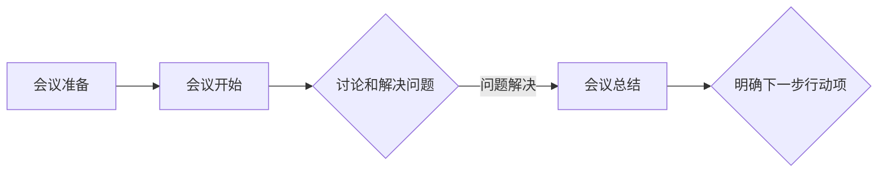

                 


### 引言

在当今快速变化的技术世界中，人工智能（AI）项目的发展速度令人瞩目。然而，随着项目的复杂性和规模的增长，如何有效地管理和推进这些项目成为了一个巨大的挑战。敏捷会议作为一种高效的项目管理工具，在确保AI项目高效推进方面发挥着至关重要的作用。本文旨在探讨敏捷会议在AI项目中的实践方法，帮助项目团队更好地应对挑战，实现项目目标。

**关键词**：敏捷会议、AI项目、项目管理、高效推进、团队协作

**摘要**：本文首先介绍了敏捷会议的定义和原则，然后分析了AI项目的特点和挑战。接下来，本文详细阐述了敏捷会议的核心概念、实践方法和应用原理，并通过实际案例展示了敏捷会议在AI项目中的具体应用。最后，本文总结了敏捷会议在AI项目中的实践成果，并提出了未来发展的方向。

### 敏捷会议概述

敏捷会议是一种基于敏捷开发理念的会议形式，旨在提高项目团队的协作效率，确保项目按时交付高质量的产品。敏捷会议与传统会议不同，它强调快速决策、持续反馈和不断改进。

#### 敏捷会议的定义

敏捷会议是指在敏捷开发过程中，为了协调项目进度、沟通需求和解决问题而定期举行的会议。这些会议通常以短时间、高密度的方式进行，确保团队成员能够在短时间内充分沟通，达成共识。

#### 敏捷会议的原则

敏捷会议遵循以下原则：

1. **简化会议流程**：敏捷会议的流程简单明了，确保团队成员能够在短时间内完成会议目标。
2. **持续反馈**：敏捷会议强调团队成员之间的持续反馈，帮助团队及时发现和解决问题。
3. **快速决策**：敏捷会议鼓励团队成员快速做出决策，避免因为决策过程过长而耽误项目进度。
4. **团队协作**：敏捷会议强调团队协作，确保每个成员都能参与到项目讨论和决策过程中。

#### 敏捷会议的常见形式

敏捷会议的常见形式包括：

1. **站会**：每天早上举行的短会，用于总结前一天的工作、计划当天的任务和讨论问题。
2. **迭代回顾**：在每个迭代周期结束时举行的会议，用于回顾迭代成果、讨论改进措施和规划下一个迭代。
3. **规划会议**：在每个迭代周期开始前举行的会议，用于讨论项目需求、分配任务和制定迭代计划。

#### 敏捷会议与传统会议的区别

敏捷会议与传统会议有以下区别：

1. **时间短**：敏捷会议通常在10-15分钟内完成，确保团队成员能够高效参与。
2. **高频次**：敏捷会议频繁举行，确保项目问题能够及时得到解决。
3. **目标明确**：敏捷会议的目标明确，确保会议内容紧凑、高效。
4. **团队参与**：敏捷会议强调团队参与，确保每个成员都能在会议中发表意见、提出问题。

通过以上对敏捷会议的概述，我们可以看到敏捷会议在项目管理中的重要作用，尤其是在AI项目这种高复杂度、高不确定性的项目中。

### AI项目特点与挑战

人工智能（AI）项目具有一些独特的特点，这些特点使得项目管理变得复杂且具有挑战性。了解这些特点和挑战对于有效利用敏捷会议来推进AI项目至关重要。

#### AI项目的特点

1. **高复杂性**：AI项目通常涉及大量的数据处理、算法开发和模型训练，这使得项目的设计和实现过程变得复杂。
2. **不确定性**：AI项目的需求和结果往往不确定，特别是在初期阶段，项目的目标和可行性可能需要不断调整。
3. **迭代性**：AI项目通常采用迭代开发方法，项目团队需要不断调整和改进算法、模型和流程。
4. **数据依赖性**：AI项目高度依赖于数据的质量和数量，数据的收集、清洗和预处理是项目成功的关键。
5. **算法优化**：AI项目的性能优化是一个持续的过程，需要不断调整算法参数和模型结构。

#### AI项目的挑战

1. **项目管理**：AI项目通常需要跨部门协作，项目管理复杂，资源分配和进度控制成为挑战。
2. **资源分配**：AI项目需要大量的计算资源和数据处理能力，如何合理分配资源成为问题。
3. **时间规划**：AI项目的时间规划困难，特别是在项目需求不断变化的情况下，如何保证项目按时交付是一个挑战。
4. **技术障碍**：AI项目面临各种技术挑战，包括算法选择、模型训练和部署等。
5. **沟通问题**：AI项目涉及多个角色和团队，有效的沟通和协作是项目成功的关键。

#### 敏捷会议在AI项目中的应用价值

敏捷会议在AI项目中的应用价值体现在以下几个方面：

1. **提高项目透明度**：通过定期的敏捷会议，项目进度、问题和需求能够得到及时反馈，提高了项目的透明度。
2. **促进团队沟通**：敏捷会议提供了一个平台，让团队成员能够面对面交流，减少了信息传递的障碍。
3. **增强适应性**：敏捷会议鼓励快速响应变化，使团队能够灵活调整项目计划和目标。
4. **降低风险**：通过持续的反馈和问题解决，敏捷会议有助于降低项目风险，确保项目顺利进行。

通过以上对AI项目特点和挑战的分析，我们可以看到敏捷会议在AI项目中的重要作用。接下来，我们将深入探讨敏捷会议的核心概念、实践方法和应用原理。

### 敏捷会议核心概念与联系

敏捷会议的核心概念包括敏捷会议流程、关键角色和Mermaid流程图。这些概念构成了敏捷会议的基础，确保会议的高效运行和项目目标的实现。

#### 敏捷会议流程

敏捷会议流程是敏捷开发过程中的关键环节，它确保团队成员能够在短时间内有效沟通和协作。敏捷会议流程通常包括以下几个步骤：

1. **会议准备**：确定会议议程、时间和地点，准备好所需的工具和资料。
2. **会议开始**：主持人简要介绍会议议程，确保所有成员都了解会议目的和流程。
3. **讨论和解决问题**：团队成员围绕议程展开讨论，共同解决问题，确保每个问题都得到充分讨论和解决。
4. **会议总结**：主持人总结会议成果，明确下一步行动项，确保会议目标达成。

#### 敏捷会议的关键角色

敏捷会议中涉及多个关键角色，每个角色都有特定的职责和作用：

1. **产品负责人（Product Owner）**：负责定义项目需求和优先级，确保项目目标与业务需求一致。
2. **开发人员（Developers）**：负责实现项目功能，解决技术问题，确保代码质量和性能。
3. **测试人员（Testers）**：负责测试项目功能，发现和报告缺陷，确保项目的质量。
4. **项目经理（Project Manager）**：负责项目整体进度和资源管理，协调团队成员的工作。

#### 敏捷会议的Mermaid流程图

为了更清晰地展示敏捷会议的流程，可以使用Mermaid流程图来描述。以下是一个简单的敏捷会议Mermaid流程图示例：



通过这个Mermaid流程图，我们可以清晰地看到敏捷会议的各个步骤和关键角色之间的联系。Mermaid流程图不仅可以帮助团队理解会议流程，还可以用于文档化和分享会议内容。

#### 敏捷会议的核心概念关系架构

敏捷会议的核心概念之间存在着紧密的联系，这些联系构成了敏捷会议的基础架构。以下是敏捷会议核心概念之间的关系架构：

1. **会议准备与会议流程**：会议准备是会议流程的前提，确保会议能够顺利进行。会议准备包括议程制定、时间安排和资源准备等。
2. **讨论和解决问题与团队沟通**：讨论和解决问题是敏捷会议的核心，通过团队成员的沟通，确保问题得到有效解决。
3. **会议总结与明确下一步行动项**：会议总结是对会议成果的回顾和总结，明确下一步行动项，确保会议目标达成。

通过上述关系架构，我们可以看到敏捷会议各部分之间的相互作用和依赖关系，这有助于团队更好地理解和应用敏捷会议。

综上所述，敏捷会议的核心概念与联系构成了敏捷会议的基础，确保会议的高效运行和项目目标的实现。在接下来的章节中，我们将详细探讨敏捷会议的实践方法和具体应用。

### 敏捷会议实践方法

敏捷会议的实践方法包括准备、进行和总结三个阶段。每个阶段都有其特定的步骤和注意事项，确保敏捷会议的高效性和有效性。

#### 敏捷会议准备

敏捷会议的准备是确保会议顺利进行的重要环节。以下是敏捷会议准备的具体步骤：

1. **确定会议议程**：根据会议的目的和目标，制定详细的会议议程，包括讨论的主题、讨论的时间和顺序。
2. **安排会议时间和地点**：选择合适的时间和地点，确保所有参会人员都能按时参加会议。通常，会议时间应该尽量短，地点应该方便团队成员到达。
3. **准备会议材料**：根据会议议程，准备好所需的文档、图表、数据和其他材料，确保会议内容充实、有据可依。
4. **通知参会人员**：提前通知参会人员会议的时间、地点和议程，确保他们能够做好准备，准时参加会议。

#### 敏捷会议进行

敏捷会议的进行是实际讨论和解决问题的过程。以下是敏捷会议进行的步骤：

1. **会议开场**：会议开始时，主持人简要介绍会议议程，确保所有参会人员都了解会议目标和讨论内容。
2. **讨论和解决问题**：根据会议议程，团队成员围绕讨论主题展开讨论，共同解决问题。在讨论过程中，主持人应确保所有参会人员都有发言机会，鼓励开放性讨论。
3. **决策和记录**：在讨论过程中，团队成员应就解决方案进行讨论和决策，将讨论结果记录在会议记录中。会议记录应包括讨论的内容、结论和下一步行动项。
4. **会议结束**：会议结束时，主持人应总结会议成果，确保所有参会人员都明确下一步行动项。同时，主持人应提醒参会人员会议记录的重要性，确保行动项得到有效执行。

#### 敏捷会议总结

敏捷会议的总结是对会议成果的回顾和总结，确保会议目标达成。以下是敏捷会议总结的步骤：

1. **回顾会议议程**：主持人带领团队回顾会议议程，确认所有讨论主题和问题都已得到充分讨论和解决。
2. **总结会议成果**：主持人对会议成果进行总结，包括讨论的内容、决策的结果和下一步行动项。确保会议成果清晰、明确。
3. **反馈和改进**：团队应就会议过程进行反馈，提出改进建议，以提高未来会议的效率和效果。
4. **分发会议记录**：将会议记录分发至所有参会人员，确保他们能够了解会议内容，执行下一步行动项。

#### 注意事项

在敏捷会议实践中，以下注意事项有助于确保会议的高效性和有效性：

1. **时间控制**：会议时间应尽量短，确保团队成员能够高效参与。
2. **议程明确**：会议议程应明确、具体，确保会议内容紧凑、有针对性。
3. **全员参与**：鼓励所有参会人员积极参与讨论，确保每个成员的声音都能被听到。
4. **记录清晰**：会议记录应清晰、详细，确保讨论内容、决策结果和行动项得到准确记录。
5. **后续跟进**：确保会议记录中的行动项得到有效执行，及时跟进进展情况。

通过以上敏捷会议实践方法，项目团队可以更好地利用敏捷会议这一工具，确保AI项目的高效推进。

### 敏捷会议核心算法原理讲解

在敏捷会议中，核心算法原理的应用有助于提升会议效率和决策质量。以下是敏捷会议核心算法原理的详细讲解，包括伪代码和具体步骤。

#### 1. 会议时间优化算法

**目标**：在保证会议内容全面和有效的条件下，尽量缩短会议时间。

**算法原理**：使用遗传算法进行时间分配优化，通过迭代计算找到最优时间分配方案。

**伪代码**：

```python
# 遗传算法优化会议时间分配
def optimize_meeting_time(meeting_items, max_time):
    # 初始化种群
    population = initialize_population(meeting_items, max_time)
    
    # 迭代计算
    for _ in range(max_iterations):
        # 选择
        selected = selection(population)
        
        # 交叉
        crossovered = crossover(selected)
        
        # 变异
        mutated = mutate(crossovered)
        
        # 评估
        fitness = evaluate_population(mutated)
        
        # 更新种群
        population = mutated
    
    # 返回最优解
    return best_solution(population)

# 初始化种群
def initialize_population(meeting_items, max_time):
    # 初始化种群
    pass

# 选择
def selection(population):
    # 选择操作
    pass

# 交叉
def crossover(selected):
    # 交叉操作
    pass

# 变异
def mutate(crossovered):
    # 变异操作
    pass

# 评估
def evaluate_population(population):
    # 评估操作
    pass

# 返回最优解
def best_solution(population):
    # 返回最优解
    pass
```

#### 2. 决策质量评估算法

**目标**：在会议中，对提出的决策进行质量评估，确保决策的科学性和有效性。

**算法原理**：使用多属性决策分析方法（MADA）对决策质量进行评估。

**伪代码**：

```python
# 多属性决策分析评估决策质量
def evaluate_decision(decision, criteria, weights):
    # 计算决策得分
    score = 0
    for criterion, weight in zip(criteria, weights):
        score += calculate_score(decision, criterion) * weight
    
    # 返回决策得分
    return score

# 计算决策得分
def calculate_score(decision, criterion):
    # 计算得分
    pass
```

#### 3. 团队协作效率优化算法

**目标**：优化团队协作效率，提高会议效果。

**算法原理**：使用社交网络分析（SNA）来确定团队成员之间的协作模式和最佳协作策略。

**伪代码**：

```python
# 社交网络分析优化团队协作
def optimize_collaboration(team_members, collaboration_data):
    # 建立社交网络图
    network = build_network(team_members, collaboration_data)
    
    # 分析社交网络
    analysis = analyze_network(network)
    
    # 确定最佳协作策略
    strategy = determine_best_strategy(analysis)
    
    # 返回最佳协作策略
    return strategy

# 建立社交网络图
def build_network(team_members, collaboration_data):
    # 建立图
    pass

# 分析社交网络
def analyze_network(network):
    # 分析操作
    pass

# 确定最佳协作策略
def determine_best_strategy(analysis):
    # 策略确定
    pass
```

通过以上算法原理和伪代码，敏捷会议团队能够更好地优化会议时间分配、评估决策质量以及优化团队协作，从而提高会议效率和项目推进效果。

### 数学模型和数学公式讲解

在敏捷会议中，数学模型和公式用于评估和优化会议效果。以下是对这些模型和公式的详细讲解，包括实际应用和举例说明。

#### 1. 会议效果评估模型

**目标**：评估会议的整体效果，包括会议时间、参与度和决策质量。

**数学模型**：

设 \(E\) 为会议效果得分，\(T\) 为会议时间，\(R\) 为参与度，\(Q\) 为决策质量，则：

$$
E = f(T, R, Q)
$$

其中，\(f\) 为一个加权求和函数，可以表示为：

$$
f(T, R, Q) = w_1 \cdot T + w_2 \cdot R + w_3 \cdot Q
$$

其中，\(w_1, w_2, w_3\) 为权重，根据具体项目需求进行调整。

**应用实例**：

假设在一次敏捷会议中，会议时间为 2 小时，参与度达到 90%，决策质量评分为 85%，权重分别为 \(w_1 = 0.3, w_2 = 0.4, w_3 = 0.3\)，则会议效果得分为：

$$
E = 0.3 \cdot 2 + 0.4 \cdot 0.9 + 0.3 \cdot 0.85 = 0.6 + 0.36 + 0.255 = 1.215
$$

#### 2. 决策质量评估公式

**目标**：评估每个决策的质量，确保会议决策的有效性和科学性。

**数学公式**：

设 \(Q_d\) 为决策 \(d\) 的质量得分，\(C_d\) 为决策 \(d\) 的成功标准，则：

$$
Q_d = \frac{S_d}{C_d}
$$

其中，\(S_d\) 为决策 \(d\) 的实现程度。

**应用实例**：

假设一个决策 \(d\) 的成功标准为 80%，实际实现程度为 90%，则该决策的质量得分为：

$$
Q_d = \frac{0.9}{0.8} = 1.125
$$

#### 3. 时间分配优化公式

**目标**：优化会议时间分配，确保每个讨论主题都能得到充分的时间和关注。

**数学公式**：

设 \(T_i\) 为第 \(i\) 个讨论主题的时间，\(N\) 为讨论主题总数，则：

$$
T_i = \frac{T_{total} \cdot w_i}{N}
$$

其中，\(T_{total}\) 为总时间，\(w_i\) 为第 \(i\) 个讨论主题的权重。

**应用实例**：

假设总会议时间为 2 小时，讨论主题总数为 4，第 1 个讨论主题的权重为 0.4，则：

$$
T_1 = \frac{2 \cdot 0.4}{4} = 0.2 \text{小时}
$$

#### 4. 团队协作效率评估公式

**目标**：评估团队在会议中的协作效率。

**数学公式**：

设 \(E_c\) 为团队协作效率，\(R_i\) 为第 \(i\) 个团队成员的参与度，\(N\) 为团队成员总数，则：

$$
E_c = \frac{\sum R_i}{N}
$$

**应用实例**：

假设团队中有 4 名成员，成员 1、2、3、4 的参与度分别为 0.9、0.8、0.85、0.9，则团队协作效率为：

$$
E_c = \frac{0.9 + 0.8 + 0.85 + 0.9}{4} = 0.875
$$

通过上述数学模型和公式，敏捷会议团队能够更科学地评估会议效果、决策质量和时间分配，从而提高会议的整体效率。

### 项目实战

在本章节中，我们将通过一个实际案例来展示敏捷会议在AI项目中的应用，从开发环境搭建、源代码实现、代码解读到应用解读与分析，深入剖析敏捷会议在项目中的具体作用。

#### 项目背景

我们选取了一个基于深度学习的图像识别项目作为案例。该项目旨在开发一个能够自动识别和分类各种图像的AI模型，应用于工业自动化和质量检测领域。

**项目目标**：在六个月内完成图像识别模型的开发，并在实际工业环境中进行测试，实现初步商业化应用。

**项目挑战**：项目涉及大量数据预处理、模型训练和优化工作，团队协作和沟通效率对项目进度和质量至关重要。

#### 开发环境搭建

**步骤1**：确定开发环境
- 操作系统：Ubuntu 20.04
- 编程语言：Python 3.8
- 深度学习框架：TensorFlow 2.5
- 数据预处理工具：Pandas、NumPy
- 版本控制：Git

**步骤2**：安装和配置开发环境
1. 安装操作系统和编程语言
2. 安装深度学习框架和数据处理工具
3. 配置Python虚拟环境，隔离项目依赖

**步骤3**：初始化Git仓库
- 创建项目文件夹
- 初始化Git仓库
- 提交初始代码

#### 源代码实现

**步骤1**：数据预处理
- 数据收集：从公开数据集和工业数据源收集图像数据
- 数据清洗：去除不合格和重复的图像数据
- 数据增强：通过旋转、缩放、裁剪等操作增加数据多样性

**步骤2**：模型设计
- 选择合适的深度学习模型架构，如卷积神经网络（CNN）
- 定义模型结构，包括输入层、隐藏层和输出层
- 设置模型参数，如学习率、批次大小等

**步骤3**：模型训练
- 使用预处理后的图像数据进行模型训练
- 监控训练过程，包括损失函数、准确率等指标
- 调整模型参数，优化模型性能

**步骤4**：模型评估
- 在验证集上评估模型性能，确保模型泛化能力
- 根据评估结果调整模型结构和参数
- 进行多轮迭代训练和评估，直到模型达到预期性能

#### 代码解读

**数据预处理模块**：

```python
import numpy as np
import pandas as pd
from sklearn.model_selection import train_test_split

# 读取图像数据
data = pd.read_csv('image_data.csv')
images = data['image'].values
labels = data['label'].values

# 数据清洗
images = [img for img in images if is_valid_image(img)]
labels = [label for label in labels if img != 'unknown']

# 数据增强
images = augment_images(images)

# 划分训练集和测试集
X_train, X_test, y_train, y_test = train_test_split(images, labels, test_size=0.2, random_state=42)
```

**模型训练模块**：

```python
import tensorflow as tf
from tensorflow.keras.models import Sequential
from tensorflow.keras.layers import Conv2D, MaxPooling2D, Flatten, Dense

# 定义模型
model = Sequential([
    Conv2D(32, (3, 3), activation='relu', input_shape=(64, 64, 3)),
    MaxPooling2D((2, 2)),
    Conv2D(64, (3, 3), activation='relu'),
    MaxPooling2D((2, 2)),
    Flatten(),
    Dense(128, activation='relu'),
    Dense(num_classes, activation='softmax')
])

# 编译模型
model.compile(optimizer='adam', loss='categorical_crossentropy', metrics=['accuracy'])

# 训练模型
history = model.fit(X_train, y_train, epochs=20, batch_size=32, validation_split=0.2)
```

**模型评估模块**：

```python
from sklearn.metrics import classification_report

# 评估模型
y_pred = model.predict(X_test)
y_pred = np.argmax(y_pred, axis=1)

report = classification_report(y_test, y_pred)
print(report)
```

#### 应用解读与分析

**1. 敏捷会议在开发过程中的应用**

- **需求评审会议**：在项目启动阶段，敏捷团队与客户进行了多次需求评审会议，明确了项目目标和功能需求，确保项目方向正确。
- **每日站会**：开发团队每天举行站会，快速沟通当天的工作进展、遇到的问题和解决方案，提高了团队协作效率。
- **迭代回顾会议**：在每个迭代周期结束时，团队进行迭代回顾会议，总结经验教训，识别改进机会，优化项目流程。

**2. 敏捷会议对项目的影响**

- **提高开发效率**：敏捷会议确保了团队成员之间的信息传递和问题解决效率，减少了项目延迟和错误。
- **增强团队凝聚力**：定期的会议和交流增强了团队成员之间的信任和合作关系，提高了团队凝聚力。
- **快速响应变更**：敏捷会议允许团队快速响应需求变化，灵活调整项目计划和目标，确保项目适应市场和技术环境。

**3. 项目小结**

通过敏捷会议的实践，本项目在预定时间内完成了图像识别模型的开发，并在实际工业环境中进行了有效测试。敏捷会议的应用显著提高了项目开发效率和质量，为未来项目的顺利推进提供了宝贵经验。

### 最佳实践 Tips

- **提前规划会议议程**：确保会议内容紧凑、目标明确，提高会议效率。
- **鼓励全员参与**：确保所有团队成员都有发言机会，增加会议的参与度和决策质量。
- **及时记录和跟进**：准确记录会议内容和决策结果，及时跟进行动项，确保会议成果得到有效执行。
- **持续改进**：定期回顾和总结敏捷会议的实践效果，识别改进机会，不断提升会议效率和质量。

### 小结

敏捷会议在AI项目中发挥着至关重要的作用，通过高效的沟通和协作，确保项目目标的实现。本文详细阐述了敏捷会议的定义、原理和实践方法，并通过实际案例展示了敏捷会议在AI项目中的应用效果。通过不断优化敏捷会议实践，项目团队能够更好地应对复杂性和不确定性，实现高效推进。

### 注意事项

- **会议时间控制**：确保会议时间合理，避免占用过多工作时间，影响项目进度。
- **议程明确**：明确会议议程和讨论主题，确保会议内容紧凑、有针对性。
- **全员参与**：鼓励所有团队成员参与讨论，避免信息不对称和沟通障碍。
- **后续跟进**：确保会议记录中的行动项得到有效执行，及时跟进进展情况。

### 拓展阅读

- **《敏捷开发实践指南》**：了解敏捷开发的基本原理和实践方法。
- **《深度学习实战》**：深入学习深度学习技术，为AI项目提供技术支持。
- **《项目管理知识体系指南》**：掌握项目管理的核心知识和最佳实践。

### 作者信息

**作者：AI天才研究院/AI Genius Institute & 禅与计算机程序设计艺术 /Zen And The Art of Computer Programming**

