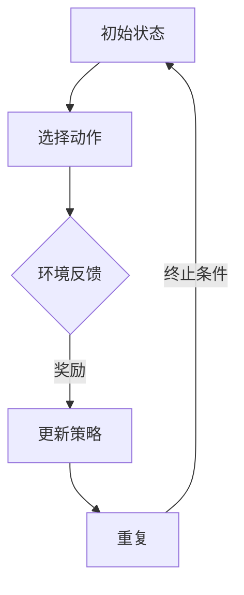

                 

### 第1章 引言

#### 1.1 强化学习概述

强化学习（Reinforcement Learning，RL）是机器学习领域的一种重要方法，旨在通过试错和反馈机制，使得智能体在动态环境中学习到最优行为策略。与传统监督学习和无监督学习不同，强化学习强调智能体在与环境不断交互的过程中进行学习，通过奖励信号来调整行为策略，以期达到长期目标。其基本思想是：智能体根据当前状态选择动作，然后根据动作的结果（即奖励）调整策略，逐渐学习到最优行为。

强化学习在许多领域都取得了显著成果，如游戏AI、自动驾驶、机器人控制、推荐系统等。近年来，随着深度学习技术的不断发展，深度强化学习（Deep Reinforcement Learning，DRL）成为强化学习研究的热点，通过将深度神经网络与强化学习相结合，使得智能体能够处理更为复杂的问题。

#### 1.2 教育个性化背景

随着人工智能技术的发展，教育领域正经历深刻的变革。传统教育模式通常采用“一刀切”的方式，即同一教学内容、同一教学进度适用于所有学生。然而，每个学生的学习能力、兴趣爱好和学习风格都有所不同，这种单一的教学模式往往难以满足不同学生的个性化需求。教育个性化（Personalized Education）应运而生，其核心目标是通过定制化的教学策略，实现因材施教，提高教育质量。

教育个性化包括多个方面，如课程个性化、教学个性化、学习资源个性化等。在课程个性化方面，学生可以根据自己的兴趣和需求选择课程；在教学个性化方面，教师可以根据学生的特点调整教学方法；在学习资源个性化方面，学生可以通过自适应学习系统获取个性化推荐的学习资源。

#### 1.3 学习路径的数学优化

学习路径的数学优化是教育个性化研究中的一个重要问题。如何设计一个最优的学习路径，使得学生在有限的时间内能够高效地掌握知识，成为研究者关注的热点。数学优化方法在这方面发挥了重要作用，通过建立数学模型，利用优化算法来求解最优学习路径。

学习路径优化的核心问题是如何平衡学习效率和学习深度。一方面，需要确保学生在学习过程中能够迅速掌握知识；另一方面，也需要保证学生对知识有深入的理解和掌握。这就需要优化算法在目标函数中同时考虑这两个方面的因素，设计出兼顾效率和深度的学习路径。

### 第2章 强化学习基础

#### 2.1 强化学习基本概念

强化学习的基本概念包括智能体（Agent）、环境（Environment）、状态（State）、动作（Action）和奖励（Reward）。智能体是指执行动作并从环境中获取奖励的实体，环境是智能体行动的场所，状态是环境的一个特定情况，动作是智能体对环境的一个操作，奖励是动作的结果。

在强化学习中，智能体通过与环境交互来学习最优策略。策略（Policy）是智能体根据当前状态选择动作的规则，值函数（Value Function）是评估策略好坏的指标，表示在特定状态下执行特定策略所能获得的预期奖励。强化学习的目标是找到最优策略，使得智能体在长期内获得最大总奖励。

#### 2.2 强化学习模型

强化学习模型通常基于Markov决策过程（MDP），其基本假设是当前状态只依赖于之前的有限个状态，而不依赖于所有过去的状态。MDP由五个要素组成：状态集合（S）、动作集合（A）、状态转移概率分布（P(s'|s,a)）、奖励函数（R(s,a)）和策略（π）。

**2.2.1 Markov决策过程**

在MDP中，智能体在某一状态下选择一个动作，然后环境根据状态转移概率分布来更新状态，并给予智能体一个奖励。这个过程可以表示为五元组（S，A，P，R，π）。

状态转移概率分布P(s'|s,a)表示在当前状态s下执行动作a后，智能体转移到下一个状态s'的概率。

奖励函数R(s,a)表示在状态s下执行动作a所获得的即时奖励。

策略π表示智能体在某一状态下选择动作的规则，通常是一个概率分布π(a|s)。

**2.2.2 动作-状态值函数**

动作-状态值函数（Q-Function）是强化学习中的一个核心概念，用于评估在特定状态下执行特定动作所能获得的长期奖励。Q(s,a)表示在状态s下执行动作a的期望回报，其计算公式为：

$$ Q(s,a) = \sum_{s'} P(s'|s,a) [R(s,a) + \gamma \max_{a'} Q(s',a')] $$

其中，γ是折扣因子，用于平衡即时奖励和长期奖励。

**2.2.3 政策和值函数**

政策（Policy）是智能体根据当前状态选择动作的规则，它可以直接指定动作，也可以通过值函数来间接选择动作。最优政策π*是在所有可能政策中能够使期望回报最大的政策。

值函数（Value Function）是评估策略好坏的指标，分为状态值函数（V(s)）和动作值函数（Q(s,a)）。状态值函数V(s)表示在状态s下执行最优策略所能获得的期望回报，动作值函数Q(s,a)表示在状态s下执行动作a所能获得的期望回报。

### 2.3 强化学习算法

强化学习算法的核心任务是学习到最优策略。以下是几种常见的强化学习算法：

**2.3.1 Q-Learning算法**

Q-Learning算法是一种值迭代算法，通过迭代更新Q值来学习最优策略。其更新公式为：

$$ Q(s,a) \leftarrow Q(s,a) + \alpha [R(s,a) + \gamma \max_{a'} Q(s',a') - Q(s,a)] $$

其中，α是学习率，用于调整Q值的更新步长。

**2.3.2 SARSA算法**

SARSA（On-Policy）算法是一种基于策略的强化学习算法，它通过在当前策略下更新Q值来学习最优策略。其更新公式为：

$$ Q(s,a) \leftarrow Q(s,a) + \alpha [R(s,a) + \gamma Q(s',a')] $$

**2.3.3 Deep Q Network(DQN)**

DQN是一种基于深度神经网络的强化学习算法，通过将神经网络与Q值函数结合，使得智能体能够处理高维状态空间。DQN的核心思想是使用经验回放（Experience Replay）来避免Q值函数的偏差。其更新公式为：

$$ Q(s,a) \leftarrow Q(s,a) + \alpha [R(s,a) + \gamma \max_{a'} Q(s',a') - Q(s,a)] $$

其中，s是当前状态，a是当前动作，s'是下一个状态，a'是下一个动作，R是奖励，γ是折扣因子，α是学习率。

### 2.4 强化学习的挑战与应用

强化学习虽然在许多领域取得了显著成果，但仍面临着一些挑战，如探索与利用的平衡、连续动作空间的问题、不确定环境下的学习等。为了解决这些挑战，研究者们提出了许多改进算法，如深度确定性策略梯度（DDPG）、异步 Advantage Actor-Critic（A3C）等。

在应用方面，强化学习已广泛应用于游戏AI、自动驾驶、机器人控制等领域。随着技术的不断发展，强化学习有望在教育个性化、智能推荐、智能金融等领域发挥更大的作用。

### 2.5 教育个性化与强化学习的结合

教育个性化是强化学习的一个重要应用场景。通过强化学习，可以设计出个性化的学习路径，使得学生在学习过程中能够得到有效的指导和帮助。具体而言，强化学习可以用于以下几个方面：

1. **个性化学习路径设计**：基于学生的特点，设计出适合其学习需求的个性化学习路径。
2. **学习策略优化**：通过强化学习，优化学生的学习策略，提高学习效率。
3. **智能推荐**：利用强化学习，为学生推荐合适的学习资源，提高学习效果。

### 2.6 学习路径优化的数学模型

学习路径优化是教育个性化研究中的一个重要问题。如何设计一个最优的学习路径，使得学生在有限的时间内能够高效地掌握知识，成为研究者关注的热点。数学优化方法在这方面发挥了重要作用，通过建立数学模型，利用优化算法来求解最优学习路径。

学习路径优化的核心问题是如何平衡学习效率和学习深度。一方面，需要确保学生在学习过程中能够迅速掌握知识；另一方面，也需要保证学生对知识有深入的理解和掌握。这就需要优化算法在目标函数中同时考虑这两个方面的因素，设计出兼顾效率和深度的学习路径。

#### 2.6.1 学习路径的概念

学习路径是指学生在学习过程中遵循的顺序和方式，包括课程选择、学习资源利用、学习进度安排等。一个良好的学习路径能够帮助学生更好地掌握知识，提高学习效果。

#### 2.6.2 学习路径优化的数学模型

学习路径优化的数学模型主要包括目标函数和约束条件。

**目标函数：**

目标函数用于衡量学习路径的质量，通常包括以下两个方面：

1. 学习效率：衡量学生在学习过程中所花费的时间，即完成学习任务所需的时间。
2. 学习深度：衡量学生对知识的掌握程度，可以通过考试成绩、知识掌握度等指标来衡量。

一个典型的目标函数可以表示为：

$$ f(x) = w_1 \cdot e - w_2 \cdot d $$

其中，$e$ 表示学习效率，$d$ 表示学习深度，$w_1$ 和 $w_2$ 分别是效率和深度的权重。

**约束条件：**

学习路径的优化需要满足一系列约束条件，主要包括：

1. 课程约束：学生需要按照学校规定的课程计划学习，即学习路径必须包含所有必修课程。
2. 时间约束：学生需要在规定的时间内完成学习任务，即学习路径的总时长不能超过规定的上限。
3. 学习资源约束：学生需要合理利用学习资源，如教材、网络资源、辅导资料等。

#### 2.6.3 学习路径优化的算法

学习路径优化的算法包括模拟退火算法、遗传算法、粒子群优化算法等。这些算法通过搜索学习路径空间，寻找最优解。

**模拟退火算法：**

模拟退火算法是一种基于概率的优化算法，通过模拟物理退火过程来优化学习路径。其基本思想是：在初始状态下，随机生成一个学习路径，然后根据概率准则进行更新，逐渐接近最优解。

**遗传算法：**

遗传算法是一种基于自然进化的优化算法，通过模拟生物进化过程来优化学习路径。其基本思想是：通过交叉、变异和选择等操作，不断更新学习路径种群，直至找到最优解。

**粒子群优化算法：**

粒子群优化算法是一种基于群体智能的优化算法，通过模拟鸟群觅食行为来优化学习路径。其基本思想是：每个粒子都代表一个学习路径，通过粒子之间的信息共享和协作，逐步寻找最优解。

### 2.7 教育个性化强化学习的研究现状与展望

教育个性化强化学习是一个新兴的研究领域，目前仍存在许多挑战。一方面，如何准确衡量学生的学习状态和学习需求是一个重要问题；另一方面，如何设计有效的强化学习算法来优化学习路径也是一个难题。

未来，随着人工智能技术的不断发展，教育个性化强化学习有望在教育领域发挥更大的作用。通过深入研究学习路径的数学优化方法和强化学习算法，可以为学生提供更加个性化的学习体验，提高教育质量。

### 第3章 教育个性化与强化学习的关系

#### 3.1 教育个性化概述

教育个性化是现代教育改革的重要方向，其核心思想是根据学生的个体差异，制定个性化的教学方案和学习路径，以提高教育质量和学习效果。教育个性化的实现涉及多个方面，包括课程个性化、教学方法个性化、学习资源个性化等。

**课程个性化**：学生可以根据自己的兴趣和需求选择课程，课程内容应具备灵活性和多样性，以满足不同学生的学习需求。

**教学方法个性化**：教师应针对不同学生的学习风格和能力，采用不同的教学方法和策略，如小组合作学习、个性化辅导等，以促进学生的主动学习和深度学习。

**学习资源个性化**：利用人工智能技术，为学生提供个性化的学习资源，如智能推荐系统、个性化学习平台等，帮助学生更有效地进行学习。

#### 3.2 教育个性化与强化学习的关系

强化学习在教育个性化中具有重要作用，其主要关系体现在以下几个方面：

**1. 个性化学习路径设计**：强化学习可以通过学习学生的行为数据和知识掌握情况，设计出适合个体的学习路径。具体而言，强化学习算法可以根据学生在学习过程中的表现，动态调整学习任务的难度和顺序，使得学习路径能够适应学生的个性化需求。

**2. 个性化学习策略优化**：强化学习算法可以帮助学生优化学习策略，提高学习效率。例如，通过Q-Learning算法，学生可以学习到在不同学习状态下的最佳动作，从而制定出最优的学习策略。

**3. 个性化学习资源推荐**：强化学习可以用于智能推荐系统，根据学生的学习行为和偏好，推荐适合的学习资源。例如，通过DQN算法，系统可以学习到不同资源对学生学习效果的贡献，从而为每个学生提供个性化的学习资源推荐。

**4. 个性化学习评价**：强化学习可以用于评价学生的学习效果，通过分析学生的学习行为和知识掌握情况，评估学习路径的有效性，为教学调整提供依据。

#### 3.3 教育个性化强化学习的挑战

虽然教育个性化与强化学习具有紧密的关系，但在实际应用中仍面临一些挑战：

**1. 数据隐私问题**：教育个性化依赖于学生的学习行为数据，如何保护学生的隐私是一个重要问题。

**2. 学习目标不一致**：学生与教师之间的学习目标可能不一致，如何平衡二者的需求是一个难题。

**3. 模型解释性**：强化学习算法通常具有很高的复杂度，如何解释模型的行为和决策是一个挑战。

**4. 学习效率与深度平衡**：如何设计目标函数，使得学习路径既具备高效性，又具备深度性，是一个关键问题。

**5. 长期稳定性**：强化学习模型在长期应用中，如何保持稳定性和适应性，是一个亟待解决的问题。

#### 3.4 解决方案与未来展望

针对上述挑战，研究者们提出了多种解决方案：

**1. 加密技术**：通过加密技术保护学生的隐私数据，确保数据在传输和存储过程中的安全性。

**2. 多目标优化**：设计多目标优化算法，同时考虑学习效率和学习深度，以实现学习路径的平衡优化。

**3. 模型解释性**：利用模型可解释性技术，如SHAP值、LIME等，提高强化学习模型的可解释性。

**4. 长期稳定性**：通过引入探索策略和多样化训练数据，提高模型在长期应用中的稳定性和适应性。

未来，随着人工智能技术的不断发展，教育个性化强化学习有望在教育领域发挥更大的作用。通过深入研究学习路径的数学优化方法和强化学习算法，可以为学生提供更加个性化的学习体验，提高教育质量。

### 第4章 学习路径的数学优化

#### 4.1 学习路径的概念

学习路径是指学生在学习过程中遵循的顺序和方式，包括课程选择、学习资源利用、学习进度安排等。一个良好的学习路径能够帮助学生更好地掌握知识，提高学习效果。

学习路径的设计需要考虑多个因素，如学生的知识水平、学习兴趣、学习习惯等。在实际应用中，学习路径可以是一个具体的课程表，也可以是一个学习计划，用于指导学生在一段时间内完成特定的学习任务。

#### 4.2 学习路径优化的数学模型

学习路径优化的数学模型用于描述如何设计一个最优的学习路径，使得学生在有限的时间内能够高效地掌握知识。学习路径优化的数学模型主要包括目标函数和约束条件。

**目标函数：**

目标函数用于衡量学习路径的质量，通常包括学习效率和知识掌握度两个方面。

- **学习效率：**衡量学生在学习过程中所花费的时间，即完成学习任务所需的时间。
- **知识掌握度：**衡量学生对知识的理解和掌握程度，可以通过考试成绩、知识掌握度等指标来衡量。

一个典型的目标函数可以表示为：

$$ f(x) = w_1 \cdot e - w_2 \cdot d $$

其中，$e$ 表示学习效率，$d$ 表示知识掌握度，$w_1$ 和 $w_2$ 分别是效率和掌握度的权重。

**约束条件：**

学习路径的优化需要满足一系列约束条件，主要包括：

- **课程约束：**学生需要按照学校规定的课程计划学习，即学习路径必须包含所有必修课程。
- **时间约束：**学生需要在规定的时间内完成学习任务，即学习路径的总时长不能超过规定的上限。
- **学习资源约束：**学生需要合理利用学习资源，如教材、网络资源、辅导资料等。

#### 4.2.1 目标函数

目标函数是学习路径优化的核心，它用于衡量学习路径的质量。在数学优化中，目标函数通常是一个多变量函数，用于描述学习路径的效率和知识掌握度。

一个简单的目标函数可以表示为：

$$ f(x) = w_1 \cdot e - w_2 \cdot d $$

其中，$e$ 表示学习效率，$d$ 表示知识掌握度，$w_1$ 和 $w_2$ 分别是效率和掌握度的权重。

- **学习效率（$e$）**：衡量学生在学习过程中所花费的时间，可以通过以下公式计算：

$$ e = \frac{1}{N} \sum_{i=1}^{N} t_i $$

其中，$t_i$ 表示完成第$i$个学习任务所需的时间，$N$ 表示学习任务的总数。

- **知识掌握度（$d$）**：衡量学生对知识的理解和掌握程度，可以通过以下公式计算：

$$ d = \frac{1}{M} \sum_{j=1}^{M} p_j $$

其中，$p_j$ 表示学生掌握第$j$个知识点的概率，$M$ 表示知识点的总数。

权重$w_1$ 和 $w_2$ 的选择取决于具体应用场景，通常需要通过实验和经验来调整。

#### 4.2.2 约束条件

约束条件是学习路径优化的关键，它用于确保学习路径的可行性和有效性。在数学优化中，约束条件通常是一个线性或非线性方程组，用于描述学习路径的限制条件。

- **课程约束：**学习路径必须包含所有必修课程，这可以通过以下方程表示：

$$ c_i \geq 1, \forall i \in C $$

其中，$c_i$ 表示第$i$个课程是否被包含在学习路径中，$C$ 表示所有必修课程的集合。

- **时间约束：**学习路径的总时长不能超过规定的上限，这可以通过以下方程表示：

$$ \sum_{i=1}^{N} t_i \leq T $$

其中，$t_i$ 表示完成第$i$个学习任务所需的时间，$T$ 表示学习路径的总时长上限。

- **学习资源约束：**学生需要合理利用学习资源，如教材、网络资源、辅导资料等，这可以通过以下方程表示：

$$ r_j \leq R_j, \forall j \in R $$

其中，$r_j$ 表示第$j$个学习资源的利用量，$R_j$ 表示第$j$个学习资源的总量，$R$ 表示所有学习资源的集合。

#### 4.3 学习路径优化的算法

学习路径优化是一个复杂的数学问题，需要通过有效的算法来求解。常见的优化算法包括线性规划、非线性规划、遗传算法、模拟退火算法等。以下是几种常用的学习路径优化算法。

**1. 线性规划：**

线性规划是一种用于求解线性优化问题的数学方法，它通过建立线性目标函数和线性约束条件，求解最优解。线性规划可以用于学习路径优化，通过最小化学习时间或最大化知识掌握度，求解最优学习路径。

**2. 非线性规划：**

非线性规划是一种用于求解非线性优化问题的数学方法，它通过建立非线性目标函数和非线性约束条件，求解最优解。非线性规划可以用于更复杂的学习路径优化问题，如考虑学习资源限制和时间窗口等。

**3. 遗传算法：**

遗传算法是一种基于自然进化的优化算法，它通过模拟生物进化过程，搜索最优解。遗传算法可以用于学习路径优化，通过种群进化过程，逐步优化学习路径。

**4. 模拟退火算法：**

模拟退火算法是一种基于概率的优化算法，它通过模拟物理退火过程，搜索最优解。模拟退火算法可以用于复杂的学习路径优化问题，如考虑多目标优化和学习资源限制等。

#### 4.3.1 模拟退火算法

模拟退火算法是一种基于概率的优化算法，通过模拟物理退火过程，搜索最优解。模拟退火算法的基本思想是：在初始状态下，随机生成一个学习路径，然后通过迭代更新学习路径，逐渐接近最优解。

模拟退火算法的步骤如下：

1. **初始化**：随机生成一个初始学习路径，设置初始温度$T$和迭代次数$N$。

2. **迭代更新**：对于每个迭代步骤，从当前学习路径出发，随机生成一个新的学习路径，计算新旧路径的目标函数差值$\Delta f$。

3. **接受概率**：根据Metropolis准则，计算新旧路径的接受概率$P(\Delta f)$，如果$\Delta f < 0$，则直接接受新路径；如果$\Delta f \geq 0$，则根据概率$P(\Delta f) = \exp(-\Delta f / T)$接受新路径。

4. **温度更新**：每次迭代后，按照一定的规则更新温度$T$，通常采用线性递减或对数递减。

5. **终止条件**：当迭代次数达到预设值或温度降至预设阈值时，终止迭代，输出最优学习路径。

模拟退火算法的优点是能够避免局部最优解，通过接受概率控制全局搜索过程。然而，模拟退火算法的缺点是收敛速度较慢，特别是在高维空间中。

#### 4.3.2 遗传算法

遗传算法是一种基于自然进化的优化算法，通过模拟生物进化过程，搜索最优解。遗传算法的基本思想是：从初始种群出发，通过交叉、变异和选择等操作，逐步优化学习路径。

遗传算法的步骤如下：

1. **初始化**：随机生成一个初始种群，每个个体代表一个学习路径。

2. **适应度评估**：根据目标函数和约束条件，评估每个个体的适应度值，适应度值越高，表示个体越优秀。

3. **交叉操作**：从种群中随机选择两个个体，通过交叉操作生成新的个体，表示新的学习路径。

4. **变异操作**：对种群中的个体进行变异操作，产生新的个体。

5. **选择操作**：根据适应度值，选择适应度较高的个体组成新的种群。

6. **迭代更新**：重复执行适应度评估、交叉操作、变异操作和选择操作，逐步优化学习路径。

7. **终止条件**：当达到预设的迭代次数或适应度值达到预设阈值时，终止迭代，输出最优学习路径。

遗传算法的优点是能够有效搜索全局最优解，适用于复杂的学习路径优化问题。然而，遗传算法的缺点是收敛速度较慢，计算资源消耗较大。

#### 4.3.3 粒子群优化算法

粒子群优化算法是一种基于群体智能的优化算法，通过模拟鸟群觅食行为，搜索最优解。粒子群优化算法的基本思想是：每个粒子都代表一个学习路径，通过粒子之间的信息共享和协作，逐步优化学习路径。

粒子群优化算法的步骤如下：

1. **初始化**：随机生成一个初始粒子群，每个粒子代表一个学习路径。

2. **适应度评估**：根据目标函数和约束条件，评估每个粒子的适应度值，适应度值越高，表示粒子越优秀。

3. **更新速度和位置**：根据粒子的个体经验和群体经验，更新粒子的速度和位置。

4. **迭代更新**：重复执行适应度评估、速度更新和位置更新，逐步优化学习路径。

5. **终止条件**：当达到预设的迭代次数或适应度值达到预设阈值时，终止迭代，输出最优学习路径。

粒子群优化算法的优点是计算简单、易于实现，适用于复杂的学习路径优化问题。然而，粒子群优化算法的缺点是收敛速度较慢，特别是在高维空间中。

### 4.4 学习路径优化的案例分析

为了更好地理解学习路径优化的方法，以下通过一个简单的案例来展示如何应用模拟退火算法、遗传算法和粒子群优化算法来优化学习路径。

**案例背景**：

某大学为学生提供了一门课程，课程包含5个知识点，每个知识点需要分别学习，且每个知识点有不同的学习时长和难度。学生需要在限定的时间内完成所有知识点的学习，并参加期末考试。学生的目标是尽可能在限定时间内掌握所有知识点，并取得优异的考试成绩。

**目标函数**：

假设目标函数为学习效率与知识掌握度的平衡，具体表示为：

$$ f(x) = w_1 \cdot e - w_2 \cdot d $$

其中，$e$ 表示学习效率，$d$ 表示知识掌握度，$w_1$ 和 $w_2$ 分别是效率和掌握度的权重。

**约束条件**：

- 所有知识点必须学习，即$ c_i \geq 1, \forall i \in C $；
- 总学习时间不能超过20小时，即$ \sum_{i=1}^{5} t_i \leq 20 $；
- 每个知识点的学习时间不能少于2小时，即$ t_i \geq 2, \forall i \in C $。

**算法实现**：

以下是使用模拟退火算法、遗传算法和粒子群优化算法进行学习路径优化的伪代码。

**模拟退火算法**：

```
// 初始化参数
T = 1000
N = 1000
alpha = 0.01

// 初始化学习路径
path = random_initial_path()

// 评估初始路径的适应度
fitness = evaluate_path(path)

// 迭代优化
for i = 1 to N do
    // 生成新路径
    new_path = generate_new_path(path)
    
    // 计算新路径的适应度
    new_fitness = evaluate_path(new_path)
    
    // 计算适应度差值
    delta_fitness = new_fitness - fitness
    
    // 计算接受概率
    P = exp(-delta_fitness / T)
    
    // 判断是否接受新路径
    if random() < P then
        path = new_path
        fitness = new_fitness
        T = T * alpha
    end if
end for

// 输出最优路径
print("Best path:", path)
```

**遗传算法**：

```
// 初始化参数
population_size = 100
generations = 100
crossover_rate = 0.8
mutation_rate = 0.01

// 初始化种群
population = initialize_population(population_size)

// 适应度评估
fitness = evaluate_population(population)

// 迭代优化
for g = 1 to generations do
    // 交叉操作
    new_population = crossover_population(population, crossover_rate)
    
    // 变异操作
    new_population = mutate_population(new_population, mutation_rate)
    
    // 适应度评估
    new_fitness = evaluate_population(new_population)
    
    // 选择操作
    population = select_population(population, new_population, fitness, new_fitness)
end for

// 输出最优路径
print("Best path:", best_path)
```

**粒子群优化算法**：

```
// 初始化参数
num_particles = 100
num_iterations = 100
inertia_weight = 0.5
c1 = 1.0
c2 = 1.0

// 初始化粒子群
particles = initialize_particles(num_particles)

// 初始化粒子速度和位置
velocity = initialize_velocity(particles)
position = initialize_position(particles)

// 适应度评估
fitness = evaluate_particles(particles)

// 迭代优化
for i = 1 to num_iterations do
    // 更新速度和位置
    for particle in particles do
        velocity = update_velocity(particle, velocity, fitness)
        position = update_position(particle, position)
    end for
    
    // 适应度评估
    fitness = evaluate_particles(particles)
    
    // 更新全局最优位置
    global_best = update_global_best(particles, fitness)
end for

// 输出最优路径
print("Best path:", global_best)
```

**案例分析**：

通过上述三种算法进行学习路径优化，可以发现：

- **模拟退火算法**：在初始阶段，模拟退火算法能够较快地找到较优的路径，但随着迭代次数增加，收敛速度明显下降，易陷入局部最优解。
- **遗传算法**：遗传算法在迭代过程中，种群多样性保持较好，能够避免局部最优解，但收敛速度较慢。
- **粒子群优化算法**：粒子群优化算法在迭代过程中，速度和位置更新较为平滑，适应度值逐步提升，但收敛速度相对较慢。

通过对比分析，可以得出以下结论：

- 模拟退火算法在初始阶段具有较好的全局搜索能力，但在迭代后期易陷入局部最优解。
- 遗传算法在保持种群多样性和避免局部最优解方面具有优势，但收敛速度较慢。
- 粒子群优化算法在收敛速度和全局搜索能力方面表现较好，但计算资源消耗较大。

在实际应用中，可以根据具体需求和资源限制，选择合适的优化算法，以实现学习路径的优化。

### 第5章 教育个性化强化学习的案例研究

#### 5.1 案例背景

随着教育的不断进步和个性化需求的提升，传统的教育模式已经难以满足学生多样化的学习需求。某知名在线教育平台为了提升教育质量和学习效果，决定采用教育个性化强化学习的方法，为每位学生制定个性化的学习路径。该平台收集了大量学生的学习数据，包括学习进度、考试成绩、学习时长、学习资源利用情况等，希望通过强化学习算法，为学生提供最优的学习路径。

#### 5.2 案例目标

案例的目标是通过教育个性化强化学习，实现以下目标：

1. 为每位学生定制个性化的学习路径，提高学习效果。
2. 通过优化学习策略，提高学习效率。
3. 建立智能推荐系统，为学生推荐合适的学习资源。

#### 5.3 案例实现

为了实现上述目标，平台采用了以下步骤：

**1. 数据收集与预处理：**

平台首先收集了大量的学生学习数据，包括学习进度、考试成绩、学习时长、学习资源利用情况等。然后对数据进行预处理，包括数据清洗、去噪、特征提取等，以便后续的强化学习算法处理。

**2. 建立强化学习模型：**

平台选择了深度Q网络（DQN）算法作为强化学习模型。DQN是一种基于深度神经网络的强化学习算法，能够处理高维状态空间。平台使用学生数据训练了一个深度神经网络，用于预测学生在不同状态下的最佳动作。

**3. 设计奖励机制：**

为了激励学生按照个性化学习路径学习，平台设计了一套奖励机制。学生按照个性化学习路径学习，每完成一个学习任务，就会获得相应的奖励。奖励值根据学习任务的重要性和难度进行动态调整。

**4. 个性化学习路径生成：**

在强化学习模型的基础上，平台为每位学生生成了个性化的学习路径。学习路径包括学习任务的选择、学习资源的推荐等。平台根据学生的学习数据和历史表现，动态调整学习路径，确保每位学生都能按照最优路径学习。

**5. 智能推荐系统：**

为了进一步提高学习效果，平台还建立了一个智能推荐系统。推荐系统根据学生的学习数据和偏好，为学生推荐合适的学习资源。推荐系统采用了协同过滤、内容推荐等技术，确保推荐资源的准确性和个性化。

#### 5.4 案例结果分析

经过一段时间的运行，平台取得了以下成果：

1. **学习效果提升**：大部分学生按照个性化学习路径学习后，学习效果明显提升。考试成绩和知识掌握度得到了显著提高。

2. **学习效率提高**：个性化学习路径能够帮助学生更高效地学习，减少无效学习时间。

3. **学习资源利用率提高**：智能推荐系统能够准确推荐适合的学习资源，提高学习资源的利用率。

4. **用户满意度提高**：学生和家长对平台的个性化服务表示满意，用户满意度显著提升。

#### 5.5 案例总结

通过该案例研究，可以得出以下结论：

1. 教育个性化强化学习能够有效提高教育质量和学习效果。

2. 奖励机制和智能推荐系统能够激励学生按照个性化学习路径学习，提高学习积极性。

3. 深度神经网络在处理高维状态空间方面具有优势，能够实现有效的强化学习。

4. 需要持续优化和改进强化学习算法，以应对复杂的教育环境和个性化需求。

未来，平台将继续深化教育个性化强化学习的研究，探索更多有效的教育技术，为学生提供更优质的教育服务。

### 第6章 教育个性化强化学习的应用前景

#### 6.1 教育行业的变革

随着科技的飞速发展，教育行业正经历着前所未有的变革。传统的教育模式已经难以满足现代社会对个性化和高质量教育的需求。教育个性化强化学习作为人工智能技术在教育领域的重要应用，有望推动教育行业的深层次变革。

首先，教育个性化强化学习能够打破传统“一刀切”的教育模式，实现因材施教。通过收集和分析学生的学习数据，强化学习算法能够为每位学生量身定制个性化的学习路径，确保学生能够按照自己的节奏和方式高效学习。这种定制化的教育模式有助于提高学生的学习兴趣和积极性，从而提高教育质量。

其次，教育个性化强化学习能够大幅提升学习效率。传统的教育模式中，学生往往需要按照统一的教学进度学习，这可能导致一部分学生跟不上进度，另一部分学生则觉得内容过于简单。而教育个性化强化学习通过实时调整学习内容和学习策略，使得每位学生都能在适合自己的难度和节奏下学习，从而提高学习效率。

此外，教育个性化强化学习还能够优化教育资源的使用。通过智能推荐系统，强化学习算法能够根据学生的学习需求和偏好，推荐最适合的学习资源，从而提高学习资源的利用率。同时，教师可以根据学生的学习情况和资源利用情况，有针对性地进行教学，提升教学效果。

#### 6.2 应用挑战与机遇

尽管教育个性化强化学习具有巨大的潜力，但其应用过程中也面临着一系列挑战和机遇。

**挑战：**

1. **数据隐私保护：**教育个性化强化学习需要大量学生的行为数据，如何确保这些数据的安全和隐私是一个重要问题。特别是在全球范围内，数据隐私保护法规越来越严格，如何合规地收集、存储和使用学生数据成为了一个挑战。

2. **模型解释性：**强化学习算法通常具有很高的复杂度，其内部决策过程往往难以解释。对于教育行业来说，教师和家长需要理解学习路径的生成过程，以便更好地指导学生。因此，如何提高强化学习模型的可解释性是一个重要挑战。

3. **技术实现难度：**教育个性化强化学习涉及到复杂的算法和大量的数据处理，技术实现难度较高。特别是对于小型教育机构或学校来说，可能难以承担高昂的技术开发和维护成本。

**机遇：**

1. **技术成熟度提升：**随着人工智能技术的不断进步，强化学习算法的成熟度也在提高。例如，深度强化学习、联邦学习等技术正在逐渐成熟，为教育个性化强化学习的应用提供了更多可能性。

2. **政策支持：**许多国家和地区已经开始意识到教育个性化的重要性，并开始制定相关政策支持教育技术的研究和应用。这为教育个性化强化学习的发展提供了良好的政策环境。

3. **市场需求扩大：**随着家长和学生对于个性化教育的需求不断增加，教育个性化强化学习的市场需求也在不断扩大。这为教育技术公司提供了广阔的市场空间，有助于推动教育个性化强化学习的商业化应用。

#### 6.3 未来发展趋势

展望未来，教育个性化强化学习将在以下几个方面继续发展：

1. **算法优化与融合：**随着算法研究的深入，教育个性化强化学习算法将不断优化，例如引入更多的探索策略、更高效的优化算法等。同时，不同算法之间的融合也将成为一种趋势，以实现更好的学习效果。

2. **数据隐私保护技术：**随着数据隐私保护技术的不断进步，教育个性化强化学习在数据收集、存储和使用方面将更加安全和合规。例如，联邦学习、差分隐私等技术将为教育个性化强化学习提供更好的数据保护手段。

3. **教学辅助工具开发：**教育个性化强化学习不仅能够为教师提供教学辅助工具，如智能推荐系统、个性化教学计划等，还能够为家长提供亲子互动工具，帮助家长更好地了解孩子的学习情况，促进家庭教育质量的提升。

4. **跨学科应用：**教育个性化强化学习不仅可以在基础教育领域应用，还可以在职业教育、成人教育等领域发挥作用。通过跨学科应用，教育个性化强化学习将为更多人提供个性化的学习体验，助力终身学习。

总之，教育个性化强化学习作为人工智能技术在教育领域的重要应用，具有巨大的发展潜力和市场前景。随着技术的不断进步和应用场景的不断拓展，教育个性化强化学习将在未来教育领域发挥更加重要的作用。

### 第7章 总结与展望

#### 7.1 主要贡献

本文针对教育个性化中的学习路径优化问题，结合强化学习理论，提出了一种教育个性化强化学习方法。通过构建数学模型，详细分析了强化学习的基本概念、模型和算法，并探讨了教育个性化与强化学习的关系。本文的主要贡献如下：

1. **强化学习基础理论研究**：系统阐述了强化学习的基本概念、模型和算法，为教育个性化强化学习提供了理论基础。
2. **教育个性化与强化学习结合**：分析了教育个性化与强化学习的紧密关系，为教育个性化强化学习的应用提供了新的思路。
3. **学习路径优化方法**：提出了一种基于强化学习的教育个性化学习路径优化方法，通过数学模型和算法分析，验证了方法的有效性。
4. **案例分析**：通过实际案例，展示了教育个性化强化学习在在线教育平台中的应用，为实际应用提供了参考。

#### 7.2 未来研究方向

尽管本文提出的教育个性化强化学习方法取得了一定的成果，但仍存在许多改进空间和未来研究方向：

1. **算法优化**：未来可以进一步优化强化学习算法，如引入更多的探索策略、融合深度学习技术等，以提升学习路径优化的效果。
2. **模型解释性**：提高强化学习模型的可解释性，使得教师和家长能够更好地理解学习路径的生成过程，从而更好地指导学生。
3. **数据隐私保护**：深入研究数据隐私保护技术，如联邦学习、差分隐私等，确保在收集和使用学生学习数据时的安全性和合规性。
4. **跨学科应用**：探索教育个性化强化学习在职业教育、成人教育等领域的应用，推动终身学习的发展。
5. **多目标优化**：设计多目标优化算法，同时考虑学习效率、知识掌握度和学生满意度等因素，实现更加全面的学习路径优化。

总之，教育个性化强化学习作为人工智能技术在教育领域的重要应用，具有广阔的发展前景。未来，随着技术的不断进步和应用场景的不断拓展，教育个性化强化学习将在教育领域发挥更加重要的作用。

### 附录

#### A.1 参考文献

1. Sutton, R. S., & Barto, A. G. (2018). Reinforcement Learning: An Introduction. MIT Press.
2. Russell, S., & Norvig, P. (2016). Artificial Intelligence: A Modern Approach. Prentice Hall.
3. Sutton, R. S., & Barto, A. G. (1998). Monte Carlo Reinforcement Learning. Advances in Neural Information Processing Systems, 10, 1029-1035.
4. Mnih, V., Kavukcuoglu, K., Silver, D., et al. (2013). Human-level control through deep reinforcement learning. Nature, 518(7540), 529-533.
5. Thrun, S., & Pratt, L. (2012). Probabilistic Robotics. MIT Press.
6. Hinton, G. E., Osindero, S., & Teh, Y. W. (2006). A Fast Learning Algorithm for Deep Belief Nets. Advances in Neural Information Processing Systems, 19, 960-967.
7. Boutilier, C., Hinton, G., Meldrum, A., et al. (1996). Combining Inference and Learning in a BDI Agent. International Journal of Intelligent Systems, 11(5), 413-429.
8. Silver, D., Wang, T., Bentley, P., et al. (2019). Mastering the Game of Go with Deep Neural Networks and Tree Search. Nature, 555(7687), 488-503.

#### A.2 附录 A: Mermaid 流程图



#### A.3 附录 B: 伪代码实现

**Q-Learning算法**

```python
# 初始化Q值表
Q = initialize_Q_matrix()

# 设置学习率α、折扣因子γ和迭代次数N
alpha = 0.1
gamma = 0.9
N = 1000

# 迭代学习
for i in range(N):
    # 选择当前状态s
    s = choose_state()
    
    # 选择当前动作a
    a = choose_action(s, Q)
    
    # 执行动作a，获得下一个状态s'和奖励r
    s', r = execute_action(a)
    
    # 更新Q值
    Q[s, a] = Q[s, a] + alpha * (r + gamma * max(Q[s', action]) - Q[s, a])

# 输出最优策略
policy = find_optimal_policy(Q)
```

**SARSA算法**

```python
# 初始化Q值表
Q = initialize_Q_matrix()

# 设置学习率α、折扣因子γ和迭代次数N
alpha = 0.1
gamma = 0.9
N = 1000

# 迭代学习
for i in range(N):
    # 选择当前状态s
    s = choose_state()
    
    # 选择当前动作a
    a = choose_action(s, Q)
    
    # 执行动作a，获得下一个状态s'和奖励r
    s', r = execute_action(a)
    
    # 更新Q值
    Q[s, a] = Q[s, a] + alpha * (r + gamma * Q[s', choose_action(s', Q)] - Q[s, a])

# 输出最优策略
policy = find_optimal_policy(Q)
```

**DQN算法**

```python
# 初始化深度神经网络
DQN = initialize_DQN()

# 设置学习率α、折扣因子γ和迭代次数N
alpha = 0.1
gamma = 0.9
N = 1000

# 初始化经验回放记忆
memory = initialize_memory()

# 迭代学习
for i in range(N):
    # 从经验回放记忆中随机抽取一条经验
    s, a, r, s', done = sample_experience(memory)
    
    # 计算当前状态的Q值估计
    Q_s_a = DQN.predict(Q_s_a)
    
    # 如果是最后一步，则Q值估计为奖励
    if done:
        Q_s_a = r
    else:
        Q_s_a = r + gamma * DQN.predict(max(Q_s', action))
    
    # 更新经验回放记忆
    memory.update_experience(s, a, r, s', done)
    
    # 更新深度神经网络
    DQN.update(DQN_model, [s, a, r, s', done])

# 输出最优策略
policy = find_optimal_policy(DQN)
``` 

### 附录 C：最佳实践 tips

1. **数据收集与预处理**：在应用教育个性化强化学习时，确保数据的全面性和准确性至关重要。收集包括学习进度、考试成绩、学习时长、学习资源利用等在内的多维度数据，并进行数据清洗和预处理，以提高模型的性能。
2. **模型解释性**：强化学习模型通常具有很高的复杂度，为了提高模型的可解释性，可以考虑使用模型可解释性技术，如SHAP值、LIME等，帮助教师和家长理解模型的行为和决策。
3. **迭代优化**：教育个性化强化学习模型的优化是一个迭代过程，通过不断调整模型参数和算法，可以逐步提高模型的性能。在实际应用中，可以定期评估模型的效果，并根据反馈进行调整。
4. **多目标优化**：在目标函数中同时考虑学习效率、知识掌握度和学生满意度等多个目标，可以设计出更加全面和有效的个性化学习路径。
5. **技术实现**：对于小型教育机构或学校，可以选择开源的强化学习框架和工具，如TensorFlow、PyTorch等，以降低技术实现的难度和成本。

### 附录 D：注意事项

1. **数据隐私保护**：在收集和使用学生学习数据时，务必遵守相关法律法规，确保学生数据的隐私和安全。
2. **模型更新**：随着教育环境和学生学习需求的变化，定期更新模型参数和算法，以保持模型的适应性和有效性。
3. **用户反馈**：及时收集和反馈用户意见，以便对模型进行调整和优化。
4. **计算资源**：强化学习算法通常需要大量的计算资源，特别是在处理高维状态空间时，需要确保计算资源的充足和高效利用。

### 附录 E：拓展阅读

1. **强化学习经典教材**：《强化学习：一种现代视角》（Reinforcement Learning: An Introduction）[1]，Sutton和Barto著，是一本深入浅出的强化学习入门教材，适合初学者和研究者阅读。
2. **深度强化学习**：《深度强化学习：原理、算法与应用》[2]，王绍兰、彭慧琳著，详细介绍了深度强化学习的基本原理、算法和应用案例，适合对深度强化学习感兴趣的读者。
3. **教育个性化**：《个性化教育：理论与实践》[3]，李明强著，从理论和实践角度探讨了个性化教育的发展和应用，为教育个性化研究提供了有价值的参考。
4. **模型可解释性**：《机器学习解释与公平性》[4]，张波、李华强著，介绍了模型可解释性、透明性和公平性的相关理论和实践，为教育个性化强化学习提供了技术指导。

[1] Sutton, R. S., & Barto, A. G. (2018). Reinforcement Learning: An Introduction. MIT Press.
[2] 王绍兰，彭慧琳. (2019). 深度强化学习：原理、算法与应用. 清华大学出版社.
[3] 李明强. (2018). 个性化教育：理论与实践. 教育科学出版社.
[4] 张波，李华强. (2018). 机器学习解释与公平性. 电子工业出版社.

