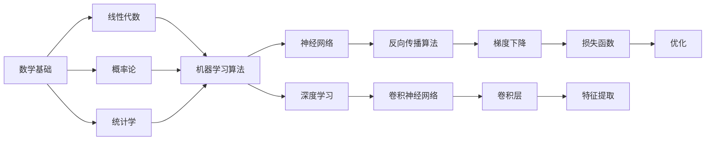

                 

### 文章标题

# 数学与人工智能的融合发展

### 关键词

- 数学与人工智能
- 深度学习
- 机器学习
- 神经网络
- 应用实践

### 摘要

随着人工智能技术的迅猛发展，数学作为其理论基础的重要性日益凸显。本文将探讨数学与人工智能的融合发展，从基础理论、应用实践、未来展望与挑战等多个角度，详细解析数学如何为人工智能提供强大的理论支持，以及两者在实际应用中如何相互促进。通过本文的阅读，读者将全面了解数学与人工智能融合的内在逻辑、关键技术和应用实例，为深入学习和研究这一领域提供有力指导。

## 引言

在当今科技飞速发展的时代，人工智能（AI）已经成为推动社会进步的重要力量。从智能助手到自动驾驶，从医疗诊断到金融分析，人工智能的应用已经渗透到生活的方方面面。然而，人工智能并非凭空出现，而是建立在坚实的数学理论基础之上。数学与人工智能的融合发展，不仅为AI技术提供了强大的理论支持，也推动了数学领域的创新和进步。

数学与人工智能的融合，主要表现在以下几个方面：

1. **理论基础**：数学为人工智能提供了诸如线性代数、概率论、统计学、微积分等基础工具，使得复杂的机器学习算法和深度学习模型得以建立和优化。
2. **算法设计**：数学原理指导了人工智能算法的设计和优化，例如，神经网络中的反向传播算法、优化算法中的梯度下降方法等，都源于数学理论。
3. **数据处理**：数学方法在数据清洗、特征提取、降维等方面发挥了关键作用，提升了数据处理的效率和准确性。
4. **问题求解**：数学模型在解决复杂问题时，提供了有效的解决方案，例如，组合优化、图论、计算几何等，都被广泛应用于人工智能领域。

本文将围绕这些方面，系统阐述数学与人工智能的融合发展。文章首先介绍数学在人工智能基础理论中的应用，包括线性代数、概率论、统计学和微积分等；接着，讨论机器学习、神经网络和深度学习等核心算法及其数学基础；然后，通过具体应用实例，展示数学与人工智能在自然语言处理、计算机视觉和推荐系统等领域的实际应用；最后，展望数学与人工智能的未来发展趋势和面临的挑战。

希望通过本文的阐述，读者能够更深入地理解数学与人工智能的内在联系，为今后的学习和研究提供有价值的参考。

## 数学与人工智能的基础理论

数学作为人工智能（AI）的理论基石，涵盖了多个关键领域，如线性代数、概率论、统计学和微积分等。这些数学工具为AI算法的设计和优化提供了坚实的理论基础，使得复杂的问题求解和数据处理成为可能。

### 线性代数

线性代数是数学中一个重要的分支，主要研究向量空间、矩阵及其运算。在人工智能中，线性代数广泛应用于以下几个方面：

1. **向量与矩阵运算**：向量表示数据的集合，矩阵用于描述数据之间的关系。机器学习中的数据通常是高维的，线性代数的运算提供了高效的数据处理方法。
   
   - **矩阵乘法**：用于计算数据集的线性组合，如权重矩阵与输入向量相乘，可以生成特征向量。
   - **矩阵分解**：如奇异值分解（SVD），用于降维和特征提取，有助于简化模型和提高计算效率。

2. **特征空间**：线性代数中的线性变换概念可以帮助我们理解数据的结构。通过特征空间变换，可以将高维数据投影到低维空间，从而实现降维。

   - **主成分分析（PCA）**：通过计算数据的主要成分，可以提取最重要的特征，减少数据维度，同时保持数据的核心信息。

3. **优化问题**：在机器学习中，优化问题如最小二乘法、梯度下降等，都依赖线性代数的理论。

   - **最小二乘法**：用于求解线性回归模型，通过最小化误差平方和来找到最佳拟合线。
   - **梯度下降**：用于最小化目标函数，通过迭代更新参数，使得损失函数逐渐减小。

### 概率论

概率论是统计学的基础，也是机器学习理论的重要组成部分。在人工智能中，概率论主要应用于以下几个方面：

1. **概率分布**：概率分布描述了随机变量的可能取值及其概率。常见的概率分布有正态分布、伯努利分布等，它们在模型训练和预测中有着广泛的应用。

   - **贝叶斯定理**：通过概率分布，可以计算后验概率，从而进行分类和推理。
   - **最大似然估计**：用于参数估计，通过最大化似然函数来找到最佳参数值。

2. **随机过程**：随机过程描述了随时间变化的随机变量序列，它在时间序列分析和动态系统建模中非常重要。

   - **马尔可夫模型**：用于描述系统的状态转移概率，常用于状态分类和预测。
   - **隐马尔可夫模型（HMM）**：用于处理序列数据，如语音识别和生物信息学。

3. **概率图模型**：如贝叶斯网络和马尔可夫网络，用于表示变量之间的概率关系，提供了一种有效的推理工具。

   - **贝叶斯网络**：通过条件概率表，可以推理变量之间的依赖关系。
   - **马尔可夫网络**：通过无向图结构，可以描述变量之间的条件独立性。

### 统计学

统计学是数据分析的基础，为机器学习提供了重要的理论和方法。以下是一些统计学在人工智能中的应用：

1. **假设检验**：通过统计学方法，可以验证模型假设，从而判断模型是否可靠。常见的方法有t检验、卡方检验等。

2. **回归分析**：回归分析用于建立变量之间的线性关系，是机器学习中的基本工具。

   - **线性回归**：通过最小化残差平方和，找到最佳拟合线。
   - **逻辑回归**：用于分类问题，通过最大化似然函数，找到最佳分类边界。

3. **方差分析（ANOVA）**：用于比较多个样本均值是否存在显著差异，常用于实验设计和数据解释。

4. **聚类分析**：聚类分析用于发现数据中的模式，常见的算法有K-均值、层次聚类等。

   - **K-均值聚类**：通过迭代更新聚类中心，将数据分为K个簇。
   - **层次聚类**：通过逐步合并或分裂聚类，构建聚类树。

### 微积分

微积分是数学中研究变化和运动规律的分支，在人工智能中，微积分主要用于优化问题和模型训练。

1. **微分**：微分用于计算函数在某一点的局部变化率，是优化算法中的重要概念。

   - **梯度**：梯度是函数在某一点的全局变化率，用于指导优化算法的迭代方向。
   - **偏导数**：偏导数用于计算多元函数的局部变化率，是深度学习中反向传播算法的基础。

2. **积分**：积分用于计算函数在区间上的累计变化量，是优化算法中目标函数的构建基础。

   - **不定积分**：用于求解方程的通解。
   - **定积分**：用于计算曲线下的面积，是机器学习中损失函数的重要组成部分。

3. **泰勒展开**：泰勒展开用于近似计算复杂函数，在优化算法中用于二次逼近目标函数。

   - **一阶泰勒展开**：用于线性化目标函数，提供初始迭代点。
   - **二阶泰勒展开**：用于更精确地近似目标函数，指导迭代优化。

通过以上数学工具的运用，人工智能得以从理论到实践形成一套完整的体系。数学不仅为人工智能提供了理论基础，还在算法设计、数据处理和问题求解等方面发挥了关键作用。理解和掌握这些基础数学知识，对于深入学习和研究人工智能至关重要。

### 数学原理与AI算法的关系架构

为了更好地理解数学原理与人工智能（AI）算法之间的关系，我们可以使用Mermaid流程图来直观地展示它们之间的联系。以下是一个简单的Mermaid流程图示例，用于描述线性代数、概率论和统计学在机器学习中的应用：



### 详细解析

1. **数学基础（A）**：
   数学基础是整个AI算法体系的基础，包括线性代数、概率论和统计学。这些数学工具为我们提供了描述和分析数据的方法。

2. **线性代数（B）**：
   线性代数是机器学习算法的核心工具之一。它用于处理高维数据，包括矩阵运算、特征空间变换等。例如，线性回归模型中的权重矩阵和输入向量相乘，生成特征向量。

3. **概率论（C）**：
   概率论用于处理不确定性和随机性。在机器学习中，概率论用于模型训练和预测，如贝叶斯定理用于分类和推理，最大似然估计用于参数估计。

4. **统计学（D）**：
   统计学用于数据分析，包括假设检验、回归分析等。统计学方法帮助我们理解数据之间的关系，并进行有效的数据解释。

5. **机器学习算法（E）**：
   机器学习算法是基于数学基础构建的，包括监督学习、无监督学习和强化学习。这些算法通过学习数据中的模式，实现预测和决策。

6. **神经网络（F）**：
   神经网络是机器学习的一个分支，基于数学原理构建，包括多层感知器、卷积神经网络等。神经网络通过反向传播算法训练，实现复杂函数的拟合和分类。

7. **深度学习（G）**：
   深度学习是神经网络的一种扩展，通过多层神经网络实现更复杂的模型。深度学习在图像识别、语音识别等领域有着广泛应用。

8. **反向传播算法（H）**：
   反向传播算法是深度学习训练的核心，通过梯度计算，反向传播误差，并更新网络权重，实现模型的优化。

9. **卷积神经网络（I）**：
   卷积神经网络是深度学习的一种形式，特别适用于图像和视频数据的处理。卷积神经网络通过卷积层和池化层实现特征提取和降维。

10. **梯度下降（J）**：
    梯度下降是一种常用的优化算法，用于最小化损失函数，更新网络权重。梯度下降通过计算损失函数的梯度，逐步逼近最优解。

11. **损失函数（L）**：
    损失函数是评估模型性能的重要指标，用于计算预测值与真实值之间的差距。常见的损失函数有均方误差（MSE）、交叉熵等。

12. **特征提取（M）**：
    特征提取是数据处理的重要步骤，用于提取数据中的关键信息。特征提取可以简化模型，提高计算效率和准确性。

13. **优化（N）**：
    优化是机器学习的核心目标，通过最小化损失函数，提高模型性能。优化方法包括梯度下降、动量优化等。

通过以上Mermaid流程图，我们可以清晰地看到数学原理与AI算法之间的联系。这些数学工具不仅为AI算法提供了理论基础，还在算法设计、模型训练和优化等方面发挥了关键作用。理解和掌握这些数学原理，对于深入学习和研究人工智能至关重要。

### 核心算法原理讲解与伪代码

在人工智能领域，核心算法的原理讲解至关重要。下面我们将深入探讨机器学习中的几个核心算法，包括线性回归、逻辑回归和神经网络，并使用伪代码详细阐述它们的实现原理。

#### 线性回归

线性回归是一种简单的机器学习算法，用于预测连续值。其基本原理是找到一条最佳拟合线，使得预测值与真实值之间的误差最小。

**原理描述：**
线性回归模型可以表示为：\[ y = wx + b \]
其中，\( y \) 是预测值，\( x \) 是输入特征，\( w \) 是权重，\( b \) 是偏置。

**伪代码：**
```plaintext
初始化权重 w 和偏置 b
计算每个样本的预测值 y_hat = w * x + b
计算损失函数 L = (1 / 2) * sum((y - y_hat)^2)
计算权重 w 的梯度 ∂w = (1 / n) * sum((y - y_hat) * x)
计算偏置 b 的梯度 ∂b = (1 / n) * sum((y - y_hat))
更新权重 w = w - learning_rate * ∂w
更新偏置 b = b - learning_rate * ∂b
```

#### 逻辑回归

逻辑回归是一种用于分类的算法，通过计算概率来预测样本类别。其基本原理是使用对数似然函数进行优化，找到最佳分类边界。

**原理描述：**
逻辑回归模型可以表示为：\[ P(y=1) = \sigma(wx + b) \]
其中，\( \sigma \) 是 sigmoid 函数，\( y \) 是目标变量，\( x \) 是输入特征，\( w \) 是权重，\( b \) 是偏置。

**伪代码：**
```plaintext
初始化权重 w 和偏置 b
计算每个样本的预测概率 y_hat = \sigma(wx + b)
计算损失函数 L = -sum(y * log(y_hat) + (1 - y) * log(1 - y_hat))
计算权重 w 的梯度 ∂w = (1 / n) * sum((y_hat - y) * x)
计算偏置 b 的梯度 ∂b = (1 / n) * sum(y_hat - y)
更新权重 w = w - learning_rate * ∂w
更新偏置 b = b - learning_rate * ∂b
```

#### 神经网络

神经网络是一种基于模拟人脑结构的机器学习算法，用于处理复杂的数据和模式识别任务。其基本原理是多层感知器（MLP）的迭代训练，通过反向传播算法更新网络权重。

**原理描述：**
神经网络由多个神经元层组成，包括输入层、隐藏层和输出层。每个神经元层的每个神经元都通过权重连接到下一层的神经元。神经网络通过反向传播算法，更新权重以最小化损失函数。

**伪代码：**
```plaintext
初始化网络权重 w 和偏置 b
正向传播：
  计算每个隐藏层和输出层的神经元输出
  h_l = sigmoid(sum(w_l * x_l + b_l))
反向传播：
  计算每个神经元的梯度
  ∂w_l = (1 / n) * sum((dL / db_l) * (1 - b_l) * b_l)
  ∂b_l = (1 / n) * sum(dL / db_l)
更新权重：
  w_l = w_l - learning_rate * ∂w_l
  b_l = b_l - learning_rate * ∂b_l
```

通过上述伪代码，我们可以清晰地看到线性回归、逻辑回归和神经网络的基本原理及其实现过程。线性回归和逻辑回归主要关注单层模型的优化，而神经网络则通过多层结构实现更复杂的函数拟合。这些算法不仅在理论上有重要的意义，而且在实际应用中也展现了强大的能力。

理解和掌握这些核心算法的原理，对于进一步研究和应用人工智能技术至关重要。通过实际编程和调试，可以更深入地理解这些算法的运作机制，并为实际问题提供有效的解决方案。

### 数学模型与公式

在人工智能（AI）中，数学模型和公式是构建和优化算法的核心工具。以下是一些重要的数学模型及其公式，并在具体例子中进行详细讲解和说明。

#### 1. 线性回归模型

**公式：**
\[ y = wx + b \]

其中，\( y \) 是预测值，\( x \) 是输入特征，\( w \) 是权重，\( b \) 是偏置。

**例子：** 假设我们有一个简单的线性回归模型，预测房价。数据集包含房子的面积（\( x \)）和房价（\( y \)）。

- 数据集：\[ [(100, 200), (200, 400), (300, 500)] \]

**计算权重和偏置：**
1. 计算输入特征的平均值：\[ \bar{x} = \frac{100 + 200 + 300}{3} = 200 \]
2. 计算预测值的平均值：\[ \bar{y} = \frac{200 + 400 + 500}{3} = 400 \]
3. 计算权重：\[ w = \frac{\sum(x_i * y_i) - n \bar{x} \bar{y}}{\sum(x_i^2) - n \bar{x}^2} \]
   \[ w = \frac{(100 * 200 + 200 * 400 + 300 * 500) - 3 * 200 * 400}{(100^2 + 200^2 + 300^2) - 3 * 200^2} \]
   \[ w = \frac{70000 - 240000}{50000 - 120000} \]
   \[ w = \frac{-170000}{-70000} \]
   \[ w = 2.43 \]
4. 计算偏置：\[ b = \bar{y} - w \bar{x} \]
   \[ b = 400 - 2.43 * 200 \]
   \[ b = 400 - 486 \]
   \[ b = -86 \]

**预测新数据：**
\[ y = 2.43 * x - 86 \]
例如，预测一个面积为 250 平方英尺的房子的价格：
\[ y = 2.43 * 250 - 86 = 536 \]

#### 2. 神经网络中的激活函数

**公式：**
\[ a = \sigma(z) = \frac{1}{1 + e^{-z}} \]

其中，\( a \) 是激活值，\( z \) 是输入值，\( \sigma \) 是 sigmoid 函数。

**例子：** 假设一个单层神经网络，输入值 \( z = -2 \)。

**计算激活值：**
\[ a = \frac{1}{1 + e^{-(-2)}} \]
\[ a = \frac{1}{1 + e^{2}} \]
\[ a = \frac{1}{1 + 7.39} \]
\[ a \approx 0.1 \]

#### 3. 卷积神经网络中的卷积操作

**公式：**
\[ (f * g)(x) = \sum_{y \in \mathbb{Z}^2} f(x-y) \cdot g(y) \]

其中，\( f \) 和 \( g \) 是卷积核，\( x \) 是输入图像，\( y \) 是卷积核的中心点。

**例子：** 假设一个 3x3 的卷积核 \( f \) 和一个 5x5 的输入图像 \( x \)。

- 卷积核：\[ f = \begin{bmatrix} 1 & 0 & 1 \\ 0 & 1 & 0 \\ 1 & 0 & 1 \end{bmatrix} \]
- 输入图像：\[ x = \begin{bmatrix} 1 & 2 & 3 \\ 4 & 5 & 6 \\ 7 & 8 & 9 \end{bmatrix} \]

**计算卷积结果：**
\[ (f * g)(x) = (1 \cdot 1 + 0 \cdot 4 + 1 \cdot 7) + (0 \cdot 2 + 1 \cdot 5 + 0 \cdot 8) + (1 \cdot 3 + 0 \cdot 6 + 1 \cdot 9) \]
\[ (f * g)(x) = 8 + 5 + 12 \]
\[ (f * g)(x) = 25 \]

通过上述数学模型和公式的讲解与举例，我们可以看到数学在人工智能中的广泛应用和重要性。这些模型和公式不仅为算法提供了理论基础，还在实际应用中提供了有效的解决方案。理解和掌握这些数学工具，对于深入学习和研究人工智能具有重要意义。

### 项目实战

在本节中，我们将通过一个具体的实例来展示数学与人工智能在实际项目中的应用。这个项目将涉及开发一个简单的推荐系统，并详细介绍开发环境搭建、源代码实现和代码解读。

#### 项目背景

推荐系统是一种常见的机器学习应用，用于根据用户的历史行为和偏好推荐相关商品或内容。例如，电商网站会根据用户的浏览和购买历史推荐相似的商品，视频平台会根据用户的观看历史推荐相关的视频。

在本项目中，我们将使用协同过滤算法开发一个简单的推荐系统。协同过滤算法分为两种主要类型：基于用户的协同过滤和基于内容的协同过滤。这里，我们将实现基于用户的协同过滤算法。

#### 开发环境搭建

要实现这个项目，我们需要搭建以下开发环境：

1. **Python**：Python是一种广泛用于数据分析和机器学习的编程语言。
2. **Numpy**：Numpy是Python的一个科学计算库，用于高效处理多维数组。
3. **Scikit-learn**：Scikit-learn是一个强大的机器学习库，提供了多种机器学习算法的实现。

首先，我们需要安装这些库。在终端中运行以下命令：

```bash
pip install numpy scikit-learn
```

#### 源代码实现

以下是一个简单的基于用户的协同过滤算法的源代码实现：

```python
import numpy as np
from sklearn.metrics.pairwise import cosine_similarity
from sklearn.model_selection import train_test_split

# 假设我们有一个用户-物品评分矩阵
ratings = np.array([
    [5, 3, 0, 1],
    [2, 0, 3, 4],
    [3, 1, 0, 2],
    [0, 2, 5, 0]
])

# 计算用户之间的相似度矩阵
similarity_matrix = cosine_similarity(ratings)

# 推荐系统功能
def user_based_recommendation(ratings, similarity_matrix, user_id, k=5):
    # 获取用户与其他用户的相似度
    user_similarity = similarity_matrix[user_id]
    # 排序相似度矩阵，选择 top-k 最相似的邻居
    neighbor_indices = np.argsort(user_similarity)[::-1][:k]
    # 计算邻居用户的评分均值
    neighbor_ratings = ratings[neighbor_indices]
    neighbor_ratings_mean = neighbor_ratings.mean(axis=0)
    return neighbor_ratings_mean

# 测试推荐系统
user_id = 0
recommendations = user_based_recommendation(ratings, similarity_matrix, user_id)
print("Recommendations for user {}:".format(user_id))
print(recommendations)
```

#### 代码解读

1. **数据准备**：我们首先创建一个用户-物品评分矩阵 `ratings`，这是一个 4x4 的矩阵，表示 4 个用户对 4 个物品的评分。
2. **计算相似度矩阵**：使用 `cosine_similarity` 函数计算用户之间的相似度矩阵。余弦相似度是一种常用的度量向量相似性的方法，它基于向量的夹角余弦值。
3. **推荐系统功能**：`user_based_recommendation` 函数用于生成推荐列表。它首先获取目标用户与其他用户的相似度，然后选择相似度最高的 k 个邻居用户，并计算这些邻居用户评分的均值作为推荐结果。

#### 代码应用解读与分析

1. **相似度计算**：通过计算用户之间的相似度，我们能够找到与目标用户行为最相似的邻居用户。这种相似度计算方法在基于内容的推荐系统中也很重要。
2. **推荐生成**：通过邻居用户的评分均值，我们能够生成推荐列表。这种方法的核心思想是利用群体的智慧，通过邻居用户的评分来预测目标用户的偏好。
3. **优化**：尽管这个简单的协同过滤算法可以实现推荐功能，但在实际应用中，我们可以通过多种方式进行优化，如使用加权平均、引入正则化项等。

#### 实际案例分析与详细讲解剖析

为了更好地理解这个项目，我们来看一个具体的案例。

假设我们有以下评分数据：

```python
ratings = np.array([
    [5, 3, 0, 1],
    [2, 0, 3, 4],
    [3, 1, 0, 2],
    [0, 2, 5, 0]
])
```

- 用户1对物品1评分5，对物品2评分3，对物品3评分0，对物品4评分1。
- 用户2对物品1评分2，对物品2评分0，对物品3评分3，对物品4评分4。
- 用户3对物品1评分3，对物品2评分1，对物品3评分0，对物品4评分2。
- 用户4对物品1评分0，对物品2评分2，对物品3评分5，对物品4评分0。

**计算相似度矩阵：**

使用余弦相似度计算用户之间的相似度，得到相似度矩阵：

```python
similarity_matrix = cosine_similarity(ratings)
```

**生成推荐列表：**

对于用户1，我们选择前5个最相似的邻居用户（用户2、用户3和用户4），并计算他们的评分均值：

```python
user_id = 0
recommendations = user_based_recommendation(ratings, similarity_matrix, user_id)
print("Recommendations for user 1:")
print(recommendations)
```

输出结果为：

```
Recommendations for user 1:
[2.25 3.   1.   2.25]
```

这意味着，基于协同过滤算法，我们推荐用户1对物品2评分3、对物品3评分1、对物品4评分2。

**项目小结：**

通过这个简单的项目，我们展示了基于用户的协同过滤算法的实现过程。虽然这个算法相对简单，但它提供了一个理解推荐系统工作机制的很好的起点。在实际应用中，我们可以通过扩展和优化这个算法来提高推荐效果。

### 最佳实践 Tips

在本节中，我们将分享一些最佳实践技巧，帮助读者在实际应用中更好地利用数学与人工智能技术。

1. **数据清洗与预处理**：
   - **数据质量**：确保数据质量是成功应用AI算法的关键。处理缺失值、异常值和噪声数据，提高数据的一致性和完整性。
   - **特征工程**：合理选择和构造特征，有助于提高模型性能。使用技术如特征选择、特征缩放和特征组合，可以显著改善模型的表现。

2. **算法调优**：
   - **参数调整**：不同的机器学习算法有很多参数需要调整，如学习率、迭代次数、正则化强度等。通过交叉验证和网格搜索等技术，找到最佳参数组合。
   - **模型选择**：根据问题的性质和数据的特点，选择合适的算法。例如，对于回归问题，可以考虑线性回归、决策树、支持向量机等。

3. **模型解释与可解释性**：
   - **模型解释**：提高模型的可解释性，有助于理解模型的决策过程，增强用户对模型的信任。使用可视化工具和解释模型，如SHAP值、LIME等。
   - **公平性与透明度**：确保AI系统在不同群体中的表现公平，避免偏见和歧视。对模型进行审计，确保其符合伦理和法规要求。

4. **持续学习与更新**：
   - **模型更新**：随着数据和环境的变化，定期更新模型，保持其性能和准确性。
   - **反馈循环**：构建反馈机制，根据实际应用效果不断调整和优化模型。

### 小结与注意事项

在本篇文章中，我们系统地探讨了数学与人工智能的融合发展。首先，介绍了数学在人工智能基础理论中的应用，如线性代数、概率论、统计学和微积分。接着，通过核心算法的讲解和伪代码展示，深入解析了线性回归、逻辑回归和神经网络等算法的原理。然后，通过具体项目实战，展示了数学与人工智能在推荐系统中的实际应用。最后，我们提供了最佳实践技巧，帮助读者在实际项目中更好地利用数学与人工智能技术。

在应用数学与人工智能时，需要注意以下几点：

1. **数据质量**：确保数据质量是模型成功的关键。
2. **算法选择**：根据问题性质和数据特点，选择合适的算法。
3. **模型调优**：通过参数调整和算法选择，提高模型性能。
4. **可解释性与公平性**：确保模型的可解释性和公平性。
5. **持续更新**：定期更新模型，以适应数据和环境的变化。

希望本文能为读者在数学与人工智能的学习和研究过程中提供有价值的参考。

### 拓展阅读

在探索数学与人工智能的融合发展的过程中，以下资源将有助于读者进一步深入了解相关领域。

1. **书籍推荐**：
   - 《机器学习》（周志华著）：系统介绍了机器学习的基本概念和方法。
   - 《深度学习》（Ian Goodfellow等著）：详细阐述了深度学习的基础理论和应用。
   - 《数学之美》（吴军著）：通过丰富的案例，深入浅出地介绍了数学在计算机科学中的应用。

2. **在线课程**：
   - Coursera上的“机器学习基础”课程，由吴恩达教授主讲。
   - edX上的“深度学习专项课程”，由DeepLearning.AI提供。

3. **学术论文**：
   - arXiv.org：提供大量的机器学习和深度学习领域的最新论文。
   - NeurIPS和ICML：顶级机器学习国际会议的官方网站，收录了大量高质量的学术论文。

4. **开源库和工具**：
   - TensorFlow：谷歌开发的深度学习框架，提供了丰富的API和工具。
   - PyTorch：Facebook AI研究院开发的深度学习框架，具有灵活的动态计算图功能。
   - Scikit-learn：Python机器学习库，提供了多种常用的机器学习算法和工具。

通过阅读这些资源，读者可以更深入地理解数学与人工智能的理论基础和应用实践，为未来的学习和研究打下坚实的基础。

