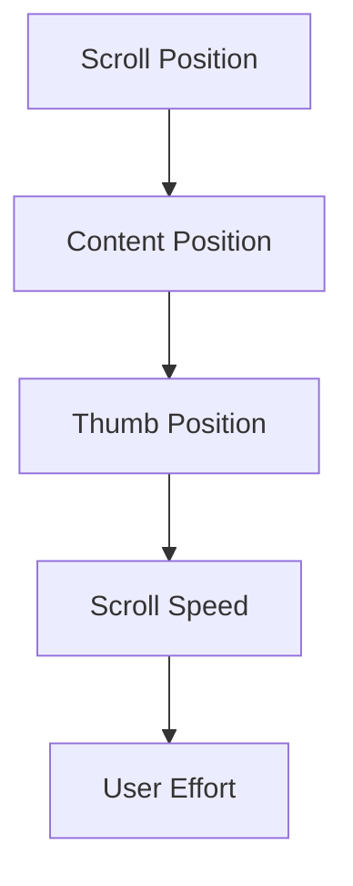
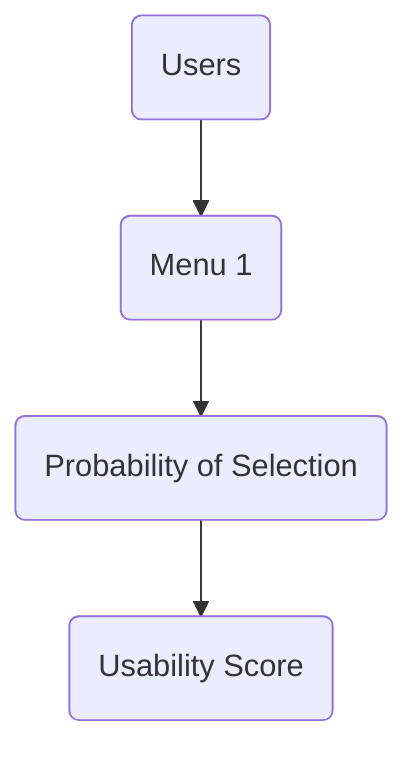
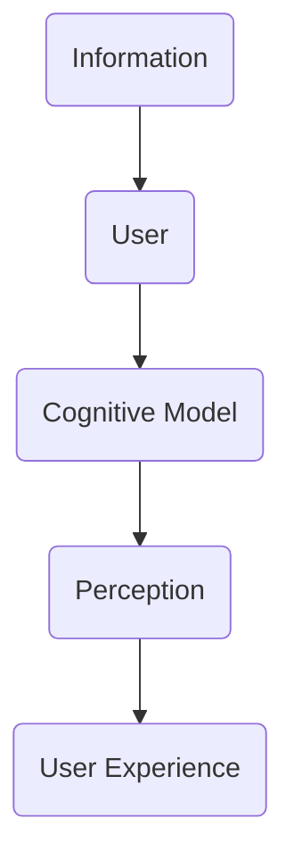
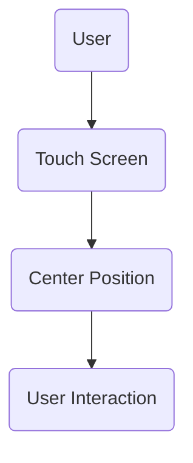
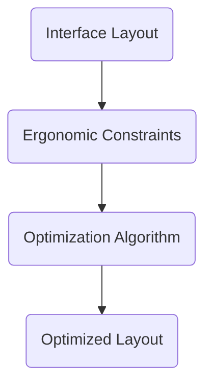
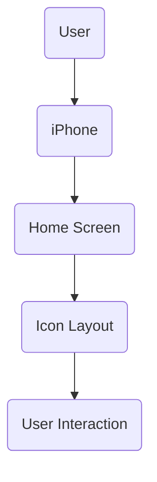
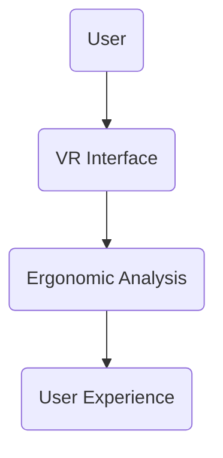
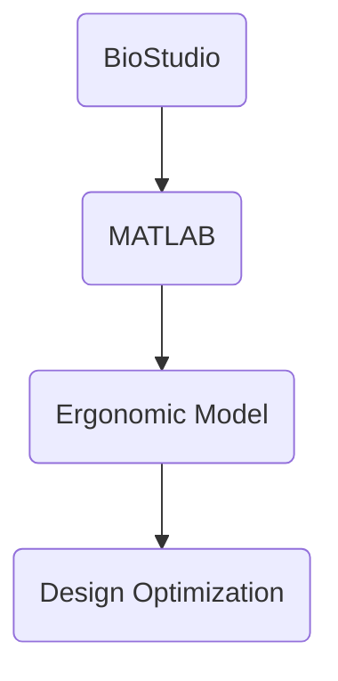

                 

## Draft of the Article

### 1. Article Title: Mathematics and Ergonomics Applications in Human-Computer Interaction Design

**Keywords**: Human-Computer Interaction (HCI), Ergonomics, Mathematics, User Experience (UX), Interface Design

**Abstract**:
This article delves into the integration of mathematical principles and ergonomic considerations in the design of human-computer interaction systems. It explores the fundamental concepts, methodologies, and practical applications of combining mathematical models and ergonomic principles to enhance user experience and interface design.

----------------------------------------------------------------

### Table of Contents

1. **Introduction**
    1.1 **Background of Human-Computer Interaction** <sop>
    1.2 **Importance of Ergonomics in HCI**
    1.3 **Mathematics in HCI: Fundamentals and Applications**
2. **Mathematical Foundations for HCI**
    2.1 **Calculus and Geometry in Interface Design**
    2.2 **Probability Theory and Statistics in User Behavior Analysis**
    2.3 **Mathematical Models of Cognitive Processes**
3. **Ergonomic Principles in HCI**
    3.1 **Ergonomics Basics: Definition and Application Scenarios**
    3.2 **Anthropometric Data in Interface Design**
    3.3 **User-Centered Design and Ergonomics**
4. **Combining Mathematics and Ergonomics**
    4.1 **Integrating Ergonomic Models with Mathematical Analysis**
    4.2 **Case Studies of Mathematics and Ergonomics in HCI**
5. **Practical Applications and Tools**
    5.1 **Software and Tools for Ergonomic Analysis**
    5.2 **Implementing Mathematical Models in Ergonomic Design**
6. **Challenges and Future Directions**
    6.1 **Current Limitations of Mathematics and Ergonomics in HCI**
    6.2 **Future Trends and Innovations**
7. **Conclusion**
    7.1 **Summary of Key Points**
    7.2 **Practical Tips for Designers**
    7.3 **Further Reading and Resources**

----------------------------------------------------------------

### 1. Introduction

#### 1.1 Background of Human-Computer Interaction

Human-Computer Interaction (HCI) is a multidisciplinary field that combines principles from computer science, psychology, and design to study the interaction between humans and computers. The goal of HCI is to design computer systems that are intuitive, efficient, and enjoyable to use.

The history of HCI can be traced back to the early days of computing when researchers started exploring how humans could interact with machines. Early interfaces were command-line based and required users to memorize complex commands. The introduction of graphical user interfaces (GUIs) in the 1980s revolutionized HCI by allowing users to interact with computers using visual elements like icons and menus.

Over the years, HCI has evolved to include various aspects such as usability engineering, user-centered design, and user experience (UX) design. The emphasis has shifted from simply making computers easier to use to creating systems that are not only usable but also enjoyable and satisfying for users.

#### 1.2 Importance of Ergonomics in HCI

Ergonomics is the scientific discipline concerned with the well-being of workers in their working environments. In the context of HCI, ergonomics focuses on designing interfaces and systems that are comfortable, safe, and efficient to use. Good ergonomic design can prevent physical strain, reduce the risk of injury, and improve overall user productivity and satisfaction.

Ergonomics is particularly important in HCI because it directly impacts the user experience. A poorly designed interface can lead to discomfort, frustration, and even physical pain, which can negatively affect user performance and motivation. On the other hand, a well-designed interface that takes into account ergonomic principles can enhance user satisfaction, reduce errors, and improve overall system usability.

#### 1.3 Mathematics in HCI: Fundamentals and Applications

Mathematics plays a crucial role in HCI by providing tools for analyzing user behavior, designing intuitive interfaces, and evaluating system performance. Some of the key mathematical concepts used in HCI include calculus, geometry, probability theory, and statistics.

**Calculus and Geometry** are used to model user interactions and the spatial layout of interfaces. For example, geometric models can be used to determine the optimal placement of interactive elements on a screen to minimize user movement and cognitive load.

**Probability Theory and Statistics** are used to analyze user behavior and predict user preferences. Statistical models can be used to identify patterns in user interactions and to optimize interface design based on user data.

**Mathematical Models of Cognitive Processes** are used to simulate user decision-making processes and to predict user performance. These models can help designers understand how users perceive and interact with interfaces and to identify areas for improvement.

In the next sections, we will delve deeper into these mathematical concepts and their applications in HCI.

----------------------------------------------------------------

### 2. Mathematical Foundations for HCI

In order to design effective human-computer interaction systems, it is essential to understand the mathematical foundations that underpin various aspects of HCI. This section will explore the key mathematical concepts that are used in HCI, including calculus, geometry, probability theory, and statistics. We will also discuss how these concepts can be applied to improve interface design and user experience.

#### 2.1 Calculus and Geometry in Interface Design

**Calculus** is a branch of mathematics that deals with rates of change and areas under curves. In HCI, calculus is often used to model user interactions and the dynamics of interface elements. For example, calculus can be used to determine the optimal speed and acceleration of scrolling, dragging, and other interactive gestures.

**Geometry** is another essential mathematical tool in HCI. Geometric models can be used to understand the spatial relationships between interface elements and to optimize their layout for usability. For instance, geometric principles can help designers determine the optimal size and position of buttons, menus, and other interactive elements to minimize user movement and cognitive load.

**Example**: Consider a scroll bar on a graphical user interface. Using calculus, we can model the relationship between the position of the scroll thumb and the content being displayed. By optimizing the position of the thumb, we can minimize the effort required by users to scroll through large amounts of content.

In this model, the position of the scroll thumb (C) affects the content position (B) and the scroll speed (D), which in turn affects the user's effort (E). By using calculus to optimize the relationship between these variables, we can improve the user experience by reducing the effort required to scroll through content.

#### 2.2 Probability Theory and Statistics in User Behavior Analysis

**Probability Theory** is a branch of mathematics that deals with the likelihood of events occurring. In HCI, probability theory is used to analyze user behavior and predict user interactions. For example, probability models can be used to determine the likelihood of users selecting a specific button or link on a webpage.

**Statistics** is another important mathematical tool for analyzing user behavior. Statistical models can be used to identify patterns and trends in user interactions and to measure the effectiveness of interface design. For instance, statistical analysis can help designers determine the frequency of user errors, the time taken to complete tasks, and the overall satisfaction of users.

**Example**: Consider a website with multiple navigation menus. Using probability theory, we can model the likelihood of users selecting each menu option. By analyzing this data, we can identify which menu options are most frequently used and optimize the menu layout for better usability.

In this model, the probability of user selection (C) affects the usability score (D) of the menu. By optimizing the menu layout based on user behavior data, we can improve the overall usability of the website.

#### 2.3 Mathematical Models of Cognitive Processes

**Mathematical Models of Cognitive Processes** are used to simulate how users perceive and interact with interfaces. These models can help designers understand the cognitive processes underlying user interactions and to identify areas for improvement.

For example, cognitive models can be used to simulate how users process information presented on a screen, such as the layout of buttons, the color scheme, and the visual hierarchy. By analyzing the output of these models, designers can make informed decisions about how to optimize interface design for better usability and user experience.

**Example**: Consider a cognitive model that simulates how users process information presented in a dashboard. The model might take into account factors such as the clarity of the visual representation, the layout of the data, and the color scheme.

In this model, the information presented to the user (A) is processed by the cognitive model (C) to generate a perception (D), which in turn affects the user experience (E). By optimizing the input to the model, we can improve the user experience.

In conclusion, the integration of mathematical principles in HCI allows designers to create more intuitive, efficient, and enjoyable interfaces. By using calculus, geometry, probability theory, and statistical analysis, designers can gain a deeper understanding of user behavior and optimize interface design for better usability and user satisfaction.

----------------------------------------------------------------

### 3. Ergonomic Principles in HCI

Ergonomics is a critical aspect of human-computer interaction (HCI) design, focusing on ensuring that computer interfaces are designed with the human body and cognitive capabilities in mind. Ergonomic principles aim to enhance user comfort, prevent physical strain, and promote efficient interaction with computer systems. This section will delve into the fundamental concepts of ergonomics, the importance of anthropometric data in interface design, and the integration of user-centered design with ergonomic considerations.

#### 3.1 Ergonomics Basics: Definition and Application Scenarios

**Ergonomics Definition**: Ergonomics, derived from the Greek words "ergon" (work) and "nomos" (laws), is the science of designing and arranging objects, systems, and environments to fit the needs of people who use them. In HCI, ergonomics focuses on optimizing the interaction between users and computer interfaces to enhance usability, productivity, and overall user well-being.

**Ergonomics in HCI**: Ergonomics in HCI is about creating interfaces that are not only intuitive and easy to use but also physically comfortable and safe for users. This involves considering factors such as the size, shape, and placement of interface elements, the arrangement of workspaces, and the overall design of the user environment.

**Application Scenarios**:

1. **Keyboard and Mouse Design**: Ergonomic keyboards and mice are designed to reduce strain on the hands, wrists, and arms. Features such as wrist rests, adjustable angles, and split-key designs can help alleviate discomfort and prevent repetitive strain injuries.

2. **Display Ergonomics**: Properly positioned monitors can reduce eye strain and neck discomfort. Height-adjustable stands, tilted screens, and correct viewing angles are important considerations for ergonomic display design.

3. **Seating and Posture**: Ergonomic chairs and desks that promote good posture can help prevent back and spinal issues. Desks with adjustable heights allow users to switch between sitting and standing positions, promoting better circulation and reducing fatigue.

#### 3.2 Anthropometric Data in Interface Design

**Anthropometric Data**: Anthropometrics is the scientific study of human body size, shape, and ability. Collecting anthropometric data is crucial for designing interfaces that accommodate a wide range of users, including those with different body sizes, shapes, and abilities.

**Importance in Interface Design**:

1. **Input Devices**: Anthropometric data is used to design input devices like keyboards, mice, and touchscreens that fit comfortably in users' hands and allow for natural postures.

2. **Display Size and Resolution**: Understanding the average user's visual acuity and reading distances helps designers choose appropriate screen sizes and resolutions to ensure readability and comfort.

3. **Layout and Navigation**: Anthropometric data informs the design of interface layouts, ensuring that buttons, icons, and other interactive elements are placed at accessible distances and sizes for users to interact with easily.

**Example**: A study by Microsoft found that the ideal touch target size for touch interfaces should be around 9mm to 10mm to accommodate the average finger width. This information is used to design touchscreens with appropriately sized buttons and controls.

#### 3.3 User-Centered Design and Ergonomics

**User-Centered Design (UCD)** is an iterative design process that focuses on creating interfaces that meet the needs of users. Integrating ergonomic principles with UCD ensures that the design is not only user-friendly but also physically comfortable and safe.

**Key Concepts**:

1. **User Research**: Conducting user research to understand user needs, preferences, and pain points is essential for incorporating ergonomic considerations into the design process.

2. **Prototyping and Testing**: Creating prototypes and testing them with real users helps identify ergonomic issues and areas for improvement. User feedback is invaluable for refining the design to be more comfortable and intuitive.

3. **Iterative Design**: The iterative design process allows for continuous improvements based on user feedback, ensuring that ergonomic principles are consistently integrated into the interface design.

**Example**: In the design of a mobile app, user research might reveal that users frequently experience thumb strain due to prolonged use. The design team can then iterate on the app's interface by repositioning buttons and increasing the size of interactive elements to reduce strain and improve user comfort.

In conclusion, ergonomic principles are integral to the design of human-computer interfaces. By incorporating anthropometric data and user-centered design practices, designers can create interfaces that are not only functional and intuitive but also comfortable and safe for users. This holistic approach ensures that HCI systems meet the diverse needs of users, leading to enhanced user satisfaction and productivity.

----------------------------------------------------------------

### 4. Combining Mathematics and Ergonomics

In the realm of human-computer interaction (HCI) design, the integration of mathematical models and ergonomic principles can significantly enhance the usability, efficiency, and overall user experience of computer interfaces. This section will explore how mathematical analysis and ergonomic considerations can be combined to create more intuitive and user-friendly systems.

#### 4.1 Integrating Ergonomic Models with Mathematical Analysis

**4.1.1 Combining Ergonomic Data with Mathematical Models**

Ergonomic models provide valuable insights into how users interact with interfaces and the physical constraints they face. By integrating these ergonomic data with mathematical models, designers can create more accurate simulations of user interactions and predict how different interface elements will impact user experience.

**Example**: Consider the design of a touch screen interface. Ergonomic data might indicate that users tend to reach for the center of the screen more frequently. Combining this with a mathematical model of user touch behavior, designers can optimize the placement of interactive elements to minimize reach distances and improve usability.

In this model, the user's touch position (C) is influenced by ergonomic considerations (center position) and affects the overall user interaction (D). By optimizing the center position based on ergonomic data, we can enhance user experience and reduce the cognitive load required to locate and interact with interface elements.

**4.1.2 Incorporating Ergonomic Principles into Mathematical Optimization**

Mathematical optimization techniques, such as linear programming and genetic algorithms, can be used to find optimal solutions for interface design problems. By incorporating ergonomic constraints into these optimization models, designers can create interfaces that are both optimal from a mathematical perspective and comfortable for users.

**Example**: In optimizing the layout of buttons on a mobile app, ergonomic constraints such as finger reach distances and hand sizes can be incorporated into the optimization algorithm to ensure that buttons are placed in locations that are easy to press for a wide range of users.

In this model, ergonomic constraints (B) are considered by the optimization algorithm (C) to generate an optimized layout (D) that is comfortable and accessible for users.

#### 4.2 Case Studies of Mathematics and Ergonomics in HCI

**4.2.1 Ergonomic Optimization of Computer Workstations**

In the design of computer workstations, ergonomic principles are crucial for ensuring that users can work comfortably for extended periods without experiencing physical strain. Mathematical models can be used to optimize the layout of desks, chairs, and monitor positions to minimize discomfort and improve productivity.

**Case Study**: A study by Microsoft used ergonomic data and mathematical optimization techniques to design an ergonomic workstation. The study incorporated anthropometric data to determine optimal desk heights, chair positions, and monitor angles. The resulting workstation design was shown to significantly reduce user discomfort and improve productivity.

**4.2.2 User Interface Design for Mobile Devices**

Mobile devices present unique ergonomic challenges due to their smaller form factors and touch interfaces. Mathematical models can be used to optimize the design of mobile interfaces, ensuring that interactive elements are placed in comfortable and accessible locations.

**Case Study**: Apple's iPhone design incorporates mathematical models to optimize the placement of icons and interactive elements on the home screen. By using ergonomic data and user testing, Apple ensures that the interface is both intuitive and comfortable to use.

In this model, ergonomic considerations (D) influence the user interaction (E) with the iPhone's home screen, resulting in a design that is easy to navigate and use.

**4.2.3 Ergonomic Analysis of Virtual Reality Interfaces**

Virtual reality (VR) interfaces present new challenges in ergonomic design due to the immersive nature of the technology. Mathematical models can be used to analyze and optimize VR interfaces, ensuring that users can experience extended VR sessions without experiencing discomfort or motion sickness.

**Case Study**: Oculus, a leading VR company, uses ergonomic data and mathematical analysis to design ergonomic VR interfaces. By optimizing the placement of interactive elements and adjusting the visual and auditory feedback, Oculus aims to create VR experiences that are comfortable and enjoyable for users.

In this model, ergonomic analysis (C) is used to enhance the user experience (D) with VR interfaces, ensuring that users can enjoy extended VR sessions without discomfort.

In conclusion, the integration of mathematical models and ergonomic principles in HCI design can lead to significant improvements in user experience. By combining ergonomic data with mathematical analysis, designers can create interfaces that are not only optimized for performance but also comfortable and intuitive for users. The case studies presented demonstrate the practical application of these principles in real-world scenarios, highlighting the potential benefits of a holistic approach to interface design.

----------------------------------------------------------------

### 5. Practical Applications and Tools

#### 5.1 Software and Tools for Ergonomic Analysis

**5.1.1 Ergonomic Assessment Tools**

Ergonomic analysis tools are essential for evaluating the ergonomic quality of computer interfaces and work environments. These tools can help designers identify potential issues and make informed design decisions to improve user comfort and reduce the risk of ergonomic-related injuries.

**Examples**:

- **Workstation Assessment Tools**: Tools like Humantime, EXO, and Ergotron's WorkStation Store offer detailed ergonomic assessments for workstations, providing recommendations for optimal desk, chair, and monitor setups.
- **UI/UX Design Tools**: Tools such as InVision, Sketch, and Adobe XD allow designers to create and test ergonomic designs for digital interfaces. These tools offer features like clickability testing, distance measurement, and interaction simulation.

**5.1.2 Ergonomic Software**

Ergonomic software solutions provide comprehensive analysis and reporting capabilities, enabling designers to assess and optimize ergonomic factors in their designs.

**Examples**:

- **BioStudio**: BioStudio is a professional ergonomic software that offers detailed ergonomic assessments for workstations, including posture analysis, ergonomic risk assessment, and recommendations for ergonomic improvements.
- **WorkAngel**: WorkAngel is an ergonomic software that provides real-time feedback on user posture and physical activity levels. It helps users maintain healthy working habits and prevents the onset of musculoskeletal disorders.

#### 5.2 Implementing Mathematical Models in Ergonomic Design

**5.2.1 Mathematical Modeling Tools**

Mathematical modeling tools are crucial for incorporating mathematical principles into ergonomic design. These tools enable designers to simulate and optimize ergonomic factors using mathematical models.

**Examples**:

- **MATLAB**: MATLAB is a powerful computational software that allows designers to create and analyze mathematical models. It can be used to simulate user interactions, optimize interface elements, and evaluate ergonomic metrics.
- **R**: R is a programming language and environment that is widely used for statistical computing and graphics. It can be used to analyze ergonomic data and generate insights for design optimization.

**5.2.2 Integration with Ergonomic Software**

Combining mathematical modeling tools with ergonomic software can enhance the accuracy and effectiveness of ergonomic assessments.

**Example**: Integrating MATLAB with BioStudio allows designers to create custom ergonomic models and simulations. By importing ergonomic data into MATLAB, designers can perform advanced analyses and generate detailed reports that inform design decisions.

In this model, ergonomic data (A) is imported into MATLAB (B), where it is used to create and analyze ergonomic models (C). The insights generated from these models are then used to optimize the design (D).

In conclusion, the use of software and tools for ergonomic analysis and mathematical modeling can significantly enhance the design of human-computer interfaces. By leveraging these tools, designers can create more ergonomic and user-friendly interfaces that promote comfort and prevent physical strain.

----------------------------------------------------------------

### 6. Challenges and Future Directions

#### 6.1 Current Limitations of Mathematics and Ergonomics in HCI

Despite the significant advancements in combining mathematical models and ergonomic principles in HCI, there are still several challenges and limitations that need to be addressed.

**6.1.1 Complexity of Mathematical Models**

Mathematical models used in HCI can be complex and require specialized knowledge to implement and interpret. This complexity can make it difficult for non-experts to understand and apply these models in practical design scenarios.

**6.1.2 Limited Data Availability**

Ergonomic data is often limited in scope and may not represent the diversity of user populations. This limitation can affect the accuracy and generalizability of ergonomic models and analyses.

**6.1.3 Integration with Real-World Applications**

Incorporating mathematical models and ergonomic principles into real-world applications can be challenging due to the need for custom solutions and the complexity of integrating these models with existing software and hardware systems.

#### 6.2 Future Trends and Innovations

**6.2.1 advancements in AI and Machine Learning**

Advancements in artificial intelligence (AI) and machine learning (ML) hold the potential to address some of the current limitations of mathematical and ergonomic models in HCI. AI and ML algorithms can be used to analyze large datasets and identify patterns and trends that may not be apparent through traditional methods. These algorithms can also be used to optimize interface designs in real-time, adapting to user feedback and preferences.

**6.2.2 Enhanced Ergonomic Sensors and Devices**

The development of more advanced ergonomic sensors and devices can improve the collection and analysis of ergonomic data. Wearable devices and motion capture systems can provide detailed information on user interactions and physical movements, enabling more accurate and comprehensive ergonomic assessments.

**6.2.3 Interdisciplinary Collaboration**

Fostering interdisciplinary collaboration between HCI researchers, mathematicians, ergonomists, and designers can lead to the development of more innovative and effective solutions. Collaborative efforts can bridge the gap between theory and practice, ensuring that mathematical models and ergonomic principles are effectively applied in real-world HCI applications.

In conclusion, while there are current limitations in the application of mathematics and ergonomics in HCI, ongoing advancements in AI, sensors, and interdisciplinary collaboration hold the promise of overcoming these challenges. Future innovations in these areas will continue to enhance the design of user-friendly and ergonomic computer interfaces.

----------------------------------------------------------------

### 7. Conclusion

In conclusion, the integration of mathematical principles and ergonomic considerations is crucial for designing effective human-computer interaction systems. By combining mathematical models with ergonomic principles, designers can create interfaces that are not only intuitive and efficient but also comfortable and safe for users. This holistic approach enhances the overall user experience, leading to improved productivity and satisfaction.

#### 7.1 Summary of Key Points

- **Mathematical Foundations**: Calculus, geometry, probability theory, and statistics are essential in analyzing user interactions, optimizing interface elements, and predicting user behavior.
- **Ergonomic Principles**: Ergonomic design focuses on ensuring user comfort, minimizing physical strain, and promoting efficient interaction with computer systems.
- **Integrative Approaches**: Combining mathematical and ergonomic models allows for a more comprehensive analysis of interface design, leading to better user experiences.
- **Practical Applications**: Case studies demonstrate the practical benefits of integrating mathematics and ergonomics in real-world HCI applications.

#### 7.2 Practical Tips for Designers

- **Conduct User Research**: Understand user needs and preferences through user research to inform ergonomic and mathematical design decisions.
- **Optimize Interface Layout**: Use geometric and ergonomic principles to place interactive elements in comfortable and accessible locations.
- **Test and Iterate**: Continuously test and refine interface designs based on user feedback to ensure optimal usability and comfort.
- **Leverage Advanced Tools**: Utilize ergonomic and mathematical analysis tools to enhance the design process and make informed design decisions.

#### 7.3 Further Reading and Resources

For those interested in delving deeper into the intersection of mathematics, ergonomics, and HCI, the following resources provide valuable insights and practical guidance:

- **Books**:
  - "The Design of Everyday Things" by Don Norman
  - "Human-Computer Interaction: Principles and Practice" by John M. Carroll
- **Online Courses**:
  - "Human-Computer Interaction" on Coursera
  - "User Experience Design" on edX
- **Research Papers**:
  - "Ergonomic Design of Interactive Systems" by Brenda Dervin
  - "Mathematical Models of User Interaction" by Daniel Thalmann and Philippe Coifman

By exploring these resources, designers can deepen their understanding of the principles and practices that drive effective HCI design, incorporating both mathematical and ergonomic considerations to create intuitive and user-friendly interfaces.

