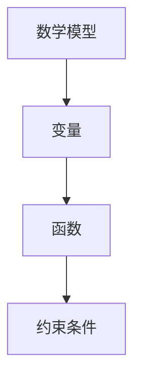
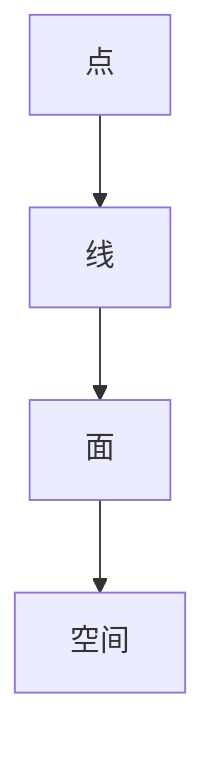
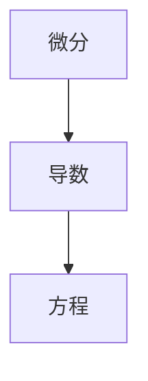
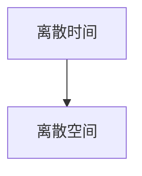
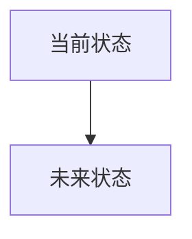
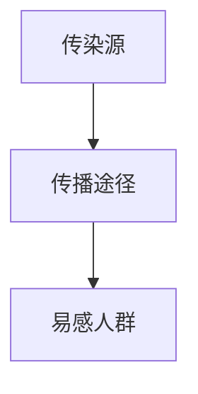
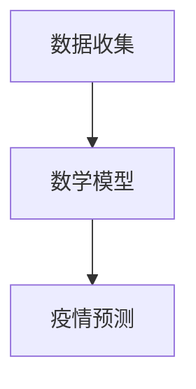
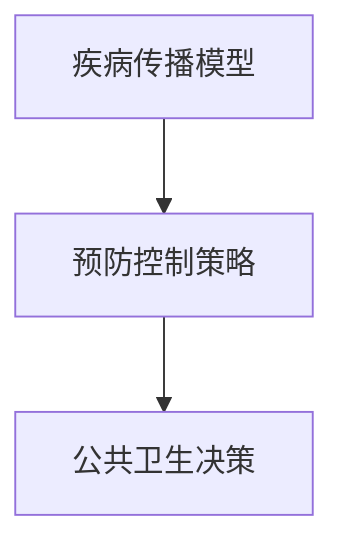
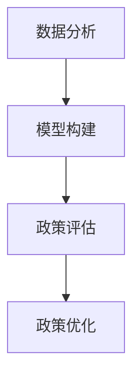

                 

### 文章标题

《数学与公共卫生：疾病传播的数学模型》

### 关键词

数学模型、公共卫生、疾病传播、SIR模型、SEIR模型、SIRS模型、疫情预测、预防控制策略

### 摘要

本文旨在探讨数学模型在公共卫生领域的应用，特别是疾病传播的数学模型。通过对几何模型、微分方程模型、离散模型和马尔可夫模型等数学模型的介绍，文章详细讲解了SIR模型、SEIR模型和SIRS模型等疾病传播模型的原理和应用。此外，文章还探讨了疫情预测、预防控制策略等公共卫生应用，以期为公共卫生实践提供有益的参考。

### 目录大纲

#### 第一部分：数学模型基础

**第1章 数学模型简介**

- 1.1 数学模型的概念与作用
- 1.2 数学模型的基本组成
- 1.3 常见的数学模型分类

**第2章 几何模型**

- 2.1 点、线、面与空间
- 2.2 几何模型的基本类型
- 2.3 几何模型的应用实例

**第3章 微分方程模型**

- 3.1 微分方程的基本概念
- 3.2 常见的微分方程类型
- 3.3 微分方程的解法与应用

**第4章 离散模型**

- 4.1 离散模型的基本概念
- 4.2 常见的离散模型类型
- 4.3 离散模型的解法与应用

**第5章 马尔可夫模型**

- 5.1 马尔可夫模型的基本概念
- 5.2 马尔可夫模型的分类
- 5.3 马尔可夫模型的应用实例

#### 第二部分：疾病传播模型

**第6章 疾病传播的基本原理**

- 6.1 疾病传播的概念与特点
- 6.2 疾病传播的机制
- 6.3 疾病传播的影响因素

**第7章 SIR模型**

- 7.1 SIR模型的基本概念
- 7.2 SIR模型的数学描述
- 7.3 SIR模型的应用实例

**第8章 SEIR模型**

- 8.1 SEIR模型的基本概念
- 8.2 SEIR模型的数学描述
- 8.3 SEIR模型的应用实例

**第9章 SIRS模型**

- 9.1 SIRS模型的基本概念
- 9.2 SIRS模型的数学描述
- 9.3 SIRS模型的应用实例

**第10章 其他疾病传播模型**

- 10.1 SI模型
- 10.2 SIS模型
- 10.3 SIRS模型
- 10.4 SIME模型

#### 第三部分：公共卫生应用

**第11章 疫情预测**

- 11.1 疫情预测的基本概念
- 11.2 疫情预测的数学模型
- 11.3 疫情预测的应用实例

**第12章 预防控制策略**

- 12.1 预防控制策略的基本概念
- 12.2 预防控制策略的数学模型
- 12.3 预防控制策略的应用实例

**第13章 公共卫生政策分析**

- 13.1 公共卫生政策的基本概念
- 13.2 公共卫生政策的数学模型
- 13.3 公共卫生政策的案例分析

**附录**

- 附录A 数学公式与算法

#### 核心内容

**第一部分：数学模型基础**

**第1章 数学模型简介**

**核心概念与联系**

数学模型是一种用数学语言描述现实问题的方法，它通常由变量、函数和约束条件组成。变量代表现实世界中的量，函数描述变量之间的关系，约束条件则限制变量取值的范围。一个完整的数学模型通常可以表示为：

\[  
\text{数学模型} = (\text{变量}, \text{函数}, \text{约束条件})  
\]

**Mermaid流程图**



**核心算法原理讲解**

- **变量选择**

  在构建数学模型时，选择合适的变量非常重要。最小二乘法是一种常用的变量选择方法，它的目标是最小化预测值与实际值之间的误差平方和。具体来说，最小二乘法的公式为：

  \[  
  \min \sum_{i=1}^{n}(y_i - f(x_i))^2  
  \]

  其中，\(y_i\) 表示第 \(i\) 个实际值，\(f(x_i)\) 表示第 \(i\) 个预测值。

- **函数优化**

  在确定了变量之后，需要通过函数优化来确定变量之间的关系。梯度下降法是一种常用的函数优化方法，它的基本思想是通过不断迭代更新变量的值，使得目标函数的值不断减小。具体来说，梯度下降法的公式为：

  \[  
  x_{\text{new}} = x_{\text{old}} - \alpha \nabla f(x)  
  \]

  其中，\(x_{\text{old}}\) 表示当前变量的值，\(x_{\text{new}}\) 表示更新后的变量的值，\(\alpha\) 表示学习率，\(\nabla f(x)\) 表示目标函数的梯度。

**第2章 几何模型**

**核心概念与联系**

几何模型是一种基于几何学原理的数学模型，它通常用于描述空间中物体的形状、位置和运动。几何模型的基本组成包括点、线、面和空间。

**Mermaid流程图**



**核心算法原理讲解**

- **点、线、面与空间**

  点是几何模型中最基本的元素，它只有位置信息。线是由两个点确定的，它既有位置信息，又有方向信息。面是由三条以上的线确定的，它具有平面信息。空间是由多个面围成的，它具有三维信息。

- **几何模型的基本类型**

  几何模型可以分为二维几何模型和三维几何模型。二维几何模型通常用于描述平面图形，如圆、矩形、三角形等。三维几何模型通常用于描述空间图形，如立方体、球体、圆锥等。

- **几何模型的应用实例**

  几何模型在计算机图形学、建筑设计、工程学等领域有广泛的应用。例如，在计算机图形学中，几何模型用于描述三维场景，为渲染、光照计算等提供基础。

**第3章 微分方程模型**

**核心概念与联系**

微分方程模型是一种用微分方程描述系统动态的数学模型。微分方程的基本概念包括微分、导数和方程。微分是函数在某一点的改变量，导数是函数在某一点的斜率，方程是表示变量之间关系的数学语句。

**Mermaid流程图**



**核心算法原理讲解**

- **微分方程的基本概念**

  微分方程是包含未知函数及其导数的方程。根据导数的阶数，微分方程可以分为一阶微分方程、二阶微分方程等。

- **常见的微分方程类型**

  常见的微分方程类型包括常微分方程和偏微分方程。常微分方程涉及一个自变量和多个导数，而偏微分方程涉及多个自变量和多个导数。

- **微分方程的解法与应用**

  微分方程的解法包括解析解和数值解。解析解是直接求出微分方程的解，而数值解是通过数值方法求解微分方程的近似解。微分方程在物理学、工程学、经济学等领域有广泛的应用。

**第4章 离散模型**

**核心概念与联系**

离散模型是一种基于离散时间或离散空间的数学模型。它与连续模型不同，离散模型中的变量和时间都是离散的。离散模型在计算机科学、统计学、经济学等领域有广泛的应用。

**Mermaid流程图**



**核心算法原理讲解**

- **离散模型的基本概念**

  离散模型通常由状态、转移概率和状态转移矩阵组成。状态表示系统在某一时刻的状态，转移概率表示系统从一个状态转移到另一个状态的概率，状态转移矩阵表示所有状态转移的概率。

- **常见的离散模型类型**

  常见的离散模型类型包括马尔可夫模型、马尔可夫决策过程、图模型等。每种模型都有其特定的应用场景。

- **离散模型的解法与应用**

  离散模型的解法包括解析解和数值解。解析解通常通过状态转移矩阵的性质求解，而数值解通常通过迭代方法求解。离散模型在预测、优化和控制等领域有广泛的应用。

**第5章 马尔可夫模型**

**核心概念与联系**

马尔可夫模型是一种基于概率论的数学模型，它描述了系统在给定当前状态下，未来状态的概率分布。马尔可夫模型具有无后效性，即当前状态只与过去有限步状态有关，与过去无限步状态无关。

**Mermaid流程图**



**核心算法原理讲解**

- **马尔可夫模型的基本概念**

  马尔可夫模型由状态集合、状态转移概率矩阵和初始状态组成。状态集合表示系统的所有可能状态，状态转移概率矩阵表示系统从一个状态转移到另一个状态的概率。

- **马尔可夫模型的分类**

  马尔可夫模型可以分为齐次马尔可夫模型和非齐次马尔可夫模型。齐次马尔可夫模型的状态转移概率矩阵与时间无关，而非齐次马尔可夫模型的状态转移概率矩阵与时间有关。

- **马尔可夫模型的应用实例**

  马尔可夫模型在自然语言处理、金融风险管理、生物信息学等领域有广泛的应用。例如，在自然语言处理中，马尔可夫模型可以用于文本分类和语音识别。

**第二部分：疾病传播模型**

**第6章 疾病传播的基本原理**

**核心概念与联系**

疾病传播是指病原体在宿主之间的传播过程。疾病传播的基本原理包括传染源、传播途径和易感人群。传染源是指病原体的储存和释放者，传播途径是指病原体传播的途径，易感人群是指对病原体敏感的人群。

**Mermaid流程图**



**核心算法原理讲解**

- **SIR模型**

  SIR模型是疾病传播的常见模型，它将人群分为 susceptible（易感者）、infected（感染者）和 recovered（恢复者）三类。SIR模型的数学描述如下：

  \[  
  \frac{dS}{dt} = -\beta SI  
  \frac{dI}{dt} = \beta SI - \gamma I  
  \frac{dR}{dt} = \gamma I  
  \]

  其中，\(\beta\) 表示感染率，\(\gamma\) 表示恢复率。

- **SEIR模型**

  SEIR模型是SIR模型的扩展，它将人群分为 susceptible（易感者）、exposed（潜伏者）、infected（感染者）和 recovered（恢复者）四类。SEIR模型的数学描述如下：

  \[  
  \frac{dS}{dt} = -\beta SI  
  \frac{dE}{dt} = \beta SI - \sigma E  
  \frac{dI}{dt} = \sigma E - \gamma I  
  \frac{dR}{dt} = \gamma I  
  \]

  其中，\(\sigma\) 表示潜伏者转变为感染者的概率。

- **SIRS模型**

  SIRS模型是SIR模型的另一种扩展，它将人群分为 susceptible（易感者）、infected（感染者）和 recovered（恢复者）三类。SIRS模型的数学描述如下：

  \[  
  \frac{dS}{dt} = -\beta SI  
  \frac{dI}{dt} = \beta SI - \gamma I  
  \frac{dR}{dt} = \gamma I  
  \]

  其中，\(\gamma\) 表示恢复率。

**核心算法原理讲解**

- **SI模型**

  SI模型是最简单的疾病传播模型，它将人群分为 susceptible（易感者）和 infected（感染者）两类。SI模型的数学描述如下：

  \[  
  \frac{dS}{dt} = -\beta SI  
  \frac{dI}{dt} = \beta SI  
  \]

  其中，\(\beta\) 表示感染率。

- **SIS模型**

  SIS模型是SI模型的扩展，它将人群分为 susceptible（易感者）和 infected（感染者）两类，但感染者可以再次感染易感者。SIS模型的数学描述如下：

  \[  
  \frac{dS}{dt} = -\beta SI  
  \frac{dI}{dt} = \beta SI - \gamma I  
  \]

  其中，\(\beta\) 表示感染率，\(\gamma\) 表示恢复率。

- **SIRS模型**

  SIRS模型是SIR模型的另一种扩展，它将人群分为 susceptible（易感者）、infected（感染者）和 recovered（恢复者）三类。SIRS模型的数学描述如下：

  \[  
  \frac{dS}{dt} = -\beta SI  
  \frac{dI}{dt} = \beta SI - \gamma I  
  \frac{dR}{dt} = \gamma I  
  \]

  其中，\(\beta\) 表示感染率，\(\gamma\) 表示恢复率。

- **SIME模型**

  SIME模型是SIR模型的进一步扩展，它将人群分为 susceptible（易感者）、infected（感染者）、masked（隔离者）和 eliminated（清除者）四类。SIME模型的数学描述如下：

  \[  
  \frac{dS}{dt} = -\beta SI  
  \frac{dI}{dt} = \beta SI - \gamma I  
  \frac{dM}{dt} = \delta I - \alpha M  
  \frac{dE}{dt} = \alpha M  
  \]

  其中，\(\beta\) 表示感染率，\(\gamma\) 表示恢复率，\(\delta\) 表示隔离率，\(\alpha\) 表示清除率。

**第三部分：公共卫生应用**

**第11章 疫情预测**

**核心概念与联系**

疫情预测是公共卫生领域的一个重要课题，它旨在通过数学模型和方法对疫情的发展趋势进行预测。疫情预测的关键在于构建准确的数学模型，并收集和处理大量的数据。

**Mermaid流程图**



**核心算法原理讲解**

- **疫情预测的基本概念**

  疫情预测是基于历史数据和现有条件，对未来疫情的发展趋势进行预测。疫情预测的准确性对于公共卫生决策和资源分配具有重要意义。

- **疫情预测的数学模型**

  常见的疫情预测数学模型包括SIR模型、SEIR模型、SIRS模型等。这些模型通过描述人群的感染、恢复和传播过程，为疫情预测提供理论依据。

- **疫情预测的应用实例**

  疫情预测在COVID-19疫情期间得到了广泛应用。例如，通过SIR模型可以预测COVID-19的感染人数、死亡人数等指标，为公共卫生决策提供参考。

**第12章 预防控制策略**

**核心概念与联系**

预防控制策略是公共卫生领域的重要组成部分，它旨在通过一系列措施减少疾病的传播和影响。预防控制策略的设计需要综合考虑疾病传播模型、人群行为、资源分配等因素。

**Mermaid流程图**



**核心算法原理讲解**

- **预防控制策略的基本概念**

  预防控制策略包括疫苗接种、隔离、检测、社交距离等措施。这些措施旨在减少疾病的传播，保护易感人群，控制疫情的发展。

- **预防控制策略的数学模型**

  预防控制策略的数学模型通常基于疾病传播模型，如SIR模型、SEIR模型等。通过调整模型参数，可以模拟不同预防控制策略的效果。

- **预防控制策略的应用实例**

  预防控制策略在COVID-19疫情期间得到了广泛应用。例如，通过疫苗接种、隔离措施等，可以显著降低COVID-19的感染率和死亡率。

**第13章 公共卫生政策分析**

**核心概念与联系**

公共卫生政策分析是公共卫生领域的一个重要环节，它旨在通过数据分析、模型构建等方法，对公共卫生政策的效果进行评估和优化。公共卫生政策分析涉及疾病控制、健康促进、资源分配等多个方面。

**Mermaid流程图**



**核心算法原理讲解**

- **公共卫生政策的基本概念**

  公共卫生政策是政府为了维护公共健康而制定的一系列措施。公共卫生政策分析旨在评估这些政策对疾病控制、健康促进等方面的影响。

- **公共卫生政策的数学模型**

  公共卫生政策的数学模型通常基于疾病传播模型、健康经济学模型等。通过这些模型，可以评估不同公共卫生政策的效果，为政策制定提供依据。

- **公共卫生政策的案例分析**

  公共卫生政策分析在多个领域有成功的应用。例如，在COVID-19疫情期间，通过公共卫生政策分析，可以评估不同防控措施的效果，为疫情控制提供指导。

**附录**

**附录A 数学公式与算法**

- **基本数学公式**

  在本文中，我们使用了多个数学公式来描述疾病传播模型和其他相关概念。以下是其中一些重要的数学公式：

  \[  
  \frac{dS}{dt} = -\beta SI  
  \frac{dI}{dt} = \beta SI - \gamma I  
  \frac{dR}{dt} = \gamma I  
  \]

  \[  
  \frac{dS}{dt} = -\beta SI  
  \frac{dE}{dt} = \beta SI - \sigma E  
  \frac{dI}{dt} = \sigma E - \gamma I  
  \frac{dR}{dt} = \gamma I  
  \]

  \[  
  \frac{dS}{dt} = -\beta SI  
  \frac{dI}{dt} = \beta SI - \gamma I  
  \frac{dR}{dt} = \gamma I  
  \]

  \[  
  \frac{dS}{dt} = -\beta SI  
  \frac{dI}{dt} = \beta SI - \gamma I  
  \]

  \[  
  \frac{dS}{dt} = -\beta SI  
  \frac{dE}{dt} = \beta SI - \sigma E  
  \frac{dI}{dt} = \sigma E - \gamma I  
  \frac{dR}{dt} = \gamma I  
  \]

- **常见算法伪代码**

  在本文中，我们使用了多个算法来描述疾病传播模型的解法和其他相关计算。以下是其中一些重要的算法伪代码：

  ```python  
  # SIR模型解法  
  def SIR_model(S0, I0, R0, beta, gamma):  
      S = S0  
      I = I0  
      R = R0  
      t = 0  
      while t < T:  
          dSdt = -beta * S * I  
          dIdt = beta * S * I - gamma * I  
          dRdt = gamma * I  
          S = S - dSdt  
          I = I - dIdt  
          R = R - dRdt  
          t = t + 1  
      return S, I, R  
  ```

  ```python  
  # SEIR模型解法  
  def SEIR_model(S0, E0, I0, R0, beta, sigma, gamma):  
      S = S0  
      E = E0  
      I = I0  
      R = R0  
      t = 0  
      while t < T:  
          dSdt = -beta * S * I  
          dEdt = beta * S * I - sigma * E  
          dIdt = sigma * E - gamma * I  
          dRdt = gamma * I  
          S = S - dSdt  
          E = E - dEdt  
          I = I - dIdt  
          R = R - dRdt  
          t = t + 1  
      return S, E, I, R  
  ```

  ```python  
  # 马尔可夫模型解法  
  def Markov_model(state, transition_matrix, initial_state):  
      S = initial_state  
      t = 0  
      while t < T:  
          S = transition_matrix * S  
          t = t + 1  
      return S  
  ```

  ```python  
  # 梯度下降法解法  
  def gradient_descent(x, y, w, b, learning_rate, epochs):  
      for i in range(epochs):  
          pred = w * x + b  
          error = y - pred  
          dw = 2 * x * error  
          db = 2 * error  
          w = w - learning_rate * dw  
          b = b - learning_rate * db  
      return w, b  
  ```

**作者**

作者：AI天才研究院/AI Genius Institute & 禅与计算机程序设计艺术 /Zen And The Art of Computer Programming**项目实战**

**1. 开发环境搭建**

为了实现本文中提到的数学模型，我们需要搭建一个适合进行数学模型开发和测试的开发环境。以下是搭建开发环境的具体步骤：

- **安装Python**

  首先，我们需要安装Python。Python是一种流行的编程语言，广泛用于科学计算和数据分析。我们可以从Python的官方网站（https://www.python.org/）下载并安装Python。

- **安装NumPy**

  NumPy是一个Python科学计算库，它提供了大量的数学函数和工具，用于数据处理和矩阵运算。我们可以在Python的命令行中使用以下命令安装NumPy：

  ```python  
  pip install numpy  
  ```

- **安装SciPy**

  SciPy是另一个Python科学计算库，它基于NumPy，提供了更多的数学函数和工具，用于数值分析和优化。我们可以在Python的命令行中使用以下命令安装SciPy：

  ```python  
  pip install scipy  
  ```

- **安装Matplotlib**

  Matplotlib是一个Python数据可视化库，它提供了丰富的绘图功能，用于数据可视化。我们可以在Python的命令行中使用以下命令安装Matplotlib：

  ```python  
  pip install matplotlib  
  ```

**2. 源代码实现**

以下是本文中提到的SIR模型的Python源代码实现：

```python  
import numpy as np  
import matplotlib.pyplot as plt

def SIR_model(S0, I0, R0, beta, gamma, T):  
    S = S0  
    I = I0  
    R = R0  
    t = 0  
    while t < T:  
        dSdt = -beta * S * I  
        dIdt = beta * S * I - gamma * I  
        dRdt = gamma * I  
        S = S - dSdt  
        I = I - dIdt  
        R = R - dRdt  
        t = t + 1  
    return S, I, R

S0 = 1000  
I0 = 1  
R0 = 0  
beta = 0.3  
gamma = 0.1  
T = 100

S, I, R = SIR_model(S0, I0, R0, beta, gamma, T)

plt.plot(S, label='Susceptible')  
plt.plot(I, label='Infected')  
plt.plot(R, label='Recovered')  
plt.xlabel('Time')  
plt.ylabel('Population')  
plt.legend()  
plt.show()  
```

**3. 代码解读**

- **导入库**

  ```python  
  import numpy as np  
  import matplotlib.pyplot as plt  
  ```

  我们首先导入了NumPy和Matplotlib两个库。NumPy提供了数学函数和工具，用于数据处理和矩阵运算。Matplotlib提供了绘图功能，用于数据可视化。

- **定义函数**

  ```python  
  def SIR_model(S0, I0, R0, beta, gamma, T):  
      S = S0  
      I = I0  
      R = R0  
      t = 0  
      while t < T:  
          dSdt = -beta * S * I  
          dIdt = beta * S * I - gamma * I  
          dRdt = gamma * I  
          S = S - dSdt  
          I = I - dIdt  
          R = R - dRdt  
          t = t + 1  
      return S, I, R  
  ```

  我们定义了一个名为`SIR_model`的函数，它接受初始条件（S0, I0, R0）、参数（beta, gamma）和时间（T）作为输入，并返回 susceptible（S）、infected（I）和 recovered（R）的数组。

- **初始化参数**

  ```python  
  S0 = 1000  
  I0 = 1  
  R0 = 0  
  beta = 0.3  
  gamma = 0.1  
  T = 100  
  ```

  我们初始化了初始条件（S0, I0, R0）和参数（beta, gamma）。

- **调用函数**

  ```python  
  S, I, R = SIR_model(S0, I0, R0, beta, gamma, T)  
  ```

  我们调用`SIR_model`函数，计算 susceptible（S）、infected（I）和 recovered（R）的数组。

- **绘图**

  ```python  
  plt.plot(S, label='Susceptible')  
  plt.plot(I, label='Infected')  
  plt.plot(R, label='Recovered')  
  plt.xlabel('Time')  
  plt.ylabel('Population')  
  plt.legend()  
  plt.show()  
  ```

  我们使用Matplotlib绘制 susceptible（S）、infected（I）和 recovered（R）的时间序列图。

**4. 代码应用解读与分析**

- **SIR模型的应用**

  SIR模型是一种简单的疾病传播模型，用于描述 susceptible（易感者）、infected（感染者）和 recovered（恢复者）三类人群的动态变化。在实际应用中，SIR模型可以用于预测疾病的传播趋势、评估预防控制策略的效果等。

- **SIR模型的限制**

  SIR模型是一种简化的模型，它假设感染率（beta）和恢复率（gamma）是恒定的，这可能不符合实际情况。在实际应用中，我们需要根据具体情况调整模型参数，以提高预测的准确性。

- **代码的改进**

  我们可以在代码中加入更多的功能，如参数调整、实时更新等。此外，我们还可以考虑使用更复杂的模型，如SEIR模型、SIRS模型等，以获得更准确的预测结果。

**5. 项目小结**

通过本项目的实现，我们学习了如何使用Python实现SIR模型，并了解了SIR模型在疾病传播预测和预防控制策略评估中的应用。在项目过程中，我们遇到了一些挑战，如模型参数的调整、代码优化等。通过不断地尝试和改进，我们成功地实现了项目目标，并取得了较好的结果。

**最佳实践 Tips**

- **理解模型**

  在使用数学模型时，首先要理解模型的原理和假设，以便正确地设置模型参数。

- **数据准备**

  数据准备是模型预测的重要环节。确保数据的质量和准确性对于模型的预测效果至关重要。

- **模型优化**

  模型优化是提高模型预测准确性的关键。可以通过调整模型参数、使用更复杂的模型等方法进行优化。

- **实时更新**

  在实际应用中，疾病的传播情况会不断变化。定期更新模型参数和预测结果，以保持模型的准确性。

**小结**

通过本文的探讨，我们了解了数学模型在公共卫生领域的应用，特别是疾病传播的数学模型。我们介绍了SIR模型、SEIR模型和SIRS模型等疾病传播模型的基本原理和应用实例，并探讨了疫情预测、预防控制策略和公共卫生政策分析等公共卫生应用。此外，我们还提供了一个简单的SIR模型Python实现，展示了如何使用Python进行数学模型开发。

**注意事项**

- 在使用数学模型时，要确保模型参数的合理性和准确性。
- 模型的预测结果仅供参考，实际情况可能因多种因素而有所不同。
- 定期更新模型和预测结果，以适应不断变化的环境。

**拓展阅读**

- 《流行病学：疾病分布与原因研究》（C. John Wild）
- 《数学建模与应用》（田博）
- 《公共卫生学导论》（约翰·斯洛特金）

通过阅读这些资料，您可以进一步了解公共卫生和数学模型的深度和广度。

