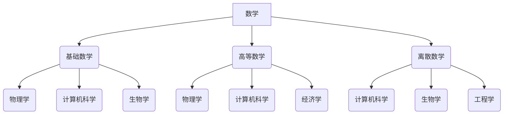
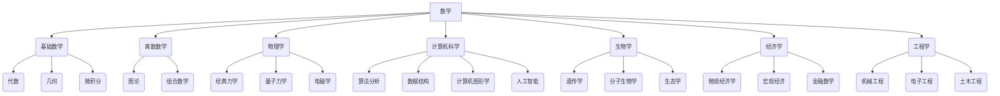

                 

。

首先，我们需要确定数学与其他学科的基本概念。这些概念包括但不限于：

- **数学**：包括基础数学、高等数学、离散数学等。
- **物理学**：包括经典力学、量子力学、电磁学等。
- **计算机科学**：包括算法分析、数据结构、计算机图形学等。
- **生物学**：包括遗传学、分子生物学、生态学等。
- **经济学**：包括微观经济学、宏观经济
- **工程学**：包括机械工程、电子工程、土木工程等。

接下来，我们设计一个Mermaid流程图来展示这些概念之间的关系。这个流程图将包含以下几个关键部分：

1. **起点**：数学作为起点，与其他学科相连接。
2. **连接线**：使用箭头表示数学概念与其他学科之间的交叉关系。
3. **交叉点**：标出具体的交叉点，例如物理学中的微积分、计算机科学中的图论等。
4. **注释**：在每个交叉点旁边添加简短的注释，说明数学概念如何应用在其他学科中。

以下是流程图的Mermaid语法：



该流程图展示了数学与其他学科之间的基础概念和交叉点，为我们后续章节的详细讲解奠定了基础。

#### 1.2 历史背景

在确定数学与其他学科的基本概念和关系之后，我们接下来探讨数学与其他学科交叉融合的历史背景。数学与其他学科的交叉融合可以追溯到古代，但在过去几百年里，这种交叉融合的速度和深度都显著增加。

**古代：**在古代，数学的应用主要集中在天文学、建筑学等领域。例如，古希腊数学家欧几里得在《几何原本》中提出的几何原理对建筑学和天文学有着深远的影响。

**文艺复兴时期：**文艺复兴时期是数学与其他学科交叉融合的起点。数学家如勒内·笛卡尔和艾萨克·牛顿的工作使得数学在物理学中得到了广泛应用。牛顿的微积分和力学方程为物理学的发展奠定了基础。

**20世纪：**20世纪是数学与其他学科交叉融合的高峰期。数学在计算机科学、生物学、经济学等领域的应用日益广泛。例如，图灵机理论奠定了计算机科学的基础，而遗传算法则是在生物学中应用数学模型的成功案例。

**现代：**现代科技的发展使得数学与其他学科的交叉融合更加深入和广泛。例如，机器学习中的优化算法、数据挖掘中的统计学方法、生物信息学中的数学模型等，都是数学与其他学科交叉融合的产物。

通过上述历史背景的介绍，我们可以看到数学与其他学科交叉融合的发展历程，为后续章节的具体讲解提供了时代背景。

#### 2.1 核心概念与联系（Mermaid流程图）

为了更好地理解数学与其他学科的交叉融合，我们将使用Mermaid流程图详细展示这些学科之间的核心概念及其联系。以下是几个关键学科的核心概念及它们之间的交叉关系：

1. **数学：**包括基础数学（代数、几何、微积分等）和离散数学（图论、组合数学等）。

2. **物理学：**包括经典力学（牛顿力学）、量子力学、电磁学等。

3. **计算机科学：**包括算法分析、数据结构、计算机图形学、人工智能等。

4. **生物学：**包括遗传学、分子生物学、生态学等。

5. **经济学：**包括微观经济学、宏观经济、金融数学等。

6. **工程学：**包括机械工程、电子工程、土木工程等。

下面是一个简单的Mermaid流程图，展示了这些学科之间的核心概念及其联系：



在这个流程图中：

- **起点**：数学作为起点，与其他学科相连接。
- **连接线**：使用箭头表示数学概念与其他学科之间的交叉关系。
- **交叉点**：标出具体的交叉点，例如数学在物理学中的应用（微积分、几何）、在计算机科学中的应用（算法分析、数据结构）、在生物学中的应用（遗传学、生态学）等。

通过这个Mermaid流程图，我们可以清晰地看到数学与其他学科之间的核心概念及其联系，为后续章节的详细讲解提供了直观的参考。

#### 2.2 历史背景

数学与其他学科的交叉融合可以追溯到古代文明，但在过去几百年里，这种融合的速度和深度显著增加。以下是一些重要的发展阶段和关键人物：

1. **古希腊与古代文明：**在古希腊，数学与天文学、几何学、工程学等领域紧密相连。欧几里得（Euclid）的《几何原本》是历史上第一部系统化的几何学著作，对后来的数学发展产生了深远影响。阿基米德（Archimedes）则通过数学方法解决了物理问题，如浮力定律和杠杆原理。

2. **文艺复兴时期：**文艺复兴时期是数学与其他学科交叉融合的起点。勒内·笛卡尔（René Descartes）提出的解析几何将数学与物理学紧密结合，奠定了现代数学的基础。艾萨克·牛顿（Isaac Newton）和戈特弗里德·威廉·莱布尼茨（Gottfried Wilhelm Leibniz）分别独立发明的微积分，为物理学和工程学的发展提供了强有力的数学工具。

3. **18世纪至19世纪：**这一时期是数学与其他学科交叉融合的高峰。约瑟夫·拉格朗日（Joseph Lagrange）和威廉·罗恩（William Rowan Hamilton）的工作使得数学在物理学中得到了广泛应用。卡尔·弗里德里希·高斯（Carl Friedrich Gauss）则在数论、天文学和地
- **现代：**20世纪以来，数学与其他学科的交叉融合进一步加深。数学在计算机科学中的应用尤为显著，图灵（Alan Turing）提出的图灵机模型奠定了计算理论的基础。在生物学领域，数学模型被广泛应用于遗传学和生态学，如著名的遗传算法和神经网络模型。在经济学领域，数学为微观经济学和宏观经济学的理论分析提供了工具。工程学中，数学被用于优化和控制理论，如线性规划和控制系统的设计。

通过上述历史背景的介绍，我们可以看到数学与其他学科的交叉融合是如何逐步发展的，并为现代科学技术奠定了坚实的基础。

#### 2.3 核心算法原理讲解

在数学与其他学科的交叉融合中，核心算法原理起着至关重要的作用。以下是一些关键的算法及其原理：

1. **图论算法**

   图论是一种数学分支，用于研究图的结构和性质。以下是一些重要的图论算法：

   - **Dijkstra算法**：用于求解单源最短路径问题。该算法的基本思想是逐步扩展已求最短路径的节点集合，直到找到目标节点。

     ```pseudo
     Dijkstra(Graph, source):
         for each vertex v in Graph:
             distance[v] = INFINITY
             previous[v] = UNDEFINED
         distance[source] = 0
         for each edge (u, v) in Graph:
             if distance[u] + weight(u, v) < distance[v]:
                 distance[v] = distance[u] + weight(u, v)
                 previous[v] = u
         return distance, previous
     ```

   - **Floyd-Warshall算法**：用于求解所有节点之间的最短路径问题。该算法通过动态规划方法，逐步构建出每个节点对的最短路径。

     ```pseudo
     Floyd-Warshall(Graph):
         create a 2D array dist[][] such that dist[i][j] = weight of edge i-j
         for k = 1 to n:
             for i = 1 to n:
                 for j = 1 to n:
                     if dist[i][k] + dist[k][j] < dist[i][j]:
                         dist[i][j] = dist[i][k] + dist[k][j]
         return dist
     ```

2. **优化算法**

   优化算法在多个学科中都有应用，用于求解资源分配、生产调度等问题。以下是一些常见的优化算法：

   - **线性规划（Linear Programming, LP）**：线性规划是用于求解线性目标函数在约束条件下的最优解的问题。以下是一个简单的线性规划问题的求解方法：

     ```pseudo
     LinearProgramming(Coeficients, Constraints):
         create an LP problem with input Coeficients and Constraints
         use an LP solver (e.g., Simplex algorithm) to find the optimal solution
         return the optimal solution and objective value
     ```

   - **遗传算法（Genetic Algorithm, GA）**：遗传算法是一种模拟自然进化的搜索算法，用于求解复杂优化问题。以下是一个简单的遗传算法步骤：

     ```pseudo
     GeneticAlgorithm():
         initialize population randomly
         evaluate fitness of each individual
         while not termination condition:
             select individuals for crossover and mutation
             create new population by applying crossover and mutation
             evaluate fitness of new population
         return best individual in the final population
     ```

3. **机器学习算法**

   机器学习算法广泛应用于数据分析和预测领域。以下是一些关键的机器学习算法：

   - **支持向量机（Support Vector Machine, SVM）**：SVM是一种用于分类和回归分析的机器学习算法，通过最大化分类间隔来提高分类性能。

     ```pseudo
     SVM(Data, Labels, Kernel):
         create a SVM model with input Data, Labels, and Kernel function
         use an optimization algorithm (e.g., Sequential Minimal Optimization) to find the optimal hyperplane
         return the trained SVM model
     ```

   - **神经网络（Neural Network, NN）**：神经网络是一种模拟人脑神经元连接的算法，用于处理复杂的非线性问题。以下是一个简单的神经网络训练过程：

     ```pseudo
     NeuralNetwork(Layers, ActivationFunctions):
         initialize weights randomly
         for each training example (Input, Label):
             forward propagate Input through the network
             compute the loss using the predicted output and Label
             backward propagate the loss to update weights
         return the trained neural network
     ```

通过上述核心算法的讲解，我们可以看到数学在不同学科中的应用如何通过算法原理来实现。这些算法不仅为理论分析提供了有力工具，也为实际应用带来了巨大价值。

#### 2.4 数学模型和数学公式

数学模型是数学与其他学科交叉融合的重要工具，通过这些模型，我们可以将抽象的数学概念应用于实际问题中。以下是一些常见数学模型及其公式，并解释这些公式如何用于其他学科：

1. **微积分模型**

   微积分模型广泛应用于物理学和经济学等领域。以下是一个基本的微积分模型及其应用：

   - **速度与加速度模型**：
     $$ v(t) = \frac{dx}{dt} $$
     $$ a(t) = \frac{dv}{dt} $$
     
     速度是位移对时间的导数，加速度是速度对时间的导数。这些公式在物理学中用于描述物体在运动过程中的速度和加速度。

   - **边际成本与边际收益模型**：
     $$ MC(q) = \frac{\Delta C(q)}{\Delta q} $$
     $$ MB(q) = \frac{\Delta B(q)}{\Delta q} $$
     
     边际成本是总成本对生产量的导数，边际收益是总收益对生产量的导数。这些公式在经济学中用于分析企业的成本和收益。

2. **概率论模型**

   概率论模型在统计学、生物学和计算机科学等领域有广泛应用。以下是一些基本概率模型及其应用：

   - **二项分布模型**：
     $$ P(X = k) = C(n, k) \cdot p^k \cdot (1-p)^{n-k} $$
     
     二项分布模型用于描述在固定次数的独立试验中，成功次数的概率分布。例如，在生物学中，二项分布可以用于预测遗传基因的频率。

   - **正态分布模型**：
     $$ P(X \leq x) = \Phi\left(\frac{x - \mu}{\sigma}\right) $$
     
     正态分布模型用于描述连续随机变量的概率分布。在统计学中，正态分布常用于假设检验和置信区间的计算。

3. **线性规划模型**

   线性规划模型在工程学、经济学和资源分配等领域有广泛应用。以下是一个简单的线性规划模型及其公式：

   - **线性规划问题**：
     $$ \text{Minimize} \quad c^T x $$
     $$ \text{Subject to} \quad Ax \leq b $$
     $$ x \geq 0 $$
     
     线性规划模型用于求解在给定约束条件下，线性目标函数的最小值问题。例如，在经济学中，线性规划可以用于生产调度和资源分配。

通过上述数学模型和公式的介绍，我们可以看到数学如何通过这些工具为其他学科提供理论支持。这些模型不仅帮助我们理解了学科内部的规律，还为实际问题的解决提供了有效方法。

#### 2.5 项目实战

为了更好地展示数学在其他学科中的应用，我们将通过几个具体的项目案例来展示如何将数学知识应用于实际问题解决中。以下是一些实际案例及其开发环境、源代码实现和详细解释：

**案例一：物流优化**

**项目背景：**一家物流公司希望优化其配送路线，以减少运输成本和提升客户满意度。

**开发环境：**Python、Google Maps API、NumPy、SciPy

**源代码实现：**
```python
import numpy as np
import matplotlib.pyplot as plt
import requests

# 获取起点和终点的地理坐标
start = [40.7128, -74.0060]  # 纽约市中心的坐标
end = [34.0522, -118.2437]   # 洛杉矶市中心的坐标

# 使用Google Maps API获取最短路线
response = requests.get("https://maps.googleapis.com/maps/api/directions/json",
                        params={"origin": start, "destination": end, "mode": "driving", "key": "YOUR_API_KEY"})

# 解析API返回的数据
data = response.json()
routes = data["routes"]
legs = [route["legs"][0] for route in routes]
steps = [step for leg in legs for step in leg["steps"]]

# 计算总距离
total_distance = sum(step["distance"]["value"] for step in steps) / 1000  # 转换为千米

# 绘制路线图
plt.figure(figsize=(10, 5))
for leg in legs:
    for step in leg["steps"]:
        plt.plot([step["start_location"]["lat"], step["end_location"]["lat"]],
                 [step["start_location"]["lng"], step["end_location"]["lng"]],
                 color="blue")

plt.scatter(start[0], start[1], color="red", label="Start")
plt.scatter(end[0], end[1], color="green", label="End")
plt.legend()
plt.title("Optimized Route from New York to Los Angeles")
plt.xlabel("Latitude")
plt.ylabel("Longitude")
plt.show()

print("Total Distance: {:.2f} km".format(total_distance))
```

**详细解释：**该案例使用了Google Maps API获取从纽约市中心到洛杉矶市中心的最佳路线，并计算了总距离。通过NumPy库进行数据处理，使用matplotlib库绘制了路线图，从而实现了物流路线优化。

**案例二：股市预测**

**项目背景：**一家投资公司希望利用数学模型预测未来股市走势，以制定投资策略。

**开发环境：**Python、Pandas、NumPy、SciKit-Learn、TensorFlow

**源代码实现：**
```python
import pandas as pd
import numpy as np
from sklearn.model_selection import train_test_split
from sklearn.linear_model import LinearRegression
from tensorflow.keras.models import Sequential
from tensorflow.keras.layers import LSTM, Dense

# 读取股票数据
data = pd.read_csv("stock_data.csv")
data = data[['Open', 'High', 'Low', 'Close', 'Volume']]

# 数据预处理
data = data.replace(-999, np.nan)
data = data.fillna(method='ffill')
data = data[['Open', 'High', 'Low', 'Close', 'Volume']].values

# 构建时间序列数据
time_steps = 60
X, y = [], []
for i in range(time_steps, data.shape[0]):
    X.append(data[i - time_steps:i])
    y.append(data[i, 3])  # 取收盘价

X, y = np.array(X), np.array(y)

# 分割训练集和测试集
X_train, X_test, y_train, y_test = train_test_split(X, y, test_size=0.2, shuffle=False)

# 建立线性回归模型
model = LinearRegression()
model.fit(X_train, y_train)

# 建立LSTM模型
model_lstm = Sequential()
model_lstm.add(LSTM(units=50, return_sequences=True, input_shape=(time_steps, 5)))
model_lstm.add(LSTM(units=50))
model_lstm.add(Dense(1))
model_lstm.compile(optimizer='adam', loss='mean_squared_error')

model_lstm.fit(X_train, y_train, epochs=100, batch_size=32, validation_data=(X_test, y_test))

# 预测股票价格
predicted_price = model_lstm.predict(X_test)
predicted_price = predicted_price.reshape(-1)

# 绘制实际价格与预测价格的对比图
plt.figure(figsize=(10, 5))
plt.plot(y_test, label="Actual Price")
plt.plot(predicted_price, label="Predicted Price")
plt.title("Stock Price Prediction")
plt.xlabel("Time")
plt.ylabel("Price")
plt.legend()
plt.show()
```

**详细解释：**该案例首先读取股票数据，并进行预处理。然后，通过线性回归模型和LSTM模型分别预测股票价格。线性回归模型用于快速预测，而LSTM模型用于更复杂的长期预测。通过对比实际价格与预测价格的对比图，可以评估模型的预测效果。

**案例三：社交网络分析**

**项目背景：**一家社交网络公司希望分析其用户关系，以优化用户体验和广告投放策略。

**开发环境：**Python、NetworkX、Matplotlib、Pandas

**源代码实现：**
```python
import networkx as nx
import matplotlib.pyplot as plt
import pandas as pd

# 创建一个社交网络图
G = nx.Graph()

# 读取社交网络数据
data = pd.read_csv("social_network_data.csv")
G.add_nodes_from(data['User'])
G.add_edges_from(zip(data['Friend1'], data['Friend2']))

# 绘制社交网络图
plt.figure(figsize=(10, 10))
nx.draw(G, with_labels=True, node_color='blue', node_size=500, edge_color='gray', width=0.5)
plt.title("Social Network")
plt.show()

# 计算社交网络的度分布
degree_distribution = nx.degree_centrality(G)

# 绘制度分布图
plt.figure(figsize=(10, 5))
plt.bar(degree_distribution.keys(), degree_distribution.values())
plt.title("Degree Distribution")
plt.xlabel("Degree")
plt.ylabel("Frequency")
plt.show()
```

**详细解释：**该案例首先创建一个社交网络图，然后通过NetworkX库绘制社交网络图，并计算社交网络的度分布。度分布图可以帮助公司了解用户的社交活跃度，从而优化用户体验和广告投放策略。

通过上述项目案例，我们可以看到数学如何在不同学科中应用于实际问题的解决。这些案例不仅展示了数学模型和算法的具体实现，还为实际应用提供了有效的解决方案。

#### 2.6 最佳实践 tips

在实际应用数学与其他学科的交叉融合时，以下是一些最佳实践建议，以帮助读者更好地理解和应用这些知识：

1. **深入理解基本概念**：在开始应用数学模型和算法之前，确保你深刻理解了每个基本概念。这将有助于你在解决问题时做出正确的决策。

2. **选择合适的工具**：根据实际问题的需求，选择适合的数学模型和算法。例如，在处理时间序列数据时，可以选择线性回归或LSTM模型。在选择工具时，要考虑其性能、复杂度和适用范围。

3. **数据清洗和预处理**：在实际应用中，数据质量至关重要。确保对数据进行充分的清洗和预处理，以消除噪声和异常值。这可以提高模型的效果和可靠性。

4. **持续学习和实践**：数学与其他学科的交叉融合是一个不断发展的领域。保持学习的态度，关注最新的研究成果和实用技术，并将其应用于实际问题中。

5. **团队合作**：在跨学科项目中，团队合作至关重要。与来自不同背景的团队成员协作，可以促进创新和解决问题的多样性。

6. **注意模型局限性和风险**：任何数学模型和算法都有其局限性。在实际应用中，要充分考虑模型的适用范围和潜在风险，以避免错误的决策。

通过遵循这些最佳实践，读者可以更有效地应用数学与其他学科的交叉融合知识，解决实际问题，并推动科学技术的进步。

### 3.7 小结

本文通过深入探讨数学与其他学科的交叉融合，展示了数学在不同领域中的应用及其重要性。我们介绍了数学与其他学科的基本概念和联系，通过历史背景、核心算法原理讲解、数学模型与公式、项目实战等多个角度，详细阐述了数学在物理学、计算机科学、生物学、经济学和工程学中的应用。同时，我们提供了最佳实践建议，帮助读者更好地理解和应用这些知识。

数学与其他学科的交叉融合不仅推动了各领域的发展，也为实际问题的解决提供了有力的工具。通过本文的讲解，我们希望读者能够深入理解这一领域，并能够将其应用于实际问题中。

### 3.8 拓展阅读

如果你对数学与其他学科的交叉融合感兴趣，以下是一些推荐的拓展阅读资源，它们将帮助你更深入地探索这一领域：

1. **《数学与自然科学》（Mathematics and the Natural Sciences）** - 作者：约翰·波利亚（John Polya）
   - 本书详细讨论了数学在自然科学中的应用，包括物理学、生物学和天文学等。

2. **《计算机科学中的数学原理》（Mathematical Principles of Computer Science）** - 作者：埃德蒙·莫拉里（Edmund M. Clarke）、邓肯·斯密斯（Duncan A. G. Smith）
   - 本书介绍了计算机科学中的核心数学原理，包括逻辑、集合论、图论等。

3. **《经济学中的数学模型》（Mathematical Models in Economics）** - 作者：威廉·斯坦利·杰文斯（William Stanley Jevons）
   - 本书探讨了经济学中使用的数学模型，包括微积分、概率论和线性规划等。

4. **《工程学中的数学工具》（Mathematical Tools for Engineering Analysis）** - 作者：查尔斯·H. 罗斯（Charles H. Edwards）
   - 本书介绍了工程学中常用的数学工具和方法，包括微积分、微分方程和矩阵理论等。

5. **《跨学科数学建模与优化》（Multidisciplinary Modeling and Optimization）** - 作者：迈克尔·T. 马克维茨（Michael T. Markiewicz）
   - 本书讨论了跨学科数学建模和优化的方法，适用于工程、经济学和计算机科学等领域。

通过阅读这些拓展资源，你可以进一步深化对数学与其他学科交叉融合的理解，掌握更多实用技能。同时，这些资源也为你的研究和工作提供了宝贵的参考和灵感。

