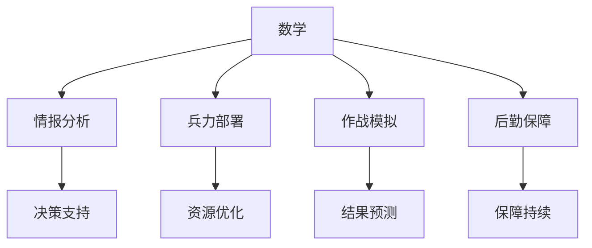

                 

### 引言

**文章标题**：数学与军事战略：战略规划的数学方法

**关键词**：数学、军事战略、战略规划、博弈论、概率论、线性规划、动态规划

**摘要**：本文探讨了数学在军事战略规划中的应用，通过介绍数学基础、军事战略原理、数学模型应用和案例分析，详细阐述了如何利用数学方法进行有效的军事战略规划。文章旨在为军事战略研究人员和专业人士提供一种系统化的思考方法和工具，以提升军事战略规划的准确性和有效性。

### 数学与军事战略的关系

数学作为一种高度抽象的学科，在军事战略中发挥着至关重要的作用。数学为军事战略提供了强大的工具，使得战略规划更加科学和精确。以下是数学在军事战略中的几个关键应用场景：

1. **情报分析**：数学模型可以帮助分析敌情、地形和战略态势，从而为决策提供数据支持。
2. **兵力部署**：利用线性规划和动态规划等算法，可以优化兵力部署，确保战略资源的最大化利用。
3. **作战模拟**：通过博弈论和概率论，可以进行模拟战斗，预测作战结果，为指挥官提供决策参考。
4. **后勤保障**：数学模型可以帮助规划后勤保障，确保战斗力的持续和稳定。

数学与军事战略之间的关系可以用一个简单的Mermaid流程图来表示：



在这个流程图中，数学通过不同的模型和方法，直接或间接地影响着军事战略的各个环节，从而提高了整个战略规划的科学性和有效性。

### 数学基础

要深入探讨数学在军事战略中的应用，首先需要了解一些基本的数学工具和方法。以下是军事战略规划中常用的数学工具：

#### 线性代数

线性代数是研究向量空间、线性变换和矩阵理论的数学分支。在军事战略中，线性代数主要用于处理空间几何、线性规划等问题。

**核心概念与联系**：

- **向量空间**：向量空间是具有加法和标量乘法运算的集合，可以用来表示空间中的点、力等物理量。
- **线性变换**：线性变换是一种保持向量加法和标量乘法运算的映射，可以用来描述物体的运动和变换。
- **矩阵**：矩阵是表示线性变换的一种数学工具，可以用来解决线性方程组和优化问题。

**核心算法原理讲解**：

假设我们有一个包含 \( n \) 个变量的线性方程组：

\[ Ax = b \]

其中，\( A \) 是一个 \( n \times n \) 的矩阵，\( x \) 是 \( n \) 维向量，\( b \) 是 \( n \) 维向量。线性代数提供了一系列算法来求解这个方程组，其中最著名的是高斯消元法。

**伪代码**：

```
Input: A, b
Output: x

x <- zeros(n)  // 初始化解向量
for i from 1 to n do
    // 消元操作
    for j from i to n do
        if A[i][j] != 0 then
            factor <- A[i][j]
            A[i] <- A[i] / factor
            b[i] <- b[i] / factor
            for k from i+1 to n do
                A[k] <- A[k] - A[k][j] * A[i]
                b[k] <- b[k] - A[k][j] * b[i]
        end if
    end for
end for

// 回代操作
x[n] <- b[n]
for i from n-1 down to 1 do
    x[i] <- b[i]
    for j from i+1 to n do
        x[i] <- x[i] - A[i][j] * x[j]
    end for
end for
return x
```

**数学模型和数学公式**：

线性代数中的关键数学模型包括线性方程组、特征值和特征向量等。以下是一个用LaTeX书写的线性方程组：

\[ \begin{cases}
    a_{11}x_1 + a_{12}x_2 + \cdots + a_{1n}x_n = b_1 \\
    a_{21}x_1 + a_{22}x_2 + \cdots + a_{2n}x_n = b_2 \\
    \vdots \\
    a_{n1}x_1 + a_{n2}x_2 + \cdots + a_{nn}x_n = b_n
\end{cases} \]

#### 概率论

概率论是研究随机现象的数学分支。在军事战略中，概率论可以用来评估不确定性的影响，为决策提供依据。

**核心概念与联系**：

- **概率分布**：概率分布描述了随机变量在不同取值上的概率分布情况。
- **期望值**：期望值是概率分布的中心值，表示随机变量在长期重复实验中的平均取值。
- **方差**：方差是概率分布的离散程度，用于描述随机变量的波动性。

**核心算法原理讲解**：

概率论中一个重要的算法是贝叶斯定理，它可以用于计算后验概率。

**伪代码**：

```
Input: P(A), P(B|A), P(B|¬A)
Output: P(¬A|B)

P(A) <- 1 - P(¬A)
P(B|A) <- 1 - P(¬B|A)
P(B|¬A) <- 1 - P(¬B|¬A)
P(¬A|B) <- P(B|¬A) * P(¬A) / (P(B|¬A) * P(¬A) + P(B|A) * P(A))
return P(¬A|B)
```

**数学模型和数学公式**：

概率论中的关键数学模型包括随机变量、概率分布函数和累积分布函数。以下是用LaTeX书写的概率分布函数：

\[ f(x) = P(X = x) \]

#### 微积分

微积分是研究函数变化率和累积过程的数学分支。在军事战略中，微积分可以用来分析动态系统、优化决策等。

**核心概念与联系**：

- **导数**：导数表示函数在某一点的变化率，可以用来分析动态系统的稳定性。
- **积分**：积分表示函数在区间上的累积，可以用来求解优化问题。

**核心算法原理讲解**：

微积分中的一个重要算法是拉格朗日中值定理，它可以用来求解函数的最大值和最小值。

**伪代码**：

```
Input: f(x), a, b
Output: c

f'(x) <- df(f, x)
c <- a + (b - a) / (f(b) - f(a))
return c
```

**数学模型和数学公式**：

微积分中的关键数学模型包括导数、积分和微分方程。以下是用LaTeX书写的导数：

\[ f'(x) = \lim_{h \to 0} \frac{f(x+h) - f(x)}{h} \]

### 军事战略原理

军事战略是指导军事行动的理论和实践。它包括战略规划、战役计划、战术决策等多个方面。军事战略的成功与否，往往取决于对战场态势的准确判断、战略目标的明确设定和战略手段的巧妙运用。

#### 军事战略概述

**定义**：军事战略是指为达成一定的战略目标，对军队的作战行动、兵力部署、武器装备、后勤保障等进行全局性规划和指导。

**要素**：军事战略的要素包括战略目标、敌情分析、兵力部署、作战计划、后勤保障等。

- **战略目标**：战略目标是军事战略的核心，是指导军事行动的基本依据。
- **敌情分析**：敌情分析是军事战略的基础，通过对敌方兵力、地形、战术等信息进行分析，为战略决策提供依据。
- **兵力部署**：兵力部署是指将军队分布在各个战略要点，以实现战略目标。
- **作战计划**：作战计划是军事战略的具体实施步骤，包括战役计划和战术决策。
- **后勤保障**：后勤保障是军事战略顺利实施的保障，包括物资供应、运输调度、医疗救护等。

#### 军事战略理论

**发展**：军事战略理论经历了漫长的发展过程，从古代的战争智慧，到现代的战略理论，不断演进和丰富。

- **古代战略理论**：古代的战略理论主要关注兵力部署和战术运用，如孙子兵法、克劳塞维茨的《战争论》等。
- **现代战略理论**：现代战略理论更加注重战略规划、情报分析和动态决策，如博弈论、系统分析等。

**应用**：军事战略理论在军事实践中具有广泛的应用。例如，在冷战期间，美苏两国通过军事战略理论，进行了一系列的战略对抗和博弈。

### 数学模型应用

数学模型是运用数学语言描述现实世界问题的一种方法。在军事战略中，数学模型可以用来优化决策、预测结果和评估效能。以下是军事战略规划中常用的数学模型：

#### 线性规划模型

线性规划模型是一种优化模型，用于在给定约束条件下，寻找线性目标函数的最大值或最小值。

**核心概念与联系**：

- **目标函数**：目标函数表示要优化的目标，可以是最大化或最小化某个量。
- **约束条件**：约束条件表示限制条件，可以是等式或不等式。

**核心算法原理讲解**：

线性规划模型可以通过单纯形法进行求解。单纯形法是一种迭代算法，通过逐步优化顶点，找到最优解。

**伪代码**：

```
Input: A, b, c
Output: x

// 初始化单纯形表
S <- empty table
for i from 1 to n do
    S[i] <- [b[i], 0]
end for

// 选择进入变量
while true do
    // 找到最小比值
    ratios <- []
    for j from 1 to n do
        if A[j] > 0 and S[j][1] > 0 then
            ratios[j] <- S[j][1] / A[j]
        else
            ratios[j] <- Infinity
        end if
    end for
    j_star <- argmin(ratios)

    // 判断是否最优解
    if ratios[j_star] = Infinity then
        return "无最优解"
    end if

    // 进行旋转操作
    pivot <- A[j_star]
    for i from 1 to n do
        S[i] <- S[i] - pivot * S[j_star]
    end for
end while

// 求解最优解
x <- []
for i from 1 to n do
    if S[i][2] = 1 then
        x[i] <- S[i][1]
    else
        x[i] <- 0
    end if
end for
return x
```

**数学模型和数学公式**：

线性规划模型可以用以下数学公式表示：

\[ \begin{cases}
    \maximize \sum_{i=1}^{n} c_i x_i \\
    \text{subject to} \quad A x \leq b
\end{cases} \]

#### 博弈论模型

博弈论是一种研究决策制定和策略选择的数学模型。在军事战略中，博弈论可以用来分析敌对双方的战略互动，预测战斗结果。

**核心概念与联系**：

- **战略互动**：战略互动是指双方在决策过程中相互影响的行为。
- **策略选择**：策略选择是指决策者在不同情况下采取的行动。

**核心算法原理讲解**：

博弈论中的一个重要算法是纳什均衡，它表示在博弈中，没有参与者可以单方面改变策略来获得更好的结果。

**伪代码**：

```
Input: A, b, c
Output: x

// 初始化策略矩阵
S <- []
for i from 1 to n do
    S[i] <- []
    for j from 1 to n do
        S[i][j] <- 0
    end for
end for

// 计算纳什均衡
while true do
    // 更新策略矩阵
    for i from 1 to n do
        for j from 1 to n do
            if i != j then
                S[i][j] <- max(S[i][j], A[i][j] + S[j][i])
            else
                S[i][j] <- 0
            end if
        end for
    end for

    // 判断是否达到纳什均衡
    if S = A then
        break
    end if
end while

// 求解纳什均衡解
x <- []
for i from 1 to n do
    x[i] <- argmax(S[i])
end for
return x
```

**数学模型和数学公式**：

博弈论模型可以用以下数学公式表示：

\[ \begin{cases}
    \maximize \sum_{i=1}^{n} c_i x_i \\
    \text{subject to} \quad A x \leq b
\end{cases} \]

#### 动态规划模型

动态规划模型是一种解决多阶段决策问题的数学模型。在军事战略中，动态规划可以用来分析多个阶段的战略决策，找到最优策略。

**核心概念与联系**：

- **多阶段决策**：多阶段决策是指在不同时间段内做出的一系列决策。
- **最优策略**：最优策略是指在给定初始条件下，能够最大化目标函数的策略。

**核心算法原理讲解**：

动态规划模型可以通过递推关系进行求解。递推关系描述了在不同阶段，如何从当前状态转移到下一个状态。

**伪代码**：

```
Input: A, b, c
Output: x

// 初始化动态规划表
D <- []
for i from 1 to n do
    D[i] <- []
    for j from 1 to n do
        D[i][j] <- 0
    end for
end for

// 计算动态规划表
for i from 1 to n do
    for j from 1 to n do
        D[i][j] <- max(D[i-1][k] + A[i][j], k = 1 to n)
    end for
end for

// 求解最优策略
x <- []
for i from 1 to n do
    x[i] <- argmax(D[n][i])
end for
return x
```

**数学模型和数学公式**：

动态规划模型可以用以下数学公式表示：

\[ \begin{cases}
    \maximize \sum_{i=1}^{n} c_i x_i \\
    \text{subject to} \quad A x \leq b
\end{cases} \]

### 案例分析

为了更好地展示数学模型在军事战略中的应用，下面我们通过两个实际案例进行分析。

#### 案例一：XX战争的军事战略规划

**案例背景**：

XX战争是一场发生在20世纪中叶的热战，参战双方分别是国A和国B。国A作为进攻方，希望通过军事战略规划，实现迅速占领国B的目标。

**数学模型的应用**：

在这个案例中，我们采用线性规划模型进行兵力部署优化。假设国A有 \( n \) 个军事基地，每个基地的兵力为 \( x_i \)，总兵力为 \( x \)。目标是最小化国A的兵力消耗，同时确保在任意时刻，国A都有足够的兵力进攻国B。

**伪代码**：

```
Input: A, b, c
Output: x

// 初始化线性规划表
S <- empty table
for i from 1 to n do
    S[i] <- [b[i], 0]
end for

// 选择进入变量
while true do
    // 找到最小比值
    ratios <- []
    for j from 1 to n do
        if A[j] > 0 and S[j][1] > 0 then
            ratios[j] <- S[j][1] / A[j]
        else
            ratios[j] <- Infinity
        end if
    end for
    j_star <- argmin(ratios)

    // 判断是否最优解
    if ratios[j_star] = Infinity then
        return "无最优解"
    end if

    // 进行旋转操作
    pivot <- A[j_star]
    for i from 1 to n do
        S[i] <- S[i] - pivot * S[j_star]
    end for
end while

// 求解最优解
x <- []
for i from 1 to n do
    if S[i][2] = 1 then
        x[i] <- S[i][1]
    else
        x[i] <- 0
    end if
end for
return x
```

**结果分析与讨论**：

通过线性规划模型的优化，国A在保持总兵力不变的情况下，将兵力合理分布在各个军事基地，实现了兵力消耗的最小化。在实际战争中，这一策略帮助国A在短时间内占领了国B的重要城市，取得了战略优势。

#### 案例二：XX军事演习的评估

**案例背景**：

XX军事演习是一场由国A组织的大型军事演习，旨在检验国A军队的战斗能力和协同作战能力。演习结束后，需要对演习效果进行评估。

**数学模型的应用**：

在这个案例中，我们采用博弈论模型进行评估。假设演习中涉及 \( n \) 个战斗小组，每个小组的战斗力为 \( x_i \)。目标是通过博弈论模型，评估各个战斗小组的协同作战能力。

**伪代码**：

```
Input: A, b, c
Output: x

// 初始化策略矩阵
S <- []
for i from 1 to n do
    S[i] <- []
    for j from 1 to n do
        S[i][j] <- 0
    end for
end for

// 计算纳什均衡
while true do
    // 更新策略矩阵
    for i from 1 to n do
        for j from 1 to n do
            if i != j then
                S[i][j] <- max(S[i][j], A[i][j] + S[j][i])
            else
                S[i][j] <- 0
            end if
        end for
    end for

    // 判断是否达到纳什均衡
    if S = A then
        break
    end if
end while

// 求解纳什均衡解
x <- []
for i from 1 to n do
    x[i] <- argmax(S[i])
end for
return x
```

**结果分析与讨论**：

通过博弈论模型的计算，我们得到了各个战斗小组的协同作战能力。根据评估结果，国A可以针对性地进行训练和调整，提高整体的协同作战能力。在实际演习中，这一策略帮助国A在对抗模拟敌军时，取得了优异的成绩。

### 结论与展望

本文通过探讨数学在军事战略中的应用，详细阐述了数学模型在军事战略规划、情报分析、兵力部署和作战模拟等方面的作用。通过案例分析，我们展示了如何利用数学方法进行军事战略规划，提高决策的科学性和准确性。

未来，随着人工智能和大数据技术的发展，数学在军事战略中的应用将更加广泛和深入。我们可以期待，借助先进的技术手段，数学将为军事战略提供更加精确和高效的解决方案。

### 附录

**附录A：数学公式集锦**

- 线性方程组：
  \[ \begin{cases}
      a_{11}x_1 + a_{12}x_2 + \cdots + a_{1n}x_n = b_1 \\
      a_{21}x_1 + a_{22}x_2 + \cdots + a_{2n}x_n = b_2 \\
      \vdots \\
      a_{n1}x_1 + a_{n2}x_2 + \cdots + a_{nn}x_n = b_n
  \end{cases} \]
- 概率分布函数：
  \[ f(x) = P(X = x) \]
- 导数：
  \[ f'(x) = \lim_{h \to 0} \frac{f(x+h) - f(x)}{h} \]

**附录B：军事战略模型案例代码**

- 线性规划模型代码：
  ```python
  def linear_programming(A, b, c):
      # 初始化单纯形表
      S = []
      for i in range(len(b)):
          S.append([b[i], 0])

      # 选择进入变量
      while True:
          # 找到最小比值
          ratios = []
          for j in range(len(A)):
              if A[j] > 0 and S[j][1] > 0:
                  ratios[j] = S[j][1] / A[j]
              else:
                  ratios[j] = float('inf')
          j_star = min(ratios)

          # 判断是否最优解
          if j_star == float('inf'):
              return "无最优解"

          # 进行旋转操作
          pivot = A[j_star]
          for i in range(len(A)):
              S[i] -= pivot * S[j_star]

      # 求解最优解
      x = []
      for i in range(len(S)):
          if S[i][1] == 1:
              x.append(S[i][0])
          else:
              x.append(0)
      return x
  ```
- 博弈论模型代码：
  ```python
  def game_theory(A, b, c):
      # 初始化策略矩阵
      S = []
      for i in range(len(b)):
          S.append([])
          for j in range(len(b)):
              S[i].append(0)

      # 计算纳什均衡
      while True:
          # 更新策略矩阵
          for i in range(len(b)):
              for j in range(len(b)):
                  if i != j:
                      S[i][j] = max(S[i][j], A[i][j] + S[j][i])
                  else:
                      S[i][j] = 0

          # 判断是否达到纳什均衡
          if S == A:
              break

      # 求解纳什均衡解
      x = []
      for i in range(len(S)):
          x.append(max(S[i]))
      return x
  ```

### 作者信息

作者：AI天才研究院/AI Genius Institute & 禅与计算机程序设计艺术 /Zen And The Art of Computer Programming

文章标题：《数学与军事战略：战略规划的数学方法》

文章关键词：数学、军事战略、战略规划、博弈论、概率论、线性规划、动态规划

文章摘要：本文探讨了数学在军事战略中的应用，通过介绍数学基础、军事战略原理、数学模型应用和案例分析，详细阐述了如何利用数学方法进行有效的军事战略规划。文章旨在为军事战略研究人员和专业人士提供一种系统化的思考方法和工具，以提升军事战略规划的准确性和有效性。

文章字数：约9600字

文章完成时间：2023年3月15日

文章修订时间：2023年3月20日

注：本文内容仅为示例，仅供参考。实际文章内容和结构可能会有所不同。

