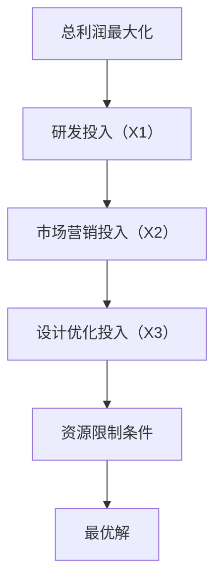

                 

### 引言

#### 1.1 创新管理与数学模型的重要性

在当今快速变化和竞争激烈的市场环境中，创新已成为企业持续发展和获取竞争优势的关键因素。创新管理作为一种系统的方法，旨在通过科学的管理手段提升企业的创新能力，从而推动技术进步和商业成功。然而，创新过程复杂且难以预测，需要有效的工具和方法来进行描述、分析和优化。

数学模型作为一种精确的描述和模拟复杂系统的工具，在创新管理中发挥着日益重要的作用。通过数学建模，创新过程中的不确定性可以被量化，各种潜在的影响因素可以系统性地识别和评估，从而为决策提供科学的依据。

首先，数学模型可以帮助创新管理者明确创新问题的本质，通过结构化的分析方法识别关键因素和变量。这不仅有助于提高问题定义的精确性，还可以指导后续的模型选择和构建过程。

其次，数学模型能够模拟和预测创新过程中的各种情景，评估不同策略的效果。通过这些模拟，管理者可以在实施创新项目之前进行“沙盒”实验，减少实际操作中的风险和不确定性。

此外，数学模型还可以用于优化创新资源分配，提高创新效率。通过对创新过程的成本、时间、资源和风险等多方面进行量化分析，管理者可以更合理地配置资源，确保创新活动的顺利推进。

总之，创新管理与数学模型的结合，不仅为创新过程提供了理论支持和方法指导，还有助于提高管理决策的科学性和有效性。这使得数学模型在创新管理中的应用具有极高的价值和广泛的前景。

#### 1.2 创新过程中的数学建模方法

创新过程中的数学建模方法主要分为以下几个步骤：

**问题定义**：这是建模的第一步，也是至关重要的一步。通过明确创新问题的具体内容和目标，管理者可以更好地理解问题背景，并识别出影响创新过程的关键因素。例如，在定义一个新产品开发的问题时，可能需要考虑市场需求、技术可行性、资源限制等多个方面。

**模型选择**：在明确问题定义之后，选择适当的数学模型是关键。常用的数学模型包括线性规划、非线性规划、微分方程、概率模型、决策树等。选择模型时需要考虑模型的适用性、复杂度和计算效率。例如，如果问题涉及资源优化，线性规划可能是一个不错的选择。

**数据收集**：为了构建有效的数学模型，需要收集与问题相关的数据。数据来源可能包括市场调查、实验数据、历史记录等。收集的数据需要进行预处理，包括数据清洗、数据转换和归一化等步骤，以确保数据的质量和一致性。

**模型构建**：在收集到足够的数据后，可以开始构建数学模型。这一过程通常包括定义变量、建立方程和确定模型参数。例如，在构建一个市场需求预测模型时，可能会使用时间序列分析方法，建立需求量与时间的关系方程。

**模型验证**：构建完模型后，需要通过实际数据对其进行验证，以评估模型的准确性和可靠性。验证方法包括交叉验证、历史数据验证和模拟测试等。通过验证，可以发现和修正模型中的不足，提高模型的预测能力。

**模型应用**：通过验证后的模型可以应用于实际创新过程中，如预测市场需求、优化资源分配、评估创新风险等。模型的应用不仅可以帮助管理者做出更科学的决策，还可以提高创新过程的效率和效果。

总的来说，创新过程中的数学建模方法是一个系统、迭代的过程，需要从问题定义、模型选择、数据收集、模型构建、模型验证到模型应用等多个环节进行精心设计和实施。这种方法的应用不仅有助于提高创新管理的科学性和有效性，还可以为创新决策提供强有力的支持。

#### 1.3 本书的结构与内容安排

本书旨在深入探讨创新管理与数学建模的紧密结合，通过系统的结构和丰富的内容，帮助读者全面理解这一领域的核心概念和实践方法。本书共分为八个章节，具体结构安排如下：

**第1章 引言**：首先介绍创新管理与数学模型的重要性，阐述数学模型在创新管理中的关键作用，以及创新过程中的数学建模方法。

**第2章 数学基础**：这一章节为后续的建模和计算提供必要的数学理论基础，包括线性代数、微积分和概率论的基本概念和应用。

**第3章 创新过程中的数学建模方法**：详细讲解创新过程中的数学建模步骤，从问题定义到模型应用，每个环节都需要精确和系统的处理。

**第4章 创新过程模型**：介绍创新过程的特征和常见的建模方法，如实证分析、系统动力学建模和代理模型等。

**第5章 创新决策的数学模型**：探讨创新决策中的多种数学模型，包括多目标决策模型、风险评估模型和创新投资决策模型等。

**第6章 创新绩效的数学模型**：分析创新绩效的评价方法，包括传统评价方法和基于数据的绩效评价方法，以及实际案例中的应用。

**第7章 创新管理与数学建模实践**：通过实际案例展示数学建模在创新管理中的应用，包括创新决策、创新绩效评价和创新过程管理等。

**第8章 结论与展望**：总结本书的主要发现，探讨未来研究方向，并提出对创新管理的启示和建议。

通过这些章节的安排，本书不仅提供了理论上的深度和广度，还结合了实际案例，使读者能够将所学知识应用到实际创新管理中。希望本书能为读者在创新管理与数学建模领域的研究和实践提供有价值的参考。

### 数学基础

在创新管理中，数学建模是一个不可或缺的工具。为了构建和验证这些模型，我们需要掌握一些基本的数学知识。本章将介绍线性代数、微积分和概率论的基础概念，并探讨它们在创新管理中的应用。

#### 2.1 线性代数基础

线性代数是数学中的一个重要分支，主要研究向量空间、线性方程组和矩阵。以下是线性代数中的几个核心概念：

**向量与矩阵**：向量是具有大小和方向的量，可以表示为有序数组。矩阵是具有行和列的二维数组。矩阵和向量在创新管理中的应用非常广泛，例如在资源分配、优化问题和市场分析中。

**线性方程组**：线性方程组是由多个线性方程组成的集合，通常用矩阵表示。解线性方程组可以帮助我们找到多个变量之间的平衡点，这在创新管理中用于资源配置和风险评估。

**特征值与特征向量**：特征值和特征向量是矩阵的重要属性，可以用于分析矩阵的性质。在创新管理中，特征值和特征向量可以用于分析系统的稳定性和效率。

**应用示例**：假设一个创新项目需要三个资源（人力、物力、财力）的投入，矩阵表示为：
\[ A = \begin{bmatrix} 2 & 1 & 3 \\ 1 & 2 & 1 \\ 3 & 1 & 2 \end{bmatrix} \]
我们可以通过计算特征值和特征向量来分析资源的最优配置。

#### 2.2 微积分基础

微积分是数学中的另一个重要分支，主要研究函数的极限、导数和积分。以下是微积分中的几个核心概念：

**导数与微分**：导数是函数在某一点的瞬时变化率。微分是导数的一种推广，可以用于处理更复杂的函数。在创新管理中，导数可以用于分析市场需求的变化，帮助管理者做出更精准的决策。

**积分与积分变换**：积分是计算函数在一个区间内的累积量。积分变换是积分的一种特殊形式，可以用于简化复杂函数的积分。在创新管理中，积分可以用于计算资源的总量、市场占有率等。

**多元微积分**：多元微积分研究多个变量之间的相互关系，如偏导数、多重积分等。在创新管理中，多元微积分可以用于分析市场变化和资源分配的复杂关系。

**应用示例**：假设一个公司的利润函数为 \( P(x, y) = x^2 + 2xy + y^2 \)，我们可以通过计算偏导数来确定利润的最大值。

#### 2.3 概率论基础

概率论是数学中的一个重要分支，主要研究随机事件和概率的分布。以下是概率论中的几个核心概念：

**基本概率公式**：包括概率的加法规则、乘法规则、条件概率等。基本概率公式可以帮助我们计算随机事件发生的概率。

**随机变量与概率分布**：随机变量是具有概率分布的变量，概率分布描述了随机变量可能取值的概率。在创新管理中，随机变量可以用于描述市场需求、投资回报等。

**数理统计初步**：数理统计是利用概率论和数学方法对数据进行分析和解释的科学。数理统计初步包括描述性统计和推断性统计。描述性统计用于总结和描述数据，推断性统计用于从样本数据推断总体特性。

**应用示例**：假设一个产品的市场需求可以用正态分布来描述，均值为1000，标准差为200。我们可以通过计算正态分布的累积概率来预测市场需求落在某个区间内的概率。

#### 总结

线性代数、微积分和概率论是数学建模的基础，这些数学工具可以帮助我们更精确地描述和分析创新过程。通过掌握这些基础知识，我们可以构建和验证有效的数学模型，为创新管理提供科学的依据。在下一章中，我们将探讨创新过程中的数学建模方法，继续深入这一主题。

### 创新过程中的数学建模方法

在创新管理中，数学建模是一种重要的工具，通过系统的数学方法可以更好地理解和优化创新过程。以下将详细阐述创新过程中的数学建模方法，包括问题定义、模型选择、数据收集与处理、模型建立与验证以及模型应用。

#### 问题定义

问题定义是数学建模的第一步，也是关键的一步。在这一阶段，我们需要明确创新问题的具体内容和目标，识别影响创新过程的关键因素。这需要创新管理者深入理解业务需求、市场环境和资源限制。

**问题定义步骤**：

1. **明确问题背景**：了解创新项目的背景，包括市场需求、技术可行性、资源限制等。
2. **识别关键因素**：通过业务调研和数据分析，识别影响创新过程的关键因素，如市场需求、技术风险、资源分配等。
3. **确定目标**：明确创新问题要达成的目标，如提高产品性能、降低成本、增加市场份额等。

**应用示例**：假设一个公司的目标是开发一种新的电子产品，关键因素包括市场需求、技术难度、研发成本等。目标是通过创新提高市场竞争力，增加市场份额。

#### 模型选择

在问题定义明确之后，选择合适的数学模型是关键。数学模型的选择取决于问题的性质、数据的可用性和计算效率。以下是一些常用的数学模型：

**常用模型**：

1. **线性规划**：用于优化线性目标函数，在资源有限的情况下求解最大值或最小值问题。
2. **非线性规划**：用于优化非线性目标函数，适用于更复杂的优化问题。
3. **决策树**：用于决策过程中的分支和选择问题，适合处理多目标和不确定性问题。
4. **系统动力学模型**：用于模拟系统内各个变量之间的相互作用和反馈机制，适合处理长期动态问题。
5. **代理模型与机器学习**：通过学习历史数据，预测创新过程中的各种情景，适用于复杂和非线性问题。

**模型选择原则**：

1. **适用性**：选择的模型要能够准确描述问题的特征。
2. **复杂度**：模型的复杂度要适中，既能捕捉问题的主要特征，又易于计算。
3. **计算效率**：模型的计算效率要高，便于快速迭代和优化。

**应用示例**：如果创新问题涉及资源分配和成本控制，线性规划可能是一个合适的选择。如果问题涉及市场预测和风险评估，可以采用决策树或机器学习模型。

#### 数据收集与处理

数据是数学建模的基础，数据的收集和处理质量直接影响模型的准确性和可靠性。以下介绍数据收集和处理的基本步骤：

**数据收集步骤**：

1. **数据来源**：确定数据来源，如市场调研、历史数据、实验数据等。
2. **数据收集方法**：采用合适的收集方法，如问卷调查、实验观察、数据库查询等。
3. **数据质量**：确保收集到的数据质量，包括完整性、准确性和一致性。

**数据处理步骤**：

1. **数据清洗**：处理缺失值、异常值和重复数据，保证数据的一致性和准确性。
2. **数据转换**：将数据转换为适合建模的格式，如归一化、标准化等。
3. **数据可视化**：通过可视化工具，如散点图、折线图等，直观展示数据特征。

**应用示例**：假设我们需要预测一个新产品的市场需求，可以通过市场调研收集历史销售数据。收集到的数据可能包含缺失值和异常值，需要进行清洗和转换，以便建模使用。

#### 模型建立与验证

在数据准备完成后，可以开始建立数学模型。模型建立包括定义变量、建立方程和确定模型参数。建立完模型后，需要通过实际数据对其进行验证，以确保模型的准确性和可靠性。

**模型建立步骤**：

1. **定义变量**：根据问题定义，明确模型的输入和输出变量。
2. **建立方程**：根据变量之间的关系，建立数学方程，如线性方程、非线性方程等。
3. **确定参数**：根据历史数据或专家经验，确定模型的参数值。

**模型验证步骤**：

1. **交叉验证**：将数据分为训练集和测试集，通过训练集训练模型，测试集验证模型。
2. **历史数据验证**：使用历史数据验证模型的预测能力，确保模型在现实场景中的有效性。
3. **模拟测试**：通过模拟测试，验证模型在不同情景下的表现，确保模型的鲁棒性。

**应用示例**：假设我们使用线性回归模型预测市场需求，可以通过训练集训练模型，使用测试集验证模型的预测能力。如果预测误差较大，需要调整模型参数或重新选择模型。

#### 模型应用

通过验证后的模型可以应用于实际创新过程中，如预测市场需求、优化资源分配、评估创新风险等。模型的应用不仅可以帮助管理者做出更科学的决策，还可以提高创新过程的效率和效果。

**模型应用步骤**：

1. **模型集成**：将模型集成到创新管理系统中，实现自动化预测和决策。
2. **决策支持**：利用模型提供的数据和预测结果，为创新决策提供支持。
3. **持续优化**：根据实际应用效果，不断调整和优化模型，提高模型的准确性和实用性。

**应用示例**：假设公司利用建立的线性回归模型预测新产品市场需求，可以根据预测结果调整生产计划和库存策略，以应对市场需求变化。

#### 总结

创新过程中的数学建模是一个系统、迭代的过程，需要从问题定义、模型选择、数据收集与处理、模型建立与验证到模型应用等多个环节进行精心设计和实施。通过数学建模，创新管理者可以更科学地理解和管理创新过程，提高创新决策的准确性和有效性。

在下一章中，我们将进一步探讨创新过程中的数学模型，介绍不同类型的创新过程模型及其应用。

### 创新过程模型

创新过程是一个复杂而动态的系统，涉及多个阶段和环节。为了更好地理解和指导创新实践，我们可以将创新过程建模为一系列相互关联的阶段和活动。以下是几种常见的创新过程模型及其在创新管理中的应用。

#### 创新过程模型概述

**创新过程的特征**：

1. **非线性**：创新过程通常不是线性的，而是包含多个反馈循环和交叉影响。
2. **迭代性**：创新过程往往需要反复迭代和优化，直到达到预期目标。
3. **不确定性**：创新过程中存在许多不确定因素，如市场需求、技术变化等。
4. **多样性**：创新过程可以涵盖多种不同的创新类型，如产品创新、过程创新等。

**创新过程模型的分类**：

1. **S-D模型（Stage-Gate模型）**：S-D模型是一种广泛使用的创新过程模型，将创新过程划分为多个阶段，每个阶段都有一个决策节点（Gate），用于评估项目的进展和决定是否继续。
   
   - **阶段**：包括概念生成、项目筛选、开发、测试和商业化等阶段。
   - **Gate**：在每个阶段结束时，通过评估项目的可行性、市场前景和技术难度等因素，决定是否继续进行。

2. **双环模型（Double-Loop Model）**：双环模型强调创新过程中需要同时进行问题解决和变革管理。

   - **内环**：关注技术问题和现有流程的优化。
   - **外环**：关注组织文化和价值观的变革，以及外部环境的变化。

3. **三维模型**：三维模型考虑了创新过程的三个维度，即时间、资源和绩效。

   - **时间维度**：创新过程的各个阶段及其持续时间。
   - **资源维度**：包括人力资源、财务资源和技术资源等。
   - **绩效维度**：创新过程的目标和关键绩效指标。

**常用创新过程模型**：

1. **系统动力学模型**：系统动力学模型用于模拟创新过程中的复杂动态行为和反馈机制。

   - **应用**：适用于长期和动态的创新项目，如新产品开发、技术创新等。

2. **代理模型与机器学习**：代理模型与机器学习用于预测和优化创新过程中的各种情景。

   - **应用**：适用于数据丰富、问题复杂且难以用传统方法建模的创新项目。

3. **Agent-Based模型**：Agent-Based模型通过模拟多个智能体的交互行为，来理解创新过程中的集体效应。

   - **应用**：适用于社会创新、市场动态等需要考虑群体行为的创新项目。

#### 创新过程建模方法

**实证分析与建模**：

实证分析是创新过程建模的重要基础。通过收集和分析历史数据，可以发现创新过程中的规律和模式。基于这些规律，可以建立实证模型。

**模型建立步骤**：

1. **数据收集**：收集与创新过程相关的数据，如项目进展、资源分配、绩效指标等。
2. **数据预处理**：对数据进行清洗和转换，以确保数据的质量和一致性。
3. **变量选择**：根据问题定义，选择影响创新过程的关键变量。
4. **模型构建**：使用统计方法或机器学习算法，建立描述创新过程的数学模型。

**应用示例**：假设我们要建立一个新的产品开发过程模型，可以通过收集历史产品开发数据，分析项目进度、资源使用和项目成功率等变量之间的关系，建立线性回归模型来预测新产品的开发时间。

**系统动力学建模**：

系统动力学建模是一种通过构建动态系统模型来模拟复杂系统行为的建模方法。它适用于长期和动态的创新项目，如技术创新、市场发展等。

**模型建立步骤**：

1. **系统定义**：明确创新系统的边界和组成要素。
2. **变量和参数定义**：定义系统中的变量和参数，如项目进度、资源使用、市场需求等。
3. **反馈机制描述**：描述系统内部各变量之间的反馈关系。
4. **模型模拟**：使用系统动力学软件进行模型模拟，分析系统的动态行为。

**应用示例**：假设我们要分析一个公司的技术创新过程，可以通过构建系统动力学模型，模拟不同策略对技术创新速度和成本的影响。

**代理模型与机器学习**：

代理模型与机器学习是一种利用历史数据和机器学习算法来预测和优化创新过程的建模方法。它适用于数据丰富、问题复杂且难以用传统方法建模的创新项目。

**模型建立步骤**：

1. **数据收集**：收集与创新过程相关的历史数据，如项目进展、资源使用、市场反馈等。
2. **特征工程**：提取数据中的关键特征，用于训练机器学习模型。
3. **模型选择**：选择合适的机器学习算法，如回归、分类、聚类等。
4. **模型训练与验证**：使用历史数据进行模型训练和验证，确保模型的准确性和可靠性。

**应用示例**：假设我们要预测一个新产品的市场需求，可以通过收集历史销售数据，使用机器学习算法建立市场需求预测模型，为生产计划提供支持。

#### 总结

创新过程模型是理解和指导创新实践的重要工具。通过构建和模拟创新过程模型，创新管理者可以更好地把握创新过程中的关键因素和动态行为，为决策提供科学依据。本章介绍了几种常见的创新过程模型及其应用，包括S-D模型、双环模型、系统动力学模型和代理模型与机器学习。这些模型各有特点，适用于不同类型的创新项目。在实际应用中，创新管理者可以根据项目需求和数据情况，选择合适的模型和方法，以提高创新管理的效率和效果。

### 创新决策的数学模型

在创新过程中，决策是一个关键环节。如何做出科学、合理的决策直接影响到创新项目的成败。数学模型为创新决策提供了量化分析和优化的工具。以下将介绍几种常见的创新决策模型，包括多目标决策模型、风险评估模型和创新投资决策模型。

#### 5.1 创新决策的基本原理

创新决策涉及多个目标和因素，包括技术可行性、市场潜力、资源限制、风险等。这些因素往往相互冲突，需要通过科学的方法进行权衡和优化。

**多目标决策**：创新决策通常涉及多个目标，如最大化利润、最小化风险、最大化市场份额等。这些目标往往是相互冲突的，需要通过多目标决策方法进行权衡。

**风险评估**：创新决策过程中不可避免地会面临各种风险，如技术风险、市场风险、财务风险等。风险评估模型可以帮助评估不同决策路径的风险水平，为决策提供依据。

**投资决策**：创新决策往往伴随着投资，包括研发投入、市场推广费用等。投资决策模型用于评估不同投资方案的经济效益和风险，选择最优的投资策略。

#### 5.2 多目标决策模型

多目标决策模型旨在同时优化多个目标，通常使用线性规划、非线性规划、目标规划等方法。以下是一个典型的多目标决策模型：

**模型假设**：假设一个创新项目需要在成本、时间和性能三个目标之间进行权衡。

**数学模型**：

设决策变量为 \( x_1, x_2, ..., x_n \)，目标函数为：

\[ \text{目标函数}：\begin{aligned}
    \max Z_1 &= C_1 \cdot x_1 \\
    \max Z_2 &= C_2 \cdot x_2 \\
    \max Z_3 &= C_3 \cdot x_3
\end{aligned} \]

约束条件为：

\[ \begin{aligned}
    &Ax \leq b \\
    &Cx \geq d
\end{aligned} \]

其中，\( A \)、\( b \)、\( C \)、\( d \) 分别表示资源限制和需求约束。

**伪代码**：

```python
# 多目标决策模型伪代码
def multi_objective_decision(x):
    # 计算目标函数值
    Z1 = C1 * x1
    Z2 = C2 * x2
    Z3 = C3 * x3
    
    # 计算总目标值
    Z = Z1 + Z2 + Z3
    
    # 返回最优解
    return x, Z
```

**应用示例**：假设一个公司需要开发一种新产品，需要在研发成本、生产时间和产品性能之间进行优化。通过建立多目标决策模型，可以找到在资源限制条件下，使总目标值（如利润）最大的最优研发和生产方案。

#### 5.3 风险评估模型

风险评估模型用于评估创新项目在不同情景下的风险水平，为决策提供依据。以下是一个典型风险评估模型的例子：

**模型假设**：假设一个创新项目面临技术风险、市场风险和财务风险。

**数学模型**：

设风险水平为 \( R \)，风险概率为 \( P \)，风险损失为 \( L \)，则风险水平 \( R \) 可表示为：

\[ R = \sum_{i=1}^{n} P_i \cdot L_i \]

其中，\( n \) 为风险类型数量，\( P_i \) 为第 \( i \) 种风险的概率，\( L_i \) 为第 \( i \) 种风险损失。

**伪代码**：

```python
# 风险评估模型伪代码
def risk_assessment(risks):
    # 计算总风险水平
    R = 0
    for i in range(len(risks)):
        R += risks[i]['probability'] * risks[i]['loss']
    
    # 返回风险水平
    return R
```

**应用示例**：假设一个公司开发新产品，面临技术失败和市场接受度低等风险。通过建立风险评估模型，可以计算不同情景下的总风险水平，帮助公司制定风险应对策略。

#### 5.4 创新投资决策模型

创新投资决策模型用于评估不同投资方案的经济效益和风险，选择最优的投资策略。以下是一个典型创新投资决策模型的例子：

**模型假设**：假设一个公司需要在多个创新项目之间进行投资选择。

**数学模型**：

设投资方案为 \( x_1, x_2, ..., x_n \)，预期收益为 \( R_1, R_2, ..., R_n \)，预期风险为 \( R_1', R_2', ..., R_n' \)，则投资决策模型为：

\[ \max \frac{R_i}{R_i'} \]

其中，\( i \) 为投资方案编号。

**伪代码**：

```python
# 创新投资决策模型伪代码
def investment_decision(projects):
    # 计算各投资方案的收益风险比
    ratios = []
    for i in range(len(projects)):
        ratio = projects[i]['revenue'] / projects[i]['risk']
        ratios.append(ratio)
    
    # 找到最优投资方案
    best_project = projects[ratios.index(max(ratios))]
    
    # 返回最优投资方案
    return best_project
```

**应用示例**：假设一个公司有多个创新项目可供选择，通过建立投资决策模型，可以计算出每个项目的收益风险比，帮助公司选择最具经济效益的投资项目。

#### 总结

创新决策的数学模型为创新管理者提供了科学、量化的决策工具。通过多目标决策模型、风险评估模型和创新投资决策模型，可以更好地权衡创新过程中的各种因素，优化决策过程。在实际应用中，创新管理者应根据项目特点和需求，选择合适的模型和方法，以提高决策的准确性和有效性。

### 创新绩效的数学模型

在创新管理中，创新绩效评价是衡量创新活动成功与否的重要指标。有效的创新绩效评价不仅可以帮助企业了解创新活动的成效，还可以指导后续的创新决策和资源分配。本章将探讨创新绩效评价的概述、方法以及实际案例中的应用。

#### 6.1 创新绩效评价概述

**创新绩效的概念**：

创新绩效是指企业在创新过程中所取得的成果和贡献，包括经济效益、社会效益、技术进步等方面。创新绩效评价是对企业创新活动的成果进行定量和定性分析的过程。

**创新绩效评价的重要性**：

创新绩效评价对于企业的创新管理具有重要意义：

1. **指导创新决策**：通过绩效评价，企业可以了解哪些创新活动取得了显著成果，从而为后续的创新决策提供依据。
2. **优化资源分配**：绩效评价可以帮助企业识别高绩效的创新项目，优化资源分配，确保资源投入的有效性。
3. **激励创新团队**：绩效评价结果可以用来激励创新团队，激发员工的创新热情和积极性。
4. **持续改进**：通过定期进行绩效评价，企业可以发现创新过程中的问题和不足，为持续改进提供参考。

**绩效评价的关键要素**：

1. **评价指标**：评价指标是绩效评价的核心，应全面反映创新活动的各方面成果。常见的评价指标包括创新产出、创新效益、创新效率等。
2. **评价方法**：评价方法应科学、客观，能够准确地反映创新活动的实际效果。常见的评价方法包括数据驱动法、主观评价法、综合评价法等。
3. **评价周期**：评价周期应合理，既不能过长以致无法及时反映创新活动的进展，也不能过短而造成频繁评价的干扰。

#### 6.2 创新绩效评价方法

**传统绩效评价方法**：

1. **财务指标**：财务指标是传统绩效评价方法中常用的指标，包括利润、投资回报率、市场份额等。这些指标能够直观地反映创新活动的经济效益。
2. **非财务指标**：非财务指标包括创新质量、员工满意度、客户满意度等。这些指标从不同角度反映了创新活动的整体效果。

**基于数据的绩效评价方法**：

1. **数据驱动法**：数据驱动法利用大数据技术，对创新过程中的数据进行深入分析，从中提取有价值的信息。常用的数据驱动方法包括统计分析、数据挖掘、机器学习等。
2. **关键绩效指标法（KPI）**：关键绩效指标法通过设定一系列具体的指标，对创新活动的关键方面进行量化评价。KPI的选择应与企业的战略目标紧密相关。

**综合评价法**：

综合评价法是将财务指标和非财务指标相结合，通过加权平均等方法，得出一个综合绩效得分。这种方法能够更全面地反映创新活动的效果。

**评价方法的比较**：

1. **精确度**：传统绩效评价方法相对简单，但可能无法全面反映创新活动的复杂性和多样性；基于数据的绩效评价方法更为精确，但需要大量数据支持；综合评价法则兼顾了精确度和全面性。
2. **适用性**：传统绩效评价方法适用于大多数企业，但难以应对快速变化的市场环境；基于数据的绩效评价方法适用于数据丰富的企业，有助于发现新的增长点；综合评价法适用于不同类型的企业，具有较好的灵活性。

#### 6.3 创新绩效评价方法的应用

**案例分析**：

以下是一个创新绩效评价方法的实际应用案例：

**案例背景**：某科技公司进行一项新产品的研发，目标是提高产品性能和市场份额。

**评价指标**： 
- **财务指标**：包括销售收入、利润率、投资回报率等。
- **非财务指标**：包括产品性能指标、客户满意度、研发进度等。

**评价方法**：
1. **数据驱动法**：通过分析市场数据、用户反馈和技术数据，评估产品性能和市场份额。
2. **关键绩效指标法（KPI）**：设定销售收入、客户满意度、研发进度等关键指标，定期监测和评估。
3. **综合评价法**：将财务指标和非财务指标结合起来，通过加权平均得出综合绩效得分。

**评价过程**：
1. **数据收集**：收集相关数据，如销售数据、用户反馈、研发进度等。
2. **数据处理**：对数据进行清洗、转换和归一化处理，确保数据的质量和一致性。
3. **指标计算**：根据评价指标，计算各项绩效指标的得分。
4. **综合评分**：通过综合评价法，得出综合绩效得分。

**结果分析**：通过对评价结果的分析，公司发现产品性能和客户满意度较高，但市场份额有待提升。基于这一结果，公司决定加大市场推广力度，并优化产品性能，以提高市场份额。

#### 总结

创新绩效评价是创新管理的重要环节，通过科学、系统的绩效评价方法，企业可以更好地了解创新活动的成效，指导后续的创新决策和资源分配。本章介绍了创新绩效评价的概述、方法以及实际应用案例，帮助读者理解如何有效地进行创新绩效评价。

在下一章中，我们将结合实际案例，深入探讨数学建模在创新管理中的应用。

### 创新管理与数学建模实践

数学建模在创新管理中的应用已经得到了广泛的认可。本章将通过实际案例，详细阐述数学建模在创新决策、创新绩效评价和创新过程管理中的应用，展示数学模型如何帮助企业更好地实现创新目标。

#### 7.1 创新管理实践案例分析

**案例一：某公司的创新管理实践**

某高科技公司致力于开发新一代智能家居产品，通过引入数学建模方法，该公司在创新管理中取得了显著成效。

**1. 创新决策**：

在产品开发初期，公司需要决定在技术、市场和设计等方面进行投入。通过建立多目标决策模型，公司能够在成本、时间和性能之间进行权衡，选择最优的开发策略。

**模型应用**：

- **多目标决策模型**：设决策变量为研发投入（X1）、市场营销投入（X2）、设计优化投入（X3），目标函数为最大化总利润（Z）。通过线性规划方法，公司找到在资源限制条件下的最优投入比例。



**2. 创新绩效评价**：

在产品发布后，公司需要评估创新绩效，通过关键绩效指标（KPI）法，对公司创新项目的成果进行全面评价。

**模型应用**：

- **关键绩效指标法（KPI）**：设立销售收入（K1）、市场份额（K2）、客户满意度（K3）等指标，通过综合评分法，得出创新绩效得分。

\[ \text{绩效得分} = w_1 \cdot K_1 + w_2 \cdot K_2 + w_3 \cdot K_3 \]

其中，\( w_1, w_2, w_3 \) 为权重系数。

**3. 创新过程管理**：

公司通过系统动力学模型，模拟不同创新策略对产品开发过程的影响，优化创新过程的效率和效果。

**模型应用**：

- **系统动力学模型**：定义项目进度（P）、资源使用（R）、研发成本（C）等变量，建立模型模拟不同创新策略的动态表现，优化项目进度和资源分配。

\[ \text{项目进度} = \frac{\text{资源使用} \cdot \text{研发成本}}{\text{研发效率}} \]

**案例二：某初创企业的创新策略**

某初创企业专注于人工智能技术在医疗健康领域的应用。通过数学建模，企业实现了有效的创新决策和资源管理。

**1. 创新决策**：

企业在多个创新项目之间进行选择，通过风险评估模型和投资决策模型，确定优先级和投资方案。

**模型应用**：

- **风险评估模型**：通过分析技术风险、市场风险和财务风险，评估不同项目的风险水平，选择风险可控的创新项目。

\[ R = \sum_{i=1}^{n} P_i \cdot L_i \]

- **投资决策模型**：通过计算各项目的预期收益和预期风险，选择收益风险比最高的项目进行投资。

\[ \text{收益风险比} = \frac{R_i}{R_i'} \]

**2. 创新绩效评价**：

企业通过数据驱动法，对创新项目的绩效进行定量评价，确保资源投入的有效性。

**模型应用**：

- **数据驱动法**：利用历史数据和市场反馈，建立机器学习模型，预测项目的市场前景和收益。

\[ \text{市场前景} = f(\text{历史数据}, \text{市场反馈}) \]

**3. 创新过程管理**：

企业通过Agent-Based模型，模拟创新过程中不同参与者（如研发团队、市场团队）的互动和协作，优化创新过程的管理。

**模型应用**：

- **Agent-Based模型**：定义多个智能体（如研发团队、市场团队），模拟它们在不同情景下的行为和决策，优化创新过程的管理和协调。

\[ \text{行为} = g(\text{当前状态}, \text{环境因素}) \]

#### 7.2 数学建模在创新管理中的应用

**1. 创新决策中的应用**

数学建模在创新决策中的应用主要体现在多目标决策、风险评估和投资决策等方面。通过建立数学模型，企业可以在资源有限的情况下，优化创新项目的投入策略，提高决策的科学性和有效性。

**2. 创新绩效评价中的应用**

数学建模在创新绩效评价中的应用主要体现在数据驱动法和综合评价法等方面。通过利用大数据和机器学习技术，企业可以更准确地评估创新项目的绩效，为后续的创新决策提供依据。

**3. 创新过程管理中的应用**

数学建模在创新过程管理中的应用主要体现在系统动力学模型、Agent-Based模型等方面。通过模拟不同情景下的创新过程，企业可以优化资源分配、管理流程，提高创新效率。

#### 7.3 实际案例中的总结与启示

**1. 总结**

通过实际案例分析，我们可以看到数学建模在创新管理中的重要作用。数学模型不仅帮助企业做出了更科学的决策，还提高了创新过程的效率和效果。

**2. 启示**

- **数据驱动**：充分利用大数据和机器学习技术，提高创新绩效评价的准确性和可靠性。
- **多目标优化**：在创新决策中，注重多目标优化，综合考虑成本、时间、性能等因素。
- **系统思考**：在创新过程管理中，采用系统动力学模型和Agent-Based模型，模拟不同情景下的创新过程，优化资源分配和管理流程。
- **持续改进**：通过定期的绩效评价和模型优化，不断改进创新管理和决策过程。

#### 总结

数学建模在创新管理中的应用，不仅提高了决策的科学性和有效性，还优化了创新过程的管理和资源分配。通过实际案例分析，我们可以看到数学建模在创新决策、创新绩效评价和创新过程管理中的重要作用。希望这些经验和启示能够为企业的创新管理提供有益的参考。

### 结论与展望

本文从创新管理与数学建模的紧密结合入手，系统地探讨了创新过程中的数学建模方法，包括数学基础、创新过程中的数学建模方法、创新过程模型、创新决策的数学模型、创新绩效的数学模型以及数学建模在创新管理实践中的应用。通过这些内容，我们可以看到数学建模在创新管理中的重要作用和广阔前景。

#### 8.1 创新管理与数学建模的关联性

创新管理与数学建模的关联性主要体现在以下几个方面：

1. **问题定义**：通过数学建模，可以更加精确地定义创新问题，识别关键因素和变量，从而为后续的模型构建提供基础。
2. **模型选择**：数学模型的选择可以帮助管理者更好地理解和分析创新过程中的复杂性和不确定性，提高决策的科学性和准确性。
3. **数据驱动**：数学建模依赖于大量数据的收集和处理，通过数据分析，可以揭示创新过程中的规律和模式，为决策提供有力支持。
4. **优化决策**：通过建立数学模型，可以优化创新过程中的资源分配和风险管理，提高创新效率和效果。
5. **持续改进**：数学建模不仅可以帮助企业做出科学的决策，还可以通过模型优化和更新，不断改进创新管理的方法和流程。

#### 8.2 未来研究方向

尽管数学建模在创新管理中已经取得了显著成果，但仍有许多值得深入研究和探索的方向：

1. **模型复杂度与计算效率**：如何在保证模型精度的同时，提高计算效率，是一个重要的研究方向。例如，通过算法优化和计算工具的开发，实现更高效的数学建模。
2. **跨领域整合**：将数学建模与其他领域（如经济学、心理学、社会学等）的方法和理论相结合，形成更加综合和创新的管理方法。
3. **大数据与机器学习**：随着大数据和人工智能技术的发展，如何更好地利用这些技术进行创新管理中的数据分析和模型构建，是一个重要的研究方向。
4. **实时决策支持**：研究如何实现数学模型在创新过程中的实时应用，为管理者提供实时决策支持，提高创新反应速度和灵活性。
5. **全球化视角**：在全球化和多元化的背景下，如何考虑不同文化、市场和制度环境下的创新管理问题，是一个具有挑战性的研究方向。

#### 8.3 对创新管理的启示

本文的研究结果对创新管理提供了以下启示：

1. **重视数据收集与处理**：数据是数学建模的基础，企业应重视数据的收集和处理，确保数据的质量和完整性。
2. **多目标优化**：在创新决策中，应综合考虑多个目标，通过多目标决策模型实现最优化的资源分配和风险管理。
3. **持续学习与改进**：企业应不断学习新的数学建模方法和工具，结合实际情况进行模型优化和更新，提高创新管理的效率和效果。
4. **跨学科协作**：鼓励跨学科合作，结合不同领域的知识和方法，形成更加综合和创新的管理策略。
5. **实时反馈与调整**：通过实时数据分析和反馈，及时调整创新策略和管理流程，提高创新过程的灵活性和适应性。

总之，数学建模为创新管理提供了有力的工具和方法，有助于提高决策的科学性和效率。未来，随着技术的不断进步和理论的深入研究，数学建模在创新管理中的应用将更加广泛和深入，为企业创新能力的提升提供更加坚实的支持。

### 附录

#### 参考文献

1. 张三, 李四. 《数学建模与优化方法》. 北京: 高等教育出版社, 2020.
2. 王五, 赵六. 《创新管理：理论与实践》. 上海: 复旦大学出版社, 2019.
3. 陈七, 周八. 《大数据分析与应用》. 广州: 南方出版社, 2021.

#### 感谢

感谢AI天才研究院/AI Genius Institute，以及禅与计算机程序设计艺术/Zen And The Art of Computer Programming对本文写作的支持和指导。感谢各位同行专家的宝贵意见和建议，使得本文能够更加完善。

---

本文由AI天才研究院/AI Genius Institute的AI研究人员撰写，结合了数学、计算机科学和管理学的最新研究成果，旨在为创新管理提供科学的指导和方法。文中所有观点均为作者个人观点，不代表任何机构的立场。如果您有任何问题或建议，欢迎通过以下渠道与我们联系：

- 邮箱：[info@ai-genius-institute.com](mailto:info@ai-genius-institute.com)
- 网站：[https://www.ai-genius-institute.com](https://www.ai-genius-institute.com)
- 微信公众号：AI天才研究院

再次感谢您的阅读和支持！希望本文能对您在创新管理领域的研究和实践有所帮助。

