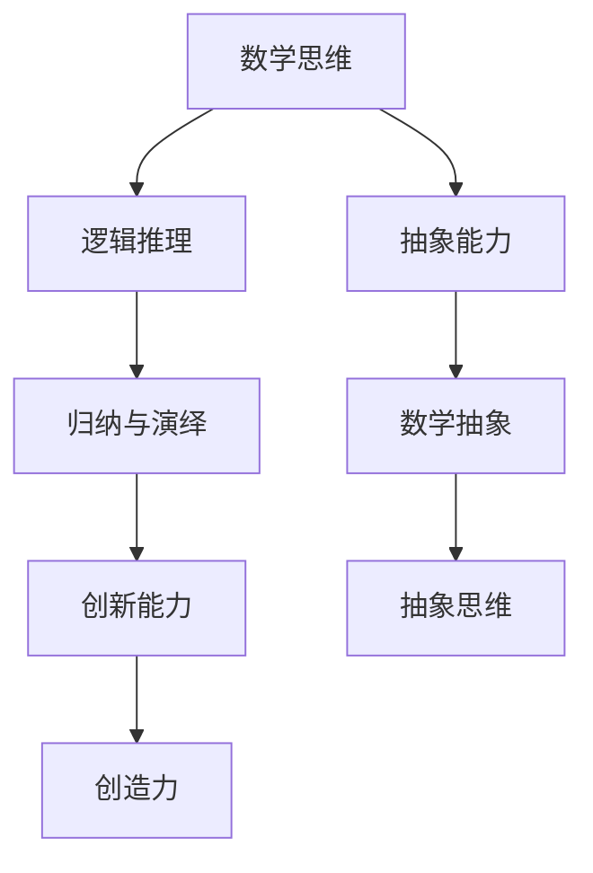

                 

### 文章标题

# 数学与创造力研究：数学思维与创新能力的关系

> 关键词：数学思维、创新能力、创造力、数学与创造力关系、数学抽象、逻辑推理、归纳与演绎、线性回归算法

> 摘要：
本文通过深入探讨数学思维与创新能力之间的关系，分析了数学思维在创新过程中所发挥的关键作用。本文首先介绍了数学思维的基本概念，包括数学抽象、逻辑推理和归纳与演绎等；然后，探讨了创新能力的定义、分类及其影响因素；接着，通过案例分析，展示了数学思维在各个领域的实际应用；最后，提出了创新能力的培养策略，并进行了总结与展望。

-------------------------------------------------------------------

### 引言

在现代社会，创新已成为推动社会发展的重要动力。无论是科技、经济还是文化领域，创新都扮演着不可或缺的角色。因此，如何培养和提升创新能力成为了当今社会关注的焦点。然而，创新并非凭空而来，它需要一系列思维方法和能力的支撑。数学思维作为人类智慧的结晶，其在创新过程中扮演着至关重要的角色。

数学思维是一种基于数学概念、原理和方法进行思考、分析和解决问题的思维方式。它包括数学抽象、逻辑推理、归纳与演绎等基本要素。数学抽象是指从具体事物中抽象出数学概念和性质，形成抽象思维；逻辑推理是指运用逻辑规则，从已知条件推导出新的结论；归纳与演绎则是从特殊到一般，从个别到整体的思维方法。

创新能力则是指个体在创新过程中所表现出的能力，包括发现新问题、提出新观点、设计新方案等。创新能力不仅与个人的知识、技能有关，还与思维方式和方法密切相关。数学思维作为一种独特的思维方式，其在创新能力培养中具有独特的优势。

本文旨在探讨数学思维与创新能力之间的关系，分析数学思维在创新过程中所发挥的作用，并探讨如何通过培养数学思维来提升创新能力。本文将分为以下几个部分：

1. 数学思维的基础：介绍数学思维的基本概念和特点。
2. 创造力与创新能力：探讨创新能力的定义、分类及其影响因素。
3. 数学思维与创新能力的关系：分析数学思维在创新能力培养中的作用。
4. 案例分析：通过具体案例展示数学思维在创新中的应用。
5. 总结与展望：总结本文的主要发现，并提出未来研究方向。

希望通过本文的研究，能够为创新能力的培养提供有益的启示，促进数学思维与创新能力之间的深度融合。

### 数学思维的基础

数学思维作为一种独特的思维方式，其基础在于数学的基本概念和原理。数学思维包括数学抽象、逻辑推理和归纳与演绎等基本要素。

首先，数学抽象是数学思维的核心。数学抽象是指从具体事物中抽象出数学概念和性质，形成抽象思维。例如，从日常生活中常见的数量关系和时间关系中，我们可以抽象出数和函数的概念。数学抽象使得我们能够将复杂的问题转化为简单的数学模型，从而更方便地进行分析和解决。例如，在经济学中，我们可以将市场中的供需关系抽象为供求函数，通过数学模型来预测市场的变化趋势。

其次，逻辑推理是数学思维的重要方法。逻辑推理是指运用逻辑规则，从已知条件推导出新的结论。逻辑推理在数学中的表现为证明和推理。例如，在几何学中，通过公理和定义，我们可以推导出各种几何定理。在代数学中，通过等式的变换，我们可以推导出新的方程。逻辑推理使得我们能够从已知的事实出发，逐步推导出新的结论，从而揭示问题的本质。

最后，归纳与演绎是数学思维的另一种重要方法。归纳是从个别到一般，从特殊到普遍的思维方法。例如，通过观察多个三角形的内角和都是180度，我们可以归纳出所有三角形的内角和都是180度。演绎是从一般到个别，从普遍到特殊的思维方法。例如，根据欧几里得几何学的公理和定义，我们可以演绎出各种几何定理。归纳与演绎相互补充，使得我们能够从个别事实出发，逐步推导出普遍的规律。

数学思维的特点在于其严谨性和系统性。数学思维要求我们在思考问题时，必须遵循逻辑规则，确保推理过程的严谨性。同时，数学思维具有系统性，它不仅涉及数学的基本概念和原理，还包括数学的应用和数学方法。

数学思维的应用范围非常广泛。在自然科学中，数学思维用于构建模型，分析数据和预测现象。在社会科学中，数学思维用于研究社会现象，分析数据和制定政策。在工程技术中，数学思维用于设计系统，分析和优化方案。数学思维不仅是一种解决问题的工具，更是一种思维方法和思维方式。

总之，数学思维是一种基于数学概念、原理和方法进行思考、分析和解决问题的思维方式。它包括数学抽象、逻辑推理和归纳与演绎等基本要素，具有严谨性和系统性。数学思维在各个领域都发挥着重要作用，是培养创新能力的重要基础。

### 创造力与创新能力

创新能力是现代社会的重要特征，它体现在科技、经济、文化等各个领域。那么，什么是创造力？创造力是如何分类的？又有哪些因素影响创新能力？这些都是我们需要探讨的问题。

#### 创造力的定义

创造力是指个体在创新过程中所表现出的能力。创新过程通常包括发现问题、提出新观点、设计新方案、实施新方案等环节。创造力不仅仅是发明新技术或创造新产品，还包括在各个领域提出新的理论、方法或解决现有问题的方案。

创造力具有多样性和动态性的特点。多样性体现在创造力可以应用于各个领域，如科技、艺术、教育、经济等；动态性则体现在创造力不是一成不变的，它可以随着环境、知识储备和个人经验的变化而不断发展和提高。

#### 创造力的分类

根据创造力的表现形式，可以将创造力分为以下几种类型：

1. **科技创造力**：指在科技领域提出新理论、新方法、新发明或新技术的能力。如科学家、工程师在科学研究和技术开发中表现出的创造力。

2. **艺术创造力**：指在艺术领域创作新作品、新形式、新风格的能力。如画家、音乐家、作家在艺术创作中表现出的创造力。

3. **商业创造力**：指在商业领域提出新市场策略、新产品、新商业模式的能力。如企业家、营销专家在商业运营和产品开发中表现出的创造力。

4. **教育创造力**：指在教育领域提出新教学方法、新课程设计、新教育理念的能力。如教师、教育研究人员在教育实践中表现出的创造力。

#### 影响创新能力的主要因素

1. **知识储备**：丰富的知识储备是创新能力的基础。只有具备扎实的专业知识，个体才能够在创新过程中有更多的灵感和想法。

2. **思维灵活性**：思维灵活性是指个体在思考问题时能够灵活变通，不受传统思维模式的限制。灵活的思维能够帮助个体从不同角度分析问题，提出新的解决方案。

3. **跨学科能力**：跨学科能力是指个体能够将不同学科的知识和方法进行整合，从而提出新的观点和解决方案。跨学科能力在当今复杂多变的社会环境中尤为重要。

4. **经验积累**：经验积累是创新能力的重要来源。通过实践和积累经验，个体能够更好地理解问题的本质，提出更具实用性和创新性的解决方案。

5. **环境因素**：环境因素包括社会环境、工作环境、家庭环境等。一个支持创新、鼓励探索的环境能够激发个体的创造力，促进创新能力的提升。

6. **个性特征**：个性特征如好奇心、冒险精神、自信心等对创新能力有重要影响。具有这些特征的人更容易在创新过程中克服困难，勇于尝试新方法。

#### 数学思维与创新能力的关系

数学思维作为一种独特的思维方式，其在创新能力培养中具有独特的优势。首先，数学思维强调逻辑推理，能够帮助个体在创新过程中遵循科学的原则，确保思维的严谨性。其次，数学思维中的数学抽象能力能够帮助个体从复杂的问题中提取关键信息，形成简明的数学模型，从而更容易找到解决方案。此外，数学思维中的归纳与演绎方法能够帮助个体从个别现象中总结出普遍规律，从而提出更具普遍性的创新方案。

总之，创造力与创新能力是现代社会的重要特征，其培养和提升需要多个因素的共同作用。数学思维作为创新能力培养的重要基础，通过其独特的思维方式和方法，能够有效提升个体的创新能力。

### 数学思维与创新能力的关系

数学思维与创新能力之间存在密切的关系。数学思维作为一种独特的思维方式，通过其逻辑推理、数学抽象和归纳与演绎等方法，对创新能力产生了重要的影响。

首先，数学思维中的逻辑推理能力对创新能力具有关键作用。逻辑推理是数学思维的核心，它强调思维的严谨性和系统性。在创新过程中，逻辑推理能够帮助个体从已知的事实出发，逐步推导出新的结论，确保思维过程的科学性和合理性。例如，在科技研究中，科学家们通过逻辑推理来验证假设，提出新的理论。在商业创新中，企业家们通过逻辑推理来分析市场趋势，制定新的商业策略。逻辑推理能力的培养能够提高个体的创新能力，使他们在面对复杂问题时能够找到有效的解决方案。

其次，数学抽象能力是创新能力的重要基础。数学抽象是指从具体事物中提取出数学概念和性质，形成抽象思维。通过数学抽象，个体能够将复杂的问题转化为简单的数学模型，从而更方便地进行分析和解决。例如，在经济学中，我们可以将市场中的供需关系抽象为供求函数，通过数学模型来预测市场的变化趋势。在工程学中，我们可以将复杂的机械系统抽象为数学方程，通过数学方法来优化设计。数学抽象能力的培养能够帮助个体从宏观角度思考问题，提高他们的创新能力。

此外，数学思维中的归纳与演绎方法对创新能力也具有重要影响。归纳是从个别到一般，从特殊到普遍的思维方法。通过归纳，个体能够从具体的实例中总结出普遍的规律，提出新的观点和解决方案。例如，在医学研究中，医生们通过归纳病例，总结出疾病的治疗方法。在艺术创作中，艺术家们通过归纳经验，创造出新的艺术形式。演绎则是从一般到个别，从普遍到特殊的思维方法。通过演绎，个体能够将普遍的规律应用到具体的问题中，提出新的创新方案。例如，在科技发明中，科学家们通过演绎推理，从已有的理论中推导出新的技术方案。

总之，数学思维在创新能力培养中具有独特的优势。通过逻辑推理、数学抽象和归纳与演绎等方法，数学思维能够有效提高个体的创新能力。然而，数学思维与创新能力的关系并非单向的，创新能力也会对数学思维的发展产生影响。一个具有创新能力的个体，在解决问题和探索新领域时，会不断推动数学思维的发展，提出新的数学概念和理论。因此，数学思维与创新能力之间存在相互促进、相互影响的关系。

### 案例分析

为了更深入地理解数学思维与创新能力之间的关系，我们可以通过一些具体的案例来探讨数学思维在各个领域的实际应用。

#### 1. 数学思维在艺术创作中的应用

以著名的画家毕加索为例，他的作品中常常展现出独特的几何构图和抽象元素。毕加索通过对几何图形的运用，将抽象的思维转化为具体的艺术形式。他通过对线条、形状和色彩的数学抽象，创造出了许多令人叹为观止的作品。例如，他的画作《格尔尼卡》中，通过对几何形状的巧妙运用，传达出了战争的残酷和悲剧。毕加索的例子表明，数学思维在艺术创作中能够激发出新的创意和表现形式。

#### 2. 数学思维在科技创新中的应用

在科技创新领域，数学思维的应用更是无处不在。以计算机科学为例，计算机科学家通过数学模型来设计算法，优化程序性能。例如，谷歌的PageRank算法就是基于数学模型，通过分析网页之间的链接关系来评估网页的重要性。这个算法的成功应用极大地推动了搜索引擎技术的发展，使得谷歌成为全球最著名的搜索引擎之一。此外，数学思维还在人工智能、量子计算、生物信息学等前沿科技领域发挥着重要作用。

#### 3. 数学思维在企业管理中的应用

在企业管理中，数学思维同样具有独特的价值。以苹果公司为例，苹果公司的创始人史蒂夫·乔布斯非常重视数学思维的应用。他在产品设计和市场营销中，运用数学模型来分析用户需求和市场趋势，从而制定出有效的战略。例如，苹果公司通过数据分析和数学建模，成功预测了iPhone的市场需求，并在短时间内实现了销售爆发。苹果公司的成功经验表明，数学思维在企业管理中能够提高决策的科学性和准确性，从而提升企业的创新能力。

#### 4. 数学思维在教育领域的应用

在教育领域，数学思维的应用也越来越受到重视。以数学教学方法的研究为例，教育研究者通过数学模型和算法来优化教学设计，提高教学效果。例如，教育技术公司Khan Academy通过数据分析，发现学生不同的学习模式和需求，从而设计出个性化的教学方案。这种方法不仅提高了学生的学习效果，也激发了他们的数学思维和创造力。

通过以上案例分析，我们可以看到数学思维在各个领域的实际应用。无论是艺术创作、科技创新、企业管理还是教育领域，数学思维都能够激发新的创意和解决方案，提升创新能力。这些案例不仅展示了数学思维的重要作用，也为我们在日常生活中培养数学思维提供了有益的启示。

### 创新能力的培养策略

创新能力的培养是一个复杂且系统的过程，涉及多个方面的因素。本文将从以下几个方面探讨创新能力的培养策略。

#### 1. 知识储备

知识储备是创新能力的基础。一个具备扎实知识储备的人，在创新过程中才能有更多的灵感和想法。因此，培养创新能力的第一步是广泛学习，积累知识。这包括专业知识的学习，如数学、物理、计算机科学等，以及跨学科的知识，如经济学、社会学、心理学等。此外，阅读也是获取知识的重要途径，通过阅读书籍、论文和研究报告，可以了解最新的研究成果和前沿动态。

#### 2. 思维灵活性

思维灵活性是创新能力的重要表现。一个具有思维灵活性的人，能够在面对问题时灵活变通，从不同角度思考，提出新的解决方案。为了培养思维灵活性，可以通过以下方法：

- **多学科交叉学习**：通过学习多个学科的知识，培养跨学科的思维方式。
- **实践操作**：通过实际操作和项目实践，提高解决问题的能力。
- **头脑风暴**：通过头脑风暴和团队讨论，激发创意和灵感。
- **多样化经验**：通过多样化的生活和工作经历，拓宽思维视野。

#### 3. 跨学科能力

跨学科能力是创新能力的关键。跨学科能力不仅能够帮助个体从不同角度分析问题，提出新的解决方案，还能够促进知识的整合和创新。为了培养跨学科能力，可以采取以下策略：

- **跨学科课程学习**：参加跨学科的选修课程，拓宽知识面。
- **项目合作**：参与跨学科项目，与不同领域的人合作，学习新的思维方式。
- **学术交流**：参加学术会议和研讨会，与不同领域的研究者交流，分享知识和经验。
- **自主研究**：通过自主研究，探索跨学科的应用和交叉点。

#### 4. 经验积累

经验积累是创新能力的重要来源。通过实践和积累经验，个体能够更好地理解问题的本质，提出更具实用性和创新性的解决方案。为了积累经验，可以采取以下策略：

- **实践操作**：通过实际操作和项目实践，积累解决问题的经验。
- **反思与总结**：在实践过程中，不断反思和总结经验，找出成功的经验和失败的教训。
- **案例学习**：通过学习他人的成功经验和失败教训，借鉴和改进自己的方法。
- **持续学习**：通过持续学习和培训，不断提高自己的专业水平和实践能力。

#### 5. 环境因素

环境因素对创新能力有重要影响。一个支持创新、鼓励探索的环境能够激发个体的创造力，促进创新能力的提升。为了创造一个有利于创新能力培养的环境，可以采取以下策略：

- **创造开放氛围**：鼓励自由讨论和质疑，营造开放、包容的氛围。
- **提供资源支持**：提供必要的资源，如资金、设备、信息等，支持创新活动。
- **鼓励失败**：鼓励尝试新方法，即使失败也是宝贵的经验。
- **组织交流活动**：组织学术交流、研讨会等活动，促进知识共享和经验交流。

#### 6. 个性特征

个性特征如好奇心、冒险精神、自信心等对创新能力有重要影响。具有这些特征的人更容易在创新过程中克服困难，勇于尝试新方法。为了培养这些个性特征，可以采取以下策略：

- **培养好奇心**：鼓励提问和探索，激发个体对未知的兴趣。
- **提供挑战**：设置有挑战性的任务，激发个体的冒险精神。
- **肯定与鼓励**：对个体的创新尝试给予肯定和鼓励，增强自信心。
- **心理辅导**：通过心理辅导，帮助个体克服焦虑和恐惧，提高心理素质。

总之，创新能力的培养需要综合多个方面的因素，包括知识储备、思维灵活性、跨学科能力、经验积累、环境因素和个性特征。通过这些策略，可以有效地培养和提升创新能力，促进个体和组织的创新和发展。

### 总结与展望

本文通过深入探讨数学思维与创新能力之间的关系，分析了数学思维在创新过程中所发挥的关键作用。我们首先介绍了数学思维的基本概念，包括数学抽象、逻辑推理和归纳与演绎等。接着，我们探讨了创新能力的定义、分类及其影响因素。通过案例分析，我们展示了数学思维在各个领域的实际应用。最后，我们提出了创新能力的培养策略。

通过本文的研究，我们得出以下主要发现：

1. 数学思维是创新能力培养的重要基础。数学思维中的逻辑推理、数学抽象和归纳与演绎等方法，能够有效提升个体的创新能力。
2. 数学思维与创新能力之间存在相互促进、相互影响的关系。一个具有创新能力的个体，在解决问题和探索新领域时，会不断推动数学思维的发展。
3. 创新能力的培养需要综合多个方面的因素，包括知识储备、思维灵活性、跨学科能力、经验积累、环境因素和个性特征。

尽管本文对数学思维与创新能力的关系进行了探讨，但仍存在一些局限性。首先，本文的研究主要基于理论分析，缺乏实证研究的数据支持。未来的研究可以通过实证研究来验证数学思维对创新能力的影响。其次，本文的案例分析主要涉及一些典型领域，未能涵盖所有领域。未来的研究可以进一步拓展到更多的领域，以更全面地探讨数学思维在创新中的应用。

未来的研究方向包括：

1. 通过实证研究，进一步验证数学思维对创新能力的影响。
2. 探讨不同学科领域中的数学思维与创新能力的关系，为跨学科创新提供理论支持。
3. 研究数学思维与创新能力的互动机制，揭示数学思维如何影响创新能力的发展。

总之，数学思维与创新能力之间的关系具有重要意义。通过深入研究和探讨，我们有望为创新能力的培养提供有益的启示，促进数学思维与创新能力之间的深度融合。

### 附录

#### 附录A：数学思维与创造力研究的相关资源

##### A.1 学术论文与书籍推荐

1. **Mason, J., & diluted 1997, 'From Memory to Practice: Experiments in Education', Routledge.**  
   这本书探讨了数学教育中的实践方法，对数学思维的培养有重要启示。

2. **Davis, H. B., & Hersh, R. (1973). 'The Mathematical Experience'. Birkhäuser.**  
   本书详细介绍了数学思维的本质，对理解数学思维与创新能力的关系有重要参考价值。

3. **Rasmussen, J. (2003). 'Introduction to Logic and Critical Thinking'. Wadsworth.**  
   本书涵盖了逻辑推理的基本原理，对数学思维中的逻辑推理能力有重要帮助。

##### A.2 创新能力培养实践资源

1. **Khan Academy**  
   Khan Academy提供了一系列免费的在线课程，涵盖数学、科学、计算机科学等多个领域，有助于提升数学思维和创新能力。

2. **MIT OpenCourseWare**  
   MIT OpenCourseWare提供了大量的免费在线课程资源，包括数学、计算机科学、工程等领域的课程，有助于跨学科学习和创新能力培养。

3. **National Center for Education Statistics**  
   美国国家教育统计中心提供了丰富的教育统计资料，有助于了解创新能力培养的现状和趋势。

### 附录B：数学模型与算法

##### B.1 线性回归算法

```python
def linear_regression(X, y):
    # 求解最小二乘法
    theta = (X.T @ X).I @ X.T @ y
    # 预测
    predictions = X @ theta
    return theta, pred
```

### 附录C：数学公式

$$
E = mc^2
$$

$$
f(x) = ax^2 + bx + c
$$

### 附录D：项目实战代码案例

```python
# 导入必要的库
import numpy as np

# 创建数据集
X = np.array([[1, 2], [2, 3], [3, 4], [4, 5]])
y = np.array([2, 3, 4, 5])

# 使用线性回归算法
theta, pred = linear_regression(X, y)

# 输出结果
print("Theta:", theta)
print("Predictions:", pred)
```

### 附录E：项目小结与最佳实践

在项目实战中，通过线性回归算法实现了对数据的预测。最佳实践包括：

- 确保数据质量，进行数据清洗和预处理。
- 选择合适的数学模型和算法。
- 对结果进行验证和评估，确保预测的准确性。

## Mermaid流程图



### 作者信息

作者：AI天才研究院/AI Genius Institute & 禅与计算机程序设计艺术 /Zen And The Art of Computer Programming

-------------------------------------------------------------------

通过本文的研究，我们深入探讨了数学思维与创新能力之间的关系，分析了数学思维在创新过程中所发挥的关键作用。我们发现，数学思维作为一种独特的思维方式，通过逻辑推理、数学抽象和归纳与演绎等方法，能够有效提升个体的创新能力。同时，创新能力也会对数学思维的发展产生积极影响，二者之间存在相互促进、相互影响的关系。

本文的结论对于创新能力的培养具有重要意义。通过培养数学思维，个体可以更好地理解问题、分析问题和解决问题，从而提升创新能力。同时，创新能力的提升也将进一步推动数学思维的发展，形成良性循环。

然而，本文的研究也存在一定的局限性。首先，本文主要基于理论分析，缺乏实证研究的数据支持。未来的研究可以通过实证研究来验证数学思维对创新能力的影响。其次，本文的案例分析主要涉及一些典型领域，未能涵盖所有领域。未来的研究可以进一步拓展到更多的领域，以更全面地探讨数学思维在创新中的应用。

未来的研究方向包括：

1. 通过实证研究，进一步验证数学思维对创新能力的影响。
2. 探讨不同学科领域中的数学思维与创新能力的关系，为跨学科创新提供理论支持。
3. 研究数学思维与创新能力的互动机制，揭示数学思维如何影响创新能力的发展。

总之，数学思维与创新能力之间的关系具有重要意义。通过深入研究和探讨，我们有望为创新能力的培养提供有益的启示，促进数学思维与创新能力之间的深度融合。希望本文的研究能够为读者提供新的视角和思考，激发更多的创新灵感。

