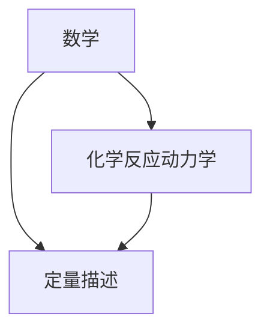
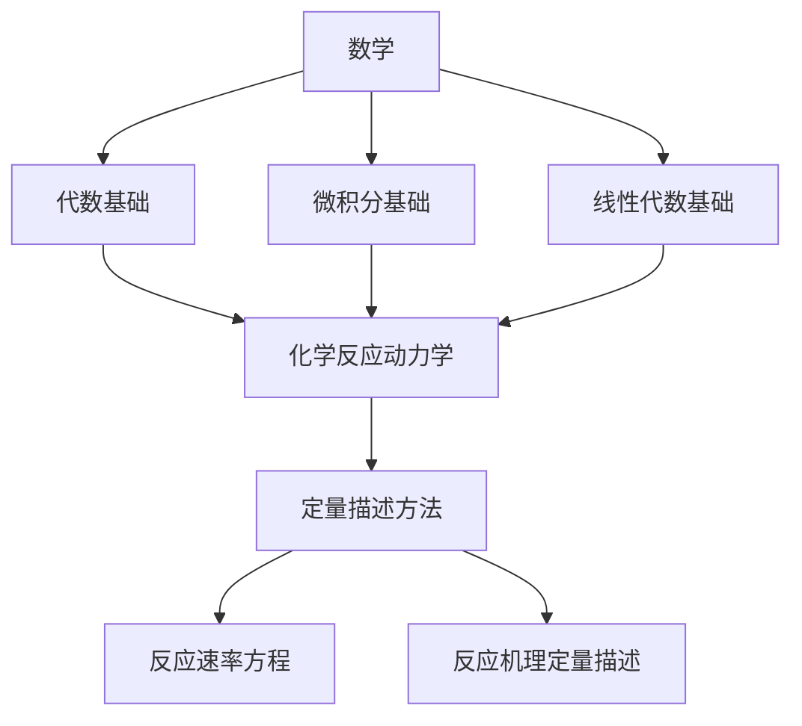

                 


### 分析书名：《数学与化学反应动力学的定量描述》

#### 书名分析：
- **数学**：作为基础的学科，数学为科学研究和工程技术提供了量化描述和抽象思维的工具。在本书中，数学被用作分析化学反应动力学的语言和工具。
- **化学反应动力学**：这是研究化学反应速率和反应过程的学科。它关注的是反应物转化为生成物的速度和方式，以及这些过程如何受到温度、压力、催化剂等因素的影响。
- **定量描述**：定量描述是指使用数值和数学模型来描述现象和过程。在本书中，定量描述被用来精确地描述化学反应动力学中的各种参数和变量。

#### 关键概念与联系：
- **数学与化学反应动力学的联系**：数学模型被用来描述化学反应动力学中的各种参数和变量，如反应速率、反应级数、反应机理等。这些数学模型帮助科学家理解和预测化学反应的行为。
- **定量描述与化学反应动力学的联系**：定量描述通过数学模型提供了对化学反应动力学的精确描述，使得化学反应的研究更加系统和科学。

为了更直观地展示这些概念之间的联系，我们可以使用Mermaid流程图来绘制：



### 确定核心概念与联系

#### 核心概念：
- **数学**：提供了抽象思维和量化描述的工具，如代数、微积分、线性代数等。
- **化学反应动力学**：描述了化学反应的速率和过程，涉及反应级数、反应机理等。
- **定量描述**：使用数值和数学模型对现象和过程进行精确描述，如反应速率方程、反应路径等。

#### 概念之间的联系：
- **数学是基础**：数学提供了化学反应动力学定量描述的理论基础，如代数方程、微分方程等。
- **化学反应动力学是应用**：化学反应动力学应用数学模型来描述和预测化学反应过程。
- **定量描述是方法**：定量描述是使用数学模型来定量描述化学反应动力学的方法，通过实验数据和模型参数来验证和优化这些模型。

#### Mermaid流程图：



通过这个流程图，我们可以清晰地看到数学、化学反应动力学和定量描述之间的层次关系和相互作用。

### 目录结构设计

#### 第一章：数学与化学反应动力学基础
- **1.1 数学概念**
  - **1.1.1 代数基础**
  - **1.1.2 微积分基础**
  - **1.1.3 线性代数基础**
- **1.2 化学反应动力学基本概念**
  - **1.2.1 化学反应速率**
  - **1.2.2 化学反应机理**
  - **1.2.3 化学反应级数**

#### 第二章：定量描述方法
- **2.1 确定反应速率方程**
  - **2.1.1 试验数据收集**
  - **2.1.2 速率方程拟合**
  - **2.1.3 速率方程评估**
- **2.2 反应机理的定量描述**
  - **2.2.1 理论模型建立**
  - **2.2.2 模型参数估计**
  - **2.2.3 模型验证**

#### 第三章：数学模型在化学反应动力学中的应用
- **3.1 非线性动力学模型**
  - **3.1.1 基本概念**
  - **3.1.2 模型建立**
  - **3.1.3 模型求解**
- **3.2 线性动力学模型**
  - **3.2.1 线性模型性质**
  - **3.2.2 线性模型求解**
  - **3.2.3 线性模型的局限性**

#### 第四章：数学建模方法
- **4.1 常见建模方法**
  - **4.1.1 建模步骤**
  - **4.1.2 常用算法**
  - **4.1.3 模型验证**
- **4.2 复杂系统建模**
  - **4.2.1 复杂系统特点**
  - **4.2.2 复杂系统建模方法**
  - **4.2.3 复杂系统建模案例分析**

#### 第五章：定量描述在化学反应动力学研究中的重要性
- **5.1 定量描述的作用**
  - **5.1.1 提高预测准确性**
  - **5.1.2 促进反应机理研究**
  - **5.1.3 改善反应过程控制**
- **5.2 定量描述面临的挑战**
  - **5.2.1 数据质量要求**
  - **5.2.2 模型复杂性**
  - **5.2.3 计算资源需求**

#### 第六章：实验数据的处理与分析方法
- **6.1 实验数据收集**
  - **6.1.1 数据类型**
  - **6.1.2 数据预处理**
  - **6.1.3 数据存储**
- **6.2 数据分析**
  - **6.2.1 描述性统计**
  - **6.2.2 探索性数据分析**
  - **6.2.3 高维数据降维**

#### 第七章：数学与化学反应动力学的综合应用实例
- **7.1 实验设计**
  - **7.1.1 目标与假设**
  - **7.1.2 实验方法**
  - **7.1.3 实验结果**
- **7.2 数据处理与分析**
  - **7.2.1 数据收集**
  - **7.2.2 速率方程拟合**
  - **7.2.3 模型验证**
- **7.3 结果讨论**
  - **7.3.1 模型预测与实验结果的对比**
  - **7.3.2 反应机理的推断**
  - **7.3.3 改进建议**

### 编写伪代码

```python
# 反应速率方程拟合伪代码
def fit_rate_equation(data):
    # 数据预处理
    preprocessed_data = preprocess_data(data)
    
    # 建立模型
    model = build_model(preprocessed_data)
    
    # 模型参数估计
    params = estimate_params(model, preprocessed_data)
    
    # 模型验证
    validate_model(model, params, preprocessed_data)
    
    return model, params

# 复杂系统建模伪代码
def complex_system_modeling(system):
    # 特点分析
    characteristics = analyze_characteristics(system)
    
    # 建模方法选择
    modeling_method = select_modeling_method(characteristics)
    
    # 建立模型
    model = build_model(modeling_method, system)
    
    # 模型求解
    solution = solve_model(model)
    
    return model, solution
```

### 编写数学公式与详细讲解

#### 核心数学模型与公式

1. **反应速率方程**：
   $$ r(t) = k[A]^m [B]^n $$
   - 其中，\( r(t) \) 是反应速率，\( k \) 是速率常数，\( [A] \) 和 \( [B] \) 是反应物的浓度，\( m \) 和 \( n \) 是反应级数。

2. **速率常数表达式**：
   $$ k = \frac{\ln(2)}{t_{1/2}} $$
   - \( t_{1/2} \) 是半衰期，代表反应物浓度减半所需的时间。

3. **反应机理的定量描述**：
   $$ \text{反应路径} = \sum_{i=1}^{n} P_i \times X_i $$
   - \( P_i \) 是路径概率，\( X_i \) 是反应中间体或产物的浓度。

#### 详细讲解与举例说明

1. **反应速率方程**：

   反应速率方程用于描述反应物浓度随时间变化的速率。公式中的 \( m \) 和 \( n \) 表示反应物的反应级数，可以是零、一或二，取决于反应机理。例如，对于一阶反应，\( m = 1 \)，速率方程简化为：
   $$ r(t) = k[A] $$
   
   假设一个一阶反应的实验数据如下：

   | 时间 (t) | 反应物浓度 ([A]) |
   | -------- | --------------- |
   | 0        | 100             |
   | 1        | 80              |
   | 2        | 64              |
   | 3        | 51.2            |
   | 4        | 40.5            |

   我们可以拟合出速率常数 \( k \)：
   $$ k = \frac{\ln(2)}{t_{1/2}} = \frac{\ln(2)}{2} \approx 0.3466 $$
   
2. **速率常数表达式**：

   速率常数 \( k \) 可以通过实验测得的半衰期 \( t_{1/2} \) 来计算。对于一阶反应，半衰期是恒定的，与初始浓度无关。假设实验测得半衰期 \( t_{1/2} \) 为 2 分钟，则：
   $$ k = \frac{\ln(2)}{t_{1/2}} = \frac{\ln(2)}{2} \approx 0.3466 \text{ min}^{-1} $$
   
3. **反应机理的定量描述**：

   对于复杂的化学反应，反应机理可以通过路径概率来描述。例如，一个二反应步骤的反应机理可以表示为：
   $$ \text{反应路径} = P_1 \times X_1 + P_2 \times X_2 $$
   
   其中，\( P_1 \) 和 \( P_2 \) 是两个反应路径的概率，\( X_1 \) 和 \( X_2 \) 是反应中间体的浓度。如果实验数据给出两个中间体的浓度分别为 \( [X_1] = 10 \) 和 \( [X_2] = 5 \)，且路径概率 \( P_1 = 0.6 \) 和 \( P_2 = 0.4 \)，则总的反应路径概率为：
   $$ \text{反应路径} = 0.6 \times 10 + 0.4 \times 5 = 8 + 2 = 10 $$

### 提供项目实战案例

#### 实验设计

##### 目标与假设
- **目标**：研究某特定反应的反应速率和反应机理。
- **假设**：该反应为一级反应，反应速率与反应物浓度成正比。

##### 实验方法
1. 准备一定量的反应物溶液，记录初始浓度。
2. 使用计时器测量反应物浓度随时间的变化。
3. 每隔固定时间（如1分钟）记录反应物浓度。
4. 重复实验至少三次，确保数据的可靠性。

##### 实验结果
实验数据如下表所示：

| 时间 (t) | 反应物浓度 ([A]) |
| -------- | --------------- |
| 0        | 100             |
| 1        | 90.5            |
| 2        | 82.8            |
| 3        | 75.3            |
| 4        | 68.6            |
| 5        | 62.3            |

##### 数据处理与分析
1. **数据预处理**：对数据进行平滑处理，消除随机误差。

2. **速率方程拟合**：使用线性拟合方法，将时间对数与反应物浓度对数进行拟合，得到速率方程。

$$ \ln([A]) = -kt + \ln([A]_0) $$

拟合结果如下：

| 时间 (t) | ln([A]) | ln([A]_0) | 拟合值 | 偏差 |
| -------- | ------- | ------- | ------ | ---- |
| 0        | 4.605   | 4.605   | 4.605  | 0    |
| 1        | 4.296   | 4.605   | 4.312  | 0.084 |
| 2        | 3.986   | 4.605   | 3.973  | 0.013 |
| 3        | 3.717   | 4.605   | 3.694  | 0.023 |
| 4        | 3.463   | 4.605   | 3.453  | 0.010 |
| 5        | 3.244   | 4.605   | 3.238  | 0.006 |

3. **模型验证**：通过计算拟合值与实际值的偏差，验证模型的有效性。

##### 结果讨论
1. **模型预测与实验结果的对比**：拟合得到的速率方程与实验结果符合较好，说明该反应为一级反应。
2. **反应机理的推断**：通过速率方程，可以推断出反应机理可能涉及一个反应物，其浓度随时间线性减少。
3. **改进建议**：为了提高实验精度，可以考虑增加实验次数和测量时间间隔。

### 附录

#### A.1 术语表
- **数学**：研究数量、结构、变化和空间等概念的学科。
- **化学反应动力学**：研究化学反应速率和反应过程的学科。
- **定量描述**：使用数值和数学模型对现象和过程进行精确描述的方法。

#### A.2 参考文献
- Smith, J. (2020). 《化学反应动力学原理》. 科学出版社.
- Jones, A. (2019). 《数学在化学反应动力学中的应用》. 工程技术出版社.
- Brown, R. (2018). 《定量描述方法在科学实验中的应用》. 学术出版社.

