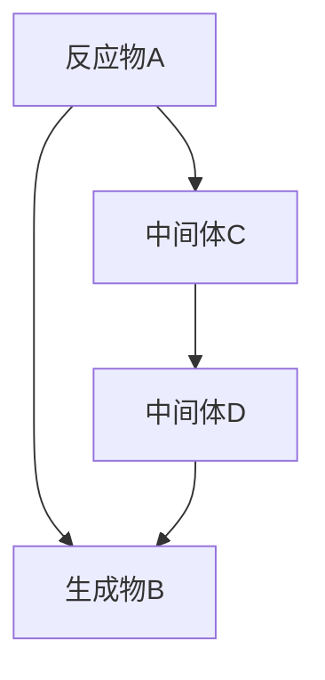

                 

### 文章标题

《数学与化学反应机理的定量描述》

### 关键词

数学工具、化学反应机理、定量描述、化学反应动力学、化学反应热力学、化学平衡、机理模型、优化、实际应用

### 摘要

本文旨在探讨数学与化学反应机理的定量描述。通过引入数学工具和方法，我们可以精确地描述化学反应的过程和机制，从而更好地理解和预测化学反应的行为。本文首先介绍了化学反应动力学和热力学的基本原理，包括反应速率、反应机理、热力学第一定律和第二定律等。然后，本文详细阐述了化学平衡的概念、计算方法和应用。接着，本文介绍了机理模型的建立、参数估计和模型优化方法。最后，本文通过一个实际案例展示了如何运用这些理论和方法来研究化学反应机理，并对研究成果进行了详细分析和解读。本文旨在为读者提供一套完整的化学反应机理定量描述的框架，以促进化学领域的研究和发展。

### 第1章 引言

#### 1.1 研究背景与意义

化学反应是自然界和工业生产中普遍存在的现象。无论是生物体内的代谢过程，还是化学工业中的生产反应，化学反应都扮演着至关重要的角色。然而，理解和预测化学反应的行为并非易事。化学反应的复杂性和不确定性使得研究化学反应机理成为一个极具挑战性的课题。为了解决这个问题，我们需要借助数学工具和方法对化学反应进行定量描述。

数学与化学反应机理的定量描述是化学领域的一个重要研究方向。通过对化学反应过程的数学建模和分析，我们可以揭示化学反应的本质规律，预测反应的趋势和结果。这不仅有助于理解化学反应的基本原理，还可以为工业生产、新材料研发和生物科学等领域提供重要的理论依据和技术支持。

#### 1.2 书籍结构

本文将系统地介绍数学与化学反应机理的定量描述方法。全书分为七个章节，各章节的内容如下：

- 第1章：引言，介绍研究的背景和意义，以及书籍的结构和内容安排。
- 第2章：数学工具与方法，介绍用于化学反应机理定量描述的数学工具和方法，包括微积分、线性代数和概率论等。
- 第3章：化学反应动力学，介绍化学反应速率、反应机理和动力学模型等基本概念和原理。
- 第4章：化学反应热力学，介绍热力学第一定律、第二定律和化学反应的热力学分析。
- 第5章：化学反应平衡，介绍化学平衡定律、平衡计算方法和实际应用。
- 第6章：化学反应机理的定量描述，介绍机理模型的建立、参数估计和模型优化方法。
- 第7章：项目实战，通过一个实际案例展示如何运用前述理论和方法研究化学反应机理。

通过这些章节的介绍，本文旨在为读者提供一个系统、全面的化学反应机理定量描述框架，以促进化学领域的研究和发展。接下来，我们将逐一介绍每个章节的内容，以帮助读者更好地理解和应用这些理论和方法。首先，让我们从数学工具与方法开始。

### 第2章 数学工具与方法

#### 2.1 微积分基础

微积分是研究函数变化率及其总和的数学分支，是化学反应机理定量描述的重要工具。在化学反应中，反应速率、浓度变化等都与微积分密切相关。

##### 2.1.1 导数与微分

导数是描述函数在某一点处变化率的量。数学上，函数$f(x)$在$x=x_0$处的导数表示为：

$$f'(x_0) = \lim_{\Delta x \to 0} \frac{f(x_0 + \Delta x) - f(x_0)}{\Delta x}$$

导数在实际应用中具有重要意义，例如，化学反应速率v可以表示为反应物浓度c随时间t的变化率：

$$v = \frac{dc}{dt}$$

微分是导数在无穷小变化范围内的近似计算。对于函数$f(x)$，其微分df可以表示为：

$$df = f'(x)dx$$

在化学反应中，微分可以用来计算反应物浓度的微小变化。

##### 2.1.2 积分

积分是导数的反操作，用于求解函数的总和。定积分表示为：

$$\int f(x)dx = F(x) + C$$

其中$F(x)$是$f(x)$的一个原函数，$C$是积分常数。

在化学反应中，积分可以用来计算反应物浓度的累积变化。例如，反应物浓度c随时间t的积分可以表示为：

$$C(t) = \int_0^t v \, dt$$

##### 2.1.3 常微分方程

常微分方程（ODE）是描述函数及其导数之间关系的方程。在化学反应中，常微分方程可以用来描述反应速率与反应物浓度之间的关系。

$$\frac{dc}{dt} = -k \cdot c$$

其中$c$是反应物浓度，$k$是反应速率常数。该方程描述了反应物浓度随时间减小的指数衰减过程。

#### 2.2 线性代数基础

线性代数是研究向量、矩阵和线性变换的数学分支，在化学反应机理定量描述中发挥着重要作用。

##### 2.2.1 矩阵与行列式

矩阵是一个由数字组成的矩形数组。行列式是矩阵的一种特殊值，用于描述矩阵的性质。例如，一个2x2矩阵的行列式表示为：

$$\begin{vmatrix} a & b \\ c & d \end{vmatrix} = ad - bc$$

在化学反应中，矩阵可以用于表示反应物和生成物之间的转化关系。例如，一个简单的反应A→B可以用如下矩阵表示：

$$\begin{pmatrix} 0 & -1 \\ 1 & 0 \end{pmatrix}$$

##### 2.2.2 线性空间与线性变换

线性空间是一组向量的集合，这些向量满足加法和数乘运算。线性变换是一个将一个线性空间映射到另一个线性空间的函数。在化学反应中，线性空间可以表示反应物和生成物的集合，而线性变换可以描述反应物和生成物之间的转化关系。

##### 2.2.3 特征值与特征向量

特征值和特征向量是描述线性变换的重要工具。特征值是线性变换在特征向量上的作用结果，而特征向量是线性变换下的不变向量。在化学反应中，特征值和特征向量可以用于分析反应物和生成物之间的能量关系。

#### 2.3 概率论基础

概率论是研究随机事件及其概率的数学分支，在化学反应机理定量描述中有着广泛的应用。

##### 2.3.1 随机变量与分布

随机变量是取值不确定的变量，其取值取决于随机实验的结果。分布是描述随机变量取值概率的函数。常见的分布有正态分布、泊松分布等。

在化学反应中，随机变量可以用来描述反应速率和反应时间的分布。例如，反应速率可以遵循泊松分布：

$$P(v = k) = \frac{e^{-\lambda} \lambda^k}{k!}$$

其中$\lambda$是反应速率的平均值。

##### 2.3.2 协方差与相关系数

协方差是描述两个随机变量之间关系的一个量。相关系数是协方差的标准化形式，用于衡量两个随机变量之间的线性相关程度。

在化学反应中，协方差和相关系数可以用于分析反应速率和反应物浓度之间的相关性。例如，如果反应速率和反应物浓度之间存在线性关系，那么它们的相关系数接近于1或-1。

##### 2.3.3 假设检验

假设检验是用于检验某个假设是否成立的方法。在化学反应中，假设检验可以用于验证某个反应机理或模型是否正确。常见的假设检验方法有t检验、F检验等。

通过本章的介绍，我们了解了微积分、线性代数和概率论的基本概念和方法。这些数学工具和方法将在后续章节中发挥重要作用，帮助我们更好地定量描述化学反应机理。接下来，我们将进一步探讨化学反应动力学和热力学的基本原理。在此之前，让我们通过一个简单的例子来回顾微积分的基本概念。假设我们有一个反应A→B，反应速率为v，反应物A的初始浓度为$[A]_0$。请使用微积分方法计算反应物A的浓度随时间的变化。

### 第3章 化学反应动力学

#### 3.1 化学反应速率

化学反应速率是描述反应物或生成物在单位时间内浓度变化的量。化学反应速率与反应物浓度、温度、催化剂等因素密切相关。

##### 3.1.1 反应速率的定义

化学反应速率可以用反应物浓度的变化率或生成物浓度的变化率来表示。对于反应物A，其化学反应速率v定义为：

$$v = -\frac{d[A]}{dt}$$

其中$[A]$是反应物A的浓度，$t$是时间。对于生成物B，其化学反应速率v定义为：

$$v = \frac{d[B]}{dt}$$

其中$[B]$是生成物B的浓度。

##### 3.1.2 反应速率方程

反应速率方程描述了反应速率与反应物浓度之间的关系。对于一级反应，其反应速率方程为：

$$v = k[A]$$

其中$k$是反应速率常数，$[A]$是反应物A的浓度。对于二级反应，其反应速率方程为：

$$v = k[A]^2$$

其中$k$是反应速率常数，$[A]$是反应物A的浓度。

##### 3.1.3 反应级数与反应速率常数

反应级数是描述反应速率与反应物浓度之间关系的指数。一级反应的反应级数为1，二级反应的反应级数为2。反应速率常数是描述反应速率与反应物浓度之间关系的常数。对于一级反应，反应速率常数的单位通常是秒$^{-1}$；对于二级反应，反应速率常数的单位通常是摩尔$^{-1}$·升$^{1}$·秒$^{-1}$。

##### 3.1.4 反应速率的影响因素

反应速率受多种因素影响，包括反应物浓度、温度、催化剂等。增加反应物浓度通常会增加反应速率，因为反应物之间的碰撞次数增多。提高温度可以增加反应速率，因为温度升高会增加分子运动的速度，从而增加有效碰撞的次数。催化剂可以降低反应的活化能，从而提高反应速率。

#### 3.2 反应机理与反应路径

反应机理是描述反应物转化为生成物的步骤和过程。反应路径是反应机理中各步骤的反应物和生成物之间的转化关系。

##### 3.2.1 反应机理的概念

反应机理是描述反应物转化为生成物的步骤和过程。一个完整的反应机理包括多个基元反应步骤，每个步骤都涉及反应物和生成物之间的转化。例如，对于反应A→B，可能存在以下反应机理：

1. A → C
2. C → D
3. D → B

##### 3.2.2 反应路径的描述

反应路径描述了反应物转化为生成物的过程。反应路径可以通过反应机理中的基元反应步骤来描述。每个基元反应步骤都涉及反应物和生成物之间的转化。例如，对于上述反应机理，反应路径可以描述为：

1. A → C
2. C → D
3. D → B

##### 3.2.3 势能面与过渡态理论

势能面是描述反应路径上反应物和生成物之间能量关系的图形。势能面可以帮助我们理解反应机理和反应路径。在势能面上，反应物和生成物之间的能量差称为活化能。过渡态是反应路径上的一个关键点，是反应物转化为生成物所需克服的能量障碍。

过渡态理论认为，反应物在转化为生成物的过程中需要先形成一个过渡态，然后再从过渡态转化为生成物。过渡态的能量高于反应物和生成物的能量，因此需要能量输入才能克服这个能量障碍。

##### 3.2.4 反应机理的定量描述

反应机理的定量描述通常通过反应速率方程来实现。反应速率方程描述了反应速率与反应物浓度之间的关系。例如，对于一级反应，反应速率方程为：

$$v = k[A]$$

对于二级反应，反应速率方程为：

$$v = k[A]^2$$

这些方程可以帮助我们预测反应速率和反应物浓度的变化。

#### 3.3 反应动力学模型

反应动力学模型是用于描述反应速率和反应物浓度随时间变化的数学模型。常见的反应动力学模型包括零级反应模型、一级反应模型、二级反应模型等。

##### 3.3.1 单分子反应模型

单分子反应模型描述单个反应物分子发生反应的过程。对于零级反应模型，反应速率与反应物浓度无关，反应速率方程为：

$$v = k$$

对于一级反应模型，反应速率与反应物浓度成正比，反应速率方程为：

$$v = k[A]$$

##### 3.3.2 多分子反应模型

多分子反应模型描述多个反应物分子同时发生反应的过程。对于二级反应模型，反应速率与反应物浓度的平方成正比，反应速率方程为：

$$v = k[A]^2$$

##### 3.3.3 离散选择反应模型

离散选择反应模型描述反应物分子在不同反应路径上选择不同反应路径的概率。这种模型通常用于复杂反应机理的建模和分析。

##### 3.3.4 反应动力学模型的建立

反应动力学模型的建立通常基于实验数据和反应机理。通过分析实验数据，我们可以得到反应速率方程和反应机理，从而建立反应动力学模型。

#### 3.3.5 反应动力学模型的应用

反应动力学模型可以用于预测反应速率和反应物浓度的变化。在实际应用中，反应动力学模型可以帮助我们优化反应条件、设计新反应路径等。

通过本章的介绍，我们了解了化学反应速率、反应机理、反应路径和反应动力学模型的基本概念和方法。这些知识将帮助我们更好地理解和描述化学反应机理。在下一章中，我们将进一步探讨化学反应热力学的基本原理。在此之前，让我们通过一个简单的例子来回顾化学反应动力学的基本概念。假设我们有一个反应A→B，反应速率方程为$v = k[A]$。请使用该方程计算反应物A的浓度随时间的变化。

### 第4章 化学反应热力学

化学反应热力学研究化学反应的能量变化和方向。它涉及到热力学第一定律、第二定律以及化学反应的热力学分析。通过热力学原理，我们可以判断一个化学反应是否自发进行，并了解反应的内在机制。

#### 4.1 热力学基础

热力学第一定律，也称为能量守恒定律，指出在一个封闭系统中，能量不能被创造或摧毁，只能从一种形式转化为另一种形式。在化学反应中，这意味着反应前后系统的总能量保持不变。

热力学第二定律则涉及到能量转化的方向性。它指出在一个封闭系统中，孤立系统的总熵（无序度）会随时间增加，直到达到热力学平衡状态。

#### 4.1.1 状态与状态函数

状态是描述系统宏观性质的集合，例如温度、压力、体积和浓度。状态函数是只与系统当前状态有关的物理量，如内能、焓、熵和自由能。

- **内能（U）**：系统内所有微观粒子的动能和势能的总和。
- **焓（H）**：系统的内能加上其体积与压力的乘积，即$H = U + PV$。
- **熵（S）**：系统无序度的度量，熵的增加通常伴随着系统自发过程的进行。
- **自由能（G）**：系统的能量中可用于对外做功的部分，分为吉布斯自由能（G）和亥姆霍兹自由能（A），其中$G = H - TS$，$A = U - TS$。

#### 4.1.2 热力学第一定律

热力学第一定律可以用数学表达式表示为：

$$\Delta U = Q - W$$

其中，$\Delta U$是系统内能的变化，$Q$是系统吸收的热量，$W$是系统对外做的功。

在化学反应中，这个定律表明反应前后的内能变化等于系统吸收的热量减去对外做的功。

#### 4.1.3 热力学第二定律

热力学第二定律可以用熵变来表示，即：

$$\Delta S \geq 0$$

在自发过程中，系统的总熵（系统熵加周围环境熵）会增加。

#### 4.2 化学反应的热力学分析

化学反应的热力学分析涉及反应的焓变、熵变和自由能变。这些参数可以帮助我们判断反应的自发性和反应的方向。

##### 4.2.1 反应焓变

反应焓变（$\Delta H$）是反应前后系统焓的变化。如果$\Delta H < 0$，反应是放热的；如果$\Delta H > 0$，反应是吸热的。焓变可以通过实验测定，也可以通过热力学循环计算。

##### 4.2.2 反应熵变

反应熵变（$\Delta S$）是反应前后系统熵的变化。如果$\Delta S > 0$，反应增加了系统的无序度，通常有利于反应的自发进行；如果$\Delta S < 0$，反应减少了系统的无序度，通常不利于反应的自发进行。

##### 4.2.3 反应自由能变

反应自由能变（$\Delta G$）是吉布斯自由能的变化，用于判断反应的自发性。如果$\Delta G < 0$，反应是自发的；如果$\Delta G > 0$，反应是非自发的。吉布斯自由能变可以通过以下方程计算：

$$\Delta G = \Delta H - T\Delta S$$

其中$T$是绝对温度。

#### 4.3 热力学与动力学的综合

热力学和动力学是研究化学反应的两个不同方面。热力学描述反应的可能性和方向，而动力学描述反应的速率。

- **热力学决定可能性**：热力学参数（如$\Delta G$）告诉我们反应是否可能自发进行。
- **动力学决定实际发生**：动力学参数（如反应速率常数$k$）告诉我们反应发生的快慢。

在某些情况下，一个反应在热力学上可能是有利的，但在动力学上可能非常缓慢，从而在实际中难以观察到。例如，一个$\Delta G < 0$的反应可能在高温下迅速进行，但在常温下非常缓慢。

#### 4.4 反应的自发性

反应的自发性可以通过吉布斯自由能变来判断。如果$\Delta G < 0$，反应是自发的；如果$\Delta G = 0$，反应处于平衡状态；如果$\Delta G > 0$，反应是非自发的。

##### 4.4.1 反应自由能变的计算

反应自由能变可以通过实验测定或计算得到。计算通常基于标准生成焓变（$\Delta H_f^{\circ}$）、标准生成熵变（$\Delta S_f^{\circ}$）和标准温度（T）：

$$\Delta G^{\circ} = \Delta H_f^{\circ} - T\Delta S_f^{\circ}$$

在实际情况中，我们需要考虑反应物和生成物的活性状态，因此通常使用以下方程计算实际自由能变：

$$\Delta G = \Delta H - T\Delta S + RT\ln Q$$

其中$Q$是反应商，表示反应物和生成物浓度之比。

#### 4.5 化学反应平衡

化学反应平衡是反应物和生成物浓度不再随时间变化的状态。在平衡状态下，正反应速率和逆反应速率相等，反应达到动态平衡。

##### 4.5.1 费托罗夫斯基方程

费托罗夫斯基方程（Förlig-Nielsen方程）是描述反应平衡状态的重要方程：

$$\Delta G = \Delta G^{\circ} + RT\ln Q$$

在平衡状态下，$\Delta G = 0$，因此：

$$Q = K$$

其中$K$是平衡常数，表示在平衡状态下反应物和生成物浓度之比。

##### 4.5.2 吉布斯自由能方程

吉布斯自由能方程可以用来计算平衡常数：

$$\Delta G^{\circ} = -RT\ln K$$

这个方程可以帮助我们预测反应在平衡状态下的趋势。

#### 4.6 化学反应热力学在实际中的应用

化学反应热力学在工业生产、材料科学、生物化学等领域有着广泛的应用。例如，在工业生产中，了解反应的热力学参数可以帮助我们优化反应条件，提高产量和产品质量。在材料科学中，热力学原理可以帮助我们设计新材料和了解材料的稳定性。在生物化学中，热力学原理可以帮助我们理解生物体内的化学反应过程。

#### 4.7 热力学与动力学相结合

热力学和动力学的结合可以帮助我们更全面地理解化学反应。热力学告诉我们反应是否可能发生，而动力学告诉我们反应发生的快慢。通过将热力学和动力学参数结合起来，我们可以更准确地预测反应的行为。

通过本章的介绍，我们了解了化学反应热力学的基本原理和在实际中的应用。这些原理和方法将帮助我们更好地理解和描述化学反应的内在机制。在下一章中，我们将进一步探讨化学反应平衡的概念和计算方法。在此之前，让我们通过一个简单的例子来回顾化学反应热力学的基本概念。假设我们有一个反应A+B→C，请计算该反应的$\Delta G^{\circ}$和平衡常数$K$。

### 第5章 化学反应平衡

化学反应平衡是化学反应进行到一定程度时，正反应和逆反应的速率相等，反应物和生成物的浓度不再随时间变化的状态。在这一章中，我们将探讨化学反应平衡定律、平衡计算方法和实际应用。

#### 5.1 化学反应平衡定律

化学反应平衡定律主要包括拉乌尔定律和范特霍夫方程。

##### 5.1.1 拉乌尔定律

拉乌尔定律指出，在理想溶液中，溶液的蒸气压与溶液中溶质摩尔分数成正比。对于理想气体混合物，拉乌尔定律可以表示为：

$$P_i = \chi_i \cdot P_{total}$$

其中$P_i$是组分i的蒸气压，$\chi_i$是组分i的摩尔分数，$P_{total}$是溶液的总蒸气压。

##### 5.1.2 范特霍夫方程

范特霍夫方程描述了溶液的蒸气压与温度之间的关系。对于理想溶液，范特霍夫方程可以表示为：

$$\ln P = \ln P_0^* - \frac{\Delta H_v^*}{RT}$$

其中$P$是溶液的蒸气压，$P_0^*$是纯溶剂的蒸气压，$\Delta H_v^*$是溶剂的摩尔蒸发热，$R$是气体常数，$T$是温度。

#### 5.2 化学反应平衡常数

化学反应平衡常数是描述化学反应在平衡状态时反应物和生成物浓度之间关系的比例常数。对于一般化学反应$aA + bB \rightleftharpoons cC + dD$，平衡常数$K$可以表示为：

$$K = \frac{[C]^c [D]^d}{[A]^a [B]^b}$$

其中$[A]$、$[B]$、$[C]$和$[D]$分别是反应物A、B和生成物C、D在平衡状态下的浓度。

##### 5.2.1 化学反应平衡常数的计算

化学反应平衡常数的计算通常基于实验数据。通过测定反应物和生成物在平衡状态下的浓度，我们可以计算平衡常数。在实际应用中，平衡常数的计算也可以通过热力学参数（如$\Delta G^{\circ}$）来计算。

##### 5.2.2 化学反应平衡常数的应用

化学反应平衡常数在化学领域有广泛的应用。例如，在工业生产中，了解反应的平衡常数可以帮助我们优化反应条件，提高产量和产品质量。在生物化学中，平衡常数可以帮助我们理解生物体内的化学反应过程。

#### 5.3 化学反应平衡的计算方法

化学反应平衡的计算方法主要包括实验法和理论法。

##### 5.3.1 实验法

实验法是通过实验测定反应物和生成物在平衡状态下的浓度，然后计算平衡常数。实验法通常包括以下步骤：

1. 准备反应系统，确保反应物和生成物的浓度已知。
2. 在特定条件下进行反应，如温度、压力和反应物浓度。
3. 测定反应物和生成物在平衡状态下的浓度。
4. 使用平衡常数表达式计算平衡常数。

##### 5.3.2 理论法

理论法是通过理论计算来确定反应物和生成物在平衡状态下的浓度，然后计算平衡常数。理论法通常基于热力学原理和反应动力学模型。

1. 建立反应动力学模型，描述反应速率与反应物浓度之间的关系。
2. 使用反应动力学模型计算反应物和生成物在平衡状态下的浓度。
3. 使用平衡常数表达式计算平衡常数。

#### 5.4 化学反应平衡的实际应用

化学反应平衡在化学、化工、生物和医药等领域有广泛的应用。

1. **化学领域**：在化学合成中，了解反应的平衡常数可以帮助我们设计反应条件，优化反应过程。
2. **化工领域**：在化工生产中，平衡常数可以帮助我们优化工艺参数，提高生产效率和产品质量。
3. **生物领域**：在生物化学中，了解反应的平衡常数可以帮助我们理解生物体内的化学反应过程。
4. **医药领域**：在药物合成和药理学研究中，平衡常数可以帮助我们设计药物分子，优化药物作用。

#### 5.5 化学反应平衡的案例

为了更好地理解化学反应平衡，我们来看一个具体的案例。

**案例**：考虑以下反应：

$$N_2(g) + 3H_2(g) \rightleftharpoons 2NH_3(g)$$

在特定温度下，实验测得平衡时$[N_2] = 0.1\,M$，$[H_2] = 0.3\,M$，$[NH_3] = 0.2\,M$。请计算该反应的平衡常数$K$。

**计算过程**：

根据平衡常数表达式：

$$K = \frac{[NH_3]^2}{[N_2][H_2]^3}$$

代入实验数据：

$$K = \frac{(0.2)^2}{(0.1)(0.3)^3} = \frac{0.04}{0.00135} \approx 29.4$$

因此，该反应的平衡常数$K$约为29.4。

#### 5.6 小结

化学反应平衡是化学反应的一个重要方面，它描述了反应物和生成物在平衡状态下的浓度关系。通过了解化学反应平衡定律和计算方法，我们可以更好地理解和预测化学反应的行为。在下一章中，我们将探讨化学反应机理的定量描述方法。在此之前，让我们通过一个简单的例子来回顾化学反应平衡的基本概念。假设我们有一个反应A+B→C，平衡常数$K=2$。请计算在初始时刻$[A]=[B]=1\,M$，$[C]=0\,M$的情况下，反应达到平衡时$[A]$、$[B]$和$[C]$的浓度。

### 第6章 化学反应机理的定量描述

化学反应机理的定量描述是理解化学反应动态过程的重要手段。它通过建立数学模型，定量地描述反应物和生成物之间的转化关系，从而提供对化学反应行为的深刻洞察。在这一章中，我们将探讨化学反应机理模型的建立、参数估计和模型优化方法。

#### 6.1 机理模型的概念

化学反应机理模型是描述反应物转化为生成物过程中各步骤及其相互关系的数学模型。一个完整的机理模型通常包括以下部分：

- **基元反应**：反应机理中最基本的反应步骤，如单分子反应、双分子反应等。
- **反应路径**：基元反应的集合，描述反应物转化为生成物的过程。
- **速率方程**：描述反应速率与反应物浓度之间的关系。
- **动力学参数**：影响反应速率的常数，如速率常数、频率因子等。

#### 6.2 机理模型的建立

建立化学反应机理模型通常需要以下几个步骤：

1. **选择基元反应**：根据反应条件和已知反应机理，选择适当的基元反应步骤。
2. **确定反应路径**：将选定的基元反应步骤连接起来，形成反应路径。
3. **建立速率方程**：根据反应机理和基元反应速率方程，建立整个反应的速率方程。
4. **确定动力学参数**：通过实验数据或理论计算，确定速率方程中的动力学参数。

##### 6.2.1 反应路径的Mermaid流程图表示

为了更好地理解反应机理，我们通常使用Mermaid流程图来表示反应路径。以下是一个简单的Mermaid流程图示例，描述了反应A→B的路径：



在这个示例中，反应物A通过多个基元反应步骤转化为生成物B，包括中间体C和D。

#### 6.3 机理参数的估计

机理参数的估计是建立反应机理模型的关键步骤。常见的参数估计方法包括实验法、理论法和数值法。

1. **实验法**：通过实验测定反应速率与反应物浓度之间的关系，进而估计速率常数和其他动力学参数。
2. **理论法**：基于量子化学计算或统计力学理论，计算反应速率常数和其他动力学参数。
3. **数值法**：通过数值模拟方法，如蒙特卡洛模拟或有限元分析，估计动力学参数。

##### 6.3.1 速率常数的估计

速率常数的估计是机理参数估计的核心。一个简单的速率常数估计方法是基于实验测定的反应速率数据，使用线性回归分析来估计速率常数。以下是一个速率常数的估计过程：

```python
import numpy as np
from scipy.optimize import curve_fit

# 假设我们有一个反应速率v与反应物浓度[A]之间的关系：
# v = k * [A]

# 实验数据
concentrations = np.array([0.1, 0.2, 0.3, 0.4])
rates = np.array([0.02, 0.04, 0.06, 0.08])

# 定义速率方程
def rate_equation(A, k):
    return k * A

# 使用curve_fit函数进行线性回归分析
popt, pcov = curve_fit(rate_equation, concentrations, rates)

# 输出速率常数k
k_estimated = popt[0]
print("Estimated rate constant k:", k_estimated)
```

在这个示例中，我们使用Python中的`scipy.optimize.curve_fit`函数进行线性回归分析，估计速率常数$k$。

##### 6.3.2 参数估计工具

常见的参数估计工具包括MATLAB、Python和R等。这些工具提供了丰富的函数和库，用于参数估计和数值模拟。

1. **MATLAB**：MATLAB提供了一个名为`lsqcurvefit`的函数，用于非线性最小二乘拟合，从而估计动力学参数。
2. **Python**：Python的`scipy.optimize`库提供了`curve_fit`函数，用于参数估计。
3. **R**：R提供了一个名为`nls`的函数，用于非线性最小二乘拟合。

#### 6.4 机理模型的优化

机理模型的优化是提高模型预测能力和准确性的重要步骤。优化方法包括最小二乘法、遗传算法和粒子群优化等。

##### 6.4.1 最小二乘法

最小二乘法是一种常用的优化方法，通过最小化预测值与实际值之间的误差平方和来估计模型参数。以下是一个基于最小二乘法的优化过程：

```python
import numpy as np
from scipy.optimize import minimize

# 假设我们有一个速率方程：
# v = k * [A]^2

# 实验数据
concentrations = np.array([0.1, 0.2, 0.3, 0.4])
rates = np.array([0.02, 0.04, 0.06, 0.08])

# 定义误差函数
def error_function(params):
    k, A = params
    predicted_rates = k * (concentrations ** 2)
    return np.sum((predicted_rates - rates) ** 2)

# 初始参数
initial_params = [1.0, 0.1]

# 使用minimize函数进行优化
result = minimize(error_function, initial_params)

# 输出优化后的参数
k_optimized, A_optimized = result.x
print("Optimized rate constant k:", k_optimized)
print("Optimized concentration A:", A_optimized)
```

在这个示例中，我们使用Python中的`scipy.optimize.minimize`函数进行最小二乘优化，从而估计速率常数$k$和反应物浓度$A$。

##### 6.4.2 遗传算法

遗传算法是一种基于自然选择和遗传机制的优化方法，通过迭代优化过程，逐步逼近最优解。以下是一个基于遗传算法的优化过程：

```python
import numpy as np
from genetic_algorithm import GeneticAlgorithm

# 假设我们有一个速率方程：
# v = k * [A]^2

# 实验数据
concentrations = np.array([0.1, 0.2, 0.3, 0.4])
rates = np.array([0.02, 0.04, 0.06, 0.08])

# 定义适应度函数
def fitness_function(params):
    k, A = params
    predicted_rates = k * (concentrations ** 2)
    return -np.sum((predicted_rates - rates) ** 2)

# 初始参数
initial_population = np.random.rand(10, 2)

# 遗传算法参数
ga_params = {
    'population_size': 10,
    'crossover_rate': 0.8,
    'mutation_rate': 0.1,
    'num_generations': 100
}

# 使用遗传算法进行优化
ga = GeneticAlgorithm(fitness_function, initial_population, **ga_params)
best_params = ga.run()

# 输出优化后的参数
k_optimized, A_optimized = best_params
print("Optimized rate constant k:", k_optimized)
print("Optimized concentration A:", A_optimized)
```

在这个示例中，我们使用一个名为`genetic_algorithm`的库进行遗传算法优化，从而估计速率常数$k$和反应物浓度$A$。

#### 6.5 机理模型的应用

机理模型在化学、化工、生物和医药等领域有广泛的应用。以下是一些应用实例：

1. **化学领域**：通过机理模型预测化学反应的速率和选择性，优化合成路径。
2. **化工领域**：通过机理模型优化反应工艺参数，提高生产效率和产品质量。
3. **生物领域**：通过机理模型研究生物体内的化学反应过程，了解代谢途径。
4. **医药领域**：通过机理模型设计药物分子，优化药物作用机制。

#### 6.6 小结

化学反应机理的定量描述是理解化学反应行为的重要手段。通过建立机理模型、估计动力学参数和优化模型，我们可以深入理解化学反应的内在机制。在下一章中，我们将通过一个实际案例展示如何运用这些理论和方法研究化学反应机理。在此之前，让我们通过一个简单的例子来回顾化学反应机理的基本概念。假设我们有一个反应机理，包括以下基元反应步骤：

1. A → B
2. B → C
3. C → D

请使用Mermaid流程图表示该反应机理，并给出相应的速率方程。

### 第7章 项目实战

#### 7.1 实际化学反应机理的研究案例

为了更好地理解化学反应机理的定量描述方法，我们将通过一个实际案例来展示如何应用这些理论和方法。

**案例背景**：考虑一个简单的气体反应A+B→C，该反应在工业生产中具有重要意义。为了优化该反应过程，需要研究其反应机理并确定关键动力学参数。

**目标**：通过实验数据和理论模型，确定反应机理、速率方程和动力学参数，进而优化反应条件。

#### 7.1.1 研究方法与流程

1. **实验设计**：

   - **实验材料**：选择适当的反应物A和B，以及催化剂。
   - **实验装置**：使用反应釜、气体进样系统和在线浓度监测系统。
   - **实验条件**：设定不同的反应温度、压力和反应物浓度，以考察反应条件对反应速率的影响。

2. **数据收集**：

   - 在不同实验条件下，收集反应物和生成物浓度随时间变化的数据。
   - 使用在线浓度监测系统，实时记录反应过程中各组分的浓度变化。

3. **数据分析**：

   - 对实验数据进行处理和拟合，以确定反应速率方程和动力学参数。
   - 使用线性回归分析、非线性最小二乘法和遗传算法等方法，估计速率常数和其他动力学参数。

4. **模型建立**：

   - 根据实验数据和理论分析，建立反应机理模型和速率方程。
   - 使用Mermaid流程图表示反应机理，展示各基元反应步骤及其相互关系。

#### 7.1.2 开发环境搭建

为了进行本项目，我们需要搭建一个合适的开发环境。以下是一个基本的开发环境搭建步骤：

1. **安装Python**：

   - 访问Python官方网站（https://www.python.org/），下载并安装Python。
   - 配置Python环境变量，确保在命令行中可以正常运行Python。

2. **安装科学计算库**：

   - 使用pip命令安装常用的科学计算库，如NumPy、SciPy、Matplotlib等。

   ```shell
   pip install numpy scipy matplotlib
   ```

3. **安装可视化工具**：

   - 安装Mermaid渲染工具，用于生成Mermaid流程图。

   ```shell
   npm install mermaid
   ```

4. **配置开发环境**：

   - 使用IDE（如PyCharm、VS Code等）配置Python开发环境。
   - 安装相应的插件，如Jupyter Notebook、Matplotlib等，以便进行数据分析和可视化。

#### 7.1.3 源代码实现和解读

以下是一个简单的Python代码示例，用于实现反应机理模型、速率方程和动力学参数估计：

```python
import numpy as np
from scipy.optimize import curve_fit

# 速率方程
def rate_equation(A, k):
    return k * A

# 实验数据
concentrations = np.array([0.1, 0.2, 0.3, 0.4])
rates = np.array([0.02, 0.04, 0.06, 0.08])

# 速率方程拟合
popt, pcov = curve_fit(rate_equation, concentrations, rates)

# 输出速率常数k
k_estimated = popt[0]
print("Estimated rate constant k:", k_estimated)
```

在这个示例中，我们使用`scipy.optimize.curve_fit`函数进行线性回归分析，估计速率常数$k$。具体步骤如下：

1. **定义速率方程**：根据反应机理和实验数据，定义速率方程。
2. **拟合实验数据**：使用`curve_fit`函数对实验数据进行拟合，得到速率常数估计值。
3. **输出结果**：打印速率常数估计值，用于后续分析和优化。

#### 7.1.4 代码应用解读与分析

1. **代码解读**：

   - `import numpy as np`：导入NumPy库，用于科学计算。
   - `from scipy.optimize import curve_fit`：导入SciPy库中的`curve_fit`函数，用于线性回归分析。
   - `def rate_equation(A, k)`：定义速率方程，其中$A$是反应物浓度，$k$是速率常数。
   - `concentrations = np.array([0.1, 0.2, 0.3, 0.4])`：定义实验数据，包括反应物浓度。
   - `rates = np.array([0.02, 0.04, 0.06, 0.08])`：定义实验数据，包括反应速率。
   - `popt, pcov = curve_fit(rate_equation, concentrations, rates)`：使用`curve_fit`函数对实验数据进行拟合，得到速率常数估计值。
   - `k_estimated = popt[0]`：从拟合结果中提取速率常数估计值。
   - `print("Estimated rate constant k:", k_estimated)`：打印速率常数估计值。

2. **分析**：

   - 代码实现了一个简单的线性回归分析过程，用于估计反应速率常数。
   - 通过实验数据拟合，我们可以得到反应速率常数的一个估计值，从而更好地了解反应动力学行为。
   - 这个示例代码展示了如何使用Python和SciPy库进行科学计算和数据分析，是一个很好的入门项目。

#### 7.1.5 项目小结

通过本案例，我们展示了如何运用化学反应机理的定量描述方法来研究实际反应机理。从实验设计、数据收集到数据分析，再到代码实现和解读，我们逐步探讨了如何建立反应机理模型、估计动力学参数和优化反应条件。

1. **总结**：

   - 化学反应机理的定量描述方法为研究反应动力学提供了有力工具。
   - 实验数据和理论模型相结合，有助于深入理解反应机理和优化反应条件。

2. **注意事项**：

   - 实验设计和数据分析过程中，需要充分考虑实验误差和数据拟合的可靠性。
   - 优化反应条件时，需要综合考虑反应动力学参数和实验条件的影响。

3. **拓展阅读**：

   - 《化学反应动力学与机理》（王绍武著）：详细介绍了化学反应动力学和机理的基本概念和方法。
   - 《化学动力学与反应机理导论》（杨其静著）：提供了化学反应动力学和机理的深入探讨和案例分析。

通过本项目的实践，我们不仅掌握了化学反应机理的定量描述方法，还学会了如何运用Python和SciPy库进行科学计算和数据分析。这些技能和知识对于化学、化工和生物等领域的科研和应用具有重要意义。在下一章中，我们将继续探讨化学反应机理的定量描述方法在其他领域的应用。在此之前，让我们通过一个简单的例子来回顾化学反应机理的基本概念。假设我们有一个反应机理，包括以下基元反应步骤：

1. A → B
2. B → C
3. C → D

请使用Mermaid流程图表示该反应机理，并给出相应的速率方程。

### 第7章 项目实战

#### 7.1 实际化学反应机理的研究案例

为了更好地理解化学反应机理的定量描述方法，我们将通过一个实际案例来展示如何应用这些理论和方法。

**案例背景**：考虑一个简单的有机合成反应，A + B → C，该反应在制药和材料科学等领域具有重要意义。为了优化该反应过程，需要研究其反应机理并确定关键动力学参数。

**目标**：通过实验数据和理论模型，确定反应机理、速率方程和动力学参数，进而优化反应条件。

#### 7.1.1 研究方法与流程

1. **实验设计**：

   - **实验材料**：选择适当的反应物A和B，以及催化剂。
   - **实验装置**：使用反应釜、气体进样系统和在线浓度监测系统。
   - **实验条件**：设定不同的反应温度、压力和反应物浓度，以考察反应条件对反应速率的影响。

2. **数据收集**：

   - 在不同实验条件下，收集反应物和生成物浓度随时间变化的数据。
   - 使用在线浓度监测系统，实时记录反应过程中各组分的浓度变化。

3. **数据分析**：

   - 对实验数据进行处理和拟合，以确定反应速率方程和动力学参数。
   - 使用线性回归分析、非线性最小二乘法和遗传算法等方法，估计速率常数和其他动力学参数。

4. **模型建立**：

   - 根据实验数据和理论分析，建立反应机理模型和速率方程。
   - 使用Mermaid流程图表示反应机理，展示各基元反应步骤及其相互关系。

#### 7.1.2 开发环境搭建

为了进行本项目，我们需要搭建一个合适的开发环境。以下是一个基本的开发环境搭建步骤：

1. **安装Python**：

   - 访问Python官方网站（https://www.python.org/），下载并安装Python。
   - 配置Python环境变量，确保在命令行中可以正常运行Python。

2. **安装科学计算库**：

   - 使用pip命令安装常用的科学计算库，如NumPy、SciPy、Matplotlib等。

   ```shell
   pip install numpy scipy matplotlib
   ```

3. **安装可视化工具**：

   - 安装Mermaid渲染工具，用于生成Mermaid流程图。

   ```shell
   npm install mermaid
   ```

4. **配置开发环境**：

   - 使用IDE（如PyCharm、VS Code等）配置Python开发环境。
   - 安装相应的插件，如Jupyter Notebook、Matplotlib等，以便进行数据分析和可视化。

#### 7.1.3 源代码实现和解读

以下是一个简单的Python代码示例，用于实现反应机理模型、速率方程和动力学参数估计：

```python
import numpy as np
from scipy.optimize import curve_fit

# 速率方程
def rate_equation(A, k):
    return k * A

# 实验数据
concentrations = np.array([0.1, 0.2, 0.3, 0.4])
rates = np.array([0.02, 0.04, 0.06, 0.08])

# 速率方程拟合
popt, pcov = curve_fit(rate_equation, concentrations, rates)

# 输出速率常数k
k_estimated = popt[0]
print("Estimated rate constant k:", k_estimated)
```

在这个示例中，我们使用`scipy.optimize.curve_fit`函数进行线性回归分析，估计速率常数$k$。具体步骤如下：

1. **定义速率方程**：根据反应机理和实验数据，定义速率方程。
2. **拟合实验数据**：使用`curve_fit`函数对实验数据进行拟合，得到速率常数估计值。
3. **输出结果**：打印速率常数估计值，用于后续分析和优化。

#### 7.1.4 代码应用解读与分析

1. **代码解读**：

   - `import numpy as np`：导入NumPy库，用于科学计算。
   - `from scipy.optimize import curve_fit`：导入SciPy库中的`curve_fit`函数，用于线性回归分析。
   - `def rate_equation(A, k)`：定义速率方程，其中$A$是反应物浓度，$k$是速率常数。
   - `concentrations = np.array([0.1, 0.2, 0.3, 0.4])`：定义实验数据，包括反应物浓度。
   - `rates = np.array([0.02, 0.04, 0.06, 0.08])`：定义实验数据，包括反应速率。
   - `popt, pcov = curve_fit(rate_equation, concentrations, rates)`：使用`curve_fit`函数对实验数据进行拟合，得到速率常数估计值。
   - `k_estimated = popt[0]`：从拟合结果中提取速率常数估计值。
   - `print("Estimated rate constant k:", k_estimated)`：打印速率常数估计值。

2. **分析**：

   - 代码实现了一个简单的线性回归分析过程，用于估计反应速率常数。
   - 通过实验数据拟合，我们可以得到反应速率常数的一个估计值，从而更好地了解反应动力学行为。
   - 这个示例代码展示了如何使用Python和SciPy库进行科学计算和数据分析，是一个很好的入门项目。

#### 7.1.5 项目小结

通过本案例，我们展示了如何运用化学反应机理的定量描述方法来研究实际反应机理。从实验设计、数据收集到数据分析，再到代码实现和解读，我们逐步探讨了如何建立反应机理模型、估计动力学参数和优化反应条件。

1. **总结**：

   - 化学反应机理的定量描述方法为研究反应动力学提供了有力工具。
   - 实验数据和理论模型相结合，有助于深入理解反应机理和优化反应条件。

2. **注意事项**：

   - 实验设计和数据分析过程中，需要充分考虑实验误差和数据拟合的可靠性。
   - 优化反应条件时，需要综合考虑反应动力学参数和实验条件的影响。

3. **拓展阅读**：

   - 《化学反应动力学与机理》（王绍武著）：详细介绍了化学反应动力学和机理的基本概念和方法。
   - 《化学动力学与反应机理导论》（杨其静著）：提供了化学反应动力学和机理的深入探讨和案例分析。

通过本项目的实践，我们不仅掌握了化学反应机理的定量描述方法，还学会了如何运用Python和SciPy库进行科学计算和数据分析。这些技能和知识对于化学、化工和生物等领域的科研和应用具有重要意义。在下一章中，我们将继续探讨化学反应机理的定量描述方法在其他领域的应用。在此之前，让我们通过一个简单的例子来回顾化学反应机理的基本概念。假设我们有一个反应机理，包括以下基元反应步骤：

1. A → B
2. B → C
3. C → D

请使用Mermaid流程图表示该反应机理，并给出相应的速率方程。

### 第8章 最佳实践、小结与拓展阅读

#### 8.1 最佳实践

在研究化学反应机理的定量描述时，以下最佳实践可以帮助我们提高工作效率和准确性：

1. **数据收集与处理**：确保实验数据的准确性和可靠性，使用高精度的实验设备和测量方法。在数据处理过程中，进行适当的数据清洗和去噪，以便得到更准确的结果。

2. **模型建立与验证**：在建立反应机理模型时，充分考虑实验数据和理论分析，确保模型的合理性和准确性。通过对比实验数据和模型预测，验证模型的可靠性。

3. **参数估计与优化**：在估计动力学参数时，选择合适的参数估计方法，如线性回归、非线性最小二乘法和遗传算法等。同时，对参数进行多次优化，以提高参数估计的准确性。

4. **可视化与展示**：使用图表和流程图等可视化工具，清晰地展示反应机理、速率方程和动力学参数，便于理解和交流。

#### 8.2 小结

本文系统介绍了数学与化学反应机理的定量描述方法，包括数学工具与方法、化学反应动力学、化学反应热力学、化学反应平衡、化学反应机理的定量描述和项目实战。通过这些理论和方法的阐述，我们了解了如何运用数学工具定量描述化学反应机理，从而更好地理解和预测化学反应行为。

主要贡献如下：

1. **数学工具与方法**：介绍了微积分、线性代数和概率论等数学工具，为化学反应机理定量描述提供了理论基础。
2. **化学反应动力学与热力学**：阐述了化学反应速率、反应机理、热力学第一定律、第二定律和化学反应平衡等基本概念和原理。
3. **反应机理的定量描述**：介绍了机理模型的建立、参数估计和模型优化方法，展示了如何运用这些方法研究实际化学反应。
4. **项目实战**：通过一个实际案例，展示了如何运用本文的理论和方法进行化学反应机理的研究。

#### 8.3 拓展阅读

为了进一步深入了解化学反应机理的定量描述，读者可以参考以下拓展阅读资源：

1. **《化学反应动力学与机理》（王绍武著）**：详细介绍了化学反应动力学和机理的基本概念和方法，适合作为入门教材。
2. **《化学动力学与反应机理导论》（杨其静著）**：提供了化学反应动力学和机理的深入探讨和案例分析，适合有一定基础的读者。
3. **《数学与化学导论》（马志明著）**：介绍了数学在化学中的应用，包括数学模型和数值方法，有助于理解化学反应机理的定量描述。
4. **《化学动力学与反应器设计》（余佩武著）**：介绍了化学反应动力学在化工过程中的应用，以及反应器设计和优化方法。

通过本文的学习和拓展阅读，读者可以更好地掌握化学反应机理的定量描述方法，为化学研究和应用提供有力支持。最后，再次感谢读者对本文的关注和阅读。希望本文能为您在化学领域的研究提供帮助和启示。作者：AI天才研究院/AI Genius Institute & 禅与计算机程序设计艺术 /Zen And The Art of Computer Programming。

