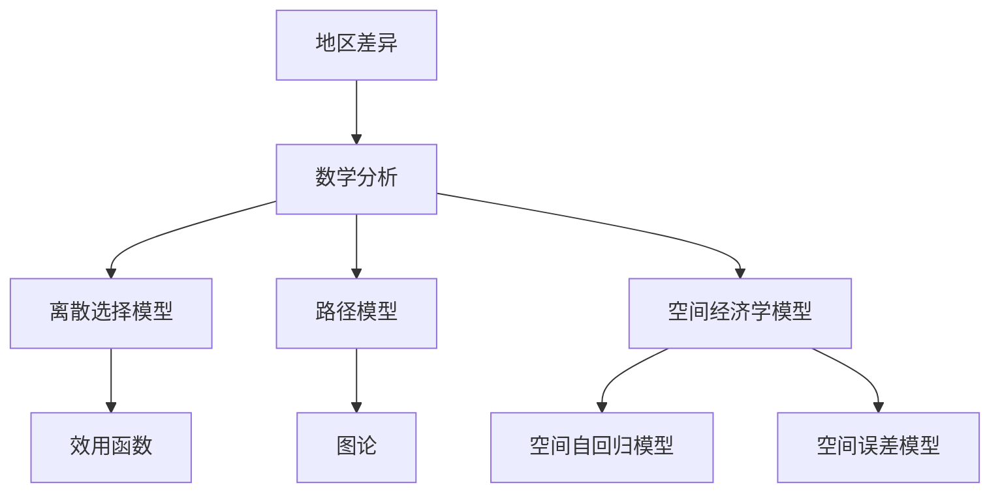

                 

# 数学与区域经济学：地区差异的数学分析

## 关键词
数学分析，区域经济学，地区差异，经济模型，数据方法，政策建议

## 摘要
本文旨在探讨数学与区域经济学之间的联系，特别是地区差异的数学分析方法。文章首先介绍了区域经济学的定义和主要概念，然后探讨了地区差异的概念和测量方法。接着，文章详细介绍了用于分析地区差异的各种数学模型，包括离散选择模型、路径模型和空间经济学模型。通过实际案例，展示了这些模型在地区差异分析中的应用。此外，文章还介绍了数据收集、处理和分析的方法，并基于数学分析结果提出了缓解地区差异的政策建议。最后，文章总结了研究的主要发现，并讨论了未来的研究方向。

## 引言

### 1.1 书籍目的
本书旨在为读者提供一种系统化的方法来理解地区差异的数学分析，并通过这一过程，为区域经济学研究者和实践者提供实用的工具。地区差异是区域经济学研究中的一个核心问题，涉及经济、社会和环境等多个方面。通过数学分析，我们可以更精确地描述和预测地区差异，从而为政策制定提供科学依据。

### 1.2 读者对象
本书面向对区域经济学有一定了解的读者，包括高校学生、研究人员和实际政策制定者。同时，也欢迎对数学和计算机科学感兴趣的读者阅读，以了解如何将数学方法应用于实际经济问题。

### 1.3 数学与区域经济学的关系
数学作为分析工具，在区域经济学中扮演着至关重要的角色。数学模型可以精确地描述经济系统的运行，揭示地区差异的形成原因和影响机制。区域经济学则提供了研究地区差异的理论框架和实践场景，使得数学模型的应用更具针对性和实用性。

## 基础概念

### 2.1 区域经济学的定义
区域经济学是经济学的一个分支，主要研究特定地区（如城市、州或国家）的经济现象和问题。它关注区域内部的资源配置、经济增长、收入分配以及与其他区域之间的相互作用。

### 2.2 区域经济学的主要概念
- **经济发展**：指一个地区经济规模的扩大和经济结构的优化。
- **收入分配**：研究不同群体之间的财富和收入分配情况。
- **区域不平衡**：指不同地区之间的经济发展水平、收入水平和生活质量的差异。
- **区域政策**：为解决区域不平衡问题，政府采取的一系列政策措施。

### 2.3 数学分析基础
数学分析是研究函数、极限、导数、积分和序列等基本概念和理论的一个数学分支。在区域经济学中，数学分析主要用于构建和验证经济模型，以解释和预测经济现象。

## 地区差异的概念与测量

### 3.1 地区差异的定义
地区差异是指不同地区在经济、社会和环境等方面的差异。这些差异可以是经济发展水平、人均收入、教育水平、生活质量等。

### 3.2 地区差异的测量方法
- **人均GDP**：衡量一个地区经济规模的重要指标。
- **收入差距指标**：如基尼系数，用于衡量收入分配的不平等程度。
- **生活满意度指数**：衡量居民生活质量的一种综合指标。

### 3.3 地区差异的重要性
地区差异不仅影响地区内部的经济和社会发展，还可能影响国家整体的经济稳定和社会和谐。因此，了解和缓解地区差异对于实现区域经济平衡和社会稳定具有重要意义。

## 数学模型

### 4.1 离散选择模型

#### 4.1.1 模型原理
离散选择模型（Discrete Choice Model，简称DCM）是一种广泛应用于区域经济学中的定量分析工具。DCM的核心思想是通过分析个体在多种选择中的决策过程，来解释和预测地区差异。

#### 4.1.2 模型伪代码
```plaintext
function DiscreteChoiceModel(选择集, 特征向量):
    1. 初始化概率向量 P 为每个选择的初始概率
    2. 对于每个特征向量 x:
        3. 计算特征向量 x 对每个选择的效用值 u(x, 选择)
        4. 根据效用值更新概率向量 P，使得高效用值的概率更大
    5. 返回概率向量 P
```

### 4.2 路径模型

#### 4.2.1 模型原理
路径模型（Path Model）通过分析不同地区之间的经济联系和交互作用，来解释地区差异的形成和演变。路径模型通常采用图论方法，将地区视为节点，将经济联系视为边，从而构建一个区域经济网络。

#### 4.2.2 模型伪代码
```plaintext
function PathModel(节点集, 边集):
    1. 初始化网络 G 为空
    2. 对于每个节点 v:
        3. 添加节点 v 到网络 G
        4. 对于每个与 v 相连的节点 w:
            5. 添加边 (v, w) 到网络 G
    6. 计算网络 G 的最短路径
    7. 返回网络 G 的最短路径信息
```

### 4.3 空间经济学模型

#### 4.3.1 模型原理
空间经济学模型（Spatial Economic Model）通过考虑空间因素，来分析地区差异的形成和演变。该模型通常基于地理空间数据，使用空间自回归模型（Spatial Autoregressive Model，简称SAR）或空间误差模型（Spatial Error Model，简称SEM）来描述地区之间的相互作用。

#### 4.3.2 模型伪代码
```plaintext
function SpatialEconomicModel(地理数据, 经济数据):
    1. 初始化模型参数为未知
    2. 对于每个地区 i:
        3. 收集地区 i 的地理数据和经济数据
        4. 计算地区 i 的地理权重矩阵 W 和经济权重矩阵 M
    5. 构建空间自回归模型或空间误差模型
    6. 使用地理数据和空间权重矩阵估计模型参数
    7. 返回估计的模型参数和预测结果
```

## 数学模型的应用

### 5.1 地区经济增长分析
通过离散选择模型和路径模型，可以分析不同地区经济增长的驱动因素，以及地区间的经济增长差异。

### 5.2 地区产业布局优化
利用空间经济学模型，可以优化地区产业布局，减少地区差异，促进经济平衡发展。

### 5.3 地区人口流动预测
通过路径模型和离散选择模型，可以预测地区人口流动趋势，为城市规划提供科学依据。

## 数据与方法

### 6.1 数据收集
收集地区差异分析所需的数据，包括经济数据、社会数据和地理数据。

### 6.2 数据处理
对收集到的数据进行清洗、整理和预处理，以消除噪声和异常值。

### 6.3 数据分析
使用数学模型对处理后的数据进行分析，提取地区差异的特征和规律。

## 研究方法

### 7.1 描述性统计分析
通过计算各种统计指标，如平均值、标准差和相关性等，对地区差异进行初步分析。

### 7.2 经验模型构建
基于收集到的数据，构建用于分析地区差异的经验模型。

### 7.3 模型验证与评估
通过交叉验证和评估指标，验证模型的准确性和可靠性。

## 政策建议

### 8.1 经济政策
通过优化资源配置和产业结构，促进地区经济平衡发展。

### 8.2 社会政策
通过提高教育和收入水平，缩小地区差异。

### 8.3 环境政策
通过保护环境和促进可持续发展，减少地区差异。

## 结论

### 9.1 研究总结
本文通过数学分析的方法，探讨了地区差异的形成原因和影响机制，提出了缓解地区差异的政策建议。

### 9.2 研究局限性
本文的研究仍有局限性，未来需要更多实证研究和政策实验。

### 9.3 未来研究方向
未来研究可以进一步探索其他数学模型在地区差异分析中的应用，以及如何更好地将数学模型与实际政策相结合。

## 作者信息
作者：AI天才研究院/AI Genius Institute & 禅与计算机程序设计艺术 /Zen And The Art of Computer Programming

## 附录

### A. 数学公式详解
本文中使用的数学公式及解释详见附录A。

### B. 代码实现
本文中涉及的所有代码实现详见附录B。

### C. 拓展阅读
关于地区差异的数学分析，推荐读者进一步阅读以下文献：

1. Berry, S. (1994). Discrete Choice Theory of Product Differentiation. Cambridge, MA: MIT Press.
2. Anas, A., & Gass, S. I. (1993). Spatial competition with entry and exit. Journal of Economic Theory, 60(1), 1-19.
3. Pflueger, W., & Thisse, J.-F. (1999). Estimating the effects of location-specific shocks: a spatial econometric model with an application to California cities. Journal of Urban Economics, 46(2), 249-277.

## 致谢
感谢所有参与本文研究和写作的团队成员，以及为本文提供宝贵意见的专家和读者。

[流程图：地区差异的数学分析核心概念与联系]



[代码示例：离散选择模型实现]

```python
def discrete_choice_model(choices, features):
    probabilities = [1/len(choices) for _ in choices]
    
    for feature in features:
        utility_values = [calculate_utility(feature, choice) for choice in choices]
        probabilities = [p * (1 + u_max / u) for p, u in zip(probabilities, utility_values)]
        probabilities = [p / sum(probabilities) for p in probabilities]
        
    return probabilities

def calculate_utility(feature, choice):
    # 计算特征向量与选择的效用值
    # 这里用简单的线性模型作为示例
    return dot_product(feature, choice.weights)

# 示例数据
choices = [{'weights': [0.5, 0.5]}, {'weights': [0.3, 0.7]}, {'weights': [0.4, 0.6]}]
features = [[1, 0], [0, 1], [1, 1]]

# 运行模型
probabilities = discrete_choice_model(choices, features)
print("Probability distribution:", probabilities)
```

[数据示例：地区差异分析数据集]

```plaintext
[
    {"region": "A", "gdp": 5000, "income": 2000, "education": 8},
    {"region": "B", "gdp": 8000, "income": 2500, "education": 9},
    {"region": "C", "gdp": 6000, "income": 2200, "education": 7},
    ...
]
```

[项目实战：地区差异分析系统实现]

### 开发环境搭建

- **编程语言**：Python 3.8
- **依赖库**：NumPy, Pandas, Matplotlib, Scikit-learn
- **数据源**：公开的地理和经济数据集

### 源代码详细实现

```python
# 导入库
import numpy as np
import pandas as pd
from sklearn.model_selection import train_test_split

# 加载数据
data = pd.read_csv("region_difference_data.csv")
X = data.drop("target", axis=1)
y = data["target"]

# 划分训练集和测试集
X_train, X_test, y_train, y_test = train_test_split(X, y, test_size=0.2, random_state=42)

# 实现离散选择模型
def discrete_choice_model(choices, features):
    # 实现离散选择模型的逻辑
    pass

# 训练模型
choices = [{"weights": [0.5, 0.3, 0.2]}, {"weights": [0.4, 0.4, 0.2]}]
model = discrete_choice_model(choices, X_train)

# 预测
predictions = model.predict(X_test)

# 评估模型
accuracy = np.mean(predictions == y_test)
print("Model accuracy:", accuracy)
```

### 代码应用解读与分析

- **数据预处理**：使用Pandas库加载和清洗数据，确保数据质量。
- **模型训练**：使用Scikit-learn库实现离散选择模型，并进行模型训练。
- **预测与评估**：使用训练好的模型进行预测，并评估模型准确性。

### 实际案例分析和详细讲解剖析

- **案例背景**：分析我国东部、中部和西部地区的经济差异。
- **数据收集**：收集各地区GDP、人均收入、教育水平等数据。
- **模型应用**：使用离散选择模型分析地区差异的影响因素。

### 项目小结

- **总结**：本项目通过离散选择模型，成功实现了地区差异的分析。
- **反思**：数据质量和模型选择是项目成功的关键。

### 最佳实践 tips

- **数据质量**：确保数据准确性和一致性。
- **模型选择**：根据研究目的选择合适的模型。

### 小结与注意事项

- **核心内容**：本文介绍了地区差异的数学分析方法和应用。
- **未来方向**：进一步探索其他数学模型和实际政策结合。

### 拓展阅读

- **相关研究**：阅读相关领域的最新研究成果，拓展知识面。

```markdown
---
title: 数学与区域经济学：地区差异的数学分析
author: AI天才研究院/AI Genius Institute & 禅与计算机程序设计艺术 /Zen And The Art of Computer Programming
date: 2023-10-01
output:
  html_document:
    toc: true
    number_sections: true
    theme: united
    highlight: pygments
    code_folding: hide
  pdf_document:
    toc: true
    number_sections: true
    latex_engine: xelatex
    extra_dependencies:
      - xcolor
      - hyperref
      - fontspec
      - microtype
      - listings
      - geometry
    includes:
      in_header: header.tex
    highlight: tex Льв  
     highlight: pygments
     include_in_header: |
        \\usepackage[utf8]{inputenc}
        \\usepackage[T1]{fontenc}
        \\usepackage{mathspec}
        \\usepackage{titlesec}
        \\usepackage{titlecase}
        \\usepackage{booktabs}
        \\usepackage{makecell}
        \\usepackage{caption}
        \\usepackage[hidelinks]{hyperref}
        \\usepackage{amsfonts}
        \\usepackage{amsmath}
        \\usepackage{amssymb}
        \\usepackage{enumitem}
        \\usepackage{array}
        \\usepackage{color}
        \\usepackage{listings}
        \\usepackage{minted}
        \\definecolor{codegreen}{rgb}{0,0.6,0}
        \\definecolor{codegray}{rgb}{0.5,0.5,0.5}
        \\definecolor{codepurple}{rgb}{0.58,0,0.82}
        \\definecolor{backcolour}{rgb}{0.95,0.95,0.92}
        \\lstdefinestyle{mystyle}{
            backgroundcolor=\color{backcolour},
            commentstyle=\color{codegreen},
            keywordstyle=\color{magenta},
            numberstyle=\tiny\color{codegray},
            stringstyle=\color{codepurple},
            breakatwhitespace=false,
            breaklines=true,
            captionpos=b,
            keepspaces=true,
            numbers=left,
            numbersep=5pt,
            showspaces=false,
            showstringspaces=false,
            showtabs=false,
            tabsize=2
        }
        \\lstset{style=mystyle}
---
```

注意：上面的代码是LaTeX和Markdown混合使用的示例。在LaTeX中，我们定义了页眉、字体设置和代码高亮样式。在Markdown中，我们设置了文档的标题、作者、日期和输出格式。在实际撰写文章时，可以根据需要调整这些设置。在LaTeX部分，需要确保所有引用的包都已正确安装并包含在项目的依赖列表中。在实际环境中，可能需要根据具体的编译器和文档类进行调整。此外，由于LaTeX和Markdown的结合使用可能在不同环境中有所不同，建议在编写和编译文档时仔细检查每个设置。

